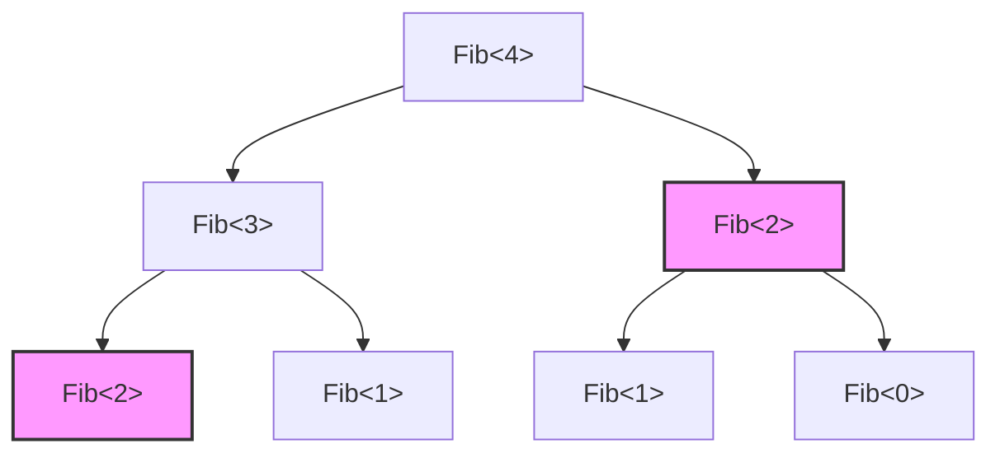
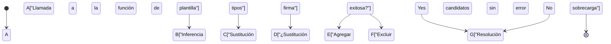
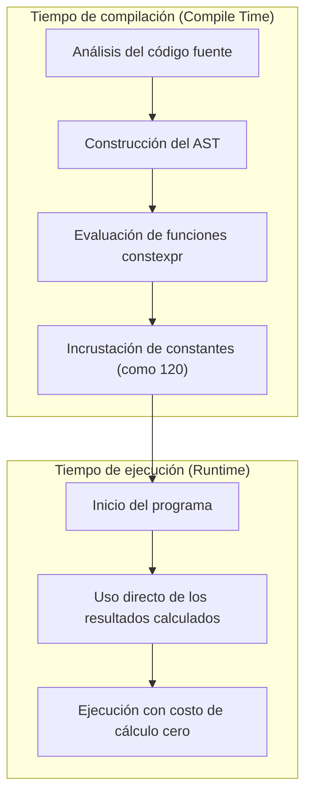

El mayor atractivo del lenguaje C++, y al mismo tiempo su mayor terreno inexplorado, es la "Metaprogramación de plantillas" (Template Metaprogramming: TMP). Esta es una técnica que permite adelantar los cálculos que normalmente se realizan en tiempo de ejecución (run-time) para que se lleven a cabo en tiempo de compilación (compile-time), cuando el compilador interpreta el código fuente y genera el binario.

En este artículo, explicaremos con gran detalle la evolución de las plantillas de C++, comenzando por el contexto histórico de cómo adquirieron su capacidad de cálculo, pasando por el SFINAE clásico, hasta los modernos `constexpr`, `if constexpr`, e incluso `consteval` y los Conceptos (Concepts) introducidos en C++20, todo esto acompañado de ejemplos prácticos de código y contexto matemático.

---

## 1. El amanecer de la metaprogramación de plantillas: el descubrimiento accidental de la completitud de Turing

### 1.1 ¿Qué es la completitud de Turing?

En ciencias de la computación, ser "Turing completo" (Turing Complete) significa tener la misma capacidad de cálculo que una máquina de Turing universal. En términos sencillos, se refiere a un sistema que puede expresar "bifurcaciones condicionales" y "bucles infinitos (o recursión)", siendo capaz de describir y ejecutar cualquier algoritmo arbitrario.

### 1.2 El descubrimiento de Erwin Unruh

En 1994, durante una reunión del comité de estandarización de C++, una persona llamada Erwin Unruh presentó cierto código de C++. Aunque el código fallaba al compilar, sorprendentemente, **los mensajes de error generados por el compilador contenían una secuencia de números primos**.

El compilador realizaba procesos recursivos durante la instanciación (materialización) de las plantillas, y emitía los resultados de esos cálculos en forma de mensajes de error. En otras palabras, fue el momento en que se demostró que la función de plantillas de C++ contenía un **sistema de cálculo Turing completo**, algo que ni siquiera su diseñador, Bjarne Stroustrup, había previsto.

---

## 2. Metaprogramación de plantillas clásica (C++98 / C++03)

La metaprogramación de plantillas inicial adoptó un estilo de programación puramente funcional, utilizando estructuras (`struct`) y la especialización de plantillas (Template Specialization).

### 2.1 Cálculo del factorial

Primero veamos el ejemplo más básico, el cálculo del factorial ($N!$). Matemáticamente se define de la siguiente manera:

$$
N! = 
\begin{cases} 
1 & (N = 0) \\
N \times (N - 1)! & (N > 0)
\end{cases}
$$

Si escribimos esto utilizando plantillas de C++98, quedaría así:

```cpp
#include <iostream>

// Plantilla primaria (caso general de la recursión)
template <int N>
struct Factorial {
    static const int value = N * Factorial<N - 1>::value;
};

// Especialización explícita de la plantilla (caso base de la recursión)
template <>
struct Factorial<0> {
    static const int value = 1;
};

int main() {
    // Se calcula en tiempo de compilación y se incrusta como una constante
    std::cout << "5! = " << Factorial<5>::value << std::endl; 
    return 0;
}
```

Lo importante aquí es que `Factorial<5>::value` no se calcula en tiempo de ejecución, sino que se expande en tiempo de compilación. En el binario final se genera un código equivalente a `std::cout << "5! = " << 120 << std::endl;`. Esto reduce a cero la sobrecarga en tiempo de ejecución (overhead).

### 2.2 Sucesión de Fibonacci y complejidad computacional

A continuación, calculemos la sucesión de Fibonacci. La relación de recurrencia es la siguiente:

$$
F_n = F_{n-1} + F_{n-2} \quad (F_0 = 0, F_1 = 1)
$$

```cpp
template <int N>
struct Fib {
    static const int value = Fib<N - 1>::value + Fib<N - 2>::value;
};

template <>
struct Fib<0> { static const int value = 0; };

template <>
struct Fib<1> { static const int value = 1; };
```

Si escribimos esta implementación como una función recursiva en tiempo de ejecución, la complejidad sería de tiempo exponencial $O(2^N)$ porque repite los mismos cálculos una y otra vez. Sin embargo, **durante la instanciación de plantillas en tiempo de compilación, los tipos con los mismos argumentos de plantilla se instancian solo una vez** (un efecto similar a la memoización). Por lo tanto, la complejidad en tiempo de compilación es, en la práctica, $O(N)$.

El siguiente diagrama muestra cómo el compilador resuelve las instancias.



En lo anterior, `Fib<2>`, que tienen el mismo color y forma, se instancian solo una vez dentro del compilador, y a partir de la segunda vez se utiliza la definición de tipo almacenada en caché.

---

## 3. SFINAE y Type Traits (C++11)

A medida que evolucionaba la metaprogramación, se dio más importancia a "la manipulación y evaluación de tipos" y no solo al "cálculo de valores". Aquí es donde entra en juego **SFINAE** (Substitution Failure Is Not An Error: El fallo en la sustitución no es un error).

### 3.1 El mecanismo de SFINAE

Durante la resolución de sobrecarga de funciones de plantilla, el compilador infiere los argumentos de la plantilla a partir de los argumentos pasados y sustituye los tipos en la firma (la parte de la declaración de la función). En este momento, si ocurre una contradicción de tipos y la sustitución falla, el compilador no genera un error de compilación inmediatamente, sino que **descarta silenciosamente esa opción de sobrecarga** y busca la siguiente candidata.



### 3.2 Compilación condicional utilizando std::enable_if

Al usar el encabezado `<type_traits>` y `std::enable_if` introducidos en C++11, es posible habilitar funciones solo para aquellos tipos que cumplen con ciertas condiciones.

```cpp
#include <iostream>
#include <type_traits>

// Sobrecarga habilitada solo cuando T es un tipo entero
template <typename T>
typename std::enable_if<std::is_integral<T>::value>::type
print_type(T val) {
    std::cout << "Integer: " << val << std::endl;
}

// Sobrecarga habilitada solo cuando T es un tipo de punto flotante
template <typename T>
typename std::enable_if<std::is_floating_point<T>::value>::type
print_type(T val) {
    std::cout << "Floating point: " << val << std::endl;
}

int main() {
    print_type(42);      // Integer: 42
    print_type(3.1415);  // Floating point: 3.1415
    // print_type("str"); // Error de compilación: no hay una función que coincida
}
```

Este enfoque era sumamente potente, pero expresiones como `typename std::enable_if<...>::type` eran muy verbosas, lo cual fue uno de los motivos por los que la gente evitaba la metaprogramación en C++, considerando que "parecía criptografía".

---

## 4. Cambio de paradigma: la introducción de constexpr (C++11/C++14)

En C++11 se introdujo la palabra clave `constexpr`, que puede considerarse una revolución en la historia de la metaprogramación. Gracias a esto, **fue posible realizar cálculos en tiempo de compilación utilizando la sintaxis normal de funciones**, sin tener que recurrir a la recursión poco natural de las plantillas.

### 4.1 constexpr en C++11

En la época de C++11, las funciones `constexpr` tenían una estricta limitación: "el cuerpo de la función debía estar compuesto únicamente por una sola instrucción `return`". Por lo tanto, no se podían utilizar bucles y era necesario depender de los operadores ternarios y la recursión.

```cpp
// Fibonacci con constexpr en C++11
constexpr int fib_cxx11(int n) {
    return (n <= 1) ? n : fib_cxx11(n - 1) + fib_cxx11(n - 2);
}
```

### 4.2 Relajación de constexpr en C++14

En C++14, estas restricciones se flexibilizaron considerablemente. Se hizo posible utilizar declaraciones de variables locales, sentencias `if`, bucles `for`, entre otros, dentro de funciones `constexpr`. Esto permite escribir algoritmos de forma tan natural como si fuesen a ejecutarse en tiempo de ejecución.

```cpp
// Fibonacci con constexpr en C++14
constexpr int fib_cxx14(int n) {
    if (n <= 1) return n;
    int a = 0, b = 1;
    for (int i = 2; i <= n; ++i) {
        int temp = a + b;
        a = b;
        b = temp;
    }
    return b;
}
```

Si este código puede ser evaluado en tiempo de compilación, se calculará durante la compilación. Si se le pasan argumentos en tiempo de ejecución, se calculará durante la ejecución como una función normal.



---

## 5. Dominando la bifurcación condicional estática: if constexpr (C++17)

En C++17 se introdujo `if constexpr`, lo que hizo que la verbosa resolución de sobrecargas usando SFINAE fuera cosa del pasado. Es una sentencia `if` que se evalúa en tiempo de compilación. Si la condición es `false`, ese bloque ni siquiera se instancia y se descarta por completo del proceso de compilación.

Si reescribimos el ejemplo anterior de SFINAE utilizando `if constexpr`, se vuelve sorprendentemente sencillo.

```cpp
#include <iostream>
#include <type_traits>

template <typename T>
void print_type(T val) {
    if constexpr (std::is_integral_v<T>) {
        std::cout << "Integer: " << val << std::endl;
    } 
    else if constexpr (std::is_floating_point_v<T>) {
        std::cout << "Floating point: " << val << std::endl;
    } 
    else {
        std::cout << "Other type" << std::endl;
    }
}
```

Al usar `if constexpr`, podemos unificar en una misma plantilla de función los procesos destinados a diferentes tipos, lo que ha mejorado drásticamente la legibilidad del código.

---

## 6. La esencia del C++ moderno: consteval y Concepts (C++20)

C++20 representó la actualización más grande desde C++11. También en el área de la metaprogramación se lograron avances espectaculares.

### 6.1 Cálculo obligatorio en tiempo de compilación: consteval

Mientras que `constexpr` era una directiva que indicaba "calcular en tiempo de compilación si se dan las condiciones", permitiendo también su evaluación en tiempo de ejecución, `consteval`, añadido en C++20, define una **función inmediata (Immediate Function) que "debe evaluarse obligatoriamente en tiempo de compilación"**. Si se intenta evaluar en tiempo de ejecución, producirá un error de compilación.

```cpp
// Fuerzo asegurar el cálculo en tiempo de compilación
consteval int square(int n) {
    return n * n;
}

int main() {
    constexpr int a = square(5); // OK: Evaluación en tiempo de compilación
    
    int x = 5;
    // int b = square(x); // Error: no se puede evaluar porque 'x' es una variable en tiempo de ejecución
}
```

### 6.2 Aclarando los requisitos de las plantillas: Concepts

Uno de los mayores puntos débiles de la metaprogramación era "la complejidad de los mensajes de error". Al pasar un tipo incorrecto como argumento a una plantilla, se llegaban a emitir cientos de líneas de errores incomprensibles.

Con los **Conceptos (Concepts)** de C++20, es posible especificar las restricciones de los tipos aceptados por la plantilla de una manera más parecida al lenguaje natural, y los mensajes de error se vuelven extremadamente claros.

```cpp
#include <concepts>
#include <iostream>

// Se requiere que T sea un tipo entero
template <std::integral T>
T add(T a, T b) {
    return a + b;
}

int main() {
    std::cout << add(10, 20) << std::endl;      // OK
    // std::cout << add(1.5, 2.5) << std::endl; // Error: no satisface std::integral
}
```

---

## 7. Ejemplo práctico: verificación de números primos en tiempo de compilación y optimización de algoritmos

Movilizando todo el conocimiento adquirido hasta ahora, escribamos un código para verificar números primos en tiempo de compilación. Aquí utilizaremos la función moderna de C++20 (`consteval`).

La complejidad temporal del algoritmo de verificación de números primos es $O(N)$ si se comprueba de manera ingenua, pero dado que es suficiente con comprobar hasta $\sqrt{N}$, el algoritmo óptimo tiene una complejidad de $O(\sqrt{N})$.

```cpp
#include <iostream>

// Función auxiliar para calcular la parte entera de la raíz cuadrada en tiempo de compilación
consteval int compile_time_sqrt(int n) {
    if (n <= 1) return n;
    int res = 1;
    while (res * res <= n) {
        res++;
    }
    return res - 1;
}

// Verificación de números primos utilizando consteval de C++20
consteval bool is_prime(int n) {
    if (n <= 1) return false;
    if (n == 2 || n == 3) return true;
    if (n % 2 == 0) return false;
    
    int limit = compile_time_sqrt(n);
    for (int i = 3; i <= limit; i += 2) {
        if (n % i == 0) return false;
    }
    return true;
}

int main() {
    // Evaluado completamente en tiempo de compilación
    static_assert(is_prime(104729) == true, "104729 should be prime!");
    static_assert(is_prime(100) == false, "100 should not be prime!");
    
    constexpr bool p = is_prime(9973);
    std::cout << "Is 9973 prime? " << std::boolalpha << p << std::endl;

    return 0;
}
```

En el código anterior, tanto `compile_time_sqrt` como `is_prime` están designados con `consteval`, por lo que estos cálculos se completan al 100% durante la compilación. En el binario del archivo ejecutable, simplemente se incrustan las constantes (valores booleanos) `true` o `false`.

### 7.1 Expresión matemática de la complejidad computacional

En la verificación de números primos, el valor máximo que debe comprobarse es $\lfloor \sqrt{N} \rfloor$.
Por lo tanto, el tiempo de cálculo en el peor de los casos $T(N)$ es el siguiente:

$$
T(N) = O(\sqrt{N})
$$

Si esto se calcula en tiempo de ejecución, por ejemplo, en procesamientos criptográficos o en la inicialización de simulaciones a gran escala, podría generar un retraso que va desde cientos de milisegundos hasta varios segundos. Sin embargo, si se utiliza la metaprogramación en tiempo de compilación, el compilador absorbe por completo este costo de $T(N)$, y el costo en el tiempo de ejecución para el usuario será de $O(1)$.

---

## 8. Las luces y sombras del cálculo en tiempo de compilación

Hasta ahora hemos visto la potente función de cálculo en tiempo de compilación de C++, pero esto no significa que deba usarse incondicionalmente en exceso.

### Ventajas
- **Cero sobrecarga en tiempo de ejecución**: Como los resultados de los cálculos se convierten en constantes, la velocidad de ejecución es la máxima posible.
- **Detección temprana de errores**: Al combinarlo con elementos como `static_assert`, se pueden detectar con certeza fallos lógicos o inconsistencias de tipos en el momento de la compilación.

### Desventajas
- **Aumento explosivo del tiempo de compilación**: Dado que los cálculos internos del compilador se realizan en un entorno interpretado dedicado (el evaluador de AST del compilador), son mucho más lentos en comparación con la ejecución de código nativo en tiempo de ejecución. Si se intenta realizar cálculos enormes de matrices durante la compilación, existe el riesgo de que el tiempo de construcción se incremente a niveles de varias horas.
- **Hinchamiento del binario (Code Bloat)**: Si las plantillas se instancian con diversos tipos, se generan múltiples funciones, lo que puede causar el fenómeno en el que el tamaño del archivo ejecutable aumenta considerablemente.

---

## 9. Conclusión

La metaprogramación de plantillas en C++ comenzó como un "producto accidental (hack)" en el que se emitían números primos desde mensajes de error, y tras años de trabajo de estandarización, ha evolucionado hasta convertirse en características de lenguaje sofisticadas (`constexpr`, `if constexpr`, `Concepts`).

En el C++ moderno, la barrera para el término "metaprogramación" se ha reducido drásticamente, y ahora es posible beneficiarse del cálculo en tiempo de compilación escribiendo código tan intuitivo como el de un programa normal.

En los sistemas embebidos, motores de juegos, o sistemas de negociación de alta frecuencia (HFT, por sus siglas en inglés) donde se exige un rendimiento extremo, esta tecnología seguirá siendo, sin duda, un arma indispensable.

La evolución de C++ aún no se detiene. En los próximos estándares, como C++23 y C++26, nos esperan características aún más potentes como la reflexión en tiempo de compilación. Animo a todos a que dominen la programación de plantillas moderna y disfruten del mundo de la optimización más allá de los límites.
