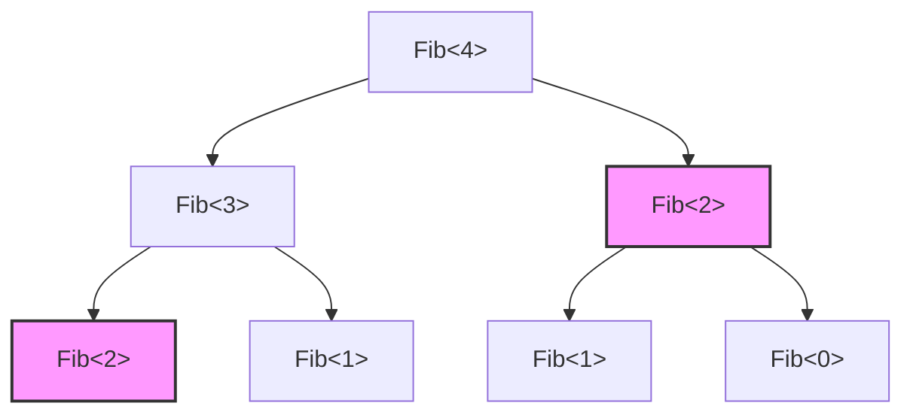
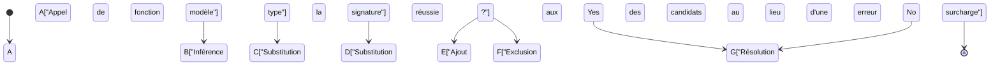
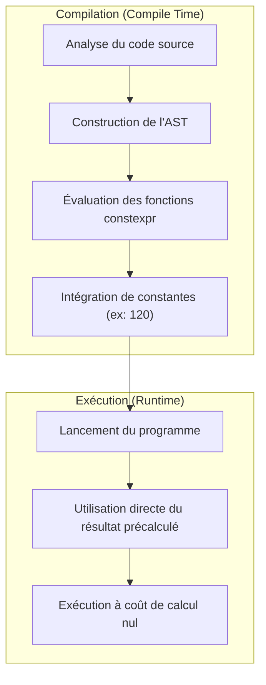

Le plus grand attrait du langage C++, et en même temps son plus grand repaire de démons, est la « métaprogrammation de modèles » (Template Metaprogramming : TMP). C'est une technique qui permet d'avancer les calculs effectués à l'exécution (Run-time) d'un programme pour les réaliser à la compilation (Compile-time), lorsque le compilateur analyse le code source et génère le binaire.

Dans cet article, nous expliquerons de manière extrêmement détaillée, à l'aide d'exemples de code pratiques et de contextes mathématiques, l'évolution de la façon dont les modèles C++ ont acquis leur puissance de calcul. Nous partirons du contexte historique pour aller du SFINAE classique, en passant par les modernes `constexpr` et `if constexpr`, jusqu'à `consteval` et aux Concepts introduits dans C++20.

---

## 1. L'aube de la métaprogrammation de modèles : la découverte fortuite de la complétude de Turing

### 1.1 Qu'est-ce que la complétude de Turing ?

En informatique, être « Turing-complet » (Turing Complete) signifie avoir la même puissance de calcul qu'une machine de Turing universelle. En d'autres termes, il s'agit d'un système capable d'exprimer des « branchements conditionnels » et des « boucles infinies (ou récursions) », et de décrire et d'exécuter n'importe quel algorithme.

### 1.2 La découverte d'Erwin Unruh

En 1994, lors d'une réunion du comité de normalisation du C++, un certain Erwin Unruh a présenté un code C++. Bien que ce code échouât à la compilation, **les messages d'erreur générés par le compilateur contenaient une suite de nombres premiers**.

Le compilateur avait effectué un traitement récursif lors de l'instanciation du modèle et affiché le résultat de ce calcul sous forme de messages d'erreur. C'était le moment où il a été prouvé que le système de modèles du C++ contenait **un système de calcul Turing-complet**, chose que même le concepteur du langage, Bjarne Stroustrup, n'avait pas prévue.

---

## 2. Métaprogrammation de modèles classique (C++98 / C++03)

La métaprogrammation de modèles à ses débuts adoptait un style de programmation fonctionnelle pure utilisant des structures (`struct`) et la spécialisation de modèles (Template Specialization).

### 2.1 Calcul de la factorielle (Factorial)

Commençons par l'exemple le plus fondamental : le calcul de la factorielle ($N!$). Mathématiquement, elle est définie comme suit :

$$
N! = 
\begin{cases} 
1 & (N = 0) \\
N \times (N - 1)! & (N > 0)
\end{cases}
$$

Écrit avec des modèles C++98, cela donne ceci :

```cpp
#include <iostream>

// Modèle principal (cas général de récursion)
template <int N>
struct Factorial {
    static const int value = N * Factorial<N - 1>::value;
};

// Spécialisation explicite du modèle (cas de base de la récursion)
template <>
struct Factorial<0> {
    static const int value = 1;
};

int main() {
    // Calculé à la compilation et intégré comme une constante
    std::cout << "5! = " << Factorial<5>::value << std::endl; 
    return 0;
}
```

Ce qui est important ici, c'est que `Factorial<5>::value` n'est pas calculé à l'exécution. Il est développé à la compilation, et le binaire final contient un code équivalent à `std::cout << "5! = " << 120 << std::endl;`. Cela permet d'obtenir un surcoût d'exécution nul.

### 2.2 Suite de Fibonacci et complexité temporelle

Ensuite, calculons la suite de Fibonacci. La relation de récurrence est la suivante :

$$
F_n = F_{n-1} + F_{n-2} \quad (F_0 = 0, F_1 = 1)
$$

```cpp
template <int N>
struct Fib {
    static const int value = Fib<N - 1>::value + Fib<N - 2>::value;
};

template <>
struct Fib<0> { static const int value = 0; };

template <>
struct Fib<1> { static const int value = 1; };
```

Si l'on écrit cette implémentation avec une fonction récursive à l'exécution, le même calcul est répété de nombreuses fois, et la complexité temporelle devient exponentielle, soit $O(2^N)$. Cependant, **lors de l'instanciation de modèles à la compilation, un type ayant les mêmes arguments de modèle n'est instancié qu'une seule fois** (un effet similaire à la mémoïsation). Par conséquent, la complexité de calcul à la compilation est effectivement de $O(N)$.

Le schéma ci-dessous montre comment le compilateur résout les instances :



Dans l'exemple ci-dessus, le `Fib<2>` ayant la même couleur et la même forme n'est instancié qu'une seule fois par le compilateur, et la définition de type mise en cache est utilisée pour les fois suivantes.

---

## 3. SFINAE et Traits de type (C++11)

À mesure que la métaprogrammation évoluait, on a commencé à accorder de l'importance non seulement au « calcul de valeurs », mais aussi à la « manipulation et l'évaluation de types ». C'est ici qu'intervient **SFINAE** (Substitution Failure Is Not An Error : L'échec de substitution n'est pas une erreur).

### 3.1 Le mécanisme de SFINAE

Lors de la résolution de la surcharge des fonctions de modèles, le compilateur déduit les arguments du modèle à partir des arguments passés et substitue les types dans la signature (la partie de déclaration de la fonction). À ce moment-là, si une contradiction de type survient et que la substitution échoue, le compilateur ne déclenche pas immédiatement une erreur de compilation, mais **exclut silencieusement ce candidat à la surcharge** pour chercher le candidat suivant.



### 3.2 Compilation conditionnelle avec std::enable_if

En utilisant l'en-tête `<type_traits>` et `std::enable_if` introduits dans C++11, il est possible d'activer une fonction uniquement pour les types remplissant certaines conditions.

```cpp
#include <iostream>
#include <type_traits>

// Surcharge activée uniquement si T est un type entier
template <typename T>
typename std::enable_if<std::is_integral<T>::value>::type
print_type(T val) {
    std::cout << "Integer: " << val << std::endl;
}

// Surcharge activée uniquement si T est un type à virgule flottante
template <typename T>
typename std::enable_if<std::is_floating_point<T>::value>::type
print_type(T val) {
    std::cout << "Floating point: " << val << std::endl;
}

int main() {
    print_type(42);      // Integer: 42
    print_type(3.1415);  // Floating point: 3.1415
    // print_type("str"); // Erreur de compilation : aucune fonction correspondante
}
```

Bien que cette approche fût extrêmement puissante, les expressions comme `typename std::enable_if<...>::type` étaient très verbeuses et constituaient l'une des raisons pour lesquelles on évitait la métaprogrammation C++ en disant qu'elle ressemblait à de la cryptographie.

---

## 4. Changement de paradigme : introduction de constexpr (C++11/C++14)

En C++11, le mot-clé `constexpr` a été introduit, ce que l'on peut qualifier de révolution dans l'histoire de la métaprogrammation. Grâce à cela, le calcul à la compilation est devenu possible **en utilisant l'écriture habituelle des fonctions**, sans avoir recours à une récursion de modèles peu naturelle.

### 4.1 constexpr en C++11

À l'époque de C++11, les fonctions `constexpr` étaient soumises à une contrainte stricte : « le corps devait être constitué d'une seule instruction `return` ». C'est pourquoi il fallait s'appuyer sur l'opérateur ternaire et la récursion sans pouvoir utiliser de boucles.

```cpp
// Fibonacci avec constexpr en C++11
constexpr int fib_cxx11(int n) {
    return (n <= 1) ? n : fib_cxx11(n - 1) + fib_cxx11(n - 2);
}
```

### 4.2 Assouplissement de constexpr en C++14

En C++14, cette contrainte a été considérablement assouplie. Les déclarations de variables locales, les instructions `if`, les boucles `for`, etc., sont devenus utilisables dans les fonctions `constexpr`. Cela permet d'écrire des algorithmes tout aussi simplement qu'à l'exécution.

```cpp
// Fibonacci avec constexpr en C++14
constexpr int fib_cxx14(int n) {
    if (n <= 1) return n;
    int a = 0, b = 1;
    for (int i = 2; i <= n; ++i) {
        int temp = a + b;
        a = b;
        b = temp;
    }
    return b;
}
```

Ce code sera calculé à la compilation s'il peut être évalué à la compilation. S'il reçoit des arguments à l'exécution, il sera calculé à l'exécution comme une fonction normale.



---

## 5. Maîtriser le branchement conditionnel statique : if constexpr (C++17)

En C++17, la construction `if constexpr` a été introduite, reléguant au passé la résolution de surcharge verbeuse basée sur SFINAE. Il s'agit d'une instruction `if` évaluée à la compilation ; le bloc dont la condition est `false` n'est même pas instancié et est complètement ignoré de la cible de compilation.

Réécrire l'exemple SFINAE précédent avec `if constexpr` le rend incroyablement plus simple.

```cpp
#include <iostream>
#include <type_traits>

template <typename T>
void print_type(T val) {
    if constexpr (std::is_integral_v<T>) {
        std::cout << "Integer: " << val << std::endl;
    } 
    else if constexpr (std::is_floating_point_v<T>) {
        std::cout << "Floating point: " << val << std::endl;
    } 
    else {
        std::cout << "Other type" << std::endl;
    }
}
```

Grâce à `if constexpr`, le traitement destiné à des types différents peut être regroupé dans la même fonction modèle, améliorant considérablement la lisibilité du code.

---

## 6. L'apogée du C++ moderne : consteval et Concepts (C++20)

C++20 a représenté la plus grosse mise à jour depuis C++11. Dans le domaine de la métaprogrammation, il a également connu une évolution spectaculaire.

### 6.1 Calcul obligatoire à la compilation : consteval

`constexpr` était une indication de « calculer à la compilation si les conditions le permettent », mais l'évaluation à l'exécution restait autorisée. En revanche, `consteval`, introduit en C++20, définit une **fonction immédiate (Immediate Function) qui « doit obligatoirement être évaluée à la compilation »**. Tenter de l'évaluer à l'exécution entraîne une erreur de compilation.

```cpp
// Force un calcul garanti à la compilation
consteval int square(int n) {
    return n * n;
}

int main() {
    constexpr int a = square(5); // OK : évaluation à la compilation
    
    int x = 5;
    // int b = square(x); // Erreur : x est une variable d'exécution, donc ne peut pas être évaluée
}
```

### 6.2 Clarifier les exigences des modèles : Concepts

L'une des plus grandes faiblesses de la métaprogrammation était la « difficulté des messages d'erreur ». En passant un type incorrect à un argument de modèle, le compilateur pouvait afficher des centaines de lignes d'erreurs incompréhensibles.

En utilisant les **Concepts (concepts)** de C++20, les contraintes de types acceptées par un modèle peuvent être précisées dans un format proche du langage naturel, rendant ainsi les messages d'erreur extrêmement clairs.

```cpp
#include <concepts>
#include <iostream>

// Exige que T soit un type entier
template <std::integral T>
T add(T a, T b) {
    return a + b;
}

int main() {
    std::cout << add(10, 20) << std::endl;      // OK
    // std::cout << add(1.5, 2.5) << std::endl; // Erreur : ne satisfait pas std::integral
}
```

---

## 7. Exemple pratique : vérification des nombres premiers à la compilation et optimisation d'algorithmes

Mobilisons toutes les connaissances acquises jusqu'ici pour écrire un code qui vérifie les nombres premiers à la compilation. Nous utiliserons ici une fonctionnalité moderne de C++20 (`consteval`).

La complexité temporelle de l'algorithme de vérification des nombres premiers est de $O(N)$ si on vérifie de façon naïve, mais comme il suffit de vérifier jusqu'à $\sqrt{N}$, l'algorithme optimal est en $O(\sqrt{N})$.

```cpp
#include <iostream>

// Fonction d'assistance pour calculer la partie entière de la racine carrée à la compilation
consteval int compile_time_sqrt(int n) {
    if (n <= 1) return n;
    int res = 1;
    while (res * res <= n) {
        res++;
    }
    return res - 1;
}

// Vérification de primalité avec consteval en C++20
consteval bool is_prime(int n) {
    if (n <= 1) return false;
    if (n == 2 || n == 3) return true;
    if (n % 2 == 0) return false;
    
    int limit = compile_time_sqrt(n);
    for (int i = 3; i <= limit; i += 2) {
        if (n % i == 0) return false;
    }
    return true;
}

int main() {
    // Entièrement évalué à la compilation
    static_assert(is_prime(104729) == true, "104729 should be prime!");
    static_assert(is_prime(100) == false, "100 should not be prime!");
    
    constexpr bool p = is_prime(9973);
    std::cout << "Is 9973 prime? " << std::boolalpha << p << std::endl;

    return 0;
}
```

Dans le code ci-dessus, `compile_time_sqrt` et `is_prime` sont tous deux spécifiés comme `consteval`, ce qui signifie que ces calculs sont complétés à 100 % à la compilation. Seule une constante (valeur booléenne) telle que `true` ou `false` est intégrée dans le binaire du fichier exécutable.

### 7.1 Expression mathématique de la complexité

Lors de la vérification de primalité, la valeur maximale à vérifier est $\lfloor \sqrt{N} \rfloor$.
Ainsi, le temps de calcul dans le pire des cas $T(N)$ est défini comme suit :

$$
T(N) = O(\sqrt{N})
$$

Si on calcule cela à l'exécution, cela pourrait entraîner un retard de plusieurs centaines de millisecondes à quelques secondes lors de l'initialisation de traitements cryptographiques ou de simulations à grande échelle, par exemple. Cependant, grâce à la métaprogrammation à la compilation, ce coût $T(N)$ est entièrement pris en charge par le compilateur, et le coût d'exécution pour l'utilisateur devient de $O(1)$.

---

## 8. L'ombre et la lumière du calcul à la compilation

Nous avons vu les puissantes fonctionnalités de calcul à la compilation du C++, mais cela ne signifie pas qu'on doive en abuser sans condition.

### Avantages
- **Zéro surcoût à l'exécution (Zero overhead)** : Les résultats des calculs devenant des constantes, la vitesse d'exécution est optimale.
- **Détection précoce des bugs** : En combinant cela avec `static_assert`, les failles logiques ou les incohérences de types peuvent être interceptées à coup sûr dès la compilation.

### Inconvénients
- **Explosion du temps de compilation** : Les calculs internes au compilateur s'effectuent dans un environnement interpréteur dédié (l'évaluateur d'AST du compilateur), ce qui est beaucoup plus lent que l'exécution de code natif à l'exécution. Si on force le compilateur à réaliser des calculs matriciels massifs, le temps de compilation risque d'exploser et d'atteindre plusieurs heures.
- **Obésité du binaire (Code Bloat)** : L'instanciation de modèles avec de multiples types peut générer un grand nombre de fonctions, entraînant une augmentation de la taille du fichier exécutable.

---

## 9. Conclusion

La métaprogrammation de modèles en C++ a commencé comme un « accident fortuit (hack) » où des nombres premiers ont été affichés dans des messages d'erreur. Après de nombreuses années de standardisation, elle a évolué pour devenir un ensemble de fonctionnalités linguistiques sophistiquées (`constexpr`, `if constexpr`, `Concepts`).

Dans le C++ moderne, la barrière à l'entrée de la « métaprogrammation » a drastiquement baissé, et il est possible de bénéficier du calcul à la compilation en écrivant un code intuitif, comme pour n'importe quel programme standard.

Dans les systèmes embarqués, les moteurs de jeux ou les systèmes de trading à haute fréquence (HFT) où les performances ultimes sont exigées, cette technologie restera une arme indispensable.

L'évolution du C++ ne s'arrête pas là. Les prochains standards, C++23 et C++26, préparent des fonctionnalités encore plus puissantes, telles que la réflexion à la compilation. N'hésitez pas à maîtriser la programmation par modèles moderne et à profiter d'un monde d'optimisation repoussant toutes les limites.
