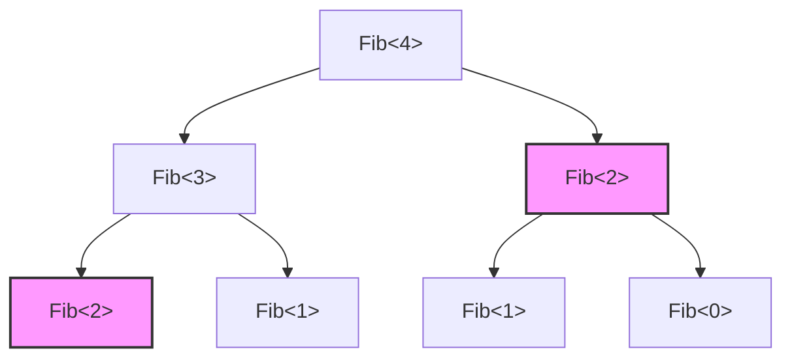
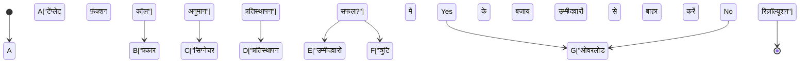
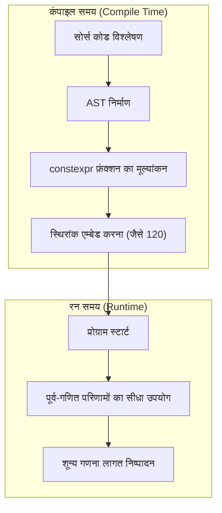

C++ भाषा का सबसे बड़ा आकर्षण और साथ ही इसका सबसे चुनौतीपूर्ण हिस्सा "टेंप्लेट मेटाप्रोग्रामिंग (Template Metaprogramming: TMP)" है। यह एक ऐसी तकनीक है जहाँ प्रोग्राम के रन-टाइम (Run-time) पर की जाने वाली गणनाओं को कंपाइल-टाइम (Compile-time) पर पहले ही कर लिया जाता है, जब कंपाइलर सोर्स कोड की व्याख्या करके बाइनरी उत्पन्न करता है।

इस लेख में, हम अत्यंत विस्तार से यह चर्चा करेंगे कि कैसे C++ टेंप्लेट्स ने मूल रूप से गणना क्षमताओं को प्राप्त किया, इसकी ऐतिहासिक पृष्ठभूमि से लेकर क्लासिक SFINAE, आधुनिक `constexpr`, `if constexpr`, और यहाँ तक कि C++20 में `consteval` और Concepts (कांसेप्ट्स) के विकास तक, व्यावहारिक कोड उदाहरणों और गणितीय पृष्ठभूमि के साथ।

---

## 1. टेंप्लेट मेटाप्रोग्रामिंग की सुबह: ट्यूरिंग-पूर्णता (Turing Completeness) की आकस्मिक खोज

### 1.1 ट्यूरिंग-पूर्णता क्या है?

कंप्यूटर विज्ञान में, "ट्यूरिंग पूर्ण (Turing Complete)" होने का अर्थ है कि इसमें एक सार्वभौमिक ट्यूरिंग मशीन के समान कम्प्यूटेशनल क्षमता है। सरल शब्दों में, यह एक ऐसी प्रणाली है जो "सशर्त शाखाकरण (Conditional branching)" और "अनंत लूप (या रिकर्सन/Recursion)" को व्यक्त कर सकती है, और किसी भी मनमाने एल्गोरिदम का वर्णन और निष्पादन कर सकती है।

### 1.2 एरविन अनरुह (Erwin Unruh) की खोज

1994 में, C++ मानकीकरण समिति (C++ Standardization Committee) की बैठक में, एरविन अनरुह (Erwin Unruh) नामक व्यक्ति ने कुछ C++ कोड प्रस्तुत किया। वह कोड कंपाइल होने में विफल हो रहा था, लेकिन आश्चर्यजनक रूप से, **कंपाइलर द्वारा आउटपुट किए गए एरर मैसेज में अभाज्य संख्याओं (Prime numbers) का एक क्रम शामिल था**।

कंपाइलर टेंप्लेट इंस्टेंशिएशन (Template Instantiation) की प्रक्रिया के दौरान रिकर्सिव प्रोसेसिंग कर रहा था, और इसके गणना परिणाम को एरर मैसेज के रूप में आउटपुट कर रहा था। दूसरे शब्दों में, यह वह क्षण था जब यह सिद्ध हो गया कि C++ की टेंप्लेट कार्यक्षमता में एक **ट्यूरिंग-पूर्ण कम्प्यूटेशनल प्रणाली (Turing-complete computational system)** अंतर्निहित है, जिसका इरादा भाषा के निर्माता बर्ने स्ट्रॉस्ट्रुप (Bjarne Stroustrup) ने भी नहीं किया था।

---

## 2. क्लासिक टेंप्लेट मेटाप्रोग्रामिंग (C++98 / C++03)

प्रारंभिक टेंप्लेट मेटाप्रोग्रामिंग शुद्ध कार्यात्मक प्रोग्रामिंग (Functional programming) की शैली को अपनाता था, जिसमें संरचनाओं (`struct`) और टेंप्लेट विशेषीकरण (Template Specialization) का उपयोग किया जाता था।

### 2.1 फैक्टोरियल (Factorial) की गणना

आइए सबसे बुनियादी उदाहरण देखें, जो कि फैक्टोरियल ($N!$) की गणना है। गणितीय रूप से इसे इस प्रकार परिभाषित किया गया है:

$$
N! = 
\begin{cases} 
1 & (N = 0) \\
N \times (N - 1)! & (N > 0)
\end{cases}
$$

इसे C++98 टेंप्लेट्स में निम्नलिखित रूप में लिखा जाता है:

```cpp
#include <iostream>

// प्राइमरी टेंप्लेट (रिकर्सन का सामान्य मामला)
template <int N>
struct Factorial {
    static const int value = N * Factorial<N - 1>::value;
};

// टेंप्लेट का स्पष्ट विशेषीकरण (रिकर्सन का आधार मामला)
template <>
struct Factorial<0> {
    static const int value = 1;
};

int main() {
    // कंपाइल समय पर गणना की जाती है, और एक स्थिरांक के रूप में एम्बेड की जाती है
    std::cout << "5! = " << Factorial<5>::value << std::endl; 
    return 0;
}
```

यहाँ महत्वपूर्ण बात यह है कि `Factorial<5>::value` की गणना रन-टाइम पर नहीं की जाती है, बल्कि इसे कंपाइल-टाइम पर विस्तारित किया जाता है, और अंतिम बाइनरी में `std::cout << "5! = " << 120 << std::endl;` के समतुल्य कोड उत्पन्न होता है। यह रन-टाइम ओवरहेड को शून्य कर देता है।

### 2.2 फिबोनाची अनुक्रम (Fibonacci Sequence) और समय जटिलता (Time Complexity)

इसके बाद, आइए फिबोनाची अनुक्रम की गणना करें। पुनरावृत्ति संबंध (Recurrence relation) इस प्रकार है:

$$
F_n = F_{n-1} + F_{n-2} \quad (F_0 = 0, F_1 = 1)
$$

```cpp
template <int N>
struct Fib {
    static const int value = Fib<N - 1>::value + Fib<N - 2>::value;
};

template <>
struct Fib<0> { static const int value = 0; };

template <>
struct Fib<1> { static const int value = 1; };
```

यदि इस कार्यान्वयन को रन-टाइम रिकर्सिव फ़ंक्शन के रूप में लिखा जाता, तो यह एक ही गणना को बार-बार दोहराता, जिससे समय जटिलता घातीय समय (Exponential time) $O(2^N)$ हो जाती। हालाँकि, **कंपाइल-टाइम टेंप्लेट इंस्टेंशिएशन में, यह गुण होता है कि समान टेंप्लेट तर्कों वाले प्रकार को केवल एक बार इंस्टेंशिएट किया जाता है** (मेमोइजेशन/Memoization के समान प्रभाव)। इसलिए, कंपाइल-टाइम गणना जटिलता प्रभावी रूप से $O(N)$ हो जाती है।

नीचे दिया गया चित्र दर्शाता है कि कंपाइलर इंस्टेंसेस (instances) को कैसे हल करता है।



उपरोक्त चित्र में, एक ही रंग और आकार वाले `Fib<2>` को कंपाइलर के भीतर केवल एक बार इंस्टेंशिएट किया जाता है, और दूसरी बार से कैश किए गए प्रकार की परिभाषा (cached type definition) का उपयोग किया जाता है।

---

## 3. SFINAE और Type Traits (C++11)

जैसे-जैसे मेटाप्रोग्रामिंग विकसित हुई, न केवल "मानों की गणना" बल्कि "प्रकारों के हेरफेर और निर्धारण (Type manipulation and determination)" को भी महत्वपूर्ण माना जाने लगा। यहीं पर **SFINAE** (Substitution Failure Is Not An Error: प्रतिस्थापन विफलता एक त्रुटि नहीं है) सामने आता है।

### 3.1 SFINAE का तंत्र

टेंप्लेट फ़ंक्शन ओवरलोड रिज़ॉल्यूशन के दौरान, कंपाइलर पास किए गए तर्कों से टेंप्लेट तर्कों का अनुमान लगाता है और सिग्नेचर (फ़ंक्शन का घोषणा भाग) के प्रकार को प्रतिस्थापित करता है। इस समय, यदि कोई प्रकार की विसंगति होती है और प्रतिस्थापन विफल हो जाता है, तो कंपाइलर तुरंत संकलन त्रुटि (compile error) नहीं देता है, बल्कि **चुपचाप उस ओवरलोड उम्मीदवार को बाहर कर देता है** और अगले उम्मीदवार की तलाश करता है।



### 3.2 std::enable_if का उपयोग करके सशर्त संकलन (Conditional Compilation)

C++11 में पेश किए गए `<type_traits>` हेडर और `std::enable_if` का उपयोग करके, फ़ंक्शंस को केवल उन प्रकारों के लिए सक्षम किया जा सकता है जो विशिष्ट शर्तों को पूरा करते हैं।

```cpp
#include <iostream>
#include <type_traits>

// ओवरलोड जो केवल तभी सक्षम होता है जब T एक पूर्णांक प्रकार हो
template <typename T>
typename std::enable_if<std::is_integral<T>::value>::type
print_type(T val) {
    std::cout << "Integer: " << val << std::endl;
}

// ओवरलोड जो केवल तभी सक्षम होता है जब T एक फ्लोटिंग-पॉइंट प्रकार हो
template <typename T>
typename std::enable_if<std::is_floating_point<T>::value>::type
print_type(T val) {
    std::cout << "Floating point: " << val << std::endl;
}

int main() {
    print_type(42);      // Integer: 42
    print_type(3.1415);  // Floating point: 3.1415
    // print_type("str"); // संकलन त्रुटि: मेल खाने वाला कोई फ़ंक्शन नहीं है
}
```

यह दृष्टिकोण बहुत शक्तिशाली था, लेकिन `typename std::enable_if<...>::type` जैसे विवरण अत्यधिक वर्बोज़ (verbose) थे, जिसने लोगों को यह सोचने पर मजबूर कर दिया कि "C++ मेटाप्रोग्रामिंग एक गुप्त कोड की तरह है" और इससे बचने का एक कारण बन गया।

---

## 4. प्रतिमान बदलाव (Paradigm Shift): constexpr का परिचय (C++11/C++14)

C++11 ने `constexpr` कीवर्ड पेश किया, जिसे मेटाप्रोग्रामिंग के इतिहास में एक क्रांति कहा जा सकता है। इसने अप्राकृतिक टेंप्लेट रिकर्सन का उपयोग किए बिना, **सामान्य फ़ंक्शंस को लिखकर कंपाइल-टाइम गणना** को संभव बना दिया।

### 4.1 C++11 का constexpr

C++11 के समय `constexpr` फ़ंक्शंस पर एक सख्त प्रतिबंध था कि "फ़ंक्शन का मुख्य भाग केवल एक `return` स्टेटमेंट से बना होना चाहिए"। इसलिए, लूप का उपयोग करना संभव नहीं था, और टर्नरी ऑपरेटरों (ternary operators) और रिकर्सन पर निर्भर रहना आवश्यक था।

```cpp
// C++11 का constexpr फिबोनाची
constexpr int fib_cxx11(int n) {
    return (n <= 1) ? n : fib_cxx11(n - 1) + fib_cxx11(n - 2);
}
```

### 4.2 C++14 में constexpr में छूट

C++14 में, इस प्रतिबंध में काफी ढील दी गई थी, और `constexpr` फ़ंक्शंस के भीतर स्थानीय चर घोषणाओं (local variable declarations), `if` स्टेटमेंट, `for` लूप आदि का उपयोग करना संभव हो गया। यह आपको रन-टाइम की तरह ही सरलता से एल्गोरिदम लिखने की अनुमति देता है।

```cpp
// C++14 का constexpr फिबोनाची
constexpr int fib_cxx14(int n) {
    if (n <= 1) return n;
    int a = 0, b = 1;
    for (int i = 2; i <= n; ++i) {
        int temp = a + b;
        a = b;
        b = temp;
    }
    return b;
}
```

इस कोड की गणना कंपाइल-टाइम पर की जाती है यदि इसका मूल्यांकन कंपाइल-टाइम पर किया जा सकता है, और यदि तर्क रन-टाइम पर पारित किए जाते हैं, तो इसकी गणना रन-टाइम पर एक सामान्य फ़ंक्शन के रूप में की जाती है।



---

## 5. स्थैतिक सशर्त शाखाकरण (Static Conditional Branching) में महारत हासिल करना: if constexpr (C++17)

C++17 ने `if constexpr` पेश किया, जो SFINAE का उपयोग करते हुए वर्बोज़ ओवरलोड रिज़ॉल्यूशन को अतीत की बात बना देता है। यह एक `if` स्टेटमेंट है जिसका मूल्यांकन कंपाइल-टाइम पर किया जाता है, और जिस ब्लॉक की स्थिति `false` हो जाती है, उसे इंस्टेंशिएट भी नहीं किया जाता है और संकलन लक्ष्य (compilation target) से पूरी तरह से हटा दिया जाता है।

यदि हम पिछले SFINAE उदाहरण को `if constexpr` के साथ फिर से लिखते हैं, तो यह आश्चर्यजनक रूप से सरल हो जाता है।

```cpp
#include <iostream>
#include <type_traits>

template <typename T>
void print_type(T val) {
    if constexpr (std::is_integral_v<T>) {
        std::cout << "Integer: " << val << std::endl;
    } 
    else if constexpr (std::is_floating_point_v<T>) {
        std::cout << "Floating point: " << val << std::endl;
    } 
    else {
        std::cout << "Other type" << std::endl;
    }
}
```

`if constexpr` का उपयोग करके, विभिन्न प्रकारों के लिए प्रसंस्करण को एक ही टेंप्लेट फ़ंक्शन में समूहीकृत किया जा सकता है, जिससे कोड की पठनीयता (readability) में काफी सुधार होता है।

---

## 6. आधुनिक C++ का सच्चा सार: consteval और Concepts (C++20)

C++20, C++11 के बाद से सबसे बड़ा अपडेट था। मेटाप्रोग्रामिंग के क्षेत्र में भी इसमें नाटकीय रूप से विकास हुआ है।

### 6.1 हमेशा कंपाइल-टाइम पर गणना करें: consteval

`constexpr` एक निर्देश था जो कहता था "यदि शर्तें पूरी होती हैं तो कंपाइल-टाइम पर गणना करें", लेकिन इसे रन-टाइम पर भी मूल्यांकन करने की अनुमति है। दूसरी ओर, C++20 में जोड़ा गया `consteval`, **"तात्कालिक फ़ंक्शंस (Immediate Functions)"** को परिभाषित करता है जिन्हें **अवश्य ही कंपाइल-टाइम पर मूल्यांकित किया जाना चाहिए**। यदि आप रन-टाइम पर इसका मूल्यांकन करने का प्रयास करते हैं, तो इसके परिणामस्वरूप संकलन त्रुटि (compile error) होगी।

```cpp
// स्पष्ट रूप से कंपाइल-टाइम गणना को बाध्य करता है
consteval int square(int n) {
    return n * n;
}

int main() {
    constexpr int a = square(5); // OK: कंपाइल-टाइम मूल्यांकन
    
    int x = 5;
    // int b = square(x); // त्रुटि: x एक रन-टाइम चर है, इसलिए इसका मूल्यांकन नहीं किया जा सकता
}
```

### 6.2 टेंप्लेट आवश्यकताओं को स्पष्ट करना: Concepts

मेटाप्रोग्रामिंग की सबसे बड़ी कमजोरियों में से एक "त्रुटि संदेशों की जटिलता" थी। टेंप्लेट तर्क में गलत प्रकार पास करने पर कभी-कभी सैकड़ों पंक्तियों के अर्थहीन त्रुटि संदेश आ सकते थे।

C++20 के **Concepts (कांसेप्ट्स)** का उपयोग करके, टेंप्लेट्स द्वारा स्वीकार किए गए प्रकारों पर प्रतिबंध प्राकृतिक भाषा के करीब एक रूप में स्पष्ट रूप से बताए जा सकते हैं, और त्रुटि संदेश बहुत स्पष्ट हो जाते हैं।

```cpp
#include <concepts>
#include <iostream>

// यह आवश्यकता है कि T एक पूर्णांक प्रकार होना चाहिए
template <std::integral T>
T add(T a, T b) {
    return a + b;
}

int main() {
    std::cout << add(10, 20) << std::endl;      // OK
    // std::cout << add(1.5, 2.5) << std::endl; // त्रुटि: std::integral को पूरा नहीं करता है
}
```

---

## 7. व्यावहारिक उदाहरण: कंपाइल-टाइम अभाज्य संख्या परीक्षण (Prime Number Testing) और एल्गोरिदम अनुकूलन

आइए अब तक प्राप्त ज्ञान को लागू करें और कंपाइल-टाइम पर अभाज्य संख्याओं का परीक्षण करने के लिए एक कोड लिखें। यहाँ, हम आधुनिक C++20 सुविधा (`consteval`) का उपयोग करते हैं।

अभाज्य संख्या परीक्षण एल्गोरिदम की समय जटिलता भोलेपन से जाँचने पर $O(N)$ है, लेकिन चूंकि $\sqrt{N}$ तक जाँचना पर्याप्त है, एक इष्टतम एल्गोरिदम की जटिलता $O(\sqrt{N})$ होती है।

```cpp
#include <iostream>

// कंपाइल-टाइम पर वर्गमूल के पूर्णांक भाग की गणना करने के लिए हेल्पर फ़ंक्शन
consteval int compile_time_sqrt(int n) {
    if (n <= 1) return n;
    int res = 1;
    while (res * res <= n) {
        res++;
    }
    return res - 1;
}

// C++20 consteval का उपयोग करके अभाज्य संख्या परीक्षण
consteval bool is_prime(int n) {
    if (n <= 1) return false;
    if (n == 2 || n == 3) return true;
    if (n % 2 == 0) return false;
    
    int limit = compile_time_sqrt(n);
    for (int i = 3; i <= limit; i += 2) {
        if (n % i == 0) return false;
    }
    return true;
}

int main() {
    // पूरी तरह से कंपाइल-टाइम पर मूल्यांकन किया गया
    static_assert(is_prime(104729) == true, "104729 should be prime!");
    static_assert(is_prime(100) == false, "100 should not be prime!");
    
    constexpr bool p = is_prime(9973);
    std::cout << "Is 9973 prime? " << std::boolalpha << p << std::endl;

    return 0;
}
```

उपरोक्त कोड में, चूँकि `compile_time_sqrt` और `is_prime` दोनों को `consteval` के रूप में निर्दिष्ट किया गया है, ये गणनाएँ कंपाइल-टाइम पर 100% पूरी हो जाती हैं। निष्पादन योग्य फ़ाइल (executable file) की बाइनरी में बस स्थिरांक (बूलियन मान) `true` या `false` एम्बेड होते हैं।

### 7.1 जटिलता की गणितीय अभिव्यक्ति

अभाज्य संख्या परीक्षण में, परीक्षण किया जाने वाला अधिकतम मान $\lfloor \sqrt{N} \rfloor$ है।
इसलिए, सबसे खराब स्थिति का निष्पादन समय (worst-case execution time) $T(N)$ इस प्रकार है:

$$
T(N) = O(\sqrt{N})
$$

यदि रन-टाइम पर इसकी गणना की जाती है, तो यह कुछ सौ मिलीसेकंड से लेकर कुछ सेकंड तक की देरी का कारण बन सकता है, उदाहरण के लिए क्रिप्टोग्राफ़िक प्रसंस्करण या बड़े पैमाने पर सिमुलेशन आरंभीकरण (initialization) में। हालाँकि, यदि कंपाइल-टाइम मेटाप्रोग्रामिंग का उपयोग किया जाता है, तो इस $T(N)$ की लागत पूरी तरह से कंपाइलर द्वारा वहन की जाती है, और उपयोगकर्ता के लिए रन-टाइम लागत $O(1)$ हो जाती है।

---

## 8. कंपाइल-टाइम गणना का प्रकाश और छाया

अब तक, हमने C++ की शक्तिशाली कंपाइल-टाइम गणना क्षमताओं को देखा है, लेकिन इनका उपयोग बिना किसी शर्त के बहुतायत में नहीं किया जाना चाहिए।

### लाभ (Merits)
- **जीरो रन-टाइम ओवरहेड**: चूँकि गणना परिणाम स्थिरांक बन जाते हैं, निष्पादन की गति सबसे तेज़ होती है।
- **बग की शीघ्र खोज**: `static_assert` और अन्य के साथ संयोजन करके, तार्किक विफलताओं और प्रकार की विसंगतियों को संकलन के समय मज़बूती से पकड़ा जा सकता है।

### नुकसान (Demerits)
- **बिल्ड समय का विस्फोट**: कंपाइलर के भीतर गणना एक समर्पित दुभाषिया वातावरण (कंपाइलर के AST मूल्यांकनकर्ता) में की जाती है, जो रन-टाइम पर मूल कोड निष्पादित करने की तुलना में बहुत धीमी है। यदि आप कंपाइल-टाइम पर विशाल मैट्रिक्स गणनाएँ करते हैं, तो बिल्ड समय घंटों तक बढ़ने का जोखिम होता है।
- **बाइनरी ब्लोट (Binary Bloat)**: यदि टेंप्लेट को कई अलग-अलग प्रकारों के साथ इंस्टेंशिएट किया जाता है, तो बड़ी संख्या में फ़ंक्शंस उत्पन्न होते हैं, जिससे निष्पादन योग्य फ़ाइल का आकार बढ़ सकता है (Code Bloat)।

---

## 9. निष्कर्ष

C++ टेंप्लेट मेटाप्रोग्रामिंग एक "आकस्मिक खोज (हैक)" के रूप में शुरू हुई जहाँ एक त्रुटि संदेश से अभाज्य संख्याएँ आउटपुट हुई थीं, और वर्षों के मानकीकरण के काम के माध्यम से, यह परिष्कृत भाषा सुविधाओं (`constexpr`, `if constexpr`, `Concepts`) में विकसित हुई है।

आधुनिक C++ में, "मेटाप्रोग्रामिंग" की बाधा नाटकीय रूप से कम हो गई है, और आप सामान्य कार्यक्रमों की तरह सहज ज्ञान युक्त कोड (intuitive code) लिखते हुए कंपाइल-टाइम गणनाओं का लाभ उठा सकते हैं।

एम्बेडेड सिस्टम (embedded systems), गेम इंजन, और उच्च-आवृत्ति ट्रेडिंग (HFT) सिस्टम में जहाँ परम प्रदर्शन (ultimate performance) की आवश्यकता होती है, यह तकनीक भविष्य में भी গান্ধर्वीय उपकरण बनी रहेगी।

C++ का विकास अभी रुका नहीं है। आगामी मानकों, C++23 और C++26 में कंपाइल-टाइम रिफ्लेक्शन (compile-time reflection) जैसी और भी अधिक शक्तिशाली सुविधाएँ क्षितिज पर हैं। हम आशा करते हैं कि आप आधुनिक टेंप्लेट प्रोग्रामिंग में महारत हासिल करेंगे और सीमाओं से परे अनुकूलन (optimization) की दुनिया का आनंद लेंगे।
