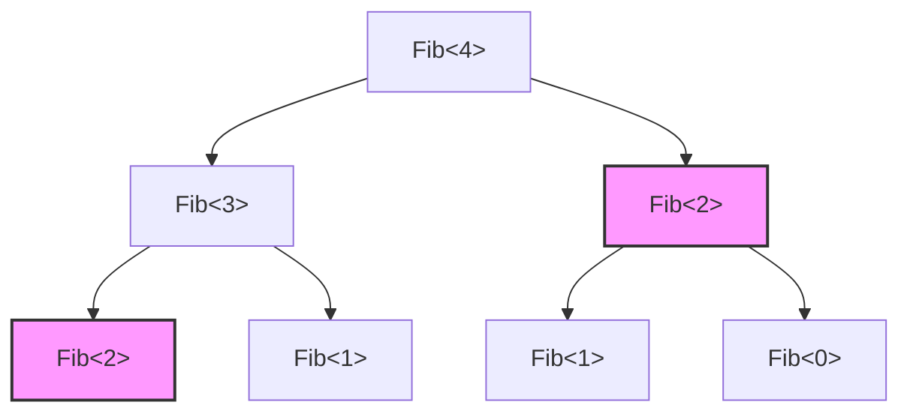
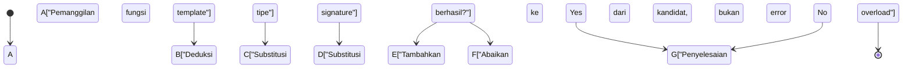
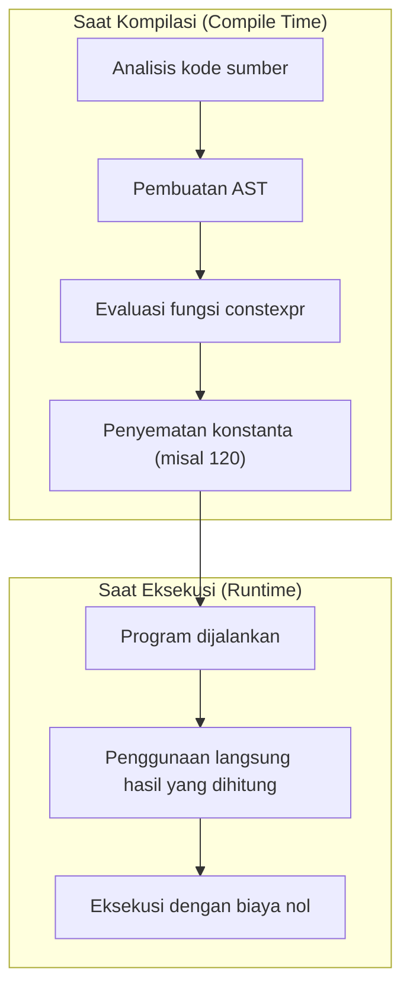

Daya tarik terbesar dari bahasa C++, dan di saat yang sama bisa dikatakan sebagai labirin yang paling membingungkan, adalah "Template Metaprogramming (TMP)". Ini adalah teknologi yang memungkinkan perhitungan yang biasanya dilakukan pada saat eksekusi (Run-time) program, untuk dipajukan dan dilakukan pada saat kompilasi (Compile-time) ketika kompilator menafsirkan kode sumber dan menghasilkan biner.

Pada artikel ini, kita akan menjelaskan secara sangat rinci, disertai dengan contoh kode praktis dan latar belakang matematis, evolusi dari bagaimana template C++ awalnya mendapatkan kemampuan komputasi secara historis, SFINAE klasik, lalu `constexpr` modern, `if constexpr`, hingga `consteval` dan Concepts di C++20.

---

## 1. Fajar Template Metaprogramming: Turing Completeness yang Ditemukan Secara Kebetulan

### 1.1 Apa itu Turing Completeness

Dalam ilmu komputer, "Turing Complete" berarti memiliki kemampuan komputasi yang sama dengan mesin Turing universal. Sederhananya, ini adalah sistem yang dapat mengekspresikan "percabangan kondisi" dan "loop tak terbatas (atau rekursi)", serta dapat mendeskripsikan dan mengeksekusi algoritma arbitrer apa pun.

### 1.2 Penemuan Erwin Unruh

Pada tahun 1994, dalam pertemuan Komite Standardisasi C++, seseorang bernama Erwin Unruh mempresentasikan sebuah kode C++. Kode tersebut memang gagal dikompilasi, tetapi yang mengejutkan adalah **di dalam pesan kesalahan yang dikeluarkan oleh kompilator, terdapat deret bilangan prima**.

Kompilator melakukan pemrosesan rekursif selama proses instansiasi template, dan mengeluarkan hasil perhitungannya sebagai pesan kesalahan. Artinya, itu adalah momen pembuktian bahwa fitur template C++ mengandung **sistem komputasi Turing complete**, yang bahkan tidak pernah dimaksudkan oleh Bjarne Stroustrup sang perancang bahasa.

---

## 2. Template Metaprogramming Klasik (C++98 / C++03)

Template metaprogramming awal mengambil gaya pemrograman fungsional murni yang menggunakan struktur (`struct`) dan spesialisasi template (Template Specialization).

### 2.1 Perhitungan Faktorial (Factorial)

Mari kita lihat contoh paling dasar, yaitu perhitungan faktorial ($N!$). Secara matematis didefinisikan sebagai berikut:

$$
N! = 
\begin{cases} 
1 & (N = 0) \\
N \times (N - 1)! & (N > 0)
\end{cases}
$$

Jika ini ditulis menggunakan template C++98, maka akan menjadi seperti berikut:

```cpp
#include <iostream>

// Template primer (kasus umum rekursi)
template <int N>
struct Factorial {
    static const int value = N * Factorial<N - 1>::value;
};

// Spesialisasi eksplisit template (kasus dasar rekursi)
template <>
struct Factorial<0> {
    static const int value = 1;
};

int main() {
    // Dihitung saat kompilasi, dan disematkan sebagai konstanta
    std::cout << "5! = " << Factorial<5>::value << std::endl; 
    return 0;
}
```

Yang penting di sini adalah `Factorial<5>::value` tidak dihitung pada saat eksekusi (runtime), melainkan diekspansi saat kompilasi, dan pada biner akhirnya akan dihasilkan kode yang ekuivalen dengan `std::cout << "5! = " << 120 << std::endl;`. Dengan ini, overhead pada saat eksekusi menjadi nol.

### 2.2 Deret Fibonacci dan Kompleksitas Waktu

Selanjutnya, mari kita hitung deret Fibonacci. Persamaan rekurensinya adalah sebagai berikut:

$$
F_n = F_{n-1} + F_{n-2} \quad (F_0 = 0, F_1 = 1)
$$

```cpp
template <int N>
struct Fib {
    static const int value = Fib<N - 1>::value + Fib<N - 2>::value;
};

template <>
struct Fib<0> { static const int value = 0; };

template <>
struct Fib<1> { static const int value = 1; };
```

Jika implementasi ini ditulis sebagai fungsi rekursif saat eksekusi, perhitungannya akan diulang berkali-kali sehingga kompleksitas waktunya menjadi waktu eksponensial $O(2^N)$. Namun, **dalam instansiasi template saat kompilasi, tipe dengan argumen template yang sama hanya diinstansiasi satu kali** (efek seperti memoisasi). Oleh karena itu, kompleksitas waktu saat kompilasi secara praktis menjadi $O(N)$.

Diagram berikut menunjukkan bagaimana kompilator menyelesaikan instansiasi tersebut.



Pada diagram di atas, `Fib<2>` yang memiliki warna dan bentuk yang sama hanya diinstansiasi satu kali dalam kompilator, dan definisi tipe yang di-cache akan digunakan untuk yang kedua kalinya dan seterusnya.

---

## 3. SFINAE dan Type Traits (C++11)

Seiring berkembangnya metaprogramming, tidak hanya "komputasi nilai", tetapi "manipulasi dan evaluasi tipe" juga menjadi penting. Di sinilah munculnya **SFINAE** (Substitution Failure Is Not An Error: Kegagalan Substitusi Bukanlah Sebuah Kesalahan).

### 3.1 Mekanisme SFINAE

Saat penyelesaian overload (overload resolution) pada fungsi template, kompilator mendeduksi argumen template dari argumen yang diberikan dan mensubstitusi tipe pada signature (bagian deklarasi fungsi). Pada saat ini, jika terjadi kontradiksi tipe dan substitusi gagal, kompilator tidak akan segera mengeluarkan kesalahan kompilasi, melainkan **secara diam-diam mengabaikan kandidat overload tersebut** dan mencari kandidat berikutnya.



### 3.2 Kompilasi Bersyarat Menggunakan std::enable_if

Dengan menggunakan header `<type_traits>` dan `std::enable_if` yang diperkenalkan pada C++11, kita dapat mengaktifkan fungsi hanya untuk tipe yang memenuhi kondisi tertentu.

```cpp
#include <iostream>
#include <type_traits>

// Overload yang diaktifkan hanya jika T adalah tipe integer
template <typename T>
typename std::enable_if<std::is_integral<T>::value>::type
print_type(T val) {
    std::cout << "Integer: " << val << std::endl;
}

// Overload yang diaktifkan hanya jika T adalah tipe floating point
template <typename T>
typename std::enable_if<std::is_floating_point<T>::value>::type
print_type(T val) {
    std::cout << "Floating point: " << val << std::endl;
}

int main() {
    print_type(42);      // Integer: 42
    print_type(3.1415);  // Floating point: 3.1415
    // print_type("str"); // Error kompilasi: Tidak ada fungsi yang cocok
}
```

Pendekatan ini sangat kuat, tetapi penulisan seperti `typename std::enable_if<...>::type` sangat panjang (verbose) dan menjadi salah satu alasan mengapa "metaprogramming C++ terlihat seperti kode rahasia (kriptografi)" dan dihindari.

---

## 4. Pergeseran Paradigma: Pengenalan constexpr (C++11/C++14)

Pada C++11, diperkenalkan kata kunci `constexpr` yang dapat dikatakan sebagai sebuah revolusi dalam sejarah metaprogramming. Hal ini memungkinkan **komputasi saat kompilasi dengan penulisan fungsi biasa** tanpa perlu menggunakan rekursi template yang tidak natural.

### 4.1 constexpr di C++11

Pada masa C++11, fungsi `constexpr` memiliki batasan ketat bahwa "isinya harus terdiri dari satu pernyataan `return` saja". Oleh karena itu, kita tidak dapat menggunakan loop dan harus bergantung pada operator ternary dan rekursi.

```cpp
// Fibonacci constexpr di C++11
constexpr int fib_cxx11(int n) {
    return (n <= 1) ? n : fib_cxx11(n - 1) + fib_cxx11(n - 2);
}
```

### 4.2 Pelonggaran constexpr di C++14

Pada C++14, batasan ini sangat dilonggarkan, memungkinkan penggunaan deklarasi variabel lokal, pernyataan `if`, dan loop `for` di dalam fungsi `constexpr`. Ini memungkinkan kita untuk menulis algoritma secara natural layaknya saat eksekusi.

```cpp
// Fibonacci constexpr di C++14
constexpr int fib_cxx14(int n) {
    if (n <= 1) return n;
    int a = 0, b = 1;
    for (int i = 2; i <= n; ++i) {
        int temp = a + b;
        a = b;
        b = temp;
    }
    return b;
}
```

Kode ini akan dihitung saat kompilasi jika memungkinkan untuk dievaluasi saat kompilasi, dan akan dihitung saat eksekusi layaknya fungsi biasa jika argumennya diberikan pada saat eksekusi.



---

## 5. Memaksimalkan Percabangan Kondisi Statis: if constexpr (C++17)

Pada C++17, diperkenalkan `if constexpr` yang membuat penyelesaian overload yang panjang (verbose) menggunakan SFINAE menjadi sesuatu dari masa lalu. Ini adalah pernyataan `if` yang dievaluasi saat kompilasi, di mana blok dengan kondisi `false` bahkan tidak akan diinstansiasi dan akan dibuang sepenuhnya dari target kompilasi.

Jika kita menulis ulang contoh SFINAE sebelumnya menggunakan `if constexpr`, kodenya menjadi luar biasa sederhana.

```cpp
#include <iostream>
#include <type_traits>

template <typename T>
void print_type(T val) {
    if constexpr (std::is_integral_v<T>) {
        std::cout << "Integer: " << val << std::endl;
    } 
    else if constexpr (std::is_floating_point_v<T>) {
        std::cout << "Floating point: " << val << std::endl;
    } 
    else {
        std::cout << "Other type" << std::endl;
    }
}
```

Dengan menggunakan `if constexpr`, kita dapat menyatukan penanganan untuk tipe yang berbeda di dalam template fungsi yang sama, yang secara dramatis meningkatkan keterbacaan kode.

---

## 6. Puncak Kemampuan C++ Modern: consteval dan Concepts (C++20)

C++20 menjadi pembaruan terbesar sejak C++11. Di ranah metaprogramming pun, ia telah mengalami evolusi yang dramatis.

### 6.1 Wajib Dihitung Saat Kompilasi: consteval

Meskipun `constexpr` merupakan arahan "hitung saat kompilasi jika kondisi terpenuhi", ia juga diizinkan untuk dievaluasi saat eksekusi. Sebaliknya, `consteval` yang ditambahkan pada C++20 mendefinisikan **Fungsi Seketika (Immediate Function) yang "wajib dievaluasi saat kompilasi"**. Mencoba mengevaluasinya saat eksekusi akan menghasilkan kesalahan kompilasi.

```cpp
// Memaksa perhitungan saat kompilasi secara pasti
consteval int square(int n) {
    return n * n;
}

int main() {
    constexpr int a = square(5); // OK: Evaluasi saat kompilasi
    
    int x = 5;
    // int b = square(x); // Error: x adalah variabel runtime sehingga tidak bisa dievaluasi
}
```

### 6.2 Memperjelas Persyaratan Template: Concepts

Salah satu kelemahan terbesar metaprogramming adalah "pesan kesalahan yang sulit dipahami". Jika kita memberikan tipe yang salah ke argumen template, bisa saja dimunculkan kesalahan tak masuk akal sepanjang ratusan baris.

Dengan menggunakan **Concepts** dari C++20, kita dapat menentukan batasan tipe yang diterima oleh template secara eksplisit dalam bentuk yang mendekati bahasa alami, dan pesan kesalahannya pun menjadi sangat jelas.

```cpp
#include <concepts>
#include <iostream>

// Membutuhkan T sebagai tipe integer
template <std::integral T>
T add(T a, T b) {
    return a + b;
}

int main() {
    std::cout << add(10, 20) << std::endl;      // OK
    // std::cout << add(1.5, 2.5) << std::endl; // Error: Tidak memenuhi std::integral
}
```

---

## 7. Contoh Praktis: Pengecekan Bilangan Prima Saat Kompilasi dan Optimasi Algoritma

Mari kita gunakan seluruh pengetahuan sejauh ini untuk menulis kode yang mengecek bilangan prima pada saat kompilasi. Di sini, kita akan menggunakan fitur modern dari C++20 (`consteval`).

Kompleksitas waktu algoritma pengecekan bilangan prima, jika diperiksa secara naif adalah $O(N)$, tetapi karena memeriksa hingga $\sqrt{N}$ sudah cukup, algoritma optimalnya menjadi $O(\sqrt{N})$.

```cpp
#include <iostream>

// Fungsi helper untuk menghitung bagian integer dari akar kuadrat saat kompilasi
consteval int compile_time_sqrt(int n) {
    if (n <= 1) return n;
    int res = 1;
    while (res * res <= n) {
        res++;
    }
    return res - 1;
}

// Pengecekan bilangan prima menggunakan consteval C++20
consteval bool is_prime(int n) {
    if (n <= 1) return false;
    if (n == 2 || n == 3) return true;
    if (n % 2 == 0) return false;
    
    int limit = compile_time_sqrt(n);
    for (int i = 3; i <= limit; i += 2) {
        if (n % i == 0) return false;
    }
    return true;
}

int main() {
    // Dievaluasi sepenuhnya saat kompilasi
    static_assert(is_prime(104729) == true, "104729 should be prime!");
    static_assert(is_prime(100) == false, "100 should not be prime!");
    
    constexpr bool p = is_prime(9973);
    std::cout << "Is 9973 prime? " << std::boolalpha << p << std::endl;

    return 0;
}
```

Pada kode di atas, karena `compile_time_sqrt` maupun `is_prime` dispesifikasikan dengan `consteval`, komputasi ini 100% selesai saat kompilasi. Dalam biner dari file yang dapat dieksekusi, hanya konstanta (nilai boolean) seperti `true` atau `false` yang akan disematkan.

### 7.1 Ekspresi Matematis Kompleksitas Komputasi

Dalam pengecekan bilangan prima, nilai maksimum yang perlu diperiksa adalah $\lfloor \sqrt{N} \rfloor$.

Oleh karena itu, waktu komputasi kasus terburuk (worst-case time) $T(N)$ adalah sebagai berikut:

$$
T(N) = O(\sqrt{N})
$$

Jika ini dihitung saat eksekusi, misalnya pada pemrosesan kriptografi atau inisialisasi simulasi skala besar, ini dapat menyebabkan jeda (delay) dari ratusan milidetik hingga beberapa detik. Namun, dengan menggunakan metaprogramming saat kompilasi, biaya $T(N)$ ini sepenuhnya diambil alih oleh kompilator, dan biaya pada saat dieksekusi oleh pengguna menjadi $O(1)$.

---

## 8. Sisi Terang dan Gelap dari Komputasi Saat Kompilasi

Sejauh ini kita telah melihat fungsi komputasi saat kompilasi C++ yang sangat kuat, tetapi ini tidak berarti kita boleh menggunakannya secara berlebihan tanpa syarat.

### Kelebihan (Merits)
- **Overhead Nol Saat Eksekusi**: Karena hasil perhitungan diubah menjadi konstanta, kecepatan eksekusinya menjadi yang paling cepat.
- **Penemuan Bug Lebih Awal**: Dengan mengombinasikannya dengan `static_assert` dan sebagainya, kegagalan logika atau ketidaksesuaian tipe dapat ditangkap dengan pasti pada saat kompilasi.

### Kekurangan (Demerits)
- **Ledakan Waktu Build**: Komputasi di dalam kompilator dilakukan dalam lingkungan interpreter khusus (evaluator AST kompilator), sehingga jauh lebih lambat dibandingkan dengan eksekusi kode native saat runtime. Jika Anda melakukan komputasi matriks yang sangat besar dan sebagainya pada saat kompilasi, ada bahaya waktu build bisa membengkak hingga berjam-jam.
- **Pembengkakan Biner**: Jika template diinstansiasi dengan berbagai tipe, sejumlah besar fungsi akan dihasilkan dan fenomena ukuran file yang dapat dieksekusi menjadi besar (Code Bloat) mungkin saja terjadi.

---

## 9. Kesimpulan

Template metaprogramming C++ dimulai dari "produk kebetulan (hack)" di mana bilangan prima dihasilkan dari pesan kesalahan, dan setelah bertahun-tahun melewati proses standardisasi, ia telah berevolusi menjadi fitur bahasa yang elegan (`constexpr`, `if constexpr`, `Concepts`).

Dalam C++ modern, batasan dari istilah "metaprogramming" telah diturunkan secara dramatis, dan kita dapat memperoleh manfaat dari komputasi saat kompilasi sambil menulis kode yang intuitif layaknya program biasa.

Dalam sistem tertanam (embedded systems), mesin permainan (game engines), atau sistem perdagangan frekuensi tinggi (HFT) di mana performa mutlak dituntut, teknologi ini akan terus menjadi senjata yang sangat penting di masa depan.

Evolusi C++ masih belum berhenti. Pada standar berikutnya, yaitu C++23 dan C++26, fitur yang lebih kuat seperti refleksi saat kompilasi (compile-time reflection) sedang dipersiapkan. Saya harap Anda semua juga dapat menguasai pemrograman template modern ini dan menikmati dunia optimasi yang melampaui batas.
