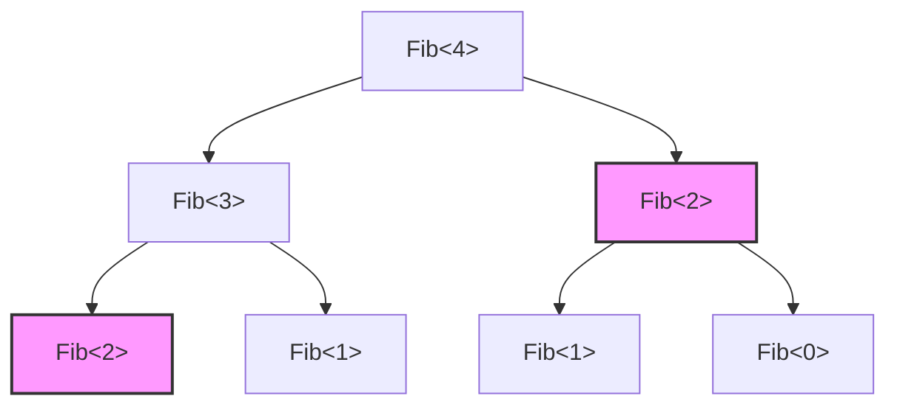
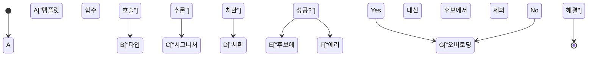
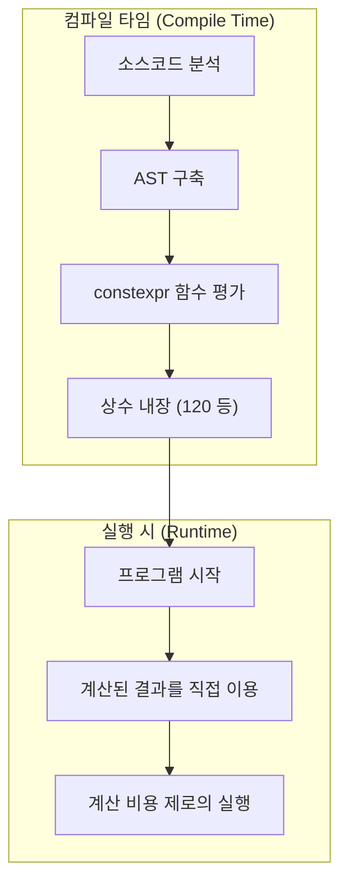

C++이라는 언어가 가진 가장 큰 매력이자, 동시에 가장 큰 마경(魔境)이라고도 할 수 있는 것이 '템플릿 메타프로그래밍(Template Metaprogramming: TMP)'입니다. 이는 프로그램의 실행 시(Run-time)에 이루어지는 연산을 컴파일러가 소스코드를 해석하여 바이너리를 생성하는 컴파일 타임(Compile-time)에 앞당겨 수행하게 하는 기술입니다.

본 문서에서는 C++의 템플릿이 애초에 어떻게 연산 능력을 갖추게 되었는지에 대한 역사적 배경부터, 고전적인 SFINAE, 그리고 현대의 `constexpr`, `if constexpr`, 나아가 C++20의 `consteval` 및 Concepts(콘셉트)에 이르기까지의 진화 과정을 실용적인 코드 예제와 수학적 배경을 곁들여 아주 상세하게 해설합니다.

---

## 1. 템플릿 메타프로그래밍의 여명: 우연히 발견된 튜링 완전성

### 1.1 튜링 완전성이란

컴퓨터 과학에서 '튜링 완전(Turing Complete)'하다는 것은 만능 튜링 머신과 동일한 계산 능력을 갖추고 있음을 의미합니다. 쉽게 말해 '조건 분기'와 '무한 루프(또는 재귀)'를 표현할 수 있으며, 임의의 알고리즘을 기술하고 실행할 수 있는 시스템을 뜻합니다.

### 1.2 에르빈 운루의 발견

1994년, C++ 표준화 위원회 회의에서 에르빈 운루(Erwin Unruh)라는 인물이 어떤 C++ 코드를 제시했습니다. 그 코드는 컴파일에 실패하는 코드였으나, 놀랍게도 **컴파일러가 출력하는 에러 메시지 안에 소수(Prime numbers)의 수열이 포함되어 있었습니다**.

컴파일러는 템플릿의 인스턴스화(실체화) 과정에서 재귀적인 처리를 수행했고, 에러 메시지로서 그 계산 결과를 출력했던 것입니다. 즉, C++의 템플릿 기능이 언어 설계자인 비야네 스트로스트룹조차 의도하지 않았던 **튜링 완전한 계산 체계**를 내포하고 있음이 증명된 순간이었습니다.

---

## 2. 고전적 템플릿 메타프로그래밍 (C++98 / C++03)

초기 템플릿 메타프로그래밍은 구조체(`struct`)와 템플릿 특수화(Template Specialization)를 이용한 순수 함수형 프로그래밍 스타일을 띠고 있었습니다.

### 2.1 팩토리얼(Factorial) 계산

먼저 가장 기본적인 예인 팩토리얼($N!$) 계산을 살펴보겠습니다. 수학적으로는 다음과 같이 정의됩니다.

$$
N! = 
\begin{cases} 
1 & (N = 0) \\
N \times (N - 1)! & (N > 0)
\end{cases}
$$

이를 C++98의 템플릿으로 작성하면 다음과 같습니다.

```cpp
#include <iostream>

// 기본 템플릿 (재귀의 일반 케이스)
template <int N>
struct Factorial {
    static const int value = N * Factorial<N - 1>::value;
};

// 템플릿의 명시적 특수화 (재귀의 베이스 케이스)
template <>
struct Factorial<0> {
    static const int value = 1;
};

int main() {
    // 컴파일 타임에 계산되어 상수로서 내장됨
    std::cout << "5! = " << Factorial<5>::value << std::endl; 
    return 0;
}
```

여기서 중요한 점은 `Factorial<5>::value`가 실행 시에 계산되는 것이 아니라, 컴파일 타임에 전개되어 최종적인 바이너리에는 `std::cout << "5! = " << 120 << std::endl;`와 동등한 코드가 생성된다는 것입니다. 이로써 실행 시의 오버헤드가 제로가 됩니다.

### 2.2 피보나치 수열과 시간 복잡도

다음으로 피보나치 수열을 계산해 보겠습니다. 점화식은 다음과 같습니다.

$$
F_n = F_{n-1} + F_{n-2} \quad (F_0 = 0, F_1 = 1)
$$

```cpp
template <int N>
struct Fib {
    static const int value = Fib<N - 1>::value + Fib<N - 2>::value;
};

template <>
struct Fib<0> { static const int value = 0; };

template <>
struct Fib<1> { static const int value = 1; };
```

이 구현을 실행 시의 재귀 함수로 작성하면, 동일한 계산을 여러 번 반복하게 되므로 시간 복잡도가 지수 시간인 $O(2^N)$이 됩니다. 그러나 **컴파일 타임의 템플릿 인스턴스화에 있어서는, 동일한 템플릿 인자를 가진 타입은 한 번만 인스턴스화된다**는 성질(메모이제이션과 같은 효과)이 있습니다. 따라서 컴파일 타임의 시간 복잡도는 실질적으로 $O(N)$이 됩니다.

다음 그림은 컴파일러가 어떻게 인스턴스를 해석해 나가는지를 보여줍니다.



위에서 같은 색상과 모양을 가진 `Fib<2>`는 컴파일러 내에서 한 번만 실체화되며, 두 번째부터는 캐시된 타입 정의가 사용됩니다.

---

## 3. SFINAE와 Type Traits (C++11)

메타프로그래밍이 발전함에 따라, '값의 계산'뿐만 아니라 '타입의 조작 및 판정'이 중요시되었습니다. 여기서 등장하는 것이 **SFINAE**(Substitution Failure Is Not An Error: 치환 실패는 에러가 아니다)입니다.

### 3.1 SFINAE의 메커니즘

템플릿 함수의 오버로딩 해결 시, 컴파일러는 전달받은 인자로부터 템플릿 인자를 추론하고 시그니처(함수의 선언부)의 타입을 치환합니다. 이때 타입적으로 모순이 발생하여 치환에 실패한 경우, 컴파일러는 즉시 컴파일 에러를 발생시키는 것이 아니라 **해당 오버로딩 후보를 조용히 제외**하고 다음 후보를 찾습니다.



### 3.2 std::enable_if 를 이용한 조건부 컴파일

C++11에서 도입된 `<type_traits>` 헤더와 `std::enable_if`를 사용하면, 특정 조건을 만족하는 타입에 대해서만 함수를 활성화할 수 있습니다.

```cpp
#include <iostream>
#include <type_traits>

// T가 정수형일 경우에만 활성화되는 오버로딩
template <typename T>
typename std::enable_if<std::is_integral<T>::value>::type
print_type(T val) {
    std::cout << "Integer: " << val << std::endl;
}

// T가 부동소수점형일 경우에만 활성화되는 오버로딩
template <typename T>
typename std::enable_if<std::is_floating_point<T>::value>::type
print_type(T val) {
    std::cout << "Floating point: " << val << std::endl;
}

int main() {
    print_type(42);      // Integer: 42
    print_type(3.1415);  // Floating point: 3.1415
    // print_type("str"); // 컴파일 에러: 일치하는 함수가 없음
}
```

이 접근 방식은 매우 강력했지만, `typename std::enable_if<...>::type`과 같은 구문은 매우 장황하여, 'C++ 메타프로그래밍은 암호와 같다'라며 경원시되는 원인이 되기도 했습니다.

---

## 4. 패러다임 전환: constexpr의 도입 (C++11/C++14)

C++11에서는 메타프로그래밍의 역사에 있어서 혁명이라고도 할 수 있는 키워드 `constexpr`이 도입되었습니다. 이를 통해 부자연스러운 템플릿의 재귀를 사용하지 않고도, **일반적인 함수 작성 방식 그대로 컴파일 타임 계산이 가능**해졌습니다.

### 4.1 C++11의 constexpr

C++11 시점에서의 `constexpr` 함수에는 "본문이 단일 `return` 문으로만 구성되어야 한다"는 엄격한 제약이 있었습니다. 이 때문에 루프를 사용할 수 없어 삼항 연산자와 재귀에 의존해야만 했습니다.

```cpp
// C++11의 constexpr 피보나치
constexpr int fib_cxx11(int n) {
    return (n <= 1) ? n : fib_cxx11(n - 1) + fib_cxx11(n - 2);
}
```

### 4.2 C++14의 constexpr 완화

C++14에서는 이 제약이 대폭 완화되어, 지역 변수 선언, `if` 문, `for` 루프 등을 `constexpr` 함수 내에서 사용할 수 있게 되었습니다. 덕분에 실행 시와 동일하게 자연스럽게 알고리즘을 작성할 수 있습니다.

```cpp
// C++14의 constexpr 피보나치
constexpr int fib_cxx14(int n) {
    if (n <= 1) return n;
    int a = 0, b = 1;
    for (int i = 2; i <= n; ++i) {
        int temp = a + b;
        a = b;
        b = temp;
    }
    return b;
}
```

이 코드는 컴파일 타임에 평가 가능하면 컴파일 타임에 계산되고, 실행 시에 인자가 전달될 경우에는 일반적인 함수로서 실행 시에 계산됩니다.



---

## 5. 정적 조건 분기의 끝판왕: if constexpr (C++17)

C++17에서는 SFINAE를 이용한 장황한 오버로딩 해결을 과거의 유물로 만드는 `if constexpr`이 도입되었습니다. 이는 컴파일 타임에 평가되는 `if` 문으로, 조건이 `false`가 된 블록은 인스턴스화조차 되지 않으며 컴파일 대상에서 완전히 파기됩니다.

앞서 본 SFINAE 예제를 `if constexpr`로 다시 작성하면, 놀라울 정도로 단순해집니다.

```cpp
#include <iostream>
#include <type_traits>

template <typename T>
void print_type(T val) {
    if constexpr (std::is_integral_v<T>) {
        std::cout << "Integer: " << val << std::endl;
    } 
    else if constexpr (std::is_floating_point_v<T>) {
        std::cout << "Floating point: " << val << std::endl;
    } 
    else {
        std::cout << "Other type" << std::endl;
    }
}
```

`if constexpr`을 사용하면 단일 함수 템플릿 내에 여러 타입을 위한 처리를 한데 묶을 수 있어, 코드의 가독성이 비약적으로 향상됩니다.

---

## 6. 모던 C++의 진수: consteval과 Concepts (C++20)

C++20은 C++11 이래 가장 거대한 업데이트였습니다. 메타프로그래밍 영역에서도 극적인 진화를 이루었습니다.

### 6.1 반드시 컴파일 타임에 계산한다: consteval

`constexpr`은 "조건이 갖춰지면 컴파일 타임에 계산한다"는 지시였으나, 실행 시에 평가되는 것도 허용됩니다. 반면 C++20에서 추가된 `consteval`은 **"반드시 컴파일 타임에 평가되어야만 하는" 즉시 실행 함수(Immediate Function)**를 정의합니다. 실행 시에 평가하려고 시도하면 컴파일 에러가 발생합니다.

```cpp
// 확실하게 컴파일 타임 계산을 강제한다
consteval int square(int n) {
    return n * n;
}

int main() {
    constexpr int a = square(5); // OK: 컴파일 타임 평가
    
    int x = 5;
    // int b = square(x); // 에러: x는 런타임 변수이므로 평가할 수 없음
}
```

### 6.2 템플릿의 요구사항을 명확히 한다: Concepts

메타프로그래밍의 가장 큰 약점 중 하나는 '에러 메시지의 난해함'이었습니다. 템플릿 인자에 잘못된 타입을 전달하면 수백 줄에 달하는 알 수 없는 에러가 쏟아져 나오기도 했습니다.

C++20의 **Concepts(콘셉트)**를 사용하면 템플릿이 허용하는 타입의 제약을 자연어에 가까운 형태로 명시할 수 있어, 에러 메시지도 매우 명확해집니다.

```cpp
#include <concepts>
#include <iostream>

// T가 정수형임을 요구한다
template <std::integral T>
T add(T a, T b) {
    return a + b;
}

int main() {
    std::cout << add(10, 20) << std::endl;      // OK
    // std::cout << add(1.5, 2.5) << std::endl; // 에러: std::integral을 만족하지 않음
}
```

---

## 7. 실전 예제: 컴파일 타임 소수 판별과 알고리즘 최적화

지금까지 배운 지식을 총동원하여, 컴파일 타임에 소수를 판별하는 코문을 작성해 봅시다. 여기서는 모던 C++20의 기능(`consteval`)을 사용합니다.

소수 판별 알고리즘의 시간 복잡도는 무식하게 검사하면 $O(N)$이지만, $\sqrt{N}$까지만 검사하면 충분하므로, 최적화된 알고리즘에서는 $O(\sqrt{N})$이 됩니다.

```cpp
#include <iostream>

// 컴파일 타임에 제곱근의 정수부를 계산하는 헬퍼 함수
consteval int compile_time_sqrt(int n) {
    if (n <= 1) return n;
    int res = 1;
    while (res * res <= n) {
        res++;
    }
    return res - 1;
}

// C++20 consteval을 이용한 소수 판별
consteval bool is_prime(int n) {
    if (n <= 1) return false;
    if (n == 2 || n == 3) return true;
    if (n % 2 == 0) return false;
    
    int limit = compile_time_sqrt(n);
    for (int i = 3; i <= limit; i += 2) {
        if (n % i == 0) return false;
    }
    return true;
}

int main() {
    // 완전히 컴파일 타임에 평가됨
    static_assert(is_prime(104729) == true, "104729 should be prime!");
    static_assert(is_prime(100) == false, "100 should not be prime!");
    
    constexpr bool p = is_prime(9973);
    std::cout << "Is 9973 prime? " << std::boolalpha << p << std::endl;

    return 0;
}
```

위의 코드에서 `compile_time_sqrt`도 `is_prime`도 `consteval`로 지정되어 있기 때문에, 이들 계산은 100% 컴파일 타임에 완료됩니다. 실행 파일의 바이너리에는 단지 `true`나 `false`라는 상수(불리언 값)가 내장되어 있을 뿐입니다.

### 7.1 시간 복잡도의 수식 표현

소수 판별에 있어 검사해야 할 최댓값은 $\lfloor \sqrt{N} \rfloor$입니다.
따라서 최악의 경우 시간 복잡도 $T(N)$은 다음과 같습니다.

$$
T(N) = O(\sqrt{N})
$$

실행 시에 이를 계산하면, 예를 들어 암호 처리나 대규모 시뮬레이션의 초기화 등에서 수백 밀리초에서 수 초의 지연이 발생할 가능성이 있습니다. 그러나 컴파일 타임 메타프로그래밍을 이용하면 이 $T(N)$의 비용은 완전히 컴파일러 쪽에서 부담하게 되고, 사용자 실행 시의 비용은 $O(1)$이 됩니다.

---

## 8. 컴파일 타임 연산의 빛과 그림자

지금까지 C++의 강력한 컴파일 타임 연산 기능을 살펴보았으나, 이를 무조건 다용해서는 안 됩니다.

### 장점
- **실행 시 제로 오버헤드**: 계산 결과가 상수화되므로 실행 속도가 가장 빠릅니다.
- **버그 조기 발견**: `static_assert` 등과 조합함으로써, 로직의 파탄이나 타입의 불일치를 컴파일 시점에 확실하게 포착할 수 있습니다.

### 단점
- **빌드 시간 폭발**: 컴파일러 내부에서의 연산은 전용 인터프리터 환경(컴파일러의 AST 평가기)에서 이루어지기 때문에, 런타임의 네이티브 코드 실행에 비해 훨씬 느립니다. 거대한 행렬 계산 등을 컴파일 타임에 수행하게 하면, 빌드 시간이 수 시간 단위로 늘어날 위험성이 있습니다.
- **바이너리 비대화**: 템플릿이 다양한 타입으로 인스턴스화되면, 함수가 다수 생성되어 실행 파일 크기가 커지는 현상(Code Bloat)이 발생할 수 있습니다.

---

## 9. 결론

C++의 템플릿 메타프로그래밍은 에러 메시지에서 소수가 출력된다는 '우연한 산물(해킹)'에서 출발하여, 오랜 표준화 작업을 거쳐 세련된 언어 기능(`constexpr`, `if constexpr`, `Concepts`)으로 진화를 이룩했습니다.

현대의 C++에 이르러 '메타프로그래밍'이라는 단어의 진입 장벽은 극적으로 낮아졌으며, 일반적인 프로그램과 동일하게 직관적인 코드를 작성하면서도 컴파일 타임 연산의 혜택을 누릴 수 있습니다.

퍼포먼스가 극한까지 요구되는 임베디드 시스템이나 게임 엔진, 고빈도 매매(HFT) 시스템 등에서 이 기술은 앞으로도 빼놓을 수 없는 강력한 무기로 남을 것입니다.

C++의 진화는 아직 끝나지 않았습니다. 차기 표준인 C++23이나 C++26에서는 컴파일 타임 리플렉션 등의 더욱 강력한 기능이 대기하고 있습니다. 여러분도 현대적인 템플릿 프로그래밍을 능숙하게 활용하여, 한계를 넘어서는 최적화의 세계를 즐겨보시길 바랍니다.
