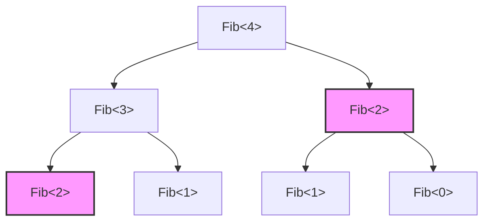
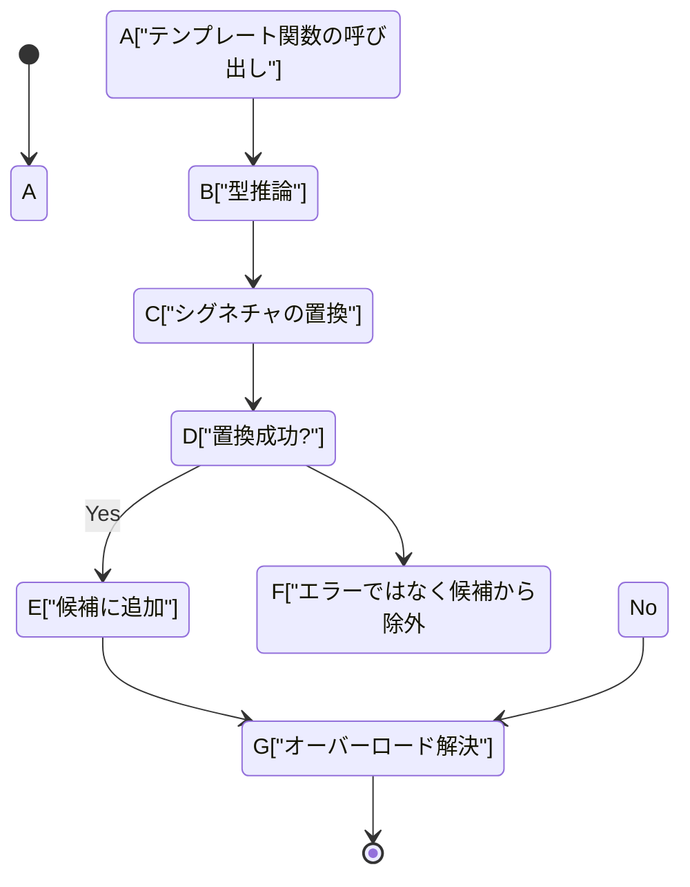
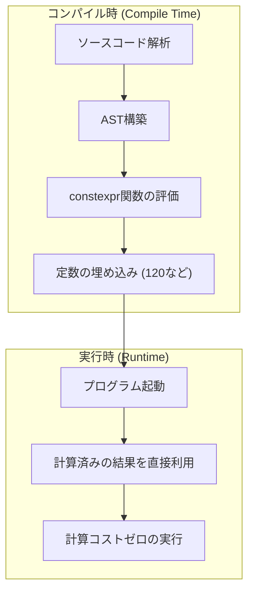

C++という言語が持つ最大の魅力であり、同時に最大の魔境とも言えるのが「テンプレートメタプログラミング（Template Metaprogramming: TMP）」です。これは、プログラムの実行時（Run-time）に行われる計算を、コンパイラがソースコードを解釈してバイナリを生成するコンパイル時（Compile-time）に前倒しで行わせる技術です。

本記事では、C++のテンプレートがそもそもどのようにして計算能力を持つに至ったのかという歴史的背景から、古典的なSFINAE、そして現代の `constexpr`、`if constexpr`、さらにC++20における `consteval` や Concepts（コンセプト）に至るまでの進化を、実用的なコード例や数学的背景を交えながら、極めて詳細に解説していきます。

---

## 1. テンプレートメタプログラミングの夜明け：偶然発見されたチューリング完全性

### 1.1 チューリング完全性とは

計算機科学において、「チューリング完全（Turing Complete）」であるとは、万能チューリングマシンと同じ計算能力を持つことを意味します。平たく言えば、「条件分岐」と「無限ループ（または再帰）」を表現でき、任意のアルゴリズムを記述・実行できるシステムのことです。

### 1.2 エルヴィン・ウンルーの発見

1994年、C++標準化委員会の会議において、Erwin Unruh（エルヴィン・ウンルー）という人物があるC++コードを提示しました。そのコードはコンパイルに失敗するものでしたが、なんと**コンパイラの出力するエラーメッセージの中に、素数の列が含まれていた**のです。

コンパイラはテンプレートのインスタンス化（実体化）の過程で再帰的な処理を行い、エラーメッセージとしてその計算結果を出力していました。つまり、C++のテンプレート機能が、言語設計者であるビャーネ・ストロヴストルップすら意図していなかった**チューリング完全な計算体系**を内包していることが証明された瞬間でした。

---

## 2. 古典的テンプレートメタプログラミング (C++98 / C++03)

初期のテンプレートメタプログラミングは、構造体（`struct`）とテンプレートの特殊化（Template Specialization）を利用した純粋な関数型プログラミングのスタイルを取っていました。

### 2.1 階乗（Factorial）の計算

まずは最も基本的な例である階乗（$N!$）の計算を見てみましょう。数学的には以下のように定義されます。

$$
N! = 
\begin{cases} 
1 & (N = 0) \\
N \times (N - 1)! & (N > 0)
\end{cases}
$$

これをC++98のテンプレートで記述すると以下のようになります。

```cpp
#include <iostream>

// プライマリテンプレート（再帰の一般ケース）
template <int N>
struct Factorial {
    static const int value = N * Factorial<N - 1>::value;
};

// テンプレートの明示的特殊化（再帰のベースケース）
template <>
struct Factorial<0> {
    static const int value = 1;
};

int main() {
    // コンパイル時に計算され、定数として埋め込まれる
    std::cout << "5! = " << Factorial<5>::value << std::endl; 
    return 0;
}
```

ここで重要なのは、`Factorial<5>::value` は実行時に計算されるのではなく、コンパイル時に展開され、最終的なバイナリには `std::cout << "5! = " << 120 << std::endl;` と同等のコードが生成される点です。これにより、実行時のオーバーヘッドがゼロになります。

### 2.2 フィボナッチ数列と計算量

次に、フィボナッチ数列を計算してみましょう。漸化式は以下の通りです。

$$
F_n = F_{n-1} + F_{n-2} \quad (F_0 = 0, F_1 = 1)
$$

```cpp
template <int N>
struct Fib {
    static const int value = Fib<N - 1>::value + Fib<N - 2>::value;
};

template <>
struct Fib<0> { static const int value = 0; };

template <>
struct Fib<1> { static const int value = 1; };
```

この実装は実行時の再帰関数で書くと、同じ計算を何度も繰り返すため計算量が指数関数時間 $O(2^N)$ になります。しかし、**コンパイル時のテンプレートインスタンス化においては、同じテンプレート引数を持つ型は一度しかインスタンス化されない**という性質（メモ化のような効果）があります。そのため、コンパイル時の計算量は実質的に $O(N)$ となります。

以下の図は、コンパイラがどのようにインスタンスを解決していくかを示しています。



上記で、同じ色や形を持つ `Fib<2>` は、コンパイラ内で一度だけ実体化され、二度目以降はキャッシュされた型定義が利用されます。

---

## 3. SFINAEとType Traits (C++11)

メタプログラミングが進化するにつれ、「値の計算」だけでなく「型の操作や判定」が重要視されるようになりました。ここで登場するのが **SFINAE**（Substitution Failure Is Not An Error: 置き換えの失敗はエラーではない）です。

### 3.1 SFINAEのメカニズム

テンプレート関数のオーバーロード解決時、コンパイラは渡された引数からテンプレート引数を推論し、シグネチャ（関数の宣言部）の型を置き換えます。このとき、型的に矛盾が生じて置き換えに失敗した場合、コンパイラは直ちにコンパイルエラーを出すのではなく、**そのオーバーロード候補を静かに除外**して次の候補を探します。



### 3.2 std::enable_if を用いた条件付きコンパイル

C++11で導入された `<type_traits>` ヘッダと `std::enable_if` を使うことで、特定の条件を満たす型に対してのみ関数を有効化することができます。

```cpp
#include <iostream>
#include <type_traits>

// Tが整数型の場合にのみ有効化されるオーバーロード
template <typename T>
typename std::enable_if<std::is_integral<T>::value>::type
print_type(T val) {
    std::cout << "Integer: " << val << std::endl;
}

// Tが浮動小数点型の場合にのみ有効化されるオーバーロード
template <typename T>
typename std::enable_if<std::is_floating_point<T>::value>::type
print_type(T val) {
    std::cout << "Floating point: " << val << std::endl;
}

int main() {
    print_type(42);      // Integer: 42
    print_type(3.1415);  // Floating point: 3.1415
    // print_type("str"); // コンパイルエラー: マッチする関数がない
}
```

このアプローチは非常に強力でしたが、`typename std::enable_if<...>::type` といった記述は非常に冗長であり、「C++のメタプログラミングは暗号のようだ」と敬遠される一因にもなっていました。

---

## 4. パラダイムシフト：constexprの導入 (C++11/C++14)

C++11では、メタプログラミングの歴史において革命とも言えるキーワード `constexpr` が導入されました。これにより、不自然なテンプレートの再帰を使わずに、**通常の関数の記述のままコンパイル時計算が可能**になりました。

### 4.1 C++11の constexpr

C++11時点での `constexpr` 関数には、「本体が単一の `return` 文のみで構成されていなければならない」という厳しい制約がありました。そのため、ループを使えず三項演算子と再帰に頼る必要がありました。

```cpp
// C++11 の constexpr フィボナッチ
constexpr int fib_cxx11(int n) {
    return (n <= 1) ? n : fib_cxx11(n - 1) + fib_cxx11(n - 2);
}
```

### 4.2 C++14の constexpr の緩和

C++14ではこの制約が大幅に緩和され、ローカル変数の宣言、`if` 文、`for` ループなどが `constexpr` 関数内で使用可能になりました。これにより、実行時と同じように素直にアルゴリズムを書くことができます。

```cpp
// C++14 の constexpr フィボナッチ
constexpr int fib_cxx14(int n) {
    if (n <= 1) return n;
    int a = 0, b = 1;
    for (int i = 2; i <= n; ++i) {
        int temp = a + b;
        a = b;
        b = temp;
    }
    return b;
}
```

このコードは、コンパイル時に評価可能であればコンパイル時に計算され、実行時に引数が渡された場合は通常の関数として実行時に計算されます。



---

## 5. 静的条件分岐を極める：if constexpr (C++17)

C++17では、SFINAEを用いた冗長なオーバーロード解決を過去のものにする `if constexpr` が導入されました。これはコンパイル時に評価される `if` 文であり、条件が `false` となったブロックはインスタンス化すらされず、コンパイル対象から完全に破棄されます。

先ほどの SFINAE の例を `if constexpr` で書き直すと、驚くほどシンプルになります。

```cpp
#include <iostream>
#include <type_traits>

template <typename T>
void print_type(T val) {
    if constexpr (std::is_integral_v<T>) {
        std::cout << "Integer: " << val << std::endl;
    } 
    else if constexpr (std::is_floating_point_v<T>) {
        std::cout << "Floating point: " << val << std::endl;
    } 
    else {
        std::cout << "Other type" << std::endl;
    }
}
```

`if constexpr` を使うことで、同一の関数テンプレート内に異なる型向けの処理をまとめることができ、コードの可読性が飛躍的に向上しました。

---

## 6. モダンC++の真骨頂：consteval と Concepts (C++20)

C++20は、C++11以来の巨大なアップデートとなりました。メタプログラミングの領域においても、劇的な進化を遂げています。

### 6.1 必ずコンパイル時に計算する：consteval

`constexpr` は「条件が揃えばコンパイル時に計算する」という指示でしたが、実行時に評価されることも許可されています。対してC++20で追加された `consteval` は、**「必ずコンパイル時に評価されなければならない」即時関数（Immediate Function）** を定義します。実行時に評価しようとするとコンパイルエラーになります。

```cpp
// 確実にコンパイル時計算を強制する
consteval int square(int n) {
    return n * n;
}

int main() {
    constexpr int a = square(5); // OK: コンパイル時評価
    
    int x = 5;
    // int b = square(x); // エラー: xは実行時変数なので評価できない
}
```

### 6.2 テンプレートの要件を明確にする：Concepts

メタプログラミング最大の弱点の一つが「エラーメッセージの難解さ」でした。テンプレート引数に誤った型を渡すと、数百行に及ぶ意味不明なエラーが吐き出されることがありました。

C++20の **Concepts（コンセプト）** を使えば、テンプレートが受け付ける型の制約を自然言語に近い形で明記でき、エラーメッセージも極めて明確になります。

```cpp
#include <concepts>
#include <iostream>

// Tが整数型であることを要求する
template <std::integral T>
T add(T a, T b) {
    return a + b;
}

int main() {
    std::cout << add(10, 20) << std::endl;      // OK
    // std::cout << add(1.5, 2.5) << std::endl; // エラー: std::integralを満たさない
}
```

---

## 7. 実践例：コンパイル時素数判定とアルゴリズムの最適化

これまでの知識を総動員して、コンパイル時に素数判定を行うコードを記述してみましょう。ここでは、モダンなC++20の機能（`consteval`）を使用します。

素数判定アルゴリズムの時間計算量は、愚直に調べると $O(N)$ ですが、$\sqrt{N}$ まで調べれば十分であるため、最適なアルゴリズムでは $O(\sqrt{N})$ となります。

```cpp
#include <iostream>

// コンパイル時に平方根の整数部を計算するヘルパー関数
consteval int compile_time_sqrt(int n) {
    if (n <= 1) return n;
    int res = 1;
    while (res * res <= n) {
        res++;
    }
    return res - 1;
}

// C++20 consteval を用いた素数判定
consteval bool is_prime(int n) {
    if (n <= 1) return false;
    if (n == 2 || n == 3) return true;
    if (n % 2 == 0) return false;
    
    int limit = compile_time_sqrt(n);
    for (int i = 3; i <= limit; i += 2) {
        if (n % i == 0) return false;
    }
    return true;
}

int main() {
    // 完全にコンパイル時に評価される
    static_assert(is_prime(104729) == true, "104729 should be prime!");
    static_assert(is_prime(100) == false, "100 should not be prime!");
    
    constexpr bool p = is_prime(9973);
    std::cout << "Is 9973 prime? " << std::boolalpha << p << std::endl;

    return 0;
}
```

上記のコードにおいて、`compile_time_sqrt` も `is_prime` も `consteval` 指定されているため、これらの計算は100%コンパイル時に完了します。実行ファイルのバイナリには、ただ `true` や `false` という定数（ブール値）が埋め込まれているだけです。

### 7.1 計算量の数式表現

素数判定において、検査すべき最大の値は $\lfloor \sqrt{N} \rfloor$ です。
したがって、最悪計算時間 $T(N)$ は以下のようになります。

$$
T(N) = O(\sqrt{N})
$$

実行時にこれを計算すると、例えば暗号処理や大規模なシミュレーションの初期化等で数百ミリ秒から数秒の遅延を生む可能性があります。しかし、コンパイル時メタプログラミングを用いれば、この $T(N)$ のコストは完全にコンパイラ側が引き受け、ユーザー実行時のコストは $O(1)$ となります。

---

## 8. コンパイル時計算の光と影

ここまでC++の強力なコンパイル時計算機能を見てきましたが、無条件に多用してよいわけではありません。

### メリット
- **実行時のゼロ・オーバーヘッド**: 計算結果が定数化されるため、実行速度は最速となります。
- **バグの早期発見**: `static_assert` などと組み合わせることで、ロジックの破綻や型の不整合をコンパイル時点で確実に捕捉できます。

### デメリット
- **ビルド時間の爆発**: コンパイラ内部での計算は、専用のインタプリタ環境（コンパイラのAST評価器）で行われるため、実行時のネイティブコード実行に比べてはるかに遅いです。巨大な行列計算などをコンパイル時に行わせると、ビルド時間が数時間レベルに膨れ上がる危険性があります。
- **バイナリの肥大化**: テンプレートが様々な型でインスタンス化されると、関数が多数生成されて実行ファイルサイズが大きくなる現象（Code Bloat）が発生する場合があります。

---

## 9. 結論

C++のテンプレートメタプログラミングは、エラーメッセージから素数が出力されるという「偶然の産物（ハック）」からスタートし、長年の標準化作業を経て、洗練された言語機能（`constexpr`, `if constexpr`, `Concepts`）へと進化を遂げました。

現代のC++においては、「メタプログラミング」という言葉の敷居は劇的に下がり、通常のプログラムと同じように直感的なコードを書きながら、コンパイル時計算の恩恵を受けることができます。

パフォーマンスが究極まで要求される組み込みシステムやゲームエンジン、高頻度取引（HFT）システムなどにおいて、この技術は今後も欠かせない武器であり続けるでしょう。

C++の進化はまだ止まっていません。次期標準であるC++23やC++26では、コンパイル時リフレクションなどのさらに強力な機能が控えています。ぜひ皆さんも、現代的なテンプレートプログラミングを使いこなし、限界を超えた最適化の世界を楽しんでみてください。
