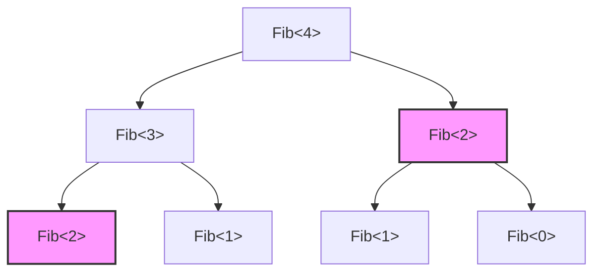
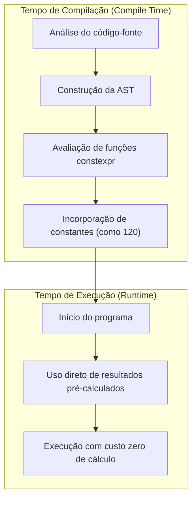

O maior atrativo da linguagem C++, e ao mesmo tempo sua maior área de complexidade (ou "magia obscura"), é a "Metaprogramação de Templates (Template Metaprogramming: TMP)". Trata-se de uma técnica que antecipa para o tempo de compilação (Compile-time) — quando o compilador interpreta o código-fonte e gera o binário — cálculos que normalmente seriam realizados no tempo de execução (Run-time) do programa.

Neste artigo, explicaremos de forma extremamente detalhada, acompanhada de exemplos práticos e de sua fundamentação matemática, o histórico de como os templates do C++ originalmente adquiriram essa capacidade computacional, desde o SFINAE clássico, passando pelo moderno `constexpr` e `if constexpr`, até chegar ao `consteval` e aos Concepts (Conceitos) do C++20.

---

## 1. O Alvorecer da Metaprogramação de Templates: A descoberta acidental da completude de Turing

### 1.1 O que é a Completude de Turing?

Na ciência da computação, ser "Turing completo" (Turing Complete) significa possuir a mesma capacidade computacional de uma Máquina de Turing Universal. Em termos simples, é um sistema capaz de expressar "desvios condicionais" e "loops infinitos (ou recursão)", sendo capaz de descrever e executar qualquer algoritmo.

### 1.2 A descoberta de Erwin Unruh

Em 1994, durante uma reunião do comitê de padronização do C++, Erwin Unruh apresentou um código em C++. Aquele código falhava na compilação, mas surpreendentemente, **a saída das mensagens de erro do compilador continha uma sequência de números primos**.

O compilador realizava um processamento recursivo durante a instanciação (materialização) dos templates e gerava o resultado de seus cálculos como mensagens de erro. Ou seja, foi o momento em que se provou que o recurso de templates do C++ continha em si um **sistema computacional Turing completo** que nem mesmo o seu criador, Bjarne Stroustrup, havia previsto.

---

## 2. Metaprogramação Clássica de Templates (C++98 / C++03)

As primeiras abordagens à metaprogramação de templates adotavam um estilo de programação puramente funcional utilizando estruturas (`struct`) e especialização de templates (Template Specialization).

### 2.1 Cálculo do Fatorial (Factorial)

Primeiramente, vejamos o exemplo mais básico, o cálculo do fatorial ($N!$). Matematicamente, ele é definido da seguinte forma:

$$
N! = 
\begin{cases} 
1 & (N = 0) \\
N \times (N - 1)! & (N > 0)
\end{cases}
$$

Escrevendo isso utilizando os templates do C++98, fica assim:

```cpp
#include <iostream>

// Template primário (caso geral da recursão)
template <int N>
struct Factorial {
    static const int value = N * Factorial<N - 1>::value;
};

// Especialização explícita do template (caso base da recursão)
template <>
struct Factorial<0> {
    static const int value = 1;
};

int main() {
    // É calculado em tempo de compilação e inserido como uma constante
    std::cout << "5! = " << Factorial<5>::value << std::endl; 
    return 0;
}
```

O importante aqui é que o `Factorial<5>::value` não é calculado durante a execução; ele é expandido no momento da compilação e, no binário final, será gerado um código equivalente a `std::cout << "5! = " << 120 << std::endl;`. Isso faz com que a sobrecarga (overhead) em tempo de execução seja zero.

### 2.2 Sequência de Fibonacci e Complexidade

Em seguida, vamos calcular a sequência de Fibonacci. A relação de recorrência é:

$$
F_n = F_{n-1} + F_{n-2} \quad (F_0 = 0, F_1 = 1)
$$

```cpp
template <int N>
struct Fib {
    static const int value = Fib<N - 1>::value + Fib<N - 2>::value;
};

template <>
struct Fib<0> { static const int value = 0; };

template <>
struct Fib<1> { static const int value = 1; };
```

Se esta implementação for escrita com funções recursivas regulares (em tempo de execução), os mesmos cálculos são repetidos diversas vezes, resultando em uma complexidade de tempo exponencial $O(2^N)$. No entanto, **na instanciação de templates no tempo de compilação, o mesmo tipo com os mesmos argumentos de template é instanciado apenas uma vez**, o que causa um efeito similar ao de memoização (memoization). Dessa forma, a complexidade computacional no tempo de compilação é efetivamente $O(N)$.

O diagrama a seguir ilustra como o compilador resolve a instanciação.



Acima, instâncias de `Fib<2>` com a mesma cor e formato são instanciadas apenas uma vez internamente pelo compilador, e as utilizações subsequentes aproveitam a definição do tipo que já foi armazenada em cache.

---

## 3. SFINAE e Type Traits (C++11)

À medida que a metaprogramação evoluiu, tornou-se claro que não apenas o "cálculo de valores" importava, mas também a "manipulação e validação de tipos". É aqui que entra o **SFINAE** (Substitution Failure Is Not An Error: Falha na Substituição Não É Um Erro).

### 3.1 O Mecanismo do SFINAE

Durante a resolução de sobrecarga (overload resolution) de uma função de template, o compilador deduz os argumentos do template a partir dos argumentos passados e substitui os tipos na assinatura (a declaração da função). Nesse momento, se houver uma inconsistência de tipo e a substituição falhar, o compilador não exibe imediatamente um erro de compilação; ao invés disso, ele **descarta esse candidato de sobrecarga silenciosamente** e procura o próximo.

```mermaid
stateDiagram-v2
    [*] --> A
    A["Chamada da função de template"] --> B["Dedução de tipo"]
    B["Dedução de tipo"] --> C["Substituição da assinatura"]
    C["Substituição da assinatura"] --> D["Substituição bem-sucedida?"]
    D["Substituição bem-sucedida?"] --> E["Adicionado aos candidatos"] : Yes
    D["Substituição bem-sucedida?"] --> F["Descartado dos candidatos sem gerar erro (SFINAE)"] : No
    E["Adicionado aos candidatos"] --> G["Resolução de sobrecarga"]
    F["Descartado dos candidatos sem gerar erro (SFINAE)"] --> G["Resolução de sobrecarga"]
    G["Resolução de sobrecarga"] --> [*]
```

### 3.2 Compilação condicional utilizando std::enable_if

Através da utilização do cabeçalho `<type_traits>` e do `std::enable_if` introduzidos no C++11, você pode habilitar uma função apenas para tipos que atendem a condições específicas.

```cpp
#include <iostream>
#include <type_traits>

// Sobrecarga habilitada apenas se T for um tipo inteiro
template <typename T>
typename std::enable_if<std::is_integral<T>::value>::type
print_type(T val) {
    std::cout << "Integer: " << val << std::endl;
}

// Sobrecarga habilitada apenas se T for um tipo de ponto flutuante
template <typename T>
typename std::enable_if<std::is_floating_point<T>::value>::type
print_type(T val) {
    std::cout << "Floating point: " << val << std::endl;
}

int main() {
    print_type(42);      // Integer: 42
    print_type(3.1415);  // Floating point: 3.1415
    // print_type("str"); // Erro de compilação: Nenhuma função correspondente encontrada
}
```

Esta abordagem era extremamente poderosa, mas sintaxes muito verbosas, como `typename std::enable_if<...>::type`, criaram uma barreira, contribuindo para o preconceito de que "a metaprogramação em C++ parece código criptografado".

---

## 4. Mudança de Paradigma: Introdução de constexpr (C++11/C++14)

O C++11 introduziu a palavra-chave `constexpr`, o que foi praticamente uma revolução na história da metaprogramação. Com ele, tornou-se possível **realizar cálculos em tempo de compilação, escrevendo funções do mesmo jeito que sempre escrevemos**, sem precisarmos recorrer a estranhas recursões de templates.

### 4.1 constexpr no C++11

As funções `constexpr` na versão do C++11 ainda tinham uma restrição severa de que "o corpo da função deveria ser composto apenas por uma única instrução `return`". Por isso, era impossível utilizar loops, exigindo o uso de operadores ternários e recursão.

```cpp
// Fibonacci constexpr no C++11
constexpr int fib_cxx11(int n) {
    return (n <= 1) ? n : fib_cxx11(n - 1) + fib_cxx11(n - 2);
}
```

### 4.2 Flexibilização de constexpr no C++14

No C++14, essas restrições foram bastante afrouxadas e, a partir de então, você pôde declarar variáveis locais, utilizar comandos `if`, e usar loops `for` dentro das funções `constexpr`. Graças a isso, agora podemos escrever o algoritmo de maneira intuitiva, assim como fazemos para o tempo de execução.

```cpp
// Fibonacci constexpr no C++14
constexpr int fib_cxx14(int n) {
    if (n <= 1) return n;
    int a = 0, b = 1;
    for (int i = 2; i <= n; ++i) {
        int temp = a + b;
        a = b;
        b = temp;
    }
    return b;
}
```

Este código será computado em tempo de compilação se a avaliação neste momento for viável, mas caso um argumento lhe seja passado em tempo de execução, ele será calculado em tempo de execução como uma função normal.



---

## 5. Dominando as ramificações condicionais estáticas: if constexpr (C++17)

O C++17 trouxe o `if constexpr`, tornando a resolução complexa de sobrecargas usando SFINAE uma coisa do passado. Isso é nada menos que uma instrução `if` avaliada no tempo de compilação, onde os blocos cuja condição resultem em `false` não são nem instanciados, sendo descartados completamente da compilação.

Reescrevendo o exemplo anterior do SFINAE com o `if constexpr`, conseguimos algo surpreendentemente simples.

```cpp
#include <iostream>
#include <type_traits>

template <typename T>
void print_type(T val) {
    if constexpr (std::is_integral_v<T>) {
        std::cout << "Integer: " << val << std::endl;
    } 
    else if constexpr (std::is_floating_point_v<T>) {
        std::cout << "Floating point: " << val << std::endl;
    } 
    else {
        std::cout << "Other type" << std::endl;
    }
}
```

Usando o `if constexpr`, podemos agregar processos direcionados a tipos diferentes na mesma função de template, aumentando incrivelmente a legibilidade do código.

---

## 6. A Verdadeira Natureza do C++ Moderno: consteval e Concepts (C++20)

A atualização do C++20 foi uma das maiores desde o C++11, trazendo evoluções dramáticas também ao campo da metaprogramação.

### 6.1 Cálculo obrigatório em tempo de compilação: consteval

O `constexpr` indicava "se as condições permitirem, calcule em tempo de compilação", o que também tolerava avaliações em tempo de execução. Para contrapor a isso, no C++20 foi adicionado o `consteval`, que define uma **função imediata (Immediate Function) que "deve obrigatoriamente ser avaliada no tempo de compilação"**. Tentativas de avaliar isso no tempo de execução vão gerar erros de compilação.

```cpp
// Força, de forma confiável, o cálculo em tempo de compilação
consteval int square(int n) {
    return n * n;
}

int main() {
    constexpr int a = square(5); // OK: Avaliado em tempo de compilação
    
    int x = 5;
    // int b = square(x); // Erro: Como x é uma variável de tempo de execução, a função não pode ser avaliada
}
```

### 6.2 Esclarecendo os requisitos de templates: Concepts

Um dos maiores problemas da metaprogramação sempre foi "a dificuldade de entender as mensagens de erro". Ao passar um tipo incorreto para o argumento do template, você poderia ser confrontado com centenas de linhas de mensagens de erro sem sentido.

Ao utilizar os **Concepts (Conceitos)** do C++20, é possível declarar as restrições de tipos aceitos pelos templates através de termos próximos da linguagem natural. Assim, as mensagens de erro se tornam extremamente claras.

```cpp
#include <concepts>
#include <iostream>

// Exige que T seja um tipo inteiro
template <std::integral T>
T add(T a, T b) {
    return a + b;
}

int main() {
    std::cout << add(10, 20) << std::endl;      // OK
    // std::cout << add(1.5, 2.5) << std::endl; // Erro: Não atende ao requisito std::integral
}
```

---

## 7. Exemplo Prático: Validação de números primos em tempo de compilação e otimização de algoritmos

Usando todo o conhecimento acumulado até agora, vamos escrever um código que valida a primalidade (se um número é primo) em tempo de compilação. Empregaremos funcionalidades do moderno C++20 (`consteval`).

A complexidade de tempo computacional do algoritmo de verificação de primalidade é de $O(N)$ usando uma abordagem ingênua; porém, como testar até $\sqrt{N}$ é suficiente, a complexidade com um algoritmo ótimo será $O(\sqrt{N})$.

```cpp
#include <iostream>

// Função auxiliar que computa a parte inteira de uma raiz quadrada em tempo de compilação
consteval int compile_time_sqrt(int n) {
    if (n <= 1) return n;
    int res = 1;
    while (res * res <= n) {
        res++;
    }
    return res - 1;
}

// Verificação de número primo usando consteval do C++20
consteval bool is_prime(int n) {
    if (n <= 1) return false;
    if (n == 2 || n == 3) return true;
    if (n % 2 == 0) return false;
    
    int limit = compile_time_sqrt(n);
    for (int i = 3; i <= limit; i += 2) {
        if (n % i == 0) return false;
    }
    return true;
}

int main() {
    // Avaliado de forma puramente estática durante a compilação
    static_assert(is_prime(104729) == true, "104729 should be prime!");
    static_assert(is_prime(100) == false, "100 should not be prime!");
    
    constexpr bool p = is_prime(9973);
    std::cout << "Is 9973 prime? " << std::boolalpha << p << std::endl;

    return 0;
}
```

Nesse código, porque ambas as funções `compile_time_sqrt` e `is_prime` foram marcadas com `consteval`, a execução desses cálculos é finalizada 100% no tempo de compilação. No binário gerado para execução há simplesmente constantes numéricas embutidas com o valor `true` ou `false` (valor booleano).

### 7.1 Representação matemática da complexidade computacional

Na verificação de número primo, o valor máximo necessário para a inspeção é $\lfloor \sqrt{N} \rfloor$.
Desse modo, o pior caso do tempo computacional, $T(N)$, será modelado como:

$$
T(N) = O(\sqrt{N})
$$

Caso executássemos tal validação em tempo de execução para inicializações grandes, como cálculos de criptografia e simulações complexas, isso acarretaria um atraso na ordem de algumas centenas de milissegundos ou até de segundos. No entanto, se utilizarmos a metaprogramação em tempo de compilação, o compilador adquire completamente o custo da complexidade de $T(N)$, restando, por consequência, o custo ideal de $O(1)$ aos usuários em tempo de execução.

---

## 8. As Luzes e Sombras dos Cálculos em Tempo de Compilação

Até aqui observamos os formidáveis recursos de computação do C++ em tempo de compilação. Todavia, isso não significa que devamos usá-los incondicionalmente.

### Vantagens
- **A Sobrecarga Zero da Execução (Zero-overhead)**: O fato de todo o resultado da conta ser convertido em constantes torna a velocidade da execução a mais rápida possível.
- **Detecção Primitiva de Defeitos (Bugs)**: Por meio do seu uso em conjunção ao `static_assert`, torna-se exequível detectar de maneira determinista colapsos lógicos e incompatibilidade dos tipos ainda sob a perspectiva do tempo de compilação.

### Desvantagens
- **Explosão do Tempo de Compilação**: A avaliação executada internamente pelo compilador baseia-se num meio dedicado de interpretação (o interpretador de sintaxe AST do compilador), sendo infinitamente mais demorada se comparada ao comportamento do código nativo ao ser executado. Calcular matrizes grandiosas com isso poderia insuflar o tempo de build aos limiares de horas, convertendo-se num fator alarmante.
- **Inflação do Arquivo Binário (Code Bloat)**: Se o respectivo template vier a ser instanciado sob um considerável número de tipos diferentes, pode ser manifestada a geração múltipla da função, inflando e robustecendo o tamanho do arquivo em tempo de execução.

---

## 9. Conclusão

A metaprogramação de templates do C++ surgiu através de um "fruto do acaso (hack)" quando, ao cometer uma falha, sequências inteiras de números primos foram impressas por meio de mensagens de erro. Através dos anos, as deliberações em torno das padronizações refinaram essas possibilidades convertendo-as nas formidáveis propriedades nativas (`constexpr`, `if constexpr`, `Concepts`) da linguagem.

Tratando-se do C++ moderno, a complexidade atribuída ao vocábulo "metaprogramação" foi drasticamente arrefecida e os programadores, por via de simples analogias com as implementações sintáticas cotidianas, estão aptos a assimilar plenamente e colher os frutos extraídos dos cálculos do tempo de compilação.

Para sistemas incorporados (embedded systems) sedentos pelas performances exponenciais e extremas, motores de jogos, transações em tempo hábil e transações de altíssima frequência (HFT), esta é a técnica crucial que permanecerá imperiosa por muitos e iminentes horizontes temporais.

A expansão inovadora do C++ longe está do seu crepúsculo. Versões futuras já estão sob vigia, como o C++23 e o C++26, abrigando funções promissoras ainda superiores; o "reflection" no tempo de compilação, figurando num exemplo real. Aconselhamos ardentemente os senhores a mergulharem na programação dos templates da época moderna, para dominar seus preceitos práticos e provar desta viagem aos mundos supremos da otimização sem barreiras.
