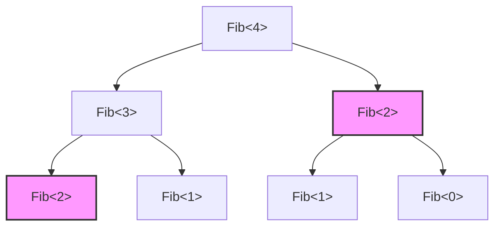
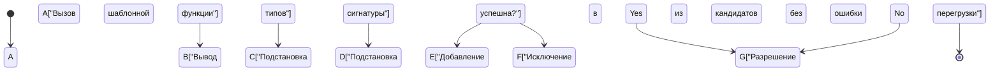
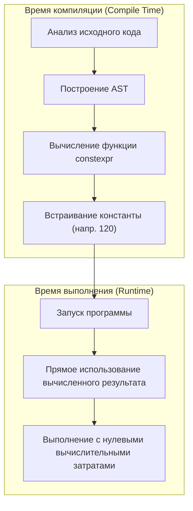

Самой большой привлекательностью языка C++, а одновременно и его величайшей магией (и неизведанной территорией), является «метапрограммирование на шаблонах» (Template Metaprogramming: TMP). Это технология, которая переносит вычисления, обычно выполняемые во время выполнения программы (Run-time), на этап компиляции (Compile-time), когда компилятор анализирует исходный код и генерирует бинарный файл.

В этой статье мы подробно, с использованием практических примеров кода и математического контекста, рассмотрим эволюцию этой возможности: от исторических причин того, как шаблоны C++ обрели вычислительную мощь, до классического SFINAE, современных `constexpr`, `if constexpr`, а также `consteval` и концептов (Concepts) в C++20.

---

## 1. Рассвет метапрограммирования на шаблонах: Случайно открытая полнота по Тьюрингу

### 1.1 Что такое полнота по Тьюрингу

В информатике быть «полным по Тьюрингу» (Turing Complete) означает обладать той же вычислительной мощностью, что и универсальная машина Тьюринга. Проще говоря, это система, в которой можно выразить «условное ветвление» и «бесконечный цикл (или рекурсию)», что позволяет описать и выполнить любой алгоритм.

### 1.2 Открытие Эрвина Унру (Erwin Unruh)

В 1994 году на заседании комитета по стандартизации C++ человек по имени Эрвин Унру (Erwin Unruh) продемонстрировал определенный код на C++. Этот код не компилировался, но **сообщения об ошибках, выводимые компилятором, содержали последовательность простых чисел**.

В процессе инстанцирования (создания экземпляров) шаблонов компилятор выполнял рекурсивные операции и выводил результаты этих вычислений в виде сообщений об ошибках. По сути, это был момент доказательства того, что система шаблонов C++ скрывает в себе **полную по Тьюрингу вычислительную систему**, чего не предполагал даже создатель языка Бьярне Страуструп.

---

## 2. Классическое метапрограммирование на шаблонах (C++98 / C++03)

Раннее метапрограммирование на шаблонах использовало стиль чистого функционального программирования на основе структур (`struct`) и специализации шаблонов (Template Specialization).

### 2.1 Вычисление факториала

Давайте сначала рассмотрим базовый пример: вычисление факториала ($N!$). Математически он определяется следующим образом:

$$
N! = 
\begin{cases} 
1 & (N = 0) \\
N \times (N - 1)! & (N > 0)
\end{cases}
$$

С использованием шаблонов C++98 это можно записать так:

```cpp
#include <iostream>

// Основной шаблон (общий случай рекурсии)
template <int N>
struct Factorial {
    static const int value = N * Factorial<N - 1>::value;
};

// Явная специализация шаблона (базовый случай рекурсии)
template <>
struct Factorial<0> {
    static const int value = 1;
};

int main() {
    // Вычисляется во время компиляции и встраивается как константа
    std::cout << "5! = " << Factorial<5>::value << std::endl; 
    return 0;
}
```

Здесь важно отметить, что `Factorial<5>::value` вычисляется не во время выполнения, а разворачивается во время компиляции. В итоговом бинарном файле генерируется код, эквивалентный `std::cout << "5! = " << 120 << std::endl;`. Благодаря этому накладные расходы во время выполнения равны нулю.

### 2.2 Числа Фибоначчи и вычислительная сложность

Теперь давайте вычислим числа Фибоначчи. Рекуррентная формула выглядит следующим образом:

$$
F_n = F_{n-1} + F_{n-2} \quad (F_0 = 0, F_1 = 1)
$$

```cpp
template <int N>
struct Fib {
    static const int value = Fib<N - 1>::value + Fib<N - 2>::value;
};

template <>
struct Fib<0> { static const int value = 0; };

template <>
struct Fib<1> { static const int value = 1; };
```

Если написать эту реализацию как рекурсивную функцию времени выполнения, одни и те же вычисления будут повторяться многократно, и вычислительная сложность составит экспоненциальное время $O(2^N)$. Однако **при инстанцировании шаблонов во время компиляции тип с одними и теми же аргументами шаблона инстанцируется только один раз** (эффект, похожий на мемоизацию). Поэтому вычислительная сложность во время компиляции фактически составляет $O(N)$.

Следующая диаграмма показывает, как компилятор разрешает экземпляры.



В приведенной выше схеме `Fib<2>`, выделенные одним цветом, инстанцируются внутри компилятора только один раз, а при последующих обращениях используется кэшированное определение типа.

---

## 3. SFINAE и Type Traits (C++11)

По мере развития метапрограммирования важным стало не только «вычисление значений», но и «операции над типами и их проверка». И здесь на сцену выходит **SFINAE** (Substitution Failure Is Not An Error: Неудача подстановки не является ошибкой).

### 3.1 Механизм SFINAE

При разрешении перегрузки шаблонных функций компилятор выводит аргументы шаблона из переданных аргументов и подставляет типы в сигнатуру (объявление функции). В этот момент, если возникает типовое противоречие и подстановка не удается, компилятор не выдает ошибку компиляции немедленно. Вместо этого он **тихо исключает этого кандидата на перегрузку** и ищет следующего.



### 3.2 Условная компиляция с использованием std::enable_if

С помощью заголовка `<type_traits>` и `std::enable_if`, появившихся в C++11, можно активировать функции только для типов, удовлетворяющих определенным условиям.

```cpp
#include <iostream>
#include <type_traits>

// Перегрузка, активируемая только если T — целочисленный тип
template <typename T>
typename std::enable_if<std::is_integral<T>::value>::type
print_type(T val) {
    std::cout << "Integer: " << val << std::endl;
}

// Перегрузка, активируемая только если T — тип с плавающей точкой
template <typename T>
typename std::enable_if<std::is_floating_point<T>::value>::type
print_type(T val) {
    std::cout << "Floating point: " << val << std::endl;
}

int main() {
    print_type(42);      // Integer: 42
    print_type(3.1415);  // Floating point: 3.1415
    // print_type("str"); // Ошибка компиляции: нет подходящей функции
}
```

Этот подход был очень мощным, но синтаксис вроде `typename std::enable_if<...>::type` был крайне избыточным, что стало одной из причин, по которой метапрограммирование в C++ стали избегать, называя его «криптографией».

---

## 4. Сдвиг парадигмы: Внедрение constexpr (C++11/C++14)

В C++11 было введено ключевое слово `constexpr`, что стало настоящей революцией в истории метапрограммирования. Благодаря ему стало возможным **выполнять вычисления во время компиляции, записывая обычные функции**, без необходимости использовать неестественную рекурсию шаблонов.

### 4.1 constexpr в C++11

На этапе C++11 на функции `constexpr` накладывалось строгое ограничение: «тело функции должно состоять только из одного оператора `return`». В результате нельзя было использовать циклы, приходилось полагаться на тернарные операторы и рекурсию.

```cpp
// constexpr Фибоначчи в C++11
constexpr int fib_cxx11(int n) {
    return (n <= 1) ? n : fib_cxx11(n - 1) + fib_cxx11(n - 2);
}
```

### 4.2 Ослабление ограничений constexpr в C++14

В C++14 эти ограничения были значительно смягчены: внутри функций `constexpr` стало возможным объявлять локальные переменные, использовать операторы `if`, циклы `for` и т.д. Это позволяет писать алгоритмы так же естественно, как и для времени выполнения.

```cpp
// constexpr Фибоначчи в C++14
constexpr int fib_cxx14(int n) {
    if (n <= 1) return n;
    int a = 0, b = 1;
    for (int i = 2; i <= n; ++i) {
        int temp = a + b;
        a = b;
        b = temp;
    }
    return b;
}
```

Этот код вычисляется во время компиляции, если это возможно. А если аргументы передаются во время выполнения программы, он вычисляется во время выполнения как обычная функция.



---

## 5. Мастерство статического условного ветвления: if constexpr (C++17)

В C++17 был введен `if constexpr`, который оставляет избыточное разрешение перегрузок через SFINAE в прошлом. Это оператор `if`, оцениваемый во время компиляции, в котором блоки с условием `false` даже не инстанцируются и полностью отбрасываются из процесса компиляции.

Если переписать предыдущий пример SFINAE с использованием `if constexpr`, он становится удивительно простым.

```cpp
#include <iostream>
#include <type_traits>

template <typename T>
void print_type(T val) {
    if constexpr (std::is_integral_v<T>) {
        std::cout << "Integer: " << val << std::endl;
    } 
    else if constexpr (std::is_floating_point_v<T>) {
        std::cout << "Floating point: " << val << std::endl;
    } 
    else {
        std::cout << "Other type" << std::endl;
    }
}
```

Использование `if constexpr` позволяет объединять логику для разных типов в рамках одного шаблона функции, что радикально повышает читабельность кода.

---

## 6. Истинная мощь современного C++: consteval и Concepts (C++20)

C++20 стал самым масштабным обновлением со времен C++11. В области метапрограммирования также произошла радикальная эволюция.

### 6.1 Обязательное вычисление во время компиляции: consteval

В то время как `constexpr` указывал «вычислять во время компиляции, если выполняются условия», он также позволял вычисления во время выполнения программы. В отличие от него, добавленный в C++20 `consteval` определяет **«немедленную функцию» (Immediate Function), которая строго обязана вычисляться во время компиляции**. Попытка ее вычислить во время выполнения приведет к ошибке компиляции.

```cpp
// Принудительное вычисление во время компиляции
consteval int square(int n) {
    return n * n;
}

int main() {
    constexpr int a = square(5); // OK: Вычисление во время компиляции
    
    int x = 5;
    // int b = square(x); // Ошибка: x — переменная времени выполнения, поэтому вычислить нельзя
}
```

### 6.2 Прояснение требований к шаблонам: Concepts (Концепты)

Одним из самых больших недостатков метапрограммирования была «непонятность сообщений об ошибках». При передаче неверного типа в качестве аргумента шаблона могло быть выдано сотни строк неразборчивых ошибок.

Используя **концепты (Concepts)** из C++20, ограничения на типы, принимаемые шаблонами, можно описать в форме, близкой к естественному языку, что делает сообщения об ошибках предельно ясными.

```cpp
#include <concepts>
#include <iostream>

// Требование, чтобы T был целочисленным типом
template <std::integral T>
T add(T a, T b) {
    return a + b;
}

int main() {
    std::cout << add(10, 20) << std::endl;      // OK
    // std::cout << add(1.5, 2.5) << std::endl; // Ошибка: не удовлетворяет std::integral
}
```

---

## 7. Практический пример: проверка на простоту во время компиляции и оптимизация алгоритма

Собрав воедино все полученные знания, давайте напишем код для проверки чисел на простоту во время компиляции. Здесь мы будем использовать современную функцию C++20 (`consteval`).

Временная сложность алгоритма проверки на простоту при наивном подходе составляет $O(N)$, но поскольку достаточно проверять делители до $\sqrt{N}$, у оптимального алгоритма она равна $O(\sqrt{N})$.

```cpp
#include <iostream>

// Вспомогательная функция для вычисления целой части квадратного корня во время компиляции
consteval int compile_time_sqrt(int n) {
    if (n <= 1) return n;
    int res = 1;
    while (res * res <= n) {
        res++;
    }
    return res - 1;
}

// Проверка на простоту с использованием consteval в C++20
consteval bool is_prime(int n) {
    if (n <= 1) return false;
    if (n == 2 || n == 3) return true;
    if (n % 2 == 0) return false;
    
    int limit = compile_time_sqrt(n);
    for (int i = 3; i <= limit; i += 2) {
        if (n % i == 0) return false;
    }
    return true;
}

int main() {
    // Полностью вычисляется во время компиляции
    static_assert(is_prime(104729) == true, "104729 should be prime!");
    static_assert(is_prime(100) == false, "100 should not be prime!");
    
    constexpr bool p = is_prime(9973);
    std::cout << "Is 9973 prime? " << std::boolalpha << p << std::endl;

    return 0;
}
```

В приведенном выше коде функции `compile_time_sqrt` и `is_prime` имеют спецификатор `consteval`, поэтому их вычисление завершается на 100% во время компиляции. В исполняемый бинарный файл просто встраиваются константы (булевы значения) `true` или `false`.

### 7.1 Математическое выражение вычислительной сложности

При проверке на простоту максимальное значение, которое нужно проверить, равно $\lfloor \sqrt{N} \rfloor$.
Таким образом, наихудшее время выполнения $T(N)$ выглядит следующим образом:

$$
T(N) = O(\sqrt{N})
$$

Если вычислять это во время выполнения, например, при криптографической обработке или инициализации масштабных симуляций, это может вызвать задержки от сотен миллисекунд до нескольких секунд. Однако благодаря метапрограммированию во время компиляции, стоимость $T(N)$ полностью берет на себя компилятор, а для пользователя время выполнения составит $O(1)$.

---

## 8. Свет и тень вычислений во время компиляции

До сих пор мы рассматривали мощные возможности C++ по вычислениям во время компиляции, но их нельзя использовать безусловно и повсеместно.

### Преимущества
- **Нулевые накладные расходы во время выполнения**: Поскольку результаты вычислений становятся константами, скорость выполнения достигает максимума.
- **Раннее обнаружение ошибок**: В сочетании с `static_assert` и подобными конструкциями, логические ошибки и несоответствия типов надежно выявляются еще на этапе компиляции.

### Недостатки
- **Резкое увеличение времени сборки**: Вычисления внутри компилятора выполняются в специальной интерпретируемой среде (оценщик AST компилятора), поэтому они намного медленнее выполнения нативного кода. Если заставить компилятор выполнять огромные матричные вычисления, есть риск, что время сборки увеличится до нескольких часов.
- **Раздувание бинарного файла**: При инстанцировании шаблонов с различными типами генерируется множество функций, что может привести к увеличению размера исполняемого файла (Code Bloat).

---

## 9. Заключение

Метапрограммирование на шаблонах в C++ началось как «случайный результат (хак)», когда из сообщений об ошибках выводились простые числа, и через годы стандартизации эволюционировало в сложные и мощные возможности языка (`constexpr`, `if constexpr`, `Concepts`).

В современном C++ порог вхождения в «метапрограммирование» значительно снизился: вы можете пользоваться преимуществами вычислений во время компиляции, записывая интуитивно понятный код точно так же, как и в обычных программах.

В таких областях, как встраиваемые системы, игровые движки и системы высокочастотного трейдинга (HFT), где требуется предельная производительность, эта технология будет оставаться незаменимым оружием и в будущем.

Эволюция C++ не останавливается. В следующих стандартах, таких как C++23 и C++26, нас ждут еще более мощные возможности, например, рефлексия во время компиляции. Обязательно освойте современное программирование на шаблонах и наслаждайтесь миром оптимизаций, выходящих за рамки привычного.
