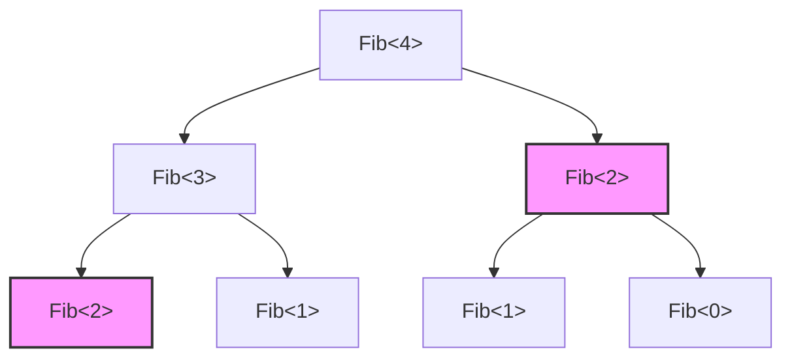
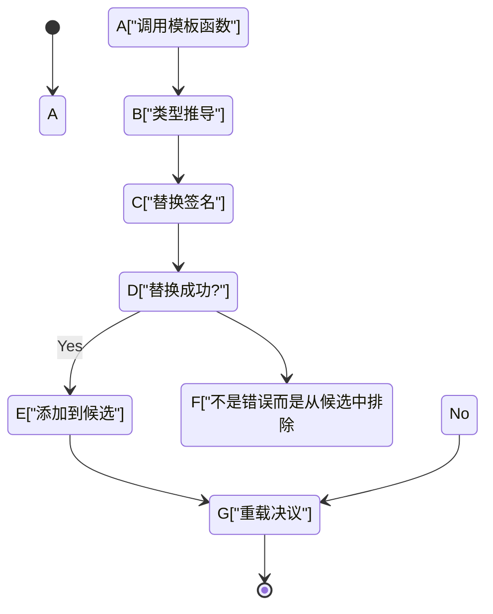
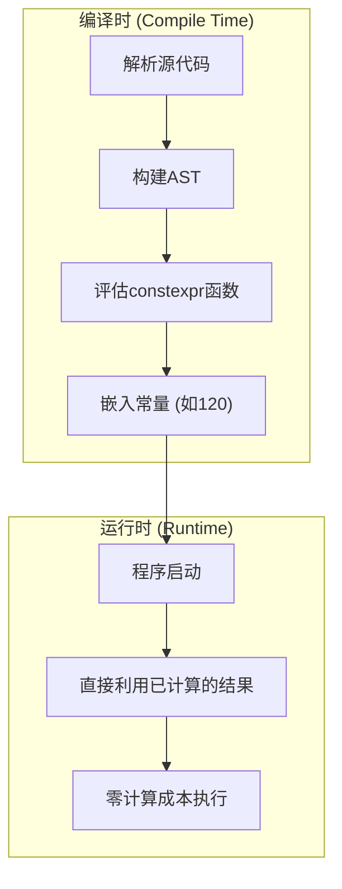

C++这门语言最大的魅力，同时也可以说是最大的魔境，就是“模板元编程（Template Metaprogramming: TMP）”。这项技术将在程序运行时（Run-time）进行的计算，提前到了编译器解析源代码并生成二进制文件的编译时（Compile-time）来执行。

本文将从C++模板最初是如何获得计算能力的历史背景出发，结合实用的代码示例和数学背景，极其详细地讲解其演进过程，涵盖经典的SFINAE、现代的 `constexpr`、`if constexpr`，以及C++20中的 `consteval` 和 Concepts（概念）。

---

## 1. 模板元编程的黎明：偶然发现的图灵完备性

### 1.1 什么是图灵完备性

在计算机科学中，“图灵完备（Turing Complete）”意味着拥有与通用图灵机相同的计算能力。通俗地说，就是能够表达“条件分支”和“无限循环（或递归）”，从而可以描述和执行任意算法的系统。

### 1.2 埃尔温·翁鲁的发现

1994年，在C++标准化委员会的会议上，一位名叫Erwin Unruh（埃尔温·翁鲁）的人展示了一段C++代码。那段代码虽然会导致编译失败，但令人惊讶的是，**编译器输出的错误信息中竟然包含了一系列素数**。

编译器在模板实例化（具体化）的过程中执行了递归处理，并将该计算结果作为错误信息输出。也就是说，在那一瞬间证明了C++的模板功能内含了一个**图灵完备的计算体系**，这甚至连语言设计者本贾尼·斯特劳斯特卢普（Bjarne Stroustrup）都未曾预料到。

---

## 2. 经典的模板元编程 (C++98 / C++03)

早期的模板元编程采用了利用结构体（`struct`）和模板特化（Template Specialization）的纯函数式编程风格。

### 2.1 阶乘（Factorial）的计算

首先让我们来看一个最基本的例子：阶乘（$N!$）的计算。在数学上它的定义如下：

$$
N! = 
\begin{cases} 
1 & (N = 0) \\
N \times (N - 1)! & (N > 0)
\end{cases}
$$

用C++98的模板来编写的话如下所示。

```cpp
#include <iostream>

// 主模板（递归的一般情况）
template <int N>
struct Factorial {
    static const int value = N * Factorial<N - 1>::value;
};

// 模板的显式特化（递归的基础情况/基准情形）
template <>
struct Factorial<0> {
    static const int value = 1;
};

int main() {
    // 在编译时进行计算，并作为常量嵌入
    std::cout << "5! = " << Factorial<5>::value << std::endl; 
    return 0;
}
```

这里的重点是，`Factorial<5>::value` 并不是在运行时计算的，而是在编译时展开，最终生成的二进制文件中包含的是等同于 `std::cout << "5! = " << 120 << std::endl;` 的代码。因此，运行时的开销为零。

### 2.2 斐波那契数列与计算复杂度

接下来，让我们计算一下斐波那契数列。递推公式如下：

$$
F_n = F_{n-1} + F_{n-2} \quad (F_0 = 0, F_1 = 1)
$$

```cpp
template <int N>
struct Fib {
    static const int value = Fib<N - 1>::value + Fib<N - 2>::value;
};

template <>
struct Fib<0> { static const int value = 0; };

template <>
struct Fib<1> { static const int value = 1; };
```

如果用运行时的递归函数来编写这个实现，由于会多次重复相同的计算，其时间复杂度将是指数级的 $O(2^N)$。然而，**在编译时的模板实例化中，具有相同模板参数的类型只会被实例化一次**（产生类似记忆化的效果）。因此，编译时的计算复杂度实际上是 $O(N)$。

下图展示了编译器是如何解析实例的。



在上述图示中，具有相同颜色和形状的 `Fib<2>` 在编译器内部只会被实例化一次，第二次及以后将直接利用缓存的类型定义。

---

## 3. SFINAE与Type Traits（类型特性） (C++11)

随着元编程的发展，不仅是“值的计算”，“类型的操作与判定”也变得越来越重要。此时登场的就是 **SFINAE**（Substitution Failure Is Not An Error：替换失败不是错误）。

### 3.1 SFINAE的机制

在模板函数重载决议时，编译器会根据传入的参数推导模板参数，并替换签名（函数声明部分）中的类型。如果在此时产生了类型冲突导致替换失败，编译器并不会立即抛出编译错误，而是**默默地将该重载候选排除**，并继续寻找下一个候选者。



### 3.2 使用 std::enable_if 进行条件编译

通过使用C++11引入的 `<type_traits>` 头文件和 `std::enable_if`，可以使函数仅对满足特定条件的类型生效。

```cpp
#include <iostream>
#include <type_traits>

// 仅在T为整数类型时生效的重载
template <typename T>
typename std::enable_if<std::is_integral<T>::value>::type
print_type(T val) {
    std::cout << "Integer: " << val << std::endl;
}

// 仅在T为浮点类型时生效的重载
template <typename T>
typename std::enable_if<std::is_floating_point<T>::value>::type
print_type(T val) {
    std::cout << "Floating point: " << val << std::endl;
}

int main() {
    print_type(42);      // Integer: 42
    print_type(3.1415);  // Floating point: 3.1415
    // print_type("str"); // 编译错误：没有匹配的函数
}
```

这种方法非常强大，但是像 `typename std::enable_if<...>::type` 这样的写法非常冗长，这也是导致人们敬而远之、认为“C++的元编程就像密码一样”的原因之一。

---

## 4. 范式转变：constexpr 的引入 (C++11/C++14)

C++11引入了元编程历史上堪称革命性的关键字 `constexpr`。这使得我们无需使用不自然的模板递归，**保持常规函数的写法即可实现编译时计算**。

### 4.1 C++11的 constexpr

在C++11时期，`constexpr` 函数有着严格的限制：“函数体必须仅由单个 `return` 语句构成”。因此，不能使用循环，只能依赖三元运算符和递归。

```cpp
// C++11 的 constexpr 斐波那契
constexpr int fib_cxx11(int n) {
    return (n <= 1) ? n : fib_cxx11(n - 1) + fib_cxx11(n - 2);
}
```

### 4.2 C++14对 constexpr 的放宽

在C++14中，这一限制被大幅放宽，局部变量的声明、`if` 语句、`for` 循环等都可以在 `constexpr` 函数中使用了。由此，我们可以像编写运行时代码一样直观地编写算法。

```cpp
// C++14 的 constexpr 斐波那契
constexpr int fib_cxx14(int n) {
    if (n <= 1) return n;
    int a = 0, b = 1;
    for (int i = 2; i <= n; ++i) {
        int temp = a + b;
        a = b;
        b = temp;
    }
    return b;
}
```

这段代码如果能在编译时被求值，就会在编译时进行计算；如果在运行时传入参数，则会作为普通函数在运行时进行计算。



---

## 5. 极致的静态条件分支：if constexpr (C++17)

C++17引入了 `if constexpr`，它让使用SFINAE进行冗长重载决议的做法成为了过去式。这是一种在编译时求值的 `if` 语句，条件为 `false` 的代码块甚至不会被实例化，而是完全从编译对象中剔除。

如果用 `if constexpr` 重写刚才那个SFINAE的例子，代码会变得令人惊讶地简洁。

```cpp
#include <iostream>
#include <type_traits>

template <typename T>
void print_type(T val) {
    if constexpr (std::is_integral_v<T>) {
        std::cout << "Integer: " << val << std::endl;
    } 
    else if constexpr (std::is_floating_point_v<T>) {
        std::cout << "Floating point: " << val << std::endl;
    } 
    else {
        std::cout << "Other type" << std::endl;
    }
}
```

通过使用 `if constexpr`，可以将面向不同类型的处理逻辑整合在同一个函数模板中，从而极大地提升了代码的可读性。

---

## 6. 现代C++的真谛：consteval 与 Concepts (C++20)

C++20是自C++11以来的一次巨大更新。在元编程领域，也取得了戏剧性的进化。

### 6.1 必须在编译时计算：consteval

`constexpr` 的指示是“如果条件满足则在编译时计算”，但也允许在运行时求值。相比之下，C++20新增的 `consteval` 则定义了**“必须且只能在编译时求值”的立即函数（Immediate Function）**。如果试图在运行时对其求值，则会引发编译错误。

```cpp
// 确保强制进行编译时计算
consteval int square(int n) {
    return n * n;
}

int main() {
    constexpr int a = square(5); // OK: 编译时求值
    
    int x = 5;
    // int b = square(x); // 错误: x是运行时变量，因此无法求值
}
```

### 6.2 明确模板的约束：Concepts

元编程最大的弱点之一就是“错误信息晦涩难懂”。一旦向模板参数传递了错误的类型，往往会吐出长达几百行令人费解的报错。

使用C++20的 **Concepts（概念）**，可以用接近自然语言的方式明确写出模板所接受的类型约束，并且错误信息也会变得极其清晰。

```cpp
#include <concepts>
#include <iostream>

// 要求T必须为整数类型
template <std::integral T>
T add(T a, T b) {
    return a + b;
}

int main() {
    std::cout << add(10, 20) << std::endl;      // OK
    // std::cout << add(1.5, 2.5) << std::endl; // 错误: 不满足 std::integral
}
```

---

## 7. 实践案例：编译时素数判定与算法优化

让我们综合运用前面学到的知识，编写一段在编译时进行素数判定的代码。在这里，我们将使用现代C++20的特性（`consteval`）。

素数判定算法的时间复杂度，如果使用最简单粗暴的查找方式是 $O(N)$，但其实只需检查到 $\sqrt{N}$ 就足够了，因此优化后的算法复杂度为 $O(\sqrt{N})$。

```cpp
#include <iostream>

// 在编译时计算平方根整数部分的辅助函数
consteval int compile_time_sqrt(int n) {
    if (n <= 1) return n;
    int res = 1;
    while (res * res <= n) {
        res++;
    }
    return res - 1;
}

// 使用 C++20 consteval 进行素数判定
consteval bool is_prime(int n) {
    if (n <= 1) return false;
    if (n == 2 || n == 3) return true;
    if (n % 2 == 0) return false;
    
    int limit = compile_time_sqrt(n);
    for (int i = 3; i <= limit; i += 2) {
        if (n % i == 0) return false;
    }
    return true;
}

int main() {
    // 完全在编译时求值
    static_assert(is_prime(104729) == true, "104729 should be prime!");
    static_assert(is_prime(100) == false, "100 should not be prime!");
    
    constexpr bool p = is_prime(9973);
    std::cout << "Is 9973 prime? " << std::boolalpha << p << std::endl;

    return 0;
}
```

在上述代码中，由于 `compile_time_sqrt` 和 `is_prime` 都被指定为了 `consteval`，因此它们的计算会 100% 在编译时完成。在可执行文件的二进制中，只会被嵌入 `true` 或 `false` 这样的常量（布尔值）。

### 7.1 计算复杂度的数学表达

在素数判定中，需要检查的最大值为 $\lfloor \sqrt{N} \rfloor$。
因此，最坏时间复杂度 $T(N)$ 如下所示。

$$
T(N) = O(\sqrt{N})
$$

如果在运行时进行这些计算，例如在密码处理或大规模模拟的初始化中，可能会产生几百毫秒甚至几秒的延迟。但是，如果使用编译时元编程，这个 $T(N)$ 的成本就会完全由编译器承担，用户在运行时的开销就会变为 $O(1)$。

---

## 8. 编译时计算的光与影

到这里我们已经了解了C++强大的编译时计算功能，但这并不意味着我们可以无条件地滥用它。

### 优点
- **运行时零开销**：因为计算结果被常量化了，所以运行速度会达到最快。
- **尽早发现Bug**：通过结合 `static_assert` 等特性，可以在编译阶段可靠地捕获逻辑错误和类型不匹配的问题。

### 缺点
- **构建时间爆炸**：编译器内部的计算是在专门的解释器环境（编译器的AST评估器）中进行的，与运行时执行原生代码相比要慢得多。如果让编译器在编译时进行巨大的矩阵运算等操作，构建时间就有可能暴涨到几个小时的级别。
- **二进制膨胀**：如果模板被多种类型实例化，可能会生成大量函数，从而导致可执行文件体积增大的现象（Code Bloat，代码膨胀）。

---

## 9. 结论

C++的模板元编程，从通过错误信息输出素数这一“偶然的产物（Hack）”起步，经过多年的标准化工作，如今已经进化为了精炼的语言特性（`constexpr`，`if constexpr`，`Concepts`）。

在现代的C++中，“元编程”这个词的门槛已经急剧降低，我们可以在编写如同普通程序般直观代码的同时，享受到编译时计算带来的好处。

在追求极致性能的嵌入式系统、游戏引擎、高频交易（HFT）系统等领域，这项技术在未来仍将是不可或缺的武器。

C++的进化仍未止步。在下一代标准C++23和C++26中，还有编译时反射等更强大的功能蓄势待发。希望大家也能熟练运用现代模板编程，享受超越极限的优化世界。
