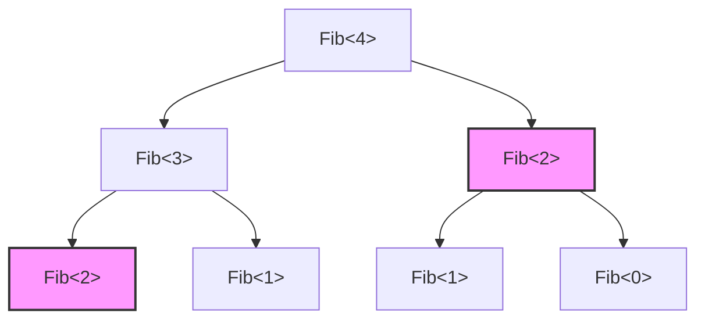
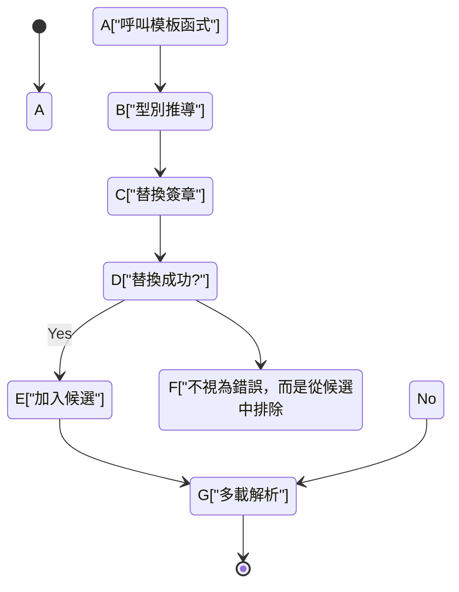
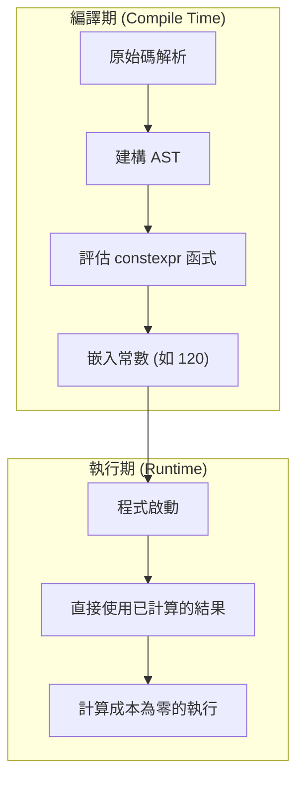

C++ 這門語言最大的魅力，同時也是最深不可測的領域，莫過於「模板元編程（Template Metaprogramming: TMP）」了。這是一項將原本在程式執行期（Run-time）進行的計算，提前到編譯器解析原始碼並生成二進位檔案的編譯期（Compile-time）來執行的技術。

本文將從 C++ 模板最初是如何獲得計算能力的歷史背景開始，極其詳細地解說傳統的 SFINAE、現代的 `constexpr`、`if constexpr`，乃至於 C++20 中的 `consteval` 和 Concepts（概念），並穿插實用的程式碼範例與數學背景。

---

## 1. 模板元編程的黎明：偶然發現的圖靈完備性

### 1.1 什麼是圖靈完備性

在計算機科學中，「圖靈完備（Turing Complete）」意味著擁有與萬能圖靈機相同的計算能力。白話來說，就是一個能夠表現「條件分支」和「無限迴圈（或遞迴）」，並能描述與執行任意演算法的系統。

### 1.2 Erwin Unruh 的發現

1994 年，在 C++ 標準化委員會的會議上，一位名叫 Erwin Unruh 的人物展示了一段 C++ 程式碼。雖然這段程式碼無法編譯成功，但令人驚訝的是，**編譯器輸出的錯誤訊息中，竟然包含了一連串的質數**。

編譯器在實體化（Instantiation）模板的過程中進行了遞迴處理，並將計算結果作為錯誤訊息輸出。也就是說，這證明了 C++ 的模板功能，內含了一個連語言設計者 Bjarne Stroustrup 都未曾預料到的**圖靈完備計算體系**。

---

## 2. 傳統的模板元編程 (C++98 / C++03)

早期的模板元編程採用了純函數式編程的風格，利用結構體（`struct`）和模板特化（Template Specialization）來實現。

### 2.1 階乘（Factorial）的計算

首先來看看最基本的例子：階乘（$N!$）的計算。在數學上它的定義如下：

$$
N! = 
\begin{cases} 
1 & (N = 0) \\
N \times (N - 1)! & (N > 0)
\end{cases}
$$

用 C++98 的模板來撰寫會是這樣：

```cpp
#include <iostream>

// 主模板（遞迴的一般情況）
template <int N>
struct Factorial {
    static const int value = N * Factorial<N - 1>::value;
};

// 模板的明確特化（遞迴的基礎情況）
template <>
struct Factorial<0> {
    static const int value = 1;
};

int main() {
    // 在編譯期進行計算，並作為常數嵌入
    std::cout << "5! = " << Factorial<5>::value << std::endl; 
    return 0;
}
```

這裡的重點在於，`Factorial<5>::value` 並不是在執行期計算的，而是在編譯期就被展開。最終生成的二進位檔案，等同於寫了 `std::cout << "5! = " << 120 << std::endl;`。這使得執行期的額外開銷（Overhead）降為零。

### 2.2 費氏數列與時間複雜度

接下來我們來計算費氏數列（Fibonacci sequence）。遞迴公式如下：

$$
F_n = F_{n-1} + F_{n-2} \quad (F_0 = 0, F_1 = 1)
$$

```cpp
template <int N>
struct Fib {
    static const int value = Fib<N - 1>::value + Fib<N - 2>::value;
};

template <>
struct Fib<0> { static const int value = 0; };

template <>
struct Fib<1> { static const int value = 1; };
```

如果將這個實作寫成執行期的遞迴函式，因為會重複計算相同的項目，時間複雜度將會是指數級的時間 $O(2^N)$。然而，**在編譯期實體化模板時，擁有相同模板參數的型別只會被實體化一次**（類似記憶化，Memoization 的效果）。因此，編譯期的計算量實際上是 $O(N)$。

下圖展示了編譯器是如何解析這些實體（Instances）的。



在上述過程中，具有相同顏色和形狀的 `Fib<2>` 在編譯器內部只會被實體化一次，第二次之後會直接使用已快取的型別定義。

---

## 3. SFINAE 與 Type Traits (C++11)

隨著元編程的發展，除了「數值的計算」，「型別的操作與判斷」也變得越來越重要。這時就輪到 **SFINAE**（Substitution Failure Is Not An Error：替換失敗並非錯誤）登場了。

### 3.1 SFINAE 的機制

在解析模板函式的多載（Overload）時，編譯器會根據傳入的引數推導出模板參數，並替換函式簽章（宣告部分）的型別。這時，如果發生型別上的矛盾導致替換失敗，編譯器並不會立刻發出編譯錯誤，而是**默默將該多載候選排除**，繼續尋找下一個候選。



### 3.2 使用 std::enable_if 進行條件編譯

透過使用 C++11 引入的 `<type_traits>` 標頭檔與 `std::enable_if`，我們可以讓函式只對滿足特定條件的型別生效。

```cpp
#include <iostream>
#include <type_traits>

// 只有當 T 為整數型別時才會生效的多載
template <typename T>
typename std::enable_if<std::is_integral<T>::value>::type
print_type(T val) {
    std::cout << "Integer: " << val << std::endl;
}

// 只有當 T 為浮點數型別時才會生效的多載
template <typename T>
typename std::enable_if<std::is_floating_point<T>::value>::type
print_type(T val) {
    std::cout << "Floating point: " << val << std::endl;
}

int main() {
    print_type(42);      // Integer: 42
    print_type(3.1415);  // Floating point: 3.1415
    // print_type("str"); // 編譯錯誤：沒有相符的函式
}
```

這個方法非常強大，但像 `typename std::enable_if<...>::type` 這樣的寫法過於冗長，這也是許多人認為「C++ 的元編程就像天書一樣」而敬而遠之的原因之一。

---

## 4. 典範轉移：constexpr 的引入 (C++11/C++14)

在 C++11 中，引入了堪稱元編程歷史上一大革命的關鍵字 `constexpr`。這使得我們不再需要依賴不自然的模板遞迴，**可以用一般函式的寫法來進行編譯期計算**。

### 4.1 C++11 的 constexpr

在 C++11 時，`constexpr` 函式有著非常嚴格的限制：「函式主體必須只由單一的 `return` 敘述組成」。因此，無法使用迴圈，只能依賴三元運算子與遞迴。

```cpp
// C++11 的 constexpr 費氏數列
constexpr int fib_cxx11(int n) {
    return (n <= 1) ? n : fib_cxx11(n - 1) + fib_cxx11(n - 2);
}
```

### 4.2 C++14 放寬的 constexpr

C++14 大幅放寬了這個限制，允許在 `constexpr` 函式內部宣告區域變數，並使用 `if` 敘述、`for` 迴圈等。這讓我們可以像撰寫執行期程式一樣，自然地編寫演算法。

```cpp
// C++14 的 constexpr 費氏數列
constexpr int fib_cxx14(int n) {
    if (n <= 1) return n;
    int a = 0, b = 1;
    for (int i = 2; i <= n; ++i) {
        int temp = a + b;
        a = b;
        b = temp;
    }
    return b;
}
```

這段程式碼如果在編譯期能夠被求值，就會在編譯期進行計算；如果在執行期才傳入引數，就會當作一般的函式在執行期計算。



---

## 5. 將靜態條件分支發揮到極致：if constexpr (C++17)

C++17 引入了 `if constexpr`，讓依賴 SFINAE 的冗長多載解析成為過去式。這是一個在編譯期進行求值的 `if` 敘述，條件為 `false` 的區塊甚至連實體化都不會發生，會被直接從編譯對象中完全捨棄。

如果將前面 SFINAE 的例子用 `if constexpr` 重寫，程式碼會變得驚人地簡潔。

```cpp
#include <iostream>
#include <type_traits>

template <typename T>
void print_type(T val) {
    if constexpr (std::is_integral_v<T>) {
        std::cout << "Integer: " << val << std::endl;
    } 
    else if constexpr (std::is_floating_point_v<T>) {
        std::cout << "Floating point: " << val << std::endl;
    } 
    else {
        std::cout << "Other type" << std::endl;
    }
}
```

透過使用 `if constexpr`，我們可以在同一個函式模板內將針對不同型別的處理整合在一起，可讀性得到了飛躍性的提升。

---

## 6. 現代 C++ 的精髓：consteval 與 Concepts (C++20)

C++20 是自 C++11 以來最龐大的更新。在元編程的領域中，也實現了戲劇性的進化。

### 6.1 強制在編譯期計算：consteval

`constexpr` 是「如果條件具備就在編譯期計算」的指示，但它也允許在執行期求值。相對地，C++20 新增的 `consteval` 則是定義了**「必須強制在編譯期求值」的立即函式（Immediate Function）**。如果試圖在執行期求值，將會導致編譯錯誤。

```cpp
// 確保強制進行編譯期計算
consteval int square(int n) {
    return n * n;
}

int main() {
    constexpr int a = square(5); // OK: 編譯期求值
    
    int x = 5;
    // int b = square(x); // 錯誤: x 是執行期變數，無法求值
}
```

### 6.2 明確界定模板的條件要求：Concepts

元編程最大缺點之一就是「令人費解的錯誤訊息」。如果傳遞了錯誤的型別給模板引數，有時會印出數百行讓人摸不著頭緒的錯誤訊息。

透過使用 C++20 的 **Concepts（概念）**，我們可以用接近自然語言的方式，明確規範模板接受型別的限制條件，錯誤訊息也會變得非常清晰易懂。

```cpp
#include <concepts>
#include <iostream>

// 要求 T 必須為整數型別
template <std::integral T>
T add(T a, T b) {
    return a + b;
}

int main() {
    std::cout << add(10, 20) << std::endl;      // OK
    // std::cout << add(1.5, 2.5) << std::endl; // 錯誤: 不符合 std::integral
}
```

---

## 7. 實戰範例：編譯期質數判斷與演算法最佳化

讓我們動用前面學到的所有知識，撰寫一段在編譯期進行質數判斷的程式碼。這裡我們將使用現代 C++20 的功能（`consteval`）。

如果用直觀的方式尋找，質數判斷演算法的時間複雜度是 $O(N)$。但因為實際上只需要檢查到 $\sqrt{N}$ 就足夠了，所以最佳演算法的時間複雜度是 $O(\sqrt{N})$。

```cpp
#include <iostream>

// 在編譯期計算平方根整數部分的輔助函式
consteval int compile_time_sqrt(int n) {
    if (n <= 1) return n;
    int res = 1;
    while (res * res <= n) {
        res++;
    }
    return res - 1;
}

// 使用 C++20 consteval 進行的質數判斷
consteval bool is_prime(int n) {
    if (n <= 1) return false;
    if (n == 2 || n == 3) return true;
    if (n % 2 == 0) return false;
    
    int limit = compile_time_sqrt(n);
    for (int i = 3; i <= limit; i += 2) {
        if (n % i == 0) return false;
    }
    return true;
}

int main() {
    // 完全在編譯期求值
    static_assert(is_prime(104729) == true, "104729 should be prime!");
    static_assert(is_prime(100) == false, "100 should not be prime!");
    
    constexpr bool p = is_prime(9973);
    std::cout << "Is 9973 prime? " << std::boolalpha << p << std::endl;

    return 0;
}
```

在上述程式碼中，由於 `compile_time_sqrt` 和 `is_prime` 都指定了 `consteval`，這些計算會 100% 在編譯期完成。執行檔的二進位檔案裡，就只會嵌入 `true` 或 `false` 的常數（布林值）。

### 7.1 計算量的數學表示

在判斷質數時，需要檢查的最大值為 $\lfloor \sqrt{N} \rfloor$。
因此，最壞情況的時間複雜度 $T(N)$ 如下：

$$
T(N) = O(\sqrt{N})
$$

如果在執行期計算，可能會在密碼處理或大規模模擬的初始化等場景造成數百毫秒到數秒的延遲。但是，如果使用編譯期元編程，這個 $T(N)$ 的成本將完全由編譯器承擔，對使用者而言的執行期成本將會是 $O(1)$。

---

## 8. 編譯期計算的明與暗

雖然我們見識了 C++ 如此強大的編譯期計算功能，但這並不代表我們可以無條件地濫用它。

### 優點
- **執行期零額外開銷（Zero Overhead）**：計算結果已經常數化，執行速度會是最快的。
- **及早發現 Bug**：與 `static_assert` 等搭配使用，可以在編譯階段確實捕捉到邏輯崩潰或型別不一致的問題。

### 缺點
- **編譯時間暴增**：編譯器內部的計算是在專屬的直譯器環境（編譯器的 AST 評估器）中執行的，這遠比執行期的原生程式碼執行慢上許多。如果在編譯期進行像是巨大的矩陣運算，可能會有讓編譯時間飆升至數小時等級的風險。
- **二進位檔案過度肥大（Code Bloat）**：如果模板被各種型別大量實體化，可能會生成大量的函式，導致執行檔體積暴增。

---

## 9. 結論

C++ 的模板元編程始於「編譯錯誤訊息意外輸出質數」這個偶然的產物（Hack），經過長年的標準化作業，一路演進成設計精良的語言功能（`constexpr`、`if constexpr`、`Concepts`）。

在現代 C++ 中，「元編程」的門檻已經大幅降低。我們可以像寫一般程式一樣寫出直覺的程式碼，並同時享受到編譯期計算帶來的恩惠。

對於追求極致效能的嵌入式系統、遊戲引擎以及高頻交易（HFT）系統等領域，這項技術在未來仍然會是不可或缺的武器。

C++ 的演進並未就此停下腳步。在未來的標準（C++23、C++26）中，還有如編譯期反射（Compile-time Reflection）等更強大的功能蓄勢待發。希望大家也能靈活運用現代的模板編程，享受突破極限的最佳化世界。
