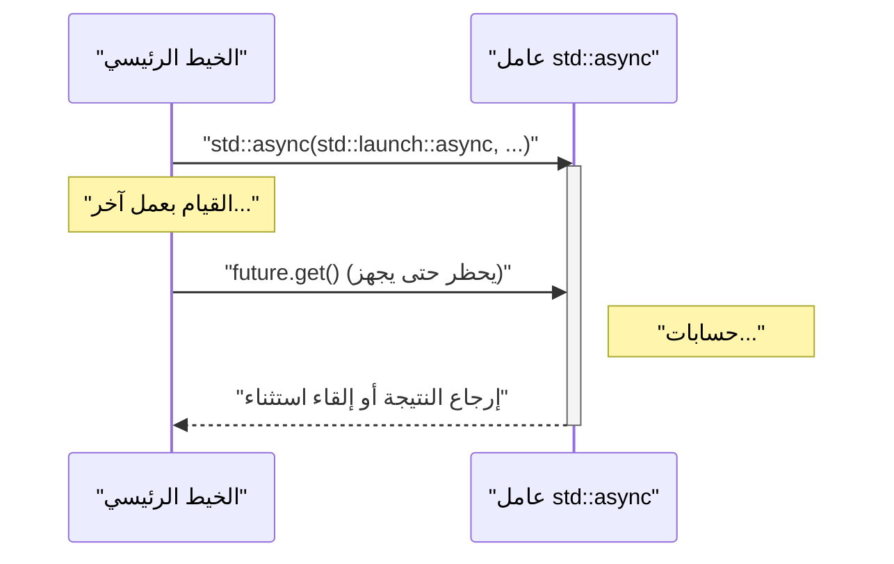
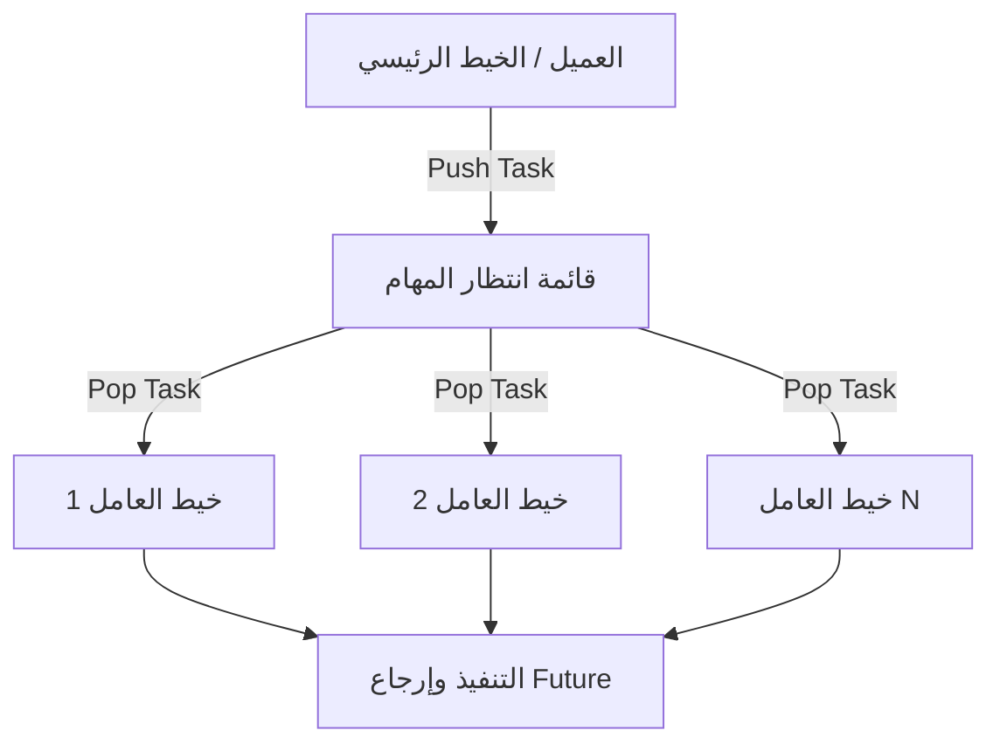

في تطوير البرمجيات الحديثة، تعتبر البرمجة متعددة الخيوط (multithreading) ضرورية لتحقيق أقصى استفادة من أداء وحدات المعالجة المركزية متعددة النواة (multi-core CPUs). منذ الإصدار C++11، قدمت C++ واجهات برمجة التطبيقات (APIs) للبرمجة متعددة الخيوط والمعالجة غير المتزامنة (`<thread>`, `<mutex>`, `<condition_variable>`, `<future>`) كمكتبة قياسية، مما يتيح لك تنفيذ معالجة متزامنة آمنة ومحمولة دون كتابة تعليمات برمجية تعتمد على المنصة (مثل خيوط POSIX أو واجهة برمجة تطبيقات Windows). علاوة على ذلك، مع كل ترقية للإصدار مثل C++14 و C++17 و C++20، تمت إضافة ميزات أكثر أمانًا وتقدمًا مثل `std::scoped_lock` و `std::jthread`.

في هذا المقال، سنشرح بشكل شامل أساسيات البرمجة متعددة الخيوط في C++، وآليات المزامنة لمنع تعارض البيانات، بالإضافة إلى المفاهيم الحديثة للمعالجة غير المتزامنة (`std::async`) ومجمعات الخيوط (thread pools) مع أمثلة برمجية مفصلة.

---

## 1. أساسيات المعالجة المتزامنة وقانون أمدال (Amdahl's Law)

الهدف الرئيسي من استخدام خيوط المعالجة المتعددة هو "تحسين الأداء"، ولكن لا يمكن موازاة (توازي) البرنامج بأكمله. وهنا تكمن أهمية **قانون أمدال (Amdahl's Law)**.

قانون أمدال هو نموذج يتنبأ بمدى تحسن أداء النظام ككل عند موازاة وتسريع جزء من البرنامج.

$$ S(N) = \frac{1}{(1 - P) + \frac{P}{N}} $$

* $S(N)$ : الحد الأقصى النظري لنسبة زيادة السرعة
* $P$ : نسبة الجزء القابل للموازاة من البرنامج بأكمله (0 ≤ $P$ ≤ 1)
* $N$ : عدد المعالجات (الخيوط)

الحقيقة المهمة التي توضحها هذه الصيغة هي: "بغض النظر عن مدى زيادة عدد المعالجات $N$، فإن الجزء التسلسلي $(1 - P)$ الذي لا يمكن موازاته سيصبح عنق الزجاجة (bottleneck)، وهناك حد أقصى لزيادة السرعة". على سبيل المثال، حتى إذا كان $90\%$ من البرنامج قابلاً للموازاة ($P = 0.9$)، طالما أن الـ $10\%$ المتبقية هي معالجة تسلسلية، فحتى مع استخدام عدد لا نهائي من المعالجات، فإن السرعة ستزداد بحد أقصى $10$ مرات فقط ($S(\infty) = 1 / 0.1$).

لذلك، عند القيام بالبرمجة متعددة الخيوط في C++، لا يقتصر الأمر على مجرد زيادة عدد الخيوط، بل يتطلب الأمر **تصميماً يقلل من أجزاء المعالجة التسلسلية (مثل تعارض الأقفال أو العبء الإضافي للمزامنة) قدر الإمكان**.

---

## 2. أساسيات الخيوط: `std::thread` و `std::jthread` (C++20)

### خيط `std::thread` التقليدي (C++11)

تم تقديم `std::thread` في C++11، وهو الفئة الأساسية لتنفيذ الدوال وتعبيرات لامدا (lambda expressions) في خيط جديد.

```cpp
#include <iostream>
#include <thread>

void workerFunction(int id) {
    std::cout << "Worker " << id << " is running on thread " 
              << std::this_thread::get_id() << std::endl;
}

int main() {
    std::cout << "Main thread id: " << std::this_thread::get_id() << std::endl;

    // إنشاء الخيط وبدء تنفيذه
    std::thread t1(workerFunction, 1);
    
    // إنشاء خيط باستخدام تعبير لامدا
    std::thread t2([](int id) {
        std::cout << "Lambda Worker " << id << " is running." << std::endl;
    }, 2);

    // انتظار انتهاء الخيط (join)
    t1.join();
    t2.join();

    std::cout << "All threads completed." << std::endl;
    return 0;
}
```

النقطة المهمة التي يجب الانتباه إليها في `std::thread` هي أنه **يجب دائماً استدعاء `join()` أو `detach()` قبل تدمير الكائن**. إذا تم استدعاء المُدمّر (destructor) الخاص بـ `std::thread` دون استدعاء أي منهما، فسيتم استدعاء `std::terminate()`، مما يؤدي إلى انهيار البرنامج. لضمان الأمان ضد الاستثناءات (exception safety)، كان من الضروري كتابة فئة غلاف مخصصة باستخدام نمط RAII.

### خيط `std::jthread` الحديث (C++20)

في C++20، تم تقديم `std::jthread` (خيط الانضمام - joining thread) لحل هذه العيوب. يستدعي `std::jthread` الدالة `join()` تلقائياً في المُدمّر الخاص به، مما يسمح بالانتظار الآمن لإنهاء الخيط حتى عند حدوث استثناء. كما أنه مزود بميزة للإلغاء التعاوني للخيوط عبر `std::stop_token`.

```cpp
#include <iostream>
#include <thread>
#include <chrono>

int main() {
    // C++20: std::jthread
    // يمكن اكتشاف طلب الإلغاء عن طريق استقبال std::stop_token كمعامل أول
    std::jthread jt([](std::stop_token stoken) {
        while (!stoken.stop_requested()) {
            std::cout << "Working..." << std::endl;
            std::this_thread::sleep_for(std::chrono::milliseconds(500));
        }
        std::cout << "Stop requested. Exiting thread." << std::endl;
    });

    std::this_thread::sleep_for(std::chrono::seconds(2));
    
    // طلب الإلغاء صراحةً
    jt.request_stop(); 
    
    // لا حاجة لاستدعاء join() يدوياً، حيث يتم الانضمام تلقائياً في مُدمّر jthread
    return 0;
}
```

---

## 3. تجنب تعارض البيانات والمزامنة: كائنات الاستبعاد المتبادل (Mutex) والأقفال (Locks)

عندما تصل عدة خيوط إلى نفس منطقة الذاكرة (مثل متغير) في نفس الوقت ويقوم أحدها على الأقل بالكتابة، يحدث **تعارض البيانات (Data Race)**. في معيار C++، يؤدي تعارض البيانات إلى سلوك غير محدد (Undefined Behavior). لمنع حدوث ذلك، من الضروري استخدام التحكم في الاستبعاد المتبادل باستخدام `std::mutex`.

### `std::mutex` و `std::lock_guard`

لا يُنصح باستدعاء `std::mutex::lock()` و `unlock()` الخام يدوياً، لوجود خطر ألا يتم استدعاء `unlock()` عند حدوث استثناء، مما يؤدي إلى حالة الجمود (Deadlock). في C++، نستخدم `std::lock_guard` (في C++11) أو `std::scoped_lock` (في C++17) التي تستخدم نمط RAII.

```cpp
#include <iostream>
#include <vector>
#include <thread>
#include <mutex>

std::mutex g_mutex;
int g_counter = 0;

void incrementCounter(int iterations) {
    for (int i = 0; i < iterations; ++i) {
        // يتم فك القفل (unlock) تلقائياً عند الخروج من النطاق (scope)
        std::lock_guard<std::mutex> lock(g_mutex);
        ++g_counter;
    }
}

int main() {
    std::vector<std::thread> threads;
    for (int i = 0; i < 10; ++i) {
        threads.emplace_back(incrementCounter, 10000);
    }

    for (auto& t : threads) {
        t.join();
    }

    std::cout << "Final counter value: " << g_counter << std::endl;
    // ستكون النتيجة كما هو متوقع 100000
    return 0;
}
```

### `std::unique_lock`

يُعد `std::lock_guard` قفلاً بسيطاً يعتمد على النطاق، ولكن إذا كنت بحاجة إلى تحكم أكثر مرونة (مثل القفل المؤجل، القفل المقيد بوقت، أو فك القفل في المنتصف)، فيجب استخدام `std::unique_lock`. في القسم التالي الذي يشرح `std::condition_variable`، يُعد استخدام `std::unique_lock` إلزامياً.

---

## 4. التواصل بين الخيوط: `std::condition_variable`

لتنفيذ "نمط المنتج والمستهلك (Producer-Consumer Pattern)"، حيث ينتظر خيط معين حتى يتم استيفاء شرط ما، ويقوم خيط آخر بإرسال إشعار عندما يتحقق هذا الشرط، يتم استخدام `std::condition_variable`.

```cpp
#include <iostream>
#include <thread>
#include <mutex>
#include <condition_variable>
#include <queue>

std::mutex g_mtx;
std::condition_variable g_cv;
std::queue<int> g_dataQueue;
bool g_isFinished = false;

void producer() {
    for (int i = 1; i <= 5; ++i) {
        std::this_thread::sleep_for(std::chrono::milliseconds(200));
        {
            std::lock_guard<std::mutex> lock(g_mtx);
            g_dataQueue.push(i);
            std::cout << "Produced: " << i << std::endl;
        }
        g_cv.notify_one(); // إشعار المستهلك
    }
    
    {
        std::lock_guard<std::mutex> lock(g_mtx);
        g_isFinished = true;
    }
    g_cv.notify_one(); // إشعار بالانتهاء
}

void consumer() {
    while (true) {
        std::unique_lock<std::mutex> lock(g_mtx);
        // الانتظار حتى يتحقق الشرط (قائمة الانتظار ليست فارغة، أو تم تعيين علامة الانتهاء)
        // تحديد الشرط بتعبير لامدا لمنع الاستيقاظ الزائف (Spurious Wakeup)
        g_cv.wait(lock, []{ return !g_dataQueue.empty() || g_isFinished; });

        while (!g_dataQueue.empty()) {
            int val = g_dataQueue.front();
            g_dataQueue.pop();
            // فك القفل وإجراء العمليات الثقيلة (في هذه الحالة، الطباعة فقط)
            lock.unlock();
            std::cout << "Consumed: " << val << std::endl;
            lock.lock(); // الحصول على القفل مرة أخرى
        }

        if (g_isFinished && g_dataQueue.empty()) {
            break;
        }
    }
}

int main() {
    std::thread t1(producer);
    std::thread t2(consumer);
    t1.join();
    t2.join();
    return 0;
}
```

في هذا المثال، تضع دالة `std::condition_variable::wait` الخيط في حالة سكون (sleep) حتى يتحقق الشرط، مما يمنع الاستهلاك المهدر لموارد وحدة المعالجة المركزية (حلقات الانتظار النشطة - busy waiting).

---

## 5. المعالجة غير المتزامنة عالية التجريد: `std::future`, `std::promise`, `std::async`

على الرغم من أن `std::thread` و `std::mutex` اللتين ذكرناهما حتى الآن قويتان، إلا أنهما تجلبان آليات الخيوط منخفضة المستوى لنظام التشغيل مباشرة إلى C++، مما يجعل التعليمات البرمجية معقدة عند التعامل مع الحصول على النتائج أو تمرير الاستثناءات. إذا كنت ترغب في إجراء معالجة متزامنة تُرجع قيمة، أو معالجة غير متزامنة ذات مستوى أعلى، فاستخدم ميزات الترويسة `<future>`.

### `std::promise` و `std::future`

يمثل `std::promise` الجانب الذي "يحدد" النتيجة، بينما يمثل `std::future` الجانب الذي "يستقبل" النتيجة. تعمل هذه العناصر كقناة آمنة لتمرير النتائج والاستثناءات بين الخيوط.

### المعالجة المتزامنة المستندة إلى المهام باستخدام `std::async`

الطريقة الأكثر موصى بها لتنفيذ المهام غير المتزامنة في C++ هي استخدام `std::async`. يقوم `std::async` بتنفيذ مهمة بشكل غير متزامن ويرجع `std::future` للحصول على نتيجتها.

```cpp
#include <iostream>
#include <future>
#include <chrono>

int complexCalculation(int x) {
    std::cout << "Calculation started on thread: " 
              << std::this_thread::get_id() << std::endl;
    std::this_thread::sleep_for(std::chrono::seconds(2));
    if (x < 0) {
        throw std::invalid_argument("x must be positive");
    }
    return x * 42;
}

int main() {
    std::cout << "Main thread id: " << std::this_thread::get_id() << std::endl;

    // التنفيذ في خيط منفصل قسراً بتحديد std::launch::async
    std::future<int> resultFuture = std::async(std::launch::async, complexCalculation, 10);

    std::cout << "Main thread is doing other work..." << std::endl;

    try {
        // عند استدعاء get()، يتم حظر الخيط الحالي والانتظار حتى انتهاء الحساب
        int result = resultFuture.get();
        std::cout << "Result: " << result << std::endl;
    } catch (const std::exception& e) {
        std::cerr << "Exception caught: " << e.what() << std::endl;
    }

    return 0;
}
```

يوضح مخطط التسلسل (Sequence Diagram) التالي سلوك `std::async`.



يوجد نوعان من سياسات الإطلاق (Launch Policy) التي يمكن تمريرها كمعامل أول في `std::async`:
* `std::launch::async`: يقوم دائمًا بإنشاء خيط جديد (أو تخصيص واحد من مجمع الخيوط) والتنفيذ بشكل غير متزامن.
* `std::launch::deferred`: التقييم المؤجل (Lazy evaluation). يتم التنفيذ بشكل متزامن في نفس الخيط المستدعي فقط عندما يتم استدعاء `future.get()` أو `future.wait()`.

في حالة الافتراضي (بدون تحديد سياسة)، يعتمد الأمر على التطبيق (Implementation-defined)، وسيتم اختيار أحدهما بناءً على ظروف حمل النظام. إذا كنت ترغب بالتأكيد في التنفيذ غير المتزامن، فيجب الإشارة صراحة إلى `std::launch::async`.

---

## 6. مفهوم مجمع الخيوط (Thread Pool)

إذا قمت باستدعاء `std::async` في كل مرة، أو بإنشاء وتدمير `std::thread` داخل حلقة (loop) بشكل متكرر، فإن العبء الإضافي (overhead) الناتج عن تبديل السياق (context switch) للخيوط وتأمين موارد نظام التشغيل يصبح كبيراً ولا يمكن تجاهله. وخاصة عند معالجة عدد كبير من المهام الصغيرة (Fine-grained tasks)، يصبح استخدام مجمع الخيوط (Thread Pool) ضرورياً.

مجمع الخيوط هو بنية حيث يتم إنشاء عدد معين من خيوط العمال (Worker threads) مسبقاً عند بدء تشغيل التطبيق، ويتم تجميع المهام في قائمة انتظار (Queue)، ومن ثم تتم معالجة المهام بالتسلسل بواسطة خيوط العمال المتاحة (الفارغة).



لا تحتوي المكتبة القياسية لـ C++ (حتى إصدار C++23) على فئة مجمع خيوط قياسية، ولكن من الممكن تنفيذ مجمع خيوط فعال في عشرات الأسطر من خلال دمج `std::thread`, `std::mutex`, `std::condition_variable`, `std::function`, و `std::packaged_task`. في العمليات الفعلية، من الشائع أيضاً استخدام عمليات الإدخال/الإخراج غير المتزامنة من `Boost.Asio` أو مكتبات الجهات الخارجية.

---

## 7. اعتبارات الأداء وقابلية التوسع (Scalability)

لتحقيق أفضل أداء في البرمجة متعددة الخيوط، يجب الانتباه ليس فقط إلى موازاة التعليمات البرمجية، ولكن أيضاً إلى بنية الأجهزة (hardware architecture).

* **المشاركة الزائفة (False Sharing):** 
  على الرغم من أن خيوط متعددة قد تقوم بتحديث متغيرات منفصلة، إلا أنه إذا تم وضع هذه المتغيرات في نفس خط ذاكرة التخزين المؤقت (Cache Line) لوحدة المعالجة المركزية (عادة 64 بايت)، ستحدث مزامنة غير ضرورية للذاكرة للحفاظ على اتساق ذاكرة التخزين المؤقت (Cache Coherency)، مما يؤدي إلى انخفاض الأداء بشكل كبير. لمنع حدوث ذلك، من الضروري استخدام محدد `alignas` لمحاذاة المتغيرات على حدود خط التخزين المؤقت.
* **البرمجة الخالية من الأقفال (Lock-Free) و `std::atomic`:**
  لتجنب العبء الإضافي المرتبط بقفل/فك قفل كائنات الاستبعاد المتبادل، يُنظر في استخدام العمليات الذرية غير القابلة للتجزئة باستخدام `<atomic>` (مثل Compare-And-Swap) أو تقديم هياكل بيانات خالية من الأقفال. ومع ذلك، يتطلب هذا فهماً صحيحاً لترتيب الذاكرة (`std::memory_order`) وتكون صعوبة التنفيذ عالية جداً، لذلك لا يتم إدخالها عادةً إلا بعد قياس دقيق للأداء وعندما يُحكم بأنها ضرورية.

---

## 8. الخلاصة

لقد شرحنا البرمجة متعددة الخيوط والمعالجة غير المتزامنة في C++، من الأساسيات إلى أحدث ميزات C++20. النقاط المهمة هي كالتالي:

1. **استخدم `std::async` كأساس:** بالنسبة للمهام غير المتزامنة لمرة واحدة أو المعالجة المتزامنة التي تُرجع نتيجة، استخدم `std::async` و `std::future` لأنهما أكثر أمانًا من إدارة الخيوط يدويًا.
2. **استخدم `std::jthread` لإدارة الخيوط:** بالنسبة للخيوط التي تعمل في الخلفية لفترة طويلة، استخدم `std::jthread` من C++20 لضمان عملية إنهاء آمنة.
3. **استفد من RAII للمزامنة:** يجب دائماً إجراء قفل كائنات الاستبعاد المتبادل (Mutex) لمنع تعارض البيانات من خلال `std::lock_guard` أو `std::unique_lock`.
4. **كن واعياً بالعبء الإضافي (Overhead):** تجنب الإنشاء المفرط للخيوط، وقم بتقديم بنية مجمع الخيوط عند الضرورة.

أخطاء المعالجة المتزامنة (حالة الجمود وتعرض البيانات) منخفضة التكرار وتصنف ضمن أكثر أنواع الأخطاء صعوبة في التصحيح (Debugging). كن دائماً على دراية بأمان الخيوط (Thread Safety)، واختر الأدوات المناسبة من المكتبة القياسية، لتحقيق تطوير نظام قوي وسريع باستخدام C++ الحديثة.
