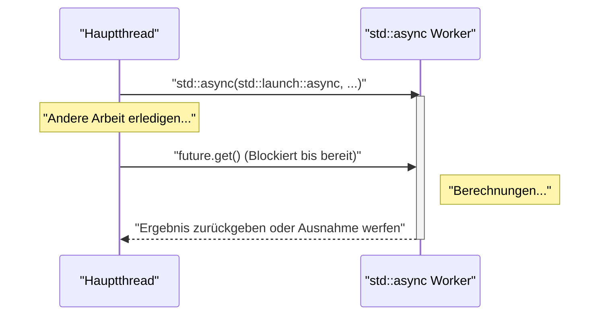
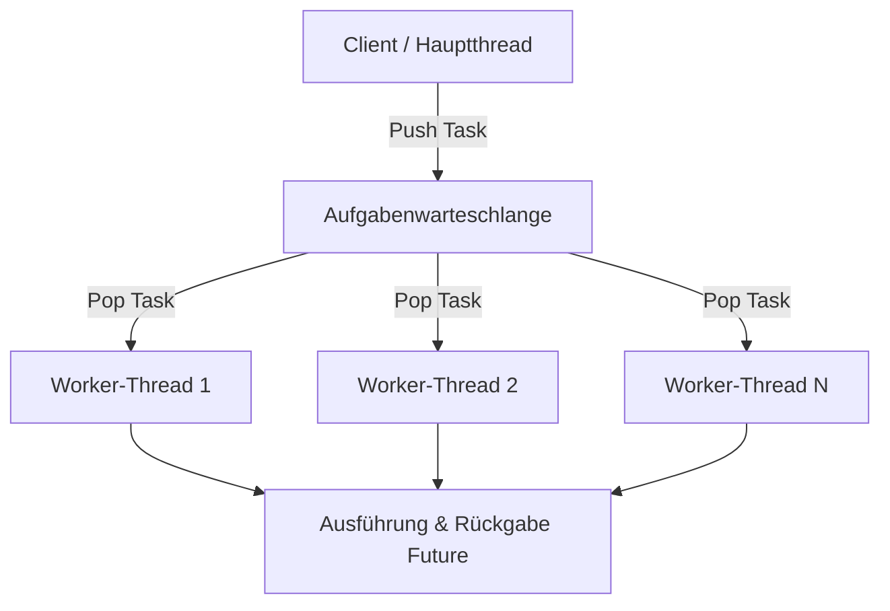

In der modernen Softwareentwicklung ist die Multithreading-Programmierung unerlässlich, um die Leistung von Mehrkern-CPUs optimal auszuschöpfen. C++ hat ab C++11 APIs für Multithreading und asynchrone Verarbeitung (`<thread>`, `<mutex>`, `<condition_variable>`, `<future>`) als Standardbibliothek eingeführt. Dadurch können plattformunabhängige und sichere parallele Verarbeitungen implementiert werden, ohne plattformabhängigen Code (wie POSIX-Threads oder Windows-APIs) schreiben zu müssen. Darüber hinaus wurden mit den Versions-Upgrades zu C++14, C++17 und C++20 sicherere und fortschrittlichere Funktionen wie `std::scoped_lock` und `std::jthread` hinzugefügt.

In diesem Artikel werden die Grundlagen der C++ Multithreading-Programmierung, Synchronisationsmechanismen zur Vermeidung von Datenwettläufen (Data Races) sowie moderne asynchrone Verarbeitung (`std::async`) und das Konzept von Thread-Pools ausführlich mit detaillierten Codebeispielen erläutert.

---

## 1. Grundlagen der parallelen Verarbeitung und das Amdahlsche Gesetz

Das Hauptziel der Nutzung von Multithreading ist die "Leistungssteigerung", jedoch kann nicht das gesamte Programm parallelisiert werden. Hierbei ist das **Amdahlsche Gesetz (Amdahl's Law)** von großer Bedeutung.

Das Amdahlsche Gesetz ist ein Modell, das vorhersagt, wie sehr sich die Gesamtleistung des Systems verbessert, wenn ein Teil des Programms parallelisiert und beschleunigt wird.

$$ S(N) = \frac{1}{(1 - P) + \frac{P}{N}} $$

* $S(N)$ : Theoretisch maximale Geschwindigkeitssteigerung
* $P$ : Anteil des gesamten Programms, der parallelisiert werden kann (0 ≤ $P$ ≤ 1)
* $N$ : Anzahl der Prozessoren (Threads)

Eine wichtige Erkenntnis aus dieser Formel ist, dass "unabhängig davon, wie sehr man die Anzahl der Prozessoren $N$ erhöht, der nicht parallelisierbare serielle Teil $(1 - P)$ zu einem Engpass wird und es eine Obergrenze für die Geschwindigkeitssteigerung gibt." Selbst wenn beispielsweise $90\%$ des Programms parallelisierbar sind ($P = 0.9$), bleibt der restliche Teil von $10\%$ sequenziell, sodass die maximale Beschleunigung selbst mit einer unendlichen Anzahl von Prozessoren nur das $10$-fache ($S(\infty) = 1 / 0.1$) beträgt.

Daher ist bei der Multithreading-Programmierung in C++ nicht nur das Hinzufügen von Threads erforderlich, sondern ein **Design, das die sequenziellen Verarbeitungsteile (wie Lock-Konflikte und Synchronisations-Overhead) so weit wie möglich reduziert**.

---

## 2. Grundlagen von Threads: `std::thread` und `std::jthread` (C++20)

### Der klassische `std::thread` (C++11)

Der in C++11 eingeführte `std::thread` ist die grundlegendste Klasse, um Funktionen oder Lambda-Ausdrücke in einem neuen Thread auszuführen.

```cpp
#include <iostream>
#include <thread>

void workerFunction(int id) {
    std::cout << "Worker " << id << " is running on thread " 
              << std::this_thread::get_id() << std::endl;
}

int main() {
    std::cout << "Main thread id: " << std::this_thread::get_id() << std::endl;

    // Erstellen und Starten des Threads
    std::thread t1(workerFunction, 1);
    
    // Erstellen eines Threads mithilfe eines Lambda-Ausdrucks
    std::thread t2([](int id) {
        std::cout << "Lambda Worker " << id << " is running." << std::endl;
    }, 2);

    // Warten auf das Beenden der Threads (join)
    t1.join();
    t2.join();

    std::cout << "All threads completed." << std::endl;
    return 0;
}
```

Ein wichtiger Punkt bei `std::thread` ist, dass **vor der Zerstörung zwingend `join()` oder `detach()` aufgerufen werden muss**. Wenn der Destruktor von `std::thread` aufgerufen wird, ohne dass eines von beiden ausgeführt wurde, wird `std::terminate()` aufgerufen und das Programm stürzt ab. Um Ausnahmesicherheit (Exception Safety) zu gewährleisten, musste man eigene Wrapper-Klassen unter Verwendung des RAII-Musters schreiben.

### Der moderne `std::jthread` (C++20)

In C++20 wurde der `std::jthread` (joining thread) eingeführt, der diese Nachteile behebt. Der `std::jthread` ruft in seinem Destruktor automatisch `join()` auf, sodass man selbst im Falle von Ausnahmen sicher auf die Beendigung des Threads warten kann. Außerdem bietet er eine Funktion zur kooperativen Thread-Stornierung über ein `std::stop_token`.

```cpp
#include <iostream>
#include <thread>
#include <chrono>

int main() {
    // C++20: std::jthread
    // Durch Empfangen eines std::stop_token als erstes Argument kann eine Stornierungsanforderung erkannt werden
    std::jthread jt([](std::stop_token stoken) {
        while (!stoken.stop_requested()) {
            std::cout << "Working..." << std::endl;
            std::this_thread::sleep_for(std::chrono::milliseconds(500));
        }
        std::cout << "Stop requested. Exiting thread." << std::endl;
    });

    std::this_thread::sleep_for(std::chrono::seconds(2));
    
    // Explizit eine Stornierung anfordern
    jt.request_stop(); 
    
    // Da im Destruktor des jthread automatisch join() aufgerufen wird, ist ein manuelles join() nicht erforderlich
    return 0;
}
```

---

## 3. Vermeidung von Datenwettläufen und Synchronisation: Mutex und Locks

Wenn mehrere Threads gleichzeitig auf denselben Speicherbereich (wie eine Variable) zugreifen und mindestens einer davon schreibt, tritt ein **Datenwettlauf (Data Race)** auf. Im C++-Standard führt ein Datenwettlauf zu undefiniertem Verhalten (Undefined Behavior). Um dies zu verhindern, ist eine exklusive Kontrolle (Mutual Exclusion) mithilfe von `std::mutex` erforderlich.

### `std::mutex` und `std::lock_guard`

Das manuelle Aufrufen der rohen Methoden `std::mutex::lock()` und `unlock()` wird nicht empfohlen, da das Risiko besteht, dass bei einer Ausnahme `unlock()` nicht aufgerufen wird und es zu einem Deadlock kommt. In C++ verwendet man stattdessen `std::lock_guard` (C++11) oder `std::scoped_lock` (C++17), die das RAII-Muster anwenden.

```cpp
#include <iostream>
#include <vector>
#include <thread>
#include <mutex>

std::mutex g_mutex;
int g_counter = 0;

void incrementCounter(int iterations) {
    for (int i = 0; i < iterations; ++i) {
        // Beim Verlassen des Gültigkeitsbereichs wird automatisch unlock() aufgerufen
        std::lock_guard<std::mutex> lock(g_mutex);
        ++g_counter;
    }
}

int main() {
    std::vector<std::thread> threads;
    for (int i = 0; i < 10; ++i) {
        threads.emplace_back(incrementCounter, 10000);
    }

    for (auto& t : threads) {
        t.join();
    }

    std::cout << "Final counter value: " << g_counter << std::endl;
    // Wird wie erwartet 100000 sein
    return 0;
}
```

### `std::unique_lock`

`std::lock_guard` ist ein einfaches bereichsbasiertes Sperren, aber wenn eine flexiblere Kontrolle (wie verzögertes Sperren, zeitgesteuertes Sperren, vorzeitiges Entsperren usw.) erforderlich ist, verwendet man `std::unique_lock`. Für die im nächsten Abschnitt erklärte `std::condition_variable` ist ein `std::unique_lock` zwingend erforderlich.

---

## 4. Kommunikation zwischen Threads: `std::condition_variable`

Um Muster wie das "Erzeuger-Verbraucher-Muster (Producer-Consumer Pattern)" zu implementieren, bei dem ein Thread wartet, bis eine bestimmte Bedingung erfüllt ist, und ein anderer Thread eine Benachrichtigung sendet, wenn er diese Bedingung erfüllt hat, verwendet man `std::condition_variable`.

```cpp
#include <iostream>
#include <thread>
#include <mutex>
#include <condition_variable>
#include <queue>

std::mutex g_mtx;
std::condition_variable g_cv;
std::queue<int> g_dataQueue;
bool g_isFinished = false;

void producer() {
    for (int i = 1; i <= 5; ++i) {
        std::this_thread::sleep_for(std::chrono::milliseconds(200));
        {
            std::lock_guard<std::mutex> lock(g_mtx);
            g_dataQueue.push(i);
            std::cout << "Produced: " << i << std::endl;
        }
        g_cv.notify_one(); // Verbraucher benachrichtigen
    }
    
    {
        std::lock_guard<std::mutex> lock(g_mtx);
        g_isFinished = true;
    }
    g_cv.notify_one(); // Beendigung benachrichtigen
}

void consumer() {
    while (true) {
        std::unique_lock<std::mutex> lock(g_mtx);
        // Warten, bis die Bedingung erfüllt ist (Warteschlange nicht leer oder Beendigungsflag gesetzt)
        // Einen Lambda-Ausdruck verwenden, um Fehlauslösungen (Spurious Wakeups) zu verhindern
        g_cv.wait(lock, []{ return !g_dataQueue.empty() || g_isFinished; });

        while (!g_dataQueue.empty()) {
            int val = g_dataQueue.front();
            g_dataQueue.pop();
            // Entsperren und schwere Arbeit ausführen (hier nur Ausgabe)
            lock.unlock();
            std::cout << "Consumed: " << val << std::endl;
            lock.lock(); // Sperre wieder erwerben
        }

        if (g_isFinished && g_dataQueue.empty()) {
            break;
        }
    }
}

int main() {
    std::thread t1(producer);
    std::thread t2(consumer);
    t1.join();
    t2.join();
    return 0;
}
```

In diesem Beispiel versetzt `std::condition_variable::wait` den Thread in einen Schlafzustand, bis die Bedingung erfüllt ist, wodurch ein unnötiger Verbrauch von CPU-Ressourcen (Busy Waiting) verhindert wird.

---

## 5. Hochgradig abstrakte asynchrone Verarbeitung: `std::future`, `std::promise`, `std::async`

Die bisher besprochenen `std::thread` und `std::mutex` sind leistungsstark, bringen jedoch lediglich die Low-Level-Thread-Mechanismen des Betriebssystems nach C++. Um Ergebnisse abzurufen oder Ausnahmen weiterzuleiten, wird der Code schnell unübersichtlich. Wenn Sie parallele Verarbeitungen mit Rückgabewerten oder asynchrone Verarbeitungen auf höherer Ebene ausführen möchten, verwenden Sie die Funktionen des `<future>`-Headers.

### `std::promise` und `std::future`

`std::promise` repräsentiert die Seite, die das Ergebnis "setzt", und `std::future` repräsentiert die Seite, die das Ergebnis "empfängt". Diese fungieren als sichere Kanäle zur Übergabe von Ergebnissen oder Ausnahmen zwischen Threads.

### Aufgabenbasierte parallele Verarbeitung mit `std::async`

Die empfohlene Methode zur Ausführung asynchroner Aufgaben in C++ ist die Verwendung von `std::async`. `std::async` führt Aufgaben asynchron aus und gibt ein `std::future` zurück, um das Ergebnis zu erhalten.

```cpp
#include <iostream>
#include <future>
#include <chrono>

int complexCalculation(int x) {
    std::cout << "Calculation started on thread: " 
              << std::this_thread::get_id() << std::endl;
    std::this_thread::sleep_for(std::chrono::seconds(2));
    if (x < 0) {
        throw std::invalid_argument("x must be positive");
    }
    return x * 42;
}

int main() {
    std::cout << "Main thread id: " << std::this_thread::get_id() << std::endl;

    // Verwenden Sie std::launch::async, um die Ausführung in einem anderen Thread zu erzwingen
    std::future<int> resultFuture = std::async(std::launch::async, complexCalculation, 10);

    std::cout << "Main thread is doing other work..." << std::endl;

    try {
        // Der Aufruf von get() blockiert den aktuellen Thread und wartet, bis die Berechnung abgeschlossen ist
        int result = resultFuture.get();
        std::cout << "Result: " << result << std::endl;
    } catch (const std::exception& e) {
        std::cerr << "Exception caught: " << e.what() << std::endl;
    }

    return 0;
}
```

Das Verhalten von `std::async` ist im folgenden Sequenzdiagramm dargestellt.



Für das erste Argument von `std::async`, die Startrichtlinie (Launch Policy), gibt es folgende zwei Arten:
* `std::launch::async`: Erzwingt die asynchrone Ausführung durch Erstellen eines neuen Threads (oder Zuweisung aus einem Thread-Pool).
* `std::launch::deferred`: Verzögerte Auswertung. Die Funktion wird synchron im aufrufenden Thread ausgeführt, wenn `future.get()` oder `future.wait()` aufgerufen wird.

Wenn standardmäßig (ohne Angabe) vorgegangen wird, hängt es von der Implementierung ab und wird basierend auf der Systemlast ausgewählt. Wenn Sie sicherstellen möchten, dass die Ausführung asynchron erfolgt, geben Sie `std::launch::async` explizit an.

---

## 6. Das Konzept des Thread-Pools (Thread Pool)

Wenn Sie `std::async` jedes Mal aufrufen oder `std::thread` wiederholt in einer Schleife erstellen und zerstören, wird der Overhead durch Thread-Kontextwechsel und die Zuweisung von Betriebssystemressourcen unübersehbar. Insbesondere bei der Verarbeitung einer großen Menge kleiner Aufgaben (Fine-grained tasks) ist die Verwendung eines Thread-Pools unerlässlich.

Ein Thread-Pool ist eine Architektur, bei der beim Starten der Anwendung eine bestimmte Anzahl von Worker-Threads (Worker) im Voraus erstellt wird. Aufgaben werden in einer Warteschlange (Queue) gesammelt und von den freien Worker-Threads nacheinander abgearbeitet.



In der C++-Standardbibliothek (Stand C++23) gibt es keine Standardklasse für Thread-Pools. Durch die Kombination von `std::thread`, `std::mutex`, `std::condition_variable`, `std::function` und `std::packaged_task` kann jedoch in wenigen Zeilen Code ein effizienter Thread-Pool implementiert werden. In der Praxis ist es auch üblich, asynchrone I/O-Operationen von `Boost.Asio` oder Bibliotheken von Drittanbietern zu verwenden.

---

## 7. Überlegungen zu Leistung und Skalierbarkeit

Um die beste Leistung bei der Multithreading-Programmierung zu erzielen, muss nicht nur auf die Parallelisierung des Codes, sondern auch auf die Hardwarearchitektur geachtet werden.

* **False Sharing (Falsches Teilen):** 
  Wenn mehrere Threads verschiedene Variablen aktualisieren, diese Variablen sich jedoch in derselben Cache-Zeile (normalerweise 64 Byte) der CPU befinden, kommt es zu unnötigen Speichersynchronisationen, um die Cache-Kohärenz aufrechtzuerhalten, was zu einem drastischen Leistungsabfall führt. Um dies zu verhindern, ist es erforderlich, Variablen mithilfe des `alignas`-Spezifikators an den Grenzen von Cache-Zeilen auszurichten.
* **Lock-Free (Sperrfrei) und `std::atomic`:**
  Um den Overhead des Sperrens/Entsperrens von Mutexen zu vermeiden, wird der Einsatz unteilbarer Operationen (wie Compare-And-Swap) mittels `<atomic>` oder sperrfreier Datenstrukturen in Betracht gezogen. Da jedoch ein korrektes Verständnis der Speicherordnung (`std::memory_order`) erforderlich ist und die Implementierung sehr schwierig ist, sollten diese in der Regel nur eingeführt werden, wenn sie nach sorgfältigen Leistungsmessungen als notwendig erachtet werden.

---

## 8. Fazit

Dieser Artikel behandelte Multithreading und asynchrone Programmierung in C++ von den Grundlagen bis zu den neuesten C++20-Funktionen. Die wichtigsten Punkte sind:

1. **Verwenden Sie standardmäßig `std::async`:** Nutzen Sie für einzelne asynchrone Aufgaben oder parallele Verarbeitungen, die ein Ergebnis zurückgeben, das sicherere `std::async` und `std::future`, anstatt Threads manuell zu verwalten.
2. **`std::jthread` für die Thread-Verwaltung:** Verwenden Sie für Threads, die langfristig im Hintergrund laufen, den `std::jthread` aus C++20, um eine sichere Beendigung zu gewährleisten.
3. **Nutzen Sie RAII zur Synchronisation:** Die Sperrung von Mutexen zur Vermeidung von Datenwettläufen sollte immer über `std::lock_guard` oder `std::unique_lock` erfolgen.
4. **Beachten Sie den Overhead:** Vermeiden Sie die übermäßige Erstellung von Threads und führen Sie bei Bedarf eine Thread-Pool-Architektur ein.

Fehler bei der parallelen Verarbeitung (Deadlocks, Datenwettläufe) sind schwer zu reproduzieren und gehören zu den am schwersten zu debuggenden Problemen. Behalten Sie immer die Thread-Sicherheit im Auge und wählen Sie geeignete Tools aus der Standardbibliothek aus, um ein robustes und schnelles System mit modernem C++ zu entwickeln.
