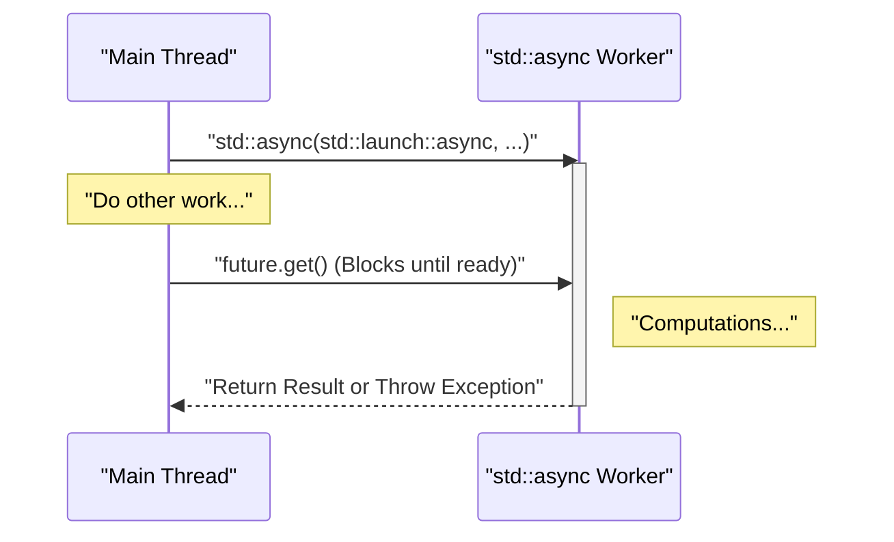
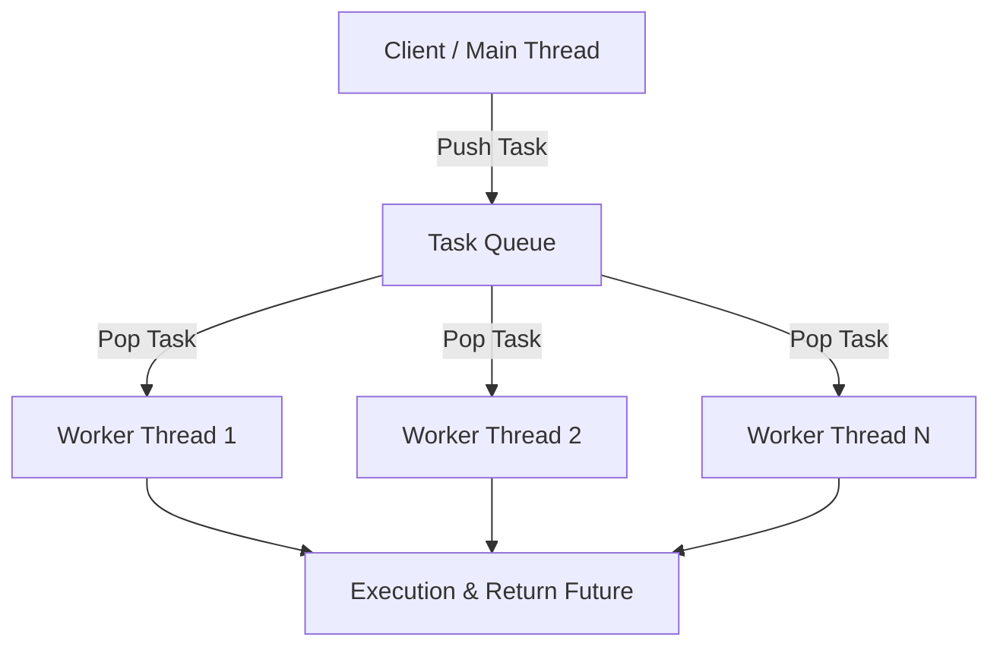

In modern software development, multithreading programming is essential to maximize the performance of multi-core CPUs. Starting with C++11, C++ introduced multithreading and asynchronous processing APIs (`<thread>`, `<mutex>`, `<condition_variable>`, `<future>`) as part of its standard library, making it possible to implement portable and safe concurrent processing without writing platform-dependent code (such as POSIX threads or the Windows API). Furthermore, with each version upgrade—C++14, C++17, and C++20—safer and more advanced features like `std::scoped_lock` and `std::jthread` have been added.

In this article, we will thoroughly explain the basics of C++ multithreading programming, synchronization mechanisms to prevent data races, and modern asynchronous processing (`std::async`) as well as the concept of thread pools, with detailed code examples.

---

## 1. Basics of Concurrency and Amdahl's Law

The primary goal of multithreading is "performance improvement", but it is not possible to parallelize an entire program. This is where **Amdahl's Law** becomes important.

Amdahl's Law is a model used to predict the extent to which overall system performance will improve when a part of the program is parallelized and optimized.

$$ S(N) = \frac{1}{(1 - P) + \frac{P}{N}} $$

* $S(N)$ : Theoretical maximum speedup ratio
* $P$ : The proportion of the program that can be parallelized (0 ≤ $P$ ≤ 1)
* $N$ : The number of processors (threads)

An important fact indicated by this formula is that "no matter how much you increase the number of processors $N$, the non-parallelizable serial portion $(1 - P)$ becomes a bottleneck, and there is an upper limit to the speedup". For example, even if $90\%$ of the program can be parallelized ($P = 0.9$), as long as the remaining $10\%$ is processed serially, the maximum speedup will be only $10$ times ($S(\infty) = 1 / 0.1$), even with an infinite number of processors.

Therefore, when doing multithreaded programming in C++, it is required not just to increase the number of threads, but to adopt a **design that minimizes the serial processing parts (such as lock contention and synchronization overhead) as much as possible**.

---

## 2. Thread Basics: `std::thread` and `std::jthread` (C++20)

### The Traditional `std::thread` (C++11)

`std::thread`, introduced in C++11, is the most fundamental class for executing functions or lambda expressions in a new thread.

```cpp
#include <iostream>
#include <thread>

void workerFunction(int id) {
    std::cout << "Worker " << id << " is running on thread " 
              << std::this_thread::get_id() << std::endl;
}

int main() {
    std::cout << "Main thread id: " << std::this_thread::get_id() << std::endl;

    // Create and start the thread
    std::thread t1(workerFunction, 1);
    
    // Create a thread using a lambda expression
    std::thread t2([](int id) {
        std::cout << "Lambda Worker " << id << " is running." << std::endl;
    }, 2);

    // Wait for the thread to finish (join)
    t1.join();
    t2.join();

    std::cout << "All threads completed." << std::endl;
    return 0;
}
```

A point to note about `std::thread` is that **you must always call either `join()` or `detach()` before it is destroyed**. If the destructor of `std::thread` is called without either of them having been invoked, `std::terminate()` is called and the program crashes. To ensure exception safety, it was necessary to create your own wrapper class using the RAII pattern.

### The Modern `std::jthread` (C++20)

In C++20, `std::jthread` (joining thread) was introduced to resolve these shortcomings. Because `std::jthread` automatically calls `join()` in its destructor, you can safely wait for the thread to terminate even when exceptions occur. It also provides a cooperative cancellation feature for threads via `std::stop_token`.

```cpp
#include <iostream>
#include <thread>
#include <chrono>

int main() {
    // C++20: std::jthread
    // Can detect cancellation requests by receiving std::stop_token as the first argument
    std::jthread jt([](std::stop_token stoken) {
        while (!stoken.stop_requested()) {
            std::cout << "Working..." << std::endl;
            std::this_thread::sleep_for(std::chrono::milliseconds(500));
        }
        std::cout << "Stop requested. Exiting thread." << std::endl;
    });

    std::this_thread::sleep_for(std::chrono::seconds(2));
    
    // Explicitly request cancellation
    jt.request_stop(); 
    
    // Since join is automatically called by the jthread destructor, manual join() is unnecessary
    return 0;
}
```

---

## 3. Avoiding Data Races and Synchronization: Mutexes and Locks

When multiple threads access the same memory area (such as a variable) simultaneously, and at least one of them writes to it, a **Data Race** occurs. In the C++ standard, a data race causes Undefined Behavior. To prevent this, exclusive control using `std::mutex` is required.

### `std::mutex` and `std::lock_guard`

Calling raw `std::mutex::lock()` and `unlock()` manually is not recommended because if an exception is thrown, `unlock()` may not be called, risking a deadlock. In C++, `std::lock_guard` (C++11) or `std::scoped_lock` (C++17), which use the RAII pattern, are used.

```cpp
#include <iostream>
#include <vector>
#include <thread>
#include <mutex>

std::mutex g_mutex;
int g_counter = 0;

void incrementCounter(int iterations) {
    for (int i = 0; i < iterations; ++i) {
        // Automatically unlocked when leaving the scope
        std::lock_guard<std::mutex> lock(g_mutex);
        ++g_counter;
    }
}

int main() {
    std::vector<std::thread> threads;
    for (int i = 0; i < 10; ++i) {
        threads.emplace_back(incrementCounter, 10000);
    }

    for (auto& t : threads) {
        t.join();
    }

    std::cout << "Final counter value: " << g_counter << std::endl;
    // Becomes 100000 as expected
    return 0;
}
```

### `std::unique_lock`

`std::lock_guard` is a simple scope-based lock, but if you need more flexible control (such as deferred locking, time-constrained locking, or unlocking mid-way), you use `std::unique_lock`. `std::unique_lock` is required for the `std::condition_variable` explained next.

---

## 4. Inter-thread Communication: `std::condition_variable`

To implement patterns such as the "Producer-Consumer Pattern", where one thread waits until a specific condition is met, and another thread sends a notification when that condition is fulfilled, you use `std::condition_variable`.

```cpp
#include <iostream>
#include <thread>
#include <mutex>
#include <condition_variable>
#include <queue>

std::mutex g_mtx;
std::condition_variable g_cv;
std::queue<int> g_dataQueue;
bool g_isFinished = false;

void producer() {
    for (int i = 1; i <= 5; ++i) {
        std::this_thread::sleep_for(std::chrono::milliseconds(200));
        {
            std::lock_guard<std::mutex> lock(g_mtx);
            g_dataQueue.push(i);
            std::cout << "Produced: " << i << std::endl;
        }
        g_cv.notify_one(); // Notify consumer
    }
    
    {
        std::lock_guard<std::mutex> lock(g_mtx);
        g_isFinished = true;
    }
    g_cv.notify_one(); // Notify completion
}

void consumer() {
    while (true) {
        std::unique_lock<std::mutex> lock(g_mtx);
        // Wait until the condition is met (queue is not empty, or finished flag is set)
        // Specify the condition with a lambda expression to prevent spurious wakeups
        g_cv.wait(lock, []{ return !g_dataQueue.empty() || g_isFinished; });

        while (!g_dataQueue.empty()) {
            int val = g_dataQueue.front();
            g_dataQueue.pop();
            // Unlock and perform heavy processing (here, just output)
            lock.unlock();
            std::cout << "Consumed: " << val << std::endl;
            lock.lock(); // Acquire lock again
        }

        if (g_isFinished && g_dataQueue.empty()) {
            break;
        }
    }
}

int main() {
    std::thread t1(producer);
    std::thread t2(consumer);
    t1.join();
    t2.join();
    return 0;
}
```

In this example, `std::condition_variable::wait` puts the thread to sleep until the condition is met, preventing unnecessary consumption of CPU resources (busy waiting).

---

## 5. High-level Asynchronous Processing: `std::future`, `std::promise`, `std::async`

The `std::thread` and `std::mutex` introduced so far are powerful, but they bring the OS's low-level thread mechanisms directly into C++, which often leads to verbose code when handling result retrieval and exception propagation. If you want to perform concurrent processing that returns a value or higher-level asynchronous processing, you use the features of the `<future>` header.

### `std::promise` and `std::future`

`std::promise` represents the side that "sets" the result, and `std::future` represents the side that "receives" the result. These function as safe channels for passing results and exceptions between threads.

### Task-based Concurrency with `std::async`

The most recommended way to execute asynchronous tasks in C++ is to use `std::async`. `std::async` executes a task asynchronously and returns a `std::future` to retrieve the result.

```cpp
#include <iostream>
#include <future>
#include <chrono>

int complexCalculation(int x) {
    std::cout << "Calculation started on thread: " 
              << std::this_thread::get_id() << std::endl;
    std::this_thread::sleep_for(std::chrono::seconds(2));
    if (x < 0) {
        throw std::invalid_argument("x must be positive");
    }
    return x * 42;
}

int main() {
    std::cout << "Main thread id: " << std::this_thread::get_id() << std::endl;

    // Explicitly run in a separate thread by specifying std::launch::async
    std::future<int> resultFuture = std::async(std::launch::async, complexCalculation, 10);

    std::cout << "Main thread is doing other work..." << std::endl;

    try {
        // Calling get() blocks the current thread and waits until the calculation is complete
        int result = resultFuture.get();
        std::cout << "Result: " << result << std::endl;
    } catch (const std::exception& e) {
        std::cerr << "Exception caught: " << e.what() << std::endl;
    }

    return 0;
}
```

The behavior of `std::async` is shown in the sequence diagram below.



There are two types of Launch Policies for the first argument of `std::async`:
* `std::launch::async`: Always creates a new thread (or allocates from a thread pool) and executes asynchronously.
* `std::launch::deferred`: Lazy evaluation. Executes synchronously on the calling thread when `future.get()` or `future.wait()` is called.

The default (if not specified) is implementation-defined, and either one is chosen depending on the system load. If you definitely want asynchronous execution, explicitly specify `std::launch::async`.

---

## 6. Concept of a Thread Pool

Calling `std::async` every time, or creating and destroying a `std::thread` in a loop, causes the overhead of thread context switching and OS resource allocation to become non-negligible. Especially when processing a large number of fine-grained tasks, using a Thread Pool is essential.

A thread pool is an architecture where a certain number of worker threads are created in advance when the application starts, tasks are queued up, and available worker threads process the tasks one by one.



The C++ standard library (as of C++23) does not have a standard thread pool class, but it is possible to implement an efficient thread pool in a few dozen lines by combining `std::thread`, `std::mutex`, `std::condition_variable`, `std::function`, and `std::packaged_task`. In actual operations, it is also common to use `Boost.Asio`'s asynchronous I/O or third-party libraries.

---

## 7. Considerations for Performance and Scalability

To extract the maximum performance in multithreaded programming, it is necessary to pay attention not only to the parallelization of the code but also to the hardware architecture.

* **False Sharing:** 
  Even if multiple threads update different variables, if those variables are placed in the same CPU cache line (typically 64 bytes), unnecessary memory synchronization occurs to maintain cache coherency, resulting in a dramatic drop in performance. To prevent this, it is necessary to align variables on cache line boundaries using the `alignas` specifier.
* **Lock-Free and `std::atomic`:**
  To avoid the overhead of locking/unlocking mutexes, introducing atomic operations (like Compare-And-Swap) using `<atomic>` or lock-free data structures is considered. However, this requires a correct understanding of memory ordering (`std::memory_order`) and is very difficult to implement. Therefore, it is usually introduced only when deemed necessary after careful performance measurements.

---

## 8. Conclusion

We have explained multithreading and asynchronous programming in C++, from the basics to the latest C++20 features. The key points are as follows:

1. **Basically use `std::async`:** For single asynchronous tasks or concurrent processing that returns a result, utilize `std::async` and `std::future`, which are safer than managing threads manually.
2. **Use `std::jthread` for thread management:** For threads running in the background long-term, use C++20's `std::jthread` to guarantee safe termination processing.
3. **Leverage RAII for synchronization:** Always use `std::lock_guard` or `std::unique_lock` for locking mutexes to prevent data races.
4. **Be aware of overhead:** Avoid creating an excessive number of threads, and introduce a thread pool architecture as needed.

Concurrency bugs (deadlocks, data races) have low reproducibility and fall into the most difficult category to debug. By always being aware of thread safety and choosing appropriate standard library tools, let's achieve robust and fast system development with modern C++.
