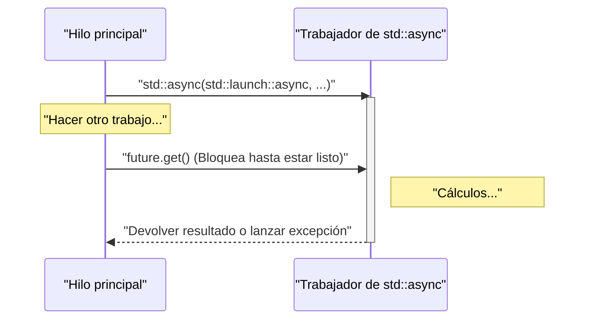
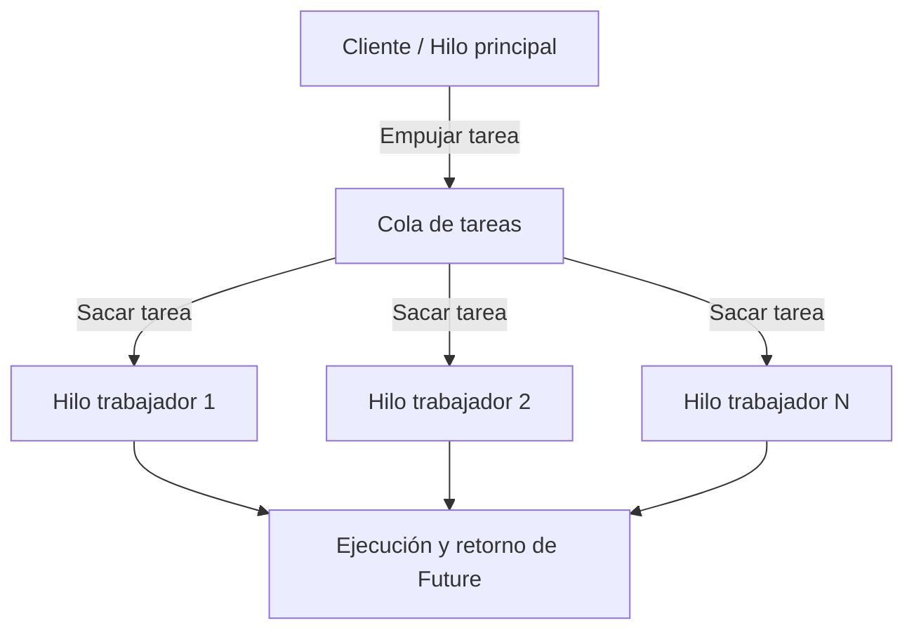

En el desarrollo de software moderno, para maximizar el rendimiento de las CPU multinúcleo, la programación multihilo es indispensable. Desde C++11, C++ introdujo API de procesamiento multihilo y asíncrono (`<thread>`, `<mutex>`, `<condition_variable>`, `<future>`) como biblioteca estándar, lo que permite implementar procesamiento concurrente portátil y seguro sin escribir código dependiente de la plataforma (como hilos POSIX o la API de Windows). Además, con cada actualización a C++14, C++17 y C++20, se han agregado características más seguras y avanzadas como `std::scoped_lock` y `std::jthread`.

En este artículo, explicaremos exhaustivamente los fundamentos de la programación multihilo en C++, los mecanismos de sincronización para prevenir carreras de datos, y los conceptos de procesamiento asíncrono moderno (`std::async`) y grupos de hilos (thread pools), junto con ejemplos de código detallados.

---

## 1. Fundamentos del procesamiento concurrente y la Ley de Amdahl

El objetivo principal de la multihilo es "mejorar el rendimiento", pero no es posible paralelizar todo el programa. Aquí es donde la **Ley de Amdahl (Amdahl's Law)** cobra importancia.

La Ley de Amdahl es un modelo que predice cuánto mejorará el rendimiento general del sistema cuando una parte del programa se paraleliza y acelera.

$$ S(N) = \frac{1}{(1 - P) + \frac{P}{N}} $$

* $S(N)$ : Aceleración máxima teórica
* $P$ : Proporción de la parte del programa que se puede paralelizar (0 ≤ $P$ ≤ 1)
* $N$ : Número de procesadores (hilos)

Un hecho importante que muestra esta fórmula es que "no importa cuánto se incremente el número de procesadores $N$, la porción serial que no se puede paralelizar $(1 - P)$ se convierte en un cuello de botella, limitando la aceleración máxima". Por ejemplo, incluso si el $90\%$ del programa es paralelizable ($P = 0.9$), mientras el $10\%$ restante sea procesamiento en serie, la aceleración máxima será solo de $10$ veces ($S(\infty) = 1 / 0.1$) incluso usando infinitos procesadores.

Por lo tanto, al realizar programación multihilo en C++, no se trata solo de aumentar el número de hilos, sino de **diseñar el sistema para minimizar las partes de procesamiento en serie (como conflictos de bloqueo y sobrecarga de sincronización)**.

---

## 2. Conceptos básicos de hilos: `std::thread` y `std::jthread` (C++20)

### El tradicional `std::thread` (C++11)

Introducido en C++11, `std::thread` es la clase más fundamental para ejecutar una función o expresión lambda en un nuevo hilo.

```cpp
#include <iostream>
#include <thread>

void workerFunction(int id) {
    std::cout << "Worker " << id << " is running on thread " 
              << std::this_thread::get_id() << std::endl;
}

int main() {
    std::cout << "Main thread id: " << std::this_thread::get_id() << std::endl;

    // Creación e inicio de ejecución del hilo
    std::thread t1(workerFunction, 1);
    
    // Creación de un hilo mediante una expresión lambda
    std::thread t2([](int id) {
        std::cout << "Lambda Worker " << id << " is running." << std::endl;
    }, 2);

    // Esperar a que el hilo termine (join)
    t1.join();
    t2.join();

    std::cout << "All threads completed." << std::endl;
    return 0;
}
```

El punto a tener en cuenta con `std::thread` es que **siempre se debe llamar a `join()` o `detach()` antes de que se destruya**. Si no se llama a ninguno y se invoca el destructor de `std::thread`, se llamará a `std::terminate()` y el programa se bloqueará (crash). Para asegurar la seguridad de excepciones, era necesario crear una clase contenedora (wrapper) personalizada utilizando el patrón RAII.

### El moderno `std::jthread` (C++20)

En C++20, se introdujo `std::jthread` (joining thread) para resolver estas deficiencias. `std::jthread` llama automáticamente a `join()` en su destructor, permitiendo esperar de forma segura la terminación del hilo incluso cuando ocurren excepciones. Además, cuenta con una función de cancelación cooperativa de hilos a través de `std::stop_token`.

```cpp
#include <iostream>
#include <thread>
#include <chrono>

int main() {
    // C++20: std::jthread
    // Recibiendo std::stop_token como primer argumento se puede detectar la solicitud de cancelación
    std::jthread jt([](std::stop_token stoken) {
        while (!stoken.stop_requested()) {
            std::cout << "Working..." << std::endl;
            std::this_thread::sleep_for(std::chrono::milliseconds(500));
        }
        std::cout << "Stop requested. Exiting thread." << std::endl;
    });

    std::this_thread::sleep_for(std::chrono::seconds(2));
    
    // Solicitar la cancelación explícitamente
    jt.request_stop(); 
    
    // No es necesario un join() manual, ya que el destructor de jthread hace join automáticamente
    return 0;
}
```

---

## 3. Evitar carreras de datos y sincronización: Mutex y bloqueos

Cuando varios hilos acceden a la misma área de memoria (como una variable) simultáneamente, y al menos uno de ellos realiza una escritura, se produce una **carrera de datos (Data Race)**. En el estándar C++, una carrera de datos provoca un comportamiento indefinido (Undefined Behavior). Para evitar esto, es necesario un control exclusivo utilizando `std::mutex`.

### `std::mutex` y `std::lock_guard`

Llamar manualmente a los métodos crudos `std::mutex::lock()` y `unlock()` no se recomienda porque existe el riesgo de causar un interbloqueo (deadlock) si no se llama a `unlock()` cuando ocurre una excepción. En C++, se utilizan `std::lock_guard` (C++11) o `std::scoped_lock` (C++17), que emplean el patrón RAII.

```cpp
#include <iostream>
#include <vector>
#include <thread>
#include <mutex>

std::mutex g_mutex;
int g_counter = 0;

void incrementCounter(int iterations) {
    for (int i = 0; i < iterations; ++i) {
        // Se desbloquea automáticamente al salir del alcance
        std::lock_guard<std::mutex> lock(g_mutex);
        ++g_counter;
    }
}

int main() {
    std::vector<std::thread> threads;
    for (int i = 0; i < 10; ++i) {
        threads.emplace_back(incrementCounter, 10000);
    }

    for (auto& t : threads) {
        t.join();
    }

    std::cout << "Final counter value: " << g_counter << std::endl;
    // Será 100000 como se espera
    return 0;
}
```

### `std::unique_lock`

`std::lock_guard` es un bloqueo simple basado en el alcance, pero si se necesita un control más flexible (bloqueo diferido, bloqueo con límite de tiempo, desbloqueo intermedio, etc.), se utiliza `std::unique_lock`. `std::unique_lock` es obligatorio en `std::condition_variable`, que se explica a continuación.

---

## 4. Comunicación entre hilos: `std::condition_variable`

Para implementar patrones como el "Patrón Productor-Consumidor (Producer-Consumer Pattern)", donde un hilo espera hasta que se cumpla una condición específica y otro hilo envía una notificación cuando esa condición se cumple, se utiliza `std::condition_variable`.

```cpp
#include <iostream>
#include <thread>
#include <mutex>
#include <condition_variable>
#include <queue>

std::mutex g_mtx;
std::condition_variable g_cv;
std::queue<int> g_dataQueue;
bool g_isFinished = false;

void producer() {
    for (int i = 1; i <= 5; ++i) {
        std::this_thread::sleep_for(std::chrono::milliseconds(200));
        {
            std::lock_guard<std::mutex> lock(g_mtx);
            g_dataQueue.push(i);
            std::cout << "Produced: " << i << std::endl;
        }
        g_cv.notify_one(); // Notificar al consumidor
    }
    
    {
        std::lock_guard<std::mutex> lock(g_mtx);
        g_isFinished = true;
    }
    g_cv.notify_one(); // Notificar finalización
}

void consumer() {
    while (true) {
        std::unique_lock<std::mutex> lock(g_mtx);
        // Esperar hasta que se cumpla la condición (la cola no está vacía o se establece la bandera de finalización)
        // Especificar la condición en una expresión lambda para evitar el despertar espurio (Spurious Wakeup)
        g_cv.wait(lock, []{ return !g_dataQueue.empty() || g_isFinished; });

        while (!g_dataQueue.empty()) {
            int val = g_dataQueue.front();
            g_dataQueue.pop();
            // Desbloquear y realizar procesamiento pesado (aquí solo salida)
            lock.unlock();
            std::cout << "Consumed: " << val << std::endl;
            lock.lock(); // Volver a adquirir el bloqueo
        }

        if (g_isFinished && g_dataQueue.empty()) {
            break;
        }
    }
}

int main() {
    std::thread t1(producer);
    std::thread t2(consumer);
    t1.join();
    t2.join();
    return 0;
}
```

En este ejemplo, `std::condition_variable::wait` pone el hilo en estado de suspensión (sleep) hasta que se cumple la condición, evitando el consumo inútil de recursos de CPU (bucle de espera activa o busy loop).

---

## 5. Procesamiento asíncrono de alto nivel: `std::future`, `std::promise`, `std::async`

`std::thread` y `std::mutex` son poderosos, pero son simplemente mecanismos de hilos de bajo nivel del sistema operativo traídos a C++. Al tratar con la obtención de resultados y la propagación de excepciones, el código tiende a volverse engorroso. Cuando se desea realizar procesamiento concurrente con un valor de retorno o procesamiento asíncrono de nivel superior, se utilizan las funciones de la cabecera `<future>`.

### `std::promise` y `std::future`

`std::promise` representa el lado que "establece" el resultado, y `std::future` representa el lado que "recibe" el resultado. Estos actúan como canales seguros para pasar resultados o excepciones entre hilos.

### Procesamiento concurrente basado en tareas con `std::async`

La forma más recomendada de ejecutar tareas asíncronas en C++ es utilizar `std::async`. `std::async` ejecuta una tarea asincrónicamente y devuelve un `std::future` para obtener el resultado.

```cpp
#include <iostream>
#include <future>
#include <chrono>

int complexCalculation(int x) {
    std::cout << "Calculation started on thread: " 
              << std::this_thread::get_id() << std::endl;
    std::this_thread::sleep_for(std::chrono::seconds(2));
    if (x < 0) {
        throw std::invalid_argument("x must be positive");
    }
    return x * 42;
}

int main() {
    std::cout << "Main thread id: " << std::this_thread::get_id() << std::endl;

    // Forzar la ejecución en un hilo separado especificando std::launch::async
    std::future<int> resultFuture = std::async(std::launch::async, complexCalculation, 10);

    std::cout << "Main thread is doing other work..." << std::endl;

    try {
        // Al llamar a get(), el hilo actual se bloquea y espera hasta que finalice el cálculo
        int result = resultFuture.get();
        std::cout << "Result: " << result << std::endl;
    } catch (const std::exception& e) {
        std::cerr << "Exception caught: " << e.what() << std::endl;
    }

    return 0;
}
```

El comportamiento de `std::async` se muestra en el siguiente diagrama de secuencia.



Existen dos tipos de políticas de lanzamiento (Launch Policy) que son el primer argumento de `std::async`:
* `std::launch::async`: Siempre crea un nuevo hilo (o asigna uno del grupo de hilos) y se ejecuta asincrónicamente.
* `std::launch::deferred`: Evaluación perezosa (lazy evaluation). Se ejecuta sincrónicamente en el hilo que llama en el momento en que se invoca `future.get()` o `future.wait()`.

Si no se especifica (por defecto), depende de la implementación y se elige uno u otro en función de la carga del sistema. Si desea asegurar la ejecución asíncrona, especifique explícitamente `std::launch::async`.

---

## 6. Concepto de grupo de hilos (Thread Pool)

Si se llama a `std::async` repetidamente, o se crea y destruye un `std::thread` cada vez dentro de un bucle, la sobrecarga del cambio de contexto del hilo y la asignación de recursos del sistema operativo no se puede ignorar. Especialmente al procesar un gran número de tareas pequeñas (Fine-grained tasks), es indispensable utilizar un grupo de hilos (Thread Pool).

Un grupo de hilos es una arquitectura en la que se crea un cierto número de hilos trabajadores (Worker threads) por adelantado al inicio de la aplicación, las tareas se acumulan en una cola (Queue) y los hilos trabajadores inactivos procesan secuencialmente las tareas.



No existe una clase estándar de grupo de hilos en la biblioteca estándar de C++ (hasta C++23), pero es posible implementar un grupo de hilos eficiente en unas pocas decenas de líneas combinando `std::thread`, `std::mutex`, `std::condition_variable`, `std::function` y `std::packaged_task`. En producción, también es común utilizar la E/S asíncrona de `Boost.Asio` o bibliotecas de terceros.

---

## 7. Consideraciones sobre rendimiento y escalabilidad

Para obtener el máximo rendimiento en la programación multihilo, es necesario prestar atención no solo a la paralelización del código, sino también a la arquitectura del hardware.

* **Falso intercambio (False Sharing):** 
  Aunque varios hilos actualicen variables diferentes, si esas variables se encuentran en la misma línea de caché de la CPU (generalmente 64 bytes), se producirá una sincronización de memoria innecesaria para mantener la coherencia de la caché, y el rendimiento disminuirá drásticamente. Para evitar esto, es necesario ingeniárselas para alinear las variables en los límites de la línea de caché utilizando el especificador `alignas`.
* **Libre de bloqueos (Lock-Free) y `std::atomic`:**
  Para evitar la sobrecarga de bloquear/desbloquear mutex, se considera la introducción de operaciones indivisibles (como Compare-And-Swap) utilizando `<atomic>` o estructuras de datos libres de bloqueos. Sin embargo, dado que requiere una comprensión correcta del orden de memoria (`std::memory_order`) y su dificultad de implementación es muy alta, normalmente solo se introduce cuando se considera necesario después de mediciones de rendimiento cuidadosas.

---

## 8. Resumen

Hemos explicado el procesamiento multihilo y asíncrono en C++, desde los conceptos básicos hasta las características más recientes de C++20. Los puntos clave son los siguientes:

1. **El uso básico es `std::async`:** Para tareas asíncronas aisladas o procesamiento concurrente que devuelve un resultado, utilice `std::async` y `std::future`, que son más seguros que administrar hilos manualmente.
2. **`std::jthread` para la gestión de hilos:** Para hilos que se ejecutan en segundo plano a largo plazo, utilice `std::jthread` de C++20 para garantizar un proceso de terminación seguro.
3. **Utilice RAII para la sincronización:** Al bloquear un mutex para evitar carreras de datos, hágalo siempre a través de `std::lock_guard` o `std::unique_lock`.
4. **Sea consciente de la sobrecarga:** Evite la creación excesiva de hilos y adopte una arquitectura de grupo de hilos cuando sea necesario.

Los errores en el procesamiento concurrente (interbloqueos, carreras de datos) tienen baja reproducibilidad y se encuentran entre los más difíciles de depurar. Tengamos siempre en cuenta la seguridad de los hilos y elijamos las herramientas adecuadas de la biblioteca estándar para lograr el desarrollo de sistemas robustos y rápidos en C++ moderno.
