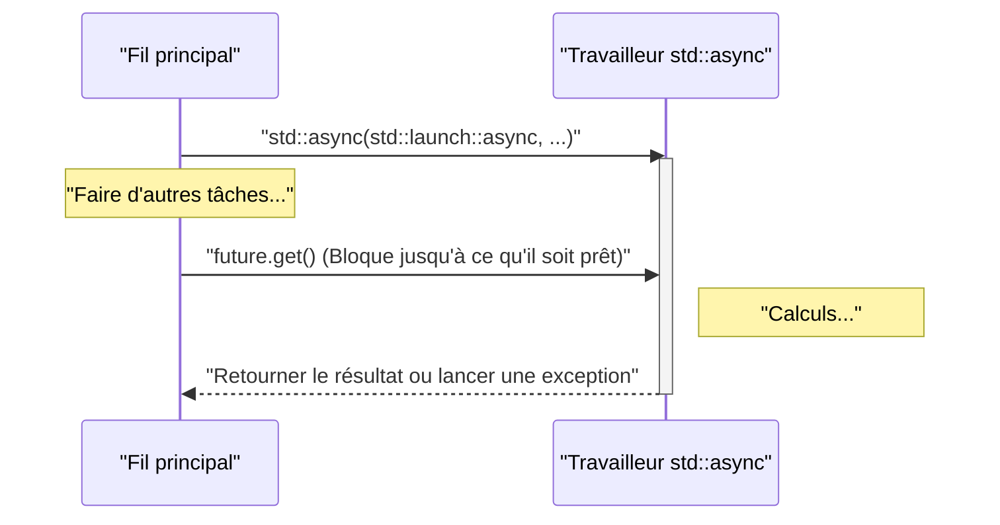
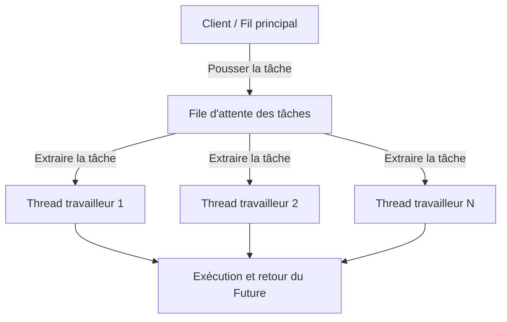

Dans le développement logiciel moderne, pour maximiser les performances des processeurs multicœurs, la programmation multithread est essentielle. Depuis C++11, C++ a introduit des API de multithreading et de traitement asynchrone (`<thread>`, `<mutex>`, `<condition_variable>`, `<future>`) dans sa bibliothèque standard. Cela permet d'implémenter des traitements concurrents portables et sûrs sans avoir à écrire de code dépendant de la plateforme (comme les threads POSIX ou l'API Windows). De plus, à chaque mise à jour vers C++14, C++17 et C++20, des fonctionnalités plus avancées et plus sûres telles que `std::scoped_lock` et `std::jthread` ont été ajoutées.

Cet article explique en détail, avec des exemples de code, depuis les bases de la programmation multithread en C++ jusqu'aux mécanismes de synchronisation pour prévenir les accès concurrents aux données (data races), en passant par les traitements asynchrones modernes (`std::async`) et le concept de pool de threads (thread pool).

---

## 1. Bases de la concurrence et loi d'Amdahl

L'objectif principal du multithreading est l'"amélioration des performances", mais il est impossible de paralléliser l'ensemble d'un programme. C'est ici que la **loi d'Amdahl (Amdahl's Law)** devient importante.

La loi d'Amdahl est un modèle qui prédit dans quelle mesure les performances globales du système s'amélioreront si une partie du programme est parallélisée et accélérée.

$$ S(N) = \frac{1}{(1 - P) + \frac{P}{N}} $$

* $S(N)$ : Taux d'accélération maximal théorique
* $P$ : Proportion de la partie parallélisable dans l'ensemble du programme (0 ≤ $P$ ≤ 1)
* $N$ : Nombre de processeurs (threads)

Le fait important mis en évidence par cette formule est que "peu importe l'augmentation du nombre de processeurs $N$, la partie séquentielle $(1 - P)$ qui ne peut pas être parallélisée devient un goulot d'étranglement, limitant ainsi l'accélération". Par exemple, même si $90\%$ du programme est parallélisable ($P = 0.9$), tant que les $10\%$ restants sont traités de manière séquentielle, l'accélération maximale avec une infinité de processeurs ne sera que de $10$ fois ($S(\infty) = 1 / 0.1$).

Par conséquent, lors de la programmation multithread en C++, il ne s'agit pas seulement d'augmenter le nombre de threads, mais une **conception qui réduit au maximum les parties de traitement séquentiel (comme la contention des verrous ou le surcoût de synchronisation)** est requise.

---

## 2. Bases des threads : `std::thread` et `std::jthread` (C++20)

### Le `std::thread` classique (C++11)

Introduit dans C++11, `std::thread` est la classe la plus fondamentale pour exécuter une fonction ou une expression lambda dans un nouveau thread.

```cpp
#include <iostream>
#include <thread>

void workerFunction(int id) {
    std::cout << "Worker " << id << " is running on thread " 
              << std::this_thread::get_id() << std::endl;
}

int main() {
    std::cout << "Main thread id: " << std::this_thread::get_id() << std::endl;

    // Création et démarrage de l'exécution du thread
    std::thread t1(workerFunction, 1);
    
    // Création d'un thread à l'aide d'une expression lambda
    std::thread t2([](int id) {
        std::cout << "Lambda Worker " << id << " is running." << std::endl;
    }, 2);

    // Attente de la fin des threads (join)
    t1.join();
    t2.join();

    std::cout << "All threads completed." << std::endl;
    return 0;
}
```

Le point d'attention avec `std::thread` est qu'**il faut absolument appeler `join()` ou `detach()` avant sa destruction**. Si le destructeur de `std::thread` est appelé sans que l'un ou l'autre n'ait été appelé, `std::terminate()` est invoqué et le programme plante. Pour garantir la sécurité des exceptions (exception safety), il était nécessaire de créer soi-même une classe wrapper utilisant le motif RAII.

### Le moderne `std::jthread` (C++20)

En C++20, `std::jthread` (joining thread) a été introduit pour remédier à ces inconvénients. Comme `std::jthread` appelle automatiquement `join()` dans son destructeur, on peut attendre la fin du thread en toute sécurité même en cas d'exception. Il dispose également d'une fonction d'annulation coopérative des threads via `std::stop_token`.

```cpp
#include <iostream>
#include <thread>
#include <chrono>

int main() {
    // C++20 : std::jthread
    // Permet de détecter une demande d'annulation en recevant std::stop_token comme premier argument
    std::jthread jt([](std::stop_token stoken) {
        while (!stoken.stop_requested()) {
            std::cout << "Working..." << std::endl;
            std::this_thread::sleep_for(std::chrono::milliseconds(500));
        }
        std::cout << "Stop requested. Exiting thread." << std::endl;
    });

    std::this_thread::sleep_for(std::chrono::seconds(2));
    
    // Demande explicite d'annulation
    jt.request_stop(); 
    
    // Étant donné qu'il est automatiquement rejoint (join) par le destructeur de jthread, un join() manuel n'est pas nécessaire
    return 0;
}
```

---

## 3. Prévention de la concurrence des données et synchronisation : Mutex et verrous (locks)

Lorsque plusieurs threads accèdent simultanément à la même zone mémoire (comme une variable) et qu'au moins l'un d'eux effectue une écriture, une **concurrence des données (Data Race)** se produit. Dans la norme C++, une concurrence des données entraîne un comportement indéfini (Undefined Behavior). Pour éviter cela, un contrôle d'exclusion mutuelle à l'aide de `std::mutex` est nécessaire.

### `std::mutex` et `std::lock_guard`

Appeler manuellement les fonctions brutes `std::mutex::lock()` et `unlock()` n'est pas recommandé en raison du risque que `unlock()` ne soit pas appelé lors de la levée d'une exception, provoquant ainsi un interblocage (deadlock). En C++, on utilise `std::lock_guard` (C++11) ou `std::scoped_lock` (C++17) qui emploient le motif RAII.

```cpp
#include <iostream>
#include <vector>
#include <thread>
#include <mutex>

std::mutex g_mutex;
int g_counter = 0;

void incrementCounter(int iterations) {
    for (int i = 0; i < iterations; ++i) {
        // Est automatiquement déverrouillé (unlock) en sortant de la portée (scope)
        std::lock_guard<std::mutex> lock(g_mutex);
        ++g_counter;
    }
}

int main() {
    std::vector<std::thread> threads;
    for (int i = 0; i < 10; ++i) {
        threads.emplace_back(incrementCounter, 10000);
    }

    for (auto& t : threads) {
        t.join();
    }

    std::cout << "Final counter value: " << g_counter << std::endl;
    // Sera de 100000 comme prévu
    return 0;
}
```

### `std::unique_lock`

`std::lock_guard` est un verrouillage simple basé sur la portée, mais si un contrôle plus flexible est nécessaire (verrouillage différé, verrouillage avec limite de temps, déverrouillage en cours de route, etc.), on utilise `std::unique_lock`. Pour la `std::condition_variable` expliquée ensuite, `std::unique_lock` est obligatoire.

---

## 4. Communication entre threads : `std::condition_variable`

Pour implémenter des motifs tels que le "Motif Producteur-Consommateur (Producer-Consumer Pattern)", où un thread attend qu'une condition spécifique soit remplie et qu'un autre thread envoie une notification lorsque cette condition est remplie, on utilise `std::condition_variable`.

```cpp
#include <iostream>
#include <thread>
#include <mutex>
#include <condition_variable>
#include <queue>

std::mutex g_mtx;
std::condition_variable g_cv;
std::queue<int> g_dataQueue;
bool g_isFinished = false;

void producer() {
    for (int i = 1; i <= 5; ++i) {
        std::this_thread::sleep_for(std::chrono::milliseconds(200));
        {
            std::lock_guard<std::mutex> lock(g_mtx);
            g_dataQueue.push(i);
            std::cout << "Produced: " << i << std::endl;
        }
        g_cv.notify_one(); // Notification au consommateur
    }
    
    {
        std::lock_guard<std::mutex> lock(g_mtx);
        g_isFinished = true;
    }
    g_cv.notify_one(); // Notification de fin
}

void consumer() {
    while (true) {
        std::unique_lock<std::mutex> lock(g_mtx);
        // Attente jusqu'à ce que la condition soit remplie (la file d'attente n'est pas vide, ou le drapeau de fin est levé)
        // Spécifier la condition avec une expression lambda pour empêcher les réveils intempestifs (Spurious Wakeup)
        g_cv.wait(lock, []{ return !g_dataQueue.empty() || g_isFinished; });

        while (!g_dataQueue.empty()) {
            int val = g_dataQueue.front();
            g_dataQueue.pop();
            // Déverrouille et effectue un traitement lourd (ici, seulement un affichage)
            lock.unlock();
            std::cout << "Consumed: " << val << std::endl;
            lock.lock(); // Acquiert à nouveau le verrou
        }

        if (g_isFinished && g_dataQueue.empty()) {
            break;
        }
    }
}

int main() {
    std::thread t1(producer);
    std::thread t2(consumer);
    t1.join();
    t2.join();
    return 0;
}
```

Dans cet exemple, `std::condition_variable::wait` met le thread en état de sommeil (sleep) jusqu'à ce que la condition soit remplie, empêchant ainsi une consommation inutile des ressources CPU (boucle d'attente active / busy loop).

---

## 5. Traitement asynchrone de haut niveau d'abstraction : `std::future`, `std::promise`, `std::async`

Bien que `std::thread` et `std::mutex` vus jusqu'à présent soient puissants, ils importent tels quels les mécanismes de thread de bas niveau du système d'exploitation vers C++, ce qui tend à rendre le code lourd lorsqu'il s'agit d'obtenir des résultats ou de propager des exceptions. Si vous souhaitez effectuer des traitements concurrents ayant des valeurs de retour, ou des traitements asynchrones de plus haut niveau, utilisez les fonctionnalités de l'en-tête `<future>`.

### `std::promise` et `std::future`

`std::promise` représente la partie qui "définit" le résultat, et `std::future` la partie qui "reçoit" le résultat. Ils fonctionnent comme un canal sûr pour transmettre des résultats ou des exceptions entre les threads.

### Traitement concurrent basé sur les tâches avec `std::async`

La méthode la plus recommandée pour exécuter une tâche asynchrone en C++ est d'utiliser `std::async`. `std::async` exécute la tâche de manière asynchrone et renvoie un `std::future` pour obtenir son résultat.

```cpp
#include <iostream>
#include <future>
#include <chrono>

int complexCalculation(int x) {
    std::cout << "Calculation started on thread: " 
              << std::this_thread::get_id() << std::endl;
    std::this_thread::sleep_for(std::chrono::seconds(2));
    if (x < 0) {
        throw std::invalid_argument("x must be positive");
    }
    return x * 42;
}

int main() {
    std::cout << "Main thread id: " << std::this_thread::get_id() << std::endl;

    // Spécification de std::launch::async pour forcer l'exécution sur un autre thread
    std::future<int> resultFuture = std::async(std::launch::async, complexCalculation, 10);

    std::cout << "Main thread is doing other work..." << std::endl;

    try {
        // En appelant get(), le thread actuel est bloqué et attend jusqu'à ce que le calcul soit terminé
        int result = resultFuture.get();
        std::cout << "Result: " << result << std::endl;
    } catch (const std::exception& e) {
        std::cerr << "Exception caught: " << e.what() << std::endl;
    }

    return 0;
}
```

Le comportement de `std::async` est illustré dans le diagramme de séquence ci-dessous.



Les politiques de lancement (Launch Policy), qui constituent le premier argument de `std::async`, sont de deux types :
* `std::launch::async` : Crée obligatoirement un nouveau thread (ou en alloue un à partir d'un pool de threads) et exécute la tâche de manière asynchrone.
* `std::launch::deferred` : Évaluation paresseuse (lazy evaluation). S'exécute de manière synchrone sur le thread appelant au moment où `future.get()` ou `future.wait()` est appelé.

Si la politique par défaut est utilisée (aucune spécifiée), le comportement dépend de l'implémentation et l'une des deux est choisie en fonction de la charge du système. Pour garantir une exécution asynchrone, spécifiez explicitement `std::launch::async`.

---

## 6. Concept de pool de threads (Thread Pool)

Si l'on appelle `std::async` à chaque fois, ou si l'on crée et détruit des `std::thread` à chaque itération d'une boucle, les surcoûts liés aux changements de contexte des threads (context switches) et à l'allocation des ressources du système d'exploitation ne peuvent plus être ignorés. Surtout lors du traitement d'un grand nombre de petites tâches (Fine-grained tasks), l'utilisation d'un pool de threads (Thread Pool) est indispensable.

Un pool de threads est une architecture dans laquelle un certain nombre de threads travailleurs (Workers) sont créés à l'avance au démarrage de l'application, les tâches sont accumulées dans une file d'attente (Queue), et les threads travailleurs libres traitent séquentiellement les tâches.



Bien qu'il n'y ait pas de classe de pool de threads standard dans la bibliothèque standard C++ (en C++23), il est possible d'implémenter un pool de threads efficace en quelques dizaines de lignes en combinant `std::thread`, `std::mutex`, `std::condition_variable`, `std::function` et `std::packaged_task`. En pratique, il est également courant d'utiliser les E/S asynchrones de `Boost.Asio` ou des bibliothèques tierces.

---

## 7. Réflexions sur les performances et la scalabilité (évolutivité)

Pour tirer les meilleures performances de la programmation multithread, il est nécessaire de prêter attention non seulement à la parallélisation du code, mais aussi à l'architecture matérielle.

* **Faux partage (False Sharing) :** 
  Même si plusieurs threads mettent à jour des variables différentes, si ces variables sont situées sur la même ligne de cache (cache line, généralement 64 octets) du processeur, une synchronisation de la mémoire inutile se produit pour maintenir la cohérence du cache (cache coherency), ce qui entraîne une baisse spectaculaire des performances. Pour éviter cela, il faut utiliser le spécificateur `alignas` afin d'aligner les variables sur les frontières des lignes de cache.
* **Sans verrou (Lock-Free) et `std::atomic` :**
  Afin d'éviter le surcoût lié au verrouillage/déverrouillage des mutex, l'introduction d'opérations atomiques indivisibles (comme Compare-And-Swap) utilisant `<atomic>` et de structures de données sans verrou (lock-free) peut être envisagée. Cependant, cela nécessite une compréhension correcte de l'ordre de la mémoire (`std::memory_order`) et la difficulté d'implémentation est très élevée, donc cela n'est généralement introduit qu'en cas de nécessité après une mesure prudente des performances.

---

## 8. Résumé

Nous avons expliqué la programmation multithread et asynchrone en C++, depuis les bases jusqu'aux dernières fonctionnalités de C++20. Les points importants sont les suivants :

1. **Utiliser `std::async` par défaut :** Pour les tâches asynchrones ponctuelles ou les traitements concurrents renvoyant un résultat, il est plus sûr d'utiliser `std::async` et `std::future` que de gérer manuellement les threads.
2. **Utiliser `std::jthread` pour la gestion des threads :** Pour les threads s'exécutant en arrière-plan sur le long terme, utilisez le `std::jthread` de C++20 pour garantir un processus de terminaison sûr.
3. **Exploiter le RAII pour la synchronisation :** Les verrouillages (locks) de mutex pour prévenir les concurrences de données doivent toujours être effectués via `std::lock_guard` ou `std::unique_lock`.
4. **Être conscient des surcoûts :** Éviter la création excessive de threads et, si nécessaire, introduire une architecture de pool de threads.

Les bugs liés à la concurrence (interblocages, concurrences de données) ont une faible reproductibilité et font partie des plus difficiles à déboguer. En gardant toujours à l'esprit la sécurité des threads (thread safety) et en choisissant les bons outils de la bibliothèque standard, réalisez des développements de systèmes robustes et rapides grâce au C++ moderne.
