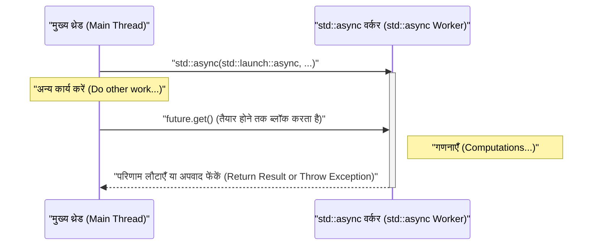

आधुनिक सॉफ्टवेयर विकास में, मल्टी-कोर CPU के प्रदर्शन को अधिकतम करने के लिए मल्टीथ्रेडिंग प्रोग्रामिंग आवश्यक है। C++11 से, C++ ने मानक लाइब्रेरी के रूप में मल्टीथ्रेडिंग और एसिंक्रोनस प्रोसेसिंग API (`<thread>`, `<mutex>`, `<condition_variable>`, `<future>`) पेश किए हैं, जिससे प्लेटफ़ॉर्म-विशिष्ट कोड (जैसे POSIX थ्रेड्स या Windows API) लिखे बिना पोर्टेबल और सुरक्षित कंकरेंट प्रोसेसिंग को लागू करना संभव हो गया है। इसके अलावा, C++14, C++17 और C++20 जैसे क्रमिक संस्करणों के साथ, `std::scoped_lock` और `std::jthread` जैसी अधिक सुरक्षित और उन्नत सुविधाएँ जोड़ी गई हैं।

इस लेख में, हम C++ मल्टीथ्रेडिंग प्रोग्रामिंग के मूल सिद्धांतों से लेकर डेटा रेस (data race) को रोकने के लिए सिंक्रोनाइज़ेशन तंत्र, और आधुनिक एसिंक्रोनस प्रोसेसिंग (`std::async`) के साथ-साथ थ्रेड पूल (thread pool) की अवधारणा को विस्तृत कोड उदाहरणों के साथ अच्छी तरह से समझाएंगे।

---

## 1. कंकरेंट प्रोसेसिंग की मूल बातें और एमडाहल का नियम (Amdahl's Law)

मल्टीथ्रेडिंग का मुख्य उद्देश्य "प्रदर्शन में सुधार" है, लेकिन संपूर्ण प्रोग्राम को समानांतर (parallelize) नहीं किया जा सकता है। यहीं पर **एमडाहल का नियम (Amdahl's Law)** महत्वपूर्ण हो जाता है।

एमडाहल का नियम एक मॉडल है जो यह अनुमान लगाता है कि प्रोग्राम के एक हिस्से को समानांतर और तेज़ करने पर संपूर्ण सिस्टम के प्रदर्शन में कितना सुधार होगा।

$$ S(N) = \frac{1}{(1 - P) + \frac{P}{N}} $$

* $S(N)$ : सैद्धांतिक अधिकतम स्पीडअप अनुपात
* $P$ : संपूर्ण प्रोग्राम का वह भाग जिसे समानांतर किया जा सकता है (0 ≤ $P$ ≤ 1)
* $N$ : प्रोसेसर (थ्रेड) की संख्या

यह गणितीय सूत्र जो महत्वपूर्ण तथ्य दिखाता है वह यह है कि, "चाहे आप प्रोसेसर की संख्या $N$ को कितना भी बढ़ा लें, क्रमिक भाग $(1 - P)$ जिसे समानांतर नहीं किया जा सकता, वह एक अड़चन (bottleneck) बन जाता है, और स्पीडअप की एक सीमा होती है।" उदाहरण के लिए, भले ही प्रोग्राम का $90\%$ समानांतर करने योग्य हो ($P = 0.9$), जब तक शेष $10\%$ क्रमिक प्रसंस्करण (serial processing) है, अनंत प्रोसेसर का उपयोग करने पर भी गति केवल अधिकतम $10$ गुना ($S(\infty) = 1 / 0.1$) बढ़ेगी।

इसलिए, C++ में मल्टीथ्रेडिंग प्रोग्रामिंग करते समय, न केवल थ्रेड्स को बढ़ाना आवश्यक है, बल्कि एक ऐसे **डिज़ाइन की भी आवश्यकता है जो क्रमिक प्रसंस्करण भागों (जैसे लॉक कंटेंशन (lock contention) और सिंक्रोनाइज़ेशन ओवरहेड) को जितना संभव हो उतना कम कर दे**।

---

## 2. थ्रेड के मूल सिद्धांत: `std::thread` और `std::jthread` (C++20)

### पारंपरिक `std::thread` (C++11)

C++11 में पेश किया गया `std::thread`, एक नए थ्रेड में फ़ंक्शंस या लैम्ब्डा एक्सप्रेशन को निष्पादित करने के लिए सबसे बुनियादी क्लास है।

```cpp
#include <iostream>
#include <thread>

void workerFunction(int id) {
    std::cout << "Worker " << id << " is running on thread " 
              << std::this_thread::get_id() << std::endl;
}

int main() {
    std::cout << "Main thread id: " << std::this_thread::get_id() << std::endl;

    // थ्रेड बनाना और निष्पादन शुरू करना
    std::thread t1(workerFunction, 1);
    
    // लैम्ब्डा एक्सप्रेशन का उपयोग करके थ्रेड बनाना
    std::thread t2([](int id) {
        std::cout << "Lambda Worker " << id << " is running." << std::endl;
    }, 2);

    // थ्रेड के पूरा होने की प्रतीक्षा करना (join)
    t1.join();
    t2.join();

    std::cout << "All threads completed." << std::endl;
    return 0;
}
```

`std::thread` के साथ ध्यान देने वाली बात यह है कि **इसके नष्ट होने से पहले `join()` या `detach()` को कॉल किया जाना चाहिए**। यदि `std::thread` का डिस्ट्रक्टर (destructor) इनमें से किसी को भी कॉल किए बिना कॉल किया जाता है, तो `std::terminate()` कॉल हो जाएगा, और प्रोग्राम क्रैश हो जाएगा। अपवाद सुरक्षा (exception safety) सुनिश्चित करने के लिए, RAII पैटर्न का उपयोग करके एक कस्टम रैपर क्लास (wrapper class) बनाना आवश्यक था।

### आधुनिक `std::jthread` (C++20)

C++20 में, इन कमियों को दूर करते हुए `std::jthread` (joining thread) पेश किया गया। `std::jthread` स्वचालित रूप से अपने डिस्ट्रक्टर में `join()` को कॉल करता है, जिससे अपवाद (exception) होने पर भी थ्रेड सुरक्षित रूप से पूरा होने की प्रतीक्षा कर सकता है। इसके अलावा, इसमें `std::stop_token` के माध्यम से थ्रेड्स के लिए एक सहयोगी रद्दीकरण (cooperative cancellation) सुविधा भी है।

```cpp
#include <iostream>
#include <thread>
#include <chrono>

int main() {
    // C++20: std::jthread
    // पहले तर्क (argument) के रूप में std::stop_token प्राप्त करके रद्दीकरण अनुरोधों का पता लगाया जा सकता है
    std::jthread jt([](std::stop_token stoken) {
        while (!stoken.stop_requested()) {
            std::cout << "Working..." << std::endl;
            std::this_thread::sleep_for(std::chrono::milliseconds(500));
        }
        std::cout << "Stop requested. Exiting thread." << std::endl;
    });

    std::this_thread::sleep_for(std::chrono::seconds(2));
    
    // स्पष्ट रूप से रद्दीकरण का अनुरोध करना
    jt.request_stop(); 
    
    // jthread के डिस्ट्रक्टर में स्वचालित रूप से join हो जाता है, इसलिए मैन्युअल रूप से join() कॉल करने की आवश्यकता नहीं है
    return 0;
}
```

---

## 3. डेटा रेस (Data Race) से बचना और सिंक्रोनाइज़ेशन: म्यूटेक्स (Mutex) और लॉक

जब कई थ्रेड्स एक ही समय में एक ही मेमोरी क्षेत्र (जैसे वेरिएबल) तक पहुँचते हैं, और उनमें से कम से कम एक लिख (write) रहा होता है, तो **डेटा रेस (Data Race)** होती है। C++ मानक में, डेटा रेस अपरिभाषित व्यवहार (Undefined Behavior) का कारण बनती है। इसे रोकने के लिए, `std::mutex` का उपयोग करके पारस्परिक बहिष्करण (mutual exclusion) आवश्यक है।

### `std::mutex` और `std::lock_guard`

कच्चे (raw) `std::mutex::lock()` और `unlock()` को मैन्युअल रूप से कॉल करने की अनुशंसा नहीं की जाती है क्योंकि अपवाद (exception) होने पर `unlock()` कॉल नहीं हो सकता है, जिससे डेडलॉक (deadlock) का जोखिम होता है। C++ में, हम RAII पैटर्न का उपयोग करके `std::lock_guard` (C++11) या `std::scoped_lock` (C++17) का उपयोग करते हैं।

```cpp
#include <iostream>
#include <vector>
#include <thread>
#include <mutex>

std::mutex g_mutex;
int g_counter = 0;

void incrementCounter(int iterations) {
    for (int i = 0; i < iterations; ++i) {
        // स्कोप से बाहर निकलने पर स्वचालित रूप से unlock हो जाता है
        std::lock_guard<std::mutex> lock(g_mutex);
        ++g_counter;
    }
}

int main() {
    std::vector<std::thread> threads;
    for (int i = 0; i < 10; ++i) {
        threads.emplace_back(incrementCounter, 10000);
    }

    for (auto& t : threads) {
        t.join();
    }

    std::cout << "Final counter value: " << g_counter << std::endl;
    // उम्मीद के मुताबिक 100000 होगा
    return 0;
}
```

### `std::unique_lock`

`std::lock_guard` एक साधारण स्कोप-आधारित लॉक है, लेकिन यदि अधिक लचीले नियंत्रण (देरी से लॉक करना, समय-सीमित लॉक, बीच में अनलॉक करना आदि) की आवश्यकता है, तो `std::unique_lock` का उपयोग किया जाता है। `std::condition_variable` (जिसे आगे समझाया गया है) के लिए `std::unique_lock` का होना आवश्यक है।

---

## 4. थ्रेड्स के बीच संचार: `std::condition_variable`

"उत्पादक-उपभोक्ता पैटर्न (Producer-Consumer Pattern)" को लागू करने के लिए, जहां एक थ्रेड एक निश्चित शर्त पूरी होने तक प्रतीक्षा करता है, और दूसरा थ्रेड शर्त पूरी होने पर उसे सूचित करता है, हम `std::condition_variable` का उपयोग करते हैं।

```cpp
#include <iostream>
#include <thread>
#include <mutex>
#include <condition_variable>
#include <queue>

std::mutex g_mtx;
std::condition_variable g_cv;
std::queue<int> g_dataQueue;
bool g_isFinished = false;

void producer() {
    for (int i = 1; i <= 5; ++i) {
        std::this_thread::sleep_for(std::chrono::milliseconds(200));
        {
            std::lock_guard<std::mutex> lock(g_mtx);
            g_dataQueue.push(i);
            std::cout << "Produced: " << i << std::endl;
        }
        g_cv.notify_one(); // उपभोक्ता (consumer) को सूचित करना
    }
    
    {
        std::lock_guard<std::mutex> lock(g_mtx);
        g_isFinished = true;
    }
    g_cv.notify_one(); // पूर्ण होने की सूचना देना
}

void consumer() {
    while (true) {
        std::unique_lock<std::mutex> lock(g_mtx);
        // शर्त पूरी होने तक प्रतीक्षा करें (कतार खाली नहीं है, या समाप्ति ध्वज (flag) सेट है)
        // स्पूरियस वेकअप (Spurious Wakeup) को रोकने के लिए लैम्ब्डा एक्सप्रेशन के साथ शर्त निर्दिष्ट करें
        g_cv.wait(lock, []{ return !g_dataQueue.empty() || g_isFinished; });

        while (!g_dataQueue.empty()) {
            int val = g_dataQueue.front();
            g_dataQueue.pop();
            // अनलॉक करें और भारी प्रोसेसिंग (यहाँ केवल आउटपुट) करें
            lock.unlock();
            std::cout << "Consumed: " << val << std::endl;
            lock.lock(); // लॉक फिर से प्राप्त करें
        }

        if (g_isFinished && g_dataQueue.empty()) {
            break;
        }
    }
}

int main() {
    std::thread t1(producer);
    std::thread t2(consumer);
    t1.join();
    t2.join();
    return 0;
}
```

इस उदाहरण में, `std::condition_variable::wait` थ्रेड को तब तक स्लीप अवस्था में रखता है जब तक कि शर्त पूरी नहीं हो जाती, जिससे CPU संसाधनों की अनावश्यक खपत (व्यस्त लूप / busy loop) से बचा जा सकता है।

---

## 5. उच्च-स्तरीय एसिंक्रोनस प्रोसेसिंग: `std::future`, `std::promise`, `std::async`

अब तक चर्चा किए गए `std::thread` और `std::mutex` शक्तिशाली हैं, लेकिन वे OS के निम्न-स्तरीय (low-level) थ्रेड तंत्र को सीधे C++ में लाते हैं, जिससे परिणाम प्राप्त करने या अपवादों का प्रचार (exception propagation) करने के लिए कोड बोझिल हो जाता है। यदि आप एक रिटर्न वैल्यू (return value) के साथ कंकरेंट प्रोसेसिंग या उच्च-स्तरीय एसिंक्रोनस प्रोसेसिंग करना चाहते हैं, तो `<future>` हेडर की सुविधाओं का उपयोग करें।

### `std::promise` और `std::future`

`std::promise` उस पक्ष का प्रतिनिधित्व करता है जो परिणाम "सेट" करता है, और `std::future` उस पक्ष का प्रतिनिधित्व करता है जो परिणाम "प्राप्त" करता है। ये थ्रेड्स के बीच परिणाम और अपवाद पारित करने के लिए एक सुरक्षित चैनल के रूप में कार्य करते हैं।

### `std::async` का उपयोग करके टास्क-आधारित कंकरेंट प्रोसेसिंग

C++ में एसिंक्रोनस कार्यों को निष्पादित करने का सबसे अनुशंसित तरीका `std::async` का उपयोग करना है। `std::async` एक कार्य को एसिंक्रोनस रूप से निष्पादित करता है और परिणाम प्राप्त करने के लिए एक `std::future` लौटाता है।

```cpp
#include <iostream>
#include <future>
#include <chrono>

int complexCalculation(int x) {
    std::cout << "Calculation started on thread: " 
              << std::this_thread::get_id() << std::endl;
    std::this_thread::sleep_for(std::chrono::seconds(2));
    if (x < 0) {
        throw std::invalid_argument("x must be positive");
    }
    return x * 42;
}

int main() {
    std::cout << "Main thread id: " << std::this_thread::get_id() << std::endl;

    // बलपूर्वक एक अलग थ्रेड में निष्पादित करने के लिए std::launch::async निर्दिष्ट करें
    std::future<int> resultFuture = std::async(std::launch::async, complexCalculation, 10);

    std::cout << "Main thread is doing other work..." << std::endl;

    try {
        // get() कॉल करने से वर्तमान थ्रेड तब तक ब्लॉक रहेगा जब तक गणना पूरी नहीं हो जाती
        int result = resultFuture.get();
        std::cout << "Result: " << result << std::endl;
    } catch (const std::exception& e) {
        std::cerr << "Exception caught: " << e.what() << std::endl;
    }

    return 0;
}
```

`std::async` का व्यवहार नीचे दिए गए अनुक्रम आरेख (sequence diagram) में दिखाया गया है।



`std::async` के पहले तर्क (argument), लॉन्च पॉलिसी (Launch Policy), के दो प्रकार हैं:
* `std::launch::async`: हमेशा एक नया थ्रेड बनाता है (या थ्रेड पूल से असाइन करता है) और एसिंक्रोनस रूप से निष्पादित करता है।
* `std::launch::deferred`: आलसी मूल्यांकन (Lazy evaluation)। जब `future.get()` या `future.wait()` को कॉल किया जाता है, तो यह कॉलिंग थ्रेड में सिंक्रोनस रूप से निष्पादित होता है।

यदि डिफ़ॉल्ट रूप से छोड़ दिया जाता है (निर्दिष्ट नहीं किया गया है), तो यह कार्यान्वयन पर निर्भर (implementation-dependent) होता है, और सिस्टम के लोड की स्थिति के आधार पर कोई एक चुना जाता है। यदि आप एसिंक्रोनस निष्पादन सुनिश्चित करना चाहते हैं, স্ক্রिप्त एसिंक्रोनस निष्पादन सुनिश्चित करना चाहते हैं, तो स्पष्ट रूप से `std::launch::async` निर्दिष्ट करें।

---

## 6. थ्रेड पूल (Thread Pool) की अवधारणा

यदि आप हर बार `std::async` को कॉल करते हैं, या लूप के भीतर बार-बार `std::thread` बनाते और नष्ट करते हैं, तो थ्रेड कॉन्टेक्स्ट स्विचिंग और OS संसाधन आवंटन के कारण होने वाला ओवरहेड महत्वपूर्ण हो जाता है। विशेष रूप से जब बड़ी संख्या में छोटे कार्यों (fine-grained tasks) को संसाधित किया जाता है, तो थ्रेड पूल (Thread Pool) का उपयोग आवश्यक है।

थ्रेड पूल एक ऐसा आर्किटेक्चर है जहाँ एप्लिकेशन के स्टार्टअप पर एक निश्चित संख्या में वर्कर (Worker) थ्रेड पहले से बना लिए जाते हैं, कार्यों को एक कतार (Queue) में रखा जाता है, और उपलब्ध वर्कर थ्रेड्स कार्यों को कतार से निकालकर क्रमिक रूप से संसाधित करते हैं।

```mermaid
graph TD
    Client["क्लाइंट / मुख्य थ्रेड (Client / Main Thread)"] -->|कार्य कतार में डालें (Push Task)| Queue["कार्य कतार (Task Queue)"]
    Queue -->|कार्य निकालें (Pop Task)| W1["वर्कर थ्रेड 1 (Worker Thread 1)"]
    Queue -->|कार्य निकालें (Pop Task)| W2["वर्कर थ्रेड 2 (Worker Thread 2)"]
    Queue -->|कार्य निकालें (Pop Task)| W3["वर्कर थ्रेड N (Worker Thread N)"]
    
    W1 --> Exec["निष्पादन और फ्यूचर रिटर्न (Execution & Return Future)"]
    W2 --> Exec
    W3 --> Exec
```

हालांकि C++ मानक लाइब्रेरी (C++23 तक) में एक मानक थ्रेड पूल क्लास नहीं है, लेकिन `std::thread`, `std::mutex`, `std::condition_variable`, `std::function`, और `std::packaged_task` को मिलाकर कुछ दर्जन पंक्तियों (lines) में एक कुशल थ्रेड पूल लागू करना संभव है। वास्तविक उत्पादन वातावरण (production environment) में, `Boost.Asio` के एसिंक्रोनस I/O या थर्ड-पार्टी लाइब्रेरी का उपयोग करना आम बात है।

---

## 7. प्रदर्शन (Performance) और स्केलेबिलिटी (Scalability) पर विचार

मल्टीथ्रेडिंग प्रोग्रामिंग में सर्वोत्तम प्रदर्शन प्राप्त करने के लिए, न केवल कोड के समानांतरकरण पर बल्कि हार्डवेयर आर्किटेक्चर पर भी ध्यान देना आवश्यक है।

* **फॉल्स शेयरिंग (False Sharing):** 
  भले ही कई थ्रेड्स अलग-अलग वेरिएबल्स को अपडेट कर रहे हों, यदि वे वेरिएबल्स CPU की एक ही कैश लाइन (cache line - आमतौर पर 64 बाइट्स) में स्थित हैं, तो कैश कोहेरेंसी (cache coherency) बनाए रखने के लिए अनावश्यक मेमोरी सिंक्रोनाइज़ेशन होता है, जिससे प्रदर्शन में भारी गिरावट आती है। इसे रोकने के लिए, `alignas` स्पेसिफायर (specifier) का उपयोग करके वेरिएबल्स को कैश लाइन की सीमाओं पर संरेखित (align) करना आवश्यक है।
* **लॉक-फ्री (Lock-Free) और `std::atomic`:**
  म्यूटेक्स के लॉक/अनलॉक के ओवरहेड से बचने के लिए, `<atomic>` का उपयोग करके अविभाज्य संचालन (atomic operations, जैसे कि Compare-And-Swap) या लॉक-फ्री डेटा स्ट्रक्चर शुरू करने पर विचार किया जाता है। हालाँकि, इसके लिए मेमोरी ऑर्डर (`std::memory_order`) की सही समझ की आवश्यकता होती है, और इसे लागू करना बहुत कठिन है। इसलिए, आमतौर पर सावधानीपूर्वक प्रदर्शन मापन (performance measurement) के बाद ही इसे पेश किया जाता है, जब इसकी सख्त आवश्यकता हो।

---

## 8. निष्कर्ष

हमने C++ में मल्टीथ्रेडिंग और एसिंक्रोनस प्रोग्रामिंग के बारे में बुनियादी बातों से लेकर C++20 की नवीनतम सुविधाओं तक चर्चा की है। महत्वपूर्ण बिंदु इस प्रकार हैं:

1. **मूल रूप से `std::async` का उपयोग करें:** एकल एसिंक्रोनस कार्यों और परिणाम लौटाने वाले कंकरेंट प्रोसेसिंग के लिए, थ्रेड्स को मैन्युअल रूप से प्रबंधित करने के बजाय सुरक्षित `std::async` और `std::future` का उपयोग करें।
2. **थ्रेड प्रबंधन के लिए `std::jthread`:** पृष्ठभूमि में लंबे समय तक चलने वाले थ्रेड्स के लिए, C++20 के `std::jthread` का उपयोग करें ताकि सुरक्षित समाप्ति प्रक्रिया सुनिश्चित हो सके।
3. **सिंक्रोनाइज़ेशन के लिए RAII का लाभ उठाएं:** डेटा रेस को रोकने के लिए म्यूटेक्स लॉक हमेशा `std::lock_guard` या `std::unique_lock` के माध्यम से किया जाना चाहिए।
4. **ओवरहेड के प्रति सचेत रहें:** थ्रेड्स के अत्यधिक निर्माण से बचें, और यदि आवश्यक हो तो थ्रेड पूल आर्किटेक्चर पेश करें।

कंकरेंट प्रोसेसिंग बग (जैसे डेडलॉक, डेटा रेस) की पुनरावृत्ति (reproducibility) कम होती है और इन्हें डीबग करना सबसे कठिन होता है। थ्रेड सुरक्षा (thread safety) के प्रति हमेशा सचेत रहें और आधुनिक C++ के साथ मजबूत और तेज़ सिस्टम विकास प्राप्त करने के लिए उचित मानक लाइब्रेरी टूल का चयन करें।
