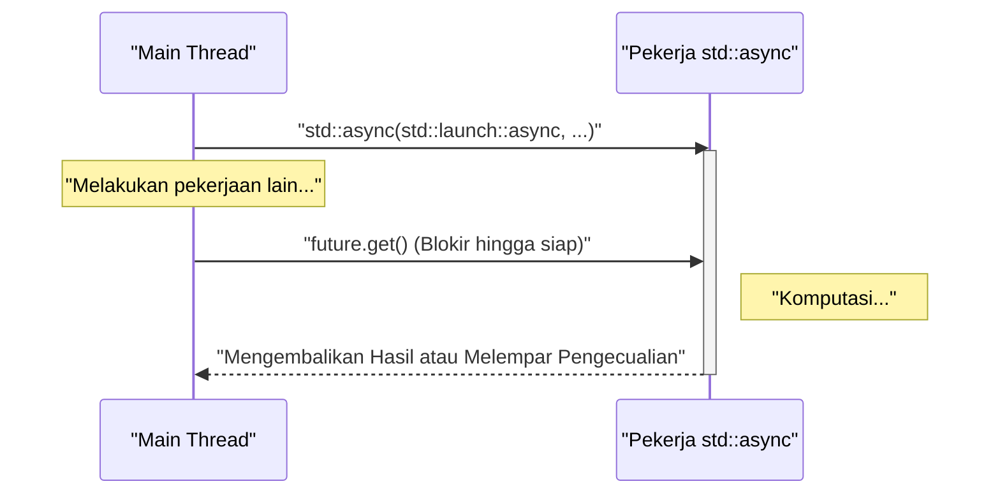
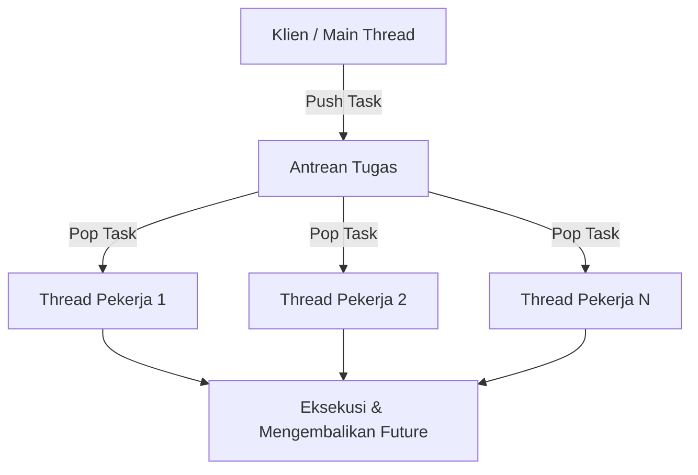

Dalam pengembangan perangkat lunak modern, pemrograman multithreading sangat penting untuk memaksimalkan kinerja dari CPU multi-core. Sejak C++11, pustaka standar C++ memperkenalkan API untuk multithreading dan pemrosesan asinkron (`<thread>`, `<mutex>`, `<condition_variable>`, `<future>`), memungkinkan pengembang untuk mengimplementasikan pemrosesan paralel yang portabel dan aman tanpa perlu menulis kode yang bergantung pada platform (seperti thread POSIX atau Windows API). Selanjutnya, dengan setiap pembaruan versi (C++14, C++17, dan C++20), fitur-fitur yang lebih canggih dan aman seperti `std::scoped_lock` dan `std::jthread` telah ditambahkan.

Artikel ini akan membahas secara menyeluruh pemrograman multithreading di C++, mulai dari dasar-dasarnya, mekanisme sinkronisasi untuk mencegah data race (perlombaan data), hingga pemrosesan asinkron modern (`std::async`) dan konsep thread pool, dilengkapi dengan contoh kode yang mendetail.

---

## 1. Dasar Pemrosesan Paralel dan Hukum Amdahl

Tujuan utama dari penerapan multithreading adalah "peningkatan kinerja", tetapi tidak seluruh bagian dari program dapat diparalelkan. Di sinilah **Hukum Amdahl (Amdahl's Law)** menjadi sangat penting.

Hukum Amdahl adalah sebuah model yang memprediksi seberapa besar peningkatan kinerja sistem secara keseluruhan ketika sebagian dari program diparalelkan atau dipercepat.

$$ S(N) = \frac{1}{(1 - P) + \frac{P}{N}} $$

* $S(N)$ : Rasio percepatan (speedup) maksimum teoritis
* $P$ : Persentase dari program yang dapat diparalelkan (0 ≤ $P$ ≤ 1)
* $N$ : Jumlah prosesor (thread)

Fakta penting yang ditunjukkan oleh rumus ini adalah, "Berapa pun jumlah prosesor $N$ yang ditambahkan, bagian serial yang tidak dapat diparalelkan $(1 - P)$ akan menjadi bottleneck (hambatan), sehingga percepatan memiliki batas maksimal." Sebagai contoh, meskipun $90\%$ dari program dapat diparalelkan ($P = 0.9$), selama $10\%$ sisanya adalah pemrosesan serial, penggunaan prosesor tak terhingga sekalipun hanya akan menghasilkan percepatan maksimal $10$ kali lipat ($S(\infty) = 1 / 0.1$).

Oleh karena itu, ketika melakukan pemrograman multithreading di C++, kita tidak sekadar memperbanyak jumlah thread, melainkan dituntut untuk melakukan **desain yang sebisa mungkin meminimalkan bagian pemrosesan serial (seperti perebutan lock dan overhead sinkronisasi)**.

---

## 2. Dasar-dasar Thread: `std::thread` dan `std::jthread` (C++20)

### `std::thread` Konvensional (C++11)

Diperkenalkan pada C++11, `std::thread` adalah kelas paling dasar untuk menjalankan fungsi atau ekspresi lambda pada thread baru.

```cpp
#include <iostream>
#include <thread>

void workerFunction(int id) {
    std::cout << "Worker " << id << " is running on thread " 
              << std::this_thread::get_id() << std::endl;
}

int main() {
    std::cout << "Main thread id: " << std::this_thread::get_id() << std::endl;

    // Membuat dan memulai eksekusi thread
    std::thread t1(workerFunction, 1);
    
    // Membuat thread menggunakan ekspresi lambda
    std::thread t2([](int id) {
        std::cout << "Lambda Worker " << id << " is running." << std::endl;
    }, 2);

    // Menunggu thread selesai (join)
    t1.join();
    t2.join();

    std::cout << "All threads completed." << std::endl;
    return 0;
}
```

Hal yang perlu diperhatikan mengenai `std::thread` adalah **Anda harus selalu memanggil `join()` atau `detach()` sebelum objek tersebut dihancurkan**. Jika destruktor dari `std::thread` dipanggil tanpa satupun dari kedua fungsi tersebut dijalankan, maka `std::terminate()` akan dipanggil dan program akan crash (rusak). Untuk memastikan exception safety (keamanan penanganan pengecualian), sebelumnya Anda harus membuat kelas wrapper (pembungkus) kustom menggunakan pola RAII.

### `std::jthread` Modern (C++20)

Pada C++20, diperkenalkan `std::jthread` (joining thread) yang menyelesaikan kekurangan tersebut. `std::jthread` secara otomatis memanggil `join()` pada destruktornya, sehingga Anda dapat menunggu selesainya thread dengan aman meskipun terjadi exception (pengecualian). Selain itu, kelas ini juga dilengkapi dengan fitur pembatalan kooperatif antar-thread melalui `std::stop_token`.

```cpp
#include <iostream>
#include <thread>
#include <chrono>

int main() {
    // C++20: std::jthread
    // Dapat mendeteksi permintaan pembatalan dengan menerima std::stop_token pada argumen pertama
    std::jthread jt([](std::stop_token stoken) {
        while (!stoken.stop_requested()) {
            std::cout << "Working..." << std::endl;
            std::this_thread::sleep_for(std::chrono::milliseconds(500));
        }
        std::cout << "Stop requested. Exiting thread." << std::endl;
    });

    std::this_thread::sleep_for(std::chrono::seconds(2));
    
    // Meminta pembatalan secara eksplisit
    jt.request_stop(); 
    
    // Karena join dilakukan secara otomatis di destruktor jthread, pemanggilan join() secara manual tidak diperlukan
    return 0;
}
```

---

## 3. Menghindari Data Race dan Sinkronisasi: Mutex dan Lock

Jika beberapa thread mengakses area memori yang sama (misalnya sebuah variabel) secara bersamaan, dan setidaknya satu di antaranya melakukan operasi penulisan, maka **Data Race (Perlombaan Data)** akan terjadi. Dalam standar C++, data race akan menyebabkan Undefined Behavior (perilaku yang tidak terdefinisi). Untuk mencegah hal ini, diperlukan kontrol eksklusif (mutual exclusion) menggunakan `std::mutex`.

### `std::mutex` dan `std::lock_guard`

Memanggil `std::mutex::lock()` dan `unlock()` mentah secara manual tidak disarankan karena memiliki risiko menyebabkan deadlock jika `unlock()` tidak dipanggil saat terjadi pengecualian. Dalam C++, Anda harus menggunakan `std::lock_guard` (C++11) atau `std::scoped_lock` (C++17) yang menggunakan pola RAII.

```cpp
#include <iostream>
#include <vector>
#include <thread>
#include <mutex>

std::mutex g_mutex;
int g_counter = 0;

void incrementCounter(int iterations) {
    for (int i = 0; i < iterations; ++i) {
        // Secara otomatis di-unlock saat keluar dari scope
        std::lock_guard<std::mutex> lock(g_mutex);
        ++g_counter;
    }
}

int main() {
    std::vector<std::thread> threads;
    for (int i = 0; i < 10; ++i) {
        threads.emplace_back(incrementCounter, 10000);
    }

    for (auto& t : threads) {
        t.join();
    }

    std::cout << "Final counter value: " << g_counter << std::endl;
    // Sesuai harapan akan menjadi 100000
    return 0;
}
```

### `std::unique_lock`

Sementara `std::lock_guard` adalah penguncian berbasis scope yang sederhana, jika Anda membutuhkan kontrol yang lebih fleksibel (penguncian yang ditunda, penguncian dengan batas waktu, membuka kunci di tengah eksekusi, dll.), gunakanlah `std::unique_lock`. Penggunaan `std::unique_lock` menjadi wajib pada `std::condition_variable` yang akan dibahas selanjutnya.

---

## 4. Komunikasi Antar-Thread: `std::condition_variable`

Untuk mengimplementasikan hal seperti "Pola Produsen-Konsumen" (Producer-Consumer Pattern), di mana sebuah thread menunggu hingga suatu kondisi terpenuhi, dan thread lain mengirimkan pemberitahuan ketika kondisi tersebut terpenuhi, kita menggunakan `std::condition_variable`.

```cpp
#include <iostream>
#include <thread>
#include <mutex>
#include <condition_variable>
#include <queue>

std::mutex g_mtx;
std::condition_variable g_cv;
std::queue<int> g_dataQueue;
bool g_isFinished = false;

void producer() {
    for (int i = 1; i <= 5; ++i) {
        std::this_thread::sleep_for(std::chrono::milliseconds(200));
        {
            std::lock_guard<std::mutex> lock(g_mtx);
            g_dataQueue.push(i);
            std::cout << "Produced: " << i << std::endl;
        }
        g_cv.notify_one(); // Memberitahu konsumen
    }
    
    {
        std::lock_guard<std::mutex> lock(g_mtx);
        g_isFinished = true;
    }
    g_cv.notify_one(); // Memberitahu status selesai
}

void consumer() {
    while (true) {
        std::unique_lock<std::mutex> lock(g_mtx);
        // Menunggu hingga kondisi terpenuhi (antrean tidak kosong, atau flag selesai disetel)
        // Menentukan kondisi menggunakan ekspresi lambda untuk mencegah kebangkitan palsu (Spurious Wakeup)
        g_cv.wait(lock, []{ return !g_dataQueue.empty() || g_isFinished; });

        while (!g_dataQueue.empty()) {
            int val = g_dataQueue.front();
            g_dataQueue.pop();
            // Membuka kunci (unlock) dan melakukan pemrosesan berat (di sini hanya sekadar output)
            lock.unlock();
            std::cout << "Consumed: " << val << std::endl;
            lock.lock(); // Mendapatkan kunci kembali
        }

        if (g_isFinished && g_dataQueue.empty()) {
            break;
        }
    }
}

int main() {
    std::thread t1(producer);
    std::thread t2(consumer);
    t1.join();
    t2.join();
    return 0;
}
```

Pada contoh ini, `std::condition_variable::wait` akan membuat thread berada dalam status sleep (tertidur) sampai kondisi terpenuhi, sehingga mencegah pemborosan sumber daya CPU (seperti pada busy loop).

---

## 5. Pemrosesan Asinkron Tingkat Abstrak Tinggi: `std::future`, `std::promise`, `std::async`

Meskipun `std::thread` dan `std::mutex` yang dibahas sejauh ini sangat andal, keduanya adalah mekanisme thread tingkat rendah (low-level) dari OS yang dibawa langsung ke C++. Jika menggunakannya, kode untuk menangani pengambilan nilai kembalian atau propagasi exception seringkali menjadi rumit. Untuk pemrosesan paralel yang memiliki nilai kembalian, atau pemrosesan asinkron tingkat tinggi, gunakanlah fitur dari header `<future>`.

### `std::promise` dan `std::future`

`std::promise` mewakili sisi yang "mengatur" hasil, sedangkan `std::future` mewakili sisi yang "menerima" hasil. Keduanya berfungsi sebagai channel (saluran) yang aman untuk meneruskan hasil atau exception antar-thread.

### Pemrosesan Paralel Berbasis Tugas dengan `std::async`

Cara yang paling direkomendasikan untuk menjalankan tugas asinkron di C++ adalah menggunakan `std::async`. `std::async` mengeksekusi tugas secara asinkron dan mengembalikan sebuah objek `std::future` untuk mengambil hasil dari tugas tersebut.

```cpp
#include <iostream>
#include <future>
#include <chrono>

int complexCalculation(int x) {
    std::cout << "Calculation started on thread: " 
              << std::this_thread::get_id() << std::endl;
    std::this_thread::sleep_for(std::chrono::seconds(2));
    if (x < 0) {
        throw std::invalid_argument("x must be positive");
    }
    return x * 42;
}

int main() {
    std::cout << "Main thread id: " << std::this_thread::get_id() << std::endl;

    // Menentukan std::launch::async untuk secara paksa mengeksekusinya di thread yang berbeda
    std::future<int> resultFuture = std::async(std::launch::async, complexCalculation, 10);

    std::cout << "Main thread is doing other work..." << std::endl;

    try {
        // Saat get() dipanggil, thread saat ini akan diblokir dan menunggu hingga perhitungan selesai
        int result = resultFuture.get();
        std::cout << "Result: " << result << std::endl;
    } catch (const std::exception& e) {
        std::cerr << "Exception caught: " << e.what() << std::endl;
    }

    return 0;
}
```

Perilaku `std::async` ditunjukkan pada diagram urutan (sequence diagram) berikut.



Pada argumen pertama dari `std::async`, terdapat kebijakan peluncuran (Launch Policy) yang terbagi menjadi 2 jenis berikut:
* `std::launch::async`: Pasti membuat thread baru (atau mengalokasikan dari thread pool) dan mengeksekusinya secara asinkron.
* `std::launch::deferred`: Evaluasi malas (lazy evaluation). Tugas dieksekusi secara sinkron pada thread pemanggil pada saat `future.get()` atau `future.wait()` dipanggil.

Jika tidak ditentukan (opsi default), perilaku akan bergantung pada lingkungan eksekusi sistem, dan salah satu dari keduanya akan dipilih berdasarkan beban sistem. Jika Anda ingin memastikan eksekusi berjalan secara asinkron, tentukanlah `std::launch::async` secara eksplisit.

---

## 6. Konsep Thread Pool

Jika Anda memanggil `std::async` setiap saat, atau membuat dan menghancurkan `std::thread` berulang kali di dalam sebuah loop, overhead dari context switch antar-thread dan alokasi sumber daya OS akan menjadi sesuatu yang tidak bisa diabaikan. Khususnya ketika memproses tugas-tugas kecil (fine-grained tasks) dalam jumlah yang sangat besar, penggunaan Thread Pool menjadi sangat penting.

Thread Pool adalah sebuah arsitektur di mana sejumlah thread pekerja (worker threads) dihasilkan dan dipersiapkan terlebih dahulu saat aplikasi berjalan. Tugas-tugas kemudian disimpan dalam sebuah antrean (Queue), dan thread pekerja yang sedang menganggur akan mengambil tugas dari antrean tersebut dan memprosesnya secara berurutan.



Pustaka standar C++ (hingga versi C++23) belum memiliki kelas thread pool standar, tetapi dengan menggabungkan `std::thread`, `std::mutex`, `std::condition_variable`, `std::function`, dan `std::packaged_task`, Anda bisa mengimplementasikan thread pool yang efisien hanya dalam beberapa puluh baris kode. Dalam operasional sebenarnya, sangat umum juga untuk menggunakan I/O asinkron dari `Boost.Asio` atau pustaka dari pihak ketiga.

---

## 7. Pertimbangan terhadap Kinerja dan Skalabilitas

Untuk mengeluarkan performa terbaik dalam pemrograman multithreading, perhatian harus diberikan tidak hanya pada paralelisasi kode, tetapi juga pada arsitektur perangkat keras.

* **Berbagi Palsu (False Sharing):** 
  Jika beberapa thread memperbarui variabel yang berbeda, namun variabel tersebut terletak di dalam satu garis cache (cache line) yang sama (biasanya 64 byte) di dalam CPU, sinkronisasi memori yang sia-sia akan terjadi untuk menjaga koherensi cache, dan kinerja akan menurun drastis. Untuk mencegah hal ini, diperlukan strategi seperti menggunakan penentu (specifier) `alignas` untuk menyelaraskan variabel pada batas cache line.
* **Bebas Kunci (Lock-Free) dan `std::atomic`:**
  Untuk menghindari overhead penguncian/pembukaan kunci dari mutex, kita dapat mempertimbangkan penggunaan operasi tak terpisahkan (seperti Compare-And-Swap) menggunakan `<atomic>` dan pengenalan struktur data lock-free. Akan tetapi, hal ini membutuhkan pemahaman yang mendalam tentang urutan memori (`std::memory_order`) dan tingkat kesulitannya sangat tinggi, sehingga pendekatan ini biasanya hanya diperkenalkan setelah diputuskan benar-benar perlu melalui pengukuran kinerja yang hati-hati.

---

## 8. Kesimpulan

Artikel ini telah menjelaskan dasar-dasar pemrograman multithreading dan asinkron di C++, mulai dari hal-hal yang mendasar hingga fitur terbaru di C++20. Poin-poin pentingnya adalah sebagai berikut:

1. **Secara standar gunakanlah `std::async`:** Untuk tugas asinkron tunggal atau pemrosesan paralel yang mengembalikan hasil, gunakan `std::async` dan `std::future` karena lebih aman daripada mengelola thread secara manual.
2. **Gunakan `std::jthread` untuk mengelola thread:** Untuk thread yang berjalan terus-menerus di background dalam jangka waktu panjang, gunakan `std::jthread` dari C++20 untuk memastikan proses penghentian yang aman.
3. **Manfaatkan RAII untuk sinkronisasi:** Saat mengunci mutex untuk mencegah data race, pastikan untuk selalu menggunakan `std::lock_guard` atau `std::unique_lock`.
4. **Sadari adanya overhead:** Hindari pembuatan thread yang berlebihan, dan terapkan arsitektur thread pool jika diperlukan.

Bug dalam pemrosesan paralel (deadlock, data race) sering kali memiliki tingkat reproduksi yang rendah dan termasuk dalam kategori bug yang paling sulit untuk di-debug. Dengan selalu memperhatikan keamanan thread (thread safety) dan memilih alat pustaka standar yang tepat, mari wujudkan pengembangan sistem yang tangguh dan cepat menggunakan C++ modern.
