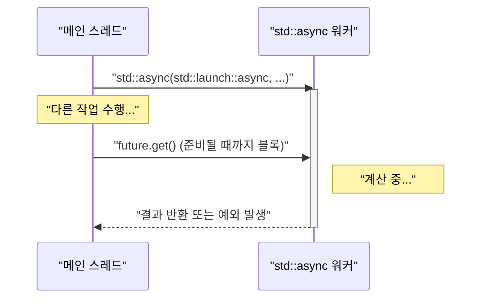
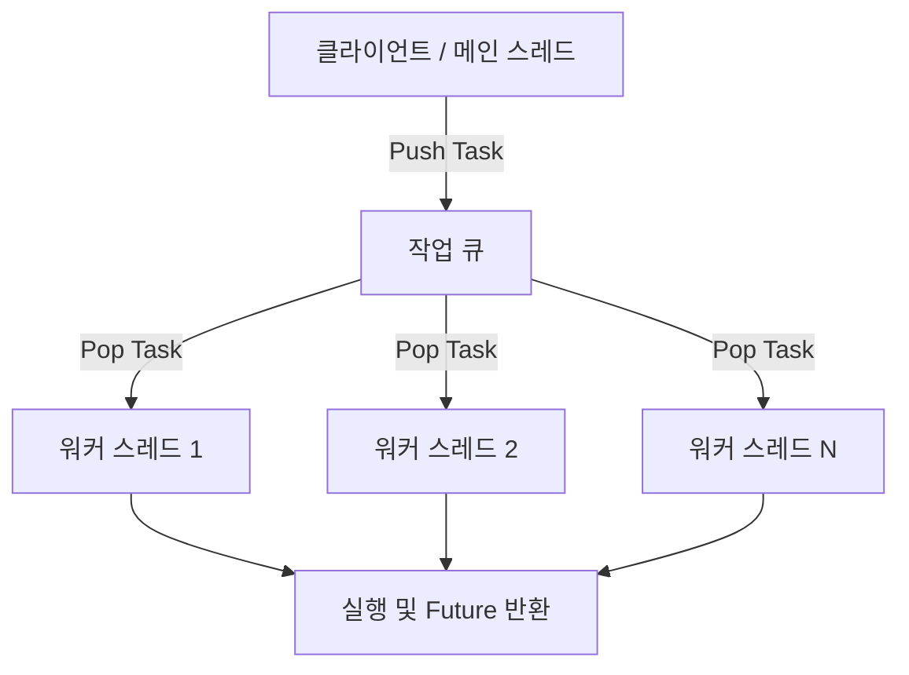

현대의 소프트웨어 개발에 있어 멀티코어 CPU의 성능을 최대한 끌어내기 위해서는 멀티스레드 프로그래밍이 필수적입니다. C++은 C++11부터 표준 라이브러리로 멀티스레드 및 비동기 처리 API(`<thread>`, `<mutex>`, `<condition_variable>`, `<future>`)를 도입하여, 플랫폼 종속적인 코드(POSIX 스레드나 Windows API 등)를 작성하지 않고도 이식성 있고 안전한 병행 처리를 구현할 수 있게 되었습니다. 게다가 C++14, C++17, C++20으로 버전업을 거듭하며 `std::scoped_lock`이나 `std::jthread`와 같은 더 안전하고 고도화된 기능들이 추가되었습니다.

본 기사에서는 C++ 멀티스레드 프로그래밍의 기초부터 데이터 경합을 방지하기 위한 동기화 메커니즘, 그리고 현대적인 비동기 처리(`std::async`)와 스레드 풀의 개념까지 상세한 코드 예제와 함께 철저하게 해설합니다.

---

## 1. 병행 처리의 기초와 암달의 법칙

멀티스레딩을 수행하는 가장 큰 목적은 "성능 향상"이지만, 프로그램 전체를 병렬화할 수 있는 것은 아닙니다. 여기서 중요해지는 것이 **암달의 법칙 (Amdahl's Law)**입니다.

암달의 법칙은 프로그램의 일부를 병렬화·고속화했을 때, 시스템 전체의 성능이 어느 정도 향상될지 예측하는 모델입니다.

$$ S(N) = \frac{1}{(1 - P) + \frac{P}{N}} $$

* $S(N)$ : 이론상 최대 스피드업 비율
* $P$ : 프로그램 전체 중 병렬화 가능한 부분의 비율 (0 ≤ $P$ ≤ 1)
* $N$ : 프로세서(스레드)의 수

이 수식이 보여주는 중요한 사실은, "아무리 프로세서 수 $N$을 늘려도, 병렬화할 수 없는 직렬 부분 $(1 - P)$이 병목 현상을 일으켜 스피드업에 한계가 있다"는 점입니다. 예를 들어 프로그램의 $90\%$가 병렬화 가능($P = 0.9$)하더라도, 나머지 $10\%$가 직렬 처리인 이상 무한대의 프로세서를 사용해도 최대 $10$배($S(\infty) = 1 / 0.1$) 밖에 고속화되지 않습니다.

따라서 C++에서 멀티스레드 프로그래밍을 수행할 때는 단순히 스레드를 늘리는 것만이 아니라, **직렬 처리 부분(락 경합이나 동기화 오버헤드 등)을 최대한 줄이는 설계**가 요구됩니다.

---

## 2. 스레드의 기본: `std::thread`와 `std::jthread` (C++20)

### 기존의 `std::thread` (C++11)

C++11에 도입된 `std::thread`는 함수나 람다식을 새로운 스레드에서 실행하기 위한 가장 기본적인 클래스입니다.

```cpp
#include <iostream>
#include <thread>

void workerFunction(int id) {
    std::cout << "Worker " << id << " is running on thread " 
              << std::this_thread::get_id() << std::endl;
}

int main() {
    std::cout << "Main thread id: " << std::this_thread::get_id() << std::endl;

    // 스레드 생성 및 실행 시작
    std::thread t1(workerFunction, 1);
    
    // 람다식을 이용한 스레드 생성
    std::thread t2([](int id) {
        std::cout << "Lambda Worker " << id << " is running." << std::endl;
    }, 2);

    // 스레드 종료 대기 (join)
    t1.join();
    t2.join();

    std::cout << "All threads completed." << std::endl;
    return 0;
}
```

`std::thread`의 주의점은, **파괴되기 전에 반드시 `join()` 또는 `detach()`를 호출해야 한다**는 점입니다. 만약 둘 다 호출되지 않은 채 `std::thread`의 소멸자가 호출되면, `std::terminate()`가 호출되어 프로그램이 크래시(비정상 종료)됩니다. 예외 안전성을 확보하기 위해서는 RAII 패턴을 사용한 래퍼(wrapper) 클래스를 직접 만들어야 했습니다.

### 현대적인 `std::jthread` (C++20)

C++20에서는 이러한 단점을 해소한 `std::jthread` (joining thread)가 도입되었습니다. `std::jthread`는 소멸자에서 자동으로 `join()`을 호출하므로, 예외 발생 시에도 안전하게 스레드 종료를 대기할 수 있습니다. 또한 `std::stop_token`을 통한 스레드의 협조적인 취소 기능도 갖추고 있습니다.

```cpp
#include <iostream>
#include <thread>
#include <chrono>

int main() {
    // C++20: std::jthread
    // 첫 번째 인자로 std::stop_token을 받아 취소 요청을 감지 가능
    std::jthread jt([](std::stop_token stoken) {
        while (!stoken.stop_requested()) {
            std::cout << "Working..." << std::endl;
            std::this_thread::sleep_for(std::chrono::milliseconds(500));
        }
        std::cout << "Stop requested. Exiting thread." << std::endl;
    });

    std::this_thread::sleep_for(std::chrono::seconds(2));
    
    // 명시적으로 취소 요청
    jt.request_stop(); 
    
    // jthread의 소멸자에서 자동으로 join되므로 수동으로 join()을 호출할 필요가 없음
    return 0;
}
```

---

## 3. 데이터 경합 방지와 동기화: 뮤텍스와 락

여러 스레드가 동시에 동일한 메모리 영역(변수 등)에 접근하고, 최소 하나가 쓰기를 수행할 때 **데이터 경합 (Data Race)**이 발생합니다. C++ 표준에서 데이터 경합은 미정의 동작 (Undefined Behavior)을 유발합니다. 이를 방지하기 위해서는 `std::mutex`를 사용한 배타적 제어가 필요합니다.

### `std::mutex`와 `std::lock_guard`

순수하게 `std::mutex::lock()`과 `unlock()`을 수동으로 호출하는 것은 예외 발생 시 `unlock()`이 호출되지 않아 데드락을 일으킬 위험이 있으므로 권장되지 않습니다. C++에서는 RAII 패턴을 사용한 `std::lock_guard` (C++11)나 `std::scoped_lock` (C++17)을 사용합니다.

```cpp
#include <iostream>
#include <vector>
#include <thread>
#include <mutex>

std::mutex g_mutex;
int g_counter = 0;

void incrementCounter(int iterations) {
    for (int i = 0; i < iterations; ++i) {
        // 스코프를 벗어날 때 자동으로 unlock 됨
        std::lock_guard<std::mutex> lock(g_mutex);
        ++g_counter;
    }
}

int main() {
    std::vector<std::thread> threads;
    for (int i = 0; i < 10; ++i) {
        threads.emplace_back(incrementCounter, 10000);
    }

    for (auto& t : threads) {
        t.join();
    }

    std::cout << "Final counter value: " << g_counter << std::endl;
    // 예상대로 100000이 됨
    return 0;
}
```

### `std::unique_lock`

`std::lock_guard`는 스코프 기반의 단순한 락이지만, 보다 유연한 제어(지연 락, 시간 제한이 있는 락, 도중 언락 등)가 필요할 경우에는 `std::unique_lock`을 사용합니다. 다음에 설명할 `std::condition_variable`에서는 `std::unique_lock`이 필수가 됩니다.

---

## 4. 스레드 간 통신: `std::condition_variable`

어떤 스레드가 특정 조건을 만족할 때까지 대기하고, 다른 스레드가 그 조건을 만족했을 때 알림을 보내는 "생산자-소비자 패턴 (Producer-Consumer Pattern)" 등을 구현하려면 `std::condition_variable`을 사용합니다.

```cpp
#include <iostream>
#include <thread>
#include <mutex>
#include <condition_variable>
#include <queue>

std::mutex g_mtx;
std::condition_variable g_cv;
std::queue<int> g_dataQueue;
bool g_isFinished = false;

void producer() {
    for (int i = 1; i <= 5; ++i) {
        std::this_thread::sleep_for(std::chrono::milliseconds(200));
        {
            std::lock_guard<std::mutex> lock(g_mtx);
            g_dataQueue.push(i);
            std::cout << "Produced: " << i << std::endl;
        }
        g_cv.notify_one(); // 소비자에게 알림
    }
    
    {
        std::lock_guard<std::mutex> lock(g_mtx);
        g_isFinished = true;
    }
    g_cv.notify_one(); // 종료를 알림
}

void consumer() {
    while (true) {
        std::unique_lock<std::mutex> lock(g_mtx);
        // 조건이 만족될 때까지 (큐가 비어있지 않거나 종료 플래그가 켜질 때까지) 대기
        // 거짓 기상(Spurious Wakeup)을 방지하기 위해 람다식으로 조건을 지정
        g_cv.wait(lock, []{ return !g_dataQueue.empty() || g_isFinished; });

        while (!g_dataQueue.empty()) {
            int val = g_dataQueue.front();
            g_dataQueue.pop();
            // 언락하고 무거운 처리(여기서는 출력만)를 수행
            lock.unlock();
            std::cout << "Consumed: " << val << std::endl;
            lock.lock(); // 다시 락을 획득
        }

        if (g_isFinished && g_dataQueue.empty()) {
            break;
        }
    }
}

int main() {
    std::thread t1(producer);
    std::thread t2(consumer);
    t1.join();
    t2.join();
    return 0;
}
```

이 예제에서는 `std::condition_variable::wait`가 조건을 만족할 때까지 스레드를 슬립 상태로 만들어, CPU 리소스의 낭비(바쁜 대기, Busy Loop)를 방지하고 있습니다.

---

## 5. 추상화 수준이 높은 비동기 처리: `std::future`, `std::promise`, `std::async`

지금까지 본 `std::thread`나 `std::mutex`는 강력하지만, OS의 저수준 스레드 메커니즘을 그대로 C++로 가져온 것이라 결과를 얻거나 예외를 전파할 때는 코드가 복잡해지기 쉽습니다. 반환값이 있는 병행 처리나 더 고수준의 비동기 처리를 하고 싶다면 `<future>` 헤더의 기능을 사용합니다.

### `std::promise`와 `std::future`

`std::promise`는 결과를 "설정"하는 쪽, `std::future`는 결과를 "받는" 쪽을 나타냅니다. 이들은 스레드 간에 결과나 예외를 주고받는 안전한 채널로 기능합니다.

### `std::async`를 이용한 태스크 기반 병행 처리

C++에서 비동기 태스크를 실행할 때 가장 권장되는 방법은 `std::async`를 사용하는 것입니다. `std::async`는 태스크를 비동기적으로 실행하고, 그 결과를 가져오기 위한 `std::future`를 반환합니다.

```cpp
#include <iostream>
#include <future>
#include <chrono>

int complexCalculation(int x) {
    std::cout << "Calculation started on thread: " 
              << std::this_thread::get_id() << std::endl;
    std::this_thread::sleep_for(std::chrono::seconds(2));
    if (x < 0) {
        throw std::invalid_argument("x must be positive");
    }
    return x * 42;
}

int main() {
    std::cout << "Main thread id: " << std::this_thread::get_id() << std::endl;

    // std::launch::async를 지정하여 강제로 별도의 스레드에서 실행
    std::future<int> resultFuture = std::async(std::launch::async, complexCalculation, 10);

    std::cout << "Main thread is doing other work..." << std::endl;

    try {
        // get()을 호출하면 계산이 끝날 때까지 현재 스레드를 블록하고 대기함
        int result = resultFuture.get();
        std::cout << "Result: " << result << std::endl;
    } catch (const std::exception& e) {
        std::cerr << "Exception caught: " << e.what() << std::endl;
    }

    return 0;
}
```

`std::async`의 동작을 다음 시퀀스 다이어그램에 나타냅니다.



`std::async`의 첫 번째 인자인 시작 정책 (Launch Policy)에는 다음 2가지가 있습니다.
* `std::launch::async`: 반드시 새로운 스레드를 생성(또는 스레드 풀에서 할당)하여 비동기적으로 실행한다.
* `std::launch::deferred`: 지연 평가. `future.get()`이나 `future.wait()`가 호출된 시점에 호출자 스레드에서 동기적으로 실행한다.

기본값(지정하지 않음)의 경우 구현 의존적이며, 시스템의 부하 상태에 따라 둘 중 하나가 선택됩니다. 확실하게 비동기로 실행하고 싶다면 `std::launch::async`를 명시합니다.

---

## 6. 스레드 풀 (Thread Pool)의 개념

`std::async`를 매번 호출하거나 루프 안에서 `std::thread`를 매번 생성하고 파괴하면, 스레드의 컨텍스트 스위칭이나 OS 리소스 확보에 따른 오버헤드를 무시할 수 없게 됩니다. 특히 많은 양의 작은 태스크 (Fine-grained tasks)를 처리할 때는 스레드 풀 (Thread Pool)의 사용이 필수적입니다.

스레드 풀은 애플리케이션 시작 시 일정 수의 워커 (Worker) 스레드를 미리 생성해 두고, 태스크를 큐 (Queue)에 쌓은 뒤 빈 워커 스레드부터 순차적으로 태스크를 처리해 나가는 아키텍처입니다.



C++ 표준 라이브러리(C++23 기준)에는 표준 스레드 풀 클래스가 존재하지 않지만, `std::thread`, `std::mutex`, `std::condition_variable`, `std::function`, `std::packaged_task`를 조합하면 수십 줄의 코드로 효율적인 스레드 풀을 구현할 수 있습니다. 실제 운용에서는 `Boost.Asio`의 비동기 I/O나 서드파티 라이브러리를 이용하는 것이 일반적입니다.

---

## 7. 성능과 확장성(Scalability)에 대한 고찰

멀티스레드 프로그래밍에서 최고의 성능을 끌어내기 위해서는 코드의 병렬화뿐만 아니라 하드웨어 아키텍처에도 주의를 기울여야 합니다.

* **거짓 공유 (False Sharing):** 
  여러 스레드가 서로 다른 변수를 업데이트하고 있음에도 불구하고 그 변수들이 CPU의 같은 캐시 라인(일반적으로 64바이트)에 배치되어 있으면, 캐시 일관성 유지를 위해 불필요한 메모리 동기화가 발생하여 성능이 극적으로 저하됩니다. 이를 방지하려면 `alignas` 지정자를 사용하여 변수를 캐시 라인 경계에 배치하는 고민이 필요합니다.
* **락 프리 (Lock-Free)와 `std::atomic`:**
  뮤텍스의 락/언락 오버헤드를 피하기 위해 `<atomic>`을 사용한 불가분 연산(Compare-And-Swap 등)이나 락 프리 자료 구조의 도입을 검토할 수 있습니다. 다만, 메모리 오더 (`std::memory_order`)에 대한 정확한 이해가 필요하고 구현 난이도가 매우 높기 때문에, 보통은 신중한 성능 측정 끝에 필요하다고 판단될 때만 도입합니다.

---

## 8. 요약

C++에서의 멀티스레드와 비동기 프로그래밍에 대해 기초부터 최신 C++20 기능까지 해설했습니다. 중요한 포인트는 다음과 같습니다.

1. **기본은 `std::async`를 사용할 것:** 단발성 비동기 태스크나 결과를 반환하는 병행 처리에는 수동으로 스레드를 관리하는 것보다 안전한 `std::async`와 `std::future`를 활용한다.
2. **스레드 관리에는 `std::jthread`:** 장기적으로 백그라운드에서 동작하는 스레드에는 C++20의 `std::jthread`를 사용하여 안전한 종료 처리를 보장한다.
3. **동기화에는 RAII를 활용:** 데이터 경합을 방지하기 위한 뮤텍스 락은 반드시 `std::lock_guard`나 `std::unique_lock`을 통해 수행한다.
4. **오버헤드를 의식할 것:** 스레드의 과도한 생성은 피하고, 필요에 따라 스레드 풀 아키텍처를 도입한다.

병행 처리의 버그(데드락, 데이터 경합)는 재현성이 낮아 디버깅이 가장 어려운 부류에 속합니다. 스레드 안전성을 항상 의식하고, 적절한 표준 라이브러리 도구를 선택하여 모던 C++을 통한 견고하고 빠른 시스템 개발을 실현합시다.
