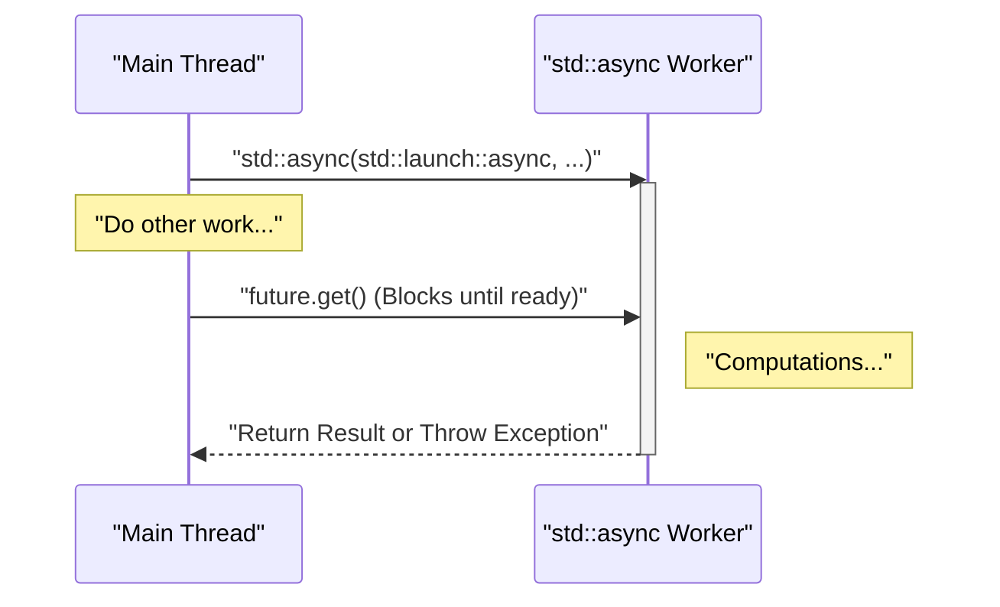
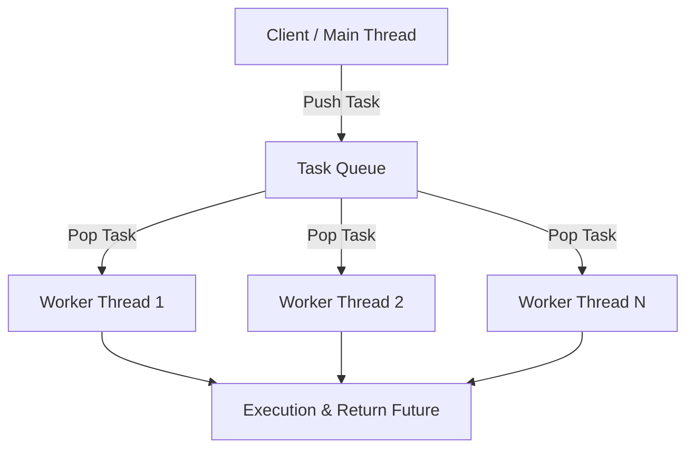

現代のソフトウェア開発において、マルチコアCPUのパフォーマンスを最大限に引き出すためには、マルチスレッドプログラミングが不可欠です。C++はC++11から標準ライブラリとしてマルチスレッドおよび非同期処理のAPI（`<thread>`, `<mutex>`, `<condition_variable>`, `<future>`）を導入し、プラットフォーム依存のコード（POSIXスレッドやWindows APIなど）を書くことなく、ポータブルで安全な並行処理を実装できるようになりました。さらに、C++14、C++17、C++20とバージョンアップを重ねるごとに、`std::scoped_lock` や `std::jthread` といったより安全で高度な機能が追加されています。

本記事では、C++のマルチスレッドプログラミングの基礎から、データ競合を防ぐための同期機構、そして現代的な非同期処理（`std::async`）やスレッドプールの概念までを、詳細なコード例とともに徹底的に解説します。

---

## 1. 並行処理の基礎とアムダールの法則

マルチスレッド化を行う最大の目的は「パフォーマンスの向上」ですが、プログラム全体を並列化できるわけではありません。ここで重要になるのが**アムダールの法則 (Amdahl's Law)** です。

アムダールの法則は、プログラムの一部を並列化・高速化した場合に、システム全体のパフォーマンスがどの程度向上するかを予測するモデルです。

$$ S(N) = \frac{1}{(1 - P) + \frac{P}{N}} $$

* $S(N)$ : 理論上の最大スピードアップ率
* $P$ : プログラム全体の中で、並列化可能な部分の割合 (0 ≤ $P$ ≤ 1)
* $N$ : プロセッサ（スレッド）の数

この数式が示す重要な事実は、「どれだけプロセッサ数 $N$ を増やしても、並列化できない直列部分 $(1 - P)$ がボトルネックとなり、スピードアップには上限がある」ということです。たとえば、プログラムの $90\%$ が並列化可能（$P = 0.9$）であっても、残りの $10\%$ が直列処理である限り、無限のプロセッサを用いても最大で $10$ 倍（$S(\infty) = 1 / 0.1$）しか高速化されません。

したがって、C++でマルチスレッドプログラミングを行う際は、単にスレッドを増やすだけでなく、**直列処理の部分（ロックの競合や同期のオーバーヘッドなど）を極力減らす設計** が求められます。

---

## 2. スレッドの基本：`std::thread` と `std::jthread` (C++20)

### 従来の `std::thread` (C++11)

C++11で導入された `std::thread` は、関数やラムダ式を新しいスレッドで実行するための最も基本的なクラスです。

```cpp
#include <iostream>
#include <thread>

void workerFunction(int id) {
    std::cout << "Worker " << id << " is running on thread " 
              << std::this_thread::get_id() << std::endl;
}

int main() {
    std::cout << "Main thread id: " << std::this_thread::get_id() << std::endl;

    // スレッドの生成と実行開始
    std::thread t1(workerFunction, 1);
    
    // ラムダ式を用いたスレッドの生成
    std::thread t2([](int id) {
        std::cout << "Lambda Worker " << id << " is running." << std::endl;
    }, 2);

    // スレッドの終了を待機（join）
    t1.join();
    t2.join();

    std::cout << "All threads completed." << std::endl;
    return 0;
}
```

`std::thread` の注意点は、**破棄される前に必ず `join()` または `detach()` を呼び出さなければならない** という点です。もしどちらも呼ばれずに `std::thread` のデストラクタが呼ばれると、`std::terminate()` が呼び出され、プログラムがクラッシュします。例外安全性を確保するためには、RAIIパターンを用いたラッパークラスを自作する必要がありました。

### 現代的な `std::jthread` (C++20)

C++20では、これらの欠点を解消した `std::jthread` (joining thread) が導入されました。`std::jthread` は、デストラクタで自動的に `join()` を呼び出すため、例外発生時でも安全にスレッドの終了を待機できます。また、`std::stop_token` を介したスレッドの協調的なキャンセル機能も備えています。

```cpp
#include <iostream>
#include <thread>
#include <chrono>

int main() {
    // C++20: std::jthread
    // 第一引数に std::stop_token を受け取ることでキャンセル要求を検知可能
    std::jthread jt([](std::stop_token stoken) {
        while (!stoken.stop_requested()) {
            std::cout << "Working..." << std::endl;
            std::this_thread::sleep_for(std::chrono::milliseconds(500));
        }
        std::cout << "Stop requested. Exiting thread." << std::endl;
    });

    std::this_thread::sleep_for(std::chrono::seconds(2));
    
    // 明示的にキャンセルを要求
    jt.request_stop(); 
    
    // jthreadのデストラクタで自動的にjoinされるため、手動の join() は不要
    return 0;
}
```

---

## 3. データ競合の回避と同期：ミューテックスとロック

複数のスレッドが同時に同じメモリ領域（変数など）にアクセスし、少なくとも1つが書き込みを行う場合、**データ競合 (Data Race)** が発生します。C++標準において、データ競合は未定義動作 (Undefined Behavior) を引き起こします。これを防ぐためには、`std::mutex` を用いた排他制御が必要です。

### `std::mutex` と `std::lock_guard`

生の `std::mutex::lock()` と `unlock()` を手動で呼び出すのは、例外発生時に `unlock()` が呼ばれずデッドロックを引き起こすリスクがあるため推奨されません。C++ではRAIIパターンを用いた `std::lock_guard` (C++11) や `std::scoped_lock` (C++17) を使用します。

```cpp
#include <iostream>
#include <vector>
#include <thread>
#include <mutex>

std::mutex g_mutex;
int g_counter = 0;

void incrementCounter(int iterations) {
    for (int i = 0; i < iterations; ++i) {
        // スコープを抜けるときに自動で unlock される
        std::lock_guard<std::mutex> lock(g_mutex);
        ++g_counter;
    }
}

int main() {
    std::vector<std::thread> threads;
    for (int i = 0; i < 10; ++i) {
        threads.emplace_back(incrementCounter, 10000);
    }

    for (auto& t : threads) {
        t.join();
    }

    std::cout << "Final counter value: " << g_counter << std::endl;
    // 期待通り 100000 になる
    return 0;
}
```

### `std::unique_lock`

`std::lock_guard` はスコープベースの単純なロックですが、より柔軟な制御（遅延ロック、時間制限付きロック、途中でアンロックなど）が必要な場合は `std::unique_lock` を使用します。次に解説する `std::condition_variable` では `std::unique_lock` が必須となります。

---

## 4. スレッド間の通信：`std::condition_variable`

あるスレッドが特定の条件を満たすまで待機し、別のスレッドがその条件を満たしたときに通知を送るという「生産者・消費者パターン (Producer-Consumer Pattern)」などを実装するには、`std::condition_variable` を用います。

```cpp
#include <iostream>
#include <thread>
#include <mutex>
#include <condition_variable>
#include <queue>

std::mutex g_mtx;
std::condition_variable g_cv;
std::queue<int> g_dataQueue;
bool g_isFinished = false;

void producer() {
    for (int i = 1; i <= 5; ++i) {
        std::this_thread::sleep_for(std::chrono::milliseconds(200));
        {
            std::lock_guard<std::mutex> lock(g_mtx);
            g_dataQueue.push(i);
            std::cout << "Produced: " << i << std::endl;
        }
        g_cv.notify_one(); // コンシューマに通知
    }
    
    {
        std::lock_guard<std::mutex> lock(g_mtx);
        g_isFinished = true;
    }
    g_cv.notify_one(); // 終了を通知
}

void consumer() {
    while (true) {
        std::unique_lock<std::mutex> lock(g_mtx);
        // 条件が満たされる（キューが空でない、または終了フラグが立つ）まで待機
        // 偽起因 (Spurious Wakeup) を防ぐためラムダ式で条件を指定
        g_cv.wait(lock, []{ return !g_dataQueue.empty() || g_isFinished; });

        while (!g_dataQueue.empty()) {
            int val = g_dataQueue.front();
            g_dataQueue.pop();
            // アンロックして重い処理（ここでは出力のみ）を行う
            lock.unlock();
            std::cout << "Consumed: " << val << std::endl;
            lock.lock(); // 再びロックを取得
        }

        if (g_isFinished && g_dataQueue.empty()) {
            break;
        }
    }
}

int main() {
    std::thread t1(producer);
    std::thread t2(consumer);
    t1.join();
    t2.join();
    return 0;
}
```

この例では、`std::condition_variable::wait` が条件を満たすまでスレッドをスリープ状態にし、CPUリソースの無駄な消費（ビジーループ）を防いでいます。

---

## 5. 抽象度の高い非同期処理：`std::future`, `std::promise`, `std::async`

ここまでの `std::thread` や `std::mutex` は強力ですが、OSの低レベルなスレッド機構をそのままC++に持ち込んだものであり、結果の取得や例外の伝播を扱うにはコードが煩雑になりがちです。戻り値を持つ並行処理や、より高レベルな非同期処理を行いたい場合は、`<future>` ヘッダの機能を使用します。

### `std::promise` と `std::future`

`std::promise` は結果を「設定」する側、`std::future` は結果を「受け取る」側を表します。これらはスレッド間で結果や例外を受け渡す安全なチャネルとして機能します。

### `std::async` によるタスクベースの並行処理

C++において非同期タスクを実行する最も推奨される方法は `std::async` を用いることです。`std::async` はタスクを非同期に実行し、その結果を取得するための `std::future` を返します。

```cpp
#include <iostream>
#include <future>
#include <chrono>

int complexCalculation(int x) {
    std::cout << "Calculation started on thread: " 
              << std::this_thread::get_id() << std::endl;
    std::this_thread::sleep_for(std::chrono::seconds(2));
    if (x < 0) {
        throw std::invalid_argument("x must be positive");
    }
    return x * 42;
}

int main() {
    std::cout << "Main thread id: " << std::this_thread::get_id() << std::endl;

    // std::launch::async を指定して強制的に別スレッドで実行
    std::future<int> resultFuture = std::async(std::launch::async, complexCalculation, 10);

    std::cout << "Main thread is doing other work..." << std::endl;

    try {
        // get() を呼ぶと、計算が終わるまで現在のスレッドをブロックして待機する
        int result = resultFuture.get();
        std::cout << "Result: " << result << std::endl;
    } catch (const std::exception& e) {
        std::cerr << "Exception caught: " << e.what() << std::endl;
    }

    return 0;
}
```

`std::async` の振る舞いを以下のシーケンス図に示します。



`std::async` の第一引数である起動ポリシー (Launch Policy) には以下の2種類があります。
* `std::launch::async`: 必ず新しいスレッドを生成（またはスレッドプールから割り当て）して非同期に実行する。
* `std::launch::deferred`: 遅延評価。`future.get()` や `future.wait()` が呼ばれたタイミングで、呼び出し元のスレッドで同期的に実行する。

デフォルト（指定なし）の場合は処理系依存となり、システムの負荷状況に応じてどちらかが選択されます。確実に非同期実行したい場合は `std::launch::async` を明示します。

---

## 6. スレッドプール（Thread Pool）の概念

`std::async` を都度呼び出したり、ループ内で `std::thread` を毎回作成・破棄したりすると、スレッドのコンテキストスイッチやOSリソースの確保によるオーバーヘッドが無視できなくなります。特に、大量の小さなタスク（Fine-grained tasks）を処理する場合、スレッドプール (Thread Pool) の利用が不可欠です。

スレッドプールは、アプリケーションの起動時に一定数のワーカー（Worker）スレッドをあらかじめ生成しておき、タスクをキュー (Queue) に溜めて、空いているワーカースレッドから順次タスクを処理していくアーキテクチャです。



C++の標準ライブラリ（C++23時点）には標準のスレッドプールクラスが存在しませんが、`std::thread`, `std::mutex`, `std::condition_variable`, `std::function`, `std::packaged_task` を組み合わせることで、数十行で効率的なスレッドプールを実装することが可能です。実運用では、`Boost.Asio`の非同期I/Oやサードパーティ製のライブラリを利用するのも一般的です。

---

## 7. パフォーマンスとスケーラビリティへの考察

マルチスレッドプログラミングにおいて最高のパフォーマンスを引き出すためには、コードの並列化だけでなく、ハードウェアのアーキテクチャにも注意を払う必要があります。

* **フォルスシェアリング (False Sharing):** 
  複数のスレッドが別々の変数を更新しているにもかかわらず、それらの変数がCPUの同じキャッシュライン（通常64バイト）に配置されていると、キャッシュコヒーレンシの維持のために無駄なメモリ同期が発生し、パフォーマンスが劇的に低下します。これを防ぐためには、`alignas` 指定子を使って変数をキャッシュラインの境界に配置する工夫が必要です。
* **ロックフリー (Lock-Free) と `std::atomic`:**
  ミューテックスのロック/アンロックのオーバーヘッドを避けるため、`<atomic>` を用いた不可分操作（Compare-And-Swapなど）やロックフリーデータ構造の導入が検討されます。ただし、メモリオーダー (`std::memory_order`) の正しい理解が必要であり、実装難易度が非常に高いため、通常は慎重なパフォーマンス計測の末に必要だと判断された場合にのみ導入します。

---

## 8. まとめ

C++におけるマルチスレッドと非同期プログラミングについて、基礎から最新のC++20の機能まで解説しました。重要なポイントは以下の通りです。

1. **基本は `std::async` を使う:** 単発の非同期タスクや結果を返す並行処理には、手動でスレッドを管理するよりも安全な `std::async` と `std::future` を利用する。
2. **スレッド管理には `std::jthread`:** 長期的にバックグラウンドで動くスレッドには、C++20の `std::jthread` を使い、安全な終了処理を保証する。
3. **同期にはRAIIを活用:** データ競合を防ぐためのミューテックスのロックは、必ず `std::lock_guard` や `std::unique_lock` を介して行う。
4. **オーバーヘッドを意識する:** スレッドの過剰な生成は避け、必要に応じてスレッドプールアーキテクチャを導入する。

並行処理のバグ（デッドロック、データ競合）は再現性が低く、デバッグが最も困難な部類に入ります。スレッドセーフティを常に意識し、適切な標準ライブラリのツールを選択することで、モダンC++による堅牢で高速なシステム開発を実現しましょう。
