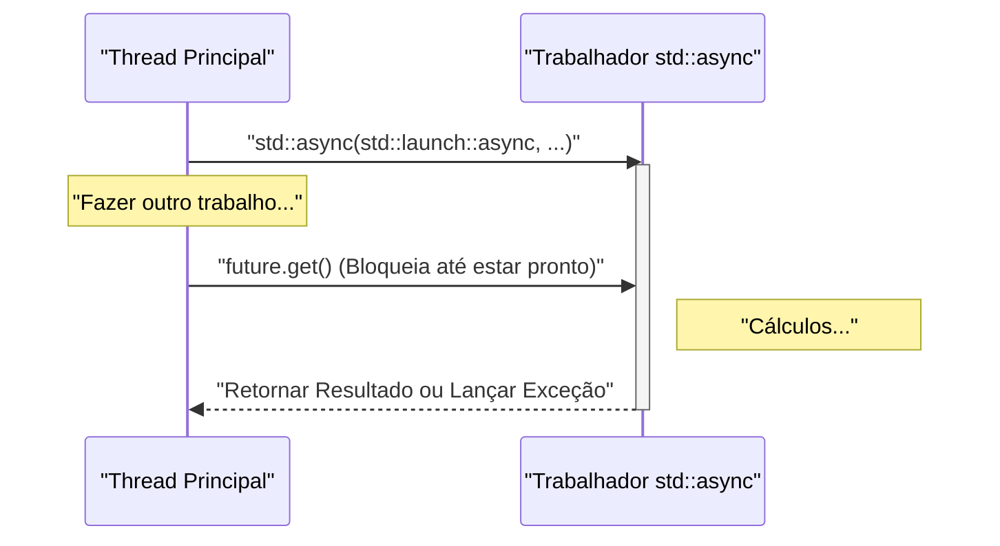
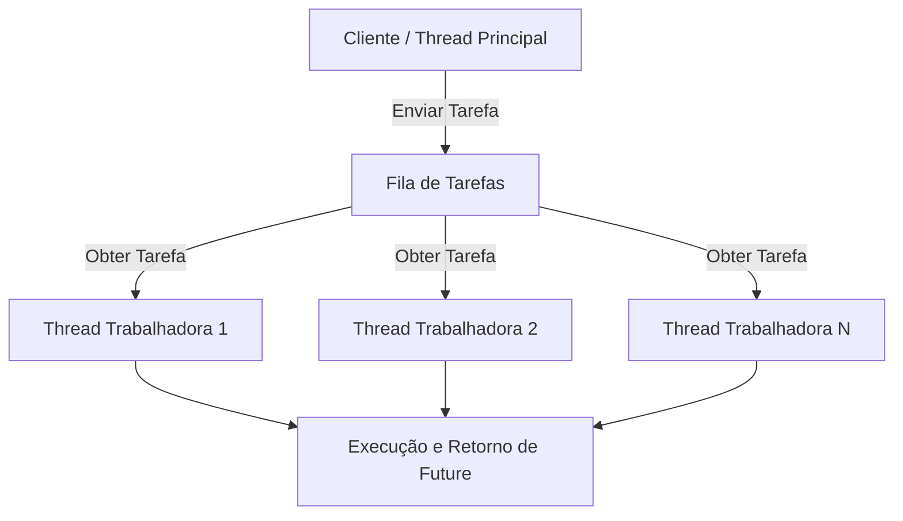

No desenvolvimento de software moderno, a programação multithreading é essencial para extrair o máximo de desempenho das CPUs multinúcleo. O C++ introduziu APIs de multithreading e processamento assíncrono (`<thread>`, `<mutex>`, `<condition_variable>`, `<future>`) como parte de sua biblioteca padrão a partir do C++11. Isso tornou possível implementar processamento concorrente seguro e portável sem a necessidade de escrever códigos dependentes de plataforma (como threads POSIX ou Windows API). Além disso, com cada nova atualização nas versões C++14, C++17 e C++20, foram adicionados recursos mais avançados e seguros, como `std::scoped_lock` e `std::jthread`.

Neste artigo, explicaremos de forma abrangente, com exemplos detalhados de código, desde os fundamentos da programação multithreading em C++ até os mecanismos de sincronização para evitar corridas de dados (data races) e os conceitos de processamento assíncrono moderno (`std::async`) e pools de threads.

---

## 1. Fundamentos de Processamento Concorrente e a Lei de Amdahl

O principal objetivo de adotar multithreading é a "melhoria de desempenho", mas nem todo o programa pode ser paralelizado. Aqui entra a importância da **Lei de Amdahl (Amdahl's Law)**.

A Lei de Amdahl é um modelo que prevê quanto o desempenho de todo o sistema melhorará quando uma parte do programa for paralelizada e acelerada.

$$ S(N) = \frac{1}{(1 - P) + \frac{P}{N}} $$

* $S(N)$ : Taxa teórica máxima de aceleração (speedup)
* $P$ : Proporção da parte paralelizável em relação a todo o programa (0 ≤ $P$ ≤ 1)
* $N$ : Número de processadores (threads)

Um fato importante demonstrado por esta fórmula é que "não importa o quanto se aumente o número de processadores $N$, a parte sequencial não paralelizável $(1 - P)$ se tornará um gargalo, impondo um limite para a aceleração". Por exemplo, mesmo que $90\%$ do programa possa ser paralelizado ($P = 0.9$), desde que os $10\%$ restantes continuem sendo executados de forma sequencial, a aceleração máxima será de apenas $10$ vezes ($S(\infty) = 1 / 0.1$), mesmo utilizando um número infinito de processadores.

Portanto, ao realizar programação multithreading em C++, é necessário não apenas aumentar o número de threads, mas também **projetar para reduzir ao mínimo as partes de processamento sequencial (como contenção de locks e overhead de sincronização)**.

---

## 2. Fundamentos de Threads: `std::thread` e `std::jthread` (C++20)

### O Tradicional `std::thread` (C++11)

O `std::thread`, introduzido no C++11, é a classe mais básica para executar funções e expressões lambda em uma nova thread.

```cpp
#include <iostream>
#include <thread>

void workerFunction(int id) {
    std::cout << "Worker " << id << " is running on thread " 
              << std::this_thread::get_id() << std::endl;
}

int main() {
    std::cout << "Main thread id: " << std::this_thread::get_id() << std::endl;

    // Criação e início de execução da thread
    std::thread t1(workerFunction, 1);
    
    // Criação de thread utilizando expressão lambda
    std::thread t2([](int id) {
        std::cout << "Lambda Worker " << id << " is running." << std::endl;
    }, 2);

    // Aguarda o término das threads (join)
    t1.join();
    t2.join();

    std::cout << "All threads completed." << std::endl;
    return 0;
}
```

Um ponto de atenção com o `std::thread` é que **você deve sempre chamar `join()` ou `detach()` antes que ele seja destruído**. Se o destrutor de `std::thread` for chamado sem que nenhum dos dois tenha sido invocado, `std::terminate()` será chamado e o programa sofrerá falha (crash). Para garantir segurança contra exceções, era necessário criar classes wrapper personalizadas utilizando o padrão RAII.

### O Moderno `std::jthread` (C++20)

No C++20, o `std::jthread` (joining thread) foi introduzido resolvendo essas falhas. O `std::jthread` chama `join()` automaticamente em seu destrutor, de modo que ele pode esperar com segurança o término da thread mesmo quando ocorre uma exceção. Ele também possui uma funcionalidade de cancelamento cooperativo de thread por meio do `std::stop_token`.

```cpp
#include <iostream>
#include <thread>
#include <chrono>

int main() {
    // C++20: std::jthread
    // É possível detectar pedidos de cancelamento recebendo std::stop_token no primeiro argumento
    std::jthread jt([](std::stop_token stoken) {
        while (!stoken.stop_requested()) {
            std::cout << "Working..." << std::endl;
            std::this_thread::sleep_for(std::chrono::milliseconds(500));
        }
        std::cout << "Stop requested. Exiting thread." << std::endl;
    });

    std::this_thread::sleep_for(std::chrono::seconds(2));
    
    // Solicita o cancelamento de forma explícita
    jt.request_stop(); 
    
    // O join() manual não é necessário, pois o destrutor de jthread fará o join automaticamente
    return 0;
}
```

---

## 3. Evitando Corridas de Dados e Sincronização: Mutexes e Locks

Quando várias threads acessam simultaneamente a mesma área de memória (como uma variável) e pelo menos uma delas executa uma gravação, ocorre uma **corrida de dados (Data Race)**. No padrão C++, uma corrida de dados resulta em um comportamento indefinido (Undefined Behavior). Para evitar isso, é necessário um controle de exclusão mútua usando `std::mutex`.

### `std::mutex` e `std::lock_guard`

Chamar `std::mutex::lock()` e `unlock()` de forma manual não é recomendado porque, caso ocorra uma exceção, `unlock()` pode não ser chamado, resultando no risco de um deadlock (impasse). No C++, utilizamos o `std::lock_guard` (C++11) ou `std::scoped_lock` (C++17), que empregam o padrão RAII.

```cpp
#include <iostream>
#include <vector>
#include <thread>
#include <mutex>

std::mutex g_mutex;
int g_counter = 0;

void incrementCounter(int iterations) {
    for (int i = 0; i < iterations; ++i) {
        // Será desbloqueado (unlocked) automaticamente ao sair do escopo
        std::lock_guard<std::mutex> lock(g_mutex);
        ++g_counter;
    }
}

int main() {
    std::vector<std::thread> threads;
    for (int i = 0; i < 10; ++i) {
        threads.emplace_back(incrementCounter, 10000);
    }

    for (auto& t : threads) {
        t.join();
    }

    std::cout << "Final counter value: " << g_counter << std::endl;
    // Será 100000 conforme esperado
    return 0;
}
```

### `std::unique_lock`

O `std::lock_guard` é um lock simples baseado em escopo, mas se você precisar de um controle mais flexível (lock adiado, lock com limite de tempo, unlock no meio da execução, etc.), o `std::unique_lock` deve ser utilizado. O `std::unique_lock` é fundamental quando se usa a `std::condition_variable`, explicada a seguir.

---

## 4. Comunicação entre Threads: `std::condition_variable`

A `std::condition_variable` é utilizada para implementar conceitos como o "Padrão Produtor-Consumidor (Producer-Consumer Pattern)", onde uma thread aguarda até que uma condição específica seja atendida, e outra thread envia uma notificação quando a condição é alcançada.

```cpp
#include <iostream>
#include <thread>
#include <mutex>
#include <condition_variable>
#include <queue>

std::mutex g_mtx;
std::condition_variable g_cv;
std::queue<int> g_dataQueue;
bool g_isFinished = false;

void producer() {
    for (int i = 1; i <= 5; ++i) {
        std::this_thread::sleep_for(std::chrono::milliseconds(200));
        {
            std::lock_guard<std::mutex> lock(g_mtx);
            g_dataQueue.push(i);
            std::cout << "Produced: " << i << std::endl;
        }
        g_cv.notify_one(); // Notifica o consumidor
    }
    
    {
        std::lock_guard<std::mutex> lock(g_mtx);
        g_isFinished = true;
    }
    g_cv.notify_one(); // Notifica o término
}

void consumer() {
    while (true) {
        std::unique_lock<std::mutex> lock(g_mtx);
        // Aguarda até que a condição seja satisfeita (fila não estar vazia ou a flag de término estar ativada)
        // Especificando a condição com uma função lambda para prevenir falsos despertares (Spurious Wakeups)
        g_cv.wait(lock, []{ return !g_dataQueue.empty() || g_isFinished; });

        while (!g_dataQueue.empty()) {
            int val = g_dataQueue.front();
            g_dataQueue.pop();
            // Desbloqueia (unlock) para executar processamento pesado (aqui, apenas uma saída)
            lock.unlock();
            std::cout << "Consumed: " << val << std::endl;
            lock.lock(); // Obtém o lock novamente
        }

        if (g_isFinished && g_dataQueue.empty()) {
            break;
        }
    }
}

int main() {
    std::thread t1(producer);
    std::thread t2(consumer);
    t1.join();
    t2.join();
    return 0;
}
```

Neste exemplo, o `std::condition_variable::wait` coloca a thread para dormir (sleep state) até que as condições sejam alcançadas, prevenindo o consumo desnecessário de recursos da CPU (busy waiting).

---

## 5. Processamento Assíncrono de Alto Nível: `std::future`, `std::promise`, `std::async`

Embora `std::thread` e `std::mutex`, discutidos até agora, sejam poderosos, eles essencialmente trazem os mecanismos de thread de baixo nível do sistema operacional para o C++, o que geralmente resulta em código complexo ao lidar com a obtenção de resultados ou a propagação de exceções. Se você quiser executar processamento concorrente que possua valores de retorno, ou se necessitar de processamento assíncrono de nível mais alto, utilize as funcionalidades do cabeçalho `<future>`.

### `std::promise` e `std::future`

A `std::promise` representa o lado que "define" o resultado, e o `std::future` representa o lado que "recebe" o resultado. Eles atuam como um canal seguro para passar resultados ou exceções entre threads.

### Processamento Concorrente Baseado em Tarefas Usando `std::async`

A forma mais recomendada para executar tarefas assíncronas em C++ é usar `std::async`. O `std::async` executa a tarefa de forma assíncrona e retorna um `std::future` para obtenção do resultado.

```cpp
#include <iostream>
#include <future>
#include <chrono>

int complexCalculation(int x) {
    std::cout << "Calculation started on thread: " 
              << std::this_thread::get_id() << std::endl;
    std::this_thread::sleep_for(std::chrono::seconds(2));
    if (x < 0) {
        throw std::invalid_argument("x must be positive");
    }
    return x * 42;
}

int main() {
    std::cout << "Main thread id: " << std::this_thread::get_id() << std::endl;

    // Especifica std::launch::async para forçar a execução em uma thread diferente
    std::future<int> resultFuture = std::async(std::launch::async, complexCalculation, 10);

    std::cout << "Main thread is doing other work..." << std::endl;

    try {
        // Ao chamar get(), ele bloqueará a thread atual e aguardará até que o cálculo seja concluído
        int result = resultFuture.get();
        std::cout << "Result: " << result << std::endl;
    } catch (const std::exception& e) {
        std::cerr << "Exception caught: " << e.what() << std::endl;
    }

    return 0;
}
```

O diagrama de sequência a seguir mostra o comportamento do `std::async`.



O primeiro argumento de `std::async` é a Política de Lançamento (Launch Policy), que possui os dois tipos a seguir:
* `std::launch::async`: Executa de forma assíncrona, garantindo a criação de uma nova thread (ou sua alocação através de um pool de threads).
* `std::launch::deferred`: Avaliação preguiçosa (lazy evaluation). É executado de forma síncrona na thread chamadora no exato momento em que `future.get()` ou `future.wait()` for invocado.

O padrão (quando não especificado) depende da implementação, e uma das opções será escolhida com base nas condições de carga do sistema. Se você deseja garantir que será executado de forma assíncrona, especifique explicitamente `std::launch::async`.

---

## 6. Conceito de Pool de Threads (Thread Pool)

Chamar `std::async` repetidamente ou criar e destruir um `std::thread` em cada iteração de um loop gera um overhead significativo de troca de contexto de threads (context switch) e alocação de recursos do SO que não pode ser ignorado. A utilização de um pool de threads (Thread Pool) é essencial, principalmente ao lidar com uma grande quantidade de pequenas tarefas (Fine-grained tasks).

O pool de threads é uma arquitetura onde um determinado número de threads trabalhadoras (Workers) são geradas antecipadamente quando o aplicativo é iniciado. As tarefas são acumuladas em uma fila (Queue) e, então, processadas sequencialmente por threads trabalhadoras que estiverem ociosas.



A biblioteca padrão do C++ (até o C++23) não possui uma classe de pool de threads padronizada. Entretanto, combinando `std::thread`, `std::mutex`, `std::condition_variable`, `std::function` e `std::packaged_task`, é possível implementar um pool de threads eficiente em algumas dezenas de linhas de código. Em aplicações reais, também é comum usar E/S assíncrona do `Boost.Asio` e bibliotecas de terceiros.

---

## 7. Considerações sobre Desempenho e Escalabilidade

Para obter o melhor desempenho da programação multithreading, é necessário prestar atenção não só na paralelização do código, mas também na arquitetura do hardware.

* **Falso Compartilhamento (False Sharing):** 
  Mesmo que várias threads estejam atualizando variáveis diferentes, se essas variáveis estiverem localizadas na mesma linha de cache da CPU (geralmente 64 bytes), ocorrerá uma sincronização desnecessária de memória para manter a coerência de cache, resultando numa redução drástica no desempenho. Para prevenir isso, é necessário usar o especificador `alignas` para organizar as variáveis nos limites das linhas de cache.
* **Programação sem Bloqueios (Lock-Free) e `std::atomic`:**
  Para evitar o overhead do lock/unlock de mutexes, pode-se considerar a introdução de estruturas de dados lock-free ou operações indivisíveis (como Compare-And-Swap) utilizando `<atomic>`. No entanto, como isto requer um entendimento correto da ordem de memória (`std::memory_order`) e a dificuldade de implementação é muito alta, isto geralmente é adotado apenas quando considerado indispensável após avaliações de desempenho rigorosas.

---

## 8. Conclusão

Nós abordamos sobre a programação multithreading e assíncrona em C++, desde os fundamentos até os mais recentes recursos do C++20. Os pontos cruciais são os seguintes:

1. **Basicamente, use `std::async`:** Para tarefas assíncronas isoladas ou processamento concorrente que retorna resultados, utilize `std::async` e `std::future`, pois eles são mais seguros do que gerenciar threads manualmente.
2. **Utilize `std::jthread` para gerenciar threads:** Para threads que serão executadas a longo prazo em background, utilize o `std::jthread` do C++20 para garantir um processo seguro de finalização.
3. **Use RAII para sincronização:** O bloqueio (lock) de um mutex para evitar corridas de dados (data races) deve ser invariavelmente realizado por intermédio de `std::lock_guard` ou `std::unique_lock`.
4. **Tenha em mente o overhead:** Evite a criação excessiva de threads e implante uma arquitetura de pool de threads, se for necessário.

Bugs em processos concorrentes (como deadlocks e data races) possuem baixa reprodutibilidade e estão entre os mais difíceis de depurar. Tenha a segurança das threads (thread-safety) sempre em mente e realize o desenvolvimento de sistemas robustos e velozes usando o C++ moderno ao optar pelas ferramentas apropriadas na biblioteca padrão.
