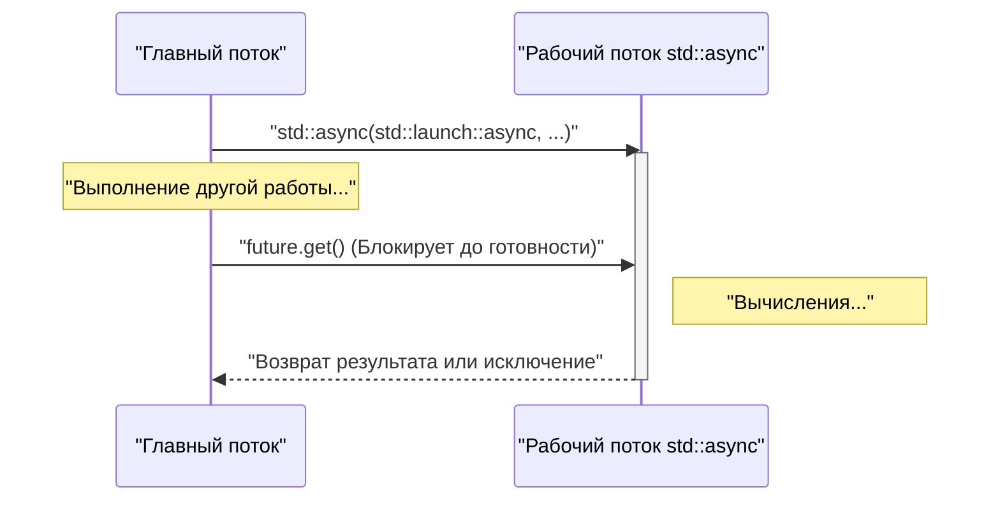
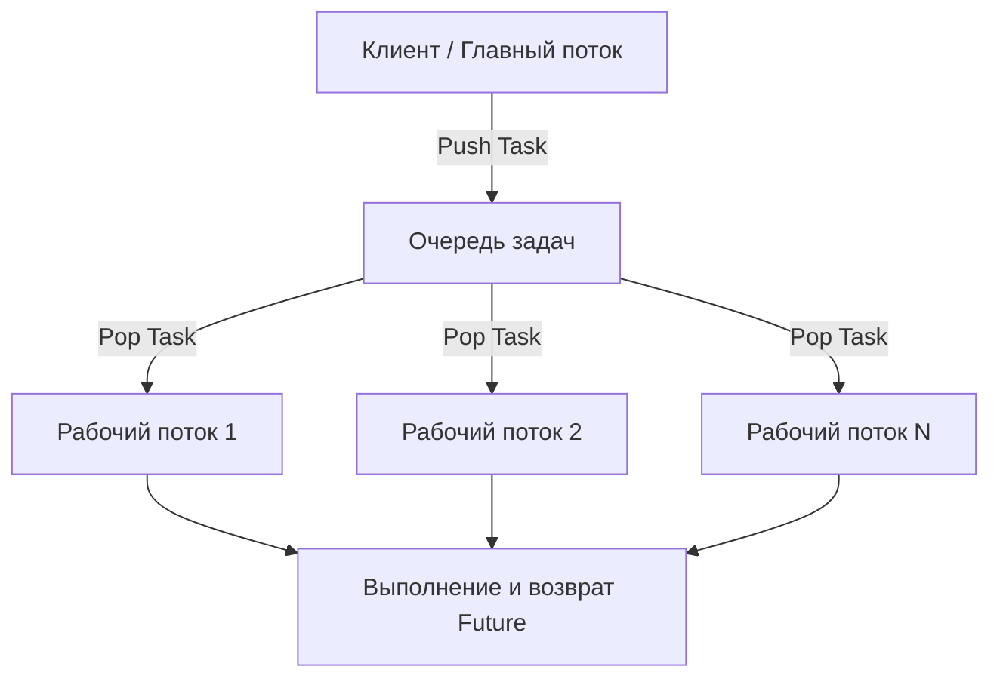

В современной разработке программного обеспечения многопоточное программирование необходимо для максимального использования производительности многоядерных процессоров. Начиная со стандарта C++11, C++ ввел API для многопоточности и асинхронной обработки (`<thread>`, `<mutex>`, `<condition_variable>`, `<future>`) в стандартную библиотеку, что позволяет реализовывать переносимую и безопасную параллельную обработку без написания платформозависимого кода (например, POSIX-потоков или Windows API). Более того, с каждой новой версией (C++14, C++17, C++20) добавлялись более безопасные и продвинутые функции, такие как `std::scoped_lock` и `std::jthread`.

В этой статье мы подробно рассмотрим основы многопоточного программирования на C++, механизмы синхронизации для предотвращения состояний гонки (data race), а также концепции современной асинхронной обработки (`std::async`) и пула потоков с детальными примерами кода.

---

## 1. Основы параллельной обработки и закон Амдала

Главная цель многопоточности — это «повышение производительности», однако распараллелить программу целиком невозможно. Здесь важным становится **закон Амдала (Amdahl's Law)**.

Закон Амдала — это модель для прогнозирования того, насколько повысится общая производительность системы, если часть программы будет распараллелена и ускорена.

$$ S(N) = \frac{1}{(1 - P) + \frac{P}{N}} $$

* $S(N)$ : теоретический максимальный коэффициент ускорения
* $P$ : доля программы, поддающаяся распараллеливанию (0 ≤ $P$ ≤ 1)
* $N$ : количество процессоров (потоков)

Важный факт, который показывает эта формула, заключается в следующем: «сколь бы сильно мы ни увеличивали количество процессоров $N$, последовательная часть $(1 - P)$, которую нельзя распараллелить, становится узким местом, и у ускорения есть предел». Например, даже если $90\%$ программы можно распараллелить ($P = 0.9$), пока оставшиеся $10\%$ обрабатываются последовательно, даже при использовании бесконечного числа процессоров максимальное ускорение составит всего $10$ раз ($S(\infty) = 1 / 0.1$).

Следовательно, при написании многопоточного кода на C++ требуется не просто увеличивать количество потоков, а создавать **архитектуру, которая максимально уменьшает долю последовательной обработки (например, конкуренцию за блокировки и накладные расходы на синхронизацию)**.

---

## 2. Основы потоков: `std::thread` и `std::jthread` (C++20)

### Традиционный `std::thread` (C++11)

Класс `std::thread`, представленный в C++11, является самым базовым классом для выполнения функций или лямбда-выражений в новом потоке.

```cpp
#include <iostream>
#include <thread>

void workerFunction(int id) {
    std::cout << "Worker " << id << " is running on thread " 
              << std::this_thread::get_id() << std::endl;
}

int main() {
    std::cout << "Main thread id: " << std::this_thread::get_id() << std::endl;

    // スレッドの生成と実行開始
    std::thread t1(workerFunction, 1);
    
    // ラムダ式を用いたスレッドの生成
    std::thread t2([](int id) {
        std::cout << "Lambda Worker " << id << " is running." << std::endl;
    }, 2);

    // スレッドの終了を待機（join）
    t1.join();
    t2.join();

    std::cout << "All threads completed." << std::endl;
    return 0;
}
```

Важное замечание при использовании `std::thread` заключается в том, что **перед уничтожением объекта необходимо обязательно вызвать `join()` или `detach()`**. Если ни один из этих методов не будет вызван до срабатывания деструктора `std::thread`, будет вызвана функция `std::terminate()`, что приведет к сбою программы. Для обеспечения безопасности при исключениях (exception safety) приходилось создавать собственные классы-обертки с использованием паттерна RAII.

### Современный `std::jthread` (C++20)

В C++20 для устранения этих недостатков был введен `std::jthread` (joining thread). Поскольку `std::jthread` автоматически вызывает `join()` в своем деструкторе, он позволяет безопасно дожидаться завершения потока даже в случае возникновения исключений. Кроме того, он имеет функцию кооперативной отмены потока с помощью `std::stop_token`.

```cpp
#include <iostream>
#include <thread>
#include <chrono>

int main() {
    // C++20: std::jthread
    // 第一引数に std::stop_token を受け取ることでキャンセル要求を検知可能
    std::jthread jt([](std::stop_token stoken) {
        while (!stoken.stop_requested()) {
            std::cout << "Working..." << std::endl;
            std::this_thread::sleep_for(std::chrono::milliseconds(500));
        }
        std::cout << "Stop requested. Exiting thread." << std::endl;
    });

    std::this_thread::sleep_for(std::chrono::seconds(2));
    
    // 明示的にキャンセルを要求
    jt.request_stop(); 
    
    // jthreadのデストラクタで自動的にjoinされるため、手動の join() は不要
    return 0;
}
```

---

## 3. Предотвращение состояний гонки и синхронизация: мьютексы и блокировки

Когда несколько потоков одновременно обращаются к одной и той же области памяти (например, к переменной) и хотя бы один из них выполняет запись, возникает **состояние гонки (Data Race)**. В стандарте C++ состояние гонки приводит к неопределенному поведению (Undefined Behavior). Для предотвращения этого необходимо использовать взаимное исключение с помощью `std::mutex`.

### `std::mutex` и `std::lock_guard`

Вызывать напрямую методы `std::mutex::lock()` и `unlock()` вручную не рекомендуется из-за риска того, что при возникновении исключения метод `unlock()` не будет вызван, что приведет к взаимной блокировке (deadlock). В C++ для этого используют `std::lock_guard` (C++11) или `std::scoped_lock` (C++17), которые реализуют паттерн RAII.

```cpp
#include <iostream>
#include <vector>
#include <thread>
#include <mutex>

std::mutex g_mutex;
int g_counter = 0;

void incrementCounter(int iterations) {
    for (int i = 0; i < iterations; ++i) {
        // スコープを抜けるときに自動で unlock される
        std::lock_guard<std::mutex> lock(g_mutex);
        ++g_counter;
    }
}

int main() {
    std::vector<std::thread> threads;
    for (int i = 0; i < 10; ++i) {
        threads.emplace_back(incrementCounter, 10000);
    }

    for (auto& t : threads) {
        t.join();
    }

    std::cout << "Final counter value: " << g_counter << std::endl;
    // 期待通り 100000 になる
    return 0;
}
```

### `std::unique_lock`

В то время как `std::lock_guard` представляет собой простую блокировку на основе области видимости, `std::unique_lock` используется, когда требуется более гибкое управление (отложенная блокировка, блокировка с ограничением по времени, ранняя разблокировка и т. д.). Для `std::condition_variable`, который мы рассмотрим далее, использование `std::unique_lock` является обязательным.

---

## 4. Взаимодействие между потоками: `std::condition_variable`

Для реализации таких паттернов, как «Паттерн Производитель-Потребитель (Producer-Consumer Pattern)», где один поток ждет выполнения определенного условия, а другой отправляет уведомление, когда это условие выполняется, применяется `std::condition_variable`.

```cpp
#include <iostream>
#include <thread>
#include <mutex>
#include <condition_variable>
#include <queue>

std::mutex g_mtx;
std::condition_variable g_cv;
std::queue<int> g_dataQueue;
bool g_isFinished = false;

void producer() {
    for (int i = 1; i <= 5; ++i) {
        std::this_thread::sleep_for(std::chrono::milliseconds(200));
        {
            std::lock_guard<std::mutex> lock(g_mtx);
            g_dataQueue.push(i);
            std::cout << "Produced: " << i << std::endl;
        }
        g_cv.notify_one(); // コンシューマに通知
    }
    
    {
        std::lock_guard<std::mutex> lock(g_mtx);
        g_isFinished = true;
    }
    g_cv.notify_one(); // 終了を通知
}

void consumer() {
    while (true) {
        std::unique_lock<std::mutex> lock(g_mtx);
        // 条件が満たされる（キューが空でない、または終了フラグが立つ）まで待機
        // 偽起因 (Spurious Wakeup) を防ぐためラムダ式で条件を指定
        g_cv.wait(lock, []{ return !g_dataQueue.empty() || g_isFinished; });

        while (!g_dataQueue.empty()) {
            int val = g_dataQueue.front();
            g_dataQueue.pop();
            // アンロックして重い処理（ここでは出力のみ）を行う
            lock.unlock();
            std::cout << "Consumed: " << val << std::endl;
            lock.lock(); // 再びロックを取得
        }

        if (g_isFinished && g_dataQueue.empty()) {
            break;
        }
    }
}

int main() {
    std::thread t1(producer);
    std::thread t2(consumer);
    t1.join();
    t2.join();
    return 0;
}
```

В этом примере `std::condition_variable::wait` переводит поток в спящий режим до выполнения условия, предотвращая тем самым излишнее потребление ресурсов CPU (активное ожидание, busy loop).

---

## 5. Высокоуровневая асинхронная обработка: `std::future`, `std::promise`, `std::async`

Рассмотренные до сих пор `std::thread` и `std::mutex` мощные, однако они представляют собой низкоуровневые механизмы потоков ОС, перенесенные в C++, и код может стать громоздким при работе с получением результатов или передачей исключений. Если вам требуется параллельная обработка, возвращающая значение, или более высокоуровневая асинхронная обработка, следует использовать функции из заголовка `<future>`.

### `std::promise` и `std::future`

`std::promise` представляет сторону, которая «устанавливает» результат, а `std::future` — сторону, которая его «получает». Они функционируют как безопасный канал передачи результатов и исключений между потоками.

### Параллельная обработка на основе задач с помощью `std::async`

Наиболее рекомендуемый способ выполнения асинхронных задач в C++ — это использование `std::async`. `std::async` выполняет задачу асинхронно и возвращает объект `std::future`, используемый для получения результата.

```cpp
#include <iostream>
#include <future>
#include <chrono>

int complexCalculation(int x) {
    std::cout << "Calculation started on thread: " 
              << std::this_thread::get_id() << std::endl;
    std::this_thread::sleep_for(std::chrono::seconds(2));
    if (x < 0) {
        throw std::invalid_argument("x must be positive");
    }
    return x * 42;
}

int main() {
    std::cout << "Main thread id: " << std::this_thread::get_id() << std::endl;

    // std::launch::async を指定して強制的に別スレッドで実行
    std::future<int> resultFuture = std::async(std::launch::async, complexCalculation, 10);

    std::cout << "Main thread is doing other work..." << std::endl;

    try {
        // get() を呼ぶと、計算が終わるまで現在のスレッドをブロックして待機する
        int result = resultFuture.get();
        std::cout << "Result: " << result << std::endl;
    } catch (const std::exception& e) {
        std::cerr << "Exception caught: " << e.what() << std::endl;
    }

    return 0;
}
```

Поведение `std::async` проиллюстрировано на следующей диаграмме последовательности.



Политика запуска (Launch Policy), передаваемая в качестве первого аргумента в `std::async`, имеет два вида:
* `std::launch::async`: Обязательно создает новый поток (или выделяет из пула потоков) и выполняет задачу асинхронно.
* `std::launch::deferred`: Ленивые вычисления. Задача выполняется синхронно в вызывающем потоке в момент вызова `future.get()` или `future.wait()`.

По умолчанию (если не указано) выбор зависит от реализации и может зависеть от текущей нагрузки на систему. Если вы хотите гарантированно выполнить задачу асинхронно, необходимо явно указать `std::launch::async`.

---

## 6. Концепция пула потоков (Thread Pool)

Если вызывать `std::async` каждый раз или постоянно создавать и уничтожать `std::thread` внутри цикла, накладные расходы на переключение контекста потоков и выделение ресурсов ОС станут значительными. Особенно при обработке большого количества мелких задач (Fine-grained tasks) использование пула потоков (Thread Pool) становится необходимым.

Пул потоков — это архитектура, при которой заданное количество рабочих потоков (Worker threads) создается заранее при запуске приложения, задачи помещаются в очередь (Queue) и последовательно обрабатываются свободными рабочими потоками.



В стандартной библиотеке C++ (на момент C++23) отсутствует стандартный класс пула потоков, однако, комбинируя `std::thread`, `std::mutex`, `std::condition_variable`, `std::function` и `std::packaged_task`, можно реализовать эффективный пул потоков всего в несколько десятков строк кода. В реальных проектах также распространено использование асинхронного ввода-вывода из `Boost.Asio` или сторонних библиотек.

---

## 7. Размышления о производительности и масштабируемости

Чтобы добиться максимальной производительности в многопоточном программировании, необходимо уделять внимание не только распараллеливанию кода, но и архитектуре оборудования.

* **Ложное разделение (False Sharing):**
  Если несколько потоков обновляют разные переменные, но эти переменные расположены в одной и той же строке кэша процессора (обычно 64 байта), возникает лишняя синхронизация памяти для поддержания когерентности кэша, что резко снижает производительность. Чтобы этого избежать, необходимо использовать спецификатор `alignas` для выравнивания переменных по границам строк кэша.
* **Неблокирующие алгоритмы (Lock-Free) и `std::atomic`:**
  Чтобы избежать накладных расходов на блокировку и разблокировку мьютексов, можно рассмотреть использование атомарных операций (таких как Compare-And-Swap) с помощью `<atomic>` и неблокирующих структур данных. Однако это требует правильного понимания порядка памяти (`std::memory_order`) и отличается высокой сложностью реализации, поэтому обычно внедряется только после тщательного измерения производительности и подтверждения необходимости.

---

## 8. Заключение

Мы рассмотрели многопоточное и асинхронное программирование на C++ от самых основ до новейших возможностей C++20. Основные моменты:

1. **По умолчанию используйте `std::async`:** Для разовых асинхронных задач или параллельных вычислений, возвращающих результат, используйте безопасные `std::async` и `std::future` вместо ручного управления потоками.
2. **Используйте `std::jthread` для управления потоками:** Для потоков, долго работающих в фоновом режиме, применяйте `std::jthread` из C++20, чтобы гарантировать безопасное завершение.
3. **Используйте RAII для синхронизации:** Блокировка мьютексов для предотвращения состояния гонки всегда должна выполняться через `std::lock_guard` или `std::unique_lock`.
4. **Учитывайте накладные расходы:** Избегайте чрезмерного создания потоков и при необходимости внедряйте архитектуру пула потоков.

Ошибки параллельного программирования (взаимные блокировки, состояния гонки) имеют низкую воспроизводимость и относятся к категории трудно поддающихся отладке. Постоянно помните о потокобезопасности и выбирайте подходящие инструменты из стандартной библиотеки для создания надежных и быстрых систем с использованием современного C++.
