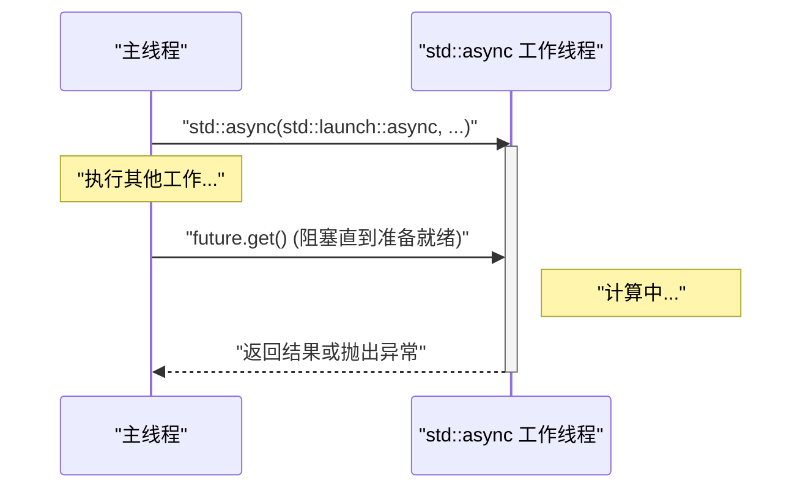
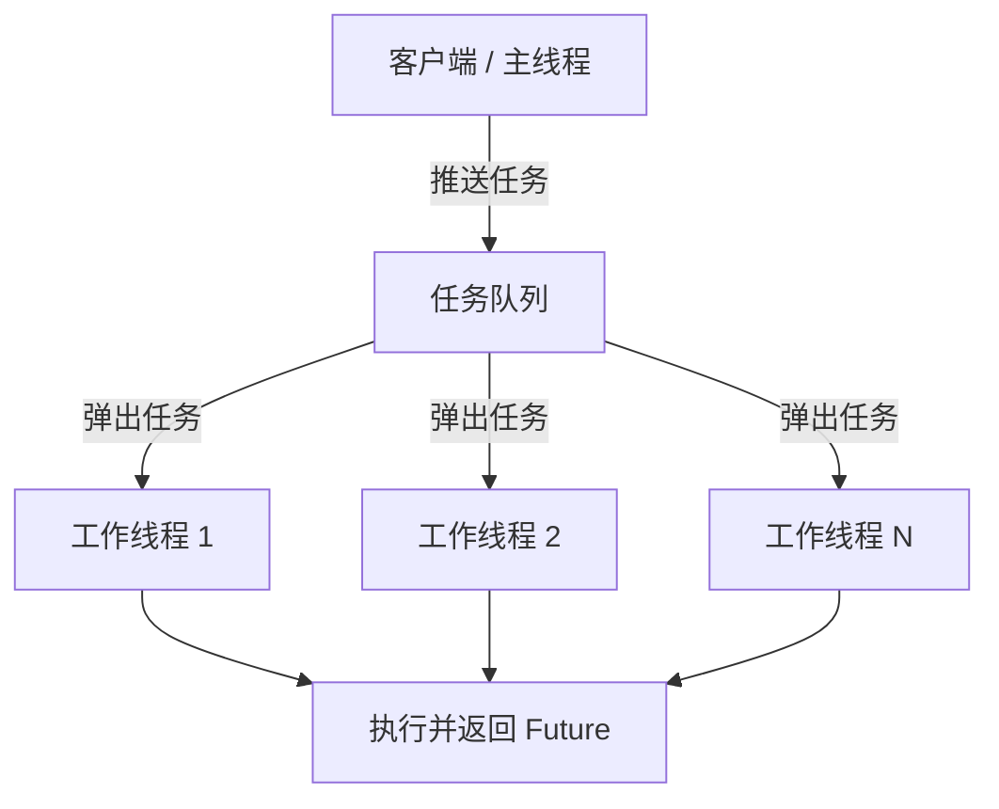

在现代软件开发中，为了最大限度地发挥多核CPU的性能，多线程编程是不可或缺的。C++从C++11开始引入了多线程和异步处理的API（`<thread>`, `<mutex>`, `<condition_variable>`, `<future>`）作为标准库，使得开发者无需编写依赖于平台的代码（如POSIX线程或Windows API），即可实现可移植且安全的并发处理。此外，随着C++14、C++17和C++20的不断版本升级，还添加了如 `std::scoped_lock` 和 `std::jthread` 等更安全、更高级的功能。

本文将从C++多线程编程的基础开始，到防止数据竞争的同步机制，再到现代的异步处理（`std::async`）以及线程池的概念，结合详细的代码示例进行全面彻底的讲解。

---

## 1. 并发处理的基础与阿姆达尔定律

多线程化的最大目的是“提升性能”，但这并不意味着可以将整个程序都并行化。这里非常重要的一点就是**阿姆达尔定律 (Amdahl's Law)**。

阿姆达尔定律是一个预测模型，用于预测在将程序的一部分进行并行化和加速后，整个系统的性能能提升多少。

$$ S(N) = \frac{1}{(1 - P) + \frac{P}{N}} $$

* $S(N)$ : 理论上的最大加速比
* $P$ : 整个程序中可以被并行化的部分所占的比例 (0 ≤ $P$ ≤ 1)
* $N$ : 处理器（线程）的数量

这个公式揭示了一个重要的事实：“无论增加多少个处理器 $N$，无法并行化的串行部分 $(1 - P)$ 终将成为瓶颈，加速比是存在上限的”。例如，即使程序中有 $90\%$ 可以并行化（$P = 0.9$），只要剩下的 $10\%$ 是串行处理的，那么即使使用无数个处理器，最多也只能加速 $10$ 倍（$S(\infty) = 1 / 0.1$）。

因此，在使用C++进行多线程编程时，不仅需要增加线程，还需要一种**尽量减少串行处理部分（如锁竞争和同步开销等）的设计**。

---

## 2. 线程的基础：`std::thread` 与 `std::jthread` (C++20)

### 传统的 `std::thread` (C++11)

C++11引入的 `std::thread` 是最基本的类，用于在新线程中执行函数或Lambda表达式。

```cpp
#include <iostream>
#include <thread>

void workerFunction(int id) {
    std::cout << "Worker " << id << " is running on thread " 
              << std::this_thread::get_id() << std::endl;
}

int main() {
    std::cout << "Main thread id: " << std::this_thread::get_id() << std::endl;

    // 创建并开始执行线程
    std::thread t1(workerFunction, 1);
    
    // 使用Lambda表达式创建线程
    std::thread t2([](int id) {
        std::cout << "Lambda Worker " << id << " is running." << std::endl;
    }, 2);

    // 等待线程结束（join）
    t1.join();
    t2.join();

    std::cout << "All threads completed." << std::endl;
    return 0;
}
```

`std::thread` 需要注意的是：**在被销毁之前，必须调用 `join()` 或 `detach()`**。如果两者都没有被调用，而触发了 `std::thread` 的析构函数，则会调用 `std::terminate()` 导致程序崩溃。为了确保异常安全性，我们以前需要自己编写使用了RAII模式的包装类。

### 现代的 `std::jthread` (C++20)

在C++20中，引入了解决这些缺点的 `std::jthread` (joining thread)。`std::jthread` 会在析构函数中自动调用 `join()`，因此即使发生异常，也能安全地等待线程结束。此外，它还具备通过 `std::stop_token` 协作取消线程的功能。

```cpp
#include <iostream>
#include <thread>
#include <chrono>

int main() {
    // C++20: std::jthread
    // 通过将 std::stop_token 作为第一个参数接收，可以检测到取消请求
    std::jthread jt([](std::stop_token stoken) {
        while (!stoken.stop_requested()) {
            std::cout << "Working..." << std::endl;
            std::this_thread::sleep_for(std::chrono::milliseconds(500));
        }
        std::cout << "Stop requested. Exiting thread." << std::endl;
    });

    std::this_thread::sleep_for(std::chrono::seconds(2));
    
    // 明确发出取消请求
    jt.request_stop(); 
    
    // 由于 jthread 的析构函数会自动 join，因此不需要手动调用 join()
    return 0;
}
```

---

## 3. 避免数据竞争与同步：互斥锁与锁定

当多个线程同时访问同一个内存区域（如变量），并且至少有一个线程进行写入操作时，就会发生**数据竞争 (Data Race)**。在C++标准中，数据竞争会导致未定义行为 (Undefined Behavior)。为了防止这种情况，必须使用 `std::mutex` 进行互斥控制。

### `std::mutex` 与 `std::lock_guard`

不建议手动调用原生的 `std::mutex::lock()` 和 `unlock()`，因为在发生异常时可能无法调用 `unlock()`，从而带来死锁的风险。在C++中，我们使用基于RAII模式的 `std::lock_guard` (C++11) 或 `std::scoped_lock` (C++17)。

```cpp
#include <iostream>
#include <vector>
#include <thread>
#include <mutex>

std::mutex g_mutex;
int g_counter = 0;

void incrementCounter(int iterations) {
    for (int i = 0; i < iterations; ++i) {
        // 在离开作用域时会自动 unlock
        std::lock_guard<std::mutex> lock(g_mutex);
        ++g_counter;
    }
}

int main() {
    std::vector<std::thread> threads;
    for (int i = 0; i < 10; ++i) {
        threads.emplace_back(incrementCounter, 10000);
    }

    for (auto& t : threads) {
        t.join();
    }

    std::cout << "Final counter value: " << g_counter << std::endl;
    // 结果会如期达到 100000
    return 0;
}
```

### `std::unique_lock`

`std::lock_guard` 是简单的基于作用域的锁，但如果需要更灵活的控制（如延迟锁定、带时间限制的锁定、中途解锁等），则应使用 `std::unique_lock`。在接下来要讲解的 `std::condition_variable` 中，`std::unique_lock` 是必不可少的。

---

## 4. 线程间通信：`std::condition_variable`

如果需要实现“生产者-消费者模式 (Producer-Consumer Pattern)”等机制，即一个线程等待某个特定条件满足，而另一个线程在条件满足时发送通知，就可以使用 `std::condition_variable`。

```cpp
#include <iostream>
#include <thread>
#include <mutex>
#include <condition_variable>
#include <queue>

std::mutex g_mtx;
std::condition_variable g_cv;
std::queue<int> g_dataQueue;
bool g_isFinished = false;

void producer() {
    for (int i = 1; i <= 5; ++i) {
        std::this_thread::sleep_for(std::chrono::milliseconds(200));
        {
            std::lock_guard<std::mutex> lock(g_mtx);
            g_dataQueue.push(i);
            std::cout << "Produced: " << i << std::endl;
        }
        g_cv.notify_one(); // 通知消费者
    }
    
    {
        std::lock_guard<std::mutex> lock(g_mtx);
        g_isFinished = true;
    }
    g_cv.notify_one(); // 通知结束
}

void consumer() {
    while (true) {
        std::unique_lock<std::mutex> lock(g_mtx);
        // 等待条件满足（队列非空，或已设置结束标志）
        // 为防止虚假唤醒 (Spurious Wakeup)，使用 Lambda 表达式指定条件
        g_cv.wait(lock, []{ return !g_dataQueue.empty() || g_isFinished; });

        while (!g_dataQueue.empty()) {
            int val = g_dataQueue.front();
            g_dataQueue.pop();
            // 解锁以执行耗时操作（这里仅作为输出）
            lock.unlock();
            std::cout << "Consumed: " << val << std::endl;
            lock.lock(); // 再次获取锁
        }

        if (g_isFinished && g_dataQueue.empty()) {
            break;
        }
    }
}

int main() {
    std::thread t1(producer);
    std::thread t2(consumer);
    t1.join();
    t2.join();
    return 0;
}
```

在这个例子中，`std::condition_variable::wait` 会让线程进入休眠状态直到条件满足，从而避免了CPU资源的无效消耗（忙等待）。

---

## 5. 高度抽象的异步处理：`std::future`, `std::promise`, `std::async`

到目前为止介绍的 `std::thread` 和 `std::mutex` 虽然功能强大，但它们实际上只是将OS的底层线程机制直接搬到了C++中。在处理获取结果或传播异常时，代码往往会变得十分繁琐。如果想要实现带有返回值的并发处理，或者更高级别的异步处理，可以使用 `<future>` 头文件中的功能。

### `std::promise` 与 `std::future`

`std::promise` 代表“设置”结果的一方，而 `std::future` 代表“接收”结果的一方。它们在线程之间充当传递结果或异常的安全通道。

### 使用 `std::async` 进行基于任务的并发处理

在C++中，执行异步任务最推荐的方法是使用 `std::async`。`std::async` 会异步执行任务，并返回一个用于获取该结果的 `std::future`。

```cpp
#include <iostream>
#include <future>
#include <chrono>

int complexCalculation(int x) {
    std::cout << "Calculation started on thread: " 
              << std::this_thread::get_id() << std::endl;
    std::this_thread::sleep_for(std::chrono::seconds(2));
    if (x < 0) {
        throw std::invalid_argument("x must be positive");
    }
    return x * 42;
}

int main() {
    std::cout << "Main thread id: " << std::this_thread::get_id() << std::endl;

    // 指定 std::launch::async 强制在另一个线程中执行
    std::future<int> resultFuture = std::async(std::launch::async, complexCalculation, 10);

    std::cout << "Main thread is doing other work..." << std::endl;

    try {
        // 调用 get() 时，会阻塞当前线程直到计算完成
        int result = resultFuture.get();
        std::cout << "Result: " << result << std::endl;
    } catch (const std::exception& e) {
        std::cerr << "Exception caught: " << e.what() << std::endl;
    }

    return 0;
}
```

`std::async` 的行为可以通过以下时序图来表示。



`std::async` 的第一个参数是启动策略 (Launch Policy)，有两种类型：
* `std::launch::async`: 强制创建新线程（或从线程池中分配）并异步执行。
* `std::launch::deferred`: 延迟求值。在调用 `future.get()` 或 `future.wait()` 时，在调用方线程中同步执行。

如果是默认情况（未指定），则由具体实现决定，系统会根据负载情况选择其中之一。如果想要确保异步执行，请明确指定 `std::launch::async`。

---

## 6. 线程池（Thread Pool）的概念

如果每次都调用 `std::async`，或在循环中每次都创建和销毁 `std::thread`，那么线程的上下文切换和OS资源分配带来的开销将变得不可忽视。特别是在处理大量小任务（Fine-grained tasks）时，使用线程池 (Thread Pool) 是必不可少的。

线程池是一种架构，在应用程序启动时预先创建一定数量的工作线程（Worker），将任务存入队列 (Queue) 中，然后由空闲的工作线程依次取出任务并处理。



尽管C++标准库（截至C++23）中尚不存在标准的线程池类，但通过组合 `std::thread`, `std::mutex`, `std::condition_variable`, `std::function`, `std::packaged_task`，可以用几十行代码实现一个高效的线程池。在实际应用中，通常也会使用 `Boost.Asio` 的异步I/O或第三方库。

---

## 7. 关于性能与可扩展性的思考

为了在多线程编程中发挥出最高性能，不仅要关注代码的并行化，还必须注意硬件架构。

* **伪共享 (False Sharing):** 
  即使多个线程分别更新不同的变量，如果这些变量被分配在CPU的同一个缓存行（通常为64字节）中，也会为了维持缓存一致性而产生无谓的内存同步，导致性能急剧下降。为了防止这种情况，需要使用 `alignas` 说明符将变量对齐到缓存行的边界。
* **无锁 (Lock-Free) 与 `std::atomic`:**
  为了避免互斥锁锁定/解锁的开销，可以考虑引入使用 `<atomic>` 的原子操作（如Compare-And-Swap等）以及无锁数据结构。但是，这需要对内存序 (`std::memory_order`) 有着正确的理解，且实现难度非常高，通常只有在经过谨慎的性能测试并判断确有必要时才应引入。

---

## 8. 总结

本文从基础到最新的C++20功能，对C++中的多线程与异步编程进行了讲解。重点如下：

1. **基本上使用 `std::async`:** 对于单次的异步任务或需要返回结果的并发处理，使用 `std::async` 和 `std::future` 比手动管理线程更安全。
2. **使用 `std::jthread` 进行线程管理:** 对于长期在后台运行的线程，应使用C++20的 `std::jthread`，以保证安全的终止处理。
3. **利用RAII进行同步:** 为了防止数据竞争，在使用互斥锁时必须始终通过 `std::lock_guard` 或 `std::unique_lock` 来进行。
4. **注意开销:** 避免过度创建线程，并根据需要引入线程池架构。

并发处理相关的Bug（如死锁、数据竞争）重现率低，属于最难调试的一类。我们应该时刻保持线程安全的意识，选择合适的标准库工具，从而利用现代C++开发出健壮且高速的系统。
