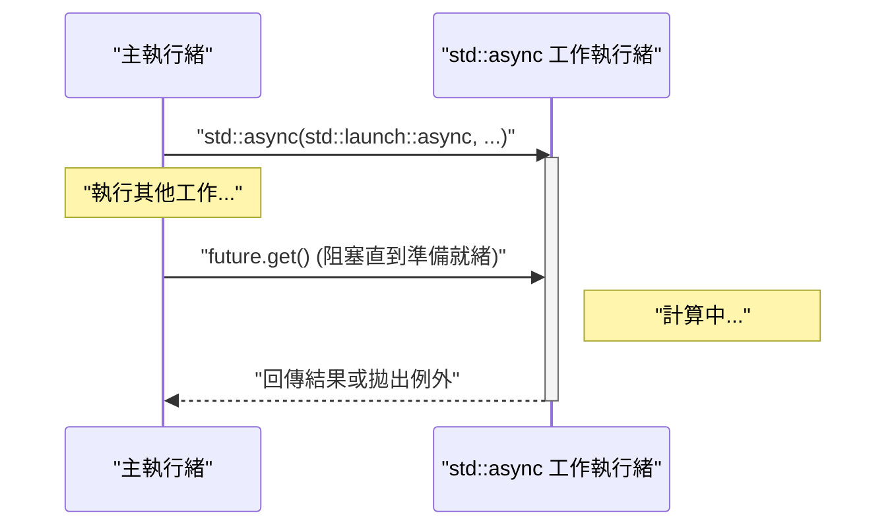
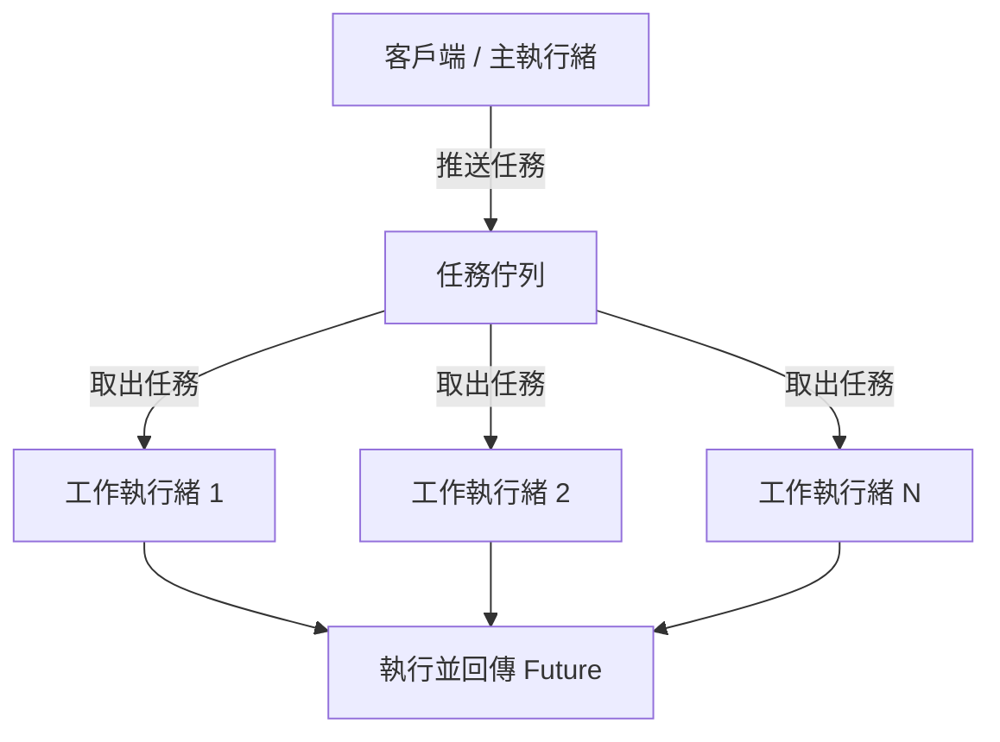

現代的軟體開發中，為了最大限度地發揮多核心 CPU 的效能，多執行緒程式設計是不可或缺的。C++ 從 C++11 開始，將多執行緒及非同步處理的 API（`<thread>`, `<mutex>`, `<condition_variable>`, `<future>`）作為標準函式庫匯入，使得開發者不需要撰寫依賴平台的程式碼（如 POSIX 執行緒或 Windows API），就能實作可攜且安全的並行處理。此外，隨著 C++14、C++17、C++20 的持續版本更新，更加入了 `std::scoped_lock` 與 `std::jthread` 等更安全且進階的功能。

本文將從 C++ 多執行緒程式設計的基礎開始，深入解說防止資料競爭（Data Race）的同步機制，以及現代的非同步處理（`std::async`）與執行緒池（Thread Pool）的概念，並搭配詳細的程式碼範例進行徹底講解。

---

## 1. 並行處理的基礎與阿姆達爾定律 (Amdahl's Law)

進行多執行緒化的最大目的是「提升效能」，但並非整個程式都能夠被平行化。這裡非常重要的是**阿姆達爾定律 (Amdahl's Law)**。

阿姆達爾定律是一個預測模型，用來預測當程式的一部分被平行化、最佳化後，整體系統的效能能夠提升多少。

$$ S(N) = \frac{1}{(1 - P) + \frac{P}{N}} $$

* $S(N)$ : 理論上的最大加速比
* $P$ : 整個程式中，可平行化部分的比例 (0 ≤ $P$ ≤ 1)
* $N$ : 處理器（執行緒）的數量

這個公式揭示了一個重要的事實：「不論增加多少處理器數量 $N$，無法平行化的循序處理部分 $(1 - P)$ 將會成為瓶頸，因此加速是有上限的」。例如，即使程式有 $90\%$ 可以平行化（$P = 0.9$），只要剩下的 $10\%$ 是循序處理，那麼就算使用無限多的處理器，最多也只能加速 $10$ 倍（$S(\infty) = 1 / 0.1$）。

因此，在使用 C++ 進行多執行緒程式設計時，不能只是單純地增加執行緒，更需要**盡可能減少循序處理部分（如鎖的競爭或同步的負擔等）的設計**。

---

## 2. 執行緒的基礎：`std::thread` 與 `std::jthread` (C++20)

### 傳統的 `std::thread` (C++11)

C++11 匯入的 `std::thread` 是用來在新的執行緒中執行函式或 Lambda 運算式的最基礎類別。

```cpp
#include <iostream>
#include <thread>

void workerFunction(int id) {
    std::cout << "Worker " << id << " is running on thread " 
              << std::this_thread::get_id() << std::endl;
}

int main() {
    std::cout << "Main thread id: " << std::this_thread::get_id() << std::endl;

    // 建立並開始執行執行緒
    std::thread t1(workerFunction, 1);
    
    // 使用 Lambda 運算式建立執行緒
    std::thread t2([](int id) {
        std::cout << "Lambda Worker " << id << " is running." << std::endl;
    }, 2);

    // 等待執行緒結束（join）
    t1.join();
    t2.join();

    std::cout << "All threads completed." << std::endl;
    return 0;
}
```

`std::thread` 需要注意的是，**在被銷毀之前，必須呼叫 `join()` 或 `detach()`**。如果兩者都未被呼叫，而 `std::thread` 的解構函式被執行，就會觸發 `std::terminate()`，導致程式崩潰。為了確保例外安全性（Exception Safety），過去我們需要自己實作使用 RAII 模式的包裝類別（Wrapper Class）。

### 現代的 `std::jthread` (C++20)

在 C++20 中，匯入了消除這些缺點的 `std::jthread` (joining thread)。`std::jthread` 會在解構函式中自動呼叫 `join()`，因此即使發生例外，也能夠安全地等待執行緒結束。此外，它還具備了透過 `std::stop_token` 協作取消執行緒的功能。

```cpp
#include <iostream>
#include <thread>
#include <chrono>

int main() {
    // C++20: std::jthread
    // 透過第一個參數接收 std::stop_token 以偵測取消請求
    std::jthread jt([](std::stop_token stoken) {
        while (!stoken.stop_requested()) {
            std::cout << "Working..." << std::endl;
            std::this_thread::sleep_for(std::chrono::milliseconds(500));
        }
        std::cout << "Stop requested. Exiting thread." << std::endl;
    });

    std::this_thread::sleep_for(std::chrono::seconds(2));
    
    // 明確地請求取消
    jt.request_stop(); 
    
    // 由於 jthread 的解構函式會自動 join，因此不需要手動呼叫 join()
    return 0;
}
```

---

## 3. 避免資料競爭與同步：互斥鎖 (Mutex) 與鎖 (Lock)

當多個執行緒同時存取相同的記憶體區域（如變數），且至少有一個執行緒進行寫入時，就會發生**資料競爭 (Data Race)**。在 C++ 標準中，資料競爭會導致未定義行為 (Undefined Behavior)。為了防止這種情況，需要使用 `std::mutex` 進行互斥控制。

### `std::mutex` 與 `std::lock_guard`

不建議手動呼叫原生的 `std::mutex::lock()` 與 `unlock()`，因為如果在發生例外時沒有呼叫到 `unlock()`，就會有導致死鎖 (Deadlock) 的風險。在 C++ 中，通常會使用基於 RAII 模式的 `std::lock_guard` (C++11) 或 `std::scoped_lock` (C++17)。

```cpp
#include <iostream>
#include <vector>
#include <thread>
#include <mutex>

std::mutex g_mutex;
int g_counter = 0;

void incrementCounter(int iterations) {
    for (int i = 0; i < iterations; ++i) {
        // 離開作用域時會自動 unlock
        std::lock_guard<std::mutex> lock(g_mutex);
        ++g_counter;
    }
}

int main() {
    std::vector<std::thread> threads;
    for (int i = 0; i < 10; ++i) {
        threads.emplace_back(incrementCounter, 10000);
    }

    for (auto& t : threads) {
        t.join();
    }

    std::cout << "Final counter value: " << g_counter << std::endl;
    // 如預期會是 100000
    return 0;
}
```

### `std::unique_lock`

`std::lock_guard` 是一種基於作用域的簡單鎖，但如果需要更靈活的控制（如延遲鎖定、帶有時間限制的鎖定、中途解鎖等），則可以使用 `std::unique_lock`。在接下來要講解的 `std::condition_variable` 中，必須使用 `std::unique_lock`。

---

## 4. 執行緒間的通訊：`std::condition_variable`

如果需要實作「生產者-消費者模式 (Producer-Consumer Pattern)」，也就是某個執行緒等待特定條件滿足，而另一個執行緒在滿足該條件時發送通知，可以使用 `std::condition_variable`。

```cpp
#include <iostream>
#include <thread>
#include <mutex>
#include <condition_variable>
#include <queue>

std::mutex g_mtx;
std::condition_variable g_cv;
std::queue<int> g_dataQueue;
bool g_isFinished = false;

void producer() {
    for (int i = 1; i <= 5; ++i) {
        std::this_thread::sleep_for(std::chrono::milliseconds(200));
        {
            std::lock_guard<std::mutex> lock(g_mtx);
            g_dataQueue.push(i);
            std::cout << "Produced: " << i << std::endl;
        }
        g_cv.notify_one(); // 通知消費者
    }
    
    {
        std::lock_guard<std::mutex> lock(g_mtx);
        g_isFinished = true;
    }
    g_cv.notify_one(); // 通知結束
}

void consumer() {
    while (true) {
        std::unique_lock<std::mutex> lock(g_mtx);
        // 等待直到條件滿足（佇列不為空，或者已設定結束旗標）
        // 為了防止虛假喚醒 (Spurious Wakeup)，使用 Lambda 運算式指定條件
        g_cv.wait(lock, []{ return !g_dataQueue.empty() || g_isFinished; });

        while (!g_dataQueue.empty()) {
            int val = g_dataQueue.front();
            g_dataQueue.pop();
            // 解鎖並執行繁重的處理（這裡只有輸出）
            lock.unlock();
            std::cout << "Consumed: " << val << std::endl;
            lock.lock(); // 再次取得鎖
        }

        if (g_isFinished && g_dataQueue.empty()) {
            break;
        }
    }
}

int main() {
    std::thread t1(producer);
    std::thread t2(consumer);
    t1.join();
    t2.join();
    return 0;
}
```

在這個範例中，`std::condition_variable::wait` 會讓執行緒進入休眠狀態直到滿足條件，從而防止浪費 CPU 資源（忙碌迴圈, Busy Loop）。

---

## 5. 高度抽象的非同步處理：`std::future`, `std::promise`, `std::async`

到目前為止提到的 `std::thread` 與 `std::mutex` 雖然強大，但它們只是直接將作業系統底層的執行緒機制帶入 C++ 中，在處理取得結果或傳遞例外時，程式碼往往會變得繁雜。如果需要執行有回傳值的並行處理，或是更高階的非同步處理，可以使用 `<future>` 標頭檔的功能。

### `std::promise` 與 `std::future`

`std::promise` 代表「設定」結果的一方，而 `std::future` 則代表「接收」結果的一方。它們作為執行緒之間安全傳遞結果或例外的通道來運作。

### 使用 `std::async` 的基於任務的並行處理

在 C++ 中，最推薦執行非同步任務的方法是使用 `std::async`。`std::async` 會非同步地執行任務，並回傳一個用來取得其結果的 `std::future`。

```cpp
#include <iostream>
#include <future>
#include <chrono>

int complexCalculation(int x) {
    std::cout << "Calculation started on thread: " 
              << std::this_thread::get_id() << std::endl;
    std::this_thread::sleep_for(std::chrono::seconds(2));
    if (x < 0) {
        throw std::invalid_argument("x must be positive");
    }
    return x * 42;
}

int main() {
    std::cout << "Main thread id: " << std::this_thread::get_id() << std::endl;

    // 指定 std::launch::async 強制在另一個執行緒中執行
    std::future<int> resultFuture = std::async(std::launch::async, complexCalculation, 10);

    std::cout << "Main thread is doing other work..." << std::endl;

    try {
        // 呼叫 get() 時，將會阻塞目前的執行緒並等待，直到計算結束
        int result = resultFuture.get();
        std::cout << "Result: " << result << std::endl;
    } catch (const std::exception& e) {
        std::cerr << "Exception caught: " << e.what() << std::endl;
    }

    return 0;
}
```

`std::async` 的行為如下方循序圖所示。



`std::async` 的第一個參數為啟動原則 (Launch Policy)，主要有以下兩種：
* `std::launch::async`: 一定會建立新的執行緒（或從執行緒池分配），並非同步地執行。
* `std::launch::deferred`: 延遲評估 (Lazy Evaluation)。只有在呼叫 `future.get()` 或 `future.wait()` 時，才會在呼叫者的執行緒中同步執行。

如果使用預設值（未指定），則取決於實作，系統會根據負載狀況選擇其中一種。若想確保非同步執行，應明確指定 `std::launch::async`。

---

## 6. 執行緒池 (Thread Pool) 的概念

如果每次都呼叫 `std::async`，或是在迴圈中頻繁建立與銷毀 `std::thread`，執行緒的上下文切換 (Context Switch) 以及作業系統配置資源的負擔將變得不容忽視。特別是在處理大量細粒度任務 (Fine-grained tasks) 時，使用執行緒池 (Thread Pool) 是必不可少的。

執行緒池是一種架構：在應用程式啟動時預先建立一定數量的各個工作 (Worker) 執行緒，將任務累積在佇列 (Queue) 中，然後由閒置的工作執行緒依序取出並處理任務。



雖然在 C++ 標準函式庫中（截至 C++23）尚無標準的執行緒池類別，但只需組合 `std::thread`, `std::mutex`, `std::condition_variable`, `std::function`, `std::packaged_task`，就能在幾十行程式碼內實作一個高效率的執行緒池。在實際應用中，使用 `Boost.Asio` 的非同步 I/O 或第三方函式庫也是非常普遍的作法。

---

## 7. 關於效能與擴展性的考量

為了在多執行緒程式設計中發揮最佳效能，不僅要注意程式碼的平行化，還需要關注硬體的架構。

* **偽共享 (False Sharing):** 
  即使多個執行緒更新的是不同的變數，但只要這些變數被配置在 CPU 的同一個快取行 (Cache Line, 通常為 64 bytes) 中，為了維持快取一致性 (Cache Coherency)，就會發生無謂的記憶體同步，導致效能大幅下降。為了防止這種情況，需要使用 `alignas` 標示符將變數對齊到快取行的邊界。
* **無鎖 (Lock-Free) 與 `std::atomic`:**
  為了避免互斥鎖的鎖定/解鎖負擔，可以考慮導入使用 `<atomic>` 的不可分割操作（如 Compare-And-Swap）或無鎖資料結構。不過，這需要對記憶體順序 (`std::memory_order`) 有正確的理解，且實作難度極高，因此通常只在經過謹慎的效能測量後，判斷為必要時才會引入。

---

## 8. 總結

本文從基礎到最新的 C++20 功能，解說了 C++ 中的多執行緒與非同步程式設計。重點如下：

1. **基本上使用 `std::async`:** 對於單次執行的非同步任務或是需要回傳值的並行處理，相較於手動管理執行緒，利用安全且方便的 `std::async` 與 `std::future` 是更好的選擇。
2. **使用 `std::jthread` 進行執行緒管理:** 對於長期在背景運作的執行緒，應使用 C++20 的 `std::jthread` 以保證安全的結束處理。
3. **利用 RAII 進行同步:** 為了防止資料競爭，互斥鎖的鎖定必定要透過 `std::lock_guard` 或 `std::unique_lock` 來進行。
4. **注意額外負擔 (Overhead):** 避免過度建立執行緒，必要時應引入執行緒池架構。

並行處理中的錯誤（死鎖、資料競爭）重現率低，屬於最難除錯的類型之一。隨時保持對執行緒安全性 (Thread Safety) 的意識，並選擇合適的標準函式庫工具，藉此實現由現代 C++ 打造的穩健且高速的系統開發吧。
