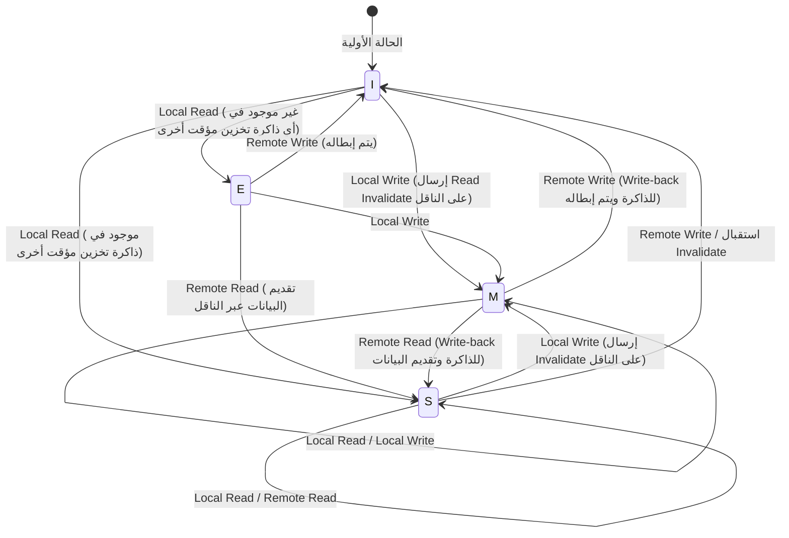

# فيزياء ذاكرة التخزين المؤقت لوحدة المعالجة المركزية وبروتوكول MESI: أعماق التناسق وحواجز الذاكرة في المعالجات متعددة النواة

في هندسة البرمجيات الحديثة، يعد الفهم الصحيح لمبادئ عمل وحدة المعالجة المركزية (CPU) شرطًا أساسيًا لاستخلاص أقصى أداء ممكن. في الوقت الحاضر، حيث أصبحت بنية المعالجات متعددة النواة هي المعيار، فإن الإجابة على أسئلة مثل "لماذا تصبح البرامج متعددة الخيوط (multithreaded) بطيئة؟" أو "لماذا تحدث أخطاء غامضة (مثل سباق البيانات أو نقص الرؤية)؟" تعود جميعها إلى فيزياء "تناسق ذاكرة التخزين المؤقت" (Cache Coherence) و"نماذج اتساق الذاكرة" (Memory Consistency Models) التي تحدث على شريحة السيليكون لوحدة المعالجة المركزية.

في هذه المقالة، سننطلق من القيود الفيزيائية الأساسية لذاكرة التخزين المؤقت لوحدة المعالجة المركزية، وسنشرح بشكل شامل ومفصل وبأسلوب أكاديمي وعملي البنية الأساسية لذاكرة التخزين المؤقت، ومشكلة تناسق ذاكرة التخزين المؤقت في المعالجات متعددة النواة، وبروتوكول MESI الذي يحل هذه المشكلة، بالإضافة إلى الآثار الجانبية لتحسينات الأجهزة (مثل مخزن التخزين - Store Buffer، وطابور الإبطال - Invalidate Queue) وحواجز الذاكرة، وصولاً إلى مشكلة المشاركة الخاطئة (False Sharing) التي يواجهها مهندسو البرمجيات.

---

## الفصل الأول: حاجز سرعة الضوء ومشكلة جدار الذاكرة

### 1.1 الحدود الفيزيائية لسرعة الضوء وزمن الانتقال (Latency)
في الوقت الحاضر حيث وصلت ترددات وحدة المعالجة المركزية إلى عدة جيجاهرتز، نواجه قانونًا فيزيائيًا مطلقًا يُعرف باسم "حاجز سرعة الضوء". على سبيل المثال، في وحدة معالجة مركزية تعمل بتردد 5 جيجاهرتز، تستغرق دورة الساعة (Clock Cycle) الواحدة 0.2 نانو ثانية فقط. تبلغ المسافة التي يقطعها الضوء (الموجات الكهرومغناطيسية) في الفراغ خلال ثانية واحدة حوالي 300 ألف كيلومتر، لكن المسافة التي يقطعها خلال 0.2 نانو ثانية لا تتجاوز حوالي 6 سنتيمترات. نظرًا لأن سرعة انتقال الإشارات الكهربائية عبر الأسلاك النحاسية أو السيليكون تتراوح بين نصف إلى ثلثي سرعة الضوء، فإن المسافة الفيزيائية التي يمكن للإشارة الوصول إليها في دورة ساعة واحدة تكون مجرد سنتيمترات قليلة.

هذا يوضح حقيقة قاسية مفادها أنه "من المستحيل فيزيائيًا الوصول إلى الذاكرة في دورة ساعة واحدة" طالما أن الذاكرة الرئيسية (DRAM) موضوعة على اللوحة الأم على بُعد بضعة سنتيمترات إلى أكثر من عشرة سنتيمترات من أنوية وحدة المعالجة المركزية.

### 1.2 مشكلة جدار الذاكرة (Memory Wall)
منذ التسعينيات، زادت سرعة حساب وحدة المعالجة المركزية بشكل كبير (أُسي) وفقًا لقانون مور، لكن تحسن سرعة الوصول إلى DRAM ظل بطيئًا. هذا التفاوت في وتيرة تحسين الأداء بين وحدة المعالجة المركزية والذاكرة يُسمى "مشكلة جدار الذاكرة".
فيما يلي التسلسل الهرمي الملموس لزمن الانتقال (أرقام يجب على كل مبرمج معرفتها):

- **الوصول إلى ذاكرة التخزين المؤقت L1**: حوالي 0.5 إلى 1 نانو ثانية (حوالي 3 إلى 4 دورات)
- **الوصول إلى ذاكرة التخزين المؤقت L2**: حوالي 3 إلى 7 نانو ثانية (حوالي 10 إلى 15 دورة)
- **الوصول إلى ذاكرة التخزين المؤقت L3**: حوالي 15 إلى 20 نانو ثانية (حوالي 40 إلى 60 دورة)
- **الوصول إلى الذاكرة الرئيسية (DRAM)**: حوالي 100 نانو ثانية (حوالي 300 إلى 400 دورة)

الوصول إلى الذاكرة الرئيسية أبطأ بحوالي 100 إلى 200 مرة من الوصول إلى ذاكرة التخزين المؤقت L1. أثناء انتظار وحدة المعالجة المركزية للبيانات من الذاكرة الرئيسية، يتوقف خط الأنابيب (Pipeline) لمئات الدورات. لإخفاء هذا التأخير الميئوس منه، تم تقديم "بنية ذاكرة التخزين المؤقت الهرمية".

### 1.3 خط ذاكرة التخزين المؤقت (Cache Line): لماذا 64 بايت؟
لا تدير ذاكرة التخزين المؤقت البيانات بوحدة البايت الواحد. عادةً في معماريات x86_64 أو ARM الحديثة، يتم جلب البيانات من الذاكرة الرئيسية وإدارتها في كتل بحجم "64 بايت". تسمى وحدة الـ 64 بايت هذه "خط ذاكرة التخزين المؤقت" (Cache Line).

لماذا 64 بايت؟ يتضمن هذا مقايضة بين مبدأ "المحلية المكانية" (Spatial Locality)، وتكلفة تنفيذ الأجهزة، وكفاءة النقل المتدفق (Burst Transfer) للـ DRAM.
من المحتمل جدًا أن يصل البرنامج إلى العناوين المجاورة فور الوصول إلى عنوان ذاكرة معين (مثل تصفح مصفوفة). لذلك، من خلال جلب ليس فقط البيانات المطلوبة ولكن أيضًا البيانات المحيطة بها ككتلة واحدة، يمكن زيادة معدل إصابة ذاكرة التخزين المؤقت (Cache Hit Rate) بشكل كبير.
بالإضافة إلى ذلك، تم تصميم واجهة DRAM بحيث يكون الإنتاجية أعلى عند إرسال قدر معين من الكتل المتتالية (Burst) بدلاً من إرسال كميات صغيرة من البيانات عدة مرات. القيمة 64 بايت هي قيمة مستمدة من سنوات من الخبرة والمحاكاة باعتبارها "النقطة المثالية" التي تحافظ على الحد الأدنى من النفقات الإضافية لعلامات الإدارة (Tag)، وتمنع إهدار عرض النطاق الترددي، وتستفيد بالكامل من المحلية المكانية.

---

## الفصل الثاني: بنية ذاكرة التخزين المؤقت

يعتمد نجاح ذاكرة التخزين المؤقت (SRAM) داخل وحدة المعالجة المركزية على كيفية الاحتفاظ بنسخة من الذاكرة الرئيسية بكفاءة داخل سعة محدودة. هناك ثلاثة نماذج رئيسية تحدد كيفية تعيين مساحة العناوين الشاسعة للذاكرة الرئيسية في ذاكرة التخزين المؤقت الصغيرة:

### 2.1 طرق التعيين الثلاثة لذاكرة التخزين المؤقت

1. **التعيين المباشر (Direct Mapped)**
   طريقة حيث يمكن وضع عنوان معين من الذاكرة الرئيسية في مكان واحد فقط داخل ذاكرة التخزين المؤقت. تنفيذها بسيط وسريع جدًا، لكن إذا تنافست عدة عناوين على نفس إدخال ذاكرة التخزين المؤقت (تعارض)، وتم الوصول إليها بالتناوب، فسيحدث "التقليب" (Thrashing) حيث تفشل ذاكرة التخزين المؤقت دائمًا.

2. **ترابط كامل (Fully Associative)**
   طريقة يمكن فيها وضع بيانات الذاكرة الرئيسية في "أي مكان" داخل ذاكرة التخزين المؤقت. يتم تقليل التقليب إلى الحد الأدنى، ولكن عند البحث عن البيانات، يجب مقارنة جميع إدخالات ذاكرة التخزين المؤقت والبحث فيها في نفس الوقت. لذلك، يتطلب الأمر أجهزة خاصة باهظة الثمن وعالية الاستهلاك للطاقة تسمى "الذاكرة القابلة للعنونة بالمحتوى" (CAM: Content Addressable Memory)، ولا يمكن تطبيقها على سعات كبيرة (عشرات الآلاف من الإدخالات) مثل ذاكرة التخزين المؤقت L1.

3. **ترابط المجموعات (Set Associative)**
   حل وسط بين التعيين المباشر والترابط الكامل، وهو التيار الرئيسي في ذاكرة التخزين المؤقت لوحدات المعالجة المركزية الحديثة. يتم تقسيم ذاكرة التخزين المؤقت إلى عدة "مجموعات" (Sets)، ويتم تحديد المجموعة التي يجب الوصول إليها بشكل فريد من عنوان الذاكرة (خصائص التعيين المباشر). بعد ذلك، داخل تلك المجموعة، يمكن وضعها في أي من "المسارات" (Ways) المتعددة (خصائص الترابط الكامل). على سبيل المثال، في "ترابط المجموعات ذو الـ 8 مسارات"، يوجد 8 أماكن تخزين داخل مجموعة واحدة.

### 2.2 تقسيم بتات عنوان الذاكرة (Tag, Index, Offset)

عندما تبحث وحدة المعالجة المركزية عن عنوان ذاكرة في ذاكرة التخزين المؤقت، يتم تقسيم العنوان فيزيائيًا إلى 3 أجزاء (بتات) وتفسيره:

- **الإزاحة (Offset)**: يشير إلى البايت المطلوب داخل خط ذاكرة التخزين المؤقت (مثال: 64 بايت = 2^6). أقل 6 بتات.
- **الفهرس (Index)**: يشير إلى أي "مجموعة" في ذاكرة التخزين المؤقت سيتم تعيينها.
- **العلامة (Tag)**: البتات العليا للتحقق مما إذا كانت البيانات المخزنة في تلك المجموعة تخص فعليًا عنوان الذاكرة الرئيسية المطلوب.

مثال: لعنوان مكون من 32 بت، مع ذاكرة تخزين مؤقت بحجم 64 كيلوبايت بترابط مجموعات ذو 4 مسارات، وحجم خط ذاكرة تخزين مؤقت 64 بايت.
عدد خطوط ذاكرة التخزين المؤقت هو 64KB / 64B = 1024.
بما أن عدد المسارات 4، فإن عدد المجموعات هو 1024 / 4 = 256 مجموعة (2^8).
- الإزاحة: أقل 6 بتات
- الفهرس: الـ 8 بتات التالية
- العلامة: الـ 18 بت المتبقية

### 2.3 خوارزمية استبدال ذاكرة التخزين المؤقت
عندما تمتلئ المجموعة وتكون هناك حاجة لتخزين بيانات جديدة، يجب طرد (Evict) أحد المسارات الموجودة. الخوارزمية الأكثر شيوعًا هي **LRU (الأقل استخدامًا مؤخرًا: Least Recently Used)**.
ومع ذلك، مع زيادة عدد المسارات، تصبح تكلفة الأجهزة (بتات التتبع ومنطق التحديث) لتنفيذ LRU الحقيقي غير واقعية. لذلك، تستخدم المعالجات الحديثة ليس LRU كاملًا ولكن **Pseudo-LRU (مثل Tree-PLRU)** أو في بعض الأحيان استبدال عشوائي لتحقيق التوازن الأمثل بين موارد الأجهزة ومعدل الإصابة.

---

## الفصل الثالث: آلية حدوث مشكلة تناسق ذاكرة التخزين المؤقت

في عصر النواة الواحدة، كان من الضروري فقط الحفاظ على اتساق البيانات (عبر Write-back أو Write-through) بين ذاكرة التخزين المؤقت والذاكرة الرئيسية. ولكن في عصر المعالجات متعددة النواة، يبدأ الرعب الحقيقي.

### 3.1 مأساة المتغير المشترك
تخيل موقفًا حيث توجد Core 0 و Core 1، وكلاهما يقرأان ويكتبان لنفس المتغير `X` (القيمة الأولية 0) في الذاكرة الرئيسية.

1. تقوم Core 0 بقراءة `X`. توضع `X=0` في ذاكرة L1 الخاصة بـ Core 0.
2. تقوم Core 1 بقراءة `X`. توضع `X=0` أيضًا في ذاكرة L1 الخاصة بـ Core 1.
3. تقوم Core 0 بتغيير `X` إلى `1`. تصبح `X=1` في ذاكرة L1 الخاصة بـ Core 0. (نظرًا لأنها طريقة Write-back، لا يتم كتابتها مرة أخرى إلى الذاكرة الرئيسية بعد).
4. تقوم Core 1 بقراءة `X`. بالرجوع إلى ذاكرة L1 الخاصة بها، تحصل على `X=0`.

بالرغم من أن المتغير `X` مشترك فيزيائيًا، إلا أن Core 0 و Core 1 تريان قيمتين مختلفتين تمامًا. هذه هي "مشكلة تناسق ذاكرة التخزين المؤقت". لحل هذه المشكلة، يلزم وجود بروتوكول لمزامنة الحالات بين ذاكرات التخزين المؤقت لكل نواة.

### 3.2 طرق التطفل (Snooping) والدليل (Directory)
هناك نهجان رئيسيان للبنى المستخدمة للحفاظ على التناسق:

- **طريقة التطفل (Snooping)**
  طريقة تقوم فيها جميع وحدات التحكم في ذاكرة التخزين المؤقت دائمًا بـ "التنصت" (التطفل) على العمليات التي تتم عبر ناقل الذاكرة المشترك. فهي تكتشف الإشارات عندما يحاول شخص ما الكتابة في الذاكرة أو يطلب خط ذاكرة تخزين مؤقت، وتقوم بتحديث حالة ذاكرة التخزين المؤقت الخاصة بها بشكل مستقل. تعمل بتأخير منخفض جدًا في المعالجات متعددة النواة الصغيرة إلى المتوسطة الحجم (حتى عشرات الأنوية)، ولكن لا يمكن توسيع نطاقها إذا زاد عدد الأنوية لأن النطاق الترددي للناقل سيمتلئ برسائل البث (Broadcast).

- **طريقة الدليل (Directory-based)**
  طريقة تُدير فيها "دليلًا" مركزيًا يخزن معلومات حول النواة التي تمتلك خط ذاكرة تخزين مؤقت معين. عندما تكتب نواة معينة، بدلاً من البث للجميع، فإنها تستعلم الدليل وترسل رسالة إبطال من نقطة إلى نقطة للأنوية المعنية فقط. تُستخدم في معالجات الأنظمة الضخمة متعددة النواة (مثل Xeon و EPYC للخوادم).

سنركز في هذه المقالة على الأساس وأهم مفهوم وهو بروتوكول "MESI" القائم على التطفل.

---

## الفصل الرابع: تحليل كامل لبروتوكول MESI

المعيار الفعلي للبروتوكولات الخاصة بتناسق ذاكرة التخزين المؤقت وأساسها هو **بروتوكول MESI**. يُعطي MESI كل خط ذاكرة تخزين مؤقت 2 بت كعلامة حالة، ويديره كواحدة من الحالات الأربع التالية (Modified, Exclusive, Shared, Invalid).

### 4.1 الحالات الأربع

1. **M (مُعدل - Modified)**
   - خط ذاكرة التخزين المؤقت هذا موجود "فقط" في ذاكرة التخزين المؤقت لهذه النواة، وقد تم "تغييره" (Dirty) عن قيمته في الذاكرة الرئيسية.
   - هذه النواة مسؤولة عن إعادة كتابة (Write-back) التغييرات إلى الذاكرة الرئيسية.

2. **E (حصري - Exclusive)**
   - خط ذاكرة التخزين المؤقت هذا موجود "فقط" في ذاكرة التخزين المؤقت لهذه النواة، وهو "متطابق" (Clean) مع قيمته في الذاكرة الرئيسية.
   - يمكن للنواة في أي وقت الانتقال إلى حالة M بحرية والكتابة فيه دون إخطار الأنوية الأخرى.

3. **S (مشترك - Shared)**
   - قد يكون خط ذاكرة التخزين المؤقت هذا موجودًا في ذواكر التخزين المؤقت لعدة أنوية، وهو "متطابق" (Clean) مع الذاكرة الرئيسية.
   - يمكن القراءة بحرية، ولكن للكتابة يجب إرسال رسالة "إبطال" (Invalidate) لجميع الأنوية الأخرى لإبطال هذه الحالة أولاً.

4. **I (باطل - Invalid)**
   - لا يحتوي خط ذاكرة التخزين المؤقت هذا على بيانات صالحة. هذا مرادف لحالة الفشل في العثور على البيانات في ذاكرة التخزين المؤقت (Cache Miss).

### 4.2 ديناميكيات انتقال الحالة

تتغير الحالة ديناميكيًا من خلال وصول النواة نفسها (القراءة المحلية / الكتابة المحلية) ووصول الأنوية الأخرى عبر الناقل (القراءة عن بُعد / الكتابة عن بُعد / الإبطال).

يوضح مخطط Mermaid أدناه التحولات الرئيسية لحالة بروتوكول MESI:



### 4.3 محاكاة تشغيل MESI
لنتتبع سيناريو "مأساة المتغير المشترك" المذكور أعلاه باستخدام بروتوكول MESI.

1. **تقرأ Core 0 `X`**: ترسل Core 0 طلب قراءة عبر الناقل. نظرًا لأن الأنوية الأخرى لا تمتلكه، يتم جلبه من الذاكرة، وتصبح الحالة **E (Exclusive)**.
2. **تقرأ Core 1 `X`**: ترسل Core 1 طلب قراءة. تلتقط Core 0 هذا الطلب (Snoop)، وتستجيب بتخفيض الحالة إلى **S (Shared)**. تلتقطه Core 1 أيضًا في حالة **S**.
3. **تكتب Core 0 في `X` (`X=1`)**: نظرًا لأن Core 0 في حالة **S**، ترسل إشارة "إبطال" (Invalidate) على الناقل. تستقبل Core 1 الإشارة وتجعل حالة `X` الخاصة بها **I (Invalid)**. بعد تلقي Core 0 لجميع تأكيدات الإبطال (Ack)، ترفع الحالة إلى **M (Modified)** وتقوم بتحديث خط ذاكرة التخزين المؤقت.
4. **تقرأ Core 1 `X`**: ذاكرة التخزين المؤقت لـ Core 1 في حالة **I** لذلك يحدث فشل (Cache Miss). يتم إرسال طلب قراءة عبر الناقل. تكتشف Core 0 (حالياً **M**) ذلك، وتكتب القيمة الأحدث `X=1` مرة أخرى إلى الذاكرة (Write-back)، وتقدم البيانات في نفس الوقت إلى Core 1. تصبح حالة كليهما **S (Shared)**.

بهذه الطريقة، يضمن بروتوكول MESI شفافية تامة في اتساق البيانات على مستوى الأجهزة.

### 4.4 توسيع بروتوكول MESI: MOESI و MESIF
في المعالجات الحديثة الفعلية، تُستخدم بروتوكولات محسنة مستندة إلى MESI.
- **MOESI (مثل معالجات AMD)**: تمت إضافة حالة **O (Owned)** جديدة. عند قراءة البيانات بواسطة نواة أخرى من حالة M، يتم تأخير الكتابة مرة أخرى إلى الذاكرة، وتستمر النواة "كصاحب" (Owner) في توفير البيانات المتغيرة مباشرة للذواكر الأخرى مما يوفر عرض النطاق الترددي للذاكرة.
- **MESIF (مثل معالجات Intel)**: تمت إضافة حالة **F (Forward)** جديدة. عندما تمتلك عدة أنوية حالة S، وتكون هناك قراءة من نواة أخرى، فإن استجابة الجميع ستؤدي إلى ازدحام على الناقل. تجعل الحالة F آخر نواة قرأت البيانات لتكون الممثل الوحيد للرد، مما يحسن من حركة البيانات.

---

## الفصل الخامس: مخزن التخزين وطابور الإبطال وحواجز الذاكرة

يبدو بروتوكول MESI حتى الفصل الرابع مثاليًا، ولكنه يحتوي على عيب قاتل في الأداء: "تأخير الكتابة".

### 5.1 حدود أداء MESI وإدخال مخزن التخزين
عندما تحاول Core 0 الكتابة إلى خط ذاكرة تخزين مؤقت في حالة S، يجب أن ترسل طلب Invalidate عبر الناقل وتنتظر استجابة "تم الإبطال (Invalidate Ack)" من جميع الأنوية الأخرى. تستغرق رحلة الذهاب والإياب هذه من العشرات إلى مئات الدورات. خلال هذا الوقت، يتوقف خط الأنابيب لوحدة المعالجة المركزية بالكامل.

لحل هذه المشكلة، أدخل مهندسو الأجهزة **مخزن التخزين (Store Buffer)**.
عندما تقوم النواة بعملية كتابة، لا تنتظر اكتمال الـ Invalidate، بل تضع البيانات والعنوان الذي تريد الكتابة إليه فورًا في "مخزن التخزين". ثم تنتقل وحدة المعالجة المركزية على الفور لتنفيذ التعليمات التالية. ينتظر مخزن التخزين عمليات Invalidate Ack بشكل غير متزامن، وعند اكتمالها، يكتب في ذاكرة التخزين المؤقت L1 (حالة M).

بينما تسرع هذه الآلية من الكتابة، تتطلب وظيفة تسمى "Store Forwarding". إذا كانت النواة تحتاج لقراءة القيمة التي كتبت فيها للتو، والتي لم تنعكس بعد في L1، فيجب عليها أن تبحث في مخزن التخزين للحصول على أحدث قيمة.

### 5.2 طابور الإبطال (Invalidate Queue) للردود السريعة
حجم مخزن التخزين صغير جدًا، لذا سرعان ما يمتلئ ويسبب توقفًا. لماذا يتأخر Invalidate Ack؟ لأن النواة الأخرى إذا تلقت طلب الإبطال وكانت ذاكرتها مشغولة، يتأخر معالجة الإبطال.
لحل هذه المشكلة، تقوم النواة التي تتلقى طلب الإبطال بدفعه في **طابور الإبطال (Invalidate Queue)** وتُرسل "Ack" فورًا قبل تنفيذ الإبطال فعليًا في الذاكرة المؤقتة. يتم تنفيذ الإبطال لاحقًا بشكل غير متزامن.

### 5.3 تدمير اتساق الذاكرة بواسطة الأجهزة
أدى استخدام Store Buffer و Invalidate Queue إلى تحسينات هائلة في الأداء، ولكن بتكلفة تدمير "الاتساق المتسلسل" (Sequential Consistency).

لنفكر في المثال الشهير التالي (القيم الأولية `A = 0`, `B = 0`):

```c
// Core 0                  // Core 1
A = 1;                     B = 1;
print(B);                  print(A);
```

إذا تم احترام بروتوكول MESI بصرامة، فعلى الأقل يجب أن تكتمل إحدى العمليتين أولاً، لذلك لن يُطبع "0" أبدًا من كلتا النواتين.
لكن في المعالجات الواقعية، من المحتمل جدًا طباعة "0" في كلتيهما.
1. تكتب Core 0 `A=1` في مخزن التخزين الخاص بها وتستمر.
2. تكتب Core 1 `B=1` في مخزن التخزين الخاص بها وتستمر.
3. تقرأ Core 0 `B`، ولكن نظراً لأن كتابة Core 1 لا تزال في مخزن التخزين الخاص بـ Core 1، فإنها تقرأ `B=0`.
4. تقرأ Core 1 `A`، ولكن نظراً لأن كتابة Core 0 لا تزال في مخزن التخزين الخاص بـ Core 0، فإنها تقرأ `A=0`.

هذا هو نقص "الرؤية" الذي يسببه التنفيذ خارج الترتيب (Out-of-Order) وتحسينات الأجهزة.

### 5.4 حاجز الذاكرة (Memory Barrier / Fence)
لحل هذه المشكلة، يجب أن يُصدر جانب البرمجيات تعليمات للأجهزة لفرض النظام: "حافظ على الترتيب بصرامة من الآن فصاعدًا" و"قم بإفراغ مخزن التخزين". هذا هو **حاجز الذاكرة (Memory Barrier / Memory Fence)**.

- **حاجز التخزين (Write Memory Barrier, `smp_wmb()`)**: يعلق أي عمليات كتابة لاحقة حتى تكتمل جميع الكتابات في مخزن التخزين إلى الذاكرة.
- **حاجز التحميل (Read Memory Barrier, `smp_rmb()`)**: يعلق أي عمليات قراءة لاحقة حتى تتم معالجة جميع طلبات الإبطال في طابور الإبطال.
- **حاجز كامل (Full Memory Barrier, `smp_mb()`)**: يقوم بكلا الإجراءين السابقين.

تتبنى بنية x86 نموذج اتساق قوي نسبيًا يُعرف بـ **TSO (Total Store Order)**، حيث يتم الاحتفاظ بالترتيب الطبيعي للقراءة والكتابة إلى حد كبير (قد يتم عكس الترتيب فقط إذا تبع التحميل تخزين). من ناحية أخرى، تتبنى بنية ARM **الاتساق الضعيف (Weak Consistency)**، مما يسمح بإعادة ترتيب التعليمات بحرية تامة ما لم يُحدد حاجز صراحة.

### 5.5 دلالات الحصول والتحرير (Acquire / Release Semantics)
في لغات البرمجة الحديثة (C++11 وما بعدها، Rust، Java، إلخ)، لا تُكتب تعليمات الحاجز المعقدة الخاصة بوحدة المعالجة المركزية مباشرةً، بل تُستخدم "دلالات التحرير / الحصول" (Acquire / Release) ذات المستوى الأعلى للتحكم في الاتساق.
- **التحرير (Release)**: عند نقل البيانات إلى خيط آخر، فإنه يضمن اكتمال جميع عمليات الكتابة السابقة.
- **الحصول (Acquire)**: عند استقبال البيانات من خيط آخر، فإنه يضمن أن جميع القراءات اللاحقة ستحصل على أحدث البيانات.

---

## الفصل السادس: الواقع الذي يواجهه مهندسو البرمجيات

لقد استكشفنا أعماق الأجهزة حتى الآن، وأخيراً سنشرح كيف يرتبط هذا مباشرة بالشفرة التي نكتبها كمهندسي برمجيات.

### 6.1 مأساة المشاركة الخاطئة (False Sharing)
من أسوأ أعداء الأداء في البرمجة متعددة الخيوط هو **المشاركة الخاطئة (False Sharing)**.

ذكرنا أن خط ذاكرة التخزين المؤقت عبارة عن كتلة من 64 بايت. ماذا يحدث إذا كان هناك متغيران لا علاقة لهما ببعضهما البعض، `A` و `B`، متجاورين في الذاكرة وانتهى بهما المطاف على نفس خط ذاكرة التخزين المؤقت المكون من 64 بايت؟

```cpp
struct Counter {
    volatile long long thread1_count; // Core 0 تُحدثه بشكل متكرر
    volatile long long thread2_count; // Core 1 تُحدثه بشكل متكرر
};
Counter c;
```

عندما تُحدث Core 0 `thread1_count`، ووفقًا لبروتوكول MESI، يصبح خط ذاكرة التخزين المؤقت بأكمله في حالة M، ويتم إبطال (Invalidate) خط ذاكرة التخزين المؤقت الخاص بـ Core 1.
بعد ذلك مباشرة، عندما تحاول Core 1 تحديث `thread2_count`، يحدث فشل في ذاكرة التخزين المؤقت (Cache Miss)، مما يضطرها لجلب أحدث خط من الذاكرة الرئيسية (أو ذاكرة التخزين المؤقت لـ Core 0). ثم، هذه المرة، يتم إبطال جانب Core 0.

على الرغم من أن البرنامج يتلاعب بمتغيرات مختلفة تمامًا، إلا أنه على مستوى الأجهزة يحدث صراع قوي (Ping-Pong) بين الأنوية حول "ملكية" خط ذاكرة التخزين المؤقت المكون من 64 بايت. يؤدي هذا إلى مأساة حيث تصبح البرمجة متعددة الخيوط أبطأ من استخدام خيط واحد.

### 6.2 الحل من خلال محاذاة خط ذاكرة التخزين المؤقت (Cache Line Alignment)
لمنع حدوث False Sharing، يمكنك ببساطة فرض ترتيب الذاكرة بحيث يتم وضع المتغيرات على خطوط ذاكرة تخزين مؤقت مختلفة. بدءًا من C++11، يمكن استخدام المحدد `alignas`.

```cpp
#include <atomic>
#include <thread>
#include <vector>

// حجم التداخل المدمر للأجهزة (عادةً 64 بايت)
#ifdef __cpp_lib_hardware_interference_size
    using std::hardware_destructive_interference_size;
#else
    constexpr std::size_t hardware_destructive_interference_size = 64;
#endif

struct AlignedCounter {
    // وضع thread1_count في بداية خط ذاكرة التخزين المؤقت وإضافة حشوة خلفه
    alignas(hardware_destructive_interference_size) std::atomic<long long> thread1_count{0};
    
    // وضع thread2_count في بداية خط ذاكرة تخزين مؤقت مختلف
    alignas(hardware_destructive_interference_size) std::atomic<long long> thread2_count{0};
};

int main() {
    AlignedCounter c;
    
    auto worker1 = [&c]() {
        for (int i = 0; i < 10000000; ++i) {
            // استخدام relaxed يكفي (لا يوجد اعتماد على متغيرات أخرى)
            c.thread1_count.fetch_add(1, std::memory_order_relaxed);
        }
    };
    
    auto worker2 = [&c]() {
        for (int i = 0; i < 10000000; ++i) {
            c.thread2_count.fetch_add(1, std::memory_order_relaxed);
        }
    };
    
    std::thread t1(worker1);
    std::thread t2(worker2);
    
    t1.join();
    t2.join();
    
    return 0;
}
```

بهذه الطريقة، تؤدي إضافة `alignas(64)` إلى إدراج حشوة (Padding) مناسبة بين المتغيرات، وفصل خطوط ذاكرة التخزين المؤقت الفيزيائية. هذا يكسر سلسلة الإبطال غير الضرورية بواسطة بروتوكول MESI، مما يتيح تحقيق أداء متوازٍ حقيقي.

### 6.3 هياكل البيانات الخالية من الأقفال (Lock-free) وترتيب الذاكرة (Memory Order)
في برمجة الـ Lock-free الأكثر تقدمًا، يتم تحسين العمليات الذرية (Atomic Operations) وحواجز الذاكرة إلى أقصى الحدود. في لغة C++، تحديد `memory_order` في `std::atomic` هو بالضبط من أجل التحكم المباشر في تعليمات حواجز الأجهزة المشروحة في الفصل الخامس.

- `memory_order_seq_cst`: الافتراضي. هو الأكثر أمانًا، لكنه يصدر حاجزًا كاملاً ثقيلًا (`smp_mb`).
- `memory_order_acquire` / `memory_order_release`: يُصدر حاجز تحميل وحاجز تخزين، ويبني علاقة مزامنة للمتغيرات.
- `memory_order_relaxed`: لا يصدر أي حواجز على الإطلاق، ويضمن فقط أن العملية ذرية (لا يمكن تجزئتها). يضمن بروتوكول MESI تطابق القيمة النهائية، ولكن لا يُضمن ترتيب رؤية المتغيرات الأخرى على الإطلاق.

في تصميمات مثل قوابير Lock-free، يُطلب "تصميم يتماشى مع فيزياء وحدة المعالجة المركزية"، مثل إزالة الحواجز غير الضرورية والدمج المناسب بين `relaxed` و `acquire/release`، وفصل رأس (Head) وذيل (Tail) الحلقة (Ring Buffer) إلى خطوط ذاكرة تخزين مؤقت مختلفة لتجنب False Sharing.

## الخلاصة

العمليات التي نكتبها يوميًا لتعيين المتغيرات تصبح إشارات كهربائية على السيليكون، وتتنقل عبر ذواكر التخزين المؤقت الهرمية، وتتسبب في تحولات حالة معقدة في بروتوكول MESI، وتمر عبر عواصف مخازن التخزين وطوابير الإبطال قبل أن تتحدد في النهاية.
على الرغم من أن مبدأ التجريد "البرمجيات تُخفي الأجهزة" يعد رائعًا، إلا أنه في عالم البرمجة المتزامنة التي تتطلب أداءً فائقًا، فإن تجاوز حاجز التجريد لفهم الحقيقة على الطبقة الفيزيائية هو الطريق الوحيد.
