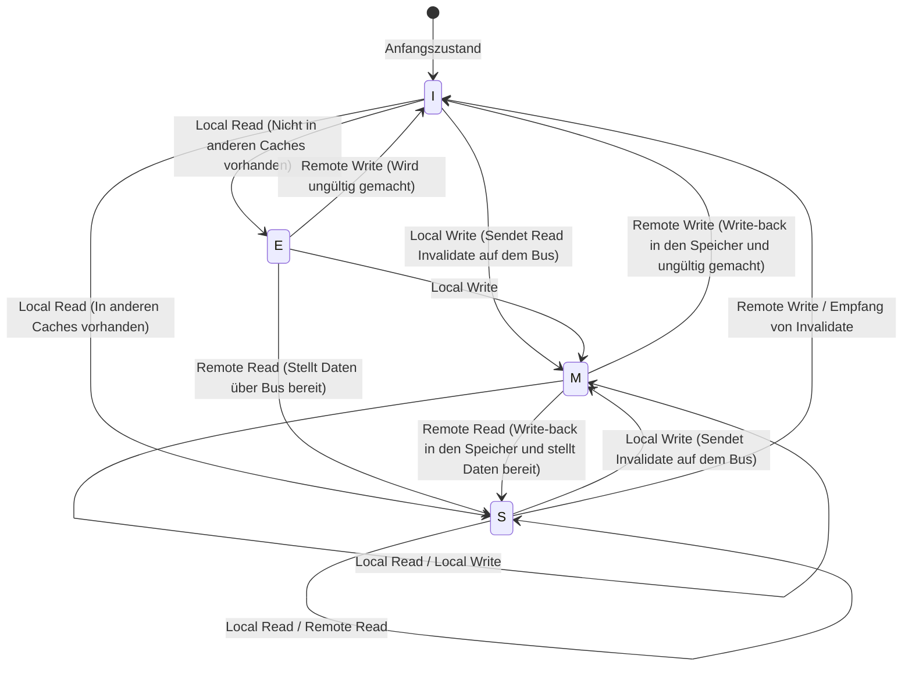

# Die Physik von CPU-Caches und das MESI-Protokoll: Die Abgründe der Kohärenz und Speicherbarrieren bei Multi-Core

In der modernen Softwareentwicklung ist ein korrektes Verständnis der Funktionsprinzipien von CPUs eine unabdingbare Voraussetzung, um maximale Leistung herauszuholen. Insbesondere heute, wo Multi-Core-Architekturen der Standard sind, laufen die Antworten auf Fragen wie "Warum sind Multithread-Programme langsam?" oder "Warum treten mysteriöse Bugs auf (Data Races oder fehlende Sichtbarkeit)?" alle auf die Physik der "Cache-Kohärenz" und "Speicherkonsistenzmodelle" hinaus, die sich auf dem Silizium-Die der CPU abspielen.

Dieser Artikel beginnt bei den grundlegenden physikalischen Beschränkungen von CPU-Caches und erklärt die Grundstruktur der Cache-Architektur, das Problem der Cache-Kohärenz in Multi-Core-Systemen, die vollständige Analyse des MESI-Protokolls als dessen Lösung sowie die Nebenwirkungen (und Speicherbarrieren), die durch Hardware-Optimierungen (Store-Buffer, Invalidate-Queues) entstehen, bis hin zum False Sharing, mit dem Softwareentwickler konfrontiert sind – und das alles in wissenschaftlicher wie auch praktischer Tiefe.

---

## Kapitel 1: Die Mauer der Lichtgeschwindigkeit und das Memory-Wall-Problem

### 1.1 Die physikalische Grenze der Lichtgeschwindigkeit und Latenz
In der heutigen Zeit, in der die Taktfrequenzen von CPUs mehrere GHz erreichen, stehen wir vor dem absoluten physikalischen Gesetz der "Mauer der Lichtgeschwindigkeit". Bei einer CPU, die beispielsweise mit 5 GHz arbeitet, dauert ein Taktzyklus nur 0,2 Nanosekunden (ns). Während Licht (elektromagnetische Wellen) im Vakuum in einer Sekunde etwa 300.000 km zurücklegt, beträgt die in 0,2 Nanosekunden zurückgelegte Strecke nur etwa 6 Zentimeter. Da die Ausbreitungsgeschwindigkeit von elektrischen Signalen in Kupferdrähten oder Silizium nur etwa die Hälfte bis zwei Drittel der Lichtgeschwindigkeit beträgt, ist die physikalische Distanz, die ein Signal in einem Taktzyklus überbrücken kann, auf wenige Zentimeter beschränkt.

Dies zeigt die grausame Tatsache, dass es, solange der Hauptspeicher (DRAM) einige bis über zehn Zentimeter entfernt von den CPU-Kernen auf dem Motherboard platziert ist, physikalisch "absolut unmöglich ist, in einem Takt auf den Speicher zuzugreifen".

### 1.2 Das Memory-Wall-Problem
Seit den 1990er Jahren ist die Rechengeschwindigkeit von CPUs gemäß dem Mooreschen Gesetz exponentiell gestiegen, während die Zugriffsgeschwindigkeit von DRAM nur moderat zunahm. Diese Diskrepanz in der Leistungssteigerung zwischen CPU und Speicher wird als "Memory-Wall-Problem" bezeichnet.
Die konkrete Latenzhierarchie (Numbers Every Programmer Should Know) sieht wie folgt aus:

- **L1-Cache-Referenz**: ca. 0,5 - 1 ns (ca. 3 - 4 Zyklen)
- **L2-Cache-Referenz**: ca. 3 - 7 ns (ca. 10 - 15 Zyklen)
- **L3-Cache-Referenz**: ca. 15 - 20 ns (ca. 40 - 60 Zyklen)
- **Hauptspeicher (DRAM)-Referenz**: ca. 100 ns (ca. 300 - 400 Zyklen)

Ein Zugriff auf den Hauptspeicher ist im Vergleich zum L1-Cache etwa 100- bis 200-mal langsamer. Während die CPU auf Daten aus dem Hauptspeicher wartet, blockiert (stall) die Pipeline für Hunderte von Zyklen. Um diese aussichtslose Verzögerung zu verbergen, wurde die "hierarchische Cache-Architektur" eingeführt.

### 1.3 Cache-Line: Warum 64 Byte?
Ein Cache verwaltet Daten nicht byte-weise. Typischerweise rufen moderne x86_64- oder ARM-Architekturen Daten in "64 Byte" großen Blöcken aus dem Hauptspeicher ab und verwalten sie. Diese 64-Byte-Einheit nennt man eine "Cache-Line".

Warum 64 Byte? Dies hängt mit dem Prinzip der "räumlichen Lokalität (Spatial Locality)" und den Kompromissen zwischen Hardware-Implementierungskosten und der Burst-Übertragungseffizienz von DRAM zusammen.
Wenn ein Programm auf eine bestimmte Speicheradresse zugreift, ist die Wahrscheinlichkeit extrem hoch, dass es unmittelbar danach auf benachbarte Adressen zugreift (z.B. beim Durchlaufen eines Arrays). Indem man nicht nur die angeforderten Daten, sondern auch umliegende Daten in einem Rutsch abruft, kann die Cache-Trefferrate (Hit Rate) drastisch erhöht werden.
Zudem ist das DRAM-Interface so konzipiert, dass der Durchsatz höher ist, wenn eine gewisse Menge (Burst) zusammenhängend gesendet wird, als wenn kleine Datenmengen mehrfach gesendet werden. Die 64 Byte sind ein Wert, der aus langjähriger Erfahrung und Simulationen als "Sweet Spot" abgeleitet wurde, der den Overhead von Verwaltungs-Tags gering hält, die Verschwendung von Bandbreite verhindert und die räumliche Lokalität voll ausnutzt.

---

## Kapitel 2: Wie Caches aufgebaut sind

Bei Cache-Speichern, die internes SRAM der CPU verwenden, ist der Schlüssel, wie effizient eine Kopie des Hauptspeichers in der begrenzten Kapazität gehalten wird. Es gibt hauptsächlich drei Modelle, die bestimmen, wohin der riesige Adressraum des Hauptspeichers im kleinen Cache abgebildet (gemappt) wird.

### 2.1 Drei Mapping-Methoden für Caches

1. **Direct Mapped**
   Eine Methode, bei der eine bestimmte Adresse im Hauptspeicher nur an einem einzigen Ort im Cache abgelegt werden kann. Die Implementierung ist sehr einfach und schnell, aber wenn mehrere Adressen in denselben Cache-Eintrag fallen (Konflikt) und abwechselnd aufgerufen werden, kommt es leicht zum "Thrashing", bei dem ständig Cache-Misses auftreten.

2. **Fully Associative**
   Eine Methode, bei der Daten aus dem Hauptspeicher "überall" im Cache platziert werden können. Das Auftreten von Thrashing wird minimiert, jedoch müssen bei der Suche nach Daten alle Einträge des Caches gleichzeitig verglichen und durchsucht werden. Daher wird eine spezielle, teure und stromfressende Hardware namens Assoziativspeicher (CAM: Content Addressable Memory) benötigt, weshalb dies nicht für große Kapazitäten (Zehntausende von Einträgen) wie bei L1-Caches verwendet werden kann.

3. **Set Associative**
   Ein Kompromiss zwischen Direct Mapped und Fully Associative und der Mainstream für heutige CPU-Caches. Der Cache ist in mehrere "Sets" unterteilt, und die Speicheradresse bestimmt eindeutig, auf welches Set zugegriffen wird (Direct-Mapped-Eigenschaft). Innerhalb dieses Sets können die Daten an einer von mehreren "Ways" platziert werden (Fully-Associative-Eigenschaft). Ein "8-Way Set Associative"-Cache hat beispielsweise 8 Speicherplätze in einem einzigen Set.

### 2.2 Bit-Zerlegung der Speicheradresse (Tag, Index, Offset)

Wenn die CPU im Cache nach einer Speicheradresse sucht, wird die Adresse physikalisch in drei Teile zerlegt (Bit-Zerlegung) und interpretiert.

- **Offset**: Gibt an, auf welches Byte innerhalb der Cache-Line (z. B. 64 Byte = 2^6) zugegriffen wird. Die unteren 6 Bits.
- **Index**: Gibt an, auf welches "Set" im Cache abgebildet wird.
- **Tag**: Die oberen Bits, mit denen überprüft wird, ob die im Set gespeicherten Daten wirklich zu der angeforderten Hauptspeicheradresse gehören.

Beispiel: 32-Bit-Adresse, 64 KB großer 4-Way-Set-Associative-Cache, 64-Byte-Cache-Line.
Anzahl der Cache-Lines: 64 KB / 64 B = 1024.
Da es 4 Ways gibt, ist die Anzahl der Sets: 1024 / 4 = 256 Sets (2^8).
- Offset: Untere 6 Bits
- Index: Nächste 8 Bits
- Tag: Restliche 18 Bits

### 2.3 Cache-Ersetzungsalgorithmen
Wenn ein Set voll ist und neue Daten gespeichert werden müssen, muss einer der vorhandenen Ways verdrängt (Evict) werden. Der gebräuchlichste Algorithmus ist **LRU (Least Recently Used)**.
Wenn jedoch die Anzahl der Ways steigt, wird der Hardware-Aufwand für die Implementierung eines echten LRU (Verfolgungsbits und Aktualisierungslogik) unrealistisch. Daher verwenden moderne Prozessoren kein echtes LRU, sondern **Pseudo-LRU (wie Tree-PLRU)** oder in einigen Fällen eine zufällige Ersetzung, um eine optimale Balance zwischen Hardware-Ressourcen und Hit-Rate zu erreichen.

---

## Kapitel 3: Der Entstehungsmechanismus des Cache-Kohärenz-Problems

Zu Zeiten von Single-Core-Systemen musste man sich nur um die Wahrung der Datenkonsistenz zwischen Cache und Hauptspeicher (Write-Back oder Write-Through) kümmern. Doch mit der Multi-Core-Ära beginnt der wahre Schrecken.

### 3.1 Die Tragödie der gemeinsamen Variablen
Stellen Sie sich vor, es gibt Core 0 und Core 1, und beide lesen und schreiben dieselbe Variable `X` (Anfangswert 0) im Hauptspeicher.

1. Core 0 liest `X`. `X=0` landet im L1-Cache von Core 0.
2. Core 1 liest `X`. `X=0` landet auch im L1-Cache von Core 1.
3. Core 0 überschreibt `X` mit `1`. Im L1-Cache von Core 0 ist `X=1`. (Wegen Write-Back wird es noch nicht in den Hauptspeicher zurückgeschrieben).
4. Core 1 liest `X`. Core 1 schaut in seinen eigenen L1-Cache und erhält `X=0`.

Obwohl die Variable `X` physisch geteilt wird, sehen Core 0 und Core 1 völlig unterschiedliche Werte. Dies ist das "Cache-Kohärenz-Problem" (Cache-Inkonsistenz). Um dies zu lösen, ist ein Protokoll zur Synchronisierung des Status zwischen den Caches der einzelnen Kerne erforderlich.

### 3.2 Snooping-Methode und Directory-Methode
Es gibt im Wesentlichen zwei Ansätze für Architekturen zur Aufrechterhaltung der Kohärenz.

- **Snooping (Snoop-basiert)**
  Eine Methode, bei der alle Cache-Controller ständig die Transaktionen auf dem gemeinsam genutzten Speicherbus "belauschen" (snoop). Sie erkennen Signale, wenn jemand versucht, in den Speicher zu schreiben oder eine Cache-Line anfordert, und aktualisieren ihren eigenen Cache-Status autonom. Sie arbeitet bei kleinen bis mittleren Multi-Core-Systemen (bis zu einigen Dutzend Kernen) mit extrem geringer Latenz, skaliert jedoch nicht gut bei zunehmender Kernzahl, da die Busbandbreite von Broadcasts überflutet wird.

- **Directory-Methode (Directory-basiert)**
  Eine Methode, bei der ein zentrales "Directory" (Verzeichnis) verwaltet, in welchem Kern-Cache sich eine Cache-Line befindet. Wenn ein Kern einen Schreibvorgang ausführt, sendet er keinen Broadcast, sondern fragt das Directory ab und sendet eine Invalidate-Nachricht Point-to-Point nur an die betroffenen Kerne. Diese Methode wird bei massiven Many-Core-Prozessoren (wie Xeon oder EPYC für Server) eingesetzt.

In diesem Artikel konzentrieren wir uns auf das grundlegende und wichtigste Konzept: das Snoop-basierte "MESI-Protokoll".

---

## Kapitel 4: Die vollständige Analyse des MESI-Protokolls

Der De-facto-Standard für Cache-Kohärenz-Protokolle, auf dem alles aufbaut, ist das **MESI-Protokoll**. MESI weist jeder Cache-Line ein 2-Bit-Status-Flag zu und verwaltet sie in einem der folgenden vier Zustände (States).

### 4.1 Die vier Zustände (Modified, Exclusive, Shared, Invalid)

1. **M (Modified - Geändert)**
   - Diese Cache-Line existiert "nur" im Cache dieses Kerns und wurde im Vergleich zum Wert im Hauptspeicher "geändert" (Dirty).
   - Dieser Kern ist verpflichtet, die Änderung in den Speicher zurückzuschreiben (Write-back).

2. **E (Exclusive - Exklusiv)**
   - Diese Cache-Line existiert "nur" im Cache dieses Kerns und "stimmt mit dem Wert im Hauptspeicher überein" (Clean).
   - Kann jederzeit in den M-Zustand übergehen und frei beschrieben werden, ohne andere Kerne benachrichtigen zu müssen.

3. **S (Shared - Geteilt)**
   - Diese Cache-Line kann in den Caches mehrerer Kerne existieren und "stimmt mit dem Wert im Hauptspeicher überein" (Clean).
   - Das Lesen ist frei möglich, aber um zu schreiben, muss eine "Invalidate"-Nachricht an alle anderen Kerne gesendet werden, um diesen Status vorerst ungültig zu machen.

4. **I (Invalid - Ungültig)**
   - Diese Cache-Line enthält keine gültigen Daten. Gleichbedeutend mit einem Cache-Miss.

### 4.2 Die Dynamik der Zustandsübergänge

Die Zustände wechseln dynamisch aufgrund von Zugriffen durch den Kern selbst (Local Read / Local Write) und von Zugriffen durch andere Kerne über den Bus (Remote Read / Remote Write / Invalidate).

Im Folgenden ist ein Mermaid-Diagramm dargestellt, das die wichtigsten Zustandsübergänge des MESI-Protokolls zeigt.



### 4.3 Simulation der MESI-Abläufe
Lassen Sie uns das Szenario "Tragödie der gemeinsamen Variablen" mit dem MESI-Protokoll durchspielen.

1. **Core 0 liest `X`:** Core 0 sendet einen Read-Request auf dem Bus. Da kein anderer Kern es hat, holt er es aus dem Speicher, und der Status wird zu **E (Exclusive)**.
2. **Core 1 liest `X`:** Core 1 sendet einen Read-Request. Core 0 snoopt dies und antwortet, wobei er seinen Status auf **S (Shared)** senkt. Core 1 lädt es ebenfalls im **S**-Status in den Cache.
3. **Core 0 schreibt `X` (`X=1`):** Da Core 0 im Status **S** ist, sendet er ein "Invalidate"-Signal auf dem Bus. Core 1 empfängt dieses und setzt sein eigenes `X` auf **I (Invalid)**. Nachdem Core 0 alle Invalidate-Acks (Bestätigungen) erhalten hat, hebt er den Status auf **M (Modified)** an und aktualisiert die Cache-Line.
4. **Core 1 liest `X`:** Der Cache von Core 1 ist **I**, was zu einem Cache-Miss führt. Er sendet einen Read-Request auf dem Bus. Core 0 (aktuell **M**) erkennt dies, schreibt den neuesten Wert `X=1` zurück in den Speicher (Write-back) und stellt die Daten gleichzeitig Core 1 zur Verfügung. Der Status beider Caches wird zu **S (Shared)**.

Auf diese Weise garantiert das MESI-Protokoll auf Hardware-Ebene eine völlig transparente Datenkonsistenz.

### 4.4 Erweiterungen des MESI-Protokolls: MOESI und MESIF
In modernen Prozessoren kommen optimierte Versionen von MESI zum Einsatz.
- **MOESI (z.B. AMD)**: Fügt den neuen Zustand **O (Owned)** hinzu. Wird von einem M-Zustand durch einen anderen Kern gelesen, wird das Write-back in den Speicher verzögert. Der Besitzer (Owner) liefert weiterhin direkt dirty Daten an andere Caches und spart so Speicherbandbreite.
- **MESIF (z.B. Intel)**: Fügt den neuen Zustand **F (Forward)** hinzu. Wenn mehrere Kerne den S-Zustand haben und ein anderer Kern eine Read-Anforderung stellt, kollidiert der Bus, wenn alle antworten. Der Kern, der zuletzt gelesen hat, wird auf den F-Zustand gesetzt, und nur dieser antwortet stellvertretend, wodurch der Traffic optimiert wird.

---

## Kapitel 5: Store-Buffer, Invalidate-Queue und Speicherbarrieren

Das MESI-Protokoll bis zu Kapitel 4 scheint perfekt zu sein, aber es birgt einen fatalen Leistungsmangel: die "Schreiblatenz".

### 5.1 Die Leistungsgrenzen von MESI und die Einführung des Store-Buffers
Wenn Core 0 versucht, in eine Cache-Line im S-Zustand zu schreiben, muss er eine Invalidate-Anforderung auf den Bus senden und auf eine Bestätigung ("Invalidate Ack") von allen anderen Kernen warten, dass sie die Cache-Line ungültig gemacht haben. Dieser Kommunikations-Round-Trip dauert zig bis hunderte von Zyklen. Während dieser Zeit bleibt die Pipeline der CPU völlig stehen.

Um dieses Problem zu lösen, führten Hardware-Ingenieure den **Store-Buffer** ein.
Wenn ein CPU-Kern einen Schreibvorgang ausführt, wartet er nicht auf den Abschluss des Invalidate beim Cache-Controller, sondern legt die zu schreibenden Daten und die Adresse vorerst in den "Store-Buffer". Die CPU fährt dann sofort mit dem nächsten Befehl fort. Der Store-Buffer wartet asynchron auf die Invalidate Acks und schreibt, sobald sie vollständig sind, in den L1-Cache (M-Zustand).

Dadurch wird das Schreiben zwar beschleunigt, aber es erfordert die Funktion des "Store Forwarding". Wenn der Kern einen unmittelbar zuvor geschriebenen Wert liest, der noch nicht im L1-Cache abgebildet ist, muss er in den Store-Buffer schauen, um den aktuellsten Wert abzurufen.

### 5.2 Beschleunigung der Acks durch die Invalidate-Queue
Da der Store-Buffer sehr klein ist, füllt er sich schnell und verursacht dann Stalls. Warum ist ein Invalidate Ack langsam? Wenn ein anderer Kern eine Invalidate-Anforderung erhält, verzögert sich der Invalidate-Vorgang, falls der Cache dieses Kerns gerade ausgelastet ist.
Um dies zu beheben, schiebt der Kern, der die Invalidate-Anforderung erhalten hat, die Anforderung in eine **Invalidate-Queue** und sendet sofort ein "Ack" zurück, bevor er den Cache tatsächlich ungültig macht. Der eigentliche Invalidate-Vorgang erfolgt später asynchron.

### 5.3 Die Zerstörung der Speicherkonsistenz durch Hardware
Der Store-Buffer und die Invalidate-Queue haben die Leistung drastisch verbessert, aber als Preis dafür haben sie die "Sequentielle Konsistenz (Sequential Consistency)" zerstört.

Betrachten wir das folgende bekannte Beispiel. (Startwerte `A = 0`, `B = 0`)

```c
// Core 0                  // Core 1
A = 1;                     B = 1;
print(B);                  print(A);
```

Wenn das MESI-Protokoll strikt eingehalten würde, würde mindestens einer der Schreibvorgänge zuerst abgeschlossen sein, so dass niemals beide `0` drucken könnten.
In echten CPUs ist es jedoch möglich, dass beide `0` drucken.
1. Core 0 schreibt `A=1` in den Store-Buffer und fährt fort.
2. Core 1 schreibt `B=1` in den Store-Buffer und fährt fort.
3. Core 0 liest `B`, da der Schreibvorgang von Core 1 aber noch in dessen Store-Buffer ist, liest er `B=0`.
4. Core 1 liest `A`, da der Schreibvorgang von Core 0 aber noch in dessen Store-Buffer ist, liest er `A=0`.

Dies ist der Verlust der "Sichtbarkeit", der durch Out-of-Order-Ausführung und Hardware-Optimierungen verursacht wird.

### 5.4 Speicherbarrieren (Memory Barriers / Memory Fences)
Um dieses Problem zu lösen, müssen von der Software-Seite aus Befehle an die Hardware gegeben werden wie "Ab hier muss die Reihenfolge strikt eingehalten werden" oder "Leere den Store-Buffer". Dies sind **Speicherbarrieren (Memory Barrier / Memory Fence)**.

- **Store-Barrier (Write Memory Barrier, `smp_wmb()`)**: Lässt nachfolgende Schreibvorgänge warten, bis alle Schreibvorgänge im Store-Buffer im Cache festgeschrieben (committed) wurden.
- **Load-Barrier (Read Memory Barrier, `smp_rmb()`)**: Lässt nachfolgende Lesevorgänge warten, bis alle Invalidate-Anforderungen in der Invalidate-Queue verarbeitet wurden.
- **Full-Barrier (Full Memory Barrier, `smp_mb()`)**: Führt beides aus.

Die x86-Architektur verwendet ein relativ strenges Konsistenzmodell, **TSO (Total Store Order)**, bei dem die normale Lese- und Schreibreihenfolge weitgehend erhalten bleibt (die Reihenfolge kann sich nur umkehren, wenn einem Store ein Load folgt). Im Gegensatz dazu verwendet die ARM-Architektur **Weak Consistency**, was bedeutet, dass die Ausführungsreihenfolge von Anweisungen extrem frei umgeordnet wird, es sei denn, man verwendet explizit Barrieren.

### 5.5 Acquire- und Release-Semantik
In modernen Sprachen (wie C++11 und höher, Rust, Java) schreibt man selten komplexe Barrier-Befehle, die von der CPU abhängen, direkt, sondern steuert die Konsistenz mit auf höherer Ebene angesiedelter "Acquire / Release-Semantik".
- **Release (Freigabe)**: Bei der Weitergabe von Daten an einen anderen Thread wird garantiert, dass alle vorhergehenden Schreibvorgänge abgeschlossen sind.
- **Acquire (Erwerb)**: Beim Empfang von Daten von einem anderen Thread wird garantiert, dass alle nachfolgenden Lesevorgänge die neuesten Daten abrufen.

---

## Kapitel 6: Die Realität für Softwareentwickler

Bis hierhin haben wir in die Abgründe der Hardware geschaut, aber zum Schluss erklären wir, wie sich dies direkt auf den Code auswirkt, den wir Softwareentwickler schreiben.

### 6.1 Die Tragödie des False Sharing
Einer der schlimmsten Leistungskiller in der Multithread-Programmierung ist das **False Sharing**.

Wir haben erwähnt, dass eine Cache-Line ein 64-Byte großer Block ist. Was passiert, wenn zwei völlig unabhängige Variablen `A` und `B` im Speicher benachbart sind und auf derselben 64-Byte-Cache-Line landen?

```cpp
struct Counter {
    volatile long long thread1_count; // Core 0 aktualisiert häufig
    volatile long long thread2_count; // Core 1 aktualisiert häufig
};
Counter c;
```

Wenn Core 0 `thread1_count` aktualisiert, geht die gesamte Cache-Line gemäß dem MESI-Protokoll in den M-Zustand über, und die Cache-Line, die Core 1 hält, wird ungültig (Invalidate).
Versucht Core 1 unmittelbar danach, `thread2_count` zu aktualisieren, tritt ein Cache-Miss auf, und er muss die neueste Cache-Line aus dem Hauptspeicher (oder dem Cache von Core 0) erneut abrufen. Daraufhin wird dann die Seite von Core 0 ungültig gemacht.

Obwohl das Programm völlig unterschiedliche Variablen manipuliert, kommt es auf der Hardware-Ebene zu einem heftigen Ping-Pong (einem Kampf um die Cache-Line) um die "Eigentumsrechte" der 64-Byte-Cache-Line zwischen den Kernen. Das führt zu der Tragödie, dass das Programm nach der Multithread-Implementierung langsamer wird als mit einem Single-Thread.

### 6.2 Lösung durch Cache-Line-Alignment
Um dieses False Sharing zu verhindern, muss man das Speicherlayout erzwingen, sodass die Variablen in unterschiedlichen Cache-Lines platziert werden. Ab C++11 verwendet man dafür den Spezifizierer `alignas`.

```cpp
#include <atomic>
#include <thread>
#include <vector>

// Größe der destruktiven Hardware-Interferenz (normalerweise 64 Byte)
#ifdef __cpp_lib_hardware_interference_size
    using std::hardware_destructive_interference_size;
#else
    constexpr std::size_t hardware_destructive_interference_size = 64;
#endif

struct AlignedCounter {
    // thread1_count am Anfang einer Cache-Line platzieren, mit Padding dahinter
    alignas(hardware_destructive_interference_size) std::atomic<long long> thread1_count{0};
    
    // thread2_count ebenfalls am Anfang einer anderen Cache-Line platzieren
    alignas(hardware_destructive_interference_size) std::atomic<long long> thread2_count{0};
};

int main() {
    AlignedCounter c;
    
    auto worker1 = [&c]() {
        for (int i = 0; i < 10000000; ++i) {
            // relaxed ist ausreichend (da es keine Abhängigkeiten zu anderen Variablen gibt)
            c.thread1_count.fetch_add(1, std::memory_order_relaxed);
        }
    };
    
    auto worker2 = [&c]() {
        for (int i = 0; i < 10000000; ++i) {
            c.thread2_count.fetch_add(1, std::memory_order_relaxed);
        }
    };
    
    std::thread t1(worker1);
    std::thread t2(worker2);
    
    t1.join();
    t2.join();
    
    return 0;
}
```

Durch das Hinzufügen von `alignas(64)` wird angemessenes Padding zwischen den Variablen eingefügt und die physischen Cache-Lines werden getrennt. Dies durchbricht die Kette unnötiger Invalidates durch das MESI-Protokoll und erzielt echte parallele Performance.

### 6.3 Lock-free Datenstrukturen und Memory Orders
In fortgeschrittener Lock-free-Programmierung werden atomare Operationen und Speicherbarrieren auf das Äußerste optimiert. Die Angabe der `memory_order` in C++ bei `std::atomic` dient genau dazu, die in Kapitel 5 erläuterten Hardware-Barrier-Befehle direkt zu steuern.

- `memory_order_seq_cst`: Standard. Am sichersten, löst aber eine schwere Full-Barrier (`smp_mb`) aus.
- `memory_order_acquire` / `memory_order_release`: Löst Load-Barriers und Store-Barriers aus und stellt Synchronisationsbeziehungen zwischen Variablen her.
- `memory_order_relaxed`: Löst überhaupt keine Barrieren aus, garantiert nur, dass die Operation atomar (unteilbar) ist. Die Cache-Kohärenz (MESI) garantiert die letztendliche Übereinstimmung der Werte, garantiert jedoch keinerlei Sichtbarkeitsreihenfolge in Bezug auf andere Variablen.

Beim Design von Lock-free Queues und Ähnlichem ist ein "auf CPU-Physik abgestimmtes Design" erforderlich: Man muss unnötige Barrieren entfernen, `relaxed` oder `acquire/release` angemessen kombinieren und, um False Sharing zu vermeiden, Head und Tail des Ring-Buffers auf getrennten Cache-Lines platzieren.

## Fazit

Zuweisungen an Variablen, die wir tagtäglich schreiben, werden auf dem Silizium zu elektrischen Signalen, durchlaufen hierarchische Caches, lösen die komplexen Zustandsübergänge des MESI-Protokolls aus, überstehen den Sturm der Store-Buffers und Invalidate-Queues und werden schließlich finalisiert.
Das Abstraktionsprinzip "Software verbirgt die Hardware" ist wunderbar, aber in der Welt der Nebenläufigkeitsprogrammierung (Concurrent Programming), in der extreme Leistung gefordert ist, führt der einzige Weg über die Überwindung dieser Abstraktionsmauer zum Verständnis der Wahrheit in der physikalischen Schicht.
