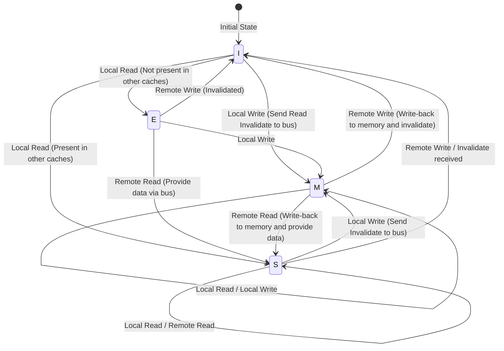

# The Physics of CPU Caches and the MESI Protocol: The Abyss of Coherence and Memory Barriers in Multi-Core

In modern software engineering, correctly understanding the principles of CPU operation is a prerequisite for extracting extreme performance. Now that multi-core architectures have become the standard, the answers to questions like "why do multi-threaded programs become slow?" and "why do mysterious bugs (data races and lack of visibility) occur?" all ultimately come down to the physics of "cache coherence" and "memory consistency models" unfolding on the CPU's silicon die.

In this article, starting from the fundamental physical constraints of CPU caches, we will thoroughly and with academic and practical depth explain the basic structure of cache architecture, the cache coherence problem in multi-core, its complete resolution through the MESI protocol, the side effects and memory barriers brought about by hardware optimizations (store buffers, invalidate queues), and the False Sharing that software engineers face.

---

## Chapter 1: The Speed of Light Barrier and the Memory Wall Problem

### 1.1 The Physical Limit of the Speed of Light and Latency
Today, as CPU clock frequencies have reached several GHz, we face the absolute physical law known as the "speed of light barrier." For example, for a CPU running at 5GHz, one clock cycle is a mere 0.2 nanoseconds (ns). Light (electromagnetic waves) travels about 300,000 km per second in a vacuum, but the distance it can cover in 0.2 nanoseconds is only about 6 centimeters. Because electrical signals travel through copper wires and silicon at about half to two-thirds the speed of light, the physical distance a signal can reach in one clock cycle is only a few centimeters.

This presents the brutal fact that, as long as main memory (DRAM) is placed on the motherboard several to over ten centimeters away from the CPU core, as a matter of physics, "accessing memory in a single clock cycle is absolutely impossible."

### 1.2 The Memory Wall Problem
Since the 1990s, CPU computational speeds have improved exponentially following Moore's Law, but the improvement in DRAM access speeds has remained gradual. This divergence in the pace of performance improvement between CPU and memory is known as the "Memory Wall problem."
Specific latency hierarchies (Numbers Every Programmer Should Know) are shown below:

- **L1 cache reference**: ~0.5 to 1 ns (~3 to 4 cycles)
- **L2 cache reference**: ~3 to 7 ns (~10 to 15 cycles)
- **L3 cache reference**: ~15 to 20 ns (~40 to 60 cycles)
- **Main memory (DRAM) reference**: ~100 ns (~300 to 400 cycles)

Main memory access is about 100 to 200 times slower than accessing the L1 cache. While the CPU waits for data from main memory, the pipeline will stall for hundreds of cycles. The "hierarchical cache architecture" was introduced to hide this catastrophic delay.

### 1.3 Cache Lines: Why 64 Bytes?
Caches do not manage data on a byte-by-byte basis. Typically, in modern x86_64 and ARM architectures, data is fetched and managed from main memory in chunks of "64 bytes." This 64-byte unit is called a "Cache Line."

Why 64 bytes? This involves a trade-off between the principle of "Spatial Locality," hardware implementation costs, and the efficiency of DRAM burst transfers.
When a program accesses a certain memory address, the probability that it will access adjacent addresses immediately after is extremely high (e.g., array traversal). Therefore, by fetching not only the requested data but also surrounding data all at once, the cache hit rate can be dramatically improved.
Additionally, the DRAM interface is designed so that throughput is higher when sending a certain chunk (burst) continuously, rather than sending small amounts of data many times. 64 bytes is the value derived from years of experience and simulation as the "sweet spot" that suppresses the overhead of management tags, prevents wasting bandwidth, and fully exploits spatial locality.

---

## Chapter 2: Cache Construction Methods

For cache memory utilizing SRAM inside the CPU, the key is how efficiently it can hold copies of main memory within a limited capacity. There are mainly three models for determining where in the small cache the vast address space of main memory is mapped.

### 2.1 The Three Cache Mapping Methods

1. **Direct Mapped**
   A method where a specific address in main memory can only be placed in exactly one location in the cache. The implementation is very simple and fast, but when multiple addresses compete (conflict) for the same cache entry, alternating accesses will constantly cause cache misses, making it prone to "Thrashing."

2. **Fully Associative**
   A method where data from main memory can be placed "anywhere" in the cache. The occurrence of thrashing is minimized, but when searching for data, all entries in the cache must be compared and searched simultaneously. This requires special, expensive, and power-hungry hardware called CAM (Content Addressable Memory), making it inapplicable for large capacities (tens of thousands of entries) like L1 caches.

3. **Set Associative**
   A compromise between Direct Mapped and Fully Associative, and the mainstream for modern CPU caches. The cache is divided into several "Sets," and the set to be accessed is uniquely determined from the memory address (Direct Mapped characteristic). Then, within that set, it can be placed anywhere among several "Ways" (Fully Associative characteristic). For example, in an "8-way set associative" cache, there are 8 storage locations within a single set.

### 2.2 Memory Address Bit Decomposition (Tag, Index, Offset)

When the CPU searches for a memory address in the cache, the address is physically divided (bit-decomposed) and interpreted in three parts.

- **Offset**: Indicates which byte within the cache line (e.g., 64 bytes = 2^6) is pointed to. The lower 6 bits.
- **Index**: Indicates which "set" in the cache it maps to.
- **Tag**: The upper bits used to verify if the data stored in that set is truly from the requested main memory address.

Example: 32-bit address, 64KB 4-way set associative cache, 64-byte cache line.
Number of cache lines = 64KB / 64B = 1024.
Since it is 4-way, the number of sets = 1024 / 4 = 256 sets (2^8).
- Offset: Lower 6 bits
- Index: Next 8 bits
- Tag: Remaining 18 bits

### 2.3 Cache Replacement Algorithms
If it becomes necessary to store new data when a set is full, one of the existing ways must be evicted. The most common algorithm is **LRU (Least Recently Used)**.
However, as the number of ways increases, the hardware cost to implement true LRU (tracking bits and update logic) becomes unrealistic. Therefore, modern processors use **Pseudo-LRU (like Tree-PLRU)** or sometimes random replacement instead of perfect LRU, to strike an optimal balance between hardware resources and hit rate.

---

## Chapter 3: The Mechanism of the Cache Coherence Problem

In the single-core era, we only had to consider maintaining data consistency between the cache and main memory (write-back or write-through). However, in the multi-core era, true terror unfolds.

### 3.1 The Tragedy of Shared Variables
Imagine a situation where Core 0 and Core 1 exist, and both read and write the same variable `X` (initial value 0) in main memory.

1. Core 0 reads `X`. `X=0` is loaded into Core 0's L1 cache.
2. Core 1 reads `X`. `X=0` is also loaded into Core 1's L1 cache.
3. Core 0 rewrites `X` to `1`. In Core 0's L1 cache, `X=1`. (Due to the write-back policy, it is not yet written back to main memory).
4. Core 1 reads `X`. Core 1 checks its own L1 cache and gets `X=0`.

For the variable `X`, which is supposed to be physically shared, completely different values are visible to Core 0 and Core 1. This is the "cache coherence problem." To solve this, a protocol that synchronizes the state among the caches of each core is required.

### 3.2 Snooping and Directory Methods
Architectures for maintaining coherence can be broadly divided into two approaches.

- **Snooping**
   A method where all cache controllers constantly "snoop" (eavesdrop) on transactions on the shared memory bus. By detecting signals from someone trying to write to memory or request a cache line, they autonomously update their own cache state. It operates with extremely low latency for small to medium-scale multi-core systems (up to dozens of cores), but as the number of cores increases, it fails to scale because the bus bandwidth is saturated with broadcasts.

- **Directory-based**
   A method that manages information about which core's cache each cache line resides in via a central "directory." When a core performs a write, instead of broadcasting, it queries the directory and sends invalidation messages point-to-point only to the affected cores. It is adopted in large-scale many-core processors (such as Xeons and EPYCs for servers).

In this article, we focus on the foundational and most important concept, the snoop-based "MESI protocol."

---

## Chapter 4: Complete Analysis of the MESI Protocol

The de facto standard and foundation for cache coherence protocols is the **MESI Protocol**. MESI manages each cache line by giving it a 2-bit state flag, placing it into one of the following four states.

### 4.1 The Four States (Modified, Exclusive, Shared, Invalid)

1. **M (Modified)**
   - This cache line is present "only" in this core's cache and has been "modified (Dirty)" from the value in main memory.
   - This core is obligated to write the changes back to memory (Write-back).

2. **E (Exclusive)**
   - This cache line is present "only" in this core's cache and "matches (Clean)" the value in main memory.
   - The core can transition to the M state and freely write to it at any time without notifying other cores.

3. **S (Shared)**
   - This cache line may be present in the caches of multiple cores and "matches (Clean)" the value in main memory.
   - It can be read freely, but to write to it, an "Invalidate" message must be sent to all other cores, temporarily invalidating this state.

4. **I (Invalid)**
   - This cache line does not contain valid data. It is synonymous with a cache miss state.

### 4.2 State Transition Dynamics

The state transitions dynamically depending on access from the core itself (Local Read / Local Write) and access from other cores via the bus (Remote Read / Remote Write / Invalidate).

Below is a Mermaid diagram showing the primary state transitions of the MESI protocol.



### 4.3 MESI Operation Simulation
Let's trace the previously mentioned "tragedy of shared variables" scenario using the MESI protocol.

1. **Core 0 Reads `X`:** Core 0 issues a Read request to the bus. Since no other core has it, it is fetched from memory, and the state becomes **E (Exclusive)**.
2. **Core 1 Reads `X`:** Core 1 issues a Read request. Core 0 snoops this and responds, dropping its state to **S (Shared)**. Core 1 also loads it into its cache in the **S** state.
3. **Core 0 Writes to `X` (`X=1`):** Since Core 0's state is **S**, it sends an "Invalidate" signal to the bus. Core 1 receives this and sets its `X` to **I (Invalid)**. After receiving all Invalidate Acks, Core 0 elevates its state to **M (Modified)** and updates the cache line.
4. **Core 1 Reads `X`:** Since Core 1's cache is **I**, a cache miss occurs. It issues a Read request to the bus. Core 0 (currently **M**) detects this, writes the latest value `X=1` back to memory (Write-back), and simultaneously provides the data to Core 1. Both of their states become **S (Shared)**.

In this way, the MESI protocol guarantees completely transparent data coherence at the hardware level.

### 4.4 MESI Protocol Extensions: MOESI and MESIF
In actual modern processors, optimized protocols based on MESI are used.
- **MOESI (AMD, etc.)**: Adds the **O (Owned)** state. When read by another core from the M state, write-back to memory is delayed, and it continues to provide dirty data directly to other caches as the Owner, thereby saving memory bandwidth.
- **MESIF (Intel, etc.)**: Adds the **F (Forward)** state. When multiple cores hold the S state, if there is a Read request from another core, the bus would conflict if everyone responded. The core that last read it is placed in the F state, and only the F state core acts as the representative to respond, optimizing traffic.

---

## Chapter 5: Store Buffers, Invalidate Queues, and Memory Barriers

The MESI protocol described up to Chapter 4 seems perfect, but it has a fatal performance flaw: "write latency."

### 5.1 MESI's Performance Limits and the Introduction of Store Buffers
When Core 0 tries to write to a cache line in the S state, it must send an Invalidate request to the bus and wait for an "Invalidate Ack" response from all other cores. This communication round-trip takes dozens to hundreds of cycles. The CPU pipeline completely stalls during this time.

To solve this, hardware engineers introduced the **Store Buffer**.
When the CPU core performs a write, instead of waiting for invalidation completion from the cache controller, it temporarily tosses the data and address to be written into the "store buffer." The CPU then immediately proceeds to execute the next instruction. The store buffer waits asynchronously for Invalidate Acks, and once they are gathered, it writes to the L1 cache (M state).

Although this mechanism speeds up writes, it requires a feature called "Store Forwarding." When a core reads a value it just wrote, since it has not yet been reflected in the L1 cache, it must peek into the store buffer to pick up the latest value.

### 5.2 Accelerating Acks via Invalidate Queues
The store buffer is very small, so it quickly fills up and causes stalls. Why are Invalidate Acks slow? Because even if another core receives an Invalidate request, if that core's cache is busy, the invalidation process is delayed.
To solve this, a core that receives an invalidation request throws the request into an **Invalidate Queue** and immediately returns an "Ack" before actually invalidating the cache. The invalidation process is performed asynchronously later.

### 5.3 Destruction of Memory Coherence by Hardware
While store buffers and invalidate queues dramatically improved performance, they destroyed "Sequential Consistency" as the price.

Consider the following famous example. (Initial values `A = 0`, `B = 0`)

```c
// Core 0                  // Core 1
A = 1;                     B = 1;
print(B);                  print(A);
```

If the MESI protocol was strictly adhered to, at least one of the writes would complete first, so it would be absolutely impossible for both to print `0`.
However, on a real CPU, both might print `0`.
1. Core 0 writes `A=1` to its store buffer and moves on.
2. Core 1 writes `B=1` to its store buffer and moves on.
3. Core 0 reads `B`, but since Core 1's write is still in Core 1's store buffer, it reads `B=0`.
4. Core 1 reads `A`, but since Core 0's write is still in Core 0's store buffer, it reads `A=0`.

This is the lack of "visibility" caused by out-of-order execution and hardware optimizations.

### 5.4 Memory Barriers (Memory Fences)
To solve this problem, there is a need for instructions from the software side that tell the hardware, "strictly preserve the order from here on" and "flush the store buffer." These are **Memory Barriers (Memory Fences)**.

- **Store Barrier (Write Memory Barrier, `smp_wmb()`)**: Makes subsequent writes wait until all writes in the store buffer are committed to the cache.
- **Load Barrier (Read Memory Barrier, `smp_rmb()`)**: Makes subsequent reads wait until all invalidation requests in the invalidate queue are processed.
- **Full Barrier (Full Memory Barrier, `smp_mb()`)**: Does both of the above.

The x86 architecture employs a relatively strong consistency model called **TSO (Total Store Order)**, and the order of normal reads and writes is largely preserved (only when a store is followed by a load can the order be reversed). On the other hand, the ARM architecture employs **Weak Consistency**, and instruction execution order is reordered extremely freely unless barriers are explicitly specified.

### 5.5 Acquire-Release Semantics
In modern languages (C++11 and later, Rust, Java, etc.), rather than directly writing complex, CPU-specific barrier instructions, we control consistency using higher-level "Acquire/Release semantics."
- **Release**: When passing data to another thread, guarantees that all preceding writes have completed.
- **Acquire**: When receiving data from another thread, guarantees that all subsequent reads will fetch the latest data.

---

## Chapter 6: The Reality Faced by Software Engineers

We have peeked into the abyss of hardware up to this point, but finally, we will explain how this directly connects to the code we software engineers write.

### 6.1 The Tragedy of False Sharing
One of the worst performance killers in multi-threaded programming is **False Sharing**.

We stated that a cache line is a 64-byte chunk. What happens if completely unrelated variables `A` and `B` are adjacent in memory and end up on the same 64-byte cache line?

```cpp
struct Counter {
    volatile long long thread1_count; // Frequently updated by Core 0
    volatile long long thread2_count; // Frequently updated by Core 1
};
Counter c;
```

When Core 0 updates `thread1_count`, according to the MESI protocol, the entire cache line goes into the M state, and Core 1's cache line is invalidated.
Immediately after, when Core 1 tries to update `thread2_count`, a cache miss occurs, and it refetches the latest cache line from main memory (or Core 0's cache). Then, Core 0 is invalidated in turn.

Even though completely different variables are being manipulated in the program, at the hardware level, a fierce Ping-Pong (cache line tug-of-war) occurs between the cores over the "ownership" of the 64-byte cache line. This causes the tragedy of making the program slower than a single-threaded version, despite being multi-threaded.

### 6.2 Resolution via Cache Line Alignment
To prevent this False Sharing, we can force the memory layout so that variables are placed in different cache lines. In C++11 and later, the `alignas` specifier is used.

```cpp
#include <atomic>
#include <thread>
#include <vector>

// Hardware destructive interference size (typically 64 bytes)
#ifdef __cpp_lib_hardware_interference_size
    using std::hardware_destructive_interference_size;
#else
    constexpr std::size_t hardware_destructive_interference_size = 64;
#endif

struct AlignedCounter {
    // Place thread1_count at the beginning of a cache line and pad the rest
    alignas(hardware_destructive_interference_size) std::atomic<long long> thread1_count{0};
    
    // Place thread2_count at the beginning of another cache line
    alignas(hardware_destructive_interference_size) std::atomic<long long> thread2_count{0};
};

int main() {
    AlignedCounter c;
    
    auto worker1 = [&c]() {
        for (int i = 0; i < 10000000; ++i) {
            // relaxed is sufficient (no dependencies on other variables)
            c.thread1_count.fetch_add(1, std::memory_order_relaxed);
        }
    };
    
    auto worker2 = [&c]() {
        for (int i = 0; i < 10000000; ++i) {
            c.thread2_count.fetch_add(1, std::memory_order_relaxed);
        }
    };
    
    std::thread t1(worker1);
    std::thread t2(worker2);
    
    t1.join();
    t2.join();
    
    return 0;
}
```

By appending `alignas(64)` in this way, appropriate padding is inserted between variables, separating their physical cache lines. This breaks the chain of unnecessary invalidations by the MESI protocol, achieving true parallel performance.

### 6.3 Lock-free Data Structures and Memory Order
In even more advanced Lock-free programming, atomic operations and memory barriers are optimized to the limit. The `memory_order` specification in C++'s `std::atomic` is exactly for directly controlling the hardware barrier instructions explained in Chapter 5.

- `memory_order_seq_cst`: The default. The safest, but issues a heavy full barrier (`smp_mb`).
- `memory_order_acquire` / `memory_order_release`: Issues load and store barriers, establishing a synchronization relationship for variables.
- `memory_order_relaxed`: Issues no barriers at all, only guaranteeing that the operation is atomic (indivisible). The final value match is guaranteed by cache coherence (MESI), but the visibility order of other variables is not guaranteed at all.

In designs like Lock-free queues, it is required to have a "design attuned to CPU physics," such as removing unnecessary barriers, appropriately combining `relaxed` and `acquire/release`, and separating the Head and Tail of a Ring Buffer into different cache lines to avoid False Sharing.

## Conclusion

The assignment statements to variables that we routinely write become electrical signals on silicon, travel through hierarchical caches, trigger complex state transitions of the MESI protocol, pass through storms of store buffers and invalidate queues, and finally become finalized.
The abstraction principle that "software hides hardware" is wonderful, but in the world of concurrent programming where extreme performance is demanded, transcending the wall of abstraction to understand the truth of the physical layer is the only way forward.
