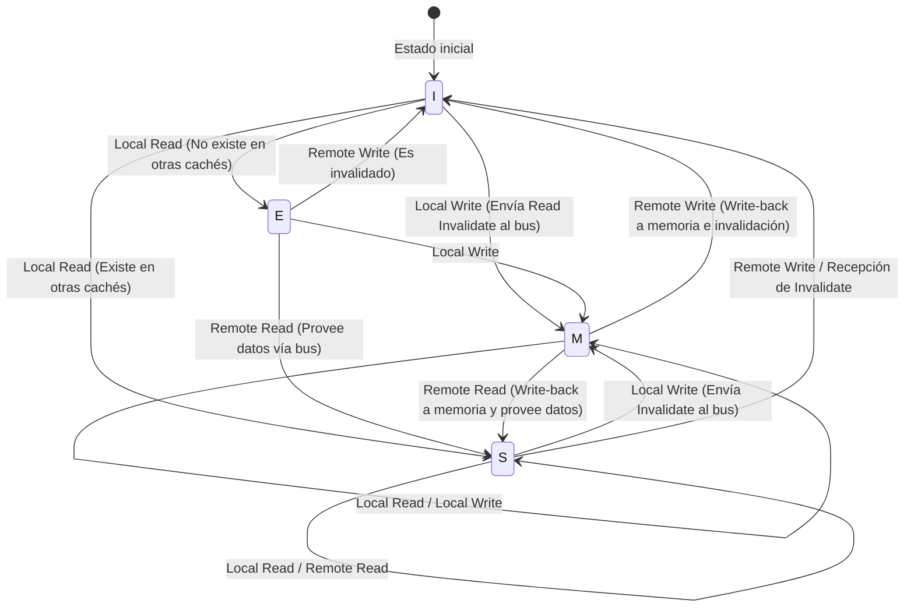

# Física de la caché de CPU y el protocolo MESI: la profundidad de la coherencia en multinúcleo y barreras de memoria

En la ingeniería de software moderna, entender correctamente los principios de funcionamiento de la CPU es un requisito indispensable para exprimir al máximo el rendimiento. Especialmente ahora que la arquitectura multinúcleo se ha convertido en el estándar, las respuestas a preguntas como "¿por qué los programas multihilo se vuelven lentos?" o "¿por qué ocurren errores misteriosos (condiciones de carrera o falta de visibilidad)?" se reducen por completo a la física de la "coherencia de caché" y a los "modelos de consistencia de memoria" que se desarrollan en el chip de silicio de la CPU.

En este artículo, partiendo de las restricciones físicas subyacentes a la caché de CPU, explicaremos a fondo de forma académica y práctica la estructura básica de la arquitectura de caché, el problema de la coherencia de caché en multinúcleo, su solución: el análisis completo del protocolo MESI, y también los efectos secundarios que traen las optimizaciones de hardware (búferes de almacenamiento, colas de invalidación) y las barreras de memoria, hasta la falsa compartición (False Sharing) que enfrentan los ingenieros de software.

---

## Capítulo 1: El muro de la velocidad de la luz y el problema del muro de memoria

### 1.1 El límite físico de la velocidad de la luz y la latencia
Hoy en día, cuando la frecuencia de reloj de las CPU ha alcanzado varios GHz, nos enfrentamos a la ley física absoluta del "muro de la velocidad de la luz". Por ejemplo, en una CPU que funciona a 5GHz, un ciclo de reloj dura apenas 0.2 nanosegundos (ns). La distancia que la luz (ondas electromagnéticas) recorre en un segundo en el vacío es de aproximadamente 300,000 km, pero la distancia que puede recorrer en 0.2 nanosegundos es solo de unos 6 centímetros. Dado que la velocidad a la que las señales eléctricas viajan a través de cables de cobre o silicio es de la mitad a dos tercios de la velocidad de la luz, la distancia física que una señal puede alcanzar en un ciclo de reloj es de apenas unos pocos centímetros.

Esto indica la cruel realidad de que, mientras la memoria principal (DRAM) esté situada en la placa base a varios centímetros o decenas de centímetros de los núcleos de la CPU, como ley física "es absolutamente imposible acceder a la memoria en un solo ciclo de reloj".

### 1.2 El problema del muro de memoria
Desde la década de 1990, la velocidad de cálculo de las CPU ha mejorado exponencialmente siguiendo la ley de Moore, pero la mejora de la velocidad de acceso a la DRAM ha sido gradual. Esta divergencia en el ritmo de mejora del rendimiento entre la CPU y la memoria se conoce como el "problema del muro de memoria (Memory Wall)".
Las latencias específicas en la jerarquía (Numbers Every Programmer Should Know) se muestran a continuación:

- **Referencia a caché L1**: Aprox. 0.5 a 1 ns (aprox. 3 a 4 ciclos)
- **Referencia a caché L2**: Aprox. 3 a 7 ns (aprox. 10 a 15 ciclos)
- **Referencia a caché L3**: Aprox. 15 a 20 ns (aprox. 40 a 60 ciclos)
- **Referencia a memoria principal (DRAM)**: Aprox. 100 ns (aprox. 300 a 400 ciclos)

El acceso a la memoria principal es de 100 a 200 veces más lento que el acceso a la caché L1. Mientras la CPU espera datos de la memoria principal, el pipeline se bloquea (stall) durante cientos de ciclos. Para ocultar esta latencia desesperante, se introdujo la "arquitectura jerárquica de caché".

### 1.3 Línea de caché: ¿Por qué 64 bytes?
La caché no administra los datos byte a byte. Normalmente, en las arquitecturas modernas x86_64 o ARM, los datos se obtienen (fetch) desde la memoria principal y se gestionan en fragmentos de "64 bytes". A esta unidad de 64 bytes se le llama "línea de caché (Cache Line)".

¿Por qué 64 bytes? Esto implica un equilibrio entre el principio de "localidad espacial (Spatial Locality)", los costes de implementación del hardware y la eficiencia de transferencia en ráfaga (burst) de la DRAM.
Los programas tienen una probabilidad altísima de acceder a direcciones adyacentes inmediatamente después de acceder a una dirección de memoria (como al recorrer un array). Por lo tanto, al obtener de una vez no solo los datos solicitados sino también los datos circundantes, la tasa de aciertos (hit rate) de la caché puede aumentar drásticamente.
Además, la interfaz de la DRAM está diseñada para lograr un mayor rendimiento (throughput) enviando una cierta cantidad de bloque (ráfaga) de forma continua en lugar de enviar pequeñas cantidades de datos muchas veces. Los 64 bytes son un valor derivado de años de experiencia y simulaciones como un "punto óptimo" (sweet spot) que reduce la sobrecarga de la etiqueta (Tag) de gestión, previene el desperdicio del ancho de banda y aprovecha completamente la localidad espacial.

---

## Capítulo 2: Métodos de construcción de la caché

Para la memoria caché que utiliza SRAM dentro de la CPU, la clave es cuán eficientemente se mantienen las copias de la memoria principal dentro de una capacidad limitada. Existen tres modelos principales para determinar cómo mapear el vasto espacio de direcciones de la memoria principal a las ubicaciones de la pequeña caché.

### 2.1 Tres métodos de mapeo de caché

1. **Mapeo directo (Direct Mapped)**
   Un método en el que una dirección específica de la memoria principal solo puede colocarse en un único lugar dentro de la caché. Su implementación es muy simple y rápida, pero si múltiples direcciones compiten (conflict) por la misma entrada de caché, y se accede a ellas alternadamente, es probable que se produzca "thrashing" donde constantemente ocurren fallos de caché (cache misses).

2. **Completamente asociativo (Fully Associative)**
   Un método en el que los datos de la memoria principal pueden colocarse en "cualquier lugar" de la caché. La ocurrencia de thrashing se minimiza, pero requiere buscar y comparar simultáneamente todas las entradas de la caché para encontrar los datos. Por esta razón, se necesita un hardware especial, caro y de alto consumo energético llamado memoria direccionable por contenido (CAM: Content Addressable Memory), lo que hace que no sea aplicable a cachés de gran capacidad (decenas de miles de entradas) como la caché L1.

3. **Asociativo por conjuntos (Set Associative)**
   Un compromiso entre el mapeo directo y el completamente asociativo, y la corriente principal de las cachés de CPU modernas. La caché se divide en varios "conjuntos (Sets)", y el conjunto al que se debe acceder se determina unívocamente a partir de la dirección de memoria (propiedad de mapeo directo). Luego, dentro de ese conjunto, se puede colocar en cualquiera de las "vías (Ways)" (propiedad completamente asociativa). Por ejemplo, si es "asociativo por conjuntos de 8 vías (8-way set associative)", hay 8 ubicaciones de almacenamiento dentro de un mismo conjunto.

### 2.2 Descomposición de bits de la dirección de memoria (Tag, Index, Offset)

Cuando la CPU busca una dirección de memoria en la caché, la dirección se interpreta dividiéndose físicamente en tres partes (descomposición de bits).

- **Offset (Desplazamiento)**: Indica a qué byte dentro de la línea de caché (ej.: 64 bytes = 2^6) se apunta. Los 6 bits inferiores.
- **Index (Índice)**: Indica a qué "conjunto" de la caché se mapea.
- **Tag (Etiqueta)**: Los bits superiores utilizados para verificar si los datos almacenados en ese conjunto pertenecen realmente a la dirección de memoria principal solicitada.

Ejemplo: En el caso de una dirección de 32 bits, una caché asociativa por conjuntos de 4 vías de 64 KB y una línea de caché de 64 bytes.
El número de líneas de caché es 64KB / 64B = 1024.
Como son 4 vías, el número de conjuntos es 1024 / 4 = 256 conjuntos (2^8).
- Offset: 6 bits inferiores
- Index: Los siguientes 8 bits
- Tag: Los 18 bits restantes

### 2.3 Algoritmos de reemplazo de caché
Cuando un conjunto está lleno y surge la necesidad de almacenar nuevos datos, es necesario expulsar (Evict) una de las vías existentes. El algoritmo más común es **LRU (Least Recently Used: el usado menos recientemente)**.
Sin embargo, a medida que aumenta el número de vías, el coste de hardware para implementar el verdadero LRU (bits de seguimiento y lógica de actualización) se vuelve irrealista. Por lo tanto, los procesadores modernos no utilizan un LRU perfecto, sino **Pseudo-LRU (como Tree-PLRU)** o, en algunos casos, reemplazo aleatorio para encontrar el equilibrio óptimo entre recursos de hardware y la tasa de aciertos.

---

## Capítulo 3: El mecanismo de aparición del problema de coherencia de caché

En la era de un solo núcleo, solo necesitábamos pensar en mantener la consistencia de los datos (Write-back o Write-through) entre la caché y la memoria principal. Sin embargo, en la era multinúcleo, comienza el verdadero terror.

### 3.1 La tragedia de las variables compartidas
Imagina una situación en la que existen Core 0 y Core 1, y ambos leen y escriben en la misma variable `X` (valor inicial 0) en la memoria principal.

1. Core 0 lee `X`. `X=0` se carga en la caché L1 de Core 0.
2. Core 1 lee `X`. `X=0` también se carga en la caché L1 de Core 1.
3. Core 0 sobrescribe `X` con `1`. En la caché L1 de Core 0, `X=1`. (Debido al método Write-back, aún no se reescribe en la memoria principal).
4. Core 1 lee `X`. Core 1 consulta su propia caché L1 y obtiene `X=0`.

Para la variable `X`, que físicamente debería ser compartida, Core 0 y Core 1 están viendo valores completamente diferentes. A esto se le llama el "problema de coherencia de caché (cache coherence)". Para solucionarlo, se necesita un protocolo que sincronice el estado entre las cachés de cada núcleo.

### 3.2 El método de fisgoneo (Snooping) y el método basado en directorio
Las arquitecturas para mantener la coherencia se dividen en general en dos enfoques.

- **Método de fisgoneo (Snooping)**
  Un método en el que todos los controladores de caché "fisgonean (snoop)" o escuchan permanentemente las transacciones en el bus de memoria compartido. Detectan señales de alguien intentando escribir en la memoria o solicitando una línea de caché, y actualizan el estado de su propia caché de forma autónoma. Funciona con una latencia extremadamente baja en multinúcleos de pequeña y mediana escala (hasta unas docenas de núcleos), pero no escala cuando aumenta el número de núcleos porque el ancho de banda del bus se satura con las transmisiones por difusión (broadcast).

- **Método basado en directorio (Directory-based)**
  Un método en el que la información de en qué caché de núcleo existe cada línea de caché se gestiona en un "directorio" central. Cuando un núcleo realiza una escritura, no realiza una transmisión por difusión, sino que consulta el directorio y envía mensajes de invalidación de punto a punto (point-to-point) solo a los núcleos pertinentes. Se emplea en procesadores many-core a gran escala (como Xeon y EPYC para servidores).

En este artículo, nos centraremos en el protocolo "MESI" basado en snooping, que es el concepto básico y más importante.

---

## Capítulo 4: Análisis completo del protocolo MESI

El estándar de facto de los protocolos de coherencia de caché y su fundamento es el **protocolo MESI (pronunciado mesi)**. MESI proporciona a cada línea de caché una bandera (flag) de estado de 2 bits y la administra como uno de los siguientes cuatro estados (States).

### 4.1 Los 4 estados (Modified, Exclusive, Shared, Invalid)

1. **M (Modified - Modificado)**
   - Esta línea de caché existe "solo" en la caché de este núcleo, y ha sido "modificada (Dirty)" respecto al valor en la memoria principal.
   - Este núcleo tiene la obligación de escribir los cambios de vuelta en la memoria (Write-back).

2. **E (Exclusive - Exclusivo)**
   - Esta línea de caché existe "solo" en la caché de este núcleo, y "coincide (Clean)" con el valor de la memoria principal.
   - Puede transicionar al estado M en cualquier momento sin notificar a otros núcleos y escribir libremente.

3. **S (Shared - Compartido)**
   - Esta línea de caché puede existir en la caché de varios núcleos, y "coincide (Clean)" con el valor de la memoria principal.
   - Se puede leer libremente, pero para realizar una escritura es necesario enviar un mensaje de "Invalidate (invalidación)" a todos los demás núcleos e invalidar temporalmente este estado.

4. **I (Invalid - Inválido)**
   - Esta línea de caché no contiene datos válidos. Es sinónimo de un estado de fallo de caché (cache miss).

### 4.2 Dinámica de transiciones de estado

El estado transiciona dinámicamente mediante accesos del propio núcleo (Local Read / Local Write) y accesos desde otros núcleos a través del bus (Remote Read / Remote Write / Invalidate).

A continuación se muestra un diagrama Mermaid que ilustra las principales transiciones de estado del protocolo MESI.



### 4.3 Simulación de la operación de MESI
Sigamos el escenario de "La tragedia de las variables compartidas" anterior con el protocolo MESI.

1. **Core 0 hace Read a `X`:** Core 0 envía una solicitud de Read al bus. Dado que otros núcleos no la tienen, la obtiene de la memoria y el estado pasa a ser **E (Exclusive)**.
2. **Core 1 hace Read a `X`:** Core 1 envía una solicitud de Read. Core 0 fisgonea esto, responde y reduce el estado a **S (Shared)**. Core 1 también lo incorpora a su caché en el estado **S**.
3. **Core 0 hace Write a `X` (`X=1`):** Dado que el estado de Core 0 es **S**, envía una señal de "Invalidate (invalidación)" al bus. Core 1 la recibe y marca su propio `X` como **I (Invalid)**. Después de que Core 0 recibe todas las confirmaciones (Ack) de Invalidate, eleva el estado a **M (Modified)** y actualiza la línea de caché.
4. **Core 1 hace Read a `X`:** La caché de Core 1 es **I**, por lo que ocurre un fallo de caché. Envía una solicitud de Read al bus. Core 0 (actualmente en **M**) detecta esto, escribe el último valor `X=1` de vuelta a la memoria (Write-back), y al mismo tiempo provee los datos a Core 1. El estado de ambos pasa a ser **S (Shared)**.

De esta manera, el protocolo MESI garantiza una consistencia de datos completamente transparente a nivel de hardware.

### 4.4 Extensiones del protocolo MESI: MOESI y MESIF
En los procesadores reales modernos, se utilizan protocolos que optimizan MESI.
- **MOESI (AMD, etc.)**: Añade un nuevo estado **O (Owned)**. Cuando es leído por otro núcleo desde el estado M, se retrasa el Write-back a la memoria, ahorrando ancho de banda de memoria al continuar proporcionando directamente los datos modificados (dirty) a otras cachés como el propietario (Owner).
- **MESIF (Intel, etc.)**: Añade un nuevo estado **F (Forward)**. Cuando varios núcleos tienen el estado S, si hay una solicitud de Read desde otro núcleo, si todos responden, habrá colisiones en el bus. El núcleo que hizo la última lectura toma el estado F, y solo el núcleo en estado F responde como representante, optimizando el tráfico.

---

## Capítulo 5: Búfer de almacenamiento, cola de invalidación y barreras de memoria

Hasta el capítulo 4, el protocolo MESI parece perfecto, pero tiene un defecto de rendimiento fatal. Es la "latencia de escritura".

### 5.1 Los límites de rendimiento de MESI y la introducción de los búferes de almacenamiento
Cuando Core 0 intenta escribir en una línea de caché en estado S, debe enviar una solicitud de Invalidate al bus y esperar una respuesta de "invalidado (Invalidate Ack)" de todos los demás núcleos. Esta ida y vuelta (round-trip) de comunicación toma de decenas a cientos de ciclos. Durante este tiempo, el pipeline de la CPU se bloquea completamente.

Para solucionar esto, los ingenieros de hardware introdujeron el **búfer de almacenamiento (Store Buffer)**.
Cuando un núcleo de la CPU realiza una escritura, no espera a que se complete el Invalidate al controlador de la caché, sino que temporalmente coloca los datos y la dirección a escribir en el "búfer de almacenamiento". Luego, la CPU pasa inmediatamente a ejecutar la siguiente instrucción. El búfer de almacenamiento espera asíncronamente los Invalidate Ack, y una vez completados, los escribe en la caché L1 (estado M).

Mediante este mecanismo se aceleran las escrituras, pero se hace necesaria una función llamada "envío de almacenamiento (Store Forwarding)". Cuando un núcleo necesita leer inmediatamente un valor que acaba de escribir, dado que aún no se ha reflejado en la caché L1, debe echar un vistazo al búfer de almacenamiento y recuperar el último valor.

### 5.2 Aceleración de Acks mediante la cola de invalidación
El búfer de almacenamiento es muy pequeño, por lo que se llena rápidamente y causa bloqueos. ¿Por qué es lento el Invalidate Ack? Porque, incluso si otro núcleo recibe la solicitud de Invalidate, si la caché de ese núcleo está ocupada, el procesamiento de la invalidación se retrasa.
Para solucionar esto, el núcleo que recibe la solicitud de invalidación, antes de invalidar realmente la caché, inserta la solicitud en la **cola de invalidación (Invalidate Queue)** y devuelve inmediatamente un "Ack". El procesamiento de invalidación se realiza asíncronamente más tarde.

### 5.3 Destrucción de la consistencia de memoria por parte del hardware
El búfer de almacenamiento y la cola de invalidación mejoraron drásticamente el rendimiento, pero a costa de destruir la "consistencia secuencial (Sequential Consistency)".

Consideremos el siguiente ejemplo famoso. (Valores iniciales `A = 0`, `B = 0`)

```c
// Core 0                  // Core 1
A = 1;                     B = 1;
print(B);                  print(A);
```

Si el protocolo MESI se cumpliera estrictamente, al menos una de las escrituras se completaría primero, por lo que es absolutamente imposible que ambos impriman `0`.
Sin embargo, en las CPUs reales, ambos podrían imprimir `0`.
1. Core 0 escribe `A=1` en el búfer de almacenamiento y avanza.
2. Core 1 escribe `B=1` en el búfer de almacenamiento y avanza.
3. Core 0 lee `B`, pero como la escritura de Core 1 todavía está en el búfer de almacenamiento de Core 1, lee `B=0`.
4. Core 1 lee `A`, pero como la escritura de Core 0 todavía está en el búfer de almacenamiento de Core 0, lee `A=0`.

Esta es la falta de "visibilidad" causada por la ejecución fuera de orden (out-of-order execution) y las optimizaciones de hardware.

### 5.4 Barreras de memoria (Memory Barrier / Memory Fence)
Para resolver este problema, es necesaria una instrucción que, desde el lado del software, le diga al hardware "de aquí en adelante respeta estrictamente el orden" o "vacía (flush) el búfer de almacenamiento". Eso es la **barrera de memoria (Memory Barrier / Memory Fence)**.

- **Barrera de escritura (Write Memory Barrier, `smp_wmb()`)**: Hace esperar a las escrituras posteriores hasta que todas las escrituras en el búfer de almacenamiento se consoliden (commit) en la caché.
- **Barrera de lectura (Read Memory Barrier, `smp_rmb()`)**: Hace esperar a las lecturas posteriores hasta que se procesen todas las solicitudes de invalidación en la cola de invalidación.
- **Barrera completa (Full Memory Barrier, `smp_mb()`)**: Realiza ambas acciones anteriores.

La arquitectura x86 adopta **TSO (Total Store Order)**, un modelo de consistencia relativamente fuerte, donde el orden normal de lectura y escritura se mantiene bastante (el orden puede invertirse solo cuando una carga (load) viene después de un almacenamiento (store)). Por el contrario, la arquitectura ARM adopta **Weak Consistency (consistencia débil)**, y a menos que se especifique explícitamente una barrera, el orden de ejecución de las instrucciones se reordena libremente de forma extrema.

### 5.5 Semántica de Adquirir-Liberar (Acquire-Release Semantics)
En los lenguajes modernos (C++11 y posteriores, Rust, Java, etc.), en lugar de escribir directamente instrucciones de barrera complejas específicas de cada CPU, se controla la consistencia utilizando una "semántica Acquire / Release" de más alto nivel.
- **Release (Liberar)**: Al pasar datos a otro hilo, garantiza que todas las escrituras anteriores a este punto se hayan completado.
- **Acquire (Adquirir)**: Al recibir datos de otro hilo, garantiza que las lecturas posteriores a este punto obtendrán los datos más recientes.

---

## Capítulo 6: La realidad que enfrentan los ingenieros de software

Hasta aquí hemos asomado al abismo del hardware, pero por último, explicaremos cómo se conecta esto directamente con el código que escribimos los ingenieros de software.

### 6.1 La tragedia de la Falsa Compartición (False Sharing)
Uno de los peores asesinos del rendimiento en la programación multihilo es la **Falsa compartición (False Sharing)**.

Se mencionó que una línea de caché es un bloque de 64 bytes. ¿Qué pasaría si variables totalmente no relacionadas `A` y `B` son adyacentes en la memoria y terminan en la misma línea de caché de 64 bytes?

```cpp
struct Counter {
    volatile long long thread1_count; // Core 0 actualiza frecuentemente
    volatile long long thread2_count; // Core 1 actualiza frecuentemente
};
Counter c;
```

Cuando Core 0 actualiza `thread1_count`, de acuerdo con el protocolo MESI, toda la línea de caché entra en estado M y la línea de caché de Core 1 es invalidada (Invalidate).
Inmediatamente después, cuando Core 1 intenta actualizar `thread2_count`, se produce un fallo de caché, y recupera de nuevo la última línea de caché desde la memoria principal (o desde la caché de Core 0). Y esta vez, el lado de Core 0 es invalidado.

A pesar de que, a nivel de programa, se están manipulando variables completamente diferentes, a nivel de hardware, se produce un feroz "Ping-Pong" (lucha por la línea de caché) entre los núcleos por la "propiedad" de la línea de caché de 64 bytes. Debido a esto, se desencadena la tragedia de que el programa sea más lento en multihilo que en un solo hilo.

### 6.2 Solución mediante la alineación de líneas de caché (Cache Line Alignment)
Para prevenir este False Sharing, basta con forzar el diseño de memoria (memory layout) para que las variables se ubiquen en líneas de caché diferentes. En C++11 o superior, se utiliza el especificador `alignas`.

```cpp
#include <atomic>
#include <thread>
#include <vector>

// Tamaño de la interferencia destructiva de hardware (generalmente 64 bytes)
#ifdef __cpp_lib_hardware_interference_size
    using std::hardware_destructive_interference_size;
#else
    constexpr std::size_t hardware_destructive_interference_size = 64;
#endif

struct AlignedCounter {
    // thread1_count se ubica al principio de la línea de caché y se añade padding detrás
    alignas(hardware_destructive_interference_size) std::atomic<long long> thread1_count{0};
    
    // thread2_count se ubica al principio de una línea de caché distinta
    alignas(hardware_destructive_interference_size) std::atomic<long long> thread2_count{0};
};

int main() {
    AlignedCounter c;
    
    auto worker1 = [&c]() {
        for (int i = 0; i < 10000000; ++i) {
            // "relaxed" es suficiente (porque no hay dependencia con otras variables)
            c.thread1_count.fetch_add(1, std::memory_order_relaxed);
        }
    };
    
    auto worker2 = [&c]() {
        for (int i = 0; i < 10000000; ++i) {
            c.thread2_count.fetch_add(1, std::memory_order_relaxed);
        }
    };
    
    std::thread t1(worker1);
    std::thread t2(worker2);
    
    t1.join();
    t2.join();
    
    return 0;
}
```

De esta manera, al agregar `alignas(64)`, se inserta el relleno (padding) adecuado entre las variables y se separan las líneas de caché físicas. Como resultado, la cadena innecesaria de invalidaciones causadas por el protocolo MESI se corta, logrando un verdadero rendimiento paralelo.

### 6.3 Estructuras de datos Lock-free y el orden de memoria (Memory Order)
En la programación Lock-free más avanzada, las operaciones atómicas y las barreras de memoria se optimizan hasta el límite. Especificar el `memory_order` en el `std::atomic` de C++ sirve exactamente para controlar de forma directa las instrucciones de barrera del hardware explicadas en el Capítulo 5.

- `memory_order_seq_cst`: Por defecto. El más seguro, pero emite una costosa barrera completa (`smp_mb`).
- `memory_order_acquire` / `memory_order_release`: Emiten barreras de carga y de almacenamiento para construir la relación de sincronización de variables.
- `memory_order_relaxed`: No emite ninguna barrera, solo garantiza que la operación sea atómica (no divisible). La consistencia de caché (MESI) garantiza que el valor final coincida, pero el orden de visibilidad respecto a otras variables no está garantizado en absoluto.

En el diseño de colas Lock-free y similares, se requiere un "diseño cercano a la física de la CPU", eliminando las barreras innecesarias y combinando adecuadamente `relaxed` y `acquire/release`, al mismo tiempo que se separan el Head y el Tail del Ring Buffer en líneas de caché distintas para evitar el False Sharing.

## Conclusión

Las sentencias de asignación a variables que escribimos a diario se convierten en señales eléctricas en el silicio, recorren la caché jerárquica, desencadenan las complejas transiciones de estado del protocolo MESI, y pasan a través de tormentas en búferes de almacenamiento y colas de invalidación para finalmente establecerse.
El principio de abstracción, "el software oculta el hardware", es maravilloso, pero en el mundo de la programación concurrente, donde se requiere un rendimiento extremo, superar el muro de la abstracción y comprender las verdades de la capa física es el único camino.
