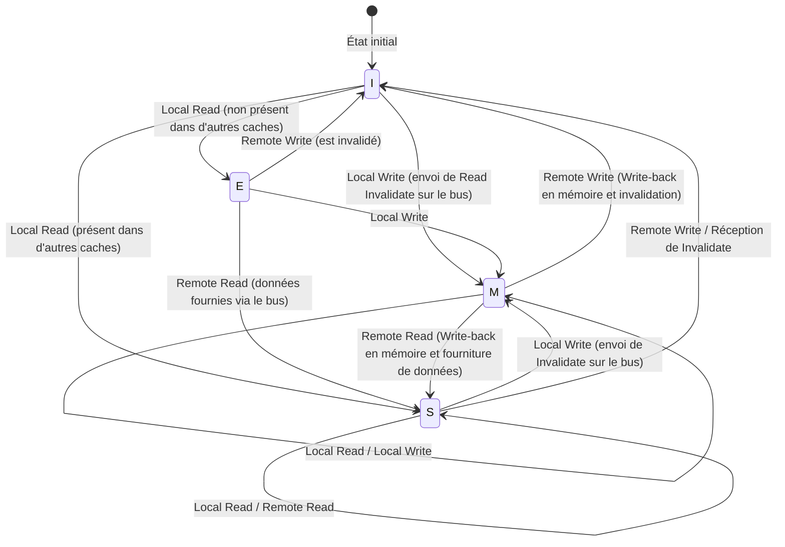

# La physique du cache CPU et le protocole MESI : La cohérence et les abîmes des barrières mémoire dans le multicœur

Dans l'ingénierie logicielle moderne, comprendre correctement les principes de fonctionnement du CPU est une condition sine qua non pour en tirer des performances extrêmes. Surtout maintenant que l'architecture multicœur est devenue la norme, les réponses aux questions telles que « pourquoi les programmes multithreads sont-ils lents ? » ou « pourquoi des bugs mystérieux (concurrence de données ou manque de visibilité) se produisent-ils ? » se résument toutes à la physique de la « cohérence de cache » et des « modèles de cohérence de la mémoire » qui se déploient sur la puce de silicium du CPU.

Cet article part des contraintes physiques sous-jacentes aux caches du CPU pour expliquer en profondeur, de manière académique et pratique, la structure de base de l'architecture des caches, le problème de la cohérence de cache dans le multicœur, son remède qu'est l'analyse complète du protocole MESI, mais aussi les effets secondaires et les barrières mémoire introduits par les optimisations matérielles (store buffers, invalidate queues), jusqu'au faux partage (False Sharing) auquel sont confrontés les ingénieurs logiciels.

---

## Chapitre 1 : Le mur de la vitesse de la lumière et le problème du Memory Wall

### 1.1 La limite physique de la vitesse de la lumière et la latence
À l'heure où les fréquences d'horloge des CPU atteignent plusieurs GHz, nous sommes confrontés à une loi physique absolue : le « mur de la vitesse de la lumière ». Par exemple, pour un CPU fonctionnant à 5 GHz, un cycle d'horloge ne dure que 0,2 nanoseconde (ns). Alors que la lumière (onde électromagnétique) parcourt environ 300 000 km en une seconde dans le vide, la distance qu'elle peut parcourir en 0,2 nanoseconde n'est que d'environ 6 centimètres. Étant donné que la vitesse de propagation des signaux électriques dans le fil de cuivre ou le silicium est d'environ la moitié aux deux tiers de la vitesse de la lumière, la distance physique qu'un signal peut atteindre en un cycle d'horloge se réduit à seulement quelques centimètres.

Tant que la mémoire principale (DRAM) est placée sur la carte mère à quelques centimètres, voire une dizaine de centimètres des cœurs du CPU, cela démontre le fait cruel, comme loi physique, qu'« il est absolument impossible d'accéder à la mémoire en un seul cycle d'horloge ».

### 1.2 Le problème du Memory Wall
Depuis les années 1990, alors que la vitesse de calcul des CPU a augmenté de façon exponentielle selon la loi de Moore, l'amélioration de la vitesse d'accès à la DRAM est restée beaucoup plus lente. Cet écart dans le rythme d'amélioration des performances entre le CPU et la mémoire est appelé le problème du « Memory Wall ».
Voici les hiérarchies spécifiques de latence (Numbers Every Programmer Should Know) :

- **Référence au cache L1** : environ 0,5 à 1 ns (environ 3 à 4 cycles)
- **Référence au cache L2** : environ 3 à 7 ns (environ 10 à 15 cycles)
- **Référence au cache L3** : environ 15 à 20 ns (environ 40 à 60 cycles)
- **Référence à la mémoire principale (DRAM)** : environ 100 ns (environ 300 à 400 cycles)

L'accès à la mémoire principale est environ 100 à 200 fois plus lent que l'accès au cache L1. Pendant que le CPU attend les données de la mémoire principale, le pipeline sera bloqué pendant des centaines de cycles. Pour masquer ce délai désespérant, on a introduit « l'architecture de cache hiérarchique ».

### 1.3 Ligne de cache : Pourquoi 64 octets ?
Le cache ne gère pas les données au niveau de l'octet. En général, dans les architectures modernes x86_64 ou ARM, les données sont récupérées depuis la mémoire principale et gérées par blocs de « 64 octets ». Cette unité de 64 octets est appelée une « ligne de cache » (Cache Line).

Pourquoi 64 octets ? Cela implique un compromis entre le principe de « localité spatiale » (Spatial Locality), le coût de l'implémentation matérielle et l'efficacité des transferts en rafale (burst) de la DRAM.
Les programmes ont une très forte probabilité d'accéder à une adresse adjacente immédiatement après avoir accédé à une certaine adresse mémoire (comme le parcours d'un tableau). Ainsi, en récupérant en même temps non seulement les données demandées mais aussi les données environnantes en un seul bloc, on peut augmenter de manière spectaculaire le taux de succès (hit rate) du cache.
De plus, l'interface de la DRAM est conçue pour offrir un meilleur débit lorsqu'elle envoie une certaine quantité de données en continu (rafale) plutôt que d'envoyer de petites quantités à plusieurs reprises. La valeur de 64 octets a été déduite de nombreuses années d'expérience et de simulations comme étant le « point idéal » qui minimise le surcoût de la balise (Tag) de gestion, évite le gaspillage de bande passante et exploite pleinement la localité spatiale.

---

## Chapitre 2 : Méthodes d'organisation du cache

Pour la mémoire cache utilisant la SRAM à l'intérieur du CPU, la clé est de savoir comment conserver efficacement une copie de la mémoire principale dans une capacité limitée. Il existe principalement trois modèles pour déterminer où cartographier (mapper) le vaste espace d'adressage de la mémoire principale dans un petit cache.

### 2.1 Les 3 méthodes de mapping de cache

1. **Direct Mapped (Correspondance directe)**
   Une méthode où une adresse spécifique de la mémoire principale ne peut être placée qu'à un seul emplacement dans le cache. Son implémentation est très simple et rapide, mais si plusieurs adresses entrent en conflit (conflict) pour la même entrée de cache, y accéder de manière alternée provoquera toujours des défauts de cache, un phénomène appelé « Thrashing » qui se produit très facilement.

2. **Fully Associative (Entièrement associatif)**
   Une méthode où les données de la mémoire principale peuvent être placées « n'importe où » dans le cache. La fréquence du thrashing est minimisée, mais lors de la recherche de données, il faut rechercher et comparer toutes les entrées du cache simultanément. Pour cela, un matériel spécial, cher et gourmand en énergie, appelé mémoire associative (CAM : Content Addressable Memory), est nécessaire, ce qui le rend inadapté aux caches de grande capacité (des dizaines de milliers d'entrées) comme le cache L1.

3. **Set Associative (Associatif par ensembles)**
   Un compromis entre le direct mapped et le fully associative, et la norme pour les caches des CPU modernes. Le cache est divisé en plusieurs « ensembles » (Set), et l'ensemble auquel on doit accéder est déterminé de manière unique à partir de l'adresse mémoire (propriété de type direct mapped). Ensuite, à l'intérieur de cet ensemble, les données peuvent être placées dans n'importe laquelle des « voies » (Way) (propriété de type fully associative). Par exemple, avec un cache « associatif par ensembles à 8 voies (8-way set associative) », il y a 8 emplacements de stockage dans un même ensemble.

### 2.2 Décomposition en bits de l'adresse mémoire (Tag, Index, Offset)

Lorsque le CPU recherche une adresse mémoire dans le cache, l'adresse est physiquement divisée (décomposition en bits) et interprétée en trois parties.

- **Offset (Décalage)** : Indique à quel octet accéder au sein de la ligne de cache (ex : 64 octets = 2^6). Les 6 bits de poids faible.
- **Index (Indice)** : Indique à quel « ensemble » (Set) du cache correspond l'adresse.
- **Tag (Balise)** : Les bits de poids fort, utilisés pour vérifier que les données stockées dans cet ensemble correspondent bien à l'adresse de la mémoire principale demandée.

Exemple : Une adresse 32 bits, un cache associatif par ensembles à 4 voies de 64 Ko, avec des lignes de cache de 64 octets.
Le nombre de lignes de cache est 64 Ko / 64 octets = 1024.
Puisqu'il y a 4 voies, le nombre d'ensembles est 1024 / 4 = 256 ensembles (2^8).
- Offset : Les 6 bits de poids faible
- Index : Les 8 bits suivants
- Tag : Les 18 bits restants

### 2.3 Algorithmes de remplacement du cache
Lorsqu'un ensemble est plein et qu'il devient nécessaire de stocker de nouvelles données, il faut éjecter (Evict) l'une des voies existantes. L'algorithme le plus courant est **LRU (Least Recently Used : le moins récemment utilisé)**.
Cependant, à mesure que le nombre de voies augmente, le coût matériel pour implémenter un véritable LRU (bits de suivi et logique de mise à jour) devient irréaliste. C'est pourquoi les processeurs modernes utilisent un LRU approximatif **Pseudo-LRU (Tree-PLRU, etc.)**, ou parfois un remplacement aléatoire (Random), pour obtenir un équilibre optimal entre les ressources matérielles et le taux de succès (hit rate).

---

## Chapitre 3 : Le mécanisme d'apparition du problème de cohérence de cache

À l'époque du monocœur, il suffisait de penser à maintenir la cohérence des données entre le cache et la mémoire principale (write-back ou write-through). Cependant, avec l'ère du multicœur, le véritable cauchemar commence.

### 3.1 La tragédie des variables partagées
Imaginez une situation avec un Core 0 et un Core 1, tous deux lisant et écrivant la même variable `X` (valeur initiale 0) dans la mémoire principale.

1. Le Core 0 lit `X`. `X=0` est chargé dans le cache L1 du Core 0.
2. Le Core 1 lit `X`. `X=0` est également chargé dans le cache L1 du Core 1.
3. Le Core 0 réécrit `X` à `1`. Sur le cache L1 du Core 0, cela devient `X=1`. (En raison de la méthode write-back, ce n'est pas encore réécrit dans la mémoire principale).
4. Le Core 1 lit `X`. Le Core 1 consulte son propre cache L1 et obtient `X=0`.

Pour une variable `X` censée être partagée physiquement, des valeurs complètement différentes sont perçues par le Core 0 et le Core 1. C'est le « problème de cohérence de cache ». Pour résoudre cela, un protocole de synchronisation des états entre les caches de chaque cœur est nécessaire.

### 3.2 La méthode d'écoute (Snooping) et la méthode de répertoire (Directory)
Il existe deux grandes approches pour les architectures chargées de maintenir la cohérence.

- **Méthode d'écoute (Snooping)**
  Une méthode où tous les contrôleurs de cache « écoutent » (snoop) en permanence les transactions sur le bus mémoire partagé. Lorsqu'ils détectent un signal indiquant que quelqu'un essaie d'écrire en mémoire ou demande une ligne de cache, ils mettent à jour de manière autonome l'état de leur propre cache. Elle fonctionne avec une très faible latence sur des processeurs multicœurs de petite à moyenne taille (jusqu'à quelques dizaines de cœurs), mais ne passe pas à l'échelle lorsque le nombre de cœurs augmente car la bande passante du bus est saturée par les diffusions (broadcasts).

- **Méthode de répertoire (Directory-based)**
  Une méthode où les informations sur quel cœur détient quelle ligne de cache dans son cache sont gérées par un « répertoire » central. Lorsqu'un cœur effectue une écriture, au lieu de faire un broadcast, il interroge le répertoire et envoie un message d'invalidation de point à point uniquement aux cœurs concernés. Cette approche est adoptée dans les processeurs many-core à grande échelle (comme les Xeon ou EPYC pour serveurs).

Cet article se concentrera sur le concept fondamental et le plus important : le « protocole MESI » basé sur le snooping.

---

## Chapitre 4 : L'analyse complète du protocole MESI

Le standard de facto pour les protocoles de cohérence de cache, sur lequel se basent les autres, est le **protocole MESI (messi)**. Le MESI assigne un drapeau d'état de 2 bits à chaque ligne de cache et la gère dans l'un des 4 états (State) suivants.

### 4.1 Les 4 états (Modified, Exclusive, Shared, Invalid)

1. **M (Modified - Modifié)**
   - Cette ligne de cache n'existe « que » dans le cache de ce cœur, et a été « modifiée » (Dirty) par rapport à la valeur en mémoire principale.
   - Ce cœur a l'obligation de réécrire (Write-back) les modifications dans la mémoire.

2. **E (Exclusive - Exclusif)**
   - Cette ligne de cache n'existe « que » dans le cache de ce cœur, et « correspond » (Clean) exactement à la valeur de la mémoire principale.
   - Le cœur peut, à tout moment et sans notifier les autres cœurs, passer à l'état M et écrire librement.

3. **S (Shared - Partagé)**
   - Cette ligne de cache peut exister dans les caches de plusieurs cœurs, et « correspond » (Clean) à la valeur de la mémoire principale.
   - La lecture peut se faire librement, mais pour effectuer une écriture, il faut envoyer un message « Invalidate » (invalidation) à tous les autres cœurs pour invalider cet état au préalable.

4. **I (Invalid - Invalide)**
   - Cette ligne de cache ne contient aucune donnée valide. Synonyme d'un état de défaut de cache (cache miss).

### 4.2 Dynamique des transitions d'état

L'état change de manière dynamique en fonction des accès provenant du cœur lui-même (Local Read / Local Write) et des accès provenant d'autres cœurs via le bus (Remote Read / Remote Write / Invalidate).

Voici un diagramme Mermaid montrant les principales transitions d'état du protocole MESI.



### 4.3 Simulation du fonctionnement de MESI
Suivons le scénario de la « tragédie des variables partagées » mentionné précédemment à l'aide du protocole MESI.

1. **Core 0 lit `X` :** Core 0 envoie une requête Read sur le bus. Comme aucun autre cœur ne la possède, il la récupère depuis la mémoire, et l'état devient **E (Exclusive)**.
2. **Core 1 lit `X` :** Core 1 envoie une requête Read. Core 0 l'écoute (snoop) et répond, abaissant son état à **S (Shared)**. Core 1 la charge également dans son cache à l'état **S**.
3. **Core 0 écrit dans `X` (`X=1`) :** L'état de Core 0 étant **S**, il envoie un signal « Invalidate » (invalidation) sur le bus. Core 1 le reçoit et passe son propre `X` à **I (Invalid)**. Une fois que Core 0 a reçu tous les Ack (accusés de réception) de l'Invalidate, il élève son état à **M (Modified)** et met à jour la ligne de cache.
4. **Core 1 lit `X` :** Le cache de Core 1 étant **I**, il y a un défaut de cache. Il envoie une requête Read sur le bus. Core 0 (actuellement en **M**) le détecte, réécrit la valeur la plus récente `X=1` en mémoire (Write-back), et la fournit simultanément à Core 1. Les états des deux deviennent **S (Shared)**.

De cette manière, le protocole MESI garantit une cohérence des données totalement transparente au niveau matériel.

### 4.4 Extensions du protocole MESI : MOESI et MESIF
Dans les processeurs récents réels, des protocoles optimisés à partir de MESI sont utilisés.
- **MOESI (AMD, etc.)** : Ajoute le nouvel état **O (Owned)**. Lorsqu'une ligne en état M est lue par un autre cœur, le write-back vers la mémoire est retardé, et en tant que propriétaire (Owner), ce cœur continue de fournir directement les données modifiées (dirty) aux autres caches, économisant ainsi la bande passante de la mémoire.
- **MESIF (Intel, etc.)** : Ajoute le nouvel état **F (Forward)**. Lorsque plusieurs cœurs ont l'état S, si une requête Read vient d'un autre cœur, le bus serait congestionné si tous répondaient. Le cœur ayant lu en dernier prend l'état F, et seul ce cœur à l'état F répond en tant que représentant, optimisant ainsi le trafic.

---

## Chapitre 5 : Store Buffer, Invalidate Queue et barrières mémoire

Jusqu'au chapitre 4, le protocole MESI semble parfait, mais il présente un défaut de performance fatal : « la latence d'écriture ».

### 5.1 Les limites de performance du MESI et l'introduction du Store Buffer
Lorsque Core 0 tente d'écrire dans une ligne de cache à l'état S, il doit envoyer une requête Invalidate sur le bus et attendre la réponse « invalidé (Invalidate Ack) » de tous les autres cœurs. Cet aller-retour de communication prend de plusieurs dizaines à des centaines de cycles. Le pipeline du CPU est complètement bloqué (stall) pendant ce temps.

Pour résoudre cela, les ingénieurs matériel ont introduit le **Store Buffer** (tampon d'écriture).
Lorsque le cœur d'un CPU effectue une écriture, au lieu d'attendre l'achèvement de l'Invalidate par le contrôleur de cache, il jette temporairement la donnée et l'adresse à écrire dans le « Store Buffer ». Ensuite, le CPU passe immédiatement à l'exécution de l'instruction suivante. Le Store Buffer attend les Invalidate Ack de manière asynchrone, et une fois qu'ils sont tous reçus, il effectue l'écriture dans le cache L1 (état M).

Bien que ce mécanisme accélère les écritures, il nécessite une fonctionnalité appelée « Store Forwarding » (transfert de stockage). Si le CPU lit une valeur qu'il vient juste d'écrire, celle-ci n'est pas encore reflétée dans le cache L1. Le CPU doit donc inspecter le Store Buffer pour récupérer la valeur la plus récente.

### 5.2 Accélération des Ack par Invalidate Queue
Le Store Buffer étant très petit, il se remplit rapidement et provoque un blocage (stall). Pourquoi les Invalidate Ack sont-ils lents ? Parce que même si un autre cœur reçoit une requête Invalidate, si le cache de ce cœur est occupé, le processus d'invalidation est retardé.
Pour résoudre cela, le cœur recevant la requête d'invalidation, avant même de véritablement invalider le cache, met la requête dans une **Invalidate Queue** (file d'attente d'invalidation) et renvoie instantanément un « Ack ». Le traitement de l'invalidation est effectué de manière asynchrone plus tard.

### 5.3 Destruction de la cohérence mémoire par le matériel
Le Store Buffer et l'Invalidate Queue ont considérablement amélioré les performances, mais au prix de la destruction de la « cohérence séquentielle (Sequential Consistency) ».

Considérons l'exemple célèbre suivant. (Valeurs initiales `A = 0`, `B = 0`)

```c
// Core 0                  // Core 1
A = 1;                     B = 1;
print(B);                  print(A);
```

Si le protocole MESI était strictement respecté, au moins une des écritures s'achèverait en premier, il est donc absolument impossible que les deux impriment `0`.
Cependant, avec les CPU réels, il est possible que les deux impriment `0`.
1. Core 0 écrit `A=1` dans son Store Buffer et passe à la suite.
2. Core 1 écrit `B=1` dans son Store Buffer et passe à la suite.
3. Core 0 lit `B`, mais comme l'écriture de Core 1 est encore dans le Store Buffer de Core 1, il lit `B=0`.
4. Core 1 lit `A`, mais comme l'écriture de Core 0 est encore dans le Store Buffer de Core 0, il lit `A=0`.

C'est le manque de « visibilité » causé par l'exécution dans le désordre (Out-of-Order execution) et les optimisations matérielles.

### 5.4 Barrières mémoire (Memory Barrier / Memory Fence)
Pour résoudre ce problème, il est nécessaire d'avoir des instructions côté logiciel pour ordonner au matériel « de respecter strictement l'ordre à partir de maintenant » ou de « vider (flush) le Store Buffer ». Il s'agit des **barrières mémoire (Memory Barrier / Memory Fence)**.

- **Store Barrier (Barrière d'écriture, `smp_wmb()`)** : Met en attente les écritures suivantes jusqu'à ce que toutes les écritures dans le Store Buffer soient validées (committed) dans le cache.
- **Load Barrier (Barrière de lecture, `smp_rmb()`)** : Met en attente les lectures suivantes jusqu'à ce que toutes les requêtes d'invalidation dans l'Invalidate Queue soient traitées.
- **Full Barrier (Barrière complète, `smp_mb()`)** : Effectue les deux actions ci-dessus.

L'architecture x86 adopte un modèle de cohérence relativement fort appelé **TSO (Total Store Order)**, qui préserve largement l'ordre normal des lectures et écritures (seul l'ordre d'un Load suivant un Store peut être inversé). En revanche, l'architecture ARM adopte une **Weak Consistency** (cohérence faible), où l'ordre d'exécution des instructions peut être librement réorganisé à moins qu'une barrière ne soit explicitement spécifiée.

### 5.5 Sémantique Acquire / Release
Dans les langages modernes (C++11 et ultérieurs, Rust, Java, etc.), on n'écrit pas directement les instructions de barrière complexes spécifiques à chaque CPU, mais on utilise une « sémantique Acquire / Release » de plus haut niveau pour contrôler la cohérence.
- **Release (Libération)** : Lors du passage de données à un autre thread, cela garantit que toutes les écritures précédentes sont terminées.
- **Acquire (Acquisition)** : Lors de la réception de données d'un autre thread, cela garantit que toutes les lectures suivantes obtiendront les données les plus récentes.

---

## Chapitre 6 : La réalité à laquelle sont confrontés les ingénieurs logiciels

Jusqu'à présent, nous avons regardé dans les abîmes du matériel, mais enfin, nous expliquerons comment cela est directement lié au code que nous, ingénieurs logiciels, écrivons.

### 6.1 La tragédie du faux partage (False Sharing)
L'un des pires tueurs de performances en programmation multithread est le **faux partage (False Sharing)**.

Nous avons vu qu'une ligne de cache est un bloc de 64 octets. Que se passe-t-il si deux variables totalement indépendantes, `A` et `B`, sont adjacentes en mémoire et se retrouvent sur la même ligne de cache de 64 octets ?

```cpp
struct Counter {
    volatile long long thread1_count; // Mis à jour fréquemment par Core 0
    volatile long long thread2_count; // Mis à jour fréquemment par Core 1
};
Counter c;
```

Lorsque Core 0 met à jour `thread1_count`, selon le protocole MESI, la ligne de cache entière passe à l'état M, ce qui invalide (Invalidate) la ligne de cache détenue par Core 1.
Immédiatement après, si Core 1 tente de mettre à jour `thread2_count`, un défaut de cache se produit, et il doit récupérer la ligne de cache la plus récente depuis la mémoire principale (ou le cache de Core 0). Et cette fois, c'est le côté Core 0 qui est invalidé.

Même si le programme manipule des variables totalement différentes, au niveau matériel, les cœurs se livrent à un furieux ping-pong (vol de ligne de cache) pour obtenir la « propriété » de la ligne de cache de 64 octets. Cela conduit à la tragédie où un programme multithreadé devient plus lent que s'il était monothreadé.

### 6.2 Résolution par l'alignement des lignes de cache
Pour éviter ce False Sharing, il suffit de forcer la disposition en mémoire (memory layout) de sorte que les variables soient placées sur des lignes de cache différentes. Depuis C++11, on utilise le spécificateur `alignas`.

```cpp
#include <atomic>
#include <thread>
#include <vector>

// Taille de l'interférence destructive du matériel (généralement 64 octets)
#ifdef __cpp_lib_hardware_interference_size
    using std::hardware_destructive_interference_size;
#else
    constexpr std::size_t hardware_destructive_interference_size = 64;
#endif

struct AlignedCounter {
    // Place thread1_count au début d'une ligne de cache et ajoute du remplissage (padding) derrière
    alignas(hardware_destructive_interference_size) std::atomic<long long> thread1_count{0};
    
    // Place thread2_count au début d'une autre ligne de cache
    alignas(hardware_destructive_interference_size) std::atomic<long long> thread2_count{0};
};

int main() {
    AlignedCounter c;
    
    auto worker1 = [&c]() {
        for (int i = 0; i < 10000000; ++i) {
            // relaxed est suffisant (car il n'y a pas de dépendance avec d'autres variables)
            c.thread1_count.fetch_add(1, std::memory_order_relaxed);
        }
    };
    
    auto worker2 = [&c]() {
        for (int i = 0; i < 10000000; ++i) {
            c.thread2_count.fetch_add(1, std::memory_order_relaxed);
        }
    };
    
    std::thread t1(worker1);
    std::thread t2(worker2);
    
    t1.join();
    t2.join();
    
    return 0;
}
```

Ainsi, en ajoutant `alignas(64)`, un remplissage (padding) approprié est inséré entre les variables, séparant les lignes de cache physiques. Cela brise la chaîne d'invalidations inutiles causées par le protocole MESI, permettant d'atteindre de véritables performances parallèles.

### 6.3 Structures de données Lock-free et ordres mémoire (Memory Order)
Dans la programmation Lock-free plus avancée, on optimise à l'extrême les opérations atomiques et les barrières mémoire. La spécification `memory_order` dans `std::atomic` en C++ sert exactement à contrôler directement les instructions de barrière matérielle décrites au chapitre 5.

- `memory_order_seq_cst` : Par défaut. Le plus sûr, mais émet une lourde barrière complète (`smp_mb`).
- `memory_order_acquire` / `memory_order_release` : Émet des barrières de lecture (Load Barrier) et d'écriture (Store Barrier), et établit une relation de synchronisation entre les variables.
- `memory_order_relaxed` : N'émet aucune barrière, et garantit uniquement que l'opération est atomique (non divisible). La cohérence du cache (MESI) garantit que les valeurs finales correspondront, mais l'ordre de visibilité avec d'autres variables n'est absolument pas garanti.

Dans la conception de structures comme les files (queues) Lock-free, il est requis de supprimer les barrières inutiles en combinant correctement `relaxed` ou `acquire/release`, et, pour éviter le False Sharing, de séparer le Head et le Tail d'un Ring Buffer sur des lignes de cache différentes. Il s'agit là d'une conception qui « épouse la physique du CPU ».

## Conclusion

L'instruction d'assignation de variable que nous écrivons quotidiennement se transforme en signaux électriques sur le silicium, parcourt la hiérarchie des caches, déclenche les complexes transitions d'état du protocole MESI, traverse la tempête des Store Buffers et des Invalidate Queues pour enfin être confirmée.
Le principe d'abstraction selon lequel « le logiciel cache le matériel » est formidable, mais dans le monde de la programmation concurrente où des performances extrêmes sont requises, dépasser le mur de l'abstraction pour comprendre la réalité de la couche physique est la seule et unique voie.
