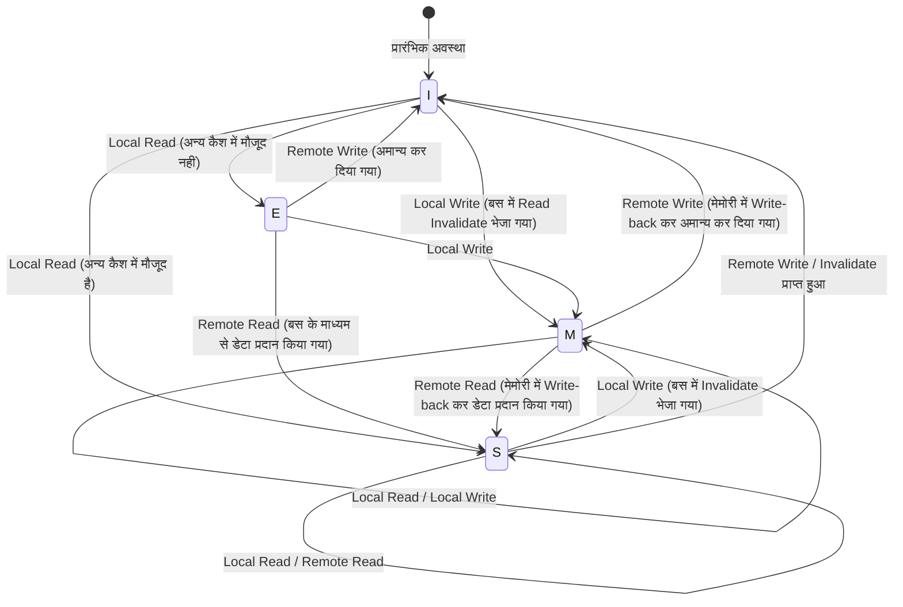

# सीपीयू कैश की भौतिकी और MESI प्रोटोकॉल: मल्टी-कोर में कंसिस्टेंसी और मेमोरी बैरियर की गहराई

आधुनिक सॉफ्टवेयर इंजीनियरिंग में, अधिकतम प्रदर्शन प्राप्त करने के लिए CPU के कार्य करने के सिद्धांतों को सही ढंग से समझना एक आवश्यक शर्त बन गई है। विशेष रूप से अब जब मल्टी-कोर आर्किटेक्चर मानक बन गया है, "मल्टी-थ्रेडेड प्रोग्राम धीमे क्यों हो जाते हैं?" या "रहस्यमय बग (डेटा रेस या दृश्यता की कमी) क्यों उत्पन्न होते हैं?" जैसे प्रश्नों के उत्तर, CPU के सिलिकॉन डाई पर चलने वाले "कैश कोहेरेंस (Cache Coherence)" और "मेमोरी कंसिस्टेंसी मॉडल" की भौतिकी में ही निहित हैं।

इस लेख में, हम CPU कैश की अंतर्निहित भौतिक सीमाओं से शुरू करके, कैश आर्किटेक्चर की मूल संरचना, मल्टी-कोर में कैश कोहेरेंस की समस्या, इसके समाधान के रूप में MESI प्रोटोकॉल का संपूर्ण विश्लेषण, और हार्डवेयर ऑप्टिमाइज़ेशन (स्टोर बफर, इनवैलिडेट क्यू) से उत्पन्न होने वाले दुष्प्रभावों और मेमोरी बैरियर (Memory Barrier), साथ ही सॉफ्टवेयर इंजीनियरों द्वारा सामना की जाने वाली फॉल्स शेयरिंग (False Sharing) तक को, अकादमिक और व्यावहारिक गहराई के साथ विस्तार से समझाएंगे।

---

## अध्याय 1: प्रकाश की गति की दीवार और मेमोरी वॉल की समस्या

### 1.1 प्रकाश की गति की भौतिक सीमा और लेटेंसी
आज जब CPU की क्लॉक फ्रीक्वेंसी कई GHz तक पहुंच गई है, हम "प्रकाश की गति की दीवार" नामक निरपेक्ष भौतिक नियम का सामना कर रहे हैं। उदाहरण के लिए, 5GHz पर चलने वाले CPU के लिए, 1 क्लॉक साइकल केवल 0.2 नैनोसेकंड (ns) होता है। प्रकाश (विद्युत चुम्बकीय तरंगें) निर्वात में 1 सेकंड में लगभग 3 लाख किमी की दूरी तय करता है, लेकिन 0.2 नैनोसेकंड में तय की गई दूरी केवल 6 सेंटीमीटर के आसपास होती है। तांबे के तार या सिलिकॉन में विद्युत संकेतों की गति प्रकाश की गति की लगभग आधी से दो-तिहाई होती है, इसलिए 1 क्लॉक में संकेत द्वारा तय की जा सकने वाली भौतिक दूरी केवल कुछ सेंटीमीटर होती है।

यह एक क्रूर वास्तविकता को दर्शाता है कि जब तक मेन मेमोरी (DRAM) CPU कोर से कुछ सेंटीमीटर से लेकर 10-15 सेंटीमीटर दूर मदरबोर्ड पर स्थित है, भौतिक नियमों के अनुसार "1 क्लॉक में मेमोरी तक पहुंचना बिल्कुल असंभव है"।

### 1.2 मेमोरी वॉल की समस्या
1990 के दशक के बाद से, मूर के नियम (Moore's Law) के अनुसार CPU की कंप्यूटिंग गति में घातांकीय रूप से वृद्धि हुई, लेकिन DRAM की एक्सेस स्पीड में सुधार धीमा ही रहा। CPU और मेमोरी के प्रदर्शन सुधार की गति के बीच इस अंतर को "मेमोरी वॉल (Memory Wall) की समस्या" कहा जाता है।
विशिष्ट लेटेंसी पदानुक्रम (Numbers Every Programmer Should Know) नीचे दिया गया है:

- **L1 कैश रेफरेंस**: लगभग 0.5 से 1 ns (लगभग 3 से 4 साइकल)
- **L2 कैश रेफरेंस**: लगभग 3 से 7 ns (लगभग 10 से 15 साइकल)
- **L3 कैश रेफरेंस**: लगभग 15 से 20 ns (लगभग 40 से 60 साइकल)
- **मेन मेमोरी (DRAM) रेफरेंस**: लगभग 100 ns (लगभग 300 से 400 साइकल)

मेन मेमोरी का एक्सेस L1 कैश एक्सेस की तुलना में लगभग 100 से 200 गुना धीमा होता है। जब CPU मेन मेमोरी से डेटा की प्रतीक्षा करता है, तो पाइपलाइन सैकड़ों साइकल तक रुकी (stall) रहती है। इस भयंकर देरी को छिपाने के लिए ही "पदानुक्रमित कैश आर्किटेक्चर (Hierarchical Cache Architecture)" पेश किया गया था।

### 1.3 कैश लाइन: यह 64 बाइट्स क्यों है?
कैश डेटा को 1-बाइट इकाइयों में प्रबंधित नहीं करता है। आमतौर पर, आधुनिक x86_64 और ARM आर्किटेक्चर में, डेटा को "64-बाइट" चंक (chunk) में मेन मेमोरी से फेच और प्रबंधित किया जाता है। इस 64-बाइट इकाई को "कैश लाइन (Cache Line)" कहा जाता है।

यह 64 बाइट्स क्यों है? इसमें "स्थानिक स्थानीयता (Spatial Locality)" के सिद्धांत, हार्डवेयर कार्यान्वयन लागत, और DRAM की बर्स्ट ट्रांसफर दक्षता के बीच ट्रेड-ऑफ़ शामिल है।
प्रोग्राम में, किसी मेमोरी एड्रेस तक पहुंचने के तुरंत बाद उसके आसन्न एड्रेस तक पहुंचने की अत्यधिक संभावना होती है (जैसे ऐरे (array) को ट्रैवर्स करना)। इसलिए, केवल अनुरोधित डेटा ही नहीं बल्कि आस-पास के डेटा को एक साथ फेच करके, कैश हिट दर में नाटकीय रूप से वृद्धि की जा सकती है।
इसके अलावा, DRAM का इंटरफेस इस तरह से डिज़ाइन किया गया है कि थोड़ी मात्रा में डेटा बार-बार भेजने की तुलना में, इसे एक निश्चित आकार (बर्स्ट) के रूप में लगातार भेजने से थ्रूपुट अधिक होता है। प्रबंधन टैग (Tag) के ओवरहेड को कम रखते हुए बैंडविड्थ की बर्बादी को रोकने और स्थानिक स्थानीयता का पूरी तरह से उपयोग करने वाले "स्वीट स्पॉट" के रूप में, 64 बाइट्स वह मान है जिसे वर्षों के अनुभव और सिमुलेशन के आधार पर निकाला गया है।

---

## अध्याय 2: कैश का गठन

CPU के अंदर SRAM का उपयोग करने वाली कैश मेमोरी की सफलता की कुंजी यह है कि सीमित क्षमता के भीतर मेन मेमोरी की कॉपी को कितनी कुशलता से रखा जा सकता है। मेन मेमोरी के विशाल एड्रेस स्पेस को छोटे कैश में कहाँ मैप करना है, यह तय करने के मुख्य रूप से 3 मॉडल हैं।

### 2.1 कैश के 3 मैपिंग तरीके

1. **डायरेक्ट मैप (Direct Mapped)**
   एक ऐसा तरीका जहां मेन मेमोरी के एक विशिष्ट एड्रेस को कैश में केवल एक ही स्थान पर रखा जा सकता है। इसे लागू करना बहुत सरल और तेज़ है, लेकिन जब कई एड्रेस एक ही कैश एंट्री के लिए प्रतिस्पर्धा (conflict) करते हैं, और उन्हें बारी-बारी से एक्सेस किया जाता है, तो लगातार कैश मिस होने वाली "थ्रैशिंग (Thrashing)" की स्थिति आसानी से उत्पन्न होती है।

2. **फुल एसोसिएटिव (Fully Associative)**
   एक ऐसा तरीका जहां मेन मेमोरी के डेटा को कैश में "कहीं भी" रखा जा सकता है। थ्रैशिंग को कम से कम किया जा सकता है, लेकिन डेटा खोजना हो तो कैश की सभी प्रविष्टियों (entries) को एक साथ खोजना पड़ता है। इसके लिए, एक विशेष और महंगी, उच्च-ऊर्जा-खपत वाली हार्डवेयर की आवश्यकता होती है जिसे एसोसिएटिव मेमोरी (CAM: Content Addressable Memory) कहा जाता है, जिसे L1 कैश जैसी बड़ी क्षमता (हजारों प्रविष्टियों) पर लागू नहीं किया जा सकता।

3. **सेट एसोसिएटिव (Set Associative)**
   यह डायरेक्ट मैप और फुल एसोसिएटिव का एक समझौता है और आधुनिक CPU कैश की मुख्यधारा है। कैश को कई "सेट (Set)" में विभाजित किया जाता है, और मेमोरी एड्रेस के आधार पर एक्सेस किए जाने वाले सेट को विशिष्ट रूप से निर्धारित किया जाता है (डायरेक्ट मैप का गुण)। फिर, उस सेट के भीतर, इसे कई "वे (Way)" में से किसी में भी रखा जा सकता है (फुल एसोसिएटिव का गुण)। उदाहरण के लिए, "8-वे सेट एसोसिएटिव" में एक सेट के भीतर 8 स्टोरेज लोकेशन होती हैं।

### 2.2 मेमोरी एड्रेस का बिट अपघटन (Tag, Index, Offset)

जब CPU कैश में मेमोरी एड्रेस खोजता है, तो एड्रेस को भौतिक रूप से 3 भागों (बिट्स) में विभाजित करके पढ़ा जाता है।

- **Offset (ऑफसेट)**: यह दर्शाता है कि कैश लाइन (उदाहरण: 64 बाइट्स = 2^6) के भीतर कौन सा बाइट पॉइंट किया जा रहा है। निचले 6 बिट्स।
- **Index (इंडेक्स)**: यह दर्शाता है कि कैश के किस "सेट" में मैप किया गया है।
- **Tag (टैग)**: यह सत्यापित करने के लिए ऊपरी बिट्स कि सेट में संग्रहीत डेटा वास्तव में उसी मेन मेमोरी एड्रेस का है जिसकी मांग की गई है।

उदाहरण: 32-बिट एड्रेस, 64KB 4-वे सेट एसोसिएटिव कैश, 64-बाइट कैश लाइन।
कैश लाइनों की संख्या 64KB / 64B = 1024।
4-वे है, इसलिए सेट की संख्या 1024 / 4 = 256 सेट (2^8)।
- Offset: निचले 6 बिट्स
- Index: अगले 8 बिट्स
- Tag: शेष 18 बिट्स

### 2.3 कैश रिप्लेसमेंट एल्गोरिथम
जब कोई सेट भर जाता है और नया डेटा संग्रहीत करने की आवश्यकता होती है, तो मौजूदा वेज़ में से किसी एक को बाहर निकालना (Evict) आवश्यक हो जाता है। सबसे आम एल्गोरिथम **LRU (Least Recently Used: जो सबसे लंबे समय से इस्तेमाल नहीं हुआ)** है।
हालांकि, जैसे-जैसे वे (ways) की संख्या बढ़ती है, ट्रू LRU को लागू करने की हार्डवेयर लागत (ट्रैकिंग बिट्स और अपडेट लॉजिक) अवास्तविक हो जाती है, इसलिए आधुनिक प्रोसेसर पूर्ण LRU के बजाय **Pseudo-LRU (जैसे Tree-PLRU)** या कभी-कभी हार्डवेयर संसाधनों और हिट दर के इष्टतम संतुलन के लिए यादृच्छिक (random) प्रतिस्थापन का उपयोग करते हैं।

---

## अध्याय 3: कैश कोहेरेंस (कंसिस्टेंसी) समस्या का उत्पन्न होना

सिंगल-कोर युग में, केवल कैश और मेन मेमोरी के बीच डेटा कंसिस्टेंसी (राइट-बैक या राइट-थ्रू) बनाए रखने के बारे में सोचना पड़ता था। हालाँकि, मल्टी-कोर युग में, वास्तविक आतंक शुरू होता है।

### 3.1 साझा चर (Shared Variable) की त्रासदी
कल्पना करें कि Core 0 और Core 1 हैं, और दोनों मेन मेमोरी पर एक ही वेरिएबल `X` (प्रारंभिक मान 0) को पढ़ते और लिखते हैं।

1. Core 0, `X` को पढ़ता है। Core 0 के L1 कैश में `X=0` आ जाता है।
2. Core 1, `X` को पढ़ता है। Core 1 के L1 कैश में भी `X=0` आ जाता है।
3. Core 0, `X` को बदलकर `1` कर देता है। Core 0 के L1 कैश में यह `X=1` हो जाता है। (राइट-बैक विधि के कारण, इसे अभी मेन मेमोरी में वापस नहीं लिखा गया है)।
4. Core 1, `X` को पढ़ता है। Core 1 अपने स्वयं के L1 कैश की जाँच करता है और उसे `X=0` मिलता है।

भौतिक रूप से साझा किए गए वेरिएबल `X` के लिए, Core 0 और Core 1 को पूरी तरह से अलग मान दिखाई दे रहे हैं। यही "कैश कोहेरेंस (कैश कंसिस्टेंसी) समस्या" है। इसे हल करने के लिए, प्रत्येक कोर के कैश के बीच स्थिति को सिंक (synchronize) करने के लिए एक प्रोटोकॉल की आवश्यकता होती है।

### 3.2 स्नूपिंग और डायरेक्टरी विधियां
कोहेरेंस बनाए रखने के लिए आर्किटेक्चर के मोटे तौर पर 2 दृष्टिकोण हैं।

- **स्नूप विधि (Snooping)**
  एक ऐसी विधि जिसमें सभी कैश कंट्रोलर लगातार साझा मेमोरी बस पर लेनदेन को "चोरी-छिपे सुनते (Snoop)" हैं। जब कोई मेमोरी में लिखने या कैश लाइन का अनुरोध करने का संकेत भेजता है, तो वे इसका पता लगा लेते हैं और स्वचालित रूप से अपनी कैश स्थिति को अपडेट करते हैं। यह छोटे से मध्यम आकार के मल्टी-कोर (कुछ दर्जन कोर तक) में बहुत कम लेटेंसी के साथ काम करता है, लेकिन कोर की संख्या बढ़ने पर बस की बैंडविड्थ ब्रॉडकास्ट से भर जाती है, इसलिए यह स्केल नहीं होता है।

- **डायरेक्टरी विधि (Directory-based)**
  यह एक ऐसी विधि है जिसमें केंद्रीय "डायरेक्टरी" में जानकारी प्रबंधित की जाती है कि कौन सी कैश लाइन किस कोर के कैश में मौजूद है। जब कोई कोर लिखता है, तो यह ब्रॉडकास्ट करने के बजाय डायरेक्टरी से पूछताछ करता है और केवल लक्षित कोर को पॉइंट-टू-पॉइंट इनवैलिडेशन संदेश भेजता है। इसे बड़े पैमाने के मैनी-कोर प्रोसेसर (सर्वर के लिए Xeon या EPYC आदि) में अपनाया जाता है।

इस लेख में, हम सबसे महत्वपूर्ण मूलभूत अवधारणा, स्नूप-आधारित "MESI प्रोटोकॉल" पर ध्यान केंद्रित करेंगे।

---

## अध्याय 4: MESI प्रोटोकॉल का संपूर्ण विश्लेषण

कैश कोहेरेंस प्रोटोकॉल का वास्तविक मानक (de facto standard) और आधार **MESI प्रोटोकॉल** है। MESI प्रत्येक कैश लाइन में 2-बिट स्टेट फ्लैग रखता है, और इसे निम्नलिखित 4 अवस्थाओं (States) में से एक के रूप में प्रबंधित करता है।

### 4.1 4 अवस्थाएँ (Modified, Exclusive, Shared, Invalid)

1. **M (Modified - संशोधित)**
   - यह कैश लाइन "केवल" इसी कोर के कैश में मौजूद है, और मेन मेमोरी के मान से "बदली हुई (Dirty)" है।
   - इस कोर की ज़िम्मेदारी है कि वह बदलावों को मेमोरी में वापस लिखे (Write-back)।

2. **E (Exclusive - एक्सक्लूसिव)**
   - यह कैश लाइन "केवल" इसी कोर के कैश में मौजूद है, और मेन मेमोरी के मान के साथ "मेल खाती (Clean)" है।
   - यह अन्य कोर को सूचित किए बिना किसी भी समय M अवस्था में बदल सकता है और स्वतंत्र रूप से लिख सकता है।

3. **S (Shared - साझा)**
   - यह कैश लाइन कई कोर के कैश में मौजूद हो सकती है, और मेन मेमोरी के मान के साथ "मेल खाती (Clean)" है।
   - इसे स्वतंत्र रूप से पढ़ा जा सकता है, लेकिन लिखने के लिए, अन्य सभी कोर को "Invalidate (अमान्यकरण)" संदेश भेजना होगा और इस अवस्था को अस्थायी रूप से अमान्य (Invalid) करना होगा।

4. **I (Invalid - अमान्य)**
   - इस कैश लाइन में कोई मान्य डेटा नहीं है। यह कैश मिस की स्थिति का पर्याय है।

### 4.2 अवस्था संक्रमण के डायनामिक्स (Dynamics)

कोर की अपनी पहुंच (Local Read / Local Write) और बस के माध्यम से अन्य कोर की पहुंच (Remote Read / Remote Write / Invalidate) के कारण अवस्थाएं गतिशील रूप से परिवर्तित होती हैं।

नीचे MESI प्रोटोकॉल के प्रमुख अवस्था संक्रमणों (state transitions) को दर्शाने वाला एक Mermaid आरेख (diagram) दिया गया है।



### 4.3 MESI का कार्य सिमुलेशन
आइए MESI प्रोटोकॉल का उपयोग करके पहले बताई गई "साझा चर की त्रासदी" परिदृश्य को ट्रैक करें।

1. **Core 0 `X` को Read करता है:** Core 0 बस में Read अनुरोध जारी करता है। चूँकि अन्य कोर के पास यह नहीं है, यह इसे मेमोरी से प्राप्त करता है और अवस्था **E (Exclusive)** हो जाती है।
2. **Core 1 `X` को Read करता है:** Core 1 Read अनुरोध जारी करता है। Core 0 इसे स्नूप (snoop) करता है और प्रतिक्रिया देता है, और अपनी अवस्था को **S (Shared)** में गिरा देता है। Core 1 भी इसे **S** अवस्था में अपने कैश में लाता है।
3. **Core 0 `X` में Write करता है (`X=1`):** चूँकि Core 0 की अवस्था **S** है, यह बस में "Invalidate (अमान्यकरण)" संकेत भेजता है। Core 1 इसे प्राप्त करता है और अपने `X` को **I (Invalid)** कर देता है। Core 0 सभी Invalidate Ack (स्वीकृति) प्राप्त करने के बाद, अपनी अवस्था को बढ़ाकर **M (Modified)** कर लेता है, और कैश लाइन को अपडेट कर देता है।
4. **Core 1 `X` को Read करता है:** Core 1 का कैश **I** है, इसलिए कैश मिस होता है। यह बस में Read अनुरोध भेजता है। Core 0 (वर्तमान में **M**) इसका पता लगाता है, और नवीनतम मान `X=1` को मेमोरी में वापस लिखता है (Write-back), और साथ ही Core 1 को डेटा प्रदान करता है। दोनों की अवस्था **S (Shared)** हो जाती है।

इस तरह, MESI प्रोटोकॉल हार्डवेयर स्तर पर पूरी तरह से पारदर्शी डेटा कंसिस्टेंसी की गारंटी देता है।

### 4.4 MESI प्रोटोकॉल का विस्तार: MOESI और MESIF
वास्तविक आधुनिक प्रोसेसर में, MESI के अनुकूलित (optimized) प्रोटोकॉल का उपयोग किया जाता है।
- **MOESI (AMD आदि)**: नया **O (Owned)** अवस्था जोड़ता है। जब किसी अन्य कोर द्वारा M अवस्था से डेटा पढ़ा जाता है, तो मेमोरी में राइट-बैक को विलंबित कर दिया जाता है, और स्वामी (Owner) के रूप में अन्य कैश को सीधे डर्टी डेटा प्रदान करना जारी रखकर मेमोरी बैंडविड्थ को बचाया जाता है।
- **MESIF (Intel आदि)**: नया **F (Forward)** अवस्था जोड़ता है। जब कई कोर के पास S अवस्था होती है और कोई अन्य कोर रीड अनुरोध करता है, तो यदि सभी प्रतिक्रिया देते हैं तो बस पर प्रतिस्पर्धा होती है। सबसे अंत में पढ़ने वाले कोर को F अवस्था दी जाती है, और केवल F अवस्था वाला कोर प्रतिनिधि के रूप में प्रतिक्रिया देकर ट्रैफ़िक को अनुकूलित करता है।

---

## अध्याय 5: स्टोर बफर, इनवैलिडेट क्यू और मेमोरी बैरियर

अध्याय 4 तक MESI प्रोटोकॉल अचूक लगता है, लेकिन इसमें एक घातक प्रदर्शन दोष है: "लिखने में देरी (Write Latency)"।

### 5.1 MESI की प्रदर्शन सीमा और स्टोर बफर का परिचय
यदि Core 0 एक S अवस्था वाली कैश लाइन पर लिखना चाहता है, तो उसे बस में Invalidate अनुरोध भेजना होगा और अन्य सभी कोर से "अमान्य कर दिया गया है (Invalidate Ack)" प्रतिक्रिया की प्रतीक्षा करनी होगी। इस संचार राउंड-ट्रिप में दर्जनों से सैकड़ों साइकल लगते हैं। इस दौरान CPU की पाइपलाइन पूरी तरह से रुक (stall) जाती है।

इसे हल करने के लिए हार्डवेयर इंजीनियरों ने **स्टोर बफर (Store Buffer)** पेश किया।
जब CPU कोर लिखता है, तो वह कैश कंट्रोलर से Invalidate पूर्ण होने की प्रतीक्षा नहीं करता, बल्कि लिखे जाने वाले डेटा और एड्रेस को "स्टोर बफर" में डाल देता है। और CPU तुरंत अगले निर्देश (instruction) के निष्पादन के लिए आगे बढ़ जाता है। स्टोर बफर अतुल्यकालिक (asynchronously) रूप से Invalidate Ack की प्रतीक्षा करता है, और जब वे सभी आ जाते हैं, तो वह L1 कैश (M अवस्था) में लिखता है।

यह तंत्र लिखने की गति बढ़ाता है, लेकिन इसके लिए "स्टोर फॉरवर्डिंग (Store Forwarding)" नामक एक सुविधा की आवश्यकता होती है। यदि कोर तुरंत उसी मान को पढ़ता है जो उसने अभी लिखा है, तो चूंकि वह अभी तक L1 कैश में परिलक्षित नहीं हुआ है, उसे स्टोर बफर को देखना होगा और नवीनतम मान प्राप्त करना होगा।

### 5.2 इनवैलिडेट क्यू के साथ त्वरित Ack
स्टोर बफर बहुत छोटा होता है, इसलिए यह जल्दी भर जाता है और स्टॉल का कारण बनता है। Invalidate Ack धीमा क्यों है? इसका कारण यह है कि जब कोई अन्य कोर Invalidate अनुरोध प्राप्त करता है, और यदि उस कोर का कैश व्यस्त है, तो अमान्यकरण प्रक्रिया में देरी हो जाती है।
इसे हल करने के लिए, अमान्यकरण अनुरोध प्राप्त करने वाला कोर, वास्तव में कैश को अमान्य करने से पहले, अनुरोध को **इनवैलिडेट क्यू (Invalidate Queue)** में धकेल देता है और तुरंत "Ack" वापस भेज देता है। अमान्यकरण की प्रक्रिया बाद में अतुल्यकालिक रूप से की जाती है।

### 5.3 हार्डवेयर द्वारा मेमोरी कंसिस्टेंसी का विनाश
स्टोर बफर और इनवैलिडेट क्यू ने प्रदर्शन में नाटकीय रूप से सुधार किया, लेकिन इसकी कीमत पर "अनुक्रमिक निरंतरता (Sequential Consistency)" नष्ट हो गई।

निम्नलिखित प्रसिद्ध उदाहरण पर विचार करें। (प्रारंभिक मान `A = 0`, `B = 0`)

```c
// Core 0                  // Core 1
A = 1;                     B = 1;
print(B);                  print(A);
```

यदि MESI प्रोटोकॉल का कड़ाई से पालन किया गया होता, तो कम से कम एक का लिखना पहले पूरा हो जाता, इसलिए ऐसा बिल्कुल नहीं हो सकता कि दोनों `0` प्रिंट करें।
हालाँकि, वास्तविक CPU में दोनों के `0` प्रिंट करने की संभावना है।
1. Core 0, `A=1` को स्टोर बफर में लिखता है और आगे बढ़ता है।
2. Core 1, `B=1` को स्टोर बफर में लिखता है और आगे बढ़ता है।
3. Core 0, `B` को पढ़ता है, लेकिन चूँकि Core 1 का लिखा हुआ अभी भी Core 1 के स्टोर बफर में है, इसलिए वह `B=0` पढ़ता है।
4. Core 1, `A` को पढ़ता है, लेकिन चूँकि Core 0 का लिखा हुआ अभी भी Core 0 के स्टोर बफर में है, इसलिए वह `A=0` पढ़ता है।

यही वह "दृश्यता (visibility)" की कमी है जो आउट-ऑफ़-ऑर्डर निष्पादन और हार्डवेयर ऑप्टिमाइज़ेशन के कारण होती है।

### 5.4 मेमोरी बैरियर (मेमोरी फेंस)
इस समस्या को हल करने के लिए, सॉफ्टवेयर की तरफ से हार्डवेयर को एक निर्देश देने की आवश्यकता है कि "यहाँ से आगे सख्ती से क्रम का पालन करें" या "स्टोर बफर को फ्लश करें"। इसे **मेमोरी बैरियर (Memory Barrier / Memory Fence)** कहा जाता है।

- **स्टोर बैरियर (Write Memory Barrier, `smp_wmb()`)**: यह बाद के सभी लेखनों को तब तक प्रतीक्षा करवाता है जब तक कि स्टोर बफर में सभी लेखन कैश में कमिट न हो जाएं।
- **लोड बैरियर (Read Memory Barrier, `smp_rmb()`)**: यह बाद के सभी पठन (read) को तब तक प्रतीक्षा करवाता है जब तक कि इनवैलिडेट क्यू में सभी अमान्यकरण अनुरोध संसाधित (processed) न हो जाएं।
- **फुल बैरियर (Full Memory Barrier, `smp_mb()`)**: उपरोक्त दोनों करता है।

x86 आर्किटेक्चर अपेक्षाकृत मजबूत कंसिस्टेंसी मॉडल **TSO (Total Store Order)** को अपनाता है, और सामान्य पठन और लेखन का क्रम काफी हद तक बनाए रखा जाता है (क्रम केवल तभी उल्टा हो सकता है जब स्टोर के बाद लोड आता हो)। दूसरी ओर, ARM आर्किटेक्चर **Weak Consistency** को अपनाता है, और जब तक स्पष्ट रूप से बैरियर नहीं लगाया जाता है, निर्देशों के निष्पादन क्रम को अत्यधिक स्वतंत्रता के साथ फिर से व्यवस्थित किया जा सकता है।

### 5.5 एक्वायर-रिलीज़ सिमेंटिक्स (Acquire/Release Semantics)
आधुनिक भाषाओं (C++11 के बाद, Rust, Java, आदि) में, प्रत्येक CPU के लिए जटिल बैरियर निर्देशों को सीधे लिखने के बजाय, कंसिस्टेंसी को नियंत्रित करने के लिए उच्च-स्तरीय "Acquire / Release सिमेंटिक्स" का उपयोग किया जाता है।
- **Release (रिलीज़)**: जब डेटा किसी अन्य थ्रेड को पास किया जाता है, तो यह गारंटी देता है कि उससे पहले के सभी राइट पूरे हो चुके हैं।
- **Acquire (एक्वायर)**: जब किसी अन्य थ्रेड से डेटा प्राप्त किया जाता है, तो यह गारंटी देता है कि उसके बाद के सभी रीड (read) नवीनतम डेटा प्राप्त करेंगे।

---

## अध्याय 6: सॉफ्टवेयर इंजीनियरों द्वारा सामना की जाने वाली वास्तविकता

अब तक हमने हार्डवेयर की गहराइयों को देखा है, लेकिन अंत में हम यह समझाएंगे कि यह हम सॉफ्टवेयर इंजीनियरों द्वारा लिखे जाने वाले कोड से सीधे कैसे संबंधित है।

### 6.1 फॉल्स शेयरिंग (False Sharing) की त्रासदी
मल्टी-थ्रेडेड प्रोग्रामिंग में सबसे खराब प्रदर्शन हत्यारों (performance killers) में से एक **फॉल्स शेयरिंग (False Sharing)** है।

जैसा कि उल्लेख किया गया है, एक कैश लाइन 64 बाइट्स का चंक है। क्या होगा यदि पूरी तरह से असंबंधित चर `A` और `B` मेमोरी में सटे हुए (adjacent) हों और एक ही 64-बाइट कैश लाइन में आ जाएं?

```cpp
struct Counter {
    volatile long long thread1_count; // Core 0 इसे बार-बार अपडेट करता है
    volatile long long thread2_count; // Core 1 इसे बार-बार अपडेट करता है
};
Counter c;
```

जब Core 0 `thread1_count` को अपडेट करता है, तो MESI प्रोटोकॉल के अनुसार, वह पूरी कैश लाइन M अवस्था में चली जाती है, और Core 1 की कैश लाइन अमान्य (Invalidate) हो जाती है।
तुरंत बाद, जब Core 1 `thread2_count` को अपडेट करने की कोशिश करता है, तो कैश मिस होता है, और वह नवीनतम कैश लाइन को मेन मेमोरी (या Core 0 के कैश) से फिर से लाता है। और इस बार Core 0 का हिस्सा Invalidate हो जाता है।

भले ही प्रोग्राम में पूरी तरह से अलग चर (variables) को संचालित किया जा रहा हो, हार्डवेयर स्तर पर, 64-बाइट कैश लाइन के "स्वामित्व (ownership)" को लेकर कोर के बीच एक भयंकर पिंग-पोंग (कैश लाइन की छीना-झपटी) होती है। इसके परिणामस्वरूप, यह त्रासदी होती है कि मल्टी-थ्रेडेड होने के बावजूद प्रोग्राम सिंगल-थ्रेडेड से भी धीमा हो जाता है।

### 6.2 कैश लाइन अलाइनमेंट द्वारा समाधान
इस False Sharing को रोकने के लिए, मेमोरी लेआउट को इस तरह से बाध्य किया जाना चाहिए कि चर (variables) को अलग-अलग कैश लाइनों में रखा जाए। C++11 के बाद, `alignas` स्पेसिफायर का उपयोग किया जाता है।

```cpp
#include <atomic>
#include <thread>
#include <vector>

// हार्डवेयर का विनाशकारी हस्तक्षेप आकार (आमतौर पर 64 बाइट्स)
#ifdef __cpp_lib_hardware_interference_size
    using std::hardware_destructive_interference_size;
#else
    constexpr std::size_t hardware_destructive_interference_size = 64;
#endif

struct AlignedCounter {
    // thread1_count को कैश लाइन की शुरुआत में रखें, और पीछे पैडिंग जोड़ें
    alignas(hardware_destructive_interference_size) std::atomic<long long> thread1_count{0};
    
    // thread2_count को भी दूसरी कैश लाइन की शुरुआत में रखें
    alignas(hardware_destructive_interference_size) std::atomic<long long> thread2_count{0};
};

int main() {
    AlignedCounter c;
    
    auto worker1 = [&c]() {
        for (int i = 0; i < 10000000; ++i) {
            // relaxed पर्याप्त है (अन्य चरों पर कोई निर्भरता नहीं है)
            c.thread1_count.fetch_add(1, std::memory_order_relaxed);
        }
    };
    
    auto worker2 = [&c]() {
        for (int i = 0; i < 10000000; ++i) {
            c.thread2_count.fetch_add(1, std::memory_order_relaxed);
        }
    };
    
    std::thread t1(worker1);
    std::thread t2(worker2);
    
    t1.join();
    t2.join();
    
    return 0;
}
```

इस तरह, `alignas(64)` जोड़ने से चर के बीच उचित पैडिंग सम्मिलित (insert) हो जाती है, और भौतिक कैश लाइनों को अलग कर दिया जाता है। इसके साथ, MESI प्रोटोकॉल के कारण अनावश्यक Invalidate की श्रृंखला टूट जाती है, और वास्तविक समानांतर (parallel) प्रदर्शन प्राप्त होता है।

### 6.3 लॉक-फ्री डेटा स्ट्रक्चर और मेमोरी ऑर्डर
और भी अधिक उन्नत लॉक-फ्री (Lock-free) प्रोग्रामिंग में, एटॉमिक ऑपरेशंस और मेमोरी बैरियर को अधिकतम सीमा तक अनुकूलित (optimize) किया जाता है। C++ के `std::atomic` में `memory_order` का विनिर्देशन (specification) वास्तव में अध्याय 5 में बताए गए हार्डवेयर बैरियर निर्देशों को सीधे नियंत्रित करने के लिए है।

- `memory_order_seq_cst`: डिफ़ॉल्ट। सबसे सुरक्षित, लेकिन एक भारी फुल बैरियर (`smp_mb`) जारी करता है।
- `memory_order_acquire` / `memory_order_release`: लोड बैरियर और स्टोर बैरियर जारी करता है, और चर के बीच एक सिंक्रोनाइज़ेशन संबंध बनाता है।
- `memory_order_relaxed`: कोई भी बैरियर जारी नहीं करता, केवल इस बात की गारंटी देता है कि यह एटॉमिक (विभाजित नहीं होने वाला) है। कैश कोहेरेंस (MESI) के कारण अंतिम मान के मिलान की गारंटी है, लेकिन अन्य चरों की दृश्यता के क्रम की बिल्कुल कोई गारंटी नहीं है।

लॉक-फ्री क्यू जैसे डिज़ाइनों में, "CPU भौतिकी के अनुकूल डिज़ाइन" की आवश्यकता होती है, जैसे अनावश्यक बैरियर को हटाना, `relaxed` या `acquire/release` को उचित रूप से संयोजित करना, और फॉल्स शेयरिंग से बचने के लिए रिंग बफर (Ring Buffer) के Head और Tail को अलग-अलग कैश लाइनों में अलग करना।

## निष्कर्ष

वे असाइनमेंट (assignment) स्टेटमेंट जो हम चर में डेटा डालने के लिए रोज़ाना लिखते हैं, सिलिकॉन पर विद्युत संकेत बन जाते हैं, पदानुक्रमित कैश (hierarchical caches) से होकर गुज़रते हैं, MESI प्रोटोकॉल के जटिल अवस्था संक्रमण का कारण बनते हैं, और स्टोर बफर और इनवैलिडेट क्यू के तूफ़ान से गुज़रने के बाद ही अंतिम रूप से निर्धारित होते हैं।
"सॉफ्टवेयर हार्डवेयर को छुपाता है" के एब्स्ट्रैक्शन (abstraction) का सिद्धांत अद्भुत है, लेकिन समवर्ती प्रोग्रामिंग (concurrent programming) की दुनिया में जहां अत्यधिक प्रदर्शन की आवश्यकता होती है, एब्स्ट्रैक्शन की दीवार को पार करना और भौतिक परत की सच्चाई को समझना ही एकमात्र रास्ता है।
