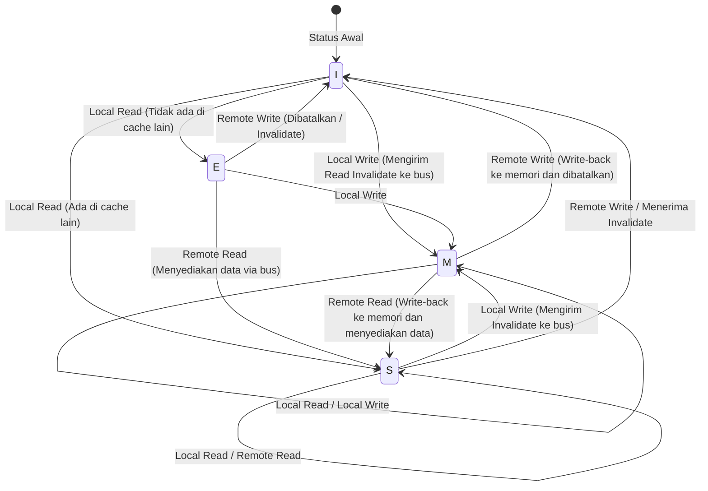

# Fisika Cache CPU dan Protokol MESI: Kedalaman Konsistensi dan Memory Barrier dalam Multi-Core

Dalam rekayasa perangkat lunak modern, memahami prinsip kerja CPU secara benar telah menjadi syarat mutlak untuk mengekstraksi performa secara maksimal. Terutama sekarang ketika arsitektur multi-core telah menjadi standar, jawaban atas pertanyaan seperti "mengapa program multi-thread menjadi lambat?" dan "mengapa bug misterius (data race atau kurangnya visibilitas) terjadi?" semuanya berujung pada fisika "koherensi cache" (cache coherence) dan "model konsistensi memori" (memory consistency model) yang berlangsung di atas die silikon CPU.

Pada artikel ini, kita akan berangkat dari batasan fisik yang mendasari cache CPU, kemudian membahas struktur dasar arsitektur cache, masalah koherensi cache pada multi-core, analisis lengkap tentang protokol MESI sebagai solusinya, serta efek samping dan memory barrier yang ditimbulkan oleh optimasi perangkat keras (store buffer, invalidate queue), dan terakhir tragedi False Sharing yang dihadapi oleh software engineer, semuanya dijelaskan secara mendalam baik secara akademis maupun praktis.

---

## Bab 1: Dinding Kecepatan Cahaya dan Masalah Memory Wall

### 1.1 Batasan Fisik Kecepatan Cahaya dan Latensi
Di era modern di mana frekuensi clock CPU mencapai beberapa GHz, kita dihadapkan pada hukum fisika absolut yaitu "dinding kecepatan cahaya". Misalnya, pada CPU yang beroperasi pada 5GHz, 1 siklus clock hanyalah 0,2 nanodetik (ns). Jarak yang ditempuh cahaya (gelombang elektromagnetik) dalam ruang hampa selama 1 detik adalah sekitar 300 ribu km, tetapi jarak yang bisa ditempuh dalam 0,2 nanodetik hanyalah sekitar 6 sentimeter. Karena kecepatan rambat sinyal listrik melalui kabel tembaga atau silikon hanya sekitar setengah hingga dua pertiga dari kecepatan cahaya, jarak fisik yang dapat dicapai sinyal dalam 1 clock hanyalah beberapa sentimeter.

Selama memori utama (DRAM) ditempatkan di motherboard dengan jarak beberapa sentimeter hingga belasan sentimeter dari inti CPU, ini menunjukkan fakta kejam dari hukum fisika bahwa "sama sekali tidak mungkin mengakses memori dalam 1 clock."

### 1.2 Masalah Memory Wall
Sejak tahun 1990-an, kecepatan komputasi CPU telah meningkat secara eksponensial mengikuti Hukum Moore, namun peningkatan kecepatan akses DRAM berlangsung jauh lebih lambat. Kesenjangan antara kecepatan peningkatan kinerja CPU dan memori ini disebut sebagai "Masalah Memory Wall".
Berikut adalah hierarki latensi spesifik (Numbers Every Programmer Should Know):

- **Referensi Cache L1**: Sekitar 0.5~1 ns (sekitar 3~4 siklus)
- **Referensi Cache L2**: Sekitar 3~7 ns (sekitar 10~15 siklus)
- **Referensi Cache L3**: Sekitar 15~20 ns (sekitar 40~60 siklus)
- **Referensi Memori Utama (DRAM)**: Sekitar 100 ns (sekitar 300~400 siklus)

Akses memori utama sekitar 100 hingga 200 kali lebih lambat dibandingkan akses ke cache L1. Sementara CPU menunggu data dari memori utama, pipeline akan mengalami stall selama ratusan siklus. Untuk menyembunyikan penundaan yang luar biasa ini, diperkenalkanlah "arsitektur hierarki cache".

### 1.3 Cache Line: Mengapa 64 Byte?
Cache tidak mengelola data dalam satuan 1 byte. Umumnya, dalam arsitektur x86_64 atau ARM modern, data diambil dari memori utama dan dikelola dalam unit chunk "64 byte". Unit 64 byte ini disebut "Cache Line".

Mengapa 64 byte? Ini melibatkan prinsip "Lokalitas Spasial (Spatial Locality)", biaya implementasi perangkat keras, dan pertukaran (trade-off) dengan efisiensi transfer burst DRAM.
Sebuah program, sesaat setelah mengakses alamat memori tertentu, memiliki probabilitas yang sangat tinggi untuk mengakses alamat yang berdekatan (seperti saat melakukan iterasi array). Oleh karena itu, dengan mengambil tidak hanya data yang diminta tetapi juga data di sekitarnya secara sekaligus, tingkat cache hit dapat ditingkatkan secara dramatis.
Selain itu, antarmuka DRAM dirancang sedemikian rupa sehingga throughput-nya lebih tinggi jika mengirimkan data dalam jumlah tertentu secara berurutan (burst) dibandingkan mengirimkan sejumlah kecil data berkali-kali. 64 byte adalah nilai yang didapat dari pengalaman dan simulasi bertahun-tahun sebagai "sweet spot" yang membatasi overhead penanda (Tag) manajemen, mencegah pemborosan bandwidth, dan sekaligus cukup memanfaatkan lokalitas spasial.

---

## Bab 2: Metode Konfigurasi Cache

Memori cache yang menggunakan SRAM di dalam CPU, kuncinya adalah seberapa efisien menyimpan salinan memori utama dalam kapasitas yang terbatas. Ada 3 model utama dalam metode menentukan di mana ruang alamat memori utama yang luas dipetakan ke dalam cache yang kecil.

### 2.1 Tiga Metode Pemetaan Cache

1. **Direct Mapped (Pemetaan Langsung)**
   Metode di mana alamat tertentu dari memori utama hanya bisa ditempatkan di satu lokasi tertentu di dalam cache. Implementasinya sangat sederhana dan cepat, namun jika beberapa alamat bersaing (konflik) pada entri cache yang sama dan diakses bergantian, akan sangat mudah terjadi "Thrashing" yang selalu menyebabkan cache miss.

2. **Fully Associative (Asosiatif Penuh)**
   Metode di mana data memori utama dapat ditempatkan "di mana saja" di dalam cache. Terjadinya thrashing dapat diminimalkan, namun untuk mencari data, seluruh entri cache harus dibandingkan dan dicari secara bersamaan. Akibatnya, ini memerlukan perangkat keras khusus yang mahal dan boros daya yang disebut CAM (Content Addressable Memory), sehingga tidak dapat diterapkan pada cache berkapasitas besar (puluhan ribu entri) seperti cache L1.

3. **Set Associative (Asosiatif Himpunan)**
   Kompromi antara Direct Mapped dan Fully Associative, dan merupakan arus utama cache CPU modern. Cache dibagi menjadi beberapa "Set", dan set yang harus diakses ditentukan secara unik dari alamat memori (sifat Direct Mapped). Kemudian, di dalam set tersebut, data bebas ditempatkan di salah satu "Way" mana saja (sifat Fully Associative). Misalnya pada "8-way Set Associative", terdapat 8 tempat penyimpanan di dalam 1 set.

### 2.2 Dekomposisi Bit Alamat Memori (Tag, Index, Offset)

Ketika CPU mencari alamat memori di cache, alamat tersebut secara fisik dibagi (dekomposisi bit) menjadi 3 bagian untuk diinterpretasikan.

- **Offset**: Menunjukkan byte mana di dalam cache line (misal: 64 byte = 2^6) yang ditunjuk. 6 bit terbawah.
- **Index**: Menunjukkan ke "Set" mana pada cache ia dipetakan.
- **Tag**: Bit-bit atas yang digunakan untuk mencocokkan apakah data yang disimpan di set tersebut benar-benar milik alamat memori utama yang diminta.

Contoh: Alamat 32-bit, cache 64KB 4-way set associative, dengan cache line 64 byte.
Jumlah cache line adalah 64KB / 64B = 1024.
Karena 4-way, jumlah set adalah 1024 / 4 = 256 set (2^8).
- Offset: 6 bit terbawah
- Index: 8 bit berikutnya
- Tag: 18 bit sisanya

### 2.3 Algoritma Penggantian Cache
Ketika sebuah set sudah penuh dan perlu menyimpan data baru, salah satu dari Way yang ada harus dikeluarkan (Evict). Algoritma yang paling umum adalah **LRU (Least Recently Used: yang paling lama tidak digunakan)**.
Namun, ketika jumlah Way meningkat, biaya perangkat keras (bit pelacakan dan logika pembaruan) untuk mengimplementasikan LRU sejati menjadi tidak realistis, sehingga prosesor modern tidak menggunakan LRU sempurna melainkan **Pseudo-LRU (seperti Tree-PLRU)** atau terkadang penggantian acak (random replacement), guna mencapai keseimbangan optimal antara sumber daya perangkat keras dan cache hit rate.

---

## Bab 3: Mekanisme Terjadinya Masalah Koherensi Cache (Konsistensi)

Di era single-core, kita hanya perlu memikirkan bagaimana menjaga konsistensi data antara cache dan memori utama (write-back atau write-through). Namun, di era multi-core, teror yang sesungguhnya baru saja dimulai.

### 3.1 Tragedi Variabel Bersama
Bayangkan situasi di mana ada Core 0 dan Core 1, dan keduanya membaca serta menulis variabel yang sama `X` (nilai awal 0) di memori utama.

1. Core 0 membaca `X`. Cache L1 dari Core 0 kini memuat `X=0`.
2. Core 1 membaca `X`. Cache L1 dari Core 1 juga memuat `X=0`.
3. Core 0 mengubah nilai `X` menjadi `1`. Pada cache L1 Core 0 nilainya menjadi `X=1`. (Karena menggunakan metode write-back, ini belum ditulis kembali ke memori utama).
4. Core 1 membaca `X`. Core 1 merujuk ke cache L1-nya sendiri, dan mendapatkan `X=0`.

Meskipun variabel `X` secara fisik dibagikan bersama, nilai yang sepenuhnya berbeda terlihat di Core 0 dan Core 1. Inilah yang disebut "masalah koherensi cache (konsistensi cache)". Untuk menyelesaikannya, diperlukan protokol yang menyinkronkan status antar cache di setiap core.

### 3.2 Metode Snooping dan Metode Direktori
Arsitektur untuk menjaga koherensi secara garis besar terbagi menjadi dua pendekatan.

- **Metode Snooping (Snooping)**
  Metode di mana semua pengontrol cache selalu "menguping (snoop)" transaksi di bus memori yang digunakan bersama. Ketika ia mendeteksi sinyal bahwa seseorang mencoba menulis ke memori atau meminta cache line, ia akan secara otonom memperbarui status cache-nya sendiri. Metode ini beroperasi dengan latensi sangat rendah pada multi-core skala kecil hingga menengah (hingga puluhan core), namun tidak dapat diskalakan ketika jumlah core bertambah karena bandwidth bus akan penuh dengan siaran (broadcast).

- **Metode Direktori (Directory-based)**
  Metode yang mengelola informasi mengenai core mana yang memiliki cache line tertentu di sebuah "direktori" pusat. Ketika sebuah core melakukan penulisan, alih-alih melakukan broadcast, ia bertanya ke direktori dan mengirimkan pesan pembatalan (invalidation) secara point-to-point hanya ke core yang bersangkutan. Metode ini diadopsi pada prosesor many-core skala besar (seperti Xeon atau EPYC untuk server).

Dalam artikel ini, kita akan berfokus pada "protokol MESI" berbasis snooping yang merupakan konsep dasar dan paling penting.

---

## Bab 4: Analisis Lengkap Protokol MESI

Standar de facto untuk protokol koherensi cache dan yang menjadi dasarnya adalah **Protokol MESI**. MESI memberikan flag status sebesar 2-bit pada setiap cache line, dan mengelolanya sebagai salah satu dari 4 status (State) berikut.

### 4.1 4 Status (Modified, Exclusive, Shared, Invalid)

1. **M (Modified - Telah Diubah)**
   - Cache line ini "hanya" ada di cache core ini, dan nilainya "telah diubah (Dirty)" dari nilai di memori utama.
   - Core ini berkewajiban menulis kembali (Write-back) perubahan tersebut ke memori.

2. **E (Exclusive - Eksklusif)**
   - Cache line ini "hanya" ada di cache core ini, dan nilainya "sama persis (Clean)" dengan nilai di memori utama.
   - Kapan pun, core ini dapat beralih ke status M dan bebas melakukan penulisan tanpa memberitahu core lain.

3. **S (Shared - Dibagikan)**
   - Cache line ini mungkin ada di cache beberapa core, dan nilainya "sama persis (Clean)" dengan nilai di memori utama.
   - Pembacaan bisa dilakukan dengan bebas, namun untuk melakukan penulisan, ia harus mengirimkan pesan "Invalidate (Pembatalan)" ke semua core lainnya untuk sementara menonaktifkan status ini.

4. **I (Invalid - Tidak Valid)**
   - Cache line ini tidak berisi data yang valid. Sinonim dengan keadaan cache miss.

### 4.2 Dinamika Transisi Status

Status berubah secara dinamis akibat akses dari core itu sendiri (Local Read / Local Write) dan akses dari core lain melalui bus (Remote Read / Remote Write / Invalidate).

Berikut adalah diagram Mermaid yang menunjukkan transisi status utama pada protokol MESI.



### 4.3 Simulasi Operasi MESI
Mari kita telusuri skenario "Tragedi Variabel Bersama" yang disebutkan sebelumnya menggunakan protokol MESI.

1. **Core 0 Membaca `X`:** Core 0 mengirimkan permintaan Read ke bus. Karena core lain tidak memilikinya, ia mengambil dari memori, dan status menjadi **E (Exclusive)**.
2. **Core 1 Membaca `X`:** Core 1 mengirimkan permintaan Read. Core 0 melakukan snoop dan merespons, menurunkan statusnya menjadi **S (Shared)**. Core 1 juga mengambilnya ke dalam cache dengan status **S**.
3. **Core 0 Menulis ke `X` (`X=1`):** Karena status Core 0 adalah **S**, ia mengirim sinyal "Invalidate" ke bus. Core 1 menerimanya dan mengubah `X` miliknya menjadi **I (Invalid)**. Setelah Core 0 menerima semua Ack (konfirmasi) Invalidate, ia menaikkan status menjadi **M (Modified)** dan memperbarui cache line.
4. **Core 1 Membaca `X`:** Karena cache Core 1 adalah **I**, terjadi cache miss. Ia mengirimkan permintaan Read ke bus. Core 0 (saat ini **M**) mendeteksinya, lalu melakukan Write-back nilai terbaru `X=1` ke memori, dan pada saat yang sama memberikan data tersebut ke Core 1. Kedua statusnya kini menjadi **S (Shared)**.

Dengan cara ini, protokol MESI menjamin konsistensi data yang sepenuhnya transparan di tingkat perangkat keras.

### 4.4 Ekstensi Protokol MESI: MOESI dan MESIF
Pada prosesor modern saat ini, digunakan protokol yang merupakan optimasi dari MESI.
- **MOESI (seperti pada AMD)**: Menambahkan status baru **O (Owned)**. Saat core lain membaca dari status M, Write-back ke memori ditunda, dan ia sebagai pemilik (Owner) akan terus menyediakan data kotor (dirty) secara langsung ke cache lain untuk menghemat bandwidth memori.
- **MESIF (seperti pada Intel)**: Menambahkan status baru **F (Forward)**. Ketika banyak core memiliki status S, jika ada permintaan Read dari core lain, respons dari semua core akan menyebabkan konflik di bus. Core yang terakhir kali membaca akan diberi status F, dan hanya core berstatus F tersebut yang mewakili untuk merespons demi mengoptimalkan lalu lintas (traffic).

---

## Bab 5: Store Buffer, Invalidate Queue, dan Memory Barrier

Protokol MESI hingga Bab 4 tampak sempurna, namun ia memiliki cacat kinerja yang fatal: "keterlambatan penulisan".

### 5.1 Batas Kinerja MESI dan Pengenalan Store Buffer
Ketika Core 0 mencoba menulis ke cache line dengan status S, ia harus mengirimkan permintaan Invalidate ke bus dan menunggu respons konfirmasi "dibatalkan (Invalidate Ack)" dari semua core lainnya. Round-trip komunikasi ini memakan puluhan hingga ratusan siklus. Selama waktu itu, pipeline CPU akan sepenuhnya mengalami stall.

Untuk mengatasi ini, insinyur perangkat keras memperkenalkan **Store Buffer (Buffer Penyimpanan)**.
Ketika inti CPU melakukan penulisan, alih-alih menunggu Invalidate selesai di pengontrol cache, ia memasukkan data dan alamat yang akan ditulis sementara ke dalam "Store Buffer". Kemudian CPU segera melanjutkan eksekusi instruksi berikutnya. Store Buffer akan menunggu Invalidate Ack secara asinkron, dan ketika terkumpul lengkap, barulah ia menuliskannya ke cache L1 (status M).

Meskipun mekanisme ini mempercepat penulisan, ia membutuhkan fitur yang disebut "Store Forwarding". Jika CPU ingin segera membaca nilai yang baru saja ditulisnya, karena nilainya belum tercermin di cache L1, ia harus mengintip ke dalam Store Buffer untuk mengambil nilai terbaru.

### 5.2 Percepatan Ack melalui Invalidate Queue
Store buffer sangat kecil, sehingga akan cepat penuh dan menyebabkan stall. Mengapa Invalidate Ack lambat? Jawabannya adalah, ketika core lain menerima permintaan Invalidate, jika cache di core tersebut sedang sibuk, proses pembatalan (invalidation) akan tertunda.
Untuk mengatasi ini, core yang menerima permintaan pembatalan akan memasukkan permintaan tersebut ke dalam **Invalidate Queue (Antrean Pembatalan)** sebelum benar-benar membatalkan cache, dan langsung membalas dengan "Ack". Proses pembatalan cache itu sendiri akan dilakukan secara asinkron di kemudian hari.

### 5.3 Kehancuran Konsistensi Memori oleh Perangkat Keras
Store buffer dan invalidate queue meningkatkan performa secara drastis, tetapi bayarannya adalah hancurnya "Konsistensi Sekuensial (Sequential Consistency)".

Pertimbangkan contoh terkenal berikut. (Nilai awal `A = 0`, `B = 0`)

```c
// Core 0                  // Core 1
A = 1;                     B = 1;
print(B);                  print(A);
```

Jika protokol MESI dipatuhi dengan ketat, setidaknya salah satu dari penulisan tersebut akan selesai lebih dulu, sehingga sama sekali tidak mungkin keduanya mencetak `0`.
Namun, pada CPU dunia nyata, ada kemungkinan keduanya akan mencetak `0`.
1. Core 0 menulis `A=1` ke store buffer, lalu lanjut.
2. Core 1 menulis `B=1` ke store buffer, lalu lanjut.
3. Core 0 membaca `B`, namun penulisan dari Core 1 masih ada di store buffer Core 1, sehingga ia membaca `B=0`.
4. Core 1 membaca `A`, namun penulisan dari Core 0 masih ada di store buffer Core 0, sehingga ia membaca `A=0`.

Inilah kurangnya "visibilitas (visibility)" yang disebabkan oleh eksekusi out-of-order dan optimasi perangkat keras.

### 5.4 Memory Barrier (Memory Fence)
Untuk mengatasi masalah ini, diperlukan instruksi dari sisi perangkat lunak ke perangkat keras yang berbunyi, "Mulai dari sini pertahankan urutannya dengan ketat," dan "Kosongkan (flush) store buffer." Itulah yang disebut **Memory Barrier / Memory Fence**.

- **Store Barrier (Write Memory Barrier, `smp_wmb()`)**: Menahan penulisan berikutnya hingga semua penulisan di dalam store buffer dikomit ke cache.
- **Load Barrier (Read Memory Barrier, `smp_rmb()`)**: Menahan pembacaan berikutnya hingga semua permintaan pembatalan di Invalidate Queue diproses.
- **Full Barrier (Full Memory Barrier, `smp_mb()`)**: Melakukan keduanya.

Arsitektur x86 mengadopsi model konsistensi yang cukup kuat, yaitu **TSO (Total Store Order)**, di mana urutan baca dan tulis normal cukup dipertahankan (urutan hanya bisa terbalik jika Load muncul setelah Store). Di sisi lain, arsitektur ARM mengadopsi **Weak Consistency**, di mana urutan eksekusi instruksi dapat ditata ulang dengan sangat bebas kecuali barrier dinyatakan secara eksplisit.

### 5.5 Semantik Acquire dan Release
Dalam bahasa pemrograman modern (seperti C++11 ke atas, Rust, Java, dll.), alih-alih menulis instruksi barrier yang rumit secara langsung untuk setiap CPU yang berbeda, digunakanlah semantik "Acquire / Release" pada tingkat yang lebih tinggi untuk mengontrol konsistensi.
- **Release (Pelepasan)**: Saat memberikan data ke thread lain, ini menjamin bahwa semua penulisan sebelumnya telah selesai.
- **Acquire (Pemerolehan)**: Saat menerima data dari thread lain, ini menjamin bahwa setiap pembacaan setelahnya akan mendapatkan data terbaru.

---

## Bab 6: Kenyataan yang Dihadapi Software Engineer

Sejauh ini kita telah melihat kedalaman perangkat keras, namun pada akhirnya kita akan menjelaskan bagaimana ini berdampak langsung pada kode yang kita tulis sebagai software engineer.

### 6.1 Tragedi False Sharing
Salah satu pembunuh performa terburuk dalam pemrograman multi-thread adalah **False Sharing (Berbagi Palsu)**.

Seperti yang disebutkan sebelumnya, cache line adalah potongan 64 byte. Apa yang terjadi jika variabel `A` dan `B` yang sama sekali tidak berhubungan letaknya berdekatan di memori, dan keduanya masuk ke dalam cache line 64 byte yang sama?

```cpp
struct Counter {
    volatile long long thread1_count; // Sering diperbarui oleh Core 0
    volatile long long thread2_count; // Sering diperbarui oleh Core 1
};
Counter c;
```

Ketika Core 0 memperbarui `thread1_count`, menurut protokol MESI, seluruh cache line tersebut menjadi status M, dan cache line yang dimiliki oleh Core 1 di-invalidate.
Segera setelah itu, saat Core 1 mencoba memperbarui `thread2_count`, cache miss terjadi, dan ia akan mengambil ulang cache line terbaru dari memori utama (atau dari cache Core 0). Dan kemudian sisi Core 0 yang di-invalidate.

Meskipun secara program operasi dilakukan pada variabel yang sama sekali berbeda, di tingkat perangkat keras, persaingan sengit (Ping-Pong cache line) terjadi antar core demi memperebutkan "kepemilikan" atas cache line 64 byte. Inilah yang memicu tragedi di mana program multi-thread berjalan lebih lambat dibandingkan single-thread.

### 6.2 Penyelesaian Melalui Penyelarasan (Alignment) Cache Line
Untuk mencegah False Sharing ini, kita bisa memaksa tata letak memori sedemikian rupa sehingga variabel ditempatkan di cache line yang berbeda. Sejak C++11, penentu (specifier) `alignas` dapat digunakan.

```cpp
#include <atomic>
#include <thread>
#include <vector>

// Ukuran interferensi destruktif perangkat keras (biasanya 64 byte)
#ifdef __cpp_lib_hardware_interference_size
    using std::hardware_destructive_interference_size;
#else
    constexpr std::size_t hardware_destructive_interference_size = 64;
#endif

struct AlignedCounter {
    // Tempatkan thread1_count di awal cache line, lalu tambahkan padding di belakangnya
    alignas(hardware_destructive_interference_size) std::atomic<long long> thread1_count{0};
    
    // Tempatkan thread2_count di awal cache line yang berbeda
    alignas(hardware_destructive_interference_size) std::atomic<long long> thread2_count{0};
};

int main() {
    AlignedCounter c;
    
    auto worker1 = [&c]() {
        for (int i = 0; i < 10000000; ++i) {
            // relaxed sudah cukup (karena tidak ada dependensi dengan variabel lain)
            c.thread1_count.fetch_add(1, std::memory_order_relaxed);
        }
    };
    
    auto worker2 = [&c]() {
        for (int i = 0; i < 10000000; ++i) {
            c.thread2_count.fetch_add(1, std::memory_order_relaxed);
        }
    };
    
    std::thread t1(worker1);
    std::thread t2(worker2);
    
    t1.join();
    t2.join();
    
    return 0;
}
```

Dengan menambahkan `alignas(64)` seperti ini, padding (pengisi) yang sesuai akan disisipkan di antara variabel, sehingga cache line fisiknya terpisah. Melalui ini, rantai pembatalan (invalidation) yang tidak perlu oleh protokol MESI dapat diputus, dan kinerja paralel yang sesungguhnya dapat dicapai.

### 6.3 Struktur Data Lock-free dan Urutan Memori (Memory Order)
Dalam pemrograman Lock-free yang lebih mahir, operasi atomik dan memory barrier dioptimalkan secara maksimal. Penetapan `memory_order` pada `std::atomic` di C++ secara tepat merupakan cara untuk mengontrol langsung instruksi barrier perangkat keras seperti yang dijelaskan pada Bab 5.

- `memory_order_seq_cst`: Default. Paling aman, namun mengeluarkan full barrier (`smp_mb`) yang berat.
- `memory_order_acquire` / `memory_order_release`: Mengeluarkan load barrier dan store barrier, serta membangun hubungan sinkronisasi variabel.
- `memory_order_relaxed`: Tidak mengeluarkan barrier sama sekali, hanya menjamin bahwa operasinya atomik (tidak terbelah). Walaupun hasil akhirnya dijamin konsisten oleh koherensi cache (MESI), tidak ada jaminan apa pun tentang urutan visibilitas terhadap variabel lainnya.

Dalam mendesain antrean (queue) Lock-free dan sejenisnya, pendekatan yang "selaras dengan fisika CPU" sangatlah dituntut. Ini melibatkan penghapusan barrier yang tidak perlu, mengkombinasikan `relaxed` dan `acquire/release` secara tepat, serta memisahkan Head dan Tail dari Ring Buffer ke cache line yang berbeda untuk menghindari False Sharing.

## Kesimpulan

Pernyataan penugasan variabel yang kita tulis secara harian berubah menjadi sinyal listrik di atas silikon, berjalan melalui cache hierarkis, memicu transisi status yang kompleks dari protokol MESI, dan akhirnya dikonfirmasi setelah melewati badai store buffer dan invalidate queue.
Prinsip abstraksi bahwa "perangkat lunak menyembunyikan perangkat keras" adalah sesuatu yang luar biasa, namun dalam dunia pemrograman konkuren (concurrency) di mana performa maksimum dibutuhkan, satu-satunya jalan adalah melampaui tembok abstraksi tersebut dan memahami realitas pada lapisan fisik.
