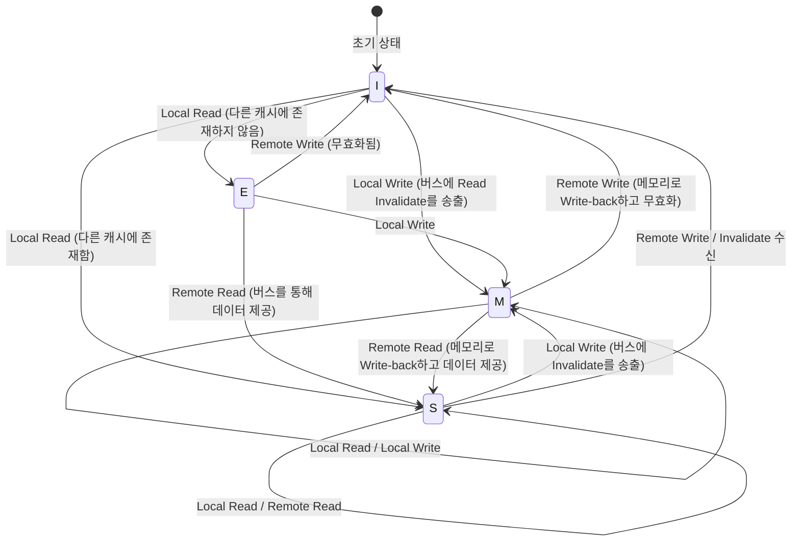

# CPU 캐시의 물리학과 MESI 프로토콜: 멀티 코어에서의 일관성과 메모리 배리어의 심연

현대의 소프트웨어 엔지니어링에 있어서, CPU의 동작 원리를 정확히 이해하는 것은 극한의 성능을 이끌어내기 위한 필수 조건이 되었다. 특히 멀티 코어 아키텍처가 표준이 된 현재, "왜 멀티스레드 프로그램은 느려지는가", "왜 의문의 버그(데이터 경합이나 가시성 결여)가 발생하는가"라는 질문에 대한 답은 모두 CPU의 실리콘 다이 위에서 펼쳐지는 '캐시 일관성(Cache Coherence)'과 '메모리 일관성 모델(Memory Consistency Model)'의 물리학으로 귀결된다.

본고에서는 CPU 캐시의 근저에 있는 물리적인 제약에서 출발하여, 캐시 아키텍처의 기본 구조, 멀티 코어에서의 캐시 일관성 문제, 그 해결책인 MESI 프로토콜의 완전한 해석, 나아가 하드웨어 최적화(스토어 버퍼, 무효화 큐)가 초래하는 부작용과 메모리 배리어, 그리고 소프트웨어 엔지니어가 직면하는 거짓 공유(False Sharing)까지를 학술적이고 실천적인 깊이를 담아 철저하게 해설한다.

---

## 제1장: 광속의 벽과 메모리 월(Memory Wall) 문제

### 1.1 광속의 물리적 한계와 레이턴시
CPU의 클럭 주파수가 수 GHz에 달한 현대, 우리는 '광속의 벽'이라는 절대적인 물리 법칙에 직면해 있다. 예를 들어 5GHz로 동작하는 CPU의 경우, 1 클럭 사이클은 불과 0.2 나노초(ns)이다. 빛(전자기파)이 진공 속에서 1초 동안 나아가는 거리는 약 30만 km이지만, 0.2 나노초 동안 나아갈 수 있는 거리는 약 6cm에 불과하다. 전기 신호가 구리선이나 실리콘 내부를 전달되는 속도는 광속의 약 절반에서 3분의 2 정도이므로, 1 클럭에 신호가 도달할 수 있는 물리적인 거리는 겨우 수 cm가 된다.

이는 메인 메모리(DRAM)가 CPU 코어에서 수 cm ~ 십수 cm 떨어진 메인보드 상에 배치되어 있는 한, 물리 법칙으로서 "1 클럭에 메모리에 접근하는 것은 절대 불가능하다"는 잔혹한 사실을 보여준다.

### 1.2 메모리 월 문제
1990년대 이후 CPU의 연산 속도는 무어의 법칙을 따라 지수함수적으로 향상되었으나, DRAM의 접근 속도 향상은 완만한 수준에 머물렀다. 이 CPU와 메모리의 성능 향상 속도 간의 괴리는 '메모리 월(Memory Wall) 문제'라고 불린다.
구체적인 레이턴시의 계층(Numbers Every Programmer Should Know)을 아래에 나타낸다:

- **L1 캐시 참조**: 약 0.5~1 ns (약 3~4 사이클)
- **L2 캐시 참조**: 약 3~7 ns (약 10~15 사이클)
- **L3 캐시 참조**: 약 15~20 ns (약 40~60 사이클)
- **메인 메모리(DRAM) 참조**: 약 100 ns (약 300~400 사이클)

메인 메모리 접근은 L1 캐시에 대한 접근에 비해 약 100배에서 200배나 느리다. CPU가 메인 메모리로부터 데이터를 기다리는 동안, 수백 사이클이나 파이프라인이 스톨(Stall)하게 된다. 이 절망적인 지연을 은폐하기 위해 도입된 것이 '계층 캐시 아키텍처(Hierarchical Cache Architecture)'이다.

### 1.3 캐시 라인: 왜 64바이트인가?
캐시는 1바이트 단위로 데이터를 관리하는 것이 아니다. 통상적으로 현대의 x86_64나 ARM 아키텍처에서는 '64바이트'의 청크 단위로 데이터를 메인 메모리에서 페치(Fetch)하여 관리한다. 이 64바이트의 단위를 '캐시 라인(Cache Line)'이라고 부른다.

왜 64바이트일까? 여기에는 '공간적 지역성(Spatial Locality)'의 원칙과 하드웨어의 구현 비용, DRAM의 버스트 전송 효율이라는 트레이드오프가 얽혀 있다.
프로그램은 어떤 메모리 주소에 접근한 직후, 그 인접한 주소에 접근할 확률이 극히 높다(배열 순회 등). 따라서 요청된 데이터뿐만 아니라 주변의 데이터도 일괄적으로 페치해 둠으로써 캐시 적중률(Hit Rate)을 극적으로 높일 수 있다.
또한 DRAM의 인터페이스는 소량의 데이터를 여러 번 보내는 것보다, 어느 정도의 덩어리(버스트)로서 연속해서 보내는 편이 처리량(Throughput)이 더 높게 나오도록 설계되어 있다. 64바이트는 관리용 태그(Tag)의 오버헤드를 억제하면서 대역폭의 낭비를 막고, 동시에 공간적 지역성을 충분히 살릴 수 있는 '스위트 스폿(Sweet Spot)'으로서 다년간의 경험과 시뮬레이션을 통해 도출된 값인 것이다.

---

## 제2장: 캐시의 구성법

CPU 내부의 SRAM을 이용한 캐시 메모리는 한정된 용량 안에서 얼마나 효율적으로 메인 메모리의 복사본을 유지할지가 관건이다. 메인 메모리의 광대한 주소 공간을 작은 캐시의 어디에 매핑할지를 결정하는 방식에는 주로 3가지 모델이 존재한다.

### 2.1 캐시의 3가지 매핑 방식

1. **다이렉트 맵(Direct Mapped)**
   메인 메모리의 특정 주소가 캐시 내의 단 하나의 위치에만 배치될 수 있는 방식. 구현이 매우 단순하고 빠르지만, 여러 주소가 같은 캐시 항목에 경합(Conflict)할 경우 번갈아 접근되면 항상 캐시 미스가 발생하는 '스래싱(Thrashing)'이 일어나기 쉽다.

2. **풀 어소시에이티브(Fully Associative)**
   메인 메모리의 데이터가 캐시 내의 '어디에든' 배치될 수 있는 방식. 스래싱 발생은 최소한으로 억제되지만, 데이터를 찾을 때 캐시의 모든 항목을 동시에 비교 검색해야 한다. 이 때문에 연관 메모리(CAM: Content Addressable Memory)라는 특수하고 비싸며 소비 전력이 높은 하드웨어가 필요해져, L1 캐시와 같은 대용량(수만 항목)에는 적용할 수 없다.

3. **세트 어소시에이티브(Set Associative)**
   다이렉트 맵과 풀 어소시에이티브의 절충안으로, 현대 CPU 캐시의 주류. 캐시를 여러 개의 '세트(Set)'로 분할하고, 메모리 주소로부터 접근해야 할 세트를 고유하게 결정한다(다이렉트 맵적 성질). 그리고 그 세트 내라면 여러 개의 '웨이(Way)' 중 어디에 배치해도 무방하다(풀 어소시에이티브적 성질). 예를 들어 '8웨이 세트 어소시에이티브'라면 1개의 세트 안에 8개의 저장 장소가 있다.

### 2.2 메모리 주소의 비트 분해 (Tag, Index, Offset)

CPU가 메모리 주소를 캐시에서 검색할 때, 주소는 물리적으로 3개의 부분으로 분할(비트 분해)되어 해석된다.

- **Offset(오프셋)**: 캐시 라인(예: 64바이트 = 2^6) 내의 어느 바이트를 가리키는지 나타낸다. 하위 6비트.
- **Index(인덱스)**: 캐시의 어느 '세트'에 매핑되는지 나타낸다.
- **Tag(태그)**: 그 세트에 저장되어 있는 데이터가 정말로 요청하는 메인 메모리 주소의 것인지를 대조하기 위한 상위 비트.

예: 32비트 주소, 64KB의 4웨이 세트 어소시에이티브 캐시, 64바이트 캐시 라인의 경우.
캐시 라인 수는 64KB / 64B = 1024.
4웨이이므로 세트 수는 1024 / 4 = 256세트(2^8).
- Offset: 하위 6비트
- Index: 다음 8비트
- Tag: 나머지 18비트

### 2.3 캐시 교체 알고리즘
세트가 가득 찬 상태에서 새로운 데이터를 저장해야 할 상황이 생기면, 기존의 웨이 중 하나를 쫓아내야(Evict) 한다. 가장 일반적인 알고리즘은 **LRU(Least Recently Used: 가장 오랫동안 사용되지 않은 것)** 이다.
그러나 웨이 수가 늘어나면 진정한 LRU를 구현하기 위한 하드웨어 비용(추적용 비트와 갱신 로직)이 비현실적이 되기 때문에, 현대의 프로세서는 완전한 LRU가 아닌 **Pseudo-LRU(Tree-PLRU 등)** 나 경우에 따라 무작위 교체를 사용하여 하드웨어 리소스와 적중률의 최적의 균형을 맞추고 있다.

---

## 제3장: 캐시 일관성(Coherence) 문제의 발생 메커니즘

싱글 코어 시대에는 캐시와 메인 메모리 간에 데이터의 일관성을 유지하는 것(라이트백이나 라이트스루)만 생각하면 되었다. 그러나 멀티 코어 시대가 되자 진정한 공포가 막을 올린다.

### 3.1 공유 변수의 비극
Core 0과 Core 1이 존재하고, 양쪽 모두 메인 메모리 상의 같은 변수 `X`(초깃값 0)를 읽고 쓰는 상황을 상상해 보라.

1. Core 0이 `X`를 읽는다. Core 0의 L1 캐시에 `X=0`이 올라간다.
2. Core 1이 `X`를 읽는다. Core 1의 L1 캐시에도 `X=0`이 올라간다.
3. Core 0이 `X`를 `1`로 덮어쓴다. Core 0의 L1 캐시 상에서는 `X=1`이 된다. (라이트백 방식이므로 메인 메모리에는 아직 쓰이지 않는다).
4. Core 1이 `X`를 읽는다. Core 1은 자신의 L1 캐시를 참조하여 `X=0`을 얻는다.

물리적으로 공유되고 있어야 할 변수 `X`에 대해, Core 0과 Core 1에서 전혀 다른 값이 보이고 말았다. 이것이 '캐시 일관성(Cache Coherence) 문제'이다. 이를 해결하기 위해 각 코어의 캐시 간에 상태를 동기화하는 프로토콜이 필요하다.

### 3.2 스누프 방식과 디렉터리 방식
일관성을 유지하기 위한 아키텍처에는 크게 2가지 접근법이 있다.

- **스누프 방식(Snooping)**
  모든 캐시 컨트롤러가 공유된 메모리 버스 상의 트랜잭션을 항상 '엿듣는(스누프)' 방식. 누군가가 메모리에 쓰려고 하거나 캐시 라인을 요청하는 신호를 감지하여, 자신의 캐시 상태를 자율적으로 갱신한다. 소~중규모의 멀티 코어(수십 코어 정도까지)에서 극히 낮은 지연으로 동작하지만, 코어 수가 늘어나면 버스의 대역폭이 브로드캐스트로 가득 차기 때문에 확장성(Scale)이 떨어진다.

- **디렉터리 방식(Directory-based)**
  각 캐시 라인이 어느 코어의 캐시에 존재하는지라는 정보를 중앙의 '디렉터리'에서 관리하는 방식. 어떤 코어가 쓰기를 수행할 때 브로드캐스트하는 것이 아니라, 디렉터리에 문의하여 대상이 되는 코어에만 점대점(Point-to-Point)으로 무효화 메시지를 보낸다. 대규모 매니 코어 프로세서(서버용 Xeon이나 EPYC 등)에서 채용된다.

본고에서는 기초이자 가장 중요한 개념인 스누프 기반의 'MESI 프로토콜'에 초점을 맞춘다.

---

## 제4장: MESI 프로토콜의 완전 해석

캐시 일관성 프로토콜의 사실상 표준이며 기초가 되는 것이 **MESI(메시) 프로토콜**이다. MESI는 각 캐시 라인에 2비트의 상태 플래그를 두어, 다음의 4가지 상태(State) 중 하나로 관리한다.

### 4.1 4가지 상태 (Modified, Exclusive, Shared, Invalid)

1. **M (Modified - 수정됨)**
   - 이 캐시 라인은 이 코어의 캐시에'만' 존재하며, 메인 메모리의 값에서 '변경되어 있다(Dirty)'.
   - 이 코어가 변경 사항을 메모리에 다시 쓰는(Write-back) 의무를 진다.

2. **E (Exclusive - 배타적)**
   - 이 캐시 라인은 이 코어의 캐시에'만' 존재하며, 메인 메모리의 값과 '일치한다(Clean)'.
   - 언제든지 다른 코어에 알리지 않고 M 상태로 전이하여 자유롭게 쓰기를 할 수 있다.

3. **S (Shared - 공유됨)**
   - 이 캐시 라인은 여러 코어의 캐시에 존재할 가능성이 있으며, 메인 메모리의 값과 '일치한다(Clean)'.
   - 읽기는 자유롭게 할 수 있지만, 쓰기를 수행하기 위해서는 다른 모든 코어에 'Invalidate(무효화)' 메시지를 보내어 이 상태를 일단 무효로 만들어야 한다.

4. **I (Invalid - 무효)**
   - 이 캐시 라인에는 유효한 데이터가 들어있지 않다. 캐시 미스의 상태와 동의어이다.

### 4.2 상태 전이의 다이내믹스

코어 자신으로부터의 접근(Local Read / Local Write)과 버스를 통한 다른 코어로부터의 접근(Remote Read / Remote Write / Invalidate)에 의해 상태는 동적으로 전이된다.

아래는 MESI 프로토콜의 주요 상태 전이를 보여주는 Mermaid 다이어그램이다.



### 4.3 MESI의 동작 시뮬레이션
앞서 언급한 '공유 변수의 비극' 시나리오를 MESI 프로토콜로 따라가 보자.

1. **Core 0이 `X`를 Read:** Core 0은 버스에 Read 요청을 보낸다. 다른 코어는 갖고 있지 않으므로 메모리에서 페치하고, 상태는 **E (Exclusive)** 가 된다.
2. **Core 1이 `X`를 Read:** Core 1이 Read 요청을 보낸다. Core 0이 이를 스누프하여 응답하고, 상태를 **S (Shared)** 로 내린다. Core 1도 **S** 상태로 캐시에 가져온다.
3. **Core 0이 `X`에 Write (`X=1`):** Core 0은 상태가 **S** 이므로 버스에 'Invalidate(무효화)' 신호를 전송한다. Core 1은 이를 수신하고 자신의 `X`를 **I (Invalid)** 로 만든다. Core 0은 Invalidate의 Ack(확인)를 모두 받은 후, 상태를 **M (Modified)** 으로 올리고 캐시 라인을 갱신한다.
4. **Core 1이 `X`를 Read:** Core 1의 캐시는 **I** 이므로 캐시 미스가 발생한다. Read 요청을 버스에 보낸다. Core 0(현재 **M**)이 이를 감지하고 최신 값 `X=1`을 메모리에 라이트백(Write-back)함과 동시에 Core 1에 데이터를 제공한다. 양쪽의 상태는 **S (Shared)** 가 된다.

이와 같이 하여, MESI 프로토콜은 하드웨어 수준에서 완전히 투명한 데이터 일관성을 보장한다.

### 4.4 MESI 프로토콜의 확장: MOESI와 MESIF
실제 최신 프로세서에서는 MESI를 최적화한 프로토콜이 사용되고 있다.
- **MOESI (AMD 등)**: 새롭게 **O (Owned)** 상태를 추가. M 상태에서 다른 코어에게 읽혔을 때 메모리로의 라이트백을 지연시키고, 소유자(Owner)로서 다른 캐시에 직접 더티한 데이터를 계속 제공함으로써 메모리 대역폭을 절약한다.
- **MESIF (Intel 등)**: 새롭게 **F (Forward)** 상태를 추가. 여러 코어가 S 상태를 갖고 있을 때 다른 코어에서 Read 요청이 있으면 전원이 응답하여 버스가 경합한다. 마지막으로 읽은 코어를 F 상태로 두고, F 상태의 코어만이 대표로 응답하게 하여 트래픽을 최적화한다.

---

## 제5장: 스토어 버퍼, 무효화 큐와 메모리 배리어

제4장까지의 MESI 프로토콜은 완벽해 보이지만, 여기에는 치명적인 성능 상의 결함이 있다. '쓰기 지연'이다.

### 5.1 MESI의 성능 한계와 스토어 버퍼의 도입
Core 0이 S 상태의 캐시 라인에 쓰려고 할 경우, 버스에 Invalidate 요청을 전송하고 다른 모든 코어로부터 '무효화했다(Invalidate Ack)'라는 응답을 기다려야 한다. 이 통신 왕복(Round Trip)에는 수십~수백 사이클이 걸린다. CPU의 파이프라인은 이 시간 동안 완전히 스톨되고 만다.

이를 해결하기 위해 하드웨어 엔지니어가 도입한 것이 **스토어 버퍼(Store Buffer)** 이다.
CPU 코어가 쓰기를 수행할 때, 캐시 컨트롤러로의 Invalidate 완료를 기다리지 않고 쓸 데이터와 주소를 일단 '스토어 버퍼'에 집어넣는다. 그리고 CPU는 즉시 다음 명령의 실행으로 넘어간다. 스토어 버퍼는 비동기적으로 Invalidate Ack를 기다리며, 다 갖춰진 단계에서 L1 캐시(M 상태)에 쓴다.

이 구조에 의해 쓰기는 고속화되지만, '스토어 포워딩(Store Forwarding)'이라는 기능이 필요해진다. 자신이 직전에 쓴 값을 바로 읽는 경우, L1 캐시에는 아직 반영되지 않았으므로 스토어 버퍼를 들여다보고 최신 값을 주워야 한다.

### 5.2 무효화 큐를 통한 Ack의 조기화
스토어 버퍼는 매우 작기 때문에 금방 가득 차서 스톨을 일으킨다. 왜 Invalidate Ack가 늦어질까? 그것은 다른 코어가 Invalidate 요청을 받아도 그 코어의 캐시가 바쁜 경우 무효화 처리가 지연되기 때문이다.
이를 해결하기 위해, 무효화 요청을 받은 코어는 실제로 캐시를 무효화하기 전에 요청을 **무효화 큐(Invalidate Queue)** 에 집어넣고 즉시 'Ack'를 회신해 버린다. 무효화 처리는 나중에 비동기적으로 이루어진다.

### 5.3 하드웨어에 의한 메모리 일관성의 파괴
스토어 버퍼와 무효화 큐는 성능을 극적으로 향상시켰지만, 그 대가로 '순차 일관성(Sequential Consistency)'을 파괴해 버렸다.

다음의 유명한 예를 생각해 보자. (초깃값 `A = 0`, `B = 0`)

```c
// Core 0                  // Core 1
A = 1;                     B = 1;
print(B);                  print(A);
```

MESI 프로토콜이 엄격하게 지켜졌다면, 최소한 어느 한쪽의 쓰기가 먼저 완료되므로 양쪽 모두 `0`을 출력하는 일은 절대로 없다.
그러나 현실의 CPU에서는 양쪽 모두 `0`을 출력할 가능성이 있다.
1. Core 0이 `A=1`을 스토어 버퍼에 쓰고 다음으로 넘어간다.
2. Core 1이 `B=1`을 스토어 버퍼에 쓰고 다음으로 넘어간다.
3. Core 0이 `B`를 읽지만, Core 1의 쓰기는 아직 Core 1의 스토어 버퍼에 있기 때문에 `B=0`을 읽는다.
4. Core 1이 `A`를 읽지만, Core 0의 쓰기는 아직 Core 0의 스토어 버퍼에 있기 때문에 `A=0`을 읽는다.

이것이 비순차 실행(Out-of-Order Execution)이나 하드웨어 최적화가 일으키는 '가시성'의 결여이다.

### 5.4 메모리 배리어 (메모리 펜스)
이 문제를 해결하기 위해서는 소프트웨어 측에서 하드웨어에 대해 "여기서부터는 순서를 엄격히 지켜라", "스토어 버퍼를 비워라(Flush)"라고 지시하는 명령이 필요해진다. 그것이 **메모리 배리어(Memory Barrier / Memory Fence)** 이다.

- **스토어 배리어 (Write Memory Barrier, `smp_wmb()`)**: 스토어 버퍼 내의 모든 쓰기가 캐시에 커밋될 때까지 이후의 쓰기를 대기시킨다.
- **로드 배리어 (Read Memory Barrier, `smp_rmb()`)**: 무효화 큐 내의 모든 무효화 요청이 처리될 때까지 이후의 읽기를 대기시킨다.
- **풀 배리어 (Full Memory Barrier, `smp_mb()`)**: 위 양쪽을 모두 수행한다.

x86 아키텍처는 비교적 강력한 일관성 모델인 **TSO(Total Store Order)** 를 채용하고 있어, 통상적인 읽기/쓰기 순서는 상당히 유지된다(스토어 뒤에 로드가 올 경우에만 순서가 역전될 수 있다). 반면 ARM 아키텍처는 **Weak Consistency** 를 채용하고 있어, 배리어를 명시하지 않는 한 명령어 실행 순서는 극히 자유롭게 재배치된다.

### 5.5 획득-해제(Acquire-Release) 시맨틱스
현대의 언어(C++11 이후, Rust, Java 등)에서는 CPU마다 다른 복잡한 배리어 명령을 직접 작성하는 대신, 보다 고수준인 'Acquire / Release 시맨틱스'를 사용하여 일관성을 제어한다.
- **Release (해제)**: 다른 스레드에 데이터를 넘길 때, 그 이전의 모든 쓰기가 완료되었음을 보장한다.
- **Acquire (획득)**: 다른 스레드로부터 데이터를 받을 때, 그 이후의 읽기가 최신 데이터를 가져옴을 보장한다.

---

## 제6장: 소프트웨어 엔지니어가 직면하는 현실

지금까지 하드웨어의 심연을 들여다보았는데, 마지막으로 이것이 우리 소프트웨어 엔지니어가 작성하는 코드에 어떻게 직결되는지를 해설한다.

### 6.1 거짓 공유(False Sharing)의 비극
멀티스레드 프로그래밍에 있어 최악의 성능 킬러 중 하나가 **거짓 공유(False Sharing)** 이다.

캐시 라인은 64바이트의 덩어리라고 언급했다. 만약 전혀 무관한 변수 `A`와 `B`가 메모리 상에서 인접해 있어 같은 64바이트의 캐시 라인에 올라타 버렸다면 어떻게 될까.

```cpp
struct Counter {
    volatile long long thread1_count; // Core 0이 빈번하게 갱신
    volatile long long thread2_count; // Core 1이 빈번하게 갱신
};
Counter c;
```

Core 0이 `thread1_count`를 갱신하면 MESI 프로토콜에 따라 그 캐시 라인 전체가 M 상태가 되고, Core 1이 가진 캐시 라인이 Invalidate 된다.
직후에 Core 1이 `thread2_count`를 갱신하려고 하면 캐시 미스가 발생하여, 메인 메모리(또는 Core 0의 캐시)로부터 최신 캐시 라인을 다시 가져온다. 그리고 이번에는 Core 0 측이 Invalidate 된다.

프로그램 상으로는 전혀 다른 변수를 조작하고 있음에도 불구하고, 하드웨어 수준에서는 64바이트 캐시 라인의 '소유권'을 둘러싸고 코어 간에 맹렬한 핑퐁(Ping-Pong, 캐시 라인 쟁탈전)이 발생한다. 이로 인해 멀티스레드화를 했음에도 싱글 스레드보다 느려지는 비극이 초래된다.

### 6.2 캐시 라인 정렬(Alignment)에 의한 해결
이 False Sharing을 막기 위해서는, 변수가 서로 다른 캐시 라인에 배치되도록 메모리 레이아웃을 강제하면 된다. C++11 이후에서는 `alignas` 지정자를 이용한다.

```cpp
#include <atomic>
#include <thread>
#include <vector>

// 하드웨어의 파괴적 간섭 크기(일반적으로 64바이트)
#ifdef __cpp_lib_hardware_interference_size
    using std::hardware_destructive_interference_size;
#else
    constexpr std::size_t hardware_destructive_interference_size = 64;
#endif

struct AlignedCounter {
    // thread1_count를 캐시 라인의 선두에 배치하고 뒤에 패딩을 넣는다
    alignas(hardware_destructive_interference_size) std::atomic<long long> thread1_count{0};
    
    // thread2_count도 다른 캐시 라인의 선두에 배치
    alignas(hardware_destructive_interference_size) std::atomic<long long> thread2_count{0};
};

int main() {
    AlignedCounter c;
    
    auto worker1 = [&c]() {
        for (int i = 0; i < 10000000; ++i) {
            // relaxed로 충분 (다른 변수와의 의존성이 없기 때문)
            c.thread1_count.fetch_add(1, std::memory_order_relaxed);
        }
    };
    
    auto worker2 = [&c]() {
        for (int i = 0; i < 10000000; ++i) {
            c.thread2_count.fetch_add(1, std::memory_order_relaxed);
        }
    };
    
    std::thread t1(worker1);
    std::thread t2(worker2);
    
    t1.join();
    t2.join();
    
    return 0;
}
```

이와 같이 `alignas(64)`를 부여함으로써 변수 간에 적절한 패딩(Padding)이 삽입되어 물리적인 캐시 라인이 분리된다. 이로써 MESI 프로토콜에 의한 불필요한 Invalidate의 연쇄가 끊어지고, 진정한 병렬 성능이 달성된다.

### 6.3 락 프리(Lock-free) 자료 구조와 메모리 오더
더욱 고도화된 Lock-free 프로그래밍에서는 원자적(Atomic) 조작과 메모리 배리어를 극한까지 최적화한다. C++의 `std::atomic`에서의 `memory_order` 지정은 바로 제5장에서 설명한 하드웨어의 배리어 명령을 직접 제어하기 위한 것이다.

- `memory_order_seq_cst`: 기본값. 가장 안전하지만 무거운 풀 배리어(`smp_mb`)를 발행한다.
- `memory_order_acquire` / `memory_order_release`: 로드 배리어와 스토어 배리어를 발행하여 변수의 동기화 관계를 구축한다.
- `memory_order_relaxed`: 배리어를 일절 발행하지 않고 단지 원자적(분할되지 않음)이라는 것만을 보장한다. 캐시 일관성(MESI)에 의해 최종적인 값의 일치는 보장되지만, 다른 변수의 가시성 순서는 일절 보장되지 않는다.

Lock-free 큐 등의 설계에서는 불필요한 배리어를 제거하고 `relaxed`나 `acquire/release`를 적절히 조합하면서, False Sharing을 피하기 위해 링 버퍼(Ring Buffer)의 Head와 Tail을 별도의 캐시 라인으로 분리하는 등 'CPU 물리학에 다가선 설계'가 요구되는 것이다.

## 결론

우리가 일상적으로 작성하는 변수에 대한 대입문은 실리콘 위에서는 전기 신호가 되어 계층 캐시를 순회하며, MESI 프로토콜의 복잡한 상태 전이를 일으키고, 스토어 버퍼와 무효화 큐의 폭풍을 통과하여 비로소 확정된다.
"소프트웨어는 하드웨어를 은폐한다"라는 추상화의 원칙은 훌륭하지만, 극한의 성능이 요구되는 동시성(Concurrent) 프로그래밍의 세계에서는 추상화의 벽을 넘어 물리 계층의 진실을 이해하는 것이 유일한 길인 것이다.
