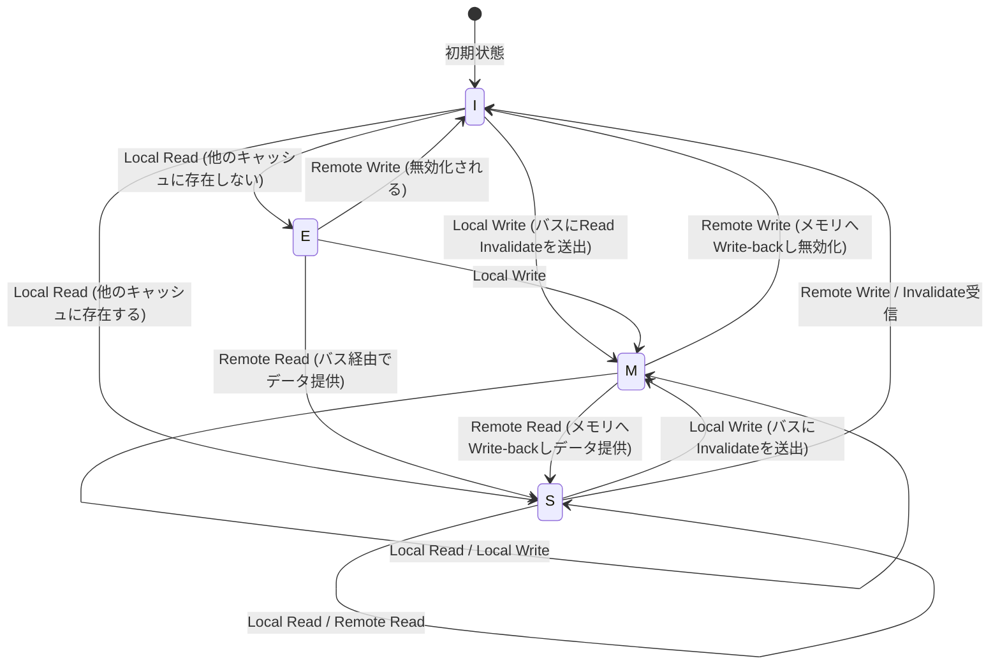

# CPUキャッシュの物理学とMESIプロトコル：マルチコアにおける整合性とメモリバリアの深淵

現代のソフトウェアエンジニアリングにおいて、CPUの動作原理を正しく理解することは、極限のパフォーマンスを引き出すための必須条件となっている。特にマルチコアアーキテクチャが標準となった現在、「なぜマルチスレッドプログラムは遅くなるのか」「なぜ謎のバグ（データ競合や可視性の欠如）が発生するのか」という問いに対する答えは、すべてCPUのシリコンダイ上で繰り広げられる「キャッシュコヒーレンス」と「メモリ一貫性モデル」の物理学に帰結する。

本稿では、CPUキャッシュの根底にある物理的な制約から出発し、キャッシュアーキテクチャの基本構造、マルチコアにおけるキャッシュコヒーレンス問題、その解決策であるMESIプロトコルの完全な解析、さらにはハードウェアの最適化（ストアバッファ、インバリデートキュー）がもたらす副作用とメモリバリア、そしてソフトウェアエンジニアが直面する偽共有（False Sharing）までを、学術的かつ実践的な深みを持って徹底的に解説する。

---

## 第1章：光速の壁とメモリウォール問題

### 1.1 光速の物理的限界とレイテンシ
CPUのクロック周波数が数GHzに達した現代、我々は「光速の壁」という絶対的な物理法則に直面している。例えば、5GHzで動作するCPUの場合、1クロックサイクルはわずか0.2ナノ秒（ns）である。光（電磁波）が真空中で1秒間に進む距離は約30万kmだが、0.2ナノ秒の間に進める距離は約6センチメートルに過ぎない。電気信号が銅線やシリコン内を伝わる速度は光速の約半分から3分の2程度であるため、1クロックで信号が到達できる物理的な距離はわずか数センチとなる。

これは、メインメモリ（DRAM）がCPUのコアから数センチ〜十数センチ離れたマザーボード上に配置されている限り、物理法則として「1クロックでメモリにアクセスすることは絶対に不可能である」という残酷な事実を示している。

### 1.2 メモリウォール問題
1990年代以降、CPUの演算速度はムーアの法則に従って指数関数的に向上したが、DRAMのアクセス速度の向上は緩やかなものにとどまった。このCPUとメモリの性能向上のペースの乖離は「メモリウォール（Memory Wall）問題」と呼ばれる。
具体的なレイテンシの階層（Numbers Every Programmer Should Know）を以下に示す：

- **L1キャッシュ参照**: 約0.5〜1 ns（約3〜4サイクル）
- **L2キャッシュ参照**: 約3〜7 ns（約10〜15サイクル）
- **L3キャッシュ参照**: 約15〜20 ns（約40〜60サイクル）
- **メインメモリ（DRAM）参照**: 約100 ns（約300〜400サイクル）

メインメモリアクセスはL1キャッシュへのアクセスに比べて約100倍から200倍も遅い。CPUがメインメモリからデータを待つ間、数百サイクルもの間パイプラインがストールすることになる。この絶望的な遅延を隠蔽するために導入されたのが「階層キャッシュアーキテクチャ」である。

### 1.3 キャッシュライン：なぜ64バイトなのか？
キャッシュは1バイト単位でデータを管理するわけではない。通常、現代のx86_64やARMアーキテクチャでは「64バイト」のチャンク単位でデータをメインメモリからフェッチし、管理する。この64バイトの単位を「キャッシュライン（Cache Line）」と呼ぶ。

なぜ64バイトなのか？ これには「空間的局所性（Spatial Locality）」の原則と、ハードウェアの実装コスト、DRAMのバースト転送効率というトレードオフが絡んでいる。
プログラムは、あるメモリアドレスにアクセスした直後、その隣接するアドレスにアクセスする確率が極めて高い（配列の走査など）。したがって、要求されたデータだけでなく周辺のデータも一括してフェッチしておくことで、キャッシュヒット率を劇的に高めることができる。
また、DRAMのインターフェースは、少量のデータを何度も送るよりも、ある程度の塊（バースト）として連続して送る方がスループットが高くなるように設計されている。64バイトは、管理用のタグ（Tag）のオーバーヘッドを抑えつつ、帯域幅の無駄遣いを防ぎ、かつ空間的局所性を十分に活かせる「スイートスポット」として、長年の経験とシミュレーションから導き出された値なのである。

---

## 第2章：キャッシュの構成法

CPU内部のSRAMを利用したキャッシュメモリは、限られた容量の中でいかに効率よくメインメモリのコピーを保持するかが鍵となる。メインメモリの広大なアドレス空間を、小さなキャッシュのどこにマッピングするかを決定する方式には、主に3つのモデルが存在する。

### 2.1 キャッシュの3つのマッピング方式

1. **ダイレクトマップ（Direct Mapped）**
   メインメモリの特定のアドレスが、キャッシュ内のただ1つの場所にしか配置できない方式。実装が非常にシンプルで高速だが、複数のアドレスが同じキャッシュエントリに競合（コンフリクト）した場合、交互にアクセスされると常にキャッシュミスが発生する「スラッシング（Thrashing）」が起きやすい。

2. **フルアソシアティブ（Fully Associative）**
   メインメモリのデータが、キャッシュ内の「どこにでも」配置できる方式。スラッシングの発生は最小限に抑えられるが、データを探す際にキャッシュのすべてのエントリを同時に比較検索する必要がある。このため、連想メモリ（CAM: Content Addressable Memory）という特殊で高価・高消費電力なハードウェアが必要になり、L1キャッシュのような大容量（数万エントリ）には適用できない。

3. **セットアソシアティブ（Set Associative）**
   ダイレクトマップとフルアソシアティブの折衷案であり、現代のCPUキャッシュの主流。キャッシュをいくつかの「セット（Set）」に分割し、メモリアドレスからアクセスすべきセットを一意に決定する（ダイレクトマップ的性質）。そして、そのセット内であれば、いくつかの「ウェイ（Way）」のどこに配置してもよい（フルアソシアティブ的性質）。例えば「8ウェイ・セットアソシアティブ」であれば、1つのセットの中に8つの格納場所がある。

### 2.2 メモリアドレスのビット分解（Tag, Index, Offset）

CPUがメモリアドレスをキャッシュで検索する際、アドレスは物理的に3つの部分に分割（ビット分解）されて解釈される。

- **Offset（オフセット）**: キャッシュライン（例：64バイト = 2^6）内のどのバイトを指すかを示す。下位6ビット。
- **Index（インデックス）**: キャッシュのどの「セット」にマッピングされるかを示す。
- **Tag（タグ）**: そのセットに格納されているデータが、本当に要求しているメインメモリのアドレスのものかを照合するための上位ビット。

例：32ビットアドレス、64KBの4ウェイ・セットアソシアティブキャッシュ、64バイトキャッシュラインの場合。
キャッシュライン数は 64KB / 64B = 1024。
4ウェイなので、セット数は 1024 / 4 = 256セット（2^8）。
- Offset: 下位6ビット
- Index: 次の8ビット
- Tag: 残りの18ビット

### 2.3 キャッシュ置換アルゴリズム
セットが満杯になった状態で新しいデータを格納する必要が生じた場合、既存のウェイのどれかを追い出す（Evict）必要がある。最も一般的なアルゴリズムは **LRU（Least Recently Used：最近最も使われなかったもの）** である。
しかし、ウェイ数が増えると真のLRUを実装するためのハードウェアコスト（追跡用のビットと更新ロジック）が非現実的になるため、現代のプロセッサは完全なLRUではなく **Pseudo-LRU（Tree-PLRUなど）** や、場合によってはランダム置換を用いて、ハードウェアリソースとヒット率の最適なバランスを取っている。

---

## 第3章：キャッシュコヒーレンス（一貫性）問題の発生メカニズム

シングルコア時代には、キャッシュとメインメモリの間でデータの一貫性を保つこと（ライトバックやライトスルー）だけを考えればよかった。しかし、マルチコア時代になると、真の恐怖が幕を開ける。

### 3.1 共有変数の悲劇
Core 0とCore 1が存在し、両方がメインメモリ上の同じ変数 `X`（初期値0）を読み書きする状況を想像してほしい。

1. Core 0が `X` を読み込む。Core 0のL1キャッシュに `X=0` が乗る。
2. Core 1が `X` を読み込む。Core 1のL1キャッシュにも `X=0` が乗る。
3. Core 0が `X` を `1` に書き換える。Core 0のL1キャッシュ上では `X=1` となる。（ライトバック方式のため、メインメモリにはまだ書き戻されない）。
4. Core 1が `X` を読み込む。Core 1は自身のL1キャッシュを参照し、`X=0` を得る。

物理的に共有されているはずの変数 `X` に対して、Core 0とCore 1で全く異なる値が見えてしまっている。これが「キャッシュコヒーレンス（キャッシュの一貫性）問題」である。これを解決するために、各コアのキャッシュ間で状態を同期するプロトコルが必要となる。

### 3.2 スヌープ方式とディレクトリ方式
コヒーレンスを維持するためのアーキテクチャには大きく分けて2つのアプローチがある。

- **スヌープ方式（Snooping）**
  すべてのキャッシュコントローラが、共有されたメモリバス上のトランザクションを常に「盗み聞き（スヌープ）」する方式。誰かがメモリに書き込もうとしたり、キャッシュラインを要求したりする信号を検知し、自身のキャッシュ状態を自律的に更新する。小〜中規模のマルチコア（数十コア程度まで）で極めて低遅延に動作するが、コア数が増えるとバスの帯域がブロードキャストで埋め尽くされるためスケールしない。

- **ディレクトリ方式（Directory-based）**
  各キャッシュラインがどのコアのキャッシュに存在するかという情報を、中央の「ディレクトリ」で管理する方式。あるコアが書き込みを行う際、ブロードキャストするのではなく、ディレクトリに問い合わせて対象となるコアだけにポイントツーポイントで無効化メッセージを送る。大規模なメニーコアプロセッサ（サーバー向けXeonやEPYCなど）で採用される。

本稿では、基礎にして最も重要な概念であるスヌープベースの「MESIプロトコル」に焦点を当てる。

---

## 第4章：MESIプロトコルの完全解析

キャッシュコヒーレンスプロトコルの事実上の標準であり、基礎となるのが **MESI（メシ）プロトコル** である。MESIは、各キャッシュラインに2ビットの状態フラグを持たせ、以下の4つの状態（State）のいずれかとして管理する。

### 4.1 4つの状態（Modified, Exclusive, Shared, Invalid）

1. **M (Modified - 変更済み)**
   - このキャッシュラインは、このコアのキャッシュに「のみ」存在し、かつメインメモリの値から「変更されている（Dirty）」。
   - このコアが変更をメモリに書き戻す（Write-back）義務を負っている。

2. **E (Exclusive - 排他)**
   - このキャッシュラインは、このコアのキャッシュに「のみ」存在し、かつメインメモリの値と「一致している（Clean）」。
   - いつでも他のコアに通知することなく、M状態に遷移して自由に書き込みができる。

3. **S (Shared - 共有)**
   - このキャッシュラインは、複数のコアのキャッシュに存在する可能性があり、かつメインメモリの値と「一致している（Clean）」。
   - 読み込みは自由に行えるが、書き込みを行うためには他のすべてのコアに「Invalidate（無効化）」メッセージを送り、この状態を一旦無効にする必要がある。

4. **I (Invalid - 無効)**
   - このキャッシュラインには有効なデータが入っていない。キャッシュミスの状態と同義。

### 4.2 状態遷移のダイナミクス

コア自身からのアクセス（Local Read / Local Write）と、バスを介した他のコアからのアクセス（Remote Read / Remote Write / Invalidate）によって、状態はダイナミックに遷移する。

以下は、MESIプロトコルの主要な状態遷移を示すMermaidダイアグラムである。



### 4.3 MESIの動作シミュレーション
前述の「共有変数の悲劇」のシナリオをMESIプロトコルで追ってみよう。

1. **Core 0が `X` をRead:** Core 0はバスにRead要求を出す。他コアは持っていないため、メモリからフェッチし、状態は **E (Exclusive)** となる。
2. **Core 1が `X` をRead:** Core 1がRead要求を出す。Core 0がこれをスヌープして応答し、状態を **S (Shared)** に下げる。Core 1も **S** 状態でキャッシュに取り込む。
3. **Core 0が `X` にWrite (`X=1`):** Core 0は状態が **S** であるため、バスに「Invalidate（無効化）」信号を送信する。Core 1はこれを受信し、自身の `X` を **I (Invalid)** にする。Core 0はInvalidateのAck（確認）をすべて受け取った後、状態を **M (Modified)** に引き上げ、キャッシュラインを更新する。
4. **Core 1が `X` をRead:** Core 1のキャッシュは **I** なのでキャッシュミスとなる。Read要求をバスに出す。Core 0（現在 **M**）がこれを検知し、最新の値 `X=1` をメモリへ書き戻し（Write-back）、同時にCore 1にデータを提供する。両者の状態は **S (Shared)** となる。

このようにして、MESIプロトコルはハードウェアレベルで完全に透過的なデータ一貫性を保証する。

### 4.4 MESIプロトコルの拡張：MOESIとMESIF
実際の最新プロセッサでは、MESIを最適化したプロトコルが使用されている。
- **MOESI (AMDなど)**: 新たに **O (Owned)** 状態を追加。M状態から他コアに読まれた際、メモリへのWrite-backを遅延させ、所有者（Owner）として他のキャッシュに直接ダーティなデータを提供し続けることでメモリ帯域を節約する。
- **MESIF (Intelなど)**: 新たに **F (Forward)** 状態を追加。複数のコアがS状態を持っているとき、他コアからRead要求があった場合に全員が応答するとバスが競合する。最後に読み込んだコアをF状態とし、F状態のコアだけが代表して応答することでトラフィックを最適化する。

---

## 第5章：ストアバッファ、インバリデートキューとメモリバリア

第4章までのMESIプロトコルは完璧に見えるが、これには致命的な性能上の欠陥がある。「書き込みの遅延」である。

### 5.1 MESIの性能限界とストアバッファの導入
Core 0がS状態のキャッシュラインに書き込もうとする場合、バスにInvalidate要求を送信し、他のすべてのコアから「無効化した（Invalidate Ack）」という応答を待たなければならない。この通信ラウンドトリップには数十〜数百サイクルかかる。CPUのパイプラインはこの間、完全にストールしてしまう。

これを解決するためにハードウェアエンジニアが導入したのが **ストアバッファ（Store Buffer）** である。
CPUコアが書き込みを行う際、キャッシュコントローラへのInvalidate完了を待たず、書き込むデータとアドレスをいったん「ストアバッファ」に放り込む。そしてCPUは即座に次の命令の実行に移る。ストアバッファは非同期にInvalidate Ackを待ち、揃った段階でL1キャッシュ（M状態）に書き込む。

この仕組みにより書き込みは高速化されるが、「ストアフォワーディング（Store Forwarding）」という機能が必要になる。自身が直前に書き込んだ値をすぐに読み込む場合、L1キャッシュにはまだ反映されていないため、ストアバッファを覗き込んで最新の値を拾わなければならない。

### 5.2 インバリデートキューによるAckの早期化
ストアバッファは非常に小さいため、すぐに満杯になってストールを引き起こす。なぜInvalidate Ackが遅いのか？ それは、他コアがInvalidate要求を受け取っても、そのコアのキャッシュが忙しい場合、無効化処理が遅れるからである。
これを解決するため、無効化要求を受け取ったコアは、実際にキャッシュを無効化する前に、要求を **インバリデートキュー（Invalidate Queue）** に突っ込み、即座に「Ack」を返信してしまう。無効化処理は後で非同期に行われる。

### 5.3 ハードウェアによるメモリ一貫性の破壊
ストアバッファとインバリデートキューは性能を劇的に向上させたが、その代償として「逐次一貫性（Sequential Consistency）」を破壊してしまった。

以下の有名な例を考える。（初期値 `A = 0`, `B = 0`）

```c
// Core 0                  // Core 1
A = 1;                     B = 1;
print(B);                  print(A);
```

MESIプロトコルが厳密に守られていれば、少なくともどちらかの書き込みが先に完了するため、両方とも `0` を印字することは絶対にない。
しかし、現実のCPUでは両方とも `0` を印字する可能性がある。
1. Core 0が `A=1` をストアバッファに書き込み、次へ進む。
2. Core 1が `B=1` をストアバッファに書き込み、次へ進む。
3. Core 0が `B` を読むが、Core 1の書き込みはまだCore 1のストアバッファにあるため `B=0` を読む。
4. Core 1が `A` を読むが、Core 0の書き込みはまだCore 0のストアバッファにあるため `A=0` を読む。

これが、アウトオブオーダー実行やハードウェアの最適化が引き起こす「可視性」の欠如である。

### 5.4 メモリバリア（メモリフェンス）
この問題を解決するためには、ソフトウェア側からハードウェアに対して「ここから先は順序を厳密に守れ」「ストアバッファをフラッシュしろ」と指示する命令が必要になる。それが **メモリバリア（Memory Barrier / Memory Fence）** である。

- **ストアバリア (Write Memory Barrier, `smp_wmb()`)**: ストアバッファ内のすべての書き込みがキャッシュにコミットされるまで、以降の書き込みを待機させる。
- **ロードバリア (Read Memory Barrier, `smp_rmb()`)**: インバリデートキュー内のすべての無効化要求が処理されるまで、以降の読み込みを待機させる。
- **フルバリア (Full Memory Barrier, `smp_mb()`)**: 上記両方を行う。

x86アーキテクチャは比較的強力な一貫性モデルである **TSO (Total Store Order)** を採用しており、通常の読み書きの順序はかなり保持される（ストアの後にロードが来る場合のみ順序が逆転しうる）。一方、ARMアーキテクチャは **Weak Consistency** を採用しており、バリアを明示しない限り命令の実行順序は極めて自由に再配置される。

### 5.5 アクワイア・リリースセマンティクス
現代の言語（C++11以降、Rust、Javaなど）では、CPUごとの複雑なバリア命令を直接書くのではなく、より高レベルな「Acquire / Release セマンティクス」を用いて一貫性を制御する。
- **Release (解放)**: 他のスレッドにデータを渡す際、それ以前のすべての書き込みが完了していることを保証する。
- **Acquire (獲得)**: 他のスレッドからデータを受け取る際、それ以降の読み込みが最新のデータを取得することを保証する。

---

## 第6章：ソフトウェアエンジニアが直面する現実

ここまでハードウェアの深淵を覗いてきたが、最後にこれが我々ソフトウェアエンジニアの書くコードにどう直結するのかを解説する。

### 6.1 偽共有（False Sharing）の悲劇
マルチスレッドプログラミングにおける最悪のパフォーマンスキラーの一つが **偽共有（False Sharing）** である。

キャッシュラインは64バイトの塊であると述べた。もし、全く無関係な変数 `A` と `B` がメモリ上で隣接しており、同じ64バイトのキャッシュラインに乗ってしまった場合どうなるか。

```cpp
struct Counter {
    volatile long long thread1_count; // Core 0 が頻繁に更新
    volatile long long thread2_count; // Core 1 が頻繁に更新
};
Counter c;
```

Core 0が `thread1_count` を更新すると、MESIプロトコルに従い、そのキャッシュライン全体がM状態になり、Core 1の持つキャッシュラインがInvalidateされる。
直後にCore 1が `thread2_count` を更新しようとすると、キャッシュミスが発生し、メインメモリ（またはCore 0のキャッシュ）から最新のキャッシュラインを取得し直す。そして今度はCore 0側がInvalidateされる。

プログラム上は全く別の変数を操作しているにもかかわらず、ハードウェアレベルでは64バイトのキャッシュラインの「所有権」をめぐって、コア間で猛烈なPing-Pong（キャッシュラインの奪い合い）が発生する。これにより、マルチスレッド化したのにシングルスレッドより遅くなるという悲劇が引き起こされる。

### 6.2 キャッシュラインアライメントによる解決
このFalse Sharingを防ぐためには、変数が互いに異なるキャッシュラインに配置されるようにメモリレイアウトを強制すればよい。C++11以降では `alignas` 指定子を用いる。

```cpp
#include <atomic>
#include <thread>
#include <vector>

// ハードウェアの破壊的干渉サイズ（通常64バイト）
#ifdef __cpp_lib_hardware_interference_size
    using std::hardware_destructive_interference_size;
#else
    constexpr std::size_t hardware_destructive_interference_size = 64;
#endif

struct AlignedCounter {
    // thread1_countをキャッシュラインの先頭に配置し、後ろにパディングを入れる
    alignas(hardware_destructive_interference_size) std::atomic<long long> thread1_count{0};
    
    // thread2_countも別のキャッシュラインの先頭に配置
    alignas(hardware_destructive_interference_size) std::atomic<long long> thread2_count{0};
};

int main() {
    AlignedCounter c;
    
    auto worker1 = [&c]() {
        for (int i = 0; i < 10000000; ++i) {
            // relaxedで十分（他の変数との依存がないため）
            c.thread1_count.fetch_add(1, std::memory_order_relaxed);
        }
    };
    
    auto worker2 = [&c]() {
        for (int i = 0; i < 10000000; ++i) {
            c.thread2_count.fetch_add(1, std::memory_order_relaxed);
        }
    };
    
    std::thread t1(worker1);
    std::thread t2(worker2);
    
    t1.join();
    t2.join();
    
    return 0;
}
```

このように、`alignas(64)` を付与することで変数間に適切なパディングが挿入され、物理的なキャッシュラインが分離される。これによりMESIプロトコルによる不必要なInvalidateの連鎖が断ち切られ、真の並列パフォーマンスが達成される。

### 6.3 Lock-freeデータ構造とメモリオーダー
さらに高度なLock-freeプログラミングでは、アトミック操作とメモリバリアを極限まで最適化する。C++の `std::atomic` における `memory_order` の指定は、まさに第5章で説明したハードウェアのバリア命令を直接コントロールするためのものである。

- `memory_order_seq_cst`: デフォルト。最も安全だが、重いフルバリア（`smp_mb`）を発行する。
- `memory_order_acquire` / `memory_order_release`: ロードバリアとストアバリアを発行し、変数の同期関係を構築する。
- `memory_order_relaxed`: バリアを一切発行せず、ただアトミック（分割されない）ことだけを保証する。キャッシュコヒーレンス（MESI）によって最終的な値の一致は保証されるが、他の変数の可視性順序は一切保証されない。

Lock-freeキューなどの設計では、不要なバリアを取り除き `relaxed` や `acquire/release` を適切に組み合わせつつ、False Sharingを避けるためにRing BufferのHeadとTailを別々のキャッシュラインに分離する、といった「CPU物理学に寄り添った設計」が求められるのである。

## 結論

我々が日常的に記述している変数への代入文は、シリコンの上では電気信号となり、階層キャッシュを巡り、MESIプロトコルの複雑な状態遷移を引き起こし、ストアバッファやインバリデートキューの嵐を通過してようやく確定する。
「ソフトウェアはハードウェアを隠蔽する」という抽象化の原則は素晴らしいが、極限のパフォーマンスが要求される並行プログラミングの世界においては、抽象化の壁を越えて物理レイヤの真実を理解することが、唯一の道なのである。
