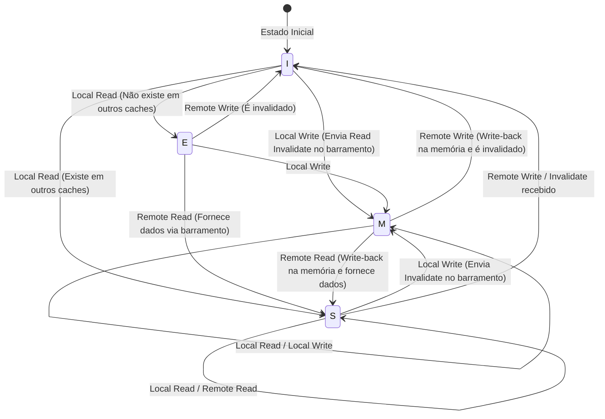

# A Física do Cache da CPU e o Protocolo MESI: As Profundezas da Coerência e das Barreiras de Memória em Multi-core

Na engenharia de software moderna, compreender corretamente os princípios de funcionamento da CPU tornou-se um pré-requisito indispensável para extrair o máximo de desempenho. Especialmente agora que as arquiteturas multi-core se tornaram o padrão, as respostas a perguntas como "por que programas multithread ficam lentos" e "por que surgem bugs misteriosos (condições de corrida ou falta de visibilidade)" resumem-se inteiramente à física da "coerência de cache" e dos "modelos de consistência de memória" que se desenrolam no chip de silício da CPU.

Neste artigo, partindo das restrições físicas subjacentes ao cache da CPU, explicaremos exaustivamente com profundidade acadêmica e prática: a estrutura básica da arquitetura de cache, o problema de coerência de cache em multi-core, a análise completa do protocolo MESI que resolve isso e, além disso, os efeitos colaterais e barreiras de memória trazidos pelas otimizações de hardware (store buffers, invalidate queues) e, finalmente, o Falso Compartilhamento (False Sharing) enfrentado por engenheiros de software.

---

## Capítulo 1: A Barreira da Velocidade da Luz e o Problema do Memory Wall

### 1.1 O Limite Físico da Velocidade da Luz e a Latência
Hoje, com as frequências de clock da CPU atingindo vários GHz, enfrentamos a lei física absoluta da "barreira da velocidade da luz". Por exemplo, no caso de uma CPU operando a 5GHz, um ciclo de clock é de apenas 0,2 nanossegundos (ns). A distância que a luz (ondas eletromagnéticas) percorre no vácuo em 1 segundo é de cerca de 300.000 km, mas a distância que pode percorrer em 0,2 nanossegundos é de apenas cerca de 6 centímetros. Como a velocidade com que os sinais elétricos se propagam através de fios de cobre ou silício é de cerca de metade a dois terços da velocidade da luz, a distância física que um sinal pode alcançar em um clock é de apenas alguns centímetros.

Isso demonstra o fato cruel de que, como lei da física, "é absolutamente impossível acessar a memória em um clock" enquanto a memória principal (DRAM) estiver localizada na placa-mãe a alguns ou dezenas de centímetros de distância dos núcleos da CPU.

### 1.2 O Problema do Memory Wall
Desde a década de 1990, a velocidade de processamento da CPU melhorou exponencialmente de acordo com a Lei de Moore, mas a melhoria na velocidade de acesso à DRAM tem sido gradual. Essa divergência no ritmo de melhoria de desempenho entre a CPU e a memória é chamada de "Problema do Memory Wall".
A hierarquia específica de latência (Números que Todo Programador Deve Saber - *Numbers Every Programmer Should Know*) é mostrada abaixo:

- **Referência ao Cache L1**: cerca de 0,5 a 1 ns (cerca de 3 a 4 ciclos)
- **Referência ao Cache L2**: cerca de 3 a 7 ns (cerca de 10 a 15 ciclos)
- **Referência ao Cache L3**: cerca de 15 a 20 ns (cerca de 40 a 60 ciclos)
- **Referência à Memória Principal (DRAM)**: cerca de 100 ns (cerca de 300 a 400 ciclos)

O acesso à memória principal é cerca de 100 a 200 vezes mais lento que o acesso ao cache L1. Enquanto a CPU espera pelos dados da memória principal, o pipeline irá parar (stall) por centenas de ciclos. A "arquitetura de cache hierárquico" foi introduzida para ocultar esse atraso desesperador.

### 1.3 Linha de Cache: Por que 64 bytes?
O cache não gerencia dados em unidades de 1 byte. Normalmente, em arquiteturas x86_64 e ARM modernas, os dados são buscados na memória principal e gerenciados em pedaços ("chunks") de "64 bytes". Essa unidade de 64 bytes é chamada de "Linha de Cache" (Cache Line).

Por que 64 bytes? Isso envolve o princípio da "Localidade Espacial" (Spatial Locality) e as compensações (trade-offs) de custos de implementação de hardware e eficiência de transferência em rajada (burst) da DRAM.
Em um programa, logo após acessar um determinado endereço de memória, a probabilidade de acessar seus endereços adjacentes é extremamente alta (como na varredura de um array). Portanto, ao buscar não apenas os dados solicitados, mas também os dados ao redor de uma vez, a taxa de acerto do cache (cache hit rate) pode ser drasticamente aumentada.
Além disso, a interface da DRAM é projetada para ter um throughput (taxa de transferência) maior quando envia dados continuamente como um bloco (burst) do que quando envia pequenas quantidades de dados repetidamente. 64 bytes é o "ponto ideal" derivado de anos de experiência e simulação para evitar o desperdício de largura de banda e aproveitar ao máximo a localidade espacial, mantendo baixo o overhead da Tag de gerenciamento.

---

## Capítulo 2: Métodos de Organização de Cache

O cache de memória usando SRAM dentro da CPU tem como chave a eficiência com que mantém cópias da memória principal em sua capacidade limitada. Existem principalmente três modelos de métodos para determinar onde mapear o vasto espaço de endereçamento da memória principal dentro do pequeno cache.

### 2.1 Os 3 Métodos de Mapeamento de Cache

1. **Mapeamento Direto (Direct Mapped)**
   Um método no qual um endereço específico na memória principal pode ser colocado em apenas um lugar no cache. É muito simples de implementar e rápido, mas se vários endereços colidirem (conflito) na mesma entrada de cache, ocorrerão constantes faltas de cache (cache misses) se acessados alternadamente, um fenômeno chamado "Thrashing", que é muito propenso a ocorrer.

2. **Totalmente Associativo (Fully Associative)**
   Um método no qual os dados da memória principal podem ser colocados em "qualquer lugar" no cache. A ocorrência de thrashing é minimizada, mas ao procurar dados, é necessário comparar e pesquisar todas as entradas do cache simultaneamente. Por isso, é necessário um hardware especial caro e que consome muita energia chamado Memória Endereçável por Conteúdo (CAM: Content Addressable Memory), e isso não pode ser aplicado a capacidades grandes (dezenas de milhares de entradas) como o cache L1.

3. **Associativo por Conjunto (Set Associative)**
   Um meio-termo entre o mapeamento direto e o totalmente associativo, e é o predominante nos caches de CPU modernos. O cache é dividido em vários "Conjuntos" (Sets), e o conjunto a ser acessado é determinado de forma única a partir do endereço de memória (propriedade do mapeamento direto). Em seguida, dentro desse conjunto, ele pode ser colocado em qualquer um dos vários "Caminhos" (Ways) (propriedade totalmente associativa). Por exemplo, se for "8-way Set Associative", existem 8 locais de armazenamento em um único conjunto.

### 2.2 Divisão de Bits do Endereço de Memória (Tag, Index, Offset)

Quando a CPU procura um endereço de memória no cache, o endereço é fisicamente dividido (bit-wise) em três partes para ser interpretado.

- **Offset**: Indica a qual byte na linha de cache (ex: 64 bytes = 2^6) se refere. Os 6 bits menos significativos (lower bits).
- **Index (Índice)**: Indica em qual "conjunto" do cache ele é mapeado.
- **Tag**: Os bits superiores (upper bits) usados para verificar se os dados armazenados nesse conjunto realmente pertencem ao endereço da memória principal solicitado.

Exemplo: Endereço de 32 bits, cache Set Associative 4-way de 64 KB, linha de cache de 64 bytes.
Número de linhas de cache é 64KB / 64B = 1024.
Como é 4-way, o número de conjuntos é 1024 / 4 = 256 conjuntos (2^8).
- Offset: 6 bits menos significativos
- Index: próximos 8 bits
- Tag: os 18 bits restantes

### 2.3 Algoritmos de Substituição de Cache
Se houver necessidade de armazenar novos dados quando um conjunto estiver cheio, um dos ways existentes deve ser removido (Evict). O algoritmo mais comum é o **LRU (Least Recently Used: O Menos Usado Recentemente)**.
No entanto, à medida que o número de ways aumenta, o custo de hardware para implementar um verdadeiro LRU (bits de rastreamento e lógica de atualização) torna-se irreal, então os processadores modernos não usam um LRU perfeito, mas usam **Pseudo-LRU (como Tree-PLRU)** ou, em alguns casos, substituição aleatória, alcançando o equilíbrio ideal entre recursos de hardware e taxa de acertos (hit rate).

---

## Capítulo 3: O Mecanismo de Ocorrência do Problema de Coerência de Cache (Consistência)

Na era de núcleo único (single-core), só precisávamos pensar em manter a consistência dos dados entre o cache e a memória principal (write-back ou write-through). No entanto, na era multi-core, o verdadeiro terror começa.

### 3.1 A Tragédia das Variáveis Compartilhadas
Imagine a situação em que o Core 0 e o Core 1 existem, e ambos leem e escrevem a mesma variável `X` (valor inicial 0) na memória principal.

1. Core 0 lê `X`. O cache L1 do Core 0 obtém `X=0`.
2. Core 1 lê `X`. O cache L1 do Core 1 também obtém `X=0`.
3. Core 0 reescreve `X` para `1`. No cache L1 do Core 0, torna-se `X=1`. (Devido ao método write-back, ele ainda não é escrito de volta na memória principal).
4. Core 1 lê `X`. O Core 1 faz referência ao seu próprio cache L1 e obtém `X=0`.

Para a variável `X`, que deve ser fisicamente compartilhada, o Core 0 e o Core 1 agora veem valores completamente diferentes. Este é o "Problema de Coerência de Cache (Consistência de Cache)". Para resolver isso, é necessário um protocolo que sincronize os estados entre os caches de cada núcleo.

### 3.2 O Método Snooping e o Método de Diretório
Existem duas abordagens principais para arquiteturas que mantêm a coerência.

- **Método Snooping (Snoop)**
  Um método em que todos os controladores de cache "bisbilhotam" (snoop) constantemente as transações no barramento de memória compartilhado. Eles detectam sinais quando alguém tenta escrever na memória ou solicita uma linha de cache e atualizam seu próprio estado de cache de forma autônoma. Funciona com latência extremamente baixa em multi-cores de pequena e média escala (até dezenas de núcleos), mas à medida que o número de núcleos aumenta, a largura de banda do barramento é preenchida por transmissões (broadcasts) e não escala.

- **Método de Diretório (Directory-based)**
  Um método que gerencia as informações sobre em qual cache de núcleo cada linha de cache existe usando um "diretório" central. Quando um núcleo escreve, em vez de enviar um broadcast, ele consulta o diretório e envia mensagens de invalidação ponto a ponto apenas para os núcleos alvo. Usado em processadores many-core em larga escala (como servidores Xeon ou EPYC).

Neste artigo, vamos focar no protocolo base e mais importante, o "Protocolo MESI", baseado em snoop.

---

## Capítulo 4: Análise Completa do Protocolo MESI

O padrão de fato e base para protocolos de coerência de cache é o **Protocolo MESI**. O MESI atribui a cada linha de cache um sinalizador de estado de 2 bits e a gerencia em um dos quatro estados a seguir (States).

### 4.1 Os 4 Estados (Modified, Exclusive, Shared, Invalid)

1. **M (Modified - Modificado)**
   - Esta linha de cache existe "apenas" no cache deste núcleo e foi "modificada" (Dirty) em relação ao valor na memória principal.
   - Este núcleo tem a obrigação de escrever (Write-back) as mudanças de volta na memória.

2. **E (Exclusive - Exclusivo)**
   - Esta linha de cache existe "apenas" no cache deste núcleo e é "consistente" (Clean) com o valor na memória principal.
   - Ele pode transitar livremente para o estado M a qualquer momento e escrever sem notificar outros núcleos.

3. **S (Shared - Compartilhado)**
   - Esta linha de cache pode existir nos caches de vários núcleos e é "consistente" (Clean) com o valor da memória principal.
   - Ele pode ler livremente, mas para escrever, deve enviar uma mensagem de "Invalidate" (Invalidação) para todos os outros núcleos e invalidar temporariamente este estado.

4. **I (Invalid - Inválido)**
   - Esta linha de cache não contém dados válidos. É sinônimo de estado de cache miss.

### 4.2 Dinâmica das Transições de Estado

O estado transita dinamicamente através de acessos pelo próprio núcleo (Local Read / Local Write) e acessos de outros núcleos através do barramento (Remote Read / Remote Write / Invalidate).

Abaixo está um diagrama Mermaid mostrando as principais transições de estado do protocolo MESI.



### 4.3 Simulação de Operação do MESI
Vamos seguir o cenário da "Tragédia das Variáveis Compartilhadas" mencionado anteriormente sob o protocolo MESI.

1. **Core 0 Lê `X`:** Core 0 emite um pedido de Read no barramento. Como outros núcleos não o possuem, ele busca da memória, e o estado torna-se **E (Exclusive)**.
2. **Core 1 Lê `X`:** Core 1 emite um pedido de Read. Core 0 faz snoop disso, responde, e abaixa seu estado para **S (Shared)**. Core 1 também o carrega em cache no estado **S**.
3. **Core 0 Escreve em `X` (`X=1`):** Como o estado de Core 0 é **S**, ele envia um sinal de "Invalidate" no barramento. Core 1 recebe isso e muda seu `X` para **I (Invalid)**. Depois de receber todos os Acks (confirmações) de Invalidate, Core 0 eleva o estado para **M (Modified)** e atualiza a linha de cache.
4. **Core 1 Lê `X`:** Como o cache do Core 1 é **I**, resulta em cache miss. Ele emite um pedido de Read no barramento. Core 0 (atualmente **M**) detecta isso, escreve (Write-back) o valor mais recente `X=1` de volta na memória e, simultaneamente, fornece os dados para Core 1. Ambos os estados tornam-se **S (Shared)**.

Desta forma, o protocolo MESI garante consistência de dados completamente transparente em nível de hardware.

### 4.4 Extensões do Protocolo MESI: MOESI e MESIF
Processadores modernos reais usam protocolos que otimizam o MESI.
- **MOESI (AMD, etc.)**: Adiciona um novo estado **O (Owned)**. Quando lido por outro núcleo no estado M, ele atrasa o Write-back para a memória, continuando a fornecer os dados sujos (dirty) diretamente para outros caches como proprietário (Owner), economizando assim a largura de banda da memória.
- **MESIF (Intel, etc.)**: Adiciona um novo estado **F (Forward)**. Quando vários núcleos têm o estado S, o barramento competiria se todos respondessem a uma solicitação de leitura de outro núcleo. O último núcleo a ler se torna o estado F, e apenas o núcleo no estado F responde em nome de todos, otimizando o tráfego.

---

## Capítulo 5: Store Buffer, Invalidate Queue e Barreira de Memória

Até o Capítulo 4, o protocolo MESI parece perfeito, mas há uma falha crítica de desempenho nisso. O "atraso na escrita".

### 5.1 O Limite de Desempenho do MESI e a Introdução do Store Buffer
Quando o Core 0 tenta escrever em uma linha de cache no estado S, ele deve enviar um pedido de Invalidate no barramento e esperar por uma resposta "Invalidado (Invalidate Ack)" de todos os outros núcleos. Essa comunicação (round-trip) leva dezenas a centenas de ciclos. Durante esse tempo, o pipeline da CPU fica completamente parado (stalled).

Para resolver isso, os engenheiros de hardware introduziram o **Store Buffer** (Buffer de Armazenamento).
Quando o núcleo da CPU executa uma escrita, em vez de esperar que a invalidação no controlador de cache seja concluída, ele coloca temporariamente os dados e o endereço a serem escritos no "Store Buffer". Então, a CPU passa imediatamente para a execução da próxima instrução. O Store Buffer aguarda assincronamente os Invalidate Acks e, quando todos estiverem reunidos, escreve no cache L1 (estado M).

Através deste mecanismo, a escrita é acelerada, mas é necessária uma função chamada "Store Forwarding" (Encaminhamento de Armazenamento). Quando ele lê imediatamente um valor que acabou de escrever, como isso ainda não refletiu no cache L1, ele deve olhar dentro do Store Buffer para pegar o valor mais recente.

### 5.2 Aceleração de Ack pela Invalidate Queue
O Store Buffer é muito pequeno, então ele fica cheio rapidamente e causa um stall. Por que o Invalidate Ack é lento? É porque quando outro núcleo recebe uma solicitação Invalidate, o processamento de invalidação é atrasado se o cache daquele núcleo estiver ocupado.
Para resolver isso, o núcleo que recebe a solicitação de invalidação, antes de realmente invalidar o cache, coloca a solicitação na **Invalidate Queue** (Fila de Invalidação) e retorna um "Ack" imediatamente. O processo de invalidação será feito assincronamente mais tarde.

### 5.3 Destruição da Consistência de Memória pelo Hardware
O Store Buffer e a Invalidate Queue melhoraram drasticamente o desempenho, mas ao preço de destruir a "Consistência Sequencial" (Sequential Consistency).

Considere o seguinte exemplo famoso. (Valores iniciais `A = 0`, `B = 0`)

```c
// Core 0                  // Core 1
A = 1;                     B = 1;
print(B);                  print(A);
```

Se o protocolo MESI for estritamente seguido, pelo menos uma das escritas será concluída primeiro, então é absolutamente impossível que ambos imprimam `0`.
No entanto, em CPUs reais, é possível que ambos imprimam `0`.
1. Core 0 escreve `A=1` no Store Buffer e avança.
2. Core 1 escreve `B=1` no Store Buffer e avança.
3. Core 0 lê `B`, mas como a escrita de Core 1 ainda está no Store Buffer de Core 1, ele lê `B=0`.
4. Core 1 lê `A`, mas como a escrita de Core 0 ainda está no Store Buffer de Core 0, ele lê `A=0`.

Isso é a falta de "visibilidade" causada pela execução fora de ordem (out-of-order) e pelas otimizações de hardware.

### 5.4 Barreira de Memória (Memory Barrier / Memory Fence)
Para resolver esse problema, são necessárias instruções do lado do software para o hardware para dizer "deste ponto em diante, mantenha a ordem estritamente" e "limpe (flush) o store buffer". Isso é chamado de **Barreira de Memória (Memory Barrier / Memory Fence)**.

- **Store Barrier (Write Memory Barrier, `smp_wmb()`)**: Faz com que as escritas subsequentes aguardem até que todas as escritas no Store Buffer sejam confirmadas (committed) no cache.
- **Load Barrier (Read Memory Barrier, `smp_rmb()`)**: Faz com que as leituras subsequentes aguardem até que todas as solicitações de invalidação na Invalidate Queue sejam processadas.
- **Full Barrier (Full Memory Barrier, `smp_mb()`)**: Faz ambos.

A arquitetura x86 adota o **TSO (Total Store Order)**, que é um modelo de consistência relativamente forte, e a ordem de leituras e escritas normais é bastante preservada (a ordem pode ser invertida apenas se um load vier após um store). Por outro lado, a arquitetura ARM adota a **Weak Consistency** (Consistência Fraca), em que a ordem de execução das instruções pode ser reorganizada de forma bastante livre, a menos que as barreiras sejam especificadas explicitamente.

### 5.5 Semântica Acquire-Release
Em linguagens modernas (C++11 em diante, Rust, Java, etc.), em vez de escrever as complexas instruções de barreira por CPU diretamente, nós controlamos a consistência usando uma semântica de nível superior "Acquire / Release".
- **Release (Liberação)**: Ao passar dados para outra thread, garante que todas as escritas anteriores estejam concluídas.
- **Acquire (Aquisição)**: Ao receber dados de outra thread, garante que as leituras subsequentes obtenham os dados mais recentes.

---

## Capítulo 6: A Realidade Enfrentada pelos Engenheiros de Software

Olhamos para as profundezas do hardware até agora, mas, finalmente, explicaremos como isso se conecta diretamente ao código escrito por nós, engenheiros de software.

### 6.1 A Tragédia do Falso Compartilhamento (False Sharing)
Um dos piores assassinos de desempenho na programação multithread é o **Falso Compartilhamento (False Sharing)**.

Mencionamos que uma linha de cache é um bloco de 64 bytes. E se variáveis completamente não relacionadas `A` e `B` forem adjacentes na memória e acabarem na mesma linha de cache de 64 bytes?

```cpp
struct Counter {
    volatile long long thread1_count; // Core 0 atualiza frequentemente
    volatile long long thread2_count; // Core 1 atualiza frequentemente
};
Counter c;
```

Quando o Core 0 atualiza o `thread1_count`, de acordo com o protocolo MESI, toda essa linha de cache entra no estado M, e a linha de cache mantida pelo Core 1 é invalidada.
Imediatamente depois, quando o Core 1 tenta atualizar o `thread2_count`, ocorre um cache miss e ele busca novamente a linha de cache mais recente da memória principal (ou do cache do Core 0). E desta vez, o lado do Core 0 é invalidado.

Embora o programa esteja manipulando variáveis completamente diferentes, um feroz Ping-Pong (roubo da linha de cache) ocorre entre os núcleos em nível de hardware sobre a "propriedade" da linha de cache de 64 bytes. Isso causa a tragédia de que multithreading torna-se mais lento do que single-threading.

### 6.2 Resolução pelo Alinhamento da Linha de Cache (Cache Line Alignment)
Para prevenir esse False Sharing, você simplesmente precisa forçar o layout da memória para que as variáveis sejam colocadas em diferentes linhas de cache. Do C++11 em diante, usamos o especificador `alignas`.

```cpp
#include <atomic>
#include <thread>
#include <vector>

// Tamanho de interferência destrutiva do hardware (geralmente 64 bytes)
#ifdef __cpp_lib_hardware_interference_size
    using std::hardware_destructive_interference_size;
#else
    constexpr std::size_t hardware_destructive_interference_size = 64;
#endif

struct AlignedCounter {
    // Coloca thread1_count no início da linha de cache, e adiciona preenchimento (padding) atrás
    alignas(hardware_destructive_interference_size) std::atomic<long long> thread1_count{0};
    
    // thread2_count também é colocado no início de outra linha de cache
    alignas(hardware_destructive_interference_size) std::atomic<long long> thread2_count{0};
};

int main() {
    AlignedCounter c;
    
    auto worker1 = [&c]() {
        for (int i = 0; i < 10000000; ++i) {
            // relaxed é suficiente (já que não há dependência com outras variáveis)
            c.thread1_count.fetch_add(1, std::memory_order_relaxed);
        }
    };
    
    auto worker2 = [&c]() {
        for (int i = 0; i < 10000000; ++i) {
            c.thread2_count.fetch_add(1, std::memory_order_relaxed);
        }
    };
    
    std::thread t1(worker1);
    std::thread t2(worker2);
    
    t1.join();
    t2.join();
    
    return 0;
}
```

Desta forma, ao adicionar `alignas(64)`, o preenchimento (padding) apropriado é inserido entre as variáveis, separando as linhas de cache físicas. Isso quebra a cadeia de invalidações desnecessárias (Invalidates) devida ao protocolo MESI, e atinge um verdadeiro desempenho paralelo.

### 6.3 Estruturas de Dados Lock-free e Ordem de Memória
Na programação Lock-free ainda mais avançada, as operações atômicas e as barreiras de memória são otimizadas ao extremo. A especificação de `memory_order` no `std::atomic` do C++ serve exatamente para controlar diretamente as instruções de barreira de hardware explicadas no Capítulo 5.

- `memory_order_seq_cst`: Padrão. O mais seguro, mas emite uma barreira total pesada (`smp_mb`).
- `memory_order_acquire` / `memory_order_release`: Emitem barreira de leitura (load barrier) e barreira de escrita (store barrier) para construir uma relação de sincronização de variáveis.
- `memory_order_relaxed`: Não emite nenhuma barreira e apenas garante a atomicidade (não é dividido). Devido à coerência de cache (MESI), o acordo do valor final é garantido, mas a ordem de visibilidade de outras variáveis não é garantida de forma alguma.

No projeto de filas (queues) lock-free e similares, é necessário "projetar em harmonia com a física da CPU": remover barreiras desnecessárias, combinando adequadamente `relaxed` e `acquire/release`, enquanto separa o Head e o Tail de um Ring Buffer em diferentes linhas de cache para evitar o False Sharing.

## Conclusão

Uma simples declaração de atribuição a uma variável, que escrevemos rotineiramente, torna-se um sinal elétrico no silício, viaja através de caches hierárquicos, aciona transições complexas de estado do protocolo MESI, passa por tempestades de store buffers e invalidate queues e só então é finalmente estabelecida.
O princípio de abstração de que "software esconde o hardware" é maravilhoso, mas no mundo da programação concorrente, onde exige-se um desempenho extremo, transpor a parede da abstração e entender a verdade da camada física é o único caminho.
