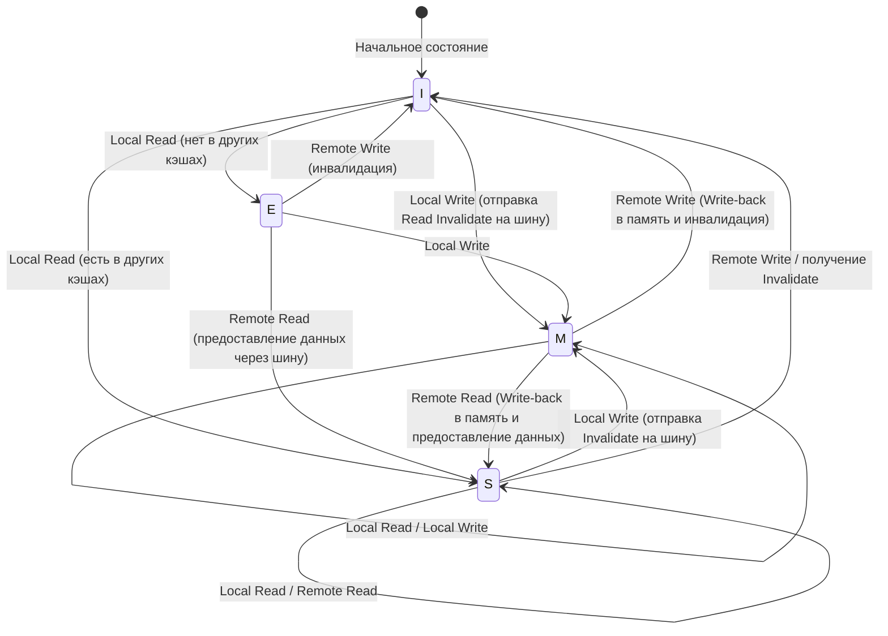

# Физика кэша CPU и протокол MESI: Бездна согласованности и барьеров памяти в многоядерных системах

В современной программной инженерии правильное понимание принципов работы CPU является обязательным условием для достижения максимальной производительности. Особенно сейчас, когда многоядерная архитектура стала стандартом, ответы на вопросы вроде «почему многопоточные программы работают медленнее» или «почему возникают загадочные баги (состояние гонки данных и отсутствие видимости)» полностью сводятся к физике «когерентности кэша» и «моделей согласованности памяти», разворачивающейся на кремниевом кристалле процессора.

В этой статье мы подробно, с академической и практической глубиной, рассмотрим архитектуру кэша, начав с физических ограничений, лежащих в основе кэша CPU. Мы разберем проблему когерентности кэша в многоядерных системах, ее решение — полный анализ протокола MESI, а также побочные эффекты и барьеры памяти, порождаемые аппаратными оптимизациями (буфер сохранения, очередь инвалидации), вплоть до ложного разделения (False Sharing), с которым сталкиваются инженеры-программисты.

---

## Глава 1: Световой барьер и проблема "стены памяти" (Memory Wall)

### 1.1 Физические ограничения скорости света и задержки (Latency)
Сегодня, когда тактовая частота процессоров достигает нескольких гигагерц, мы сталкиваемся с абсолютным физическим законом — «световым барьером». Например, для процессора, работающего на частоте 5 ГГц, один тактовый цикл составляет всего 0.2 наносекунды (нс). Свет (электромагнитные волны) в вакууме за одну секунду проходит расстояние около 300 тысяч км, но за 0.2 наносекунды он может пройти лишь около 6 сантиметров. Поскольку скорость распространения электрического сигнала в медном проводе или кремнии составляет от половины до двух третей скорости света, физическое расстояние, которое сигнал может пройти за один такт, составляет всего несколько сантиметров.

Это демонстрирует жестокий факт: пока основная память (DRAM) расположена на материнской плате в нескольких или паре десятков сантиметров от ядер процессора, физические законы диктуют, что «обращение к памяти за один такт абсолютно невозможно».

### 1.2 Проблема стены памяти
С 1990-х годов скорость вычислений процессоров росла экспоненциально в соответствии с законом Мура, тогда как скорость доступа к DRAM увеличивалась лишь постепенно. Это расхождение в темпах роста производительности процессора и памяти называется проблемой «стены памяти» (Memory Wall).
Конкретная иерархия задержек (числа, которые должен знать каждый программист) выглядит следующим образом:

- **Обращение к кэшу L1**: около 0.5–1 нс (примерно 3–4 такта)
- **Обращение к кэшу L2**: около 3–7 нс (примерно 10–15 тактов)
- **Обращение к кэшу L3**: около 15–20 нс (примерно 40–60 тактов)
- **Обращение к основной памяти (DRAM)**: около 100 нс (примерно 300–400 тактов)

Доступ к основной памяти примерно в 100–200 раз медленнее, чем доступ к кэшу L1. Пока процессор ждет данные из основной памяти, конвейер будет простаивать сотни тактов. Для скрытия этой безнадежной задержки была внедрена «иерархическая архитектура кэша».

### 1.3 Строка кэша: Почему именно 64 байта?
Кэш не управляет данными побайтово. Обычно в современных архитектурах x86_64 и ARM данные извлекаются из основной памяти и управляются блоками по «64 байта». Эта 64-байтная единица называется «строкой кэша» (Cache Line).

Почему 64 байта? Это связано с компромиссом между принципом «пространственной локальности» (Spatial Locality), стоимостью аппаратной реализации и эффективностью пакетной (burst) передачи DRAM.
Программы с крайне высокой вероятностью обращаются к смежным адресам памяти сразу после обращения к определенному адресу (например, при обходе массива). Следовательно, запрашивая не только нужные данные, но и окружающие их данные единым блоком, можно резко повысить коэффициент попадания в кэш (cache hit rate).
Кроме того, интерфейс DRAM спроектирован так, что пропускная способность выше при непрерывной передаче определенного блока (пакета) данных, нежели при многократной отправке малых объемов. Значение 64 байта было выведено на основе многолетнего опыта и симуляций как «золотая середина», которая снижает накладные расходы на управляющие теги (Tag), предотвращает пустую трату пропускной способности и в полной мере использует пространственную локальность.

---

## Глава 2: Методы организации кэша

Ключ к эффективному использованию кэш-памяти на основе SRAM внутри процессора заключается в том, как наиболее эффективно хранить копии данных из основной памяти в ограниченном объеме. Существует три основные модели определения того, куда в малом кэше будет отображаться обширное адресное пространство основной памяти.

### 2.1 Три метода отображения (маппинга) кэша

1. **Прямое отображение (Direct Mapped)**
   Метод, при котором определенный адрес основной памяти может быть размещен только в одном конкретном месте кэша. Реализация очень проста и работает быстро, но если несколько адресов конкурируют (конфликтуют) за одну и ту же запись кэша и доступ к ним происходит поочередно, легко возникает «пробуксовка» (Thrashing), при которой постоянно происходят промахи кэша.

2. **Полностью ассоциативный (Fully Associative)**
   Метод, при котором данные из основной памяти могут быть размещены «где угодно» в кэше. Пробуксовка сводится к минимуму, но при поиске данных необходимо одновременно сравнивать и искать по всем записям кэша. Для этого требуется специальное, дорогое и энергоемкое оборудование — ассоциативная память (CAM: Content Addressable Memory), и этот метод не применим для кэшей большого объема (десятки тысяч записей), таких как кэш L1.

3. **Множественно-ассоциативный (Set Associative)**
   Компромисс между прямым отображением и полностью ассоциативным кэшем, являющийся основным стандартом для кэшей современных процессоров. Кэш делится на несколько «наборов» (Set), и адрес памяти однозначно определяет, к какому набору будет произведен доступ (свойство прямого отображения). Затем внутри этого набора данные могут быть размещены в любом из нескольких «путей» (Way) (свойство полностью ассоциативного кэша). Например, при «8-канальном множественно-ассоциативном кэше» (8-way set associative) в одном наборе есть 8 мест для хранения.

### 2.2 Битовое разбиение адреса памяти (Tag, Index, Offset)

Когда процессор ищет адрес памяти в кэше, физически адрес разбивается (декодируется) на три части для интерпретации.

- **Offset (Смещение)**: Указывает на конкретный байт внутри строки кэша (например, 64 байта = 2^6). Младшие 6 бит.
- **Index (Индекс)**: Указывает, в какой «набор» (set) кэша отображается адрес.
- **Tag (Тег)**: Старшие биты, используемые для проверки того, действительно ли данные, хранящиеся в этом наборе, принадлежат запрашиваемому адресу основной памяти.

Пример: 32-битный адрес, 64 КБ 4-канальный множественно-ассоциативный кэш, строка кэша 64 байта.
Количество строк кэша = 64 КБ / 64 байта = 1024.
Так как каналов 4, количество наборов = 1024 / 4 = 256 наборов (2^8).
- Offset: Младшие 6 бит
- Index: Следующие 8 бит
- Tag: Оставшиеся 18 бит

### 2.3 Алгоритмы замещения кэша
Когда набор заполнен и требуется сохранить новые данные, необходимо вытеснить (Evict) один из существующих путей (way). Наиболее распространенным алгоритмом является **LRU (Least Recently Used: дольше всего не использовавшийся)**.
Однако, с увеличением количества каналов аппаратные затраты (биты отслеживания и логика обновления) на реализацию истинного LRU становятся нереалистичными. Поэтому современные процессоры используют не идеальный LRU, а **Pseudo-LRU (например, Tree-PLRU)** или иногда случайное замещение для достижения оптимального баланса между аппаратными ресурсами и процентом попаданий в кэш.

---

## Глава 3: Механизм возникновения проблемы когерентности (согласованности) кэша

В эпоху одноядерных процессоров достаточно было заботиться лишь о поддержании согласованности данных между кэшем и основной памятью (обратная запись или сквозная запись). Однако в эпоху многоядерных процессоров начинается настоящий кошмар.

### 3.1 Трагедия общих переменных
Представьте ситуацию, в которой существуют Core 0 и Core 1, и оба читают и пишут в одну и ту же переменную `X` (с начальным значением 0) в основной памяти.

1. Core 0 читает `X`. В кэш L1 ядра Core 0 загружается `X=0`.
2. Core 1 читает `X`. В кэш L1 ядра Core 1 также загружается `X=0`.
3. Core 0 изменяет `X` на `1`. В кэше L1 ядра Core 0 `X=1`. (Поскольку используется политика обратной записи (write-back), данные еще не записаны в основную память).
4. Core 1 читает `X`. Core 1 обращается к своему кэшу L1 и получает `X=0`.

Для переменной `X`, которая физически должна быть общей, Core 0 и Core 1 видят совершенно разные значения. Это и есть «проблема когерентности (согласованности) кэша». Для ее решения необходим протокол синхронизации состояний между кэшами каждого ядра.

### 3.2 Методы слежения (Snooping) и на основе директорий (Directory)
Существуют два основных архитектурных подхода для поддержания когерентности.

- **Метод слежения (Snooping)**
  Метод, при котором все контроллеры кэша постоянно «подслушивают» (snoop) транзакции на общей шине памяти. Засекая сигналы о том, что кто-то пытается произвести запись в память или запрашивает строку кэша, они автономно обновляют состояние своего кэша. Этот метод работает с крайне низкой задержкой в малых и средних многоядерных системах (до нескольких десятков ядер), но не масштабируется, так как с ростом числа ядер пропускная способность шины заполняется широковещательными (broadcast) сообщениями.

- **Метод на основе каталогов (Directory-based)**
  Метод, при котором информация о том, в кэше какого ядра находится каждая строка кэша, управляется в центральном «каталоге» (directory). Когда ядро производит запись, вместо отправки широковещательного сообщения, оно запрашивает каталог и отправляет сообщения инвалидации (отмены) "точка-точка" только тем ядрам, у которых есть копия. Этот метод применяется в масштабируемых многоядерных процессорах (таких как серверные Xeon и EPYC).

В этой статье мы сосредоточимся на протоколе «MESI», который основан на слежении и является фундаментальной и важнейшей концепцией.

---

## Глава 4: Полный анализ протокола MESI

Де-факто стандартом и основой протоколов когерентности кэша является **протокол MESI (МЕСИ)**. MESI выделяет 2 бита флагов состояния для каждой строки кэша, управляя ею как одним из четырех следующих состояний (State).

### 4.1 Четыре состояния (Modified, Exclusive, Shared, Invalid)

1. **M (Modified - Измененный)**
   - Эта строка кэша существует «исключительно» в кэше данного ядра и «отличается (Dirty)» от значения в основной памяти.
   - Данное ядро обязано записать изменения обратно в память (Write-back).

2. **E (Exclusive - Эксклюзивный)**
   - Эта строка кэша существует «исключительно» в кэше данного ядра и «совпадает (Clean)» со значением в основной памяти.
   - Ядро может в любой момент, без уведомления других ядер, перейти в состояние M и свободно осуществлять запись.

3. **S (Shared - Разделяемый)**
   - Эта строка кэша может существовать в кэшах нескольких ядер и «совпадает (Clean)» со значением в основной памяти.
   - Чтение может выполняться свободно, но для записи необходимо отправить сообщение об «инвалидации» (Invalidate) всем остальным ядрам, чтобы временно аннулировать их состояние.

4. **I (Invalid - Недействительный)**
   - Эта строка кэша не содержит действительных данных. Эквивалентно состоянию промаха кэша.

### 4.2 Динамика переходов состояний

Состояние динамически меняется в зависимости от доступа самого ядра (Local Read / Local Write) и доступа других ядер через шину (Remote Read / Remote Write / Invalidate).

Ниже представлена диаграмма Mermaid, показывающая основные переходы состояний протокола MESI.



### 4.3 Симуляция работы MESI
Давайте проследим описанный ранее сценарий «трагедии общих переменных» с помощью протокола MESI.

1. **Core 0 читает `X`:** Core 0 отправляет запрос на чтение в шину. Поскольку у других ядер данных нет, они извлекаются из памяти, и состояние становится **E (Exclusive)**.
2. **Core 1 читает `X`:** Core 1 отправляет запрос на чтение. Core 0 перехватывает его (snoop), отвечает и понижает состояние до **S (Shared)**. Core 1 также загружает данные в кэш в состоянии **S**.
3. **Core 0 записывает в `X` (`X=1`):** Поскольку состояние Core 0 — **S**, оно отправляет сигнал «Инвалидации» (Invalidate) в шину. Core 1 получает его и переводит свой `X` в состояние **I (Invalid)**. Core 0, дождавшись всех подтверждений инвалидации (Ack), повышает свое состояние до **M (Modified)** и обновляет строку кэша.
4. **Core 1 читает `X`:** Поскольку в кэше Core 1 состояние **I**, происходит промах кэша. Запрос на чтение отправляется в шину. Core 0 (в данный момент в состоянии **M**) обнаруживает это, записывает актуальное значение `X=1` обратно в память (Write-back) и одновременно предоставляет данные Core 1. Состояние обоих становится **S (Shared)**.

Таким образом, протокол MESI гарантирует полностью прозрачную согласованность данных на аппаратном уровне.

### 4.4 Расширения протокола MESI: MOESI и MESIF
В реальных современных процессорах используются оптимизированные версии протокола MESI.
- **MOESI (например, в AMD)**: Добавлено новое состояние **O (Owned)**. Когда данные читаются другими ядрами из состояния M, обратная запись в память (Write-back) откладывается, и ядро-владелец (Owner) продолжает напрямую предоставлять "грязные" (dirty) данные другим кэшам, что экономит пропускную способность памяти.
- **MESIF (например, в Intel)**: Добавлено новое состояние **F (Forward)**. Когда несколько ядер имеют состояние S и поступает запрос на чтение от другого ядра, ответ от всех сразу приведет к конфликту на шине. Ядро, которое читало данные последним, получает состояние F, и только оно (выступая представителем) отвечает на запрос, тем самым оптимизируя трафик.

---

## Глава 5: Буфер сохранения (Store Buffer), очередь инвалидации (Invalidate Queue) и барьеры памяти

До 4-й главы протокол MESI выглядит идеальным, но в нем есть фатальный недостаток с точки зрения производительности — «задержка записи».

### 5.1 Ограничения производительности MESI и внедрение буфера сохранения (Store Buffer)
Если Core 0 хочет выполнить запись в строку кэша, находящуюся в состоянии S, оно должно отправить запрос Invalidate в шину и ждать ответа «инвалидация выполнена» (Invalidate Ack) от всех остальных ядер. Этот цикл связи занимает от десятков до сотен тактов. В течение этого времени конвейер процессора полностью простаивает.

Для решения этой проблемы инженеры оборудования внедрили **буфер сохранения (Store Buffer)**.
Когда ядро процессора выполняет запись, оно не дожидается завершения инвалидации от контроллера кэша, а временно помещает записываемые данные и адрес в «буфер сохранения». Затем процессор немедленно переходит к выполнению следующей инструкции. Буфер сохранения асинхронно ждет получения всех Invalidate Ack и только после этого записывает данные в кэш L1 (в состоянии M).

Этот механизм ускоряет запись, но требует функции «Store Forwarding» (пересылка сохранения). Если ядро хочет прочитать значение, которое оно только что записало, поскольку оно еще не отражено в кэше L1, процессору необходимо заглянуть в свой буфер сохранения, чтобы получить актуальное значение.

### 5.2 Ускорение Ack с помощью очереди инвалидации (Invalidate Queue)
Буфер сохранения очень мал, поэтому он быстро переполняется и вызывает задержки (stall). Почему Invalidate Ack приходит медленно? Это происходит потому, что даже если другие ядра получают запрос на инвалидацию, процесс инвалидации задерживается, если их собственные кэши заняты.
Для решения этой проблемы ядро, получившее запрос на инвалидацию, вместо того чтобы фактически инвалидировать кэш, помещает запрос в **очередь инвалидации (Invalidate Queue)** и немедленно возвращает «Ack». Сама обработка инвалидации выполняется позже асинхронно.

### 5.3 Разрушение аппаратной согласованности памяти
Буфер сохранения и очередь инвалидации кардинально повысили производительность, но ценой этого стало разрушение «последовательной согласованности» (Sequential Consistency).

Рассмотрим следующий известный пример. (Начальные значения `A = 0`, `B = 0`)

```c
// Core 0                  // Core 1
A = 1;                     B = 1;
print(B);                  print(A);
```

Если протокол MESI соблюдается строго, по крайней мере одна из записей завершится первой, поэтому ситуация, при которой оба напечатают `0`, абсолютно исключена.
Однако в реальных процессорах оба могут напечатать `0`.
1. Core 0 записывает `A=1` в буфер сохранения и переходит к следующему шагу.
2. Core 1 записывает `B=1` в буфер сохранения и переходит к следующему шагу.
3. Core 0 читает `B`, но запись Core 1 все еще находится в буфере сохранения Core 1, поэтому он читает `B=0`.
4. Core 1 читает `A`, но запись Core 0 все еще находится в буфере сохранения Core 0, поэтому он читает `A=0`.

Это и есть отсутствие «видимости», вызванное внеочередным исполнением (Out-of-order execution) и аппаратными оптимизациями.

### 5.4 Барьеры памяти (Memory Barrier / Memory Fence)
Для решения этой проблемы необходимо, чтобы программное обеспечение давало аппаратному обеспечению инструкции: «с этого момента строго соблюдай порядок» или «сбрось буфер сохранения». Это и есть **барьеры памяти (Memory Barrier / Memory Fence)**.

- **Барьер сохранения (Write Memory Barrier, `smp_wmb()`)**: Задерживает последующие операции записи до тех пор, пока все записи в буфере сохранения не будут зафиксированы в кэше.
- **Барьер загрузки (Read Memory Barrier, `smp_rmb()`)**: Задерживает последующие операции чтения до тех пор, пока все запросы на инвалидацию в очереди инвалидации не будут обработаны.
- **Полный барьер (Full Memory Barrier, `smp_mb()`)**: Выполняет оба вышеуказанных действия.

Архитектура x86 использует относительно сильную модель согласованности **TSO (Total Store Order)**, где обычный порядок чтения/записи в значительной степени сохраняется (порядок может быть нарушен только если чтение следует за записью). С другой стороны, архитектура ARM использует **Weak Consistency** (слабую согласованность), при которой порядок выполнения инструкций перестраивается крайне свободно, если барьеры не указаны явно.

### 5.5 Семантика Acquire и Release
В современных языках программирования (C++11 и выше, Rust, Java и др.) вместо прямого написания сложных инструкций барьеров для конкретного процессора используются высокоуровневые концепции «Acquire / Release Семантика» для управления согласованностью.
- **Release (Освобождение)**: Гарантирует, что при передаче данных другому потоку все предшествующие записи завершены.
- **Acquire (Захват)**: Гарантирует, что при получении данных от другого потока все последующие чтения будут извлекать актуальные данные.

---

## Глава 6: Реальность, с которой сталкиваются инженеры-программисты

До сих пор мы заглядывали в бездну аппаратного обеспечения, но напоследок мы объясним, как это напрямую связано с кодом, который пишут инженеры-программисты.

### 6.1 Трагедия ложного разделения (False Sharing)
Одним из худших убийц производительности в многопоточном программировании является **ложное разделение (False Sharing)**.

Как уже упоминалось, строка кэша представляет собой блок из 64 байт. Что произойдет, если совершенно независимые переменные `A` и `B` будут расположены рядом в памяти и попадут в одну 64-байтную строку кэша?

```cpp
struct Counter {
    volatile long long thread1_count; // Core 0 часто обновляет
    volatile long long thread2_count; // Core 1 часто обновляет
};
Counter c;
```

Когда Core 0 обновляет `thread1_count`, согласно протоколу MESI вся эта строка кэша переходит в состояние M, а строка кэша у Core 1 становится Invalid (инвалидируется).
Сразу после этого, если Core 1 пытается обновить `thread2_count`, возникает промах кэша, и он заново извлекает самую свежую строку кэша из основной памяти (или из кэша Core 0). Затем инвалидируется строка кэша у Core 0.

Несмотря на то, что в программе обрабатываются совершенно разные переменные, на аппаратном уровне ядра вступают в ожесточенный пинг-понг (перехват строки кэша) за право "владения" этой 64-байтной строкой. Это приводит к трагедии, когда многопоточная программа работает медленнее, чем однопоточная.

### 6.2 Решение путем выравнивания строк кэша (Cache Line Alignment)
Чтобы предотвратить False Sharing, достаточно принудительно задать раскладку памяти (memory layout) так, чтобы переменные располагались в разных строках кэша. В C++11 и выше для этого используется спецификатор `alignas`.

```cpp
#include <atomic>
#include <thread>
#include <vector>

// Размер деструктивной интерференции аппаратного обеспечения (обычно 64 байта)
#ifdef __cpp_lib_hardware_interference_size
    using std::hardware_destructive_interference_size;
#else
    constexpr std::size_t hardware_destructive_interference_size = 64;
#endif

struct AlignedCounter {
    // thread1_count размещается в начале строки кэша, а позади добавляется отступ (padding)
    alignas(hardware_destructive_interference_size) std::atomic<long long> thread1_count{0};
    
    // thread2_count также размещается в начале другой строки кэша
    alignas(hardware_destructive_interference_size) std::atomic<long long> thread2_count{0};
};

int main() {
    AlignedCounter c;
    
    auto worker1 = [&c]() {
        for (int i = 0; i < 10000000; ++i) {
            // relaxed достаточно (так как нет зависимости от других переменных)
            c.thread1_count.fetch_add(1, std::memory_order_relaxed);
        }
    };
    
    auto worker2 = [&c]() {
        for (int i = 0; i < 10000000; ++i) {
            c.thread2_count.fetch_add(1, std::memory_order_relaxed);
        }
    };
    
    std::thread t1(worker1);
    std::thread t2(worker2);
    
    t1.join();
    t2.join();
    
    return 0;
}
```

Таким образом, добавление `alignas(64)` вставляет подходящие отступы (padding) между переменными, физически разделяя строки кэша. Благодаря этому прерывается цепочка ненужных инвалидаций протокола MESI и достигается истинная параллельная производительность.

### 6.3 Структуры данных без блокировок (Lock-free) и порядок памяти (Memory Order)
В более продвинутом программировании без блокировок (Lock-free programming) атомарные операции и барьеры памяти оптимизируются до предела. Указание `memory_order` в `std::atomic` языка C++ — это именно способ прямого контроля над аппаратными инструкциями барьеров, описанными в Главе 5.

- `memory_order_seq_cst`: По умолчанию. Самый безопасный, но инициирует тяжелый полный барьер (`smp_mb`).
- `memory_order_acquire` / `memory_order_release`: Инициирует барьеры загрузки и сохранения, выстраивая отношения синхронизации между переменными.
- `memory_order_relaxed`: Не инициирует никаких барьеров и гарантирует только то, что операция атомарна (неделима). Благодаря когерентности кэша (MESI) гарантируется конечное согласование значений, но порядок видимости других переменных не гарантируется вообще.

При проектировании очередей без блокировок требуется «проектирование с учетом физики процессора», где удаляются ненужные барьеры, должным образом комбинируются `relaxed` или `acquire/release`, а Head (голова) и Tail (хвост) кольцевого буфера (Ring Buffer) разделяются на разные строки кэша во избежание False Sharing.

## Заключение

Операторы присваивания переменным, которые мы пишем каждый день, на кристалле кремния превращаются в электрические сигналы, перемещаются по иерархическому кэшу, вызывают сложные переходы состояний в протоколе MESI, проходят сквозь бурю буферов сохранения и очередей инвалидации и лишь затем окончательно фиксируются.
Принцип абстракции, гласящий, что «программное обеспечение скрывает аппаратное обеспечение», замечателен, но в мире параллельного программирования, где требуется максимальная производительность, единственный путь — выйти за рамки абстракции и понять истину физического уровня.
