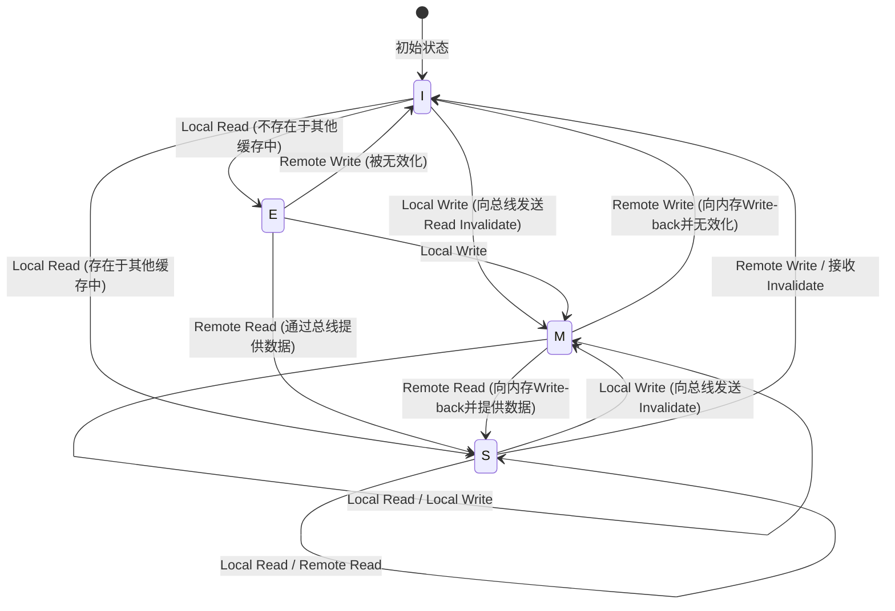

# CPU缓存的物理学与MESI协议：多核中的一致性与内存屏障的深渊

在现代软件工程中，正确理解CPU的工作原理已成为发挥极致性能的必要条件。特别是在多核架构成为标准的今天，“为什么多线程程序会变慢”“为什么会发生神秘的bug（数据竞争或可见性缺失）”这些问题的答案，全都归结于在CPU硅晶片上展开的“缓存一致性（Cache Coherence）”与“内存一致性模型（Memory Consistency Model）”的物理学。

本文将从CPU缓存底层的物理限制出发，深入彻底地以学术与实践的角度，讲解缓存架构的基本结构、多核中的缓存一致性问题、作为其解决方案的MESI协议的完整解析，乃至硬件优化（存储缓冲区、失效队列）所带来的副作用与内存屏障，以及软件工程师所面临的伪共享（False Sharing）问题。

---

## 第1章：光速壁垒与内存墙问题

### 1.1 光速的物理极限与延迟
在CPU时钟频率达到数GHz的今天，我们面临着“光速壁垒”这一绝对的物理法则。例如，在5GHz下运行的CPU，1个时钟周期仅为0.2纳秒（ns）。光（电磁波）在真空中1秒内行进的距离约为30万公里，但在0.2纳秒内能行进的距离仅约6厘米。由于电信号在铜线或硅内部的传播速度大约为光速的二分之一到三分之二，因此在1个时钟周期内信号能够到达的物理距离只有短短几厘米。

这揭示了一个残酷的事实：只要主存（DRAM）配置在距离CPU核心几厘米到十几厘米外的主板上，根据物理法则，“在1个时钟周期内访问内存是绝对不可能的”。

### 1.2 内存墙问题
自20世纪90年代以来，CPU的运算速度遵循摩尔定律呈指数级增长，但DRAM的访问速度提升却非常缓慢。这种CPU与内存性能提升步伐的脱节被称为“内存墙（Memory Wall）问题”。
以下是具体的延迟层级（每个程序员都应该知道的数字）：

- **L1缓存访问**: 约0.5〜1 ns（约3〜4个周期）
- **L2缓存访问**: 约3〜7 ns（约10〜15个周期）
- **L3缓存访问**: 约15〜20 ns（约40〜60个周期）
- **主存（DRAM）访问**: 约100 ns（约300〜400个周期）

主存访问比L1缓存访问要慢约100到200倍。在CPU等待来自主存的数据时，流水线会停顿数百个周期。为了隐藏这种令人绝望的延迟，便引入了“分层缓存架构”。

### 1.3 缓存行：为什么是64字节？
缓存并不是以1字节为单位来管理数据的。通常，在现代的x86_64或ARM架构中，数据会以“64字节”为区块单位从主存中抓取并进行管理。这64字节的单位被称为“缓存行（Cache Line）”。

为什么是64字节？这涉及到“空间局部性（Spatial Locality）”原则、硬件实现成本以及DRAM突发传输效率之间的权衡。
程序在访问某个内存地址之后，极有可能会立刻访问其相邻的地址（例如遍历数组）。因此，通过将请求的数据及其周边数据一次性全部抓取，能够显著提高缓存命中率。
此外，DRAM的接口设计为，与其多次发送少量数据，不如作为具有一定规模的数据块（突发）连续发送，这样吞吐量会更高。64字节是一个“最佳平衡点（Sweet Spot）”，它既能控制用于管理的标签（Tag）开销，防止带宽浪费，又能充分利用空间局部性，这是经过多年的经验与模拟得出的一致数值。

---

## 第2章：缓存的构成方法

利用CPU内部SRAM的缓存内存，其关键在于如何在有限的容量中最高效地保存主存的副本。关于如何将主存广阔的地址空间映射到狭小的缓存中的特定位置，主要有3种模型。

### 2.1 缓存的3种映射方式

1. **直接映射（Direct Mapped）**
   主存中的特定地址只能放置在缓存中唯一一个位置的方式。实现非常简单且高速，但当多个地址竞争（冲突）同一个缓存条目时，如果交替访问，很容易发生持续导致缓存未命中的“抖动（Thrashing）”现象。

2. **全相联（Fully Associative）**
   主存中的数据可以放置在缓存中“任何位置”的方式。抖动的发生被降至最低，但在寻找数据时必须同时比较搜索缓存中的所有条目。为此，需要一种被称为相联内存（CAM: Content Addressable Memory）的特殊、昂贵且高功耗的硬件，无法应用于L1缓存这样的大容量（数万个条目）中。

3. **组相联（Set Associative）**
   直接映射与全相联的折中方案，也是现代CPU缓存的主流。将缓存划分为若干个“组（Set）”，由内存地址唯一决定应访问的组（具有直接映射的特性）。而在该组内，则可以放置在任意一个“路（Way）”中（具有全相联的特性）。例如，如果是“8路组相联（8-way Set Associative）”，则在一个组中有8个存放位置。

### 2.2 内存地址的位分解（Tag, Index, Offset）

当CPU在缓存中搜索内存地址时，地址在物理上会被分割（位分解）为3个部分进行解析。

- **Offset（偏移量）**: 指示所指向的是缓存行（例：64字节 = 2^6）内的哪个字节。低6位。
- **Index（索引）**: 指示映射到缓存的哪个“组”。
- **Tag（标签）**: 用于校验该组中存储的数据是否真的是所请求的主存地址的高位比特。

示例：32位地址、64KB的4路组相联缓存、64字节缓存行的情况。
缓存行数为 64KB / 64B = 1024。
由于是4路，因此组数为 1024 / 4 = 256个组（2^8）。
- Offset: 低6位
- Index: 接下来的8位
- Tag: 剩下的18位

### 2.3 缓存替换算法
当组已满而需要存储新数据时，必须驱逐（Evict）现有路中的某一个。最常见的算法是 **LRU（Least Recently Used：最近最少使用）**。
然而，随着路数的增加，实现真正LRU的硬件成本（用于追踪的位和更新逻辑）变得不切实际，因此现代处理器并未使用完全的LRU，而是采用 **伪LRU（Pseudo-LRU，如Tree-PLRU等）** 或在某些情况下使用随机替换，以在硬件资源与命中率之间取得最佳平衡。

---

## 第3章：缓存一致性问题的产生机制

在单核时代，只需考虑如何在缓存和主存之间保持数据一致性（回写或直写）即可。然而，到了多核时代，真正的恐怖才刚刚拉开帷幕。

### 3.1 共享变量的悲剧
想象一下存在Core 0和Core 1，两者都在读写主存上的同一个变量 `X`（初始值为0）的情况。

1. Core 0读取 `X`。Core 0的L1缓存中装入 `X=0`。
2. Core 1读取 `X`。Core 1的L1缓存中也装入 `X=0`。
3. Core 0将 `X` 改写为 `1`。在Core 0的L1缓存上 `X=1`。（由于是回写方式，此时尚未写回主存）。
4. Core 1读取 `X`。Core 1查询自己的L1缓存，得到 `X=0`。

对于物理上本应共享的变量 `X`，在Core 0和Core 1上却看到了完全不同的值。这就是“缓存一致性（Cache Coherence）问题”。为了解决这个问题，需要一种能在各核的缓存之间同步状态的协议。

### 3.2 嗅探方式与目录方式
维护一致性的架构大体可以分为2种途径。

- **嗅探方式（Snooping）**
   所有的缓存控制器时刻“偷听（嗅探）”共享内存总线上的事务。当检测到有人试图写入内存或请求缓存行时，它会自主更新自身的缓存状态。在中小规模的多核（几十个核心左右）中能以极低的延迟运行，但随着核心数量的增加，总线带宽会被广播占满，因此无法扩展。

- **目录方式（Directory-based）**
   使用一个中央“目录”来记录每个缓存行存在于哪个核的缓存中。当某个核执行写入时，它不会进行广播，而是查询目录并仅向相关的核发送点对点的无效化消息。通常在大型众核处理器（如服务器级别的Xeon或EPYC等）中被采用。

本文将聚焦于作为基础且最重要的基于嗅探的“MESI协议”。

---

## 第4章：MESI协议的完整解析

作为缓存一致性协议事实上的标准与基础，便是 **MESI协议**。MESI让每个缓存行拥有2位的状态标志，并将其作为以下4种状态（State）之一进行管理。

### 4.1 4种状态（Modified, Exclusive, Shared, Invalid）

1. **M (Modified - 已修改)**
   - 该缓存行“仅”存在于此核的缓存中，并且相对于主存的值已被“修改（Dirty）”。
   - 该核负有将修改写回（Write-back）内存的义务。

2. **E (Exclusive - 独占)**
   - 该缓存行“仅”存在于此核的缓存中，并且与主存的值“一致（Clean）”。
   - 可以随时转换为M状态并自由写入，而无需通知其他核。

3. **S (Shared - 共享)**
   - 该缓存行可能存在于多个核的缓存中，并且与主存的值“一致（Clean）”。
   - 可以自由进行读取，但为了进行写入，必须向其他所有核发送“无效化（Invalidate）”消息，并暂时使此状态无效。

4. **I (Invalid - 无效)**
   - 该缓存行中没有包含有效数据。与缓存未命中的状态同义。

### 4.2 状态转换的动态过程

通过核自身的访问（本地读取 / 本地写入）以及通过总线来自其他核的访问（远程读取 / 远程写入 / 无效化），状态会发生动态转换。

以下是展示MESI协议主要状态转换的Mermaid图表。



### 4.3 MESI的运行模拟
让我们用MESI协议来追踪前面提到的“共享变量的悲剧”场景。

1. **Core 0读取 `X`:** Core 0向总线发出读取请求。由于其他核没有，因此从内存中抓取，状态变为 **E (Exclusive)**。
2. **Core 1读取 `X`:** Core 1发出读取请求。Core 0嗅探到此请求并做出响应，将状态降级为 **S (Shared)**。Core 1也以 **S** 状态将其装入缓存。
3. **Core 0写入 `X` (`X=1`):** 由于Core 0的状态为 **S**，它向总线发送“无效化（Invalidate）”信号。Core 1接收到此信号，将其自身的 `X` 设为 **I (Invalid)**。Core 0在收到所有Invalidate的Ack（确认）后，将状态提升为 **M (Modified)**，并更新缓存行。
4. **Core 1读取 `X`:** 由于Core 1的缓存为 **I**，因此发生缓存未命中。向总线发出读取请求。Core 0（当前为 **M**）检测到此请求，将最新的值 `X=1` 写回（Write-back）到内存中，并同时向Core 1提供数据。两者的状态都变为 **S (Shared)**。

通过这种方式，MESI协议在硬件层面上保证了完全透明的数据一致性。

### 4.4 MESI协议的扩展：MOESI与MESIF
在实际的最新处理器中，使用的是对MESI进行优化的协议。
- **MOESI (AMD等)**: 新增了 **O (Owned)** 状态。当处于M状态的数据被其他核读取时，延迟向内存的Write-back，而是作为所有者（Owner）直接向其他缓存继续提供脏数据，从而节省内存带宽。
- **MESIF (Intel等)**: 新增了 **F (Forward)** 状态。当多个核都拥有S状态时，如果其他核发出读取请求，所有人均响应会导致总线竞争。将最后读取该数据的核设为F状态，只有处于F状态的核作为代表进行响应，从而优化流量。

---

## 第5章：存储缓冲区、失效队列与内存屏障

在第4章之前的MESI协议看似完美，但它有一个致命的性能缺陷。那就是“写入延迟”。

### 5.1 MESI的性能极限与存储缓冲区的引入
当Core 0试图写入处于S状态的缓存行时，它必须向总线发送Invalidate请求，并等待其他所有核回复“已无效化（Invalidate Ack）”。这个通信往返需要几十到几百个周期。在这期间，CPU的流水线会完全停顿。

为了解决这个问题，硬件工程师引入了 **存储缓冲区（Store Buffer）**。
当CPU核执行写入时，它不等待缓存控制器的Invalidate完成，而是先将要写入的数据和地址丢进“存储缓冲区”中。然后CPU会立即继续执行下一条指令。存储缓冲区会异步等待Invalidate Ack，在凑齐后再写入到L1缓存中（转换为M状态）。

这种机制加快了写入速度，但也需要一个叫“存储转发（Store Forwarding）”的功能。如果CPU需要立刻读取自己刚刚写入的值，因为L1缓存中还未反映出来，它必须查看存储缓冲区以获取最新的值。

### 5.2 依靠失效队列提前返回Ack
由于存储缓冲区非常小，它很快就会被填满并引发停顿。为什么Invalidate Ack会很慢？因为即使其他核收到了Invalidate请求，如果该核的缓存正忙，无效化处理也会被延迟。
为了解决这个问题，接收到无效化请求的核在实际使缓存无效之前，会将请求塞入 **失效队列（Invalidate Queue）**，并立即回复“Ack”。无效化处理则在稍后异步执行。

### 5.3 硬件对内存一致性的破坏
存储缓冲区和失效队列大幅提升了性能，但其代价是破坏了“顺序一致性（Sequential Consistency）”。

考虑以下著名的例子。（初始值 `A = 0`, `B = 0`）

```c
// Core 0                  // Core 1
A = 1;                     B = 1;
print(B);                  print(A);
```

如果严格遵守MESI协议，至少会有其中一个写入先完成，因此绝对不会出现两者都打印出 `0` 的情况。
然而，在现实的CPU中，两者都有可能打印出 `0`。
1. Core 0将 `A=1` 写入存储缓冲区，继续前进。
2. Core 1将 `B=1` 写入存储缓冲区，继续前进。
3. Core 0读取 `B`，但由于Core 1的写入仍在Core 1的存储缓冲区中，因此它读到了 `B=0`。
4. Core 1读取 `A`，但由于Core 0的写入仍在Core 0的存储缓冲区中，因此它读到了 `A=0`。

这就是乱序执行或硬件优化所导致的“可见性”缺失。

### 5.4 内存屏障（内存栅栏）
为了解决这个问题，需要从软件层面发出指令，指示硬件“从这里开始必须严格遵守顺序”“刷新存储缓冲区”。这就是 **内存屏障（Memory Barrier / Memory Fence）**。

- **写屏障 (Write Memory Barrier, `smp_wmb()`)**: 使后续的写入操作等待，直到存储缓冲区内的所有写入都提交到缓存。
- **读屏障 (Read Memory Barrier, `smp_rmb()`)**: 使后续的读取操作等待，直到失效队列中的所有无效化请求都被处理完毕。
- **全屏障 (Full Memory Barrier, `smp_mb()`)**: 同时执行上述两者。

x86架构采用了相对强的一致性模型 **TSO (Total Store Order)**，通常的读写顺序能得到很好的保持（只有在写入之后紧跟读取的情况下，顺序才可能发生逆转）。另一方面，ARM架构采用的是 **弱一致性（Weak Consistency）**，除非显式指定屏障，否则指令的执行顺序可以极其自由地被重新排列。

### 5.5 获取-释放语义 (Acquire-Release Semantics)
在现代语言（C++11及以后、Rust、Java等）中，我们不再直接编写每个CPU特有的复杂屏障指令，而是使用更高级的“获取 / 释放语义（Acquire / Release Semantics）”来控制一致性。
- **释放 (Release)**: 在将数据传递给其他线程时，确保在此之前的所有写入均已完成。
- **获取 (Acquire)**: 从其他线程接收数据时，确保在此之后的所有读取都能获取到最新的数据。

---

## 第6章：软件工程师所面临的现实

至此，我们探索了硬件的深渊，最后将讲解这如何直接关系到我们软件工程师所编写的代码。

### 6.1 伪共享（False Sharing）的悲剧
多线程编程中最致命的性能杀手之一就是 **伪共享（False Sharing）**。

如前所述，缓存行是64字节的数据块。如果完全不相关的变量 `A` 和 `B` 在内存上相邻，并被装载到了同一个64字节的缓存行中，会发生什么呢？

```cpp
struct Counter {
    volatile long long thread1_count; // Core 0 频繁更新
    volatile long long thread2_count; // Core 1 频繁更新
};
Counter c;
```

当Core 0更新 `thread1_count` 时，根据MESI协议，整个缓存行的状态变为M，导致Core 1拥有的缓存行被无效化（Invalidate）。
紧接着，如果Core 1试图更新 `thread2_count`，就会发生缓存未命中，必须从主存（或Core 0的缓存）重新获取最新的缓存行。然后这次轮到Core 0端被无效化。

尽管在程序上操作的是完全不同的变量，但在硬件层面上，为了争夺64字节缓存行的“所有权”，核与核之间会发生激烈的乒乓效应（相互争夺缓存行）。这将导致一种悲剧：明明实现了多线程，却比单线程还要慢。

### 6.2 通过缓存行对齐来解决
为了防止这种False Sharing，只需强制控制内存布局，使变量被分配到相互独立的缓存行上即可。在C++11及以后的版本中，可以使用 `alignas` 说明符。

```cpp
#include <atomic>
#include <thread>
#include <vector>

// 硬件的破坏性干扰大小（通常为64字节）
#ifdef __cpp_lib_hardware_interference_size
    using std::hardware_destructive_interference_size;
#else
    constexpr std::size_t hardware_destructive_interference_size = 64;
#endif

struct AlignedCounter {
    // 将thread1_count放置在缓存行的开头，并在后面插入填充（Padding）
    alignas(hardware_destructive_interference_size) std::atomic<long long> thread1_count{0};
    
    // 将thread2_count也放置在另一个缓存行的开头
    alignas(hardware_destructive_interference_size) std::atomic<long long> thread2_count{0};
};

int main() {
    AlignedCounter c;
    
    auto worker1 = [&c]() {
        for (int i = 0; i < 10000000; ++i) {
            // relaxed即可（因为与其他变量没有依赖关系）
            c.thread1_count.fetch_add(1, std::memory_order_relaxed);
        }
    };
    
    auto worker2 = [&c]() {
        for (int i = 0; i < 10000000; ++i) {
            c.thread2_count.fetch_add(1, std::memory_order_relaxed);
        }
    };
    
    std::thread t1(worker1);
    std::thread t2(worker2);
    
    t1.join();
    t2.join();
    
    return 0;
}
```

如此这般，通过添加 `alignas(64)`，便会在变量之间插入适当的填充，从而分离物理上的缓存行。这样就切断了因MESI协议引起的不必要的连续Invalidate，实现了真正的并行性能。

### 6.3 无锁数据结构与内存序
在更高级的无锁（Lock-free）编程中，原子操作与内存屏障被优化到了极限。C++的 `std::atomic` 中的 `memory_order` 指定，正是为了直接控制我们在第5章中解释过的硬件屏障指令。

- `memory_order_seq_cst`: 默认。最安全，但会发出沉重的全屏障（`smp_mb`）。
- `memory_order_acquire` / `memory_order_release`: 发出读屏障和写屏障，构建变量的同步关系。
- `memory_order_relaxed`: 不发出任何屏障，仅保证其操作是原子的（不可分割的）。通过缓存一致性（MESI），最终值的一致性是可以得到保证的，但完全不保证其他变量的可见性顺序。

在设计如无锁队列等结构时，需要“贴近CPU物理学进行设计”，例如在去除不必要的屏障并妥善组合 `relaxed` 或 `acquire/release` 的同时，为了避免False Sharing，将Ring Buffer（环形缓冲区）的Head和Tail分离到不同的缓存行中。

## 结论

我们日常编写的变量赋值语句，在硅晶片上化为电信号，巡回于分层缓存中，引发MESI协议复杂的状态转换，在穿过存储缓冲区和失效队列的风暴后，最终才得以确立。
“软件隐蔽硬件”的抽象化原则固然美妙，但在要求极致性能的并发编程世界中，跨越抽象的壁垒，理解物理层的真相，才是唯一的出路。
