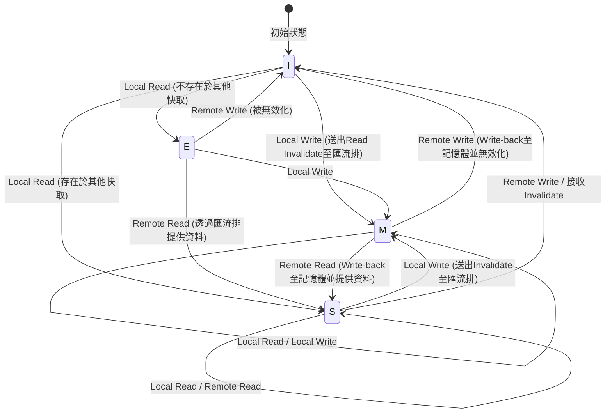

# CPU快取的物理學與MESI協定：多核心中的一致性與記憶體屏障之深淵

在現代軟體工程中，正確理解CPU的運作原理已成為發揮極限效能的必備條件。特別是在多核心架構成為標準的現在，對於「為何多執行緒程式會變慢？」、「為何會發生神秘的Bug（資料競爭或可見性缺失）？」這些問題的答案，全都歸結於CPU矽晶片上所上演的「快取一致性（Cache Coherence）」與「記憶體一致性模型（Memory Consistency Model）」之物理學。

本文將從CPU快取底層的物理限制出發，徹底解說快取架構的基本結構、多核心中的快取一致性問題、其解決方案MESI協定的完整解析，乃至硬體最佳化（儲存緩衝區、無效化佇列）所帶來的副作用與記憶體屏障，以及軟體工程師所面臨的偽共享（False Sharing）問題，兼具學術與實務深度。

---

## 第1章：光速之壁與記憶體牆問題

### 1.1 光速的物理極限與延遲
在CPU時脈頻率達到數GHz的現代，我們正面臨著「光速之壁」這項絕對的物理法則。例如，對於以5GHz運作的CPU而言，1個時脈週期僅有0.2奈秒（ns）。光（電磁波）在真空中1秒內行進的距離約為30萬公里，但在0.2奈秒內能行進的距離不過約6公分。由於電子訊號在銅線或矽中傳導的速度約為光速的一半至三分之二左右，因此1個時脈內訊號能到達的物理距離僅有幾公分而已。

這揭示了一個殘酷的事實：只要主記憶體（DRAM）配置在距離CPU核心數公分至十幾公分外的主機板上，作為物理法則，「要在1個時脈內存取記憶體是絕對不可能的」。

### 1.2 記憶體牆問題
自1990年代以來，CPU的運算速度遵循摩爾定律呈指數級提升，但DRAM存取速度的提升卻相當緩慢。這種CPU與記憶體效能提升速度的落差被稱為「記憶體牆（Memory Wall）問題」。
具體的延遲階層（每位程式設計師都應該知道的數字）如下所示：

- **L1快取參照**: 約0.5〜1 ns（約3〜4個週期）
- **L2快取參照**: 約3〜7 ns（約10〜15個週期）
- **L3快取參照**: 約15〜20 ns（約40〜60個週期）
- **主記憶體（DRAM）參照**: 約100 ns（約300〜400個週期）

主記憶體存取比L1快取存取慢了約100到200倍。當CPU等待來自主記憶體的資料時，管線（Pipeline）將會停滯數百個週期。為掩蓋這種令人絕望的延遲，因而導入了「階層快取架構」。

### 1.3 快取行：為什麼是64位元組？
快取並非以1位元組為單位來管理資料。通常在現代的x86_64或ARM架構中，會以「64位元組（Bytes）」的區塊為單位從主記憶體擷取資料並進行管理。這個64位元組的單位稱為「快取行（Cache Line）」。

為什麼是64位元組？這牽涉到「空間局部性（Spatial Locality）」原則、硬體實作成本，以及DRAM突發傳輸（Burst Transfer）效率之間的權衡。
程式在存取某個記憶體位址後，極有可能緊接著存取其相鄰的位址（如陣列走訪等）。因此，透過將請求的資料連同周邊資料一併擷取，能大幅提升快取命中率。
此外，DRAM的介面設計在連續傳送一定數量的區塊（突發）時，會比多次傳送少量資料擁有更高的吞吐量。64位元組正是歷經多年經驗與模擬推導出的「最佳平衡點（Sweet Spot）」，既能抑制管理用標籤（Tag）的負擔，又能防止頻寬浪費，同時還能充分發揮空間局部性。

---

## 第2章：快取的構成方法

CPU內部使用SRAM的快取記憶體，其關鍵在於如何在有限的容量中高效率地保存主記憶體的副本。決定將主記憶體廣大的位址空間對應到小巧快取中哪個位置的方式，主要存在3種模型。

### 2.1 快取的3種對應方式

1. **直接對應（Direct Mapped）**
   主記憶體的特定位址只能配置在快取內唯一一個位置的方式。實作非常簡單且高速，但當多個位址競爭（Conflict）同一個快取項目，且被交替存取時，很容易發生總是快取未命中的「輾轉現象（Thrashing）」。

2. **全關聯（Fully Associative）**
   主記憶體的資料可以配置在快取內「任何位置」的方式。雖然能將輾轉現象降至最低，但在尋找資料時必須同時比較並搜尋快取的所有項目。因此，需要被稱為關聯記憶體（CAM: Content Addressable Memory）這種特殊且昂貴、高耗電的硬體，無法應用於L1快取等大容量（數萬個項目）的情況。

3. **集合關聯（Set Associative）**
   這是直接對應與全關聯的折衷方案，也是現代CPU快取的主流。將快取分割為幾個「集合（Set）」，並從記憶體位址唯一決定應存取的集合（具有直接對應的特性）。然後，只要在該集合內，就可以配置在幾個「路（Way）」中的任何位置（具有全關聯的特性）。例如「8路集合關聯（8-way Set Associative）」，就代表在1個集合中有8個儲存位置。

### 2.2 記憶體位址的位元分解（Tag, Index, Offset）

當CPU要在快取中搜尋記憶體位址時，位址在物理上會被分割（位元分解）成3個部分來解譯。

- **Offset（偏移量）**: 指出在快取行（例：64位元組 = 2^6）中的哪一個位元組。為低位6位元。
- **Index（索引）**: 指出要對應到快取的哪一個「集合」。
- **Tag（標籤）**: 用來核對儲存在該集合中的資料，是否真的是所請求的主記憶體位址的高位位元。

例：32位元位址，64KB的4路集合關聯快取，64位元組快取行的情況。
快取行數量為 64KB / 64B = 1024。
因為是4路，所以集合數量為 1024 / 4 = 256個集合（2^8）。
- Offset: 低位6位元
- Index: 接下來的8位元
- Tag: 剩餘的18位元

### 2.3 快取替換演算法
當集合已滿而必須儲存新資料時，就必須將現有路中的某個資料驅逐（Evict）。最常見的演算法是 **LRU（Least Recently Used：最近最少使用）**。
然而，隨著路數增加，實作完美LRU所需的硬體成本（追蹤用的位元與更新邏輯）變得不切實際，因此現代處理器通常不會使用完美的LRU，而是採用 **Pseudo-LRU（例如Tree-PLRU）**，在某些情況下甚至使用隨機替換，以在硬體資源與命中率之間取得最佳平衡。

---

## 第3章：快取一致性（Coherence）問題的發生機制

在單核心時代，只需考慮如何在快取與主記憶體之間保持資料的一致性（回寫或寫透）即可。然而，進入多核心時代後，真正的恐懼才揭開序幕。

### 3.1 共享變數的悲劇
請想像一個情境：存在Core 0與Core 1，兩者皆讀寫主記憶體上的同一個變數 `X`（初始值為0）。

1. Core 0讀取 `X`。Core 0的L1快取載入 `X=0`。
2. Core 1讀取 `X`。Core 1的L1快取也載入 `X=0`。
3. Core 0將 `X` 改寫為 `1`。在Core 0的L1快取中變為 `X=1`。（因為採用回寫方式，所以還未寫回主記憶體）。
4. Core 1讀取 `X`。Core 1參照自身的L1快取，得到 `X=0`。

對於物理上應該被共享的變數 `X`，Core 0和Core 1卻看到了完全不同的值。這就是「快取一致性（Cache Coherence）問題」。為了解決這個問題，需要一種協定來在各核心的快取之間同步狀態。

### 3.2 窺探方式與目錄方式
維持一致性的架構主要分為兩種方法。

- **窺探方式（Snooping）**
  所有快取控制器會隨時在共享的記憶體匯流排上「偷聽（窺探）」交易的狀態。當偵測到有人試圖寫入記憶體或請求快取行的訊號時，會自主地更新自身的快取狀態。在小至中規模的多核心（大約數十個核心以內）中，能以極低的延遲運作，但當核心數量增加時，匯流排的頻寬會被廣播給塞滿，無法擴展。

- **目錄方式（Directory-based）**
  由中央的「目錄」來管理每個快取行存在於哪個核心的快取中的資訊。當某個核心要進行寫入時，不會進行廣播，而是向目錄查詢，並透過點對點的方式僅發送無效化訊息給目標核心。這被應用於大規模的多核心處理器（如伺服器級的Xeon或EPYC等）。

本文將聚焦於作為基礎且最重要概念的基於窺探的「MESI協定」。

---

## 第4章：MESI協定的完整解析

快取一致性協定的事實標準，同時也是基礎的便是 **MESI協定**。MESI為每個快取行配置了2位元的狀態旗標，並將其管理為以下4種狀態（State）之一。

### 4.1 4種狀態（Modified, Exclusive, Shared, Invalid）

1. **M (Modified - 已修改)**
   - 此快取行「僅」存在於這個核心的快取中，且相對於主記憶體的值是「已變更的（Dirty）」。
   - 這個核心負有將變更寫回（Write-back）記憶體的義務。

2. **E (Exclusive - 獨佔)**
   - 此快取行「僅」存在於這個核心的快取中，且與主記憶體的值「一致（Clean）」。
   - 可隨時在不通知其他核心的情況下，轉換為M狀態並自由寫入。

3. **S (Shared - 共享)**
   - 此快取行可能存在於多個核心的快取中，且與主記憶體的值「一致（Clean）」。
   - 能夠自由進行讀取，但為了進行寫入，必須傳送「Invalidate（無效化）」訊息給所有其他核心，將此狀態暫時無效化。

4. **I (Invalid - 無效)**
   - 此快取行中沒有包含有效的資料。與快取未命中的狀態同義。

### 4.2 狀態轉換的動態性

狀態會因為核心自身的存取（Local Read / Local Write）以及透過匯流排來自其他核心的存取（Remote Read / Remote Write / Invalidate）而產生動態轉換。

以下是顯示MESI協定主要狀態轉換的Mermaid圖表。



### 4.3 MESI的運作模擬
讓我們用MESI協定來追蹤前面提到的「共享變數的悲劇」情境。

1. **Core 0讀取 `X`:** Core 0向匯流排發出讀取請求。因為其他核心沒有，所以從記憶體擷取，狀態變為 **E (Exclusive)**。
2. **Core 1讀取 `X`:** Core 1發出讀取請求。Core 0窺探到這點並回應，將狀態降為 **S (Shared)**。Core 1也以 **S** 狀態載入快取。
3. **Core 0寫入 `X` (`X=1`):** 因為狀態為 **S**，Core 0向匯流排發送「Invalidate（無效化）」訊號。Core 1接收此訊號，將自身的 `X` 設為 **I (Invalid)**。Core 0在收到所有Invalidate的確認（Ack）後，將狀態提升為 **M (Modified)**，並更新快取行。
4. **Core 1讀取 `X`:** Core 1的快取狀態為 **I**，因此發生快取未命中。向匯流排發出讀取請求。Core 0（現在狀態為 **M**）偵測到這點，將最新值 `X=1` 寫回（Write-back）記憶體，同時將資料提供給Core 1。雙方的狀態變為 **S (Shared)**。

透過這種方式，MESI協定在硬體層面上保證了完全透明的資料一致性。

### 4.4 MESI協定的擴展：MOESI與MESIF
實際的最新處理器中，使用的是最佳化後的MESI協定。
- **MOESI (AMD等)**: 新增了 **O (Owned)** 狀態。當處於M狀態時被其他核心讀取，會延遲寫回記憶體的動作，並作為擁有者（Owner）直接繼續提供髒資料（Dirty Data）給其他快取，從而節省記憶體頻寬。
- **MESIF (Intel等)**: 新增了 **F (Forward)** 狀態。當多個核心都持有S狀態，若其他核心發出讀取請求時全員同時回應會導致匯流排競爭。因此將最後讀取的核心設為F狀態，僅由處於F狀態的核心作為代表來回應，藉此最佳化流量。

---

## 第5章：儲存緩衝區、無效化佇列與記憶體屏障

雖然到第4章為止的MESI協定看似完美，但它卻有著致命的效能缺陷：「寫入延遲」。

### 5.1 MESI的效能極限與儲存緩衝區的導入
當Core 0試圖寫入處於S狀態的快取行時，必須傳送Invalidate請求到匯流排，並等待其他所有核心傳回「已無效化（Invalidate Ack）」的應答。這趟通訊往返會耗費數十至數百個週期。在此期間，CPU的管線會完全停滯。

為了解決這個問題，硬體工程師導入了 **儲存緩衝區（Store Buffer）**。
當CPU核心進行寫入時，不必等待快取控制器完成Invalidate，而是將要寫入的資料與位址暫時放入「儲存緩衝區」中。然後CPU立刻繼續執行下一個指令。儲存緩衝區非同步地等待Invalidate Ack，當確認齊全時，才寫入L1快取（M狀態）。

這種機制雖加快了寫入速度，但也需要被稱為「儲存轉發（Store Forwarding）」的功能。當自身要立刻讀取剛才寫入的值時，由於該值尚未反映到L1快取中，因此必須窺探儲存緩衝區來提取最新值。

### 5.2 透過無效化佇列提早發送Ack
由於儲存緩衝區非常小，很容易就滿了而引起停滯。為什麼Invalidate Ack會延遲呢？那是因為當其他核心收到Invalidate請求時，如果該核心的快取正在忙碌中，無效化處理就會延遲。
為了改善這點，收到無效化請求的核心，會在實際使快取無效化之前，將請求塞入 **無效化佇列（Invalidate Queue）**，並立刻回傳「Ack」。無效化處理會在稍後非同步進行。

### 5.3 硬體導致的記憶體一致性破壞
儲存緩衝區與無效化佇列戲劇性地提升了效能，但代價是破壞了「循序一致性（Sequential Consistency）」。

考慮以下著名的例子。（初始值 `A = 0`, `B = 0`）

```c
// Core 0                  // Core 1
A = 1;                     B = 1;
print(B);                  print(A);
```

如果嚴格遵守MESI協定，至少會有其中一個寫入先完成，因此絕對不會印出雙方都是 `0` 的結果。
然而在現實的CPU中，是有可能雙方都印出 `0` 的。
1. Core 0將 `A=1` 寫入儲存緩衝區，並繼續前進。
2. Core 1將 `B=1` 寫入儲存緩衝區，並繼續前進。
3. Core 0讀取 `B`，但Core 1的寫入仍留在Core 1的儲存緩衝區中，所以讀到了 `B=0`。
4. Core 1讀取 `A`，但Core 0的寫入仍留在Core 0的儲存緩衝區中，所以讀到了 `A=0`。

這就是亂序執行（Out-of-Order Execution）與硬體最佳化所引起的「可見性」缺失。

### 5.4 記憶體屏障（記憶體柵欄）
為了解決這個問題，必須由軟體端向硬體下達「從這裡開始必須嚴格遵守順序」、「清空（Flush）儲存緩衝區」等指令。這就是 **記憶體屏障（Memory Barrier / Memory Fence）**。

- **寫入屏障 (Write Memory Barrier, `smp_wmb()`)**: 讓後續的寫入等待，直到儲存緩衝區內所有的寫入都提交到快取為止。
- **讀取屏障 (Read Memory Barrier, `smp_rmb()`)**: 讓後續的讀取等待，直到無效化佇列內所有的無效化請求都被處理完畢為止。
- **全屏障 (Full Memory Barrier, `smp_mb()`)**: 同時執行上述兩者。

x86架構採用了相對強大的一致性模型 **TSO (Total Store Order)**，通常的讀寫順序會被很大程度地保留（只有在儲存後接著載入的情況下，順序才可能顛倒）。另一方面，ARM架構則採用 **弱一致性（Weak Consistency）**，除非明確指示屏障，否則指令的執行順序可以極度自由地被重新排序。

### 5.5 獲取與釋放語意（Acquire/Release Semantics）
在現代語言（C++11之後、Rust、Java等）中，並不會直接撰寫針對各CPU的複雜屏障指令，而是使用更高階的「Acquire / Release 語意」來控制一致性。
- **Release (釋放)**: 將資料傳遞給其他執行緒時，保證在此之前所有的寫入皆已完成。
- **Acquire (獲取)**: 從其他執行緒接收資料時，保證在此之後的讀取皆能取得最新的資料。

---

## 第6章：軟體工程師所面臨的現實

目前為止我們探究了硬體的深淵，最後將解說這將如何直接影響我們軟體工程師所撰寫的程式碼。

### 6.1 偽共享（False Sharing）的悲劇
在多執行緒程式設計中，最糟糕的效能殺手之一就是 **偽共享（False Sharing）**。

先前提到過，快取行是64位元組的區塊。如果完全無關的變數 `A` 與 `B` 在記憶體上相鄰，並被放進了同一個64位元組的快取行中，會發生什麼事呢？

```cpp
struct Counter {
    volatile long long thread1_count; // Core 0 頻繁更新
    volatile long long thread2_count; // Core 1 頻繁更新
};
Counter c;
```

當Core 0更新 `thread1_count` 時，根據MESI協定，該整個快取行將變為M狀態，而Core 1持有的快取行將被Invalidate。
緊接著，當Core 1試圖更新 `thread2_count` 時，就會發生快取未命中，並從主記憶體（或Core 0的快取）重新取得最新的快取行。接著換Core 0端被Invalidate。

儘管程式上操作的是完全不同的變數，在硬體層面上卻為了64位元組快取行的「所有權」，在核心之間產生了劇烈的乒乓效應（Ping-Pong，互相爭奪快取行）。這將導致明明是多執行緒，卻比單執行緒還要慢的悲劇發生。

### 6.2 透過快取行對齊來解決
為了防止這種False Sharing，只要強制改變記憶體佈局（Memory Layout），使變數配置在互不相同的快取行上即可。在C++11之後可以使用 `alignas` 指定子。

```cpp
#include <atomic>
#include <thread>
#include <vector>

// 硬體的破壞性干擾大小（通常為64位元組）
#ifdef __cpp_lib_hardware_interference_size
    using std::hardware_destructive_interference_size;
#else
    constexpr std::size_t hardware_destructive_interference_size = 64;
#endif

struct AlignedCounter {
    // 將thread1_count配置在快取行開頭，並在後方加入填充（Padding）
    alignas(hardware_destructive_interference_size) std::atomic<long long> thread1_count{0};
    
    // thread2_count也配置在另一個快取行的開頭
    alignas(hardware_destructive_interference_size) std::atomic<long long> thread2_count{0};
};

int main() {
    AlignedCounter c;
    
    auto worker1 = [&c]() {
        for (int i = 0; i < 10000000; ++i) {
            // 使用relaxed就足夠了（因為與其他變數沒有依賴關係）
            c.thread1_count.fetch_add(1, std::memory_order_relaxed);
        }
    };
    
    auto worker2 = [&c]() {
        for (int i = 0; i < 10000000; ++i) {
            c.thread2_count.fetch_add(1, std::memory_order_relaxed);
        }
    };
    
    std::thread t1(worker1);
    std::thread t2(worker2);
    
    t1.join();
    t2.join();
    
    return 0;
}
```

像這樣加上 `alignas(64)` 之後，就能在變數間插入適當的填充，物理上分離了快取行。如此一來便能切斷因MESI協定引起的不必要的連鎖Invalidate，達成真正的平行效能。

### 6.3 無鎖（Lock-free）資料結構與記憶體順序
在更進階的無鎖（Lock-free）程式設計中，會將原子（Atomic）操作與記憶體屏障最佳化到極致。C++的 `std::atomic` 中關於 `memory_order` 的指定，正是為了直接控制第5章所說明的硬體屏障指令。

- `memory_order_seq_cst`: 預設值。最安全，但會發出沉重的全屏障（`smp_mb`）。
- `memory_order_acquire` / `memory_order_release`: 發出讀取屏障與寫入屏障，並建構變數的同步關係。
- `memory_order_relaxed`: 完全不發出屏障，僅保證原子性（不可分割）。藉由快取一致性（MESI），最終的值一致性是能保證的，但不保證對其他變數的可見性順序。

在設計如無鎖佇列（Lock-free Queue）時，我們被要求做出「貼近CPU物理學的設計」：移除不必要的屏障、適當組合 `relaxed` 或 `acquire/release`，並為避免False Sharing，將環形緩衝區（Ring Buffer）的Head和Tail分離到不同的快取行。

## 結論

我們日常編寫的變數賦值語句，在矽晶片上會轉化為電子訊號，巡迴於階層快取，引發MESI協定複雜的狀態轉換，穿越儲存緩衝區與無效化佇列的風暴後，才終於得以確定。
「軟體隱藏硬體」的抽象化原則固然美好，但在追求極限效能的並行程式設計世界中，跨越抽象化之牆，理解物理層的真相，才是唯一的一條路。
