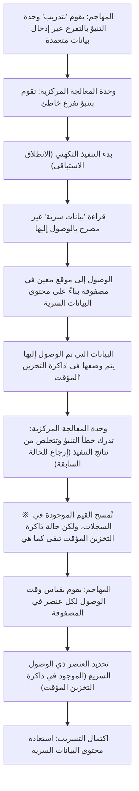

# مقدمة

في أنظمة الكمبيوتر الحديثة، تلعب وحدة المعالجة المركزية (CPU) حرفياً دور "العقل". عند تشغيل تطبيق على الهاتف الذكي، أو معالجة كميات هائلة من البيانات على الخوادم السحابية، أو تشغيل أحدث ألعاب الفيديو ثلاثية الأبعاد، تقوم وحدة المعالجة المركزية بصمت بإجراء مليارات العمليات الحسابية في الثانية الواحدة.

على مدى العقود القليلة الماضية، شهدت أداء وحدة المعالجة المركزية تحسينات هائلة بوتيرة تتماشى مع قانون مور أو حتى تتجاوزه. من زيادة سرعة الساعة، إلى المعالجات متعددة النواة، وصولاً إلى التحسينات الجذرية في البنية، استخدم المهندسون كل تقنية ممكنة لإيجاد طرق لإجراء الحسابات "بشكل أسرع وأكثر كفاءة".

من بين هذه التقنيات، تعتبر "التنفيذ التكهني" (Speculative Execution) واحدة من أكثر التقنيات ابتكاراً وتعقيداً. هذه التقنية هي الأساس المطلق الذي يدعم سرعات المعالجة الهائلة في المعالجات الحديثة عالية الأداء. ومع ذلك، في عام 2018، تبين أن "التقنية السحرية" للتنفيذ التكهني هي السبب الجذري لواحدة من أخطر الثغرات الأمنية في تاريخ علوم الكمبيوتر، وهي "Spectre".

في هذه المقالة، سنتعمق من منظور هندسي في كيفية تجاوز وحدة المعالجة المركزية لحدود السرعة، وما هي بالضبط آلية التنفيذ التكهني، ولماذا أدت إلى ظهور هذه الثغرة الأمنية المرعبة Spectre. دعونا نكشف عن قصة المفاضلة الأبدية في تكنولوجيا المعلومات بين الأداء (Performance) والأمان (Security).

# تطور وحدة المعالجة المركزية وحدود "معالجة خط الأنابيب"

لفهم آلية التنفيذ التكهني، يجب علينا أولاً العودة إلى تطور البنية الأساسية لوحدة المعالجة المركزية وكيفية معالجتها للتعليمات.

كانت وحدات المعالجة المركزية الأولى تقوم بمعالجة التعليمات بشكل متسلسل واحدة تلو الأخرى: استقبال تعليمة واحدة، وفك تشفيرها، وتنفيذها، وكتابة النتيجة في الذاكرة. كانت هذه طريقة بسيطة وموثوقة للغاية، ولكنها كانت تنطوي على إهدار كبير من حيث الكفاءة. وذلك لأنه أثناء تنفيذ تعليمة معينة، كانت الدوائر المسؤولة عن قراءة التعليمات أو كتابة النتائج تبقى معطلة بلا عمل.

لذلك تم ابتكار "معالجة خط الأنابيب" (Pipelining). تماماً مثل خط التجميع في المصنع، تقوم هذه الطريقة بتقسيم معالجة التعليمات إلى مراحل متعددة، وتنفيذ المعالجة بالتوازي بنظام الحزام الناقل. على سبيل المثال، إذا تم تقسيم العملية إلى 5 مراحل: "جلب التعليمة"، "فك التشفير"، "التنفيذ"، "الوصول إلى الذاكرة"، و "الكتابة مرة أخرى"، فبينما يتم فك تشفير التعليمة الأولى، يصبح من الممكن جلب التعليمة الثانية. أدى هذا إلى قفزة هائلة في كفاءة معالجة وحدة المعالجة المركزية.

ومع ذلك، توجد مشكلة في معالجة خط الأنابيب تسمى "الخطر" (Hazard). الأخطر منها هو "خطر التحكم" أو "خطر التفرع" (Branch Hazard). غالباً ما تحتوي البرامج على "تفرع شرطي" (مثل عبارة If): "إذا تم استيفاء الشرط A، فانتقل إلى العملية X، وإلا فانتقل إلى العملية Y". عندما تصادف وحدة المعالجة المركزية تعليمة تفرع شرطي، فإنها لا تعرف التعليمة التالية التي يجب قراءتها حتى يتم الانتهاء من تقييم الشرط. إذا انتظرت وحدة المعالجة المركزية التقييم قبل قراءة التعليمة التالية، سيتوقف خط الأنابيب (وهذا ما يسمى "توقف خط الأنابيب" أو "الفقاعة")، وستضيع فائدة المعالجة المتوازية هباءً.

# التنبؤ بالتفرع وولادة "التنفيذ التكهني"

لمنع توقف خط الأنابيب هذا، تم إدخال تقنية تسمى "التنبؤ بالتفرع" (Branch Prediction). تقوم وحدة المعالجة المركزية بتحليل سجل التنفيذ السابق وتقوم بالتنبؤ: "من المحتمل استيفاء الشرط A والانتقال إلى العملية X". وحدة التنبؤ بالتفرع (Branch Predictor) المجهزة في وحدات المعالجة المركزية الحديثة ممتازة للغاية وتقوم بتنبؤات صحيحة باحتمالية تتجاوز 90%.

ومقترنة مع هذا التنبؤ بالتفرع تعمل بطلة هذه المقالة، "التنفيذ التكهني" (Speculative Execution).

التنفيذ التكهني هو تقنية تقوم بناءً على نتيجة التنبؤ بالتفرع بتنفيذ التعليمات المستقبلية المتوقعة بشكل استباقي "قبل انتهاء تقييم الشرط". بمعنى آخر، تبدأ في معالجة البيانات بتوقع مسبق بناءً على التفكير "من المحتمل أن نمضي في هذا الطريق".

إذا كان التنبؤ صحيحاً، فسيتم اختصار وقت انتظار التقييم بالكامل، وسيتم تنفيذ البرنامج بسرعة مذهلة. ولكن ماذا لو كان التنبؤ خاطئاً؟
في تلك الحالة، تتخلص وحدة المعالجة المركزية من جميع "النتائج المنفذة تكهنياً"، وتعيد الحالة إلى ما كانت عليه وكأن شيئاً لم يكن. ثم تقوم بقراءة تعليمات التفرع الصحيحة مرة أخرى، وتعيد التنفيذ من جديد.

تشبه هذه الآلية "النادِل الكفء في مطعم". عند رؤية زبون منتظم يدخل المطعم، يفكر النادل: "هذا الزبون يطلب القهوة دائماً، لذلك سأبدأ في إعداد القهوة قبل حتى أن آخذ طلبه" (التنبؤ بالتفرع والتنفيذ التكهني). إذا طلب الزبون القهوة، فيمكن تقديمها فوراً بدون وقت انتظار (نجاح التنبؤ). أما إذا قال الزبون: "سأشرب الشاي اليوم"، فإن النادل سيتخلص سراً من القهوة التي كان يعدها (التخلص من النتيجة)، ويبدأ في إعداد الشاي (إعادة التنفيذ بسبب فشل التنبؤ). على الرغم من إهدار القهوة التي تم سكبها، إلا أن سرعة التقديم بشكل عام ستكون أسرع بكثير.

# الأداء المذهل الذي جلبه التنفيذ التكهني

علاوة على ذلك، من خلال الجمع بين هذا التنفيذ التكهني وتقنيات متقدمة أخرى مثل "التنفيذ خارج الترتيب" (Out-of-Order Execution)، أصبح يشكل الأساس للبنية الحديثة لوحدات المعالجة المركزية. دون التقيد بترتيب كتابة البرنامج، تتقدم المعالجة بدءاً من التعليمات القابلة للتنفيذ، وتتنبأ بالعمليات المستقبلية وتنفذها. هذا يسمح للموارد الداخلية لوحدة المعالجة المركزية بالحفاظ على حالة التشغيل بكامل طاقتها دائماً، محققة بذلك مستوى من الأداء الحسابي لا يمكن الوصول إليه عن طريق زيادة سرعة الساعة فقط.

سواء كانت أجهزة كمبيوتر شخصية أو هواتف ذكية أو خوادم، فإن جميع المعالجات الرئيسية عالية الأداء تقريباً، بما في ذلك Intel و AMD و ARM و Apple (Apple Silicon)، تتبنى التنفيذ التكهني بنشاط. ليس من المبالغة القول إن قدرتنا اليوم على التمتع بحياة رقمية مريحة تعود بفضل هذا "السحر المبني على التوقع".

ومع ذلك، لم يدرك مصممو المعالجات الآثار الجانبية الخطيرة المحتملة لهذا السحر. فلم تكن "النتائج المفترض أن يتم التخلص منها" بسبب التنفيذ التكهني تختفي تماماً.

# الفخ غير المتوقع: اكتشاف ثغرة Spectre

في يناير 2018، أعلن باحثون من Google Project Zero عن ثغرات أمنية هزت تاريخ المعالجات. هما ثغرتا "Meltdown" و "Spectre". في هذه المقالة، سنركز بشكل خاص على Spectre (CVE-2017-5753, CVE-2017-5715)، التي تنبع من المواصفات الأساسية للتنفيذ التكهني ويصعب إصلاحها للغاية.

تكمن خطورة Spectre في أنها ليست "خطأ برمجي" ولكنها نابعة من "تصميم الأجهزة نفسه". من خلال استغلال آلية التنفيذ التكهني هذه، أصبحت البرامج الخبيثة قادرة على قراءة مناطق الذاكرة التي لا يُفترض أن تمتلك صلاحية الوصول إليها (على سبيل المثال، كلمات المرور المحفوظة في المتصفح، مفاتيح التشفير، والبيانات السرية للتطبيقات الأخرى).

ولكن، كما أوضحنا سابقاً، إذا كان التنبؤ خاطئاً، يتم "التخلص" من نتائج التنفيذ التكهني، ويُفترض أن تعود حالة وحدة المعالجة المركزية إلى ما كانت عليه. إذن، كيف بالضبط تتسرب البيانات؟

هنا يأتي دور "ذاكرة التخزين المؤقت" (Cache Memory).

# ذاكرة التخزين المؤقت وهجمات القنوات الجانبية

نظراً لأن سرعة القراءة والكتابة في الذاكرة الرئيسية (DRAM) بطيئة جداً مقارنة بسرعة معالجة وحدة المعالجة المركزية، تم تجهيز وحدات المعالجة المركزية بـ "ذاكرة تخزين مؤقت" سريعة للغاية (L1, L2, L3 Cache) داخلها. عندما تقرأ وحدة المعالجة المركزية بيانات من الذاكرة، يتم حفظ تلك البيانات مؤقتاً في ذاكرة التخزين المؤقت. وفي المرة القادمة التي تحتاج فيها إلى نفس البيانات، بدلاً من قراءتها من الذاكرة الرئيسية البطيئة، تقوم بقراءتها من ذاكرة التخزين المؤقت السريعة، مما يسرع عملية المعالجة.

النقطة المهمة هي حقيقة أن "البيانات التي تم قراءتها أثناء التنفيذ التكهني تظل أيضاً في ذاكرة التخزين المؤقت".

تستغل ثغرة Spectre هذه الخاصية. يقوم المهاجم بإنشاء "تفرع شرطي يؤدي إلى خطأ في التنبؤ" عمداً. ثم، خلال الوقت القصير جداً الذي يتم فيه التنفيذ التكهني، يجبر المعالج على تنفيذ تعليمات تقرأ البيانات السرية التي لا يُفترض الوصول إليها.
بطبيعة الحال، تدرك وحدة المعالجة المركزية فشل التنبؤ فوراً، وتتخلص من نتائج التنفيذ. على السطح الظاهري للبرنامج، لا يبقى أي أثر يوضح أنه تم قراءة البيانات السرية.

ومع ذلك، يبقى "أثر يتوافق مع محتوى البيانات السرية" في ذاكرة التخزين المؤقت لوحدة المعالجة المركزية. يستنتج المهاجمون ما بقي في ذاكرة التخزين المؤقت عن طريق قياس وقت الوصول إلى مساحة الذاكرة الخاصة بهم بدقة شديدة (وهذا نوع من هجوم القنوات الجانبية يُسمى هجوم توقيت ذاكرة التخزين المؤقت). الوصول إلى ذاكرة التخزين المؤقت سريع، ولكن إذا حدث فشل في العثور على البيانات في ذاكرة التخزين المؤقت وتم الوصول إلى الذاكرة الرئيسية، فسيكون أبطأ. من خلال قياس هذا الفارق الزمني الضئيل، يمكن استخراج محتوى "البيانات السرية" المقروءة عن طريق التنفيذ التكهني بتاً واحداً في كل مرة.

## تشريح آلية عمل Spectre (رسم توضيحي)

يوضح مخطط Mermaid التالي عملية تسريب البيانات بواسطة Spectre.

الأمر المذهل في هذا الهجوم هو أنه يتجاوز آليات الفحص الخاصة بنظام التشغيل (OS) وبرامج الأمان تماماً. وذلك لأن العمليات أثناء التنفيذ التكهني تحدث في أعماق البنية، ولا يمكن اكتشافها أو التحكم فيها من طبقة البرمجيات. تم إطلاق اسم Spectre (الشبح) على الثغرة نسبةً إلى هذه الخاصية المتمثلة في سرقة البيانات دون ترك أي أثر.

# المفاضلة التي لا تنتهي بين الأداء والأمان

بعد الإعلان عن ثغرة Spectre، سارعت صناعة تكنولوجيا المعلومات للتعامل مع الموقف بشكل غير مسبوق. تم إجراء تحديثات لأنظمة التشغيل، وتعديلات في المتصفحات، وتحديثات لبرامج BIOS/UEFI الخاصة باللوحات الأم (تحديث الرمز المصغر لوحدة المعالجة المركزية) في وقت واحد حول العالم.

ومع ذلك، لم تكن هذه التدابير (التدابير التخفيفية) حلاً جذرياً. اعتمدت النهج بشكل أساسي على منع الهجمات من خلال ضوابط برمجية أو عن طريق إدراج تعليمات تقيد أنواعاً معينة من التنفيذ التكهني (مثل تعليمات الحاجز)، ولكن هذا جاء بتكلفة باهظة: "انخفاض الأداء".

تقييد التنفيذ التكهني يعني عملياً "إيقاف القراءة الاستباقية لوحدة المعالجة المركزية". ونتيجة لتطبيق تصحيحات أمنية لتعزيز الأمان، حدث انخفاض في سرعة معالجة النظام بنسبة تتراوح بين بضعة في المائة إلى عشرات في المائة في بعض الحالات. بالنسبة لموفري الخدمات السحابية والشركات التي تدير مراكز بيانات ضخمة، كان هذا الانخفاض في الأداء يعني خسائر اقتصادية لا حصر لها.

هنا، تبرز المعضلة المطلقة في الهندسة.

"هل كان ينبغي لنا السعي وراء الأداء حتى لو كان ذلك على حساب التضحية بالأمان؟"
"أم أنه ينبغي لنا ضمان أمان مطلق حتى لو كان ذلك يعني التخلي عن الأداء؟"

لم تكن Spectre مجرد خطأ برمجي بسيط، بل كانت حدثاً تطلب إحداث نقلة نوعية في تصميم المعالجات. على مدى العقود القليلة الماضية، جعل مهندسو الأجهزة من "جعل البرامج تعمل بشكل أسرع" أولوية قصوى لهم، وكان يُعتبر الأمان ضمناً "مجالاً يجب أن يتحمل مسؤوليته نظام التشغيل والبرمجيات". ومع ذلك، أثبتت Spectre أن تحسينات الأجهزة نفسها يمكن أن تهدد أساس الأمان.

# الخلاصة: نحو تصميمات مستقبلية لوحدات المعالجة المركزية

حالياً، تواصل شركات مثل Intel و AMD و ARM تطوير معماريات جديدة تتمتع بمقاومة ضد هجمات القنوات الجانبية مثل Spectre على مستوى التصميم. يتم البحث في تقنيات تهدف إلى الحفاظ على فوائد التنفيذ التكهني، مع سد تسرب المعلومات عبر الموارد المشتركة مثل ذاكرة التخزين المؤقت على مستوى الأجهزة.

ومع ذلك، فإن تحقيق تنفيذ تكهني آمن تماماً هو أمر في غاية الصعوبة. طالما تستمر أنظمة الكمبيوتر في التعقيد وتستمر في تحدي حدود الأداء، فإن احتمالية اكتشاف آثار جانبية غير معروفة ستظل موجودة دائماً.

أعطتنا الدروس المستفادة من Spectre منظوراً مهماً كمهندسين. وهو أن "الأداء" و "الأمان" ليسا عنصرين منفصلين، بل يجب التفكير فيهما بشكل متكامل منذ مرحلة تصميم النظام.

السعي اللانهائي لإنشاء أسرع جهاز هو في الوقت نفسه السعي لإنشاء الجهاز الأكثر أماناً. كيف نتعامل مع "سحر" التنفيذ التكهني، وكيف يمكننا التحكم فيه بأمان؟ سيظل هذا تحدياً هاماً لا يمكن تجنبه لجميع المهندسين الذين سيحملون على عاتقهم مستقبل علوم الكمبيوتر.
