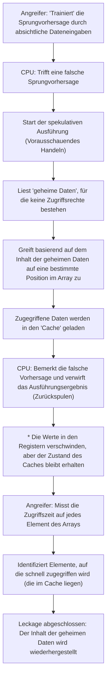

# Einführung

In modernen Computersystemen spielt die CPU (Central Processing Unit) buchstäblich die Rolle des "Gehirns". Ob Sie eine App auf Ihrem Smartphone starten, riesige Datenmengen auf einem Cloud-Server verarbeiten oder das neueste 3D-Spiel spielen – die CPU führt stillschweigend Milliarden von Berechnungen pro Sekunde aus.

In den letzten Jahrzehnten hat sich die Leistung von CPUs gemäß dem Mooreschen Gesetz oder sogar noch schneller dramatisch verbessert. Durch höhere Taktfrequenzen, Multi-Core-Designs und grundlegende Verbesserungen der Architektur haben Ingenieure alle verfügbaren Methoden angewandt, um Wege zu finden, Berechnungen "schneller und effizienter" durchzuführen.

Eine der innovativsten und zugleich komplexesten Technologien, die in diesem Prozess entstanden ist, ist die "spekulative Ausführung" (Speculative Execution). Diese Technologie bildet die absolute Grundlage für die überwältigende Verarbeitungsgeschwindigkeit moderner Hochleistungsprozessoren. Im Jahr 2018 wurde jedoch bekannt, dass diese "magische Technologie" der spekulativen Ausführung die Grundursache für "Spectre" ist, eine der schwerwiegendsten Sicherheitslücken in der Geschichte der Informatik.

In diesem Artikel werden wir aus der Perspektive des Engineerings tief eintauchen: Wie CPUs die Grenzen der Beschleunigung durchbrochen haben, wie der Mechanismus der spekulativen Ausführung genau funktioniert und warum er eine so schreckliche Schwachstelle wie Spectre geschaffen hat. Lassen Sie uns die Geschichte des ewigen Kompromisses in der IT-Technologie zwischen Leistung (Performance) und Sicherheit enträtseln.

# Die Entwicklung der CPU und die Grenzen der "Pipeline-Verarbeitung"

Um den Mechanismus der spekulativen Ausführung zu verstehen, müssen wir zunächst einen Blick auf die Entwicklung der grundlegenden Architektur werfen, wie CPUs Befehle verarbeiten.

Frühe CPUs nahmen einen Befehl entgegen, dekodierten ihn, führten ihn aus und schrieben das Ergebnis nacheinander in den Speicher. Dies ist eine sehr einfache und zuverlässige Methode, war aber in Bezug auf die Effizienz stark verschwenderisch. Während der Ausführung eines Befehls blieben die Schaltungen zum Einlesen von Befehlen oder zum Schreiben von Ergebnissen untätig.

Daher wurde die "Pipeline-Verarbeitung" (Pipelining) erfunden. Wie bei einem Fließband in einer Fabrik wird die Verarbeitung von Befehlen in mehrere Stufen (Phasen) unterteilt und parallel wie auf einem Förderband ausgeführt. Wenn man beispielsweise in die fünf Stufen "Befehlsabruf (Fetch)", "Dekodierung (Decode)", "Ausführung (Execute)", "Speicherzugriff (Memory Access)" und "Rückschreiben (Write-back)" unterteilt, ist es möglich, den zweiten Befehl abzurufen, während der erste Befehl dekodiert wird. Dadurch wurde die Verarbeitungseffizienz der CPU dramatisch verbessert.

Die Pipeline-Verarbeitung bringt jedoch ein Problem mit sich, das als "Hazard" bezeichnet wird. Besonders schwerwiegend ist der "Control Hazard (Branch Hazard)". In Programmen kommen häufig "bedingte Verzweigungen" (z. B. If-Anweisungen) vor, wie "Wenn Bedingung A erfüllt ist, gehe zu Verarbeitung X, andernfalls zu Verarbeitung Y". Wenn die CPU auf einen bedingten Verzweigungsbefehl stößt, weiß sie nicht, welchen Befehl sie als nächstes einlesen soll, bis die Auswertung der Bedingung abgeschlossen ist. Wenn sie mit dem Einlesen des nächsten Befehls wartet, bis die Auswertung abgeschlossen ist, stoppt die Pipeline (dies wird als "Pipeline Stall" oder "Bubble" bezeichnet), und die parallele Verarbeitung ist umsonst.

# Sprungvorhersage und die Geburt der "spekulativen Ausführung"

Um diesen Pipeline-Stall zu verhindern, wurde eine Technologie namens "Sprungvorhersage" (Branch Prediction) eingeführt. Die CPU analysiert den bisherigen Ausführungsverlauf und erstellt die Vorhersage: "Wahrscheinlich wird Bedingung A erfüllt und es geht weiter mit Verarbeitung X". Die in modernen CPUs eingebauten Sprungvorhersageeinheiten (Branch Predictors) sind extrem leistungsfähig und treffen in über 90 % der Fälle die richtige Vorhersage.

Und in Verbindung mit dieser Sprungvorhersage arbeitet der Protagonist dieses Artikels: die "spekulative Ausführung" (Speculative Execution).

Die spekulative Ausführung ist eine Technologie, bei der basierend auf dem Ergebnis der Sprungvorhersage der vorhergesagte Befehl vorausschauend ausgeführt wird, "bevor die Auswertung der Bedingung abgeschlossen ist". Das bedeutet, die CPU beginnt auf gut Glück mit der Verarbeitung, da sie davon ausgeht, "dass es sicher in diese Richtung weitergeht".

Wenn die Vorhersage zutrifft, wird die Wartezeit auf die Auswertung komplett eingespart und das Programm wird mit erstaunlicher Geschwindigkeit ausgeführt. Was passiert aber, wenn die Vorhersage falsch war?
In diesem Fall verwirft die CPU alle "spekulativ ausgeführten Ergebnisse" und spult den Zustand wieder an den Ausgangspunkt zurück, als wäre nichts passiert. Dann liest sie den richtigen Verzweigungsbefehl neu ein und beginnt die Ausführung von vorn.

Dieser Mechanismus lässt sich mit einem "kompetenten Kellner in einem Restaurant" vergleichen. Wenn der Kellner sieht, dass ein Stammkunde das Lokal betritt, denkt er: "Dieser Kunde bestellt immer Kaffee, also fange ich schon an, Kaffee zu kochen, bevor ich die Bestellung aufnehme" (Sprungvorhersage und spekulative Ausführung). Wenn der Kunde Kaffee bestellt, kann er ihn ohne Wartezeit sofort servieren (Vorhersage erfolgreich). Wenn der Kunde sagt "Heute nehme ich Tee", gießt er den bereits zubereiteten Kaffee heimlich weg (Ergebnisse verwerfen) und kocht stattdessen Tee (Neustart wegen falscher Vorhersage). Zwar entsteht durch das Weggießen des Kaffees eine gewisse Verschwendung, aber insgesamt wird die Servicegeschwindigkeit enorm erhöht.

# Die erstaunliche Leistungssteigerung durch spekulative Ausführung

Diese spekulative Ausführung wurde zudem mit fortschrittlichen Technologien wie der "Out-of-Order-Ausführung" (Out-of-Order Execution) kombiniert und bildet nun das Fundament moderner CPU-Architekturen. Unabhängig von der Reihenfolge, in der das Programm geschrieben ist, werden die ausführbaren Befehle nacheinander verarbeitet, und sogar zukünftige Verarbeitungsschritte werden vorausschauend ausgeführt. Dadurch können die internen Ressourcen der CPU stets voll ausgelastet bleiben, was ein Leistungsniveau ermöglicht, das durch bloße Erhöhung der Taktfrequenz niemals erreicht werden könnte.

Egal ob PC, Smartphone oder Server – fast alle großen Hochleistungsprozessoren von Intel, AMD, ARM, Apple (Apple Silicon) und anderen nutzen diese spekulative Ausführung intensiv. Dass wir heute ein so komfortables digitales Leben führen können, verdanken wir nicht zuletzt dieser "Magie des vorausschauenden Handelns".

Allerdings hatten die Entwickler der Prozessoren nicht bedacht, dass diese Magie tiefgreifende Nebenwirkungen haben könnte. Die durch die spekulative Ausführung "verworfenen Ergebnisse" verschwanden nämlich nicht vollständig.

# Eine unerwartete Falle: Die Entdeckung der Spectre-Schwachstelle

Im Januar 2018 veröffentlichten Forscher von Google Project Zero Sicherheitslücken, die die Geschichte der Prozessoren erschüttern sollten. Dies waren "Meltdown" und "Spectre". Dieser Artikel konzentriert sich insbesondere auf Spectre (CVE-2017-5753, CVE-2017-5715), das in den grundlegenden Spezifikationen der spekulativen Ausführung verwurzelt ist und extrem schwer zu beheben ist.

Der Schrecken von Spectre liegt darin, dass es sich nicht um einen "Software-Fehler", sondern um ein Problem des "Hardware-Designs selbst". Indem bösartige Programme den Mechanismus der spekulativen Ausführung ausnutzen, wurde es möglich, Speicherbereiche auszulesen, für die sie eigentlich keine Zugriffsrechte haben (z. B. im Browser gespeicherte Passwörter, kryptografische Schlüssel oder geheime Daten anderer Apps).

Wie bereits erklärt, sollten bei einer falschen Vorhersage die Ergebnisse der spekulativen Ausführung "verworfen" und der CPU-Zustand wiederhergestellt werden. Wie also können Daten überhaupt durchsickern?

Der Schlüssel dazu liegt in der Existenz des "Cache-Speichers" (Cache Memory).

# Cache-Speicher und Seitenkanalangriffe

Da die Lese- und Schreibgeschwindigkeit des Hauptspeichers (DRAM) im Vergleich zur Verarbeitungsgeschwindigkeit der CPU sehr langsam ist, verfügen CPUs intern über schnelle "Cache-Speicher (L1-, L2-, L3-Cache)". Wenn die CPU Daten aus dem Speicher liest, werden diese temporär im Cache gespeichert. Wenn dieselben Daten erneut benötigt werden, werden sie zur Beschleunigung der Verarbeitung nicht aus dem langsamen Hauptspeicher, sondern aus dem schnellen Cache gelesen.

Wichtig ist die Tatsache, dass "Daten, die während der spekulativen Ausführung gelesen wurden, im Cache-Speicher verbleiben".

Spectre macht sich diese Eigenschaft zunutze. Der Angreifer erzeugt absichtlich "bedingte Verzweigungen, bei denen die Vorhersage fehlschlägt". In der kurzen Zeit, in der die spekulative Ausführung läuft, lässt er dann Befehle ausführen, die geheime Daten einlesen, auf die eigentlich nicht zugegriffen werden darf.
Natürlich bemerkt die CPU kurz darauf den Vorhersagefehler und verwirft die Ausführungsergebnisse. An der Oberfläche des Programms bleiben keine Spuren davon zurück, dass geheime Daten gelesen wurden.

Im Cache-Speicher der CPU verbleiben jedoch "Spuren entsprechend dem Inhalt der geheimen Daten". Der Angreifer misst die Zugriffszeit auf seinen eigenen Speicherbereich präzise, um zu erraten, was im Cache verblieben ist (eine Art Seitenkanalangriff, der als Cache-Timing-Angriff bezeichnet wird). Der Zugriff auf den Cache ist schnell, aber bei einem Cache-Miss, bei dem auf den Hauptspeicher zugegriffen werden muss, ist er langsam. Durch die Messung dieses winzigen Zeitunterschieds kann der Inhalt der durch die spekulative Ausführung ausgelesenen "geheimen Daten" Bit für Bit gestohlen werden.

## Die Anatomie von Spectre (Diagramm)

Der Prozess des Datenlecks durch Spectre wird im folgenden Mermaid-Diagramm veranschaulicht.

Das Erstaunliche an diesem Angriff ist, dass er die Kontrollmechanismen des Betriebssystems (OS) und von Sicherheitssoftware komplett umgeht. Das liegt daran, dass die Vorgänge während der spekulativen Ausführung tief in der Architektur stattfinden und von der Softwareschicht weder erkannt noch kontrolliert werden können. Der Name Spectre (Gespenst) rührt genau von dieser Eigenschaft her, Daten ohne jegliche Spuren zu stehlen.

# Der endlose Kompromiss zwischen Leistung und Sicherheit

Nach der Ankündigung von Spectre sah sich die IT-Branche mit beispiellosen Reaktionen konfrontiert. Betriebssystem-Updates, Browser-Modifikationen und BIOS/UEFI-Updates für Mainboards (CPU-Microcode-Updates) wurden weltweit flächendeckend durchgeführt.

Diese Gegenmaßnahmen (Mitigationen) stellten jedoch keine grundlegende Lösung dar. Die Hauptansätze bestanden darin, Angriffe durch softwareseitige Kontrollen oder durch das Einfügen von Befehlen zur Einschränkung bestimmter spekulativer Ausführungen (z. B. Barrier-Befehle) zu verhindern, was jedoch einen hohen Preis hatte: "Leistungsabfall".

Die Einschränkung der spekulativen Ausführung bedeutete faktisch, "das vorausschauende Lesen der CPU zu stoppen". Als Folge der Anwendung von Sicherheitspatches sank die Verarbeitungsgeschwindigkeit von Systemen um wenige bis teilweise zweistellige Prozentbeträge. Für Cloud-Anbieter und Unternehmen, die riesige Rechenzentren betreiben, bedeutete dieser Leistungsabfall einen unermesslichen wirtschaftlichen Verlust.

Hier wird das ultimative Dilemma im Engineering deutlich.

"Sollten wir wirklich die Leistung auf Kosten der Sicherheit maximieren?"
"Oder sollten wir eine absolute Sicherheit gewährleisten, selbst wenn wir dafür Leistung opfern müssen?"

Spectre war nicht nur ein Fehler, sondern ein Ereignis, das einen Paradigmenwechsel im Prozessordesign erzwang. In den vergangenen Jahrzehnten war für Hardware-Ingenieure das oberste Gebot, "Software schnell auszuführen", während Sicherheit stillschweigend als "ein Bereich betrachtet wurde, für den das Betriebssystem und die Software verantwortlich sind". Spectre bewies jedoch, dass gerade die Optimierung der Hardware die Grundlagen der Sicherheit gefährden kann.

# Fazit: Auf dem Weg zum zukünftigen CPU-Design

Derzeit arbeiten Unternehmen wie Intel, AMD und ARM an der Entwicklung neuer Architekturen, die auf Designebene widerstandsfähig gegen Seitenkanalangriffe wie Spectre sind. Es wird an Technologien geforscht, die Hardwareebene nutzen, um das Durchsickern von Informationen über gemeinsam genutzte Ressourcen wie Caches zu blockieren, während die Vorteile der spekulativen Ausführung erhalten bleiben.

Es ist jedoch extrem schwierig, eine vollständig sichere spekulative Ausführung zu realisieren. Solange Computersysteme immer komplexer werden und wir weiterhin die Leistungsgrenzen ausreizen, besteht immer die Möglichkeit, dass neue, unbekannte Nebenwirkungen entdeckt werden.

Die Lektion aus Spectre hat uns Ingenieuren eine wichtige Perspektive eröffnet. Sie zeigt, dass "Leistung" und "Sicherheit" keine separaten Elemente sind, sondern bereits in der Entwurfsphase von Systemen integriert betrachtet werden müssen.

Die endlose Suche nach dem Bau der schnellsten Maschine ist gleichzeitig die Suche nach dem Bau der sichersten Maschine. Wie gehen wir mit der "Magie" der spekulativen Ausführung um und wie kontrollieren wir sie sicher? Dies wird eine unvermeidliche und wichtige Herausforderung für alle Ingenieure bleiben, die die zukünftige Informatik gestalten.
