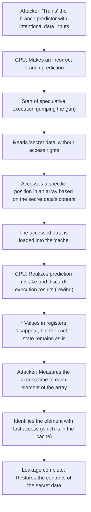

# Introduction

In modern computer systems, the CPU (Central Processing Unit) literally plays the role of the "brain". Whether launching a smartphone app, processing massive amounts of data on a cloud server, or playing the latest 3D game, the CPU silently performs billions of calculations per second.

Over the past few decades, CPU performance has improved dramatically, following or even exceeding Moore's Law. By increasing clock frequencies, shifting to multi-core designs, and making fundamental improvements to architecture, engineers have utilized every possible method to explore ways to calculate "faster and more efficiently".

One of the most innovative and complex technologies created in this process is "Speculative Execution". This technology has become the absolute foundation supporting the overwhelming processing speed of modern high-performance processors. However, in 2018, it was revealed that this "magic technology" of speculative execution was the root cause of "Spectre", a serious security vulnerability that will go down in computer science history.

In this article, we will delve deeply from an engineering perspective into how CPUs have broken through the limits of speed, exactly what the mechanism of speculative execution is, and why it ended up creating the terrifying vulnerability known as Spectre. Let's unravel the story of the eternal trade-off in IT technology between performance and security.

# CPU Evolution and the Limits of "Pipelining"

To understand the mechanism of speculative execution, we must first look back at the evolution of basic CPU architecture and how it processes instructions.

Early CPUs performed the process of receiving a single instruction, decoding it, executing it, and writing the result to memory sequentially, one by one. This was a very simple and reliable method, but it was highly inefficient. This was because, while one instruction was executing, the circuits for reading instructions or writing results were left idle.

To address this, "Pipelining" was devised. Much like an assembly line in a factory, this method divides the processing of an instruction into multiple stages (phases) and processes them in parallel like a conveyor belt. For example, if divided into five stages: "Instruction Fetch", "Decode", "Execute", "Memory Access", and "Writeback", it becomes possible to fetch a second instruction while the first instruction is being decoded. This dramatically improved CPU processing efficiency.

However, pipelining has a problem called "hazards". The most serious of these is the "control hazard (branch hazard)". Programs frequently feature "conditional branches (like If statements)" such as "if condition A is met, proceed to process X; otherwise, proceed to process Y". When a CPU encounters a conditional branch instruction, it does not know which instruction to load next until the condition check is completed. If it waited for the check to complete before loading the next instruction, the pipeline would stop moving (this is called a "pipeline stall" or "bubble"), wasting the benefits of parallel processing.

# Branch Prediction and the Birth of "Speculative Execution"

To prevent this pipeline stall, a technology called "Branch Prediction" was introduced. The CPU analyzes past execution history and makes a prediction: "It will probably meet condition A and proceed to process X". The Branch Predictor installed in modern CPUs is highly capable and makes correct predictions with a probability of over 90%.

Working in tandem with this branch prediction is the main subject of this article: "Speculative Execution".

Speculative execution is a technology where, based on the result of a branch prediction, the CPU jumps the gun and executes the predicted subsequent instructions "before the condition check is completed". In other words, it advances the process on the assumption that "it will surely go down this path".

If the prediction is correct, the time spent waiting for the check is entirely eliminated, and the program executes at astonishing speed. So, what happens if the prediction is wrong?
In that case, the CPU discards all "speculatively executed results" and rewinds to its original state as if nothing had happened. Then, it loads the correct branch instruction and restarts execution.

This mechanism can be likened to a "competent waiter at a restaurant". Seeing a regular customer enter the shop, the waiter thinks, "This customer always orders coffee, so I'll start brewing coffee before asking for their order" (branch prediction and speculative execution). If the customer orders coffee, it can be served immediately with zero wait time (prediction success). If the customer says, "I'll have tea today", the waiter secretly throws away the partially brewed coffee (discarding the result) and brews tea instead (redoing due to prediction failure). While throwing away coffee creates waste, overall service speed becomes overwhelmingly faster.

# The Astonishing Performance Improvements Brought by Speculative Execution

By being combined with further advanced technologies like "Out-of-Order Execution", this speculative execution has come to form the core of modern CPU architectures. Unbound by the written order of the program, it sequentially processes executable instructions and even looks ahead to execute future processes. As a result, internal CPU resources can constantly maintain full utilization, achieving a level of computational performance that could never be reached simply by increasing clock frequencies.

Regardless of whether it is a PC, smartphone, or server, almost all major high-performance processors from Intel, AMD, ARM, Apple (Apple Silicon), and others actively employ this speculative execution. It is no exaggeration to say that we are able to enjoy a comfortable digital life today thanks to this "magic of jumping the gun".

However, processor designers did not realize that this magic could bring about serious side effects. The results that were "supposed to be discarded" by speculative execution did not completely disappear.

# The Unexpected Pitfall: Discovery of the Spectre Vulnerability

In January 2018, researchers from Google Project Zero announced vulnerabilities that shook the history of processors. These were "Meltdown" and "Spectre". This article focuses specifically on Spectre (CVE-2017-5753, CVE-2017-5715), which stems from the fundamental specification of speculative execution and is extremely difficult to patch.

The terrifying aspect of Spectre is that it is caused not by a "software bug" but by the "hardware design itself". By exploiting this mechanism of speculative execution, malicious programs became able to read memory areas they normally wouldn't have access rights to (such as passwords saved in browsers, encryption keys, and secret data of other apps).

However, as explained earlier, if a prediction fails, the results of speculative execution are supposed to be "discarded", and the CPU state restored. So, how exactly does data leak?

The key here is the existence of "Cache Memory".

# Cache Memory and Side-Channel Attacks

Because the read/write speed of main memory (DRAM) is very slow compared to the CPU's processing speed, fast "Cache Memory (L1, L2, L3 caches)" is built into the CPU. When a CPU reads data from memory, that data is temporarily stored in the cache. The next time the same data is needed, processing is sped up by reading from the fast cache instead of the slow main memory.

The important point is the fact that "data loaded during speculative execution also remains in the cache memory".

Spectre utilizes this property. The attacker intentionally creates a "conditional branch where the prediction will fail". Then, during the brief time speculative execution is occurring, they force the execution of an instruction that reads secret data that should normally not be accessed.
Naturally, the CPU immediately realizes the prediction failure and discards the execution results. On the surface of the program, no trace of the secret data being read remains.

However, a "trace corresponding to the content of the secret data" is left in the CPU's cache memory. By precisely measuring the access time to their own memory space, the attacker guesses what is left in the cache (a type of side-channel attack known as a cache timing attack). Access to the cache is fast, but accessing main memory upon a cache miss is slow. By measuring this tiny time difference, it is possible to steal the contents of the "secret data" read out by speculative execution, one bit at a time.

## Dissecting the Mechanism of Spectre (Diagram)

The process of data leakage via Spectre is shown in a Mermaid diagram.

The shocking aspect of this attack is that it completely bypasses the check mechanisms of the operating system (OS) and security software. This is because the actions during speculative execution occur deep within the architecture and cannot be detected or controlled from the software layer. The name Spectre (a ghost) was perfectly given due to its characteristic of stealing data without leaving a trace.

# The Unending Trade-off Between Performance and Security

After the announcement of Spectre, the IT industry scrambled to respond in unprecedented ways. OS updates, browser modifications, and motherboard BIOS/UEFI updates (CPU microcode updates) were rolled out simultaneously worldwide.

However, these countermeasures (mitigations) were not fundamental solutions. The main approach involved software-based controls or inserting instructions that restricted specific speculative executions (such as barrier instructions) to prevent attacks, but this came with a heavy cost: "performance degradation".

Restricting speculative execution means "stopping the CPU's lookahead". As a result of applying security-enhancing patches, system processing speeds dropped by a few percent, and in some cases, by tens of percent. For cloud providers and companies operating massive data centers, this performance drop meant immeasurable economic losses.

Here, the ultimate dilemma in engineering is brought into stark relief.

"Should we have pursued performance even at the expense of security?"
"Or should we guarantee absolute safety even if it means throwing away performance?"

Spectre was not just a bug; it was an event that forced a paradigm shift in processor design. For decades, hardware engineers considered "making software run fast" as their supreme imperative, while security was implicitly viewed as "a domain for which the OS and software should take responsibility". However, Spectre proved that hardware optimization itself has the potential to threaten the foundation of security.

# Conclusion: Toward Future CPU Design

Currently, companies like Intel, AMD, and ARM are developing new architectures that have resilience against side-channel attacks like Spectre built in at the design level. Technologies are being researched to block information leaks through shared resources like caches at the hardware level while maintaining the benefits of speculative execution.

However, achieving perfectly safe speculative execution is extremely difficult. As long as computer systems continue to grow more complex and push the limits of performance, the possibility of discovering new, unknown side effects will always exist.

The lesson of Spectre provided us engineers with an important perspective. That is, "performance" and "security" are not separate elements; they must be considered in an integrated manner from the system design stage.

The endless quest to build the fastest machine is simultaneously the quest to build the safest machine. How we interact with the "magic" of speculative execution and how we safely control it will continue to be an unavoidable and important challenge for all engineers leading the future of computer science.
