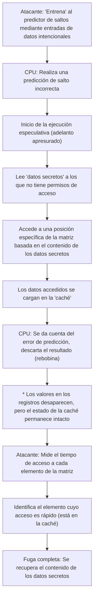

# Introducción

En los sistemas informáticos modernos, la CPU (Unidad Central de Procesamiento) desempeña literalmente el papel de "cerebro". Al iniciar una aplicación en el teléfono inteligente, al procesar enormes cantidades de datos en un servidor en la nube o al jugar el último juego en 3D, la CPU realiza silenciosamente miles de millones de cálculos por segundo.

Durante las últimas décadas, el rendimiento de las CPU ha mejorado drásticamente a un ritmo que sigue o supera la Ley de Moore. Los ingenieros han explorado todo tipo de métodos para realizar cálculos "más rápido y de manera más eficiente", aprovechando mejoras en la frecuencia de reloj, arquitecturas multinúcleo y mejoras fundamentales en la arquitectura.

Una de las tecnologías más innovadoras y complejas creadas en este proceso es la "Ejecución Especulativa" (Speculative Execution). Esta tecnología es la base absoluta que sustenta las abrumadoras velocidades de procesamiento en los procesadores modernos de alto rendimiento. Sin embargo, en 2018, se hizo evidente que esta "tecnología mágica" de la ejecución especulativa fue la causa fundamental de "Spectre", una vulnerabilidad de seguridad grave que pasará a la historia de la informática.

En este artículo, profundizaremos desde una perspectiva de ingeniería en cómo la CPU ha superado los límites de la aceleración, qué es exactamente el mecanismo de ejecución especulativa, y por qué engendró una vulnerabilidad tan temible como Spectre. Desentrañaremos la historia del eterno compromiso (trade-off) en la tecnología de la información entre rendimiento (performance) y seguridad (security).

# La evolución de la CPU y los límites del "Procesamiento en Pipeline"

Para entender cómo funciona la ejecución especulativa, primero debemos recordar la evolución de la arquitectura básica de cómo la CPU procesa las instrucciones.

Las primeras CPU recibían una sola instrucción, la decodificaban, la ejecutaban y escribían el resultado en la memoria, un proceso a la vez en orden. Este es un método muy simple y confiable, pero tenía un gran desperdicio en términos de eficiencia. Esto se debía a que mientras se ejecutaba una instrucción, los circuitos de lectura de instrucciones o los circuitos de escritura de resultados permanecían inactivos.

Para solucionar esto, se ideó el "Procesamiento en Pipeline" (Pipelining). Al igual que una línea de montaje de una fábrica, es una técnica que divide el procesamiento de instrucciones en múltiples etapas (fases) y las procesa en paralelo como una cinta transportadora. Por ejemplo, si se divide en 5 etapas: "Búsqueda de instrucción (Fetch)", "Decodificación (Decode)", "Ejecución (Execute)", "Acceso a memoria" y "Escritura de resultados (Write-back)", mientras la primera instrucción se decodifica, es posible buscar la segunda instrucción. Gracias a esto, la eficiencia de procesamiento de la CPU mejoró a pasos agigantados.

Sin embargo, el procesamiento en pipeline tiene un problema llamado "riesgos" (hazards). Especialmente grave es el "riesgo de control" (riesgo de salto o branch hazard). En los programas, con frecuencia aparecen "saltos condicionales" (como la declaración If) que dicen "si se cumple la condición A, ir al proceso X, de lo contrario ir al proceso Y". Cuando la CPU encuentra una instrucción de salto condicional, no sabe qué instrucción leer a continuación hasta que termina la evaluación de la condición. Si espera el resultado de la evaluación antes de leer la siguiente instrucción, el movimiento del pipeline se detendrá (esto se llama "bloqueo del pipeline" o "burbuja"), y el procesamiento en paralelo se desperdiciará.

# La Predicción de Saltos y el Nacimiento de la "Ejecución Especulativa"

Para evitar estos bloqueos en el pipeline se introdujo la tecnología de "Predicción de Saltos" (Branch Prediction). La CPU analiza el historial de ejecuciones pasadas y hace una predicción como "probablemente se cumplirá la condición A y avanzaremos al proceso X". Los predictores de saltos (Branch Predictors) incorporados en las CPU modernas son extremadamente eficientes y realizan predicciones correctas con una probabilidad superior al 90%.

Y trabajando en conjunto con esta predicción de saltos se encuentra la protagonista de este artículo: la "Ejecución Especulativa" (Speculative Execution).

La ejecución especulativa es una tecnología que, basándose en los resultados de la predicción de saltos, adelanta la ejecución de las instrucciones pronosticadas "antes de que termine la evaluación de la condición". Es decir, avanza el procesamiento apresuradamente pensando "seguramente tomaremos este camino".

Si la predicción es acertada, el tiempo de espera de la evaluación se corta por completo, y el programa se ejecuta a una velocidad asombrosa. Entonces, ¿qué sucede si la predicción es incorrecta?
En ese caso, la CPU descarta todos los "resultados de la ejecución especulativa" y rebobina el estado original como si no hubiera pasado nada. Luego, vuelve a leer la instrucción de salto correcta y reanuda la ejecución.

Este mecanismo es comparable a "un camarero capaz en un restaurante". Al ver entrar a un cliente habitual, el camarero piensa: "Este cliente siempre pide café, así que empezaré a prepararlo antes de tomar su orden" (predicción de saltos y ejecución especulativa). Si el cliente pide café, se le servirá inmediatamente con cero tiempo de espera (predicción exitosa). Si el cliente dice "hoy quiero té", el camarero tira discretamente el café medio hecho (descarte de resultados) y empieza a preparar té (reanudación debido a predicción fallida). Aunque se produce el desperdicio de tirar el café, en total la velocidad de servicio es abrumadoramente más rápida.

# La asombrosa mejora del rendimiento traída por la Ejecución Especulativa

Esta ejecución especulativa, combinada con otras tecnologías avanzadas como la "Ejecución Fuera de Orden" (Out-of-Order Execution), se convirtió en el pilar fundamental de la arquitectura de las CPU modernas. Sin estar restringido al orden de escritura del programa, procesa secuencialmente las instrucciones ejecutables y, además, se anticipa y ejecuta procesos futuros. Con esto, los recursos internos de la CPU siempre pueden mantenerse a plena capacidad, logrando un nivel de rendimiento de cálculo que nunca se podría alcanzar solo aumentando la frecuencia de reloj.

Ya sean PC, teléfonos inteligentes o servidores, casi todos los principales procesadores de alto rendimiento de empresas como Intel, AMD, ARM y Apple (Apple Silicon) han adoptado activamente esta ejecución especulativa. No es exagerado decir que el hecho de que podamos disfrutar de una vida digital cómoda hoy en día es gracias a esta "magia del adelanto".

Sin embargo, los diseñadores de procesadores no se dieron cuenta de la posibilidad de que esta magia trajera efectos secundarios graves. Los resultados que supuestamente fueron "descartados" por la ejecución especulativa, en realidad, no desaparecieron por completo.

# Una trampa inesperada: El descubrimiento de la vulnerabilidad Spectre

En enero de 2018, investigadores de Google Project Zero anunciaron vulnerabilidades que sacudieron la historia de los procesadores. Esas fueron "Meltdown" y "Spectre". En este artículo nos centraremos especialmente en Spectre (CVE-2017-5753, CVE-2017-5715), que es originado por las especificaciones fundamentales de la ejecución especulativa y es extremadamente difícil de solucionar.

Lo aterrador de Spectre radica en que no es un "error de software", sino que se origina en "el diseño mismo del hardware". Programas maliciosos pudieron utilizar este mecanismo de ejecución especulativa a su favor para leer áreas de memoria sin permisos de acceso (por ejemplo, contraseñas guardadas en el navegador, claves criptográficas, datos secretos de otras aplicaciones, etc.).

Sin embargo, como explicamos antes, si la predicción falla, los resultados de la ejecución especulativa se "descartan" y el estado de la CPU debería volver a la normalidad. Entonces, ¿cómo exactamente se filtran los datos?

La clave aquí es la existencia de la "Memoria Caché" (Cache Memory).

# La Memoria Caché y los Ataques de Canal Lateral

Debido a que la velocidad de lectura y escritura de la memoria principal (DRAM) es muy lenta en comparación con la velocidad de procesamiento de la CPU, la CPU cuenta internamente con una "Memoria Caché" rápida (cachés L1, L2 y L3). Cuando la CPU lee datos de la memoria, esos datos se guardan temporalmente en la caché. La próxima vez que se necesiten los mismos datos, se leerán desde la rápida caché en lugar de la lenta memoria principal, acelerando el procesamiento.

Lo importante es el hecho de que "incluso los datos leídos durante la ejecución especulativa permanecen en la memoria caché".

Spectre se aprovecha de esta característica. El atacante crea intencionadamente "saltos condicionales donde la predicción fallará". Luego, durante el breve período de tiempo que dura la ejecución especulativa, hace que se ejecuten instrucciones que leen datos secretos a los que no debería tener acceso.
Naturalmente, la CPU se da cuenta del error de predicción inmediatamente después y descarta los resultados de la ejecución. En la superficie del programa, no queda rastro de que los datos secretos se hayan leído.

Sin embargo, "un rastro correspondiente al contenido de los datos secretos" permanece en la memoria caché de la CPU. El atacante mide con precisión el tiempo de acceso a su propia área de memoria para deducir qué hay en la caché (un tipo de ataque de canal lateral llamado ataque de temporización de caché). El acceso a la caché es rápido, pero los fallos de caché que requieren acceso a la memoria principal son lentos. Al medir esta minúscula diferencia de tiempo, es posible robar los "datos secretos" leídos a través de la ejecución especulativa, bit a bit.

## Anatomía del mecanismo de Spectre (Ilustrado)

El proceso de fuga de datos por Spectre se ilustra en el siguiente diagrama de Mermaid.

Lo sorprendente de este ataque es que evade por completo los mecanismos de control del sistema operativo (SO) y del software de seguridad. Esto se debe a que las operaciones durante la ejecución especulativa se llevan a cabo en lo profundo de la arquitectura y no pueden ser detectadas ni controladas desde la capa de software. El nombre Spectre (espectro) proviene precisamente de esta característica de robar datos sin dejar rastro.

# El interminable compromiso entre Rendimiento y Seguridad

Tras el anuncio de Spectre, la industria de TI se vio obligada a tomar medidas sin precedentes. Se llevaron a cabo actualizaciones de sistemas operativos, correcciones de navegadores y actualizaciones de la BIOS/UEFI de las placas base (actualización del microcódigo de la CPU) en todo el mundo simultáneamente.

Sin embargo, estas contramedidas (medidas de mitigación) no fueron una solución fundamental. El enfoque principal fue prevenir los ataques insertando controles de software e instrucciones que limitan ejecuciones especulativas específicas (como instrucciones de barrera), pero esto conllevó un gran costo: la "degradación del rendimiento".

Limitar la ejecución especulativa significa esencialmente "detener la anticipación de la CPU". Como resultado de aplicar parches de seguridad para mejorar la protección, ocurrieron situaciones donde la velocidad de procesamiento del sistema disminuyó en un porcentaje de un solo dígito hasta, en algunos casos, decenas de puntos porcentuales. Para los operadores en la nube y las empresas que administran enormes centros de datos, esta disminución del rendimiento significó pérdidas económicas incalculables.

Aquí resalta el dilema definitivo en la ingeniería.

"¿Deberíamos haber priorizado el rendimiento incluso a costa de sacrificar la seguridad?"
"¿O debemos garantizar la seguridad absoluta aunque tengamos que abandonar el rendimiento?"

Spectre no fue un simple error, sino un evento que obligó a un cambio de paradigma en el diseño de los procesadores. Durante las últimas décadas, los ingenieros de hardware consideraron "hacer que el software funcione rápido" como su misión principal, y se asumió tácitamente que la seguridad era "un ámbito que debía ser responsabilidad del SO y el software". Sin embargo, Spectre demostró que la optimización del hardware por sí misma podría amenazar la base de la seguridad.

# Conclusión: Hacia el diseño de la CPU del futuro

Actualmente, empresas como Intel, AMD y ARM están avanzando en el desarrollo de nuevas arquitecturas que poseen resistencia a nivel de diseño contra ataques de canal lateral como Spectre. Se están investigando tecnologías que bloquean la fuga de información a través de recursos compartidos como las cachés a nivel de hardware, manteniendo al mismo tiempo los beneficios de la ejecución especulativa.

Sin embargo, es extremadamente difícil lograr una ejecución especulativa completamente segura. Mientras los sistemas informáticos se vuelvan más complejos y sigan desafiando los límites del rendimiento, siempre existirá la posibilidad de que se descubran nuevos efectos secundarios desconocidos.

La lección de Spectre nos ha proporcionado a los ingenieros una perspectiva importante. A saber, que el "rendimiento" y la "seguridad" no son elementos separados, sino que deben considerarse de manera integrada desde la etapa de diseño de los sistemas.

La búsqueda interminable para construir la máquina más rápida es, al mismo tiempo, la búsqueda de construir la máquina más segura. Cómo enfrentarnos a la "magia" de la ejecución especulativa y cómo controlarla de forma segura seguirá siendo un desafío inevitable e importante para todos los ingenieros que forjarán el futuro de la informática.
