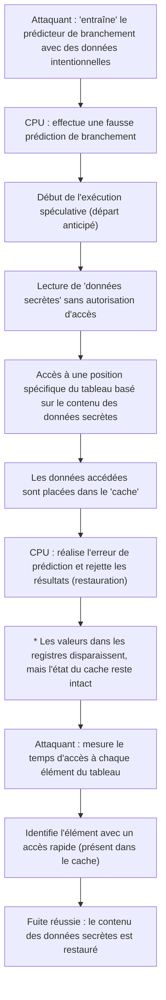

# Introduction

Dans les systèmes informatiques modernes, le CPU (unité centrale de traitement) joue littéralement le rôle de « cerveau ». Qu'il s'agisse de lancer une application sur smartphone, de traiter d'énormes quantités de données sur des serveurs cloud ou de jouer au dernier jeu 3D, le CPU effectue silencieusement des milliards de calculs par seconde.

Au cours des dernières décennies, les performances des processeurs ont connu une amélioration spectaculaire, suivant ou même dépassant le rythme de la loi de Moore. Augmentation de la fréquence d'horloge, processeurs multicœurs, et améliorations fondamentales de l'architecture : les ingénieurs ont exploré toutes les méthodes possibles pour effectuer des calculs de manière « plus rapide et plus efficace ».

L'une des technologies les plus innovantes et complexes nées de cette quête est l'« exécution spéculative » (Speculative Execution). Cette technologie est devenue le fondement absolu des vitesses de traitement exceptionnelles des processeurs haute performance modernes. Cependant, en 2018, il est devenu évident que cette « technologie magique » d'exécution spéculative était la cause fondamentale de « Spectre », une faille de sécurité grave qui restera dans l'histoire de l'informatique.

Dans cet article, nous explorerons en profondeur, d'un point de vue de l'ingénierie, comment les CPU ont repoussé les limites de la vitesse, comment fonctionne exactement l'exécution spéculative, et pourquoi elle a engendré cette redoutable faille qu'est Spectre. Découvrons l'histoire du compromis éternel entre performance et sécurité dans la technologie de l'information.

# L'évolution des processeurs et les limites du « pipelining »

Pour comprendre le mécanisme de l'exécution spéculative, nous devons d'abord revenir sur la façon dont le processeur traite les instructions et sur l'évolution de son architecture de base.

Les premiers processeurs exécutaient le processus de réception d'une instruction, de décodage, d'exécution et d'écriture du résultat en mémoire un par un, de manière séquentielle. Bien qu'il s'agisse d'une méthode très simple et fiable, elle présentait d'importantes inefficacités. Lors de l'exécution d'une instruction, les circuits lisant l'instruction ou écrivant le résultat restaient inactifs.

C'est ainsi qu'a été inventé le « pipelining » (traitement en pipeline). À l'instar d'une chaîne de montage en usine, il divise le traitement des instructions en plusieurs étapes (phases) et les traite en parallèle, comme sur un tapis roulant. Par exemple, s'il est divisé en cinq étapes : « recherche de l'instruction (fetch) », « décodage (decode) », « exécution (execute) », « accès mémoire (memory access) » et « réécriture (write-back) », pendant que la première instruction est en cours de décodage, la seconde peut être recherchée. Cela a considérablement amélioré l'efficacité de traitement des processeurs.

Cependant, le pipelining présente des problèmes appelés « aléas » (hazards). L'un des plus sérieux est l'« aléa de contrôle » (aléa de branchement). Dans un programme, des « branchements conditionnels » (comme des instructions If) apparaissent fréquemment, du type : « si la condition A est remplie, aller au traitement X, sinon au traitement Y ». Lorsque le processeur rencontre une instruction de branchement conditionnel, il ne sait pas quelle instruction charger ensuite tant que l'évaluation de la condition n'est pas terminée. S'il attend le résultat de l'évaluation avant de charger l'instruction suivante, le pipeline s'arrête (ce que l'on appelle un « pipeline stall » ou « bulle »), rendant inutile le traitement en parallèle.

# Prédiction de branchement et naissance de l'« exécution spéculative »

Pour éviter ces arrêts de pipeline, une technologie appelée « prédiction de branchement » (Branch Prediction) a été introduite. Le CPU analyse, entre autres, l'historique d'exécution passée et émet la prédiction : « la condition A sera probablement remplie et le traitement passera à X ». Les prédicteurs de branchement (Branch Predictors) intégrés aux processeurs modernes sont excellents, effectuant des prédictions correctes dans plus de 90 % des cas.

Et c'est en tandem avec cette prédiction de branchement que fonctionne la vedette de cet article : l'« exécution spéculative » (Speculative Execution).

L'exécution spéculative est une technique qui, sur la base du résultat de la prédiction de branchement, anticipe et exécute les instructions prédites « avant même que l'évaluation de la condition ne soit terminée ». En d'autres termes, elle s'engage prématurément dans le traitement en pensant : « C'est sûrement par ce chemin que nous irons. »

Si la prédiction est correcte, le temps d'attente pour l'évaluation est complètement supprimé, et le programme s'exécute à une vitesse incroyable. Mais que se passe-t-il si la prédiction s'avère fausse ?
Dans ce cas, le CPU rejette tous les résultats de l'« exécution spéculative » et revient à l'état d'origine comme si de rien n'était. Ensuite, il charge de nouveau la bonne instruction de branchement et recommence l'exécution.

Ce mécanisme peut être comparé à un « serveur de restaurant compétent ». En voyant un client régulier entrer, le serveur se dit : « Ce client commande toujours du café, je vais commencer à le préparer avant même de prendre sa commande » (prédiction de branchement et exécution spéculative). Si le client commande effectivement un café, il peut être servi immédiatement, sans attente (prédiction réussie). S'il dit « Aujourd'hui, je prendrai du thé », le serveur jette discrètement le café en cours de préparation (rejet des résultats) et prépare le thé à la place (recommencement suite à l'échec de la prédiction). Bien qu'il y ait un gaspillage avec le café jeté, globalement, la vitesse de service devient beaucoup plus rapide.

# L'amélioration spectaculaire des performances apportée par l'exécution spéculative

Associée à des technologies avancées telles que l'« exécution dans le désordre » (Out-of-Order Execution), l'exécution spéculative est devenue l'épine dorsale de l'architecture des processeurs modernes. S'affranchissant de l'ordre écrit du programme, elle traite de manière séquentielle les instructions qui peuvent être exécutées, et va même jusqu'à lire à l'avance et exécuter des traitements futurs. Cela permet de maintenir les ressources internes du CPU constamment à pleine capacité, atteignant un niveau de performance de calcul qu'une simple augmentation de la fréquence d'horloge n'aurait jamais pu accomplir.

Que ce soit dans les PC, les smartphones ou les serveurs, presque tous les principaux processeurs haute performance, tels que ceux d'Intel, AMD, ARM et Apple (Apple Silicon), ont activement adopté cette exécution spéculative. Il n'est pas exagéré de dire que notre vie numérique confortable d'aujourd'hui est due à cette « magie de l'anticipation ».

Cependant, les concepteurs de processeurs ne s'étaient pas rendu compte des effets secondaires graves que cette magie pourrait entraîner. Les « résultats censés être rejetés » par l'exécution spéculative ne disparaissaient pas complètement.

# Un piège inattendu : la découverte de la vulnérabilité Spectre

En janvier 2018, les chercheurs de Google Project Zero ont annoncé des vulnérabilités qui ont ébranlé l'histoire des processeurs : « Meltdown » et « Spectre ». Cet article se concentre spécifiquement sur Spectre (CVE-2017-5753, CVE-2017-5715), qui est extrêmement difficile à corriger car il découle des spécifications fondamentales de l'exécution spéculative.

Ce qui rend Spectre terrifiant, c'est qu'il ne résulte pas d'un « bug logiciel », mais de la « conception même du matériel ». Des programmes malveillants, en exploitant ce mécanisme d'exécution spéculative, ont été capables de lire des zones de mémoire auxquelles ils ne devraient normalement pas avoir accès (par exemple, des mots de passe enregistrés dans un navigateur, des clés de chiffrement ou des données secrètes d'autres applications).

Cependant, comme expliqué précédemment, si la prédiction est incorrecte, les résultats de l'exécution spéculative sont censés être « rejetés », et l'état du CPU restauré. Comment les données parviennent-elles donc à fuiter ?

La clé ici réside dans la présence de la « mémoire cache » (Cache Memory).

# La mémoire cache et les attaques par canal auxiliaire

Étant donné que la vitesse de lecture et d'écriture de la mémoire principale (DRAM) est très lente par rapport à la vitesse de traitement du CPU, une « mémoire cache » rapide (caches L1, L2, L3) est intégrée à l'intérieur du CPU. Lorsque le CPU lit des données en mémoire, ces données sont temporairement stockées dans le cache. La prochaine fois que les mêmes données seront nécessaires, il les lira à partir du cache rapide plutôt qu'à partir de la mémoire principale lente, accélérant ainsi le traitement.

Le fait crucial est que « les données lues pendant l'exécution spéculative restent également dans la mémoire cache ».

Spectre exploite cette propriété. L'attaquant crée délibérément un « branchement conditionnel qui entraînera une prédiction incorrecte ». Puis, pendant le bref instant où a lieu l'exécution spéculative, il fait exécuter une instruction qui lit des données secrètes auxquelles il ne devrait pas avoir accès.
Naturellement, le CPU remarque immédiatement l'erreur de prédiction et rejette le résultat de l'exécution. En surface, le programme ne laisse aucune trace de la lecture des données secrètes.

Cependant, des « traces correspondant au contenu des données secrètes » subsistent dans la mémoire cache du CPU. L'attaquant mesure précisément le temps d'accès à sa propre zone mémoire pour deviner ce qui reste dans le cache (il s'agit d'un type d'attaque par canal auxiliaire appelée attaque temporelle sur le cache). L'accès au cache est rapide, mais l'accès à la mémoire principale suite à un défaut de cache est lent. En mesurant ces infimes différences de temps, l'attaquant peut voler, bit par bit, le contenu des « données secrètes » lues lors de l'exécution spéculative.

## Anatomie du mécanisme de Spectre (schéma)

Le processus de fuite de données par Spectre est illustré dans le diagramme Mermaid suivant.

Ce qui est stupéfiant avec cette attaque, c'est qu'elle contourne complètement les mécanismes de vérification du système d'exploitation (OS) et des logiciels de sécurité. En effet, l'exécution spéculative opère au plus profond de l'architecture, ce qui la rend impossible à détecter ou à contrôler depuis la couche logicielle. Le nom Spectre (fantôme) vient précisément de cette capacité à dérober des données sans laisser de trace.

# Le compromis sans fin entre performance et sécurité

Après l'annonce de Spectre, l'industrie informatique a dû faire face à une mobilisation sans précédent. Des mises à jour du système d'exploitation, des modifications de navigateurs, et des mises à jour du BIOS/UEFI des cartes mères (mises à jour du microcode du CPU) ont été déployées simultanément dans le monde entier.

Cependant, ces mesures (atténuations) ne constituaient pas une solution fondamentale. L'approche principale consistait à prévenir les attaques via des contrôles logiciels ou en insérant des instructions limitant des exécutions spéculatives spécifiques (comme des instructions barrières), mais cela s'est fait au prix d'un lourd sacrifice : la « baisse de performance ».

Limiter l'exécution spéculative revient en réalité à « arrêter l'anticipation du CPU ». Suite à l'application de correctifs visant à améliorer la sécurité, on a constaté des baisses de la vitesse de traitement du système allant de quelques pourcents à parfois des dizaines de pourcents. Pour les fournisseurs de cloud et les entreprises exploitant d'immenses centres de données, cette baisse de performance a représenté une perte économique incalculable.

C'est ici qu'apparaît le dilemme ultime en ingénierie :

« Aurions-nous dû poursuivre la performance au point de sacrifier la sécurité ? »
« Ou bien devrions-nous garantir une sécurité absolue, quitte à abandonner la performance ? »

Spectre n'était pas un simple bug, mais un événement qui a imposé un changement de paradigme dans la conception des processeurs. Au cours des dernières décennies, les ingénieurs matériels ont fait de « la vitesse d'exécution des logiciels » leur priorité absolue, la sécurité étant tacitement considérée comme « un domaine sous la responsabilité du système d'exploitation et des logiciels ». Cependant, Spectre a prouvé que l'optimisation matérielle elle-même pouvait menacer les fondements de la sécurité.

# Conclusion : Vers l'avenir de la conception des processeurs

Actuellement, des entreprises comme Intel, AMD et ARM développent de nouvelles architectures offrant, dès la conception, une résistance aux attaques par canal auxiliaire telles que Spectre. Des recherches sont en cours sur des technologies permettant de bloquer au niveau matériel la fuite d'informations via des ressources partagées comme le cache, tout en conservant les avantages de l'exécution spéculative.

Cependant, il est extrêmement difficile de réaliser une exécution spéculative totalement sécurisée. Tant que les systèmes informatiques se complexifieront et continueront à repousser les limites des performances, il existera toujours une possibilité de découvrir de nouveaux effets secondaires inconnus.

La leçon tirée de Spectre nous a offert, à nous ingénieurs, une perspective importante. Elle montre que la « performance » et la « sécurité » ne sont pas des éléments séparés, mais doivent être pensées de manière intégrée dès la phase de conception du système.

La quête infinie pour construire la machine la plus rapide est simultanément une quête pour bâtir la machine la plus sûre. Comment gérer cette « magie » qu'est l'exécution spéculative et comment la contrôler en toute sécurité ? Cela restera un défi incontournable et majeur pour tous les techniciens de l'avenir de l'informatique.
