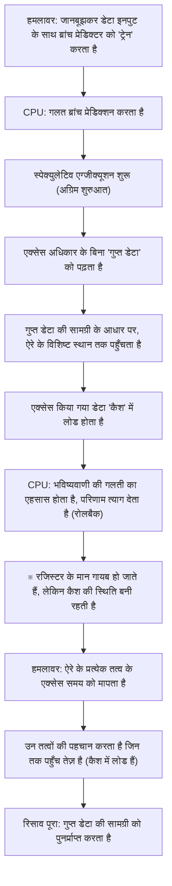

# परिचय

आधुनिक कंप्यूटर प्रणालियों में, CPU (सेंट्रल प्रोसेसिंग यूनिट) सचमुच "मस्तिष्क" की भूमिका निभाता है। जब आप कोई स्मार्टफोन ऐप लॉन्च करते हैं, क्लाउड सर्वर पर विशाल डेटा प्रोसेस करते हैं, या नवीनतम 3D गेम खेलते हैं, तो CPU प्रति सेकंड अरबों गणनाएं चुपचाप करता है।

पिछले कुछ दशकों में, CPU के प्रदर्शन में मूर के नियम के अनुसार, या उससे भी तेज गति से नाटकीय सुधार हुआ है। क्लॉक स्पीड बढ़ाना, मल्टी-कोर प्रोसेसर बनाना, और आर्किटेक्चर में बुनियादी सुधार करने जैसे हर संभव तरीके का उपयोग करके, इंजीनियरों ने "तेज़ और अधिक कुशल" गणना करने के तरीके खोजे हैं।

इन सबके बीच विकसित की गई सबसे नवीन और जटिल तकनीकों में से एक है "स्पेक्युलेटिव एग्जीक्यूशन" (Speculative Execution)। यह तकनीक आधुनिक उच्च-प्रदर्शन वाले प्रोसेसर की अत्यधिक प्रोसेसिंग गति का पूर्ण आधार बन गई है। हालाँकि, 2018 में यह स्पष्ट हो गया कि "स्पेक्युलेटिव एग्जीक्यूशन" नामक यह "जादुई तकनीक" कंप्यूटर विज्ञान के इतिहास में सबसे गंभीर सुरक्षा कमजोरियों में से एक "Spectre (स्पेक्टर)" का मूल कारण थी।

इस लेख में, हम इंजीनियरिंग के दृष्टिकोण से गहराई से जानेंगे कि CPU ने अपनी गति की सीमाओं को कैसे तोड़ा है, स्पेक्युलेटिव एग्जीक्यूशन वास्तव में कैसे काम करता है, और इसने Spectre जैसी भयानक भेद्यता को क्यों जन्म दिया। आइए IT तकनीक में प्रदर्शन (परफॉरमेंस) और सुरक्षा (सिक्योरिटी) के बीच के शाश्वत ट्रेड-ऑफ़ की कहानी को समझें।

# CPU का विकास और "पाइपलाइन प्रोसेसिंग" की सीमाएँ

स्पेक्युलेटिव एग्जीक्यूशन को समझने के लिए, हमें पहले यह देखना होगा कि CPU निर्देशों (इंस्ट्रक्शन) को कैसे प्रोसेस करता है, और इसके मूल आर्किटेक्चर के विकास पर नज़र डालनी होगी।

शुरुआती CPU क्रमिक रूप से काम करते थे: एक निर्देश लेना, उसे डिकोड करना, निष्पादित (execute) करना, और परिणाम को मेमोरी में लिखना। यह बहुत सरल और विश्वसनीय तरीका था, लेकिन दक्षता के मामले में इसमें बहुत बर्बादी थी। जब कोई एक निर्देश निष्पादित हो रहा होता था, तो निर्देशों को पढ़ने वाले सर्किट या परिणाम लिखने वाले सर्किट निष्क्रिय (idle) बैठे रहते थे।

इसलिए "पाइपलाइन प्रोसेसिंग (Pipelining)" का आविष्कार किया गया। कारखाने की असेंबली लाइन की तरह, यह निर्देशों की प्रोसेसिंग को कई चरणों (फेज़) में विभाजित करने और कन्वेयर बेल्ट शैली में उन्हें समानांतर रूप से प्रोसेस करने की एक विधि है। उदाहरण के लिए, यदि इसे 5 चरणों में विभाजित किया जाता है - "इंस्ट्रक्शन फेच", "डिकोड", "एग्जीक्यूट", "मेमोरी एक्सेस", और "राइट बैक" - तो पहले निर्देश के डिकोड होने के दौरान दूसरे निर्देश को फेच करना संभव हो जाता है। इससे CPU की प्रोसेसिंग दक्षता में नाटकीय रूप से सुधार हुआ।

हालाँकि, पाइपलाइन प्रोसेसिंग में "हैज़र्ड (Hazard)" नामक एक समस्या है। विशेष रूप से गंभीर है "कंट्रोल हैज़र्ड (ब्रांच हैज़र्ड)"। प्रोग्रामों में "सशर्त शाखाएं (Conditional Branches, जैसे If स्टेटमेंट)" अक्सर आती हैं - "यदि स्थिति A पूरी होती है, तो प्रक्रिया X पर जाएं, अन्यथा प्रक्रिया Y पर जाएं।" जब CPU किसी सशर्त शाखा निर्देश का सामना करता है, तो उसे यह नहीं पता होता है कि अगली बार कौन सा निर्देश पढ़ना है, जब तक कि शर्त का मूल्यांकन पूरा न हो जाए। यदि वह अगले निर्देश को पढ़ने से पहले मूल्यांकन की प्रतीक्षा करता है, तो पाइपलाइन रुक जाती है (इसे "पाइपलाइन स्टॉल" या "बबल" कहा जाता है), जिससे समानांतर प्रोसेसिंग का सारा फायदा बर्बाद हो जाता है।

# ब्रांच प्रेडिक्शन और "स्पेक्युलेटिव एग्जीक्यूशन" का जन्म

इस पाइपलाइन स्टॉल को रोकने के लिए "ब्रांच प्रेडिक्शन (Branch Prediction)" तकनीक पेश की गई थी। CPU पिछले निष्पादन इतिहास आदि का विश्लेषण करता है और भविष्यवाणी करता है कि "शायद यह शर्त A को पूरा करेगा और प्रक्रिया X पर आगे बढ़ेगा।" आधुनिक CPU में मौजूद ब्रांच प्रेडिक्टर बहुत उत्कृष्ट हैं, जो 90% से अधिक समय सही भविष्यवाणी करते हैं।

और इस ब्रांच प्रेडिक्शन के साथ मिलकर जो काम करता है, वह है इस लेख का मुख्य विषय: "स्पेक्युलेटिव एग्जीक्यूशन (Speculative Execution)"।

स्पेक्युलेटिव एग्जीक्यूशन एक ऐसी तकनीक है जिसमें ब्रांच प्रेडिक्शन के परिणामों के आधार पर, "शर्त के मूल्यांकन के पूरा होने से पहले ही" अनुमानित निर्देशों को अग्रिम रूप से (फ्लाइंग स्टार्ट के साथ) निष्पादित किया जाता है। दूसरे शब्दों में, यह यह मानकर कि "निश्चित रूप से इसी रास्ते पर जाएगा," समय से पहले ही प्रोसेसिंग को आगे बढ़ा देता है।

यदि भविष्यवाणी सही निकलती है, तो मूल्यांकन की प्रतीक्षा करने का पूरा समय बच जाता है, और प्रोग्राम आश्चर्यजनक गति से चलता है। लेकिन, अगर भविष्यवाणी गलत हो जाए तो क्या होगा?

उस स्थिति में, CPU "स्पेक्युलेटिव रूप से निष्पादित परिणामों" को पूरी तरह से त्याग देता है (डिस्कार्ड कर देता है), और अपनी मूल स्थिति में इस तरह वापस आ जाता है (रोलबैक) मानो कुछ हुआ ही न हो। फिर, यह सही शाखा के निर्देशों को फिर से लोड करता है और निष्पादन को फिर से शुरू करता है।

इस तंत्र की तुलना "रेस्तरां में एक कुशल वेटर" से की जा सकती है। एक नियमित ग्राहक को दुकान में आते देख, वेटर सोचता है, "यह ग्राहक हमेशा कॉफी ऑर्डर करता है, इसलिए मैं ऑर्डर लेने से पहले ही कॉफी बनाना शुरू कर दूंगा" (ब्रांच प्रेडिक्शन और स्पेक्युलेटिव एग्जीक्यूशन)। यदि ग्राहक कॉफी ऑर्डर करता है, तो इसे बिना किसी प्रतीक्षा समय के तुरंत परोसा जा सकता है (भविष्यवाणी सफल)। यदि ग्राहक कहता है "मैं आज चाय लूँगा," तो वेटर चुपके से आधी बनी कॉफी फेंक देता है (परिणाम त्यागना) और चाय बनाता है (भविष्यवाणी विफल होने पर फिर से काम करना)। हालांकि कॉफी फेंकने की बर्बादी होती है, लेकिन कुल मिलाकर सेवा की गति काफी तेज़ हो जाती है।

# स्पेक्युलेटिव एग्जीक्यूशन द्वारा लाया गया अभूतपूर्व प्रदर्शन सुधार

जब स्पेक्युलेटिव एग्जीक्यूशन को "आउट-ऑफ-ऑर्डर एग्जीक्यूशन (Out-of-Order Execution)" जैसी उन्नत तकनीकों के साथ जोड़ा जाता है, तो यह आधुनिक CPU आर्किटेक्चर का मूल बन जाता है। प्रोग्राम के लिखे गए क्रम से बंधे बिना, यह निष्पादन योग्य निर्देशों से क्रमिक रूप से प्रोसेसिंग को आगे बढ़ाता है, और भविष्य की प्रक्रियाओं को भी आगे पढ़कर निष्पादित कर देता है। परिणामस्वरूप, CPU के आंतरिक संसाधन हमेशा पूरी क्षमता पर चालू रहते हैं, और गणना प्रदर्शन के उस स्तर को प्राप्त करते हैं जो केवल क्लॉक स्पीड बढ़ाने से कभी हासिल नहीं किया जा सकता था।

पीसी, स्मार्टफोन और सर्वर सहित, लगभग सभी प्रमुख उच्च-प्रदर्शन प्रोसेसर जैसे Intel, AMD, ARM और Apple (Apple Silicon) सक्रिय रूप से इस स्पेक्युलेटिव एग्जीक्यूशन का उपयोग करते हैं। यह कहना अतिशयोक्ति नहीं होगी कि आज हम जो आरामदायक डिजिटल जीवन जी रहे हैं, वह इसी "अग्रिम शुरुआत के जादू" के कारण है।

हालाँकि, प्रोसेसर डिज़ाइनरों को इस बात का एहसास नहीं था कि इस जादू के गंभीर दुष्प्रभाव हो सकते हैं। स्पेक्युलेटिव एग्जीक्यूशन द्वारा "त्यागे गए परिणाम" पूरी तरह से गायब नहीं हुए थे।

# अप्रत्याशित जाल: Spectre भेद्यता की खोज

जनवरी 2018 में, Google Project Zero के शोधकर्ताओं ने प्रोसेसर के इतिहास को हिला देने वाली कमजोरियों की घोषणा की। वे "Meltdown" और "Spectre" हैं। इस लेख में, हम विशेष रूप से Spectre (CVE-2017-5753, CVE-2017-5715) पर ध्यान केंद्रित करेंगे, जो स्पेक्युलेटिव एग्जीक्यूशन के मूलभूत विनिर्देशों के कारण होता है और जिसे ठीक करना बेहद मुश्किल है।

Spectre की भयावहता इस तथ्य में निहित है कि यह किसी "सॉफ्टवेयर बग" के कारण नहीं बल्कि "हार्डवेयर डिज़ाइन" के कारण है। दुर्भावनापूर्ण प्रोग्राम (मैलवेयर) इस स्पेक्युलेटिव एग्जीक्यूशन तंत्र का फायदा उठाकर उन मेमोरी क्षेत्रों को पढ़ सकते हैं जिन तक उनकी पहुंच नहीं होनी चाहिए (जैसे कि ब्राउज़र में सहेजे गए पासवर्ड, एन्क्रिप्शन कुंजियाँ, और अन्य ऐप्स का गुप्त डेटा)।

हालाँकि, जैसा कि पहले बताया गया है, यदि भविष्यवाणी गलत हो जाती है, तो स्पेक्युलेटिव एग्जीक्यूशन के परिणाम "त्याग" दिए जाते हैं और CPU की स्थिति वापस पहले जैसी हो जानी चाहिए। तो फिर डेटा कैसे लीक हो जाता है?

यहाँ कुंजी "कैश मेमोरी (Cache Memory)" की उपस्थिति है।

# कैश मेमोरी और साइड-चैनल अटैक

चूँकि CPU की प्रोसेसिंग गति की तुलना में मुख्य मेमोरी (DRAM) को पढ़ने और लिखने की गति बहुत धीमी होती है, इसलिए CPU के अंदर उच्च गति वाली "कैश मेमोरी (L1, L2, L3 कैश)" होती है। जब CPU मेमोरी से डेटा पढ़ता है, तो डेटा अस्थायी रूप से कैश में सहेज लिया जाता है। अगली बार जब उसी डेटा की आवश्यकता होती है, तो इसे धीमी मुख्य मेमोरी के बजाय तेज़ कैश से पढ़ा जाता है, जिससे प्रोसेसिंग तेज़ हो जाती है।

महत्वपूर्ण तथ्य यह है कि "स्पेक्युलेटिव एग्जीक्यूशन के दौरान पढ़ा गया डेटा भी कैश मेमोरी में रह जाता है।"

Spectre इसी गुण का फायदा उठाता है। हमलावर जानबूझकर ऐसी "सशर्त शाखाएं बनाते हैं जहां भविष्यवाणी गलत होने की संभावना हो"। और स्पेक्युलेटिव एग्जीक्यूशन के दौरान के थोड़े से समय में, वे ऐसे निर्देशों को निष्पादित करवाते हैं जो उस गुप्त डेटा को पढ़ते हैं जिस तक पहुंच नहीं होनी चाहिए।

स्वाभाविक रूप से, CPU को तुरंत भविष्यवाणी की विफलता का एहसास हो जाता है और वह निष्पादन के परिणाम को त्याग देता है। प्रोग्राम की सतह पर, गुप्त डेटा के पढ़े जाने का कोई निशान नहीं बचता है।

हालाँकि, "गुप्त डेटा की सामग्री के निशान" CPU की कैश मेमोरी में रह जाते हैं। हमलावर अपने मेमोरी क्षेत्र के एक्सेस समय को सटीक रूप से मापकर यह अनुमान लगाते हैं कि कैश में क्या बचा है (यह कैश टाइमिंग अटैक नामक एक प्रकार का साइड-चैनल अटैक है)। कैश तक पहुँचना तेज़ होता है, लेकिन जब कैश मिस हो जाता है और मुख्य मेमोरी तक पहुँचना पड़ता है तो यह धीमा होता है। इस सूक्ष्म समय के अंतर को मापकर, स्पेक्युलेटिव एग्जीक्यूशन द्वारा पढ़े गए "गुप्त डेटा" की सामग्री को एक-एक बिट करके चुराया जा सकता है।

## Spectre के तंत्र का विश्लेषण (आरेख)

Spectre के कारण होने वाले डेटा रिसाव की प्रक्रिया को Mermaid आरेख के रूप में दिखाया गया है।

इस हमले के बारे में आश्चर्यजनक बात यह है कि यह ऑपरेटिंग सिस्टम (OS) और सुरक्षा सॉफ़्टवेयर के जाँच तंत्र से पूरी तरह बच निकलता है। ऐसा इसलिए है क्योंकि स्पेक्युलेटिव एग्जीक्यूशन के दौरान संचालन आर्किटेक्चर के बहुत अंदर होता है, और इसे सॉफ़्टवेयर परत से न तो पहचाना जा सकता है और न ही नियंत्रित किया जा सकता है। Spectre (भूत) नाम इस विशेषता के कारण रखा गया है जो बिना कोई निशान छोड़े डेटा चुरा लेता है।

# प्रदर्शन और सुरक्षा के बीच कभी न खत्म होने वाला ट्रेड-ऑफ़

Spectre की घोषणा के बाद, IT उद्योग को अभूतपूर्व प्रतिक्रियाओं का सामना करना पड़ा। दुनिया भर में एक साथ OS अपडेट, ब्राउज़र सुधार और मदरबोर्ड BIOS/UEFI अपडेट (CPU माइक्रोकॉड अपडेट) किए गए।

हालाँकि, ये उपाय (शमन या mitigations) मौलिक समाधान नहीं थे। मुख्य दृष्टिकोण सॉफ़्टवेयर नियंत्रण या ऐसे निर्देशों को सम्मिलित करके (जैसे बैरियर निर्देश) हमलों को रोकना था जो विशिष्ट स्पेक्युलेटिव एग्जीक्यूशन को सीमित करते हैं, लेकिन इसकी एक भारी कीमत चुकानी पड़ी: "प्रदर्शन में गिरावट"।

स्पेक्युलेटिव एग्जीक्यूशन को सीमित करने का मतलब है "CPU की आगे पढ़ने (look-ahead) की क्षमता को रोकना"। सुरक्षा बढ़ाने के लिए पैच लागू करने के परिणामस्वरूप, ऐसी स्थितियां उत्पन्न हुईं जहां सिस्टम की प्रोसेसिंग गति कुछ प्रतिशत से लेकर कभी-कभी दहाई प्रतिशत तक गिर गई। क्लाउड प्रदाताओं और विशाल डेटा केंद्रों का संचालन करने वाली कंपनियों के लिए, प्रदर्शन में इस गिरावट का अर्थ था अथाह आर्थिक नुकसान।

यहाँ, इंजीनियरिंग में अंतिम दुविधा उजागर होती है।

"क्या हमें सुरक्षा का बलिदान करके प्रदर्शन को आगे बढ़ाना चाहिए था?"
"या, क्या हमें प्रदर्शन को छोड़कर पूर्ण सुरक्षा की गारंटी देनी चाहिए?"

Spectre सिर्फ एक बग नहीं था, बल्कि एक ऐसी घटना थी जिसने प्रोसेसर डिज़ाइन में प्रतिमान बदलाव (paradigm shift) को मजबूर कर दिया। पिछले कुछ दशकों में, हार्डवेयर इंजीनियरों ने "सॉफ्टवेयर को तेज़ी से चलाना" सर्वोच्च प्राथमिकता माना था, और सुरक्षा को अंतर्निहित रूप से "वह क्षेत्र माना जाता था जिसके लिए OS और सॉफ़्टवेयर को ज़िम्मेदार होना चाहिए"। हालाँकि, Spectre ने साबित कर दिया कि हार्डवेयर का अनुकूलन (optimization) स्वयं सुरक्षा की नींव को खतरे में डाल सकता है।

# निष्कर्ष: भविष्य के CPU डिज़ाइन की ओर

वर्तमान में, Intel, AMD और ARM जैसी कंपनियाँ नए आर्किटेक्चर विकसित कर रही हैं जो डिज़ाइन स्तर पर Spectre जैसे साइड-चैनल हमलों के लिए प्रतिरोधी हैं। ऐसी तकनीकों पर शोध किया जा रहा है जो स्पेक्युलेटिव एग्जीक्यूशन के लाभों को बनाए रखते हुए हार्डवेयर स्तर पर कैश जैसे साझा संसाधनों के माध्यम से सूचना रिसाव को रोकती हैं।

हालाँकि, पूरी तरह से सुरक्षित स्पेक्युलेटिव एग्जीक्यूशन प्राप्त करना अत्यंत कठिन है। जब तक कंप्यूटर सिस्टम जटिल होते रहेंगे और प्रदर्शन की सीमाओं को चुनौती देते रहेंगे, तब तक नए और अज्ञात दुष्प्रभावों के खोजे जाने की संभावना हमेशा बनी रहेगी।

Spectre के सबक ने हम इंजीनियरों को एक महत्वपूर्ण दृष्टिकोण दिया है। वह यह है कि "प्रदर्शन" और "सुरक्षा" अलग-अलग तत्व नहीं हैं, बल्कि उन्हें सिस्टम के डिज़ाइन चरण से ही एकीकृत (integrate) करके माना जाना चाहिए।

सबसे तेज़ मशीन बनाने की अंतहीन खोज एक ही समय में सबसे सुरक्षित मशीन बनाने की भी खोज है। स्पेक्युलेटिव एग्जीक्यूशन के "जादू" का सामना कैसे करें, और इसे सुरक्षित रूप से कैसे नियंत्रित करें। यह भविष्य में कंप्यूटर विज्ञान की ज़िम्मेदारी संभालने वाले सभी इंजीनियरों के लिए एक अपरिहार्य और महत्वपूर्ण चुनौती बनी रहेगी।
