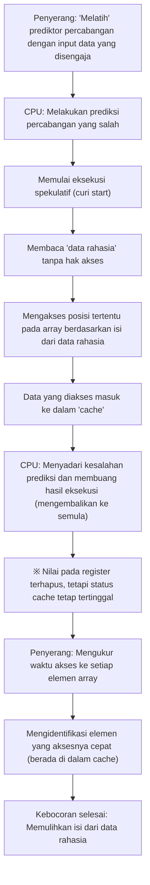

# Pengantar

Dalam sistem komputer modern, CPU (Central Processing Unit) secara harfiah berperan sebagai "otak". Saat membuka aplikasi di ponsel cerdas, memproses data besar di server cloud, atau memainkan game 3D terbaru, CPU tanpa henti melakukan miliaran perhitungan per detik.

Selama beberapa dekade terakhir, performa CPU telah mengalami peningkatan dramatis yang mengikuti atau bahkan melampaui Hukum Moore. Peningkatan frekuensi clock, multi-core, serta perbaikan mendasar pada arsitektur—para insinyur telah memanfaatkan segala cara untuk mencari metode komputasi yang "lebih cepat dan lebih efisien".

Salah satu teknologi paling inovatif dan kompleks yang diciptakan dalam proses ini adalah "Eksekusi Spekulatif" (Speculative Execution). Teknologi ini telah menjadi fondasi mutlak yang mendukung kecepatan pemrosesan luar biasa pada prosesor berkinerja tinggi saat ini. Namun, pada tahun 2018, terungkap bahwa "teknologi ajaib" eksekusi spekulatif ini adalah akar penyebab dari "Spectre", sebuah kerentanan keamanan yang parah dan tercatat dalam sejarah ilmu komputer.

Dalam artikel ini, kita akan menggali lebih dalam dari sudut pandang rekayasa tentang bagaimana CPU mampu menembus batas-batas akselerasi, bagaimana sebenarnya mekanisme eksekusi spekulatif itu, dan mengapa hal tersebut bisa melahirkan kerentanan mengerikan bernama Spectre. Mari kita mengurai kisah tarik-ulur abadi dalam teknologi TI antara performa (kinerja) dan keamanan (security).

# Evolusi CPU dan Batas dari "Pemrosesan Pipeline"

Untuk memahami mekanisme eksekusi spekulatif, pertama-tama kita perlu menengok kembali evolusi arsitektur dasar CPU, yaitu bagaimana CPU memproses instruksi.

CPU generasi awal melakukan proses menerima instruksi tunggal, mendekodenya, mengeksekusinya, lalu menulis hasilnya ke memori secara berurutan satu per satu. Ini adalah metode yang sangat sederhana dan andal, tetapi memiliki pemborosan besar dari segi efisiensi. Pasalnya, saat sebuah instruksi dieksekusi, sirkuit yang membaca instruksi atau sirkuit yang menulis hasil akan menganggur.

Untuk mengatasi hal tersebut, diciptakanlah "Pemrosesan Pipeline" (Pipelining). Layaknya jalur perakitan di pabrik, ini adalah metode yang membagi pemrosesan instruksi ke dalam beberapa tahap (fase) dan memprosesnya secara paralel layaknya ban berjalan. Misalnya, jika dibagi menjadi 5 tahap: "Instruction Fetch", "Decode", "Execute", "Memory Access", dan "Write Back", maka saat instruksi pertama sedang didekode, instruksi kedua sudah bisa di-fetch (diambil). Hal ini meningkatkan efisiensi pemrosesan CPU secara drastis.

Akan tetapi, terdapat masalah yang disebut "Hazard" dalam pemrosesan pipeline. Yang paling parah adalah "Control Hazard" (Branch Hazard). Dalam program, sering kali muncul "Percabangan Kondisional" (seperti pernyataan If) dengan logika "jika memenuhi kondisi A maju ke proses X, jika tidak maka ke proses Y". Saat CPU menemui instruksi percabangan kondisional, ia tidak tahu instruksi mana yang harus dibaca selanjutnya sampai evaluasi kondisi tersebut selesai. Jika harus menunggu evaluasi selesai baru membaca instruksi berikutnya, pergerakan pipeline akan terhenti (ini disebut "Pipeline Stall" atau "Bubble"), dan pemrosesan paralel yang telah dibangun akan menjadi sia-sia.

# Prediksi Percabangan dan Lahirnya "Eksekusi Spekulatif"

Untuk mencegah pipeline stall inilah diperkenalkan teknologi bernama "Prediksi Percabangan" (Branch Prediction). CPU menganalisis riwayat eksekusi di masa lalu dan membuat prediksi seperti, "kemungkinan besar kondisi A terpenuhi dan akan berlanjut ke proses X". Branch Predictor (prediktor percabangan) yang tertanam pada CPU modern sangatlah canggih dan dapat membuat prediksi yang tepat dengan probabilitas di atas 90%.

Lalu, yang bekerja berpasangan dengan prediksi percabangan inilah sang tokoh utama dalam artikel ini, yaitu "Eksekusi Spekulatif" (Speculative Execution).

Eksekusi spekulatif adalah teknologi di mana CPU "curi start" mengeksekusi instruksi dari arah yang diprediksi "sebelum evaluasi kondisi selesai", murni berdasarkan hasil prediksi percabangan. Dengan kata lain, CPU memajukan pemrosesan dengan asumsi dugaan awal "pasti akan lewat jalan ini".

Jika prediksinya benar, waktu tunggu evaluasi bisa dipangkas sepenuhnya, dan program dieksekusi dengan kecepatan yang menakjubkan. Lalu, apa yang terjadi jika prediksinya salah?
Dalam kasus tersebut, CPU membuang semua "hasil yang dieksekusi secara spekulatif" dan mengembalikannya ke keadaan semula seolah-olah tidak terjadi apa-apa. Kemudian, CPU membaca kembali instruksi dari percabangan yang benar dan mengulang eksekusinya.

Mekanisme ini bisa diibaratkan seperti "pelayan restoran yang cekatan". Melihat pelanggan tetap masuk ke toko, sang pelayan berpikir, "Pelanggan ini selalu memesan kopi, jadi sebelum dia memesan, saya akan mulai menyeduh kopi" (prediksi percabangan dan eksekusi spekulatif). Jika pelanggan memesan kopi, kopi bisa segera disajikan dengan waktu tunggu nol (prediksi berhasil). Jika pelanggan berkata, "Hari ini saya mau teh," pelayan tersebut diam-diam akan membuang kopi yang sudah diseduh (membuang hasil) dan menyeduh ulang teh (mengulang akibat prediksi salah). Memang ada pemborosan dari membuang kopi, tetapi jika dilihat secara keseluruhan, kecepatan penyajian menjadi jauh lebih cepat.

# Peningkatan Performa Menakjubkan yang Dibawa oleh Eksekusi Spekulatif

Eksekusi spekulatif ini semakin dikombinasikan dengan teknologi canggih lainnya seperti "Out-of-Order Execution", sehingga menjadi fondasi dasar dari arsitektur CPU modern. Tidak terikat pada urutan penulisan program, instruksi yang bisa dieksekusi akan diproses lebih dulu, bahkan sampai membaca dan mengeksekusi proses di masa depan. Berkat ini, sumber daya internal CPU dapat selalu dijaga pada kapasitas maksimal, mencapai tingkat performa komputasi yang tidak akan mungkin diraih hanya dengan meningkatkan frekuensi clock.

Baik PC, ponsel cerdas, maupun server, hampir semua prosesor berkinerja tinggi utama seperti Intel, AMD, ARM, dan Apple (Apple Silicon) secara aktif mengadopsi eksekusi spekulatif ini. Tidak berlebihan jika dikatakan bahwa kenyamanan kehidupan digital kita saat ini adalah berkat "sihir curi start" ini.

Namun, para perancang prosesor tidak menyadari kemungkinan bahwa sihir ini bisa membawa efek samping yang parah. Ternyata, "hasil yang seharusnya dibuang" oleh eksekusi spekulatif tidaklah menghilang sepenuhnya.

# Perangkap Tak Terduga: Penemuan Kerentanan Spectre

Pada Januari 2018, para peneliti dari Google Project Zero mengumumkan kerentanan yang mengguncang sejarah prosesor. Itu adalah "Meltdown" dan "Spectre". Dalam artikel ini, kita akan secara khusus menyoroti Spectre (CVE-2017-5753, CVE-2017-5715), yang bersumber dari spesifikasi fundamental eksekusi spekulatif dan sangat sulit untuk diperbaiki.

Kengerian Spectre terletak pada fakta bahwa ia disebabkan oleh "desain perangkat keras itu sendiri", dan bukan "bug perangkat lunak". Program jahat dapat memutarbalikkan mekanisme eksekusi spekulatif ini untuk membaca area memori yang seharusnya tidak memiliki hak akses (seperti kata sandi yang disimpan di browser, kunci enkripsi, atau data rahasia dari aplikasi lain).

Namun, seperti yang telah dijelaskan sebelumnya, jika prediksi salah, hasil dari eksekusi spekulatif seharusnya "dibuang" dan kondisi CPU dikembalikan ke semula. Lalu, bagaimana tepatnya data bisa bocor?

Di sinilah keberadaan "Memori Cache" (Cache Memory) menjadi kuncinya.

# Memori Cache dan Serangan Side-Channel

Kecepatan baca-tulis pada memori utama (DRAM) sangat lambat jika dibandingkan dengan kecepatan pemrosesan CPU, oleh karena itu di dalam CPU disematkan "Memori Cache" (Cache L1, L2, L3) berkecepatan tinggi. Saat CPU membaca data dari memori, data tersebut untuk sementara disimpan di dalam cache. Saat data yang sama dibutuhkan lagi nanti, CPU membacanya dari cache yang cepat alih-alih memori utama yang lambat, sehingga mempercepat pemrosesan.

Hal yang penting adalah fakta bahwa "data yang dibaca selama eksekusi spekulatif juga akan tertinggal di dalam memori cache".

Spectre memanfaatkan sifat ini. Penyerang secara sengaja menciptakan "percabangan kondisional yang akan membuat prediksi gagal". Kemudian, dalam waktu sepersekian detik di mana eksekusi spekulatif berlangsung, mereka membuat instruksi dieksekusi sedemikian rupa untuk membaca data rahasia yang seharusnya tidak boleh diakses.
Tentu saja, segera setelah itu CPU akan menyadari kesalahan prediksi dan membuang hasil eksekusinya. Di permukaan program, tidak ada jejak tersisa yang menunjukkan bahwa data rahasia telah dibaca.

Namun, pada memori cache CPU tertinggal "jejak sesuai isi dari data rahasia tersebut". Penyerang menebak apa yang tersisa di dalam cache dengan mengukur secara akurat waktu akses ke area memori mereka sendiri (ini adalah sejenis serangan side-channel yang disebut cache timing attack). Mengakses cache sangatlah cepat, tetapi akan lambat jika terjadi cache miss yang memaksa akses ke memori utama. Dengan mengukur perbedaan waktu yang sangat kecil ini, penyerang dapat mencuri isi dari "data rahasia" yang dibaca oleh eksekusi spekulatif demi satu bit.

## Membedah Mekanisme Spectre (Ilustrasi)

Proses kebocoran data oleh Spectre diilustrasikan dengan diagram Mermaid berikut.

Sisi menakutkan dari serangan ini adalah ia benar-benar dapat menyelinap melewati mekanisme pemeriksaan sistem operasi (OS) dan perangkat lunak keamanan. Sebabnya, operasi selama eksekusi spekulatif terjadi jauh di dalam arsitektur, sehingga tidak bisa dideteksi maupun dikendalikan dari lapisan perangkat lunak. Nama Spectre (hantu) justru diambil dari karakteristiknya yang mampu mencuri data tanpa meninggalkan jejak ini.

# Tarik-Ulur Tanpa Akhir antara Performa dan Keamanan

Setelah pengumuman Spectre, industri TI disibukkan dengan respons yang belum pernah terjadi sebelumnya. Pembaruan OS, perbaikan browser, dan pembaruan BIOS/UEFI motherboard (pembaruan mikrokode CPU) dilakukan serentak di seluruh dunia.

Namun, langkah-langkah mitigasi (penanggulangan) ini bukanlah solusi fundamental. Pendekatan utamanya adalah mencegah serangan melalui kontrol perangkat lunak atau dengan menyisipkan instruksi yang membatasi eksekusi spekulatif tertentu (seperti instruksi barrier), tetapi ini memakan biaya besar: "penurunan performa".

Membatasi eksekusi spekulatif sama artinya dengan "menghentikan tindakan CPU yang membaca lebih jauh". Sebagai akibat dari penerapan patch mitigasi untuk meningkatkan keamanan, kecepatan pemrosesan sistem turun sebesar beberapa persen, hingga puluhan persen pada beberapa kasus. Bagi penyedia cloud atau perusahaan yang mengoperasikan pusat data raksasa, penurunan performa ini berarti kerugian ekonomi yang tak terhitung jumlahnya.

Di sinilah dilema utama dalam dunia rekayasa menjadi begitu jelas terlihat.

"Haruskah kita mengorbankan keamanan demi mengejar performa?"
"Atau haruskah kita mengorbankan performa untuk menjamin keamanan yang mutlak?"

Spectre bukanlah sekadar bug, melainkan peristiwa yang mendesak adanya pergeseran paradigma dalam desain prosesor. Selama beberapa dekade terakhir, insinyur perangkat keras menganggap "menjalankan perangkat lunak dengan cepat" sebagai misi tertinggi, dan menganggap keamanan sebagai "area yang menjadi tanggung jawab OS dan perangkat lunak" secara implisit. Namun, Spectre membuktikan bahwa optimasi perangkat keras itu sendiri bisa mengancam dasar dari keamanan.

# Kesimpulan: Menuju Desain CPU di Masa Depan

Saat ini, berbagai perusahaan seperti Intel, AMD, dan ARM terus mengembangkan arsitektur baru yang pada tingkat desain memiliki ketahanan terhadap serangan side-channel semacam Spectre. Teknologi yang bisa memblokir kebocoran informasi melalui sumber daya berbagi seperti cache di tingkat perangkat keras, sambil tetap mempertahankan manfaat dari eksekusi spekulatif, tengah diteliti.

Meskipun begitu, mewujudkan eksekusi spekulatif yang benar-benar aman sangatlah sulit. Selama sistem komputer terus menjadi kompleks dan terus menantang batas-batas performa, akan selalu ada kemungkinan ditemukannya efek samping baru yang belum diketahui.

Pelajaran dari Spectre memberi para insinyur perspektif penting. Yaitu, "performa" dan "keamanan" bukanlah dua elemen yang terpisah, melainkan harus dipikirkan secara terpadu sejak tahap desain sistem.

Pencarian tiada akhir untuk membuat mesin tercepat adalah sekaligus pencarian untuk membuat mesin yang paling aman. Bagaimana kita menghadapi "sihir" bernama eksekusi spekulatif ini, dan bagaimana cara mengendalikannya dengan aman? Ini akan terus menjadi tugas penting yang tak terelakkan bagi seluruh teknisi yang akan memikul ilmu komputer di masa depan.
