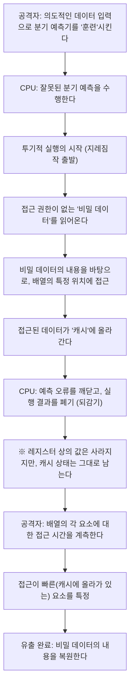

# 인트로덕션

현대의 컴퓨터 시스템에서 CPU(중앙 처리 장치)는 문자 그대로 '두뇌'로서의 역할을 다하고 있습니다. 스마트폰의 앱을 실행할 때, 클라우드 서버에서 방대한 데이터를 처리할 때, 혹은 최신 3D 게임을 플레이할 때, CPU는 1초에 수십억 번이라는 계산을 묵묵히 해내고 있습니다.

지난 수십 년 동안 CPU의 성능은 무어의 법칙에 따라, 혹은 그것을 뛰어넘는 속도로 극적인 향상을 이루어 왔습니다. 클럭 주파수의 향상, 멀티 코어화, 그리고 아키텍처의 근본적인 개량 등, 엔지니어들은 온갖 수단을 동원하여 '더 빠르고, 더 효율적으로' 계산을 수행하는 방법을 모색해 왔습니다.

그 과정에서 탄생한 가장 혁신적이고, 동시에 가장 복잡한 기술 중 하나가 '투기적 실행(Speculative Execution)'입니다. 이 기술은 현대의 고성능 프로세서에서 압도적인 처리 속도를 뒷받침하는 절대적인 기반이 되었습니다. 하지만 2018년, 이 투기적 실행이라는 '마법의 기술'이 컴퓨터 과학 역사에 남을 심각한 보안 취약점 'Spectre(스펙터)'의 근본 원인이라는 사실이 밝혀졌습니다.

본 기사에서는 CPU가 어떻게 고속화의 한계를 돌파해 왔는지, 투기적 실행이란 대체 어떤 구조인지, 그리고 왜 그것이 Spectre라는 무서운 취약점을 낳고 말았는지에 대해 엔지니어링의 관점에서 깊이 파헤쳐 봅니다. 성능(퍼포먼스)과 안전성(보안)이라는, IT 기술에 있어서 영원한 트레이드오프의 이야기를 풀어가 보겠습니다.

# CPU의 진화와 '파이프라인 처리'의 한계

투기적 실행의 구조를 이해하기 위해서는 먼저 CPU가 어떻게 명령을 처리하고 있는지, 그 기본적인 아키텍처의 진화를 되돌아볼 필요가 있습니다.

초기의 CPU는 하나의 명령을 받아 그것을 해독하고, 실행하고, 결과를 메모리에 기록하는 과정을 순서대로 하나씩 수행했습니다. 이는 매우 단순하고 확실한 방법이지만, 효율성 면에서는 큰 낭비가 있었습니다. 어떤 명령이 실행되는 동안 명령을 읽어오는 회로나 결과를 기록하는 회로가 놀고 있었기 때문입니다.

그래서 고안된 것이 '파이프라인 처리(Pipelining)'입니다. 공장의 조립 라인처럼 명령 처리를 여러 단계(스테이지)로 분할하여, 컨베이어 벨트 방식으로 병렬로 처리하는 기법입니다. 예를 들어, '명령 패치', '디코드', '실행', '메모리 액세스', '라이트 백'이라는 5개의 스테이지로 나눈 경우, 첫 번째 명령이 디코드되는 동안 두 번째 명령을 패치하는 것이 가능해집니다. 이로 인해 CPU의 처리 효율은 비약적으로 향상되었습니다.

그러나 파이프라인 처리에는 '해저드(Hazard)'라고 불리는 문제가 존재합니다. 특히 심각한 것이 '제어 해저드(분기 해저드)'입니다. 프로그램에는 "만약 조건 A를 만족하면 처리 X로, 그렇지 않으면 처리 Y로"라는 '조건 분기(If문 등)'가 빈번하게 등장합니다. CPU가 조건 분기 명령을 만났을 때, 조건 판정이 끝날 때까지 다음에 어떤 명령을 읽어와야 할지 알 수 없습니다. 판정을 기다렸다가 다음 명령을 읽어온다면 파이프라인의 움직임이 멈춰버리게 되어(이를 '파이프라인 스톨' 또는 '버블'이라고 부릅니다), 모처럼의 병렬 처리가 헛수고가 되고 맙니다.

# 분기 예측과 '투기적 실행'의 탄생

이러한 파이프라인 스톨을 방지하기 위해 도입된 것이 '분기 예측(Branch Prediction)'이라는 기술입니다. CPU는 과거의 실행 이력 등을 분석하여 "아마도 조건 A를 만족하여 처리 X로 나아갈 것이다"라는 예측을 세웁니다. 현대의 CPU에 탑재된 분기 예측기(Branch Predictor)는 매우 우수하여, 90% 이상의 확률로 올바른 예측을 합니다.

그리고 이 분기 예측과 세트로 작동하는 것이, 본 기사의 주역인 '투기적 실행(Speculative Execution)'입니다.

투기적 실행이란, 분기 예측 결과를 바탕으로 '조건 판정이 끝나기 전'에 예측된 다음 명령을 미리 실행해버리는 기술입니다. 즉, "분명 이 길로 갈 것이다"라고 지레짐작하여 처리를 진행해버리는 것입니다.

만약 예측이 맞았다면, 판정을 기다리는 시간을 통째로 생략한 것이 되어 프로그램은 경이적인 속도로 실행됩니다. 그렇다면, 만약 예측이 틀렸을 경우에는 어떻게 될까요?
그 경우, CPU는 '투기적으로 실행한 결과'를 모두 폐기하고, 마치 아무 일도 없었던 것처럼 원래 상태로 되돌립니다. 그리고 올바른 분기 목적지의 명령을 다시 읽어와 실행을 다시 합니다.

이 구조는 비유하자면 '레스토랑의 유능한 웨이터'와 같습니다. 단골손님이 가게에 들어오는 것을 보고, 웨이터는 "이 손님은 항상 커피를 시키니까, 주문을 받기 전에 커피를 내리기 시작하자"고 생각합니다(분기 예측과 투기적 실행). 만약 손님이 커피를 시키면, 대기 시간 없이 바로 제공할 수 있습니다(예측 성공). 만약 손님이 "오늘은 홍차로 할게요"라고 말한 경우에는, 내리던 커피를 몰래 버리고(결과 폐기) 홍차를 다시 끓입니다(예측 실패에 의한 재실행). 커피를 버리는 낭비는 발생하지만, 전체적으로 보면 제공 속도는 압도적으로 빨라지는 것입니다.

# 투기적 실행이 가져온 경이적인 퍼포먼스 향상

이 투기적 실행은 나아가 '비순차적 명령어 처리(Out-of-Order Execution)' 등의 고도화된 기술과 결합되어, 현대 CPU 아키텍처의 근간을 이루게 되었습니다. 프로그램의 기술 순서에 얽매이지 않고 실행 가능한 명령부터 순차적으로 처리를 진행하며, 나아가 미래의 처리까지 앞서 읽어 실행해버립니다. 이로 인해 CPU의 내부 리소스는 항상 풀 가동 상태를 유지할 수 있게 되었고, 클럭 주파수의 향상만으로는 도저히 도달할 수 없는 수준의 계산 성능을 실현했습니다.

PC, 스마트폰, 서버를 불문하고 Intel, AMD, ARM, Apple(Apple Silicon) 등 거의 모든 주요 고성능 프로세서가 이 투기적 실행을 적극적으로 채택하고 있습니다. 우리가 오늘날 쾌적한 디지털 라이프를 누릴 수 있는 것은 이 '지레짐작의 마법' 덕분이라고 해도 과언이 아닙니다.

하지만 프로세서 설계자들은 이 마법이 심각한 부작용을 초래할 가능성을 깨닫지 못하고 있었습니다. 투기적 실행으로 인해 '폐기되었어야 할 결과'가 완전히 사라지는 것은 아니었던 것입니다.

# 예기치 않은 함정: Spectre 취약점의 발견

2018년 1월, Google Project Zero 연구원들에 의해 프로세서의 역사를 뒤흔들 취약점이 발표되었습니다. 그것이 'Meltdown'과 'Spectre'입니다. 본 기사에서는 특히 투기적 실행의 근본적인 사양에 기인하여 수정이 극히 어려운 Spectre(CVE-2017-5753, CVE-2017-5715)에 초점을 맞춥니다.

Spectre의 무서움은 그것이 '소프트웨어의 버그'가 아니라 '하드웨어의 설계 그 자체'에 기인하고 있다는 점에 있습니다. 악의적인 프로그램이 이 투기적 실행 구조를 역이용함으로써, 본래 접근 권한이 없는 메모리 영역(예를 들어, 브라우저에 저장된 비밀번호, 암호 키, 다른 앱의 비밀 데이터 등)을 읽어내는 것이 가능해진 것입니다.

그러나 앞서 설명했듯이, 예측이 틀렸을 경우 투기적 실행의 결과는 '폐기'되고 CPU의 상태는 원래대로 돌아가야 합니다. 그럼 도대체 어떻게 데이터가 유출되는 것일까요?

여기서 열쇠가 되는 것이 '캐시 메모리(Cache Memory)'의 존재입니다.

# 캐시 메모리와 사이드 채널 공격

CPU의 처리 속도에 비해 메인 메모리(DRAM)의 읽기/쓰기 속도는 매우 느리기 때문에, CPU 내부에는 고속의 '캐시 메모리(L1, L2, L3 캐시)'가 탑재되어 있습니다. CPU가 데이터를 메모리에서 읽어올 때, 그 데이터는 일시적으로 캐시에 저장됩니다. 다음에 같은 데이터가 필요해졌을 때는 느린 메인 메모리가 아닌 고속의 캐시에서 읽어옴으로써 처리를 고속화합니다.

중요한 것은 "투기적 실행 중에 읽어 들인 데이터도 캐시 메모리에는 남아버린다"는 사실입니다.

Spectre는 이 성질을 이용합니다. 공격자는 의도적으로 '예측이 빗나갈 만한 조건 분기'를 만들어냅니다. 그리고 투기적 실행이 이루어지는 짧은 시간 동안, 본래 접근해서는 안 되는 비밀 데이터를 읽어오는 명령을 실행시킵니다.
당연히 CPU는 직후에 예측 실패를 깨닫고 실행 결과를 폐기합니다. 프로그램 겉으로는 비밀 데이터가 읽힌 흔적이 남지 않습니다.

그러나 CPU의 캐시 메모리에는 '비밀 데이터의 내용에 따른 흔적'이 남아 있습니다. 공격자는 자신의 메모리 영역에 대한 접근 시간을 정밀하게 측정함으로써, 캐시에 무엇이 남아있는지를 추측합니다(캐시 타이밍 공격이라고 불리는 사이드 채널 공격의 일종입니다). 캐시에 대한 접근은 빠르지만, 캐시 미스가 발생하여 메인 메모리에 접근하는 경우는 느려집니다. 이 미세한 시간 차이를 계측함으로써, 투기적 실행에 의해 읽힌 '비밀 데이터'의 내용을 1비트씩 빼낼 수 있는 것입니다.

## Spectre의 구조 해부(도해)

Spectre에 의한 데이터 유출 프로세스를 Mermaid 다이어그램으로 나타냅니다.

이 공격의 놀라운 점은 운영 체제(OS)나 보안 소프트웨어의 검사 메커니즘을 완전히 빠져나간다는 것입니다. 왜냐하면 투기적 실행 중의 동작은 아키텍처 깊은 곳에서 이루어지고 있어, 소프트웨어 계층에서는 감지할 수도 통제할 수도 없기 때문입니다. Spectre(유령)라는 이름은 바로 흔적을 남기지 않고 데이터를 빼내는 이 특성에서 지어졌습니다.

# 성능과 보안의 끝나지 않는 트레이드오프

Spectre 발표 후, IT 업계는 전례 없는 대응에 쫓겼습니다. OS 업데이트, 브라우저 수정, 그리고 메인보드의 BIOS/UEFI 업데이트(CPU의 마이크로코드 업데이트)가 전 세계적으로 일제히 진행되었습니다.

그러나 이러한 대책(완화책)은 근본적인 해결책이 아니었습니다. 소프트웨어적인 제어나 특정 투기적 실행을 제한하는 명령(배리어 명령 등)을 삽입하여 공격을 방어하는 접근법이 주를 이루었지만, 여기에는 큰 대가가 따랐습니다. '퍼포먼스 저하'입니다.

투기적 실행을 제한한다는 것은 곧 'CPU의 예측 실행을 멈춘다'는 뜻입니다. 보안을 강화하기 위한 대책 패치를 적용한 결과, 시스템의 처리 속도가 수 %에서 경우에 따라서는 수십 %까지 떨어지는 사태가 발생했습니다. 클라우드 사업자나 거대한 데이터 센터를 운영하는 기업에게 이 퍼포먼스 저하는 헤아릴 수 없는 경제적 손실을 의미했습니다.

여기에 엔지니어링에 있어서 궁극의 딜레마가 부각됩니다.

"우리는 보안을 희생하면서까지 퍼포먼스를 추구했어야 했는가?"
"아니면, 퍼포먼스를 포기하더라도 절대적인 안전성을 담보해야 하는가?"

Spectre는 단순한 버그가 아니라 프로세서 설계에 있어서 패러다임 전환을 강요하는 사건이었습니다. 과거 수십 년 동안 하드웨어 엔지니어는 '소프트웨어를 빠르게 실행하는 것'을 지상 명제로 삼았고, 보안은 'OS나 소프트웨어가 책임져야 할 영역'으로 암묵적으로 간주되었습니다. 그러나 Spectre는 하드웨어 최적화 자체가 보안의 근간을 위협할 수 있음을 증명해버리고 만 것입니다.

# 요약: 앞으로의 CPU 설계를 향해

현재 Intel, AMD, ARM 등 각 기업은 설계 수준에서 Spectre 등의 사이드 채널 공격에 대한 내성을 갖춘 새로운 아키텍처 개발을 진행하고 있습니다. 투기적 실행의 이점을 유지하면서, 캐시 등의 공유 리소스를 통한 정보 유출을 하드웨어 수준에서 차단하는 기술이 연구되고 있습니다.

그러나 완전히 안전한 투기적 실행을 실현하는 것은 극히 어렵습니다. 컴퓨터 시스템이 복잡해지고 성능의 한계에 계속 도전하는 한, 새로운 미지의 부작용이 발견될 가능성은 항상 존재합니다.

Spectre의 교훈은 우리 엔지니어들에게 중요한 관점을 제시해 주었습니다. 그것은 '퍼포먼스'와 '보안'은 별개의 요소가 아니라, 시스템 설계 단계부터 통합해서 생각해야 한다는 점입니다.

가장 빠른 머신을 만들기 위한 끝나지 않는 탐구는, 동시에 가장 안전한 머신을 만들기 위한 탐구이기도 합니다. 투기적 실행이라는 '마법'을 어떻게 마주하고, 어떻게 안전하게 통제해 나갈 것인가. 이는 앞으로의 컴퓨터 과학을 짊어질 모든 기술자에게 피할 수 없는 중요한 과제로 계속 남을 것입니다.
