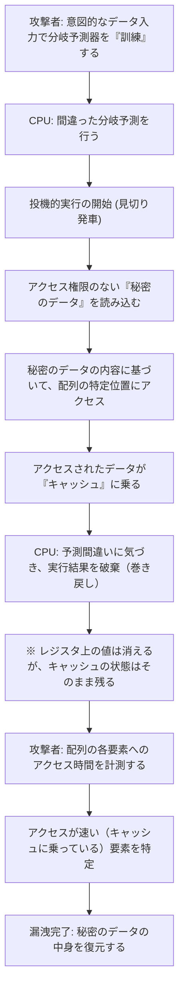

# イントロダクション

現代のコンピューターシステムにおいて、CPU（中央演算処理装置）は文字通り「頭脳」としての役割を果たしています。スマートフォンのアプリを起動するとき、クラウドサーバーで膨大なデータを処理するとき、あるいは最新の3Dゲームをプレイするとき、CPUは1秒間に何十億回という計算を黙々とこなしています。

過去数十年間にわたり、CPUの性能はムーアの法則に従って、あるいはそれを超えるペースで劇的な向上を遂げてきました。クロック周波数の向上、マルチコア化、そしてアーキテクチャの根本的な改良など、エンジニアたちはあらゆる手法を駆使して「より速く、より効率的に」計算を行う方法を模索してきました。

その中で生み出された最も革新的で、かつ最も複雑な技術の一つが「投機的実行（Speculative Execution）」です。この技術は、現代の高性能プロセッサにおける圧倒的な処理速度を支える絶対的な基盤となっています。しかし、2018年、この投機的実行という「魔法の技術」が、コンピューターサイエンスの歴史に残る深刻なセキュリティ脆弱性「Spectre（スペクター）」の根本原因であることが明らかになりました。

本記事では、CPUがいかにして高速化の限界を突破してきたのか、投機的実行とは一体どのような仕組みなのか、そしてなぜそれがSpectreという恐るべき脆弱性を生み出してしまったのかについて、エンジニアリングの視点から深く掘り下げていきます。性能（パフォーマンス）と安全性（セキュリティ）という、IT技術における永遠のトレードオフの物語を紐解いていきましょう。

# CPUの進化と「パイプライン処理」の限界

投機的実行の仕組みを理解するためには、まずCPUがどのように命令を処理しているのか、その基本的なアーキテクチャの進化を振り返る必要があります。

初期のCPUは、一つの命令を受け取り、それを解読し、実行し、結果をメモリに書き込むというプロセスを、順番に一つずつ行っていました。これは非常に単純で確実な方法ですが、効率の面では大きな無駄がありました。ある命令の実行中に、命令を読み込む回路や結果を書き込む回路が遊んでしまっていたからです。

そこで考案されたのが「パイプライン処理（Pipelining）」です。工場の組み立てラインのように、命令の処理を複数のステージ（フェーズ）に分割し、ベルトコンベア式に並行して処理を行う手法です。たとえば、「命令フェッチ」「デコード」「実行」「メモリアクセス」「ライトバック」という5つのステージに分けた場合、1つ目の命令がデコードされている間に、2つ目の命令をフェッチすることが可能になります。これにより、CPUの処理効率は飛躍的に向上しました。

しかし、パイプライン処理には「ハザード」と呼ばれる問題が存在します。特に深刻なのが「制御ハザード（分岐ハザード）」です。プログラムには「もし条件Aを満たせば処理Xへ、そうでなければ処理Yへ」という「条件分岐（If文など）」が頻繁に登場します。CPUが条件分岐の命令に遭遇したとき、条件の判定が終わるまで次にどの命令を読み込めばいいのか分かりません。判定を待ってから次の命令を読み込んでいたのでは、パイプラインの動きが止まってしまい（これを「パイプラインストール」または「バブル」と呼びます）、せっかくの並列処理が無駄になってしまいます。

# 分岐予測と「投機的実行」の誕生

このパイプラインストールを防ぐために導入されたのが「分岐予測（Branch Prediction）」という技術です。CPUは過去の実行履歴などを分析し、「おそらく条件Aを満たして処理Xに進むだろう」という予測を立てます。現代のCPUに搭載されている分岐予測器（Branch Predictor）は非常に優秀で、90%以上の確率で正しい予測を行います。

そして、この分岐予測とセットで働くのが、本記事の主役である「投機的実行（Speculative Execution）」です。

投機的実行とは、分岐予測の結果に基づいて、「条件判定が終わる前」に、予測された先の命令をフライングで実行してしまう技術です。つまり、「きっとこっちの道に進むだろう」と見切り発車で処理を進めてしまうのです。

もし予測が当たっていれば、判定を待つ時間をまるまるカットできたことになり、プログラムは驚異的なスピードで実行されます。では、もし予測が外れていた場合はどうなるのでしょうか？
その場合、CPUは「投機的に実行した結果」をすべて破棄し、あたかも何もなかったかのように元の状態に巻き戻します。そして、正しい分岐先の命令を改めて読み込み、実行をやり直します。

この仕組みは、例えるなら「レストランの有能なウェイター」のようなものです。常連客が店に入ってきたのを見て、ウェイターは「この客はいつもコーヒーを頼むから、注文を聞く前にコーヒーを淹れ始めてしまおう」と考えます（分岐予測と投機的実行）。もし客がコーヒーを頼めば、待ち時間ゼロですぐに提供できます（予測成功）。もし客が「今日は紅茶にする」と言った場合は、淹れかけたコーヒーをこっそり捨てて（結果の破棄）、紅茶を淹れ直します（予測失敗によるやり直し）。コーヒーを捨てる無駄は発生しますが、トータルで見れば提供スピードは圧倒的に速くなるのです。

# 投機的実行がもたらした驚異的なパフォーマンス向上

この投機的実行は、さらに「アウトオブオーダ実行（Out-of-Order Execution）」などの高度な技術と組み合わされることで、現代のCPUアーキテクチャの根幹を成すようになりました。プログラムの記述順序にとらわれず、実行可能な命令から順次処理を進め、さらに未来の処理まで先読みして実行してしまう。これにより、CPUの内部リソースは常にフル稼働状態を維持できるようになり、クロック周波数の向上だけでは到底到達できないレベルの計算性能を実現しました。

PC、スマートフォン、サーバーを問わず、Intel、AMD、ARM、Apple（Apple Silicon）など、ほぼすべての主要な高性能プロセッサがこの投機的実行を積極的に採用しています。私たちが今日、快適なデジタルライフを送ることができているのは、この「見切り発車の魔法」のおかげと言っても過言ではありません。

しかし、プロセッサの設計者たちは、この魔法が深刻な副作用をもたらす可能性に気づいていませんでした。投機的実行によって「破棄されたはずの結果」が、完全に消え去るわけではなかったのです。

# 予期せぬ落とし穴：Spectre脆弱性の発見

2018年1月、Google Project Zeroの研究者らによって、プロセッサの歴史を揺るがす脆弱性が発表されました。それが「Meltdown」と「Spectre」です。本記事では特に、投機的実行の根本的な仕様に起因し、修正が極めて困難であるSpectre（CVE-2017-5753, CVE-2017-5715）に焦点を当てます。

Spectreの恐ろしさは、それが「ソフトウェアのバグ」ではなく「ハードウェアの設計そのもの」に起因している点にあります。悪意のあるプログラムが、この投機的実行の仕組みを逆手に取ることで、本来アクセス権限のないメモリ領域（たとえば、ブラウザに保存されたパスワード、暗号鍵、他のアプリの秘密データなど）を読み取ることが可能になってしまったのです。

しかし、先ほど説明したように、予測が外れた場合、投機的実行の結果は「破棄」され、CPUの状態は元に戻されるはずです。では、一体どのようにしてデータが漏洩するのでしょうか？

ここで鍵となるのが「キャッシュメモリ（Cache Memory）」の存在です。

# キャッシュメモリとサイドチャネル攻撃

CPUの処理速度に対して、メインメモリ（DRAM）の読み書き速度は非常に遅いため、CPU内部には高速な「キャッシュメモリ（L1, L2, L3キャッシュ）」が搭載されています。CPUがデータをメモリから読み込む際、そのデータは一時的にキャッシュに保存されます。次に同じデータが必要になったときは、遅いメインメモリではなく高速なキャッシュから読み込むことで、処理を高速化します。

重要なのは、「投機的実行中に読み込まれたデータも、キャッシュメモリには残ってしまう」という事実です。

Spectreはこの性質を利用します。攻撃者は意図的に「予測が外れるような条件分岐」を作り出します。そして、投機的実行が行われているわずかな時間の間に、本来アクセスしてはいけない秘密のデータを読み込むような命令を実行させます。
当然、CPUは直後に予測の失敗に気づき、実行結果を破棄します。プログラムの表面上は、秘密のデータが読み出された形跡は残りません。

しかし、CPUのキャッシュメモリには「秘密のデータの内容に応じた痕跡」が残されています。攻撃者は、自分のメモリ領域に対するアクセス時間を精密に測定することで、キャッシュに何が残っているのかを推測します（キャッシュのタイミング攻撃と呼ばれるサイドチャネル攻撃の一種です）。キャッシュへのアクセスは高速ですが、キャッシュミスしてメインメモリにアクセスする場合は遅くなります。この微小な時間の差を計測することで、投機的実行によって読み出された「秘密のデータ」の中身を1ビットずつ盗み出すことができるのです。

## Spectreの仕組みを解剖する（図解）

Spectreによるデータ漏洩のプロセスをMermaid図で示します。

この攻撃の驚くべき点は、オペレーティングシステム（OS）やセキュリティソフトのチェック機構を完全にすり抜けてしまうことです。なぜなら、投機的実行中の動作はアーキテクチャの奥深くで行われており、ソフトウェア層からは検知することも制御することもできないからです。Spectre（幽霊）という名前は、まさに痕跡を残さずにデータを盗み出すこの特性から名付けられました。

# 性能とセキュリティの終わらないトレードオフ

Spectreの発表後、IT業界は未曾有の対応に追われました。OSのアップデート、ブラウザの改修、そしてマザーボードのBIOS/UEFIアップデート（CPUのマイクロコード更新）が世界中で一斉に行われました。

しかし、これらの対策（緩和策）は、根本的な解決ではありませんでした。ソフトウェア的な制御や、特定の投機的実行を制限する命令（バリヤー命令など）を挿入することで攻撃を防ぐアプローチが主でしたが、これには大きな代償が伴いました。「パフォーマンスの低下」です。

投機的実行を制限するということは、すなわち「CPUの先読みを止める」ということです。セキュリティを高めるための対策パッチを適用した結果、システムの処理速度が数%から、場合によっては数十%も低下するという事態が発生しました。クラウド事業者や巨大なデータセンターを運用する企業にとって、このパフォーマンス低下は計り知れない経済的損失を意味しました。

ここに、エンジニアリングにおける究極のジレンマが浮き彫りになります。

「我々は、セキュリティを犠牲にしてまでパフォーマンスを追求するべきだったのか？」
「あるいは、パフォーマンスを捨ててでも絶対的な安全性を担保するべきなのか？」

Spectreは単なるバグではなく、プロセッサ設計におけるパラダイムシフトを迫る出来事でした。過去数十年間、ハードウェアエンジニアは「ソフトウェアを速く動かすこと」を至上命題とし、セキュリティは「OSやソフトウェアが責任を持つべき領域」と暗黙のうちに見なされていました。しかしSpectreは、ハードウェアの最適化そのものがセキュリティの根幹を脅かす可能性があることを証明してしまったのです。

# まとめ：これからのCPU設計に向けて

現在、Intel、AMD、ARMなどの各社は、設計レベルでSpectreなどのサイドチャネル攻撃に対する耐性を持たせた新しいアーキテクチャの開発を進めています。投機的実行の恩恵を維持しつつ、キャッシュなどの共有リソースを通じた情報の漏洩をハードウェアレベルで遮断する技術が研究されています。

しかし、完全に安全な投機的実行を実現することは極めて困難です。コンピューターシステムが複雑化し、性能の限界に挑み続ける限り、新たな未知の副作用が発見される可能性は常に存在します。

Spectreの教訓は、私たちエンジニアに重要な視点を与えてくれました。それは、「パフォーマンス」と「セキュリティ」は別個の要素ではなく、システムの設計段階から統合して考えられなければならないということです。

最速のマシンを作るための終わなき探求は、同時に最も安全なマシンを作るための探求でもあります。投機的実行という「魔法」とどう向き合い、どのように安全に制御していくのか。これは、これからのコンピューターサイエンスを担うすべての技術者にとって、避けては通れない重要な課題であり続けるでしょう。
