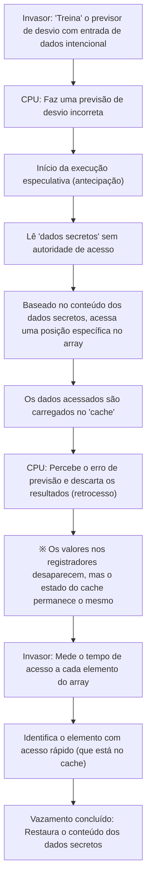

# Introdução

Em sistemas de computador modernos, a CPU (Unidade Central de Processamento) atua literalmente como o "cérebro". Ao iniciar um aplicativo de smartphone, processar enormes quantidades de dados em um servidor na nuvem ou jogar o mais recente jogo 3D, a CPU executa bilhões de cálculos por segundo em silêncio.

Ao longo das últimas décadas, o desempenho das CPUs tem melhorado dramaticamente em um ritmo que segue, ou até supera, a Lei de Moore. Através do aumento da frequência de clock, uso de múltiplos núcleos e melhorias fundamentais na arquitetura, os engenheiros exploraram todos os métodos para encontrar formas de calcular "mais rápido e de forma mais eficiente".

Uma das tecnologias mais inovadoras e complexas criadas nesse processo é a "Execução Especulativa" (Speculative Execution). Essa tecnologia é a base absoluta que sustenta as incríveis velocidades de processamento dos processadores modernos de alto desempenho. No entanto, em 2018, essa "tecnologia mágica" de execução especulativa revelou-se a causa raiz do "Spectre", uma das mais graves vulnerabilidades de segurança na história da ciência da computação.

Neste artigo, aprofundaremos, do ponto de vista da engenharia, como as CPUs ultrapassaram os limites de velocidade, como exatamente funciona a execução especulativa e por que ela criou essa temível vulnerabilidade chamada Spectre. Vamos desvendar a história do eterno conflito na tecnologia de TI entre desempenho (performance) e segurança (security).

# A Evolução da CPU e os Limites do "Processamento em Pipeline"

Para entender o funcionamento da execução especulativa, precisamos primeiro revisar a evolução da arquitetura básica de como a CPU processa instruções.

As primeiras CPUs recebiam uma instrução, a decodificavam, executavam e gravavam o resultado na memória em um processo feito sequencialmente, uma a uma. Esse era um método muito simples e confiável, mas havia um grande desperdício em termos de eficiência. Durante a execução de uma instrução, os circuitos que leem instruções ou gravam resultados ficavam ociosos.

Assim, foi criado o "Processamento em Pipeline" (Pipelining). Como uma linha de montagem de uma fábrica, o processamento de instruções é dividido em vários estágios (fases) e processado paralelamente como uma esteira rolante. Por exemplo, se dividirmos em 5 estágios: "Busca de Instrução" (Fetch), "Decodificação" (Decode), "Execução" (Execute), "Acesso à Memória" (Memory Access) e "Escrita de Retorno" (Writeback), é possível buscar a segunda instrução enquanto a primeira está sendo decodificada. Isso aumentou dramaticamente a eficiência de processamento da CPU.

No entanto, o processamento em pipeline possui problemas chamados "hazards" (riscos). O mais grave é o "Hazard de Controle" (Hazard de Desvio). Em programas, aparecem frequentemente "desvios condicionais" (como a instrução If): "se a condição A for atendida, vá para o processo X, caso contrário, vá para o processo Y". Quando a CPU encontra uma instrução de desvio condicional, ela não sabe qual instrução ler a seguir até que a avaliação da condição seja concluída. Se esperasse a avaliação para ler a próxima instrução, o movimento do pipeline pararia (isso é chamado de "pipeline stall" ou "bolha"), desperdiçando o processamento paralelo.

# Previsão de Desvio e o Nascimento da "Execução Especulativa"

Para evitar essa parada do pipeline, foi introduzida uma tecnologia chamada "Previsão de Desvio" (Branch Prediction). A CPU analisa o histórico de execuções passadas e faz uma previsão: "provavelmente atenderá à condição A e prosseguirá para o processo X". Os previsores de desvio (Branch Predictors) equipados nas CPUs modernas são muito eficientes e fazem previsões corretas com mais de 90% de probabilidade.

E trabalhando em conjunto com essa previsão de desvio está a protagonista deste artigo, a "Execução Especulativa" (Speculative Execution).

A execução especulativa é uma tecnologia que, com base no resultado da previsão de desvio, executa as instruções previstas de forma antecipada, "antes do fim da avaliação da condição". Em outras palavras, ela se adianta e processa com base na intuição de que "provavelmente seguirá por esse caminho".

Se a previsão estiver correta, o tempo de espera pela avaliação é totalmente cortado e o programa é executado a uma velocidade incrível. Mas, o que acontece se a previsão estiver errada?
Nesse caso, a CPU descarta todos os "resultados executados especulativamente" e retrocede para o estado original como se nada tivesse acontecido. Então, ela lê novamente a instrução do desvio correto e refaz a execução.

Esse mecanismo é comparável a um "garçom eficiente em um restaurante". Ao ver um cliente regular entrar na loja, o garçom pensa: "como esse cliente sempre pede café, vou começar a fazer o café antes mesmo de anotar o pedido" (previsão de desvio e execução especulativa). Se o cliente pedir café, pode ser servido imediatamente, com tempo de espera zero (sucesso na previsão). Se o cliente disser "hoje quero chá", o garçom discretamente joga fora o café quase pronto (descarte do resultado) e faz um chá (refaz a execução devido a falha na previsão). Ocorre o desperdício de jogar fora o café, mas, no geral, a velocidade de serviço torna-se muito mais rápida.

# A Incrível Melhoria de Desempenho Trazida pela Execução Especulativa

Essa execução especulativa, combinada com tecnologias avançadas como a "Execução Fora de Ordem" (Out-of-Order Execution), tornou-se a base da arquitetura moderna da CPU. Independentemente da ordem em que o programa foi escrito, ele processa as instruções executáveis em sequência, chegando a prever e executar processos futuros. Como resultado, os recursos internos da CPU podem sempre manter-se em plena capacidade de operação, alcançando um nível de desempenho de computação que não poderia ser alcançado apenas aumentando a frequência do clock.

Seja em PCs, smartphones ou servidores, quase todos os principais processadores de alto desempenho - da Intel, AMD, ARM e Apple (Apple Silicon) - adotam ativamente essa execução especulativa. Pode-se dizer sem exagero que nossa confortável vida digital atual se deve a essa "mágica de se antecipar".

No entanto, os projetistas de processadores não perceberam que essa mágica poderia ter efeitos colaterais severos. Os "resultados que deveriam ter sido descartados" pela execução especulativa não desapareciam completamente.

# A Armadilha Inesperada: Descoberta da Vulnerabilidade Spectre

Em janeiro de 2018, pesquisadores do Google Project Zero anunciaram vulnerabilidades que abalaram a história dos processadores. Elas foram o "Meltdown" e o "Spectre". Neste artigo, focaremos no Spectre (CVE-2017-5753, CVE-2017-5715), que decorre da especificação fundamental da execução especulativa e é extremamente difícil de corrigir.

A gravidade do Spectre reside no fato de que ele não é um "bug de software", mas sim derivado do próprio "projeto de hardware". Programas maliciosos aproveitaram o mecanismo dessa execução especulativa, tornando possível ler áreas de memória para as quais não tinham autoridade de acesso (por exemplo, senhas salvas no navegador, chaves criptográficas, dados secretos de outros aplicativos, etc.).

No entanto, como explicado antes, se a previsão estiver errada, os resultados da execução especulativa são "descartados" e o estado da CPU é revertido. Então, como exatamente ocorre o vazamento de dados?

A chave aqui é a existência da "Memória Cache" (Cache Memory).

# Memória Cache e Ataque de Canal Lateral

Como a velocidade de leitura e gravação da memória principal (DRAM) é muito lenta em relação à velocidade de processamento da CPU, uma "memória cache" (L1, L2, L3 caches) de alta velocidade é incorporada dentro da CPU. Quando a CPU lê dados da memória, esses dados são temporariamente armazenados no cache. A próxima vez que os mesmos dados forem necessários, a CPU os lerá do cache rápido em vez da memória principal lenta, acelerando o processamento.

O importante é o fato de que "os dados lidos durante a execução especulativa também permanecem na memória cache".

O Spectre utiliza essa característica. O invasor cria intencionalmente "desvios condicionais que irão falhar na previsão". Então, no curto período em que a execução especulativa está ocorrendo, ele faz com que seja executada uma instrução que lê dados secretos que não deveriam ser acessados.
Naturalmente, a CPU logo percebe o erro de previsão e descarta os resultados da execução. Na superfície do programa, não resta evidência de que dados secretos foram lidos.

Contudo, "vestígios baseados no conteúdo dos dados secretos" permanecem na memória cache da CPU. O invasor adivinha o que sobrou no cache medindo precisamente o tempo de acesso a sua própria área de memória (isso é um tipo de ataque de canal lateral chamado ataque de tempo de cache). O acesso ao cache é rápido, mas o acesso à memória principal após uma falha de cache é lento. Ao medir essa minúscula diferença de tempo, é possível roubar os conteúdos dos "dados secretos" lidos pela execução especulativa, um bit de cada vez.

## Dissecando o Mecanismo do Spectre (Diagrama)

O processo de vazamento de dados pelo Spectre é demonstrado através do diagrama Mermaid a seguir.

O aspecto surpreendente desse ataque é que ele burla completamente os mecanismos de verificação do sistema operacional (OS) e do software de segurança. Isso ocorre porque o comportamento durante a execução especulativa acontece nas profundezas da arquitetura e não pode ser detectado ou controlado pela camada de software. O nome Spectre (Espectro) foi dado precisamente por essa característica de roubar dados sem deixar rastros.

# O Interminável Conflito entre Desempenho e Segurança

Após o anúncio do Spectre, a indústria de TI correu para dar respostas sem precedentes. Atualizações de sistema operacional, modificações em navegadores e atualizações de BIOS/UEFI de placas-mãe (atualizações de microcódigo de CPU) foram realizadas simultaneamente em todo o mundo.

Porém, essas contramedidas (medidas de mitigação) não foram soluções definitivas. A abordagem principal foi prevenir ataques por meio de controles baseados em software e pela inserção de instruções que limitavam execuvções especulativas específicas (como instruções de barreira), mas isso veio com um grande preço: a "queda no desempenho".

Limitar a execução especulativa significa "parar as antecipações da CPU". Como resultado da aplicação de patches de correção para melhorar a segurança, ocorreram situações em que a velocidade de processamento do sistema caiu de alguns por cento a, em alguns casos, dezenas de por cento. Para provedores de nuvem e empresas operando enormes data centers, essa queda de desempenho representou uma perda financeira incomensurável.

Aí se destacou o dilema definitivo na engenharia.

"Deveríamos ter buscado o desempenho sacrificando a segurança?"
"Ou devemos garantir a segurança absoluta mesmo que isso custe o desempenho?"

O Spectre não foi apenas um bug, mas um evento que forçou uma mudança de paradigma no design de processadores. Nas últimas décadas, os engenheiros de hardware consideravam "fazer o software rodar rápido" como a missão principal e, tacitamente, enxergavam a segurança como uma "área de responsabilidade do SO ou do software". Contudo, o Spectre provou que a própria otimização do hardware tem o potencial de ameaçar a base da segurança.

# Conclusão: Em Direção ao Futuro do Design de CPUs

Atualmente, empresas como Intel, AMD e ARM estão desenvolvendo novas arquiteturas que possuem resistência em nível de design contra ataques de canal lateral como o Spectre. Pesquisas estão sendo conduzidas sobre tecnologias que bloqueiem o vazamento de informações através de recursos compartilhados, como o cache, no nível de hardware, mantendo simultaneamente os benefícios da execução especulativa.

No entanto, é extremamente difícil alcançar uma execução especulativa completamente segura. Enquanto os sistemas de computador se tornarem mais complexos e continuarem a desafiar os limites do desempenho, a possibilidade de descobrir novos efeitos colaterais desconhecidos sempre existirá.

As lições do Spectre forneceram aos engenheiros uma perspectiva importante. É que o "desempenho" e a "segurança" não são elementos separados, mas devem ser pensados de forma integrada desde o estágio de design do sistema.

A busca interminável por criar as máquinas mais rápidas é, ao mesmo tempo, a busca por criar as máquinas mais seguras. Como devemos encarar essa "mágica" chamada execução especulativa e como podemos controlá-la de maneira segura? Este continuará sendo um desafio essencial e inescapável para todos os tecnólogos responsáveis pelo futuro da ciência da computação.
