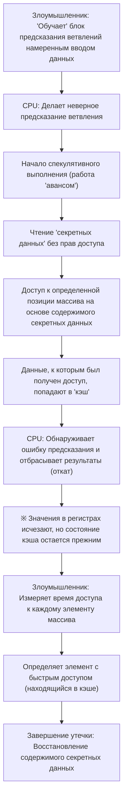

# Введение

В современных компьютерных системах CPU (центральный процессор) буквально играет роль "мозга". Запускаете ли вы приложение на смартфоне, обрабатываете ли огромные объемы данных на облачном сервере или играете в новейшую 3D-игру, CPU молча выполняет миллиарды вычислений в секунду.

В течение последних нескольких десятилетий производительность CPU росла невероятными темпами в соответствии с законом Мура или даже опережая его. Инженеры использовали все возможные методы: повышение тактовой частоты, внедрение многоядерности и фундаментальные улучшения архитектуры, чтобы найти способы выполнять вычисления "быстрее и эффективнее".

Одной из самых инновационных и одновременно сложных технологий, созданных на этом пути, является "Спекулятивное выполнение" (Speculative Execution). Эта технология стала абсолютной основой невероятной скорости обработки данных в современных высокопроизводительных процессорах. Однако в 2018 году выяснилось, что эта "магическая технология" спекулятивного выполнения стала первопричиной "Spectre" — одной из самых серьезных уязвимостей в истории компьютерных наук.

В этой статье мы подробно, с инженерной точки зрения, рассмотрим, как процессоры преодолевали пределы скорости, что именно представляет собой механизм спекулятивного выполнения, и почему он привел к появлению такой ужасающей уязвимости, как Spectre. Давайте разберем историю извечного компромисса в IT-технологиях — между производительностью (performance) и безопасностью (security).

# Эволюция CPU и пределы "Конвейерной обработки"

Чтобы понять механизм спекулятивного выполнения, необходимо сначала вспомнить эволюцию базовой архитектуры и то, как CPU обрабатывает команды.

Ранние процессоры получали одну команду, декодировали её, выполняли и записывали результат в память — всё это строго по очереди, шаг за шагом. Это был очень простой и надежный метод, но с точки зрения эффективности он содержал в себе огромные потери. Во время выполнения одной команды схемы, отвечающие за чтение команд или запись результатов, простаивали без дела.

Поэтому была изобретена "Конвейерная обработка" (Pipelining). Подобно сборочной линии на заводе, процесс обработки команд разделен на несколько стадий (фаз), которые выполняются параллельно, как на конвейере. Например, если разбить процесс на 5 стадий: "выборка инструкции" (fetch), "декодирование" (decode), "выполнение" (execute), "доступ к памяти" (memory access) и "запись результата" (write-back), то пока первая инструкция декодируется, можно осуществлять выборку второй инструкции. Благодаря этому эффективность обработки CPU резко возросла.

Однако у конвейерной обработки есть проблема, называемая "конфликтами" (хазардами, hazards). Особенно серьезным является "конфликт управления" (или конфликт ветвления). В программах часто встречаются "условные переходы" (например, операторы If): "если условие А выполняется, переходим к процессу X, иначе — к процессу Y". Когда CPU сталкивается с командой условного перехода, он не знает, какую следующую команду загружать, пока не завершится оценка условия. Если ждать результата проверки перед загрузкой следующей команды, конвейер остановится (это называется "остановка конвейера" или "пузырек"), и все преимущества параллельной обработки будут потеряны.

# Предсказание ветвлений и зарождение "Спекулятивного выполнения"

Для предотвращения остановок конвейера была внедрена технология "Предсказания ветвлений" (Branch Prediction). Процессор анализирует историю предыдущих выполнений и делает прогноз: "вероятно, условие А будет выполнено, и мы перейдем к процессу X". Блоки предсказания ветвлений (Branch Predictors), встроенные в современные процессоры, невероятно эффективны и делают правильные прогнозы с вероятностью более 90%.

В связке с предсказанием ветвлений работает главный герой этой статьи — "Спекулятивное выполнение" (Speculative Execution).

Спекулятивное выполнение — это технология, при которой на основе результатов предсказания ветвлений процессор "досрочно" выполняет команды по предсказанному пути, "до завершения проверки условия". Иными словами, он начинает обработку "авансом", предполагая: "наверняка мы пойдем по этому пути".

Если предсказание оказалось верным, время ожидания проверки полностью исключается, и программа выполняется с поразительной скоростью. Но что происходит, если предсказание оказалось ошибочным?
В этом случае процессор отбрасывает все "спекулятивно выполненные результаты" и "отматывает" свое состояние назад, как будто ничего не произошло. Затем он заново загружает правильные команды ветвления и повторяет выполнение.

Этот механизм можно сравнить с "компетентным официантом в ресторане". Заметив, что зашел постоянный клиент, официант думает: "Этот клиент всегда заказывает кофе, поэтому я начну готовить его еще до того, как приму заказ" (предсказание ветвлений и спекулятивное выполнение). Если клиент действительно закажет кофе, его подадут моментально, без ожидания (успешное предсказание). Если же клиент скажет: "Сегодня я буду чай", официант тайком выльет уже приготовленный кофе (отмена результатов) и заварит чай (повторное выполнение из-за ошибки предсказания). Хотя небольшие потери из-за вылитого кофе есть, в целом скорость обслуживания значительно возрастает.

# Невероятный прирост производительности от спекулятивного выполнения

Спекулятивное выполнение в сочетании с такими передовыми технологиями, как "Внеочередное выполнение" (Out-of-Order Execution), стало основой архитектуры современных CPU. Процессор не привязан к порядку написания программы — он выполняет те команды, которые готовы к выполнению, и даже заглядывает в будущее, выполняя операции наперед. Благодаря этому внутренние ресурсы CPU постоянно загружены на 100%, что позволяет достичь такого уровня вычислительной мощности, который немыслим только за счет повышения тактовой частоты.

Будь то ПК, смартфоны или серверы, почти все ведущие производители высокопроизводительных процессоров — Intel, AMD, ARM, Apple (Apple Silicon) — активно используют спекулятивное выполнение. Не будет преувеличением сказать, что комфортная цифровая жизнь, которой мы наслаждаемся сегодня, стала возможной благодаря этой "магии досрочных вычислений".

Однако разработчики процессоров не осознавали, к каким серьезным побочным эффектам может привести эта магия. "Отброшенные результаты", полученные в ходе спекулятивного выполнения, на самом деле не исчезали бесследно.

# Неожиданная ловушка: Обнаружение уязвимости Spectre

В январе 2018 года исследователи из Google Project Zero объявили об уязвимостях, потрясших историю процессоров. Ими стали "Meltdown" и "Spectre". В этой статье мы сосредоточимся на Spectre (CVE-2017-5753, CVE-2017-5715), который обусловлен фундаментальными особенностями спекулятивного выполнения и крайне сложен в устранении.

Ужас Spectre заключается в том, что это не "программный баг", а уязвимость, заложенная в "самом аппаратном дизайне". Вредоносная программа, оборачивая механизм спекулятивного выполнения против него самого, получила возможность считывать области памяти, к которым у нее изначально не было доступа (например, пароли, сохраненные в браузере, ключи шифрования, секретные данные других приложений и т.д.).

Но как же происходит утечка данных, если, как было сказано ранее, при ошибке предсказания результаты спекулятивного выполнения "отбрасываются", и состояние процессора возвращается к исходному?

Здесь ключевую роль играет наличие "Кэш-памяти" (Cache Memory).

# Кэш-память и атаки по сторонним каналам

Поскольку скорость чтения и записи в основную память (DRAM) очень низкая по сравнению со скоростью работы CPU, внутри процессора встроена быстрая "кэш-память" (кэши L1, L2, L3). Когда CPU считывает данные из памяти, они временно сохраняются в кэше. При следующем обращении к этим же данным они читаются из быстрого кэша, а не из медленной основной памяти, что ускоряет обработку.

Важно то, что "данные, прочитанные во время спекулятивного выполнения, также остаются в кэш-памяти".

Spectre использует именно это свойство. Злоумышленник намеренно создает "условный переход, предсказание которого обязательно ошибется". И в течение того короткого времени, пока идет спекулятивное выполнение, он заставляет процессор выполнить команду чтения секретных данных, к которым по идее нет доступа.
Естественно, сразу после этого CPU обнаруживает ошибку предсказания и отбрасывает результаты выполнения. На первый взгляд, никаких следов чтения секретных данных не остается.

Однако в кэш-памяти процессора остаются "следы, зависящие от содержимого секретных данных". Тщательно измеряя время доступа к собственным областям памяти, злоумышленник может угадать, что осталось в кэше (это разновидность атаки по сторонним каналам, называемая "cache timing attack"). Доступ к кэшу происходит быстро, а промах кэша (cache miss) и обращение к основной памяти — медленно. Измеряя эту крошечную разницу во времени, можно по одному биту извлекать содержимое "секретных данных", прочитанных в ходе спекулятивного выполнения.

## Анатомия механизма Spectre (Схема)

Процесс утечки данных с помощью Spectre показан на диаграмме Mermaid.

Самое поразительное в этой атаке то, что она полностью обходит механизмы проверки операционной системы (ОС) и антивирусного ПО. Причина в том, что действия во время спекулятивного выполнения происходят глубоко на уровне архитектуры, и программный уровень не может их ни обнаружить, ни контролировать. Название Spectre (призрак) дано именно из-за этой особенности — способности красть данные, не оставляя следов.

# Бесконечный компромисс между производительностью и безопасностью

После объявления о Spectre IT-индустрия столкнулась с беспрецедентной необходимостью принимать меры. По всему миру одновременно проводились обновления ОС, патчи для браузеров и обновления BIOS/UEFI материнских плат (обновление микрокода CPU).

Однако эти меры (смягчения) не были фундаментальным решением. В основном использовались программные методы контроля или вставка специальных команд, ограничивающих определенные виды спекулятивного выполнения (например, барьерные инструкции), что позволяло предотвратить атаки, но сопровождалось огромной ценой: "снижением производительности".

Ограничение спекулятивного выполнения означает, по сути, "остановку забегания CPU вперед". В результате применения патчей безопасности скорость обработки систем упала на несколько процентов, а в некоторых случаях — на десятки процентов. Для облачных провайдеров и компаний, управляющих гигантскими дата-центрами, такое падение производительности означало неисчислимые экономические убытки.

Здесь отчетливо проявилась главная дилемма в инженерии:

"Следовало ли нам гнаться за производительностью в ущерб безопасности?"
"Или же нам следует пожертвовать производительностью ради абсолютной гарантии безопасности?"

Spectre был не просто багом, а событием, потребовавшим смены парадигмы в проектировании процессоров. В течение последних десятилетий инженеры аппаратного обеспечения считали "ускорение работы программного обеспечения" своей главной задачей, а безопасность негласно считалась "зоной ответственности ОС и программ". Однако Spectre доказал, что сама по себе аппаратная оптимизация может угрожать основам безопасности.

# Заключение: К будущему проектирования CPU

В настоящее время компании, такие как Intel, AMD и ARM, разрабатывают новые архитектуры, устойчивые к атакам по сторонним каналам вроде Spectre уже на уровне проектирования. Ведутся исследования технологий, которые аппаратно блокируют утечки информации через общие ресурсы, такие как кэш, сохраняя при этом преимущества спекулятивного выполнения.

Однако создать полностью безопасное спекулятивное выполнение крайне сложно. Пока компьютерные системы становятся сложнее, и мы продолжаем испытывать пределы производительности, всегда будет существовать вероятность обнаружения новых, неизвестных побочных эффектов.

Урок Spectre дал нам, инженерам, важную перспективу. Он показал, что "производительность" и "безопасность" — это не отдельные элементы, они должны рассматриваться комплексно с самого этапа проектирования системы.

Бесконечный поиск способов создания самой быстрой машины — это одновременно и поиск способов создания самой безопасной машины. Как обращаться с этой "магией" спекулятивного выполнения и как безопасно ее контролировать? Это останется неизбежной и важнейшей задачей для всех инженеров, определяющих будущее компьютерных наук.
