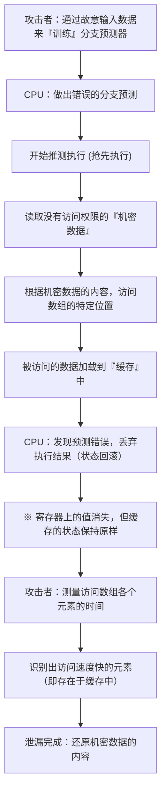

# 引言

在现代计算机系统中，CPU（中央处理器）毫不夸张地扮演着“大脑”的角色。当你启动智能手机应用，或者在云端服务器处理海量数据，亦或是游玩最新的 3D 游戏时，CPU 都在默默地每秒进行着数十亿次的计算。

在过去的几十年里，CPU 的性能遵循甚至超越了摩尔定律，取得了显著的提升。时钟频率的提高、多核化以及架构的根本性改进，工程师们利用一切手段，不断探索如何才能“更快、更高效地”进行计算。

在这个过程中，“推测执行”（Speculative Execution）应运而生，它是最具创新性同时也是最复杂的技术之一。这项技术成为了支撑现代高性能处理器实现压倒性处理速度的绝对基石。然而在 2018 年，人们发现这种推测执行的“魔法技术”正是计算机科学史上最严重的安全漏洞之一——“Spectre（幽灵）”的根本原因。

本文将从工程学的视角深入探讨：CPU 是如何突破加速极限的？推测执行到底是一种怎样的机制？以及它为什么会催生出 Spectre 这样可怕的漏洞。让我们一起揭开 IT 技术中性能（Performance）与安全性（Security）之间永恒的权衡之谜。

# CPU 的进化与“流水线处理”的极限

为了理解推测执行的机制，我们首先需要回顾一下 CPU 处理指令的基础架构进化过程。

早期的 CPU 是按顺序一条一条地执行过程的：接收一条指令，对其进行解码、执行，然后将结果写入内存。这是一种非常简单而可靠的方法，但在效率方面却存在巨大的浪费。因为在执行某条指令时，读取指令的电路或写入结果的电路都在闲置。

于是，“流水线处理”（Pipelining）被发明了出来。就像工厂的装配线一样，它将指令的处理分为多个阶段（Phase），像传送带一样并行处理。例如，如果分为“取指”、“解码”、“执行”、“访存”和“写回”五个阶段，当第一条指令正在解码时，就可以同时提取第二条指令。这使 CPU 的处理效率得到了飞跃性的提升。

然而，流水线处理存在被称为“冒险（Hazard）”的问题。其中最严重的是“控制冒险（分支冒险）”。程序中经常出现“如果满足条件 A，则进入处理 X，否则进入处理 Y”的“条件分支（如 If 语句）”。当 CPU 遇到条件分支指令时，在条件判断完成之前，它不知道下一步该读取哪条指令。如果等到判断完成再读取下一条指令，流水线的运转就会停止（这被称为“流水线停顿”或“气泡”），好不容易实现的并行处理就会被白白浪费。

# 分支预测与“推测执行”的诞生

为了防止这种流水线停顿，引入了“分支预测”（Branch Prediction）技术。CPU 通过分析过去的执行历史等信息，做出“可能满足条件 A 并进入处理 X”的预测。现代 CPU 中搭载的分支预测器（Branch Predictor）非常出色，能够以 90% 以上的准确率做出正确的预测。

而与分支预测协同工作的，正是本文的主角——“推测执行”（Speculative Execution）。

推测执行是一种基于分支预测的结果，在“条件判断完成之前”，就抢先执行被预测的后续指令的技术。也就是说，它见机行事，认为“肯定会走这条路”，然后就开始推进处理。

如果预测准确，那么等待判断的时间将被完全省去，程序将以惊人的速度执行。但是，如果预测失误了会怎样呢？
在这种情况下，CPU 会丢弃所有“推测执行的结果”，并将状态回滚到仿佛什么都没发生过的原始状态。然后，它重新读取正确分支路径上的指令，并重新开始执行。

这种机制可以用“餐厅里能干的服务员”来打个比方。看到常客进店，服务员心想：“这位客人总是点咖啡，不如在点单前就开始泡咖啡吧”（分支预测和推测执行）。如果客人真的点了咖啡，就可以实现零等待，马上端上（预测成功）。如果客人说“今天想喝红茶”，服务员就会偷偷倒掉泡了一半的咖啡（丢弃结果），重新泡红茶（预测失败导致的重做）。虽然倒掉咖啡会造成一些浪费，但从整体来看，上餐速度得到了极大的提升。

# 推测执行带来的惊人性能提升

这种推测执行机制，与“乱序执行”（Out-of-Order Execution）等更高级的技术相结合，构成了现代 CPU 架构的核心。打破程序编写的顺序限制，从可执行的指令开始依次处理，甚至能提前预测并执行未来的操作。这样一来，CPU 的内部资源就能始终保持满负荷运转状态，从而实现了仅靠提高时钟频率根本无法达到的计算性能水平。

无论是 PC、智能手机还是服务器，包括 Intel、AMD、ARM、Apple（Apple Silicon）在内，几乎所有主流的高性能处理器都积极采用了这种推测执行技术。可以说，我们今天能够享受舒适的数字生活，完全归功于这种“抢跑的魔法”。

但是，处理器的设计者们并没有意识到这种魔法可能会带来严重的副作用。因为通过推测执行“本应被丢弃的结果”，并没有完全消失。

# 意想不到的陷阱：Spectre 漏洞的发现

2018 年 1 月，Google Project Zero 的研究人员公布了动摇处理器历史的漏洞，那就是“Meltdown”和“Spectre”。本文将特别聚焦于 Spectre（CVE-2017-5753, CVE-2017-5715），它源于推测执行的底层机制设计，修复起来极其困难。

Spectre 的可怕之处在于，它并非源于“软件缺陷”，而是源于“硬件设计本身”。恶意程序通过反向利用这种推测执行机制，就可以读取原本没有访问权限的内存区域（例如浏览器中保存的密码、加密密钥、其他应用的机密数据等）。

然而，正如前面所解释的，当预测失败时，推测执行的结果应该会被“丢弃”，CPU 的状态也会恢复原样。那么，数据到底是如何泄漏的呢？

这里的关键就在于“高速缓存（Cache Memory）”的存在。

# 高速缓存与侧信道攻击

相对于 CPU 的处理速度，主内存（DRAM）的读写速度非常慢，因此 CPU 内部配备了高速的“缓存（L1, L2, L3 缓存）”。当 CPU 从内存中读取数据时，该数据会被暂时保存在缓存中。下次再需要相同的数据时，不再从缓慢的主内存读取，而是直接从高速缓存中读取，从而加快处理速度。

关键在于这样一个事实：“即使是在推测执行期间读取的数据，也会保留在高速缓存中。”

Spectre 正是利用了这一特性。攻击者故意制造一个“会导致预测失败的条件分支”。然后，在推测执行进行的极短时间内，让其执行一条读取本不应访问的机密数据的指令。
显然，CPU 紧接着就会发现预测失败，并丢弃执行结果。在程序的表面上，不会留下任何机密数据被读取的痕迹。

但是，在 CPU 的缓存中却留下了“与机密数据内容相关的痕迹”。攻击者通过精确测量访问自己内存区域的时间，来推测缓存中留下了什么（这是一种被称为缓存计时攻击的侧信道攻击）。访问缓存的速度很快，但如果缓存未命中而去访问主内存就会变慢。通过测量这种微小的时间差，就可以将推测执行读取出的“机密数据”的内容，逐位（bit）窃取出来。

## 剖析 Spectre 的机制（图解）

我们将使用 Mermaid 图表来展示通过 Spectre 造成数据泄漏的过程。

这种攻击令人震惊的一点在于，它完全绕过了操作系统（OS）和安全软件的检查机制。因为推测执行期间的操作是在架构深处进行的，软件层既无法检测，也无法控制。Spectre（幽灵）这个名字，正是因为它这种能够不留痕迹地窃取数据的特性而得名的。

# 性能与安全之间无休止的权衡

Spectre 公布后，IT 业界被迫做出了史无前例的应对。操作系统的更新、浏览器的修改，以及主板的 BIOS/UEFI 更新（CPU 微代码更新）在全世界范围内同步展开。

然而，这些对策（缓解措施）并不是根本的解决方案。主要是通过软件控制或插入限制特定推测执行的指令（如屏障指令）来防止攻击，但这伴随着巨大的代价——“性能下降”。

限制推测执行，就意味着“停止 CPU 的预读”。应用了提高安全性的补丁后，系统的处理速度出现了几个百分点甚至高达几十个百分点的下降。对于云服务提供商和运营大型数据中心的企业来说，这种性能下降意味着不可估量的经济损失。

在这里，工程学中终极的两难境地凸显了出来。

“我们是否应该以牺牲安全性为代价来追求性能？”
“或者，我们是否应该放弃性能来保证绝对的安全性？”

Spectre 绝不是一个简单的漏洞，而是一个迫使处理器设计发生范式转移的事件。在过去的几十年里，硬件工程师将“让软件运行得更快”作为最高使命，而安全性在潜意识里被视为“操作系统或软件应该负责的领域”。但是，Spectre 证明了硬件优化本身就可能威胁到安全的根基。

# 总结：面向未来的 CPU 设计

目前，Intel、AMD、ARM 等各大公司正在推进新架构的开发，以便在设计层面具备抵御如 Spectre 这种侧信道攻击的能力。研究的重点在于，在保留推测执行优势的同时，通过硬件层面阻断信息经由缓存等共享资源发生泄漏。

然而，实现完全安全的推测执行是极其困难的。只要计算机系统还在不断复杂化，还在不断挑战性能极限，就始终存在发现新的未知副作用的可能性。

Spectre 带来的教训为我们工程师提供了一个重要的视角。那就是，“性能”与“安全”并非两个孤立的元素，而是必须在系统的设计阶段就将其整合考虑。

追求制造最快机器的无尽探索，同时也是追求制造最安全机器的探索。我们将如何面对推测执行这种“魔法”，又该如何安全地控制它？对于所有肩负未来计算机科学重任的技术人员来说，这将是一个无法回避的重要课题。
