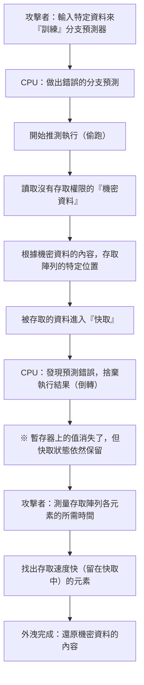

# 簡介

在現代電腦系統中，CPU（中央處理器）名副其實地扮演著「大腦」的角色。無論是啟動智慧型手機的應用程式，還是雲端伺服器處理龐大數據，亦或是遊玩最新的3D遊戲，CPU都在默默地以每秒數十億次的速度進行運算。

在過去幾十年間，CPU的效能遵循著摩爾定律，甚至以超越其預期的驚人速度持續提升。時脈頻率的增加、多核心化以及架構的根本性改良，工程師們無所不用其極地探索「更快、更有效率」的運算方法。

在這些努力中，誕生了最具革命性且最複雜的技術之一，也就是「推測執行（Speculative Execution）」。這項技術是支撐現代高效能處理器擁有壓倒性處理速度的絕對基石。然而，在2018年，這項被稱為「魔法技術」的推測執行，卻被發現是電腦科學史上最嚴重的安全漏洞「Spectre（幽靈）」的根本原因。

本文將從工程角度深入探討CPU是如何突破加速極限、推測執行的機制究竟為何，以及為什麼它會產生Spectre這個可怕的漏洞。讓我們一起解開效能（Performance）與安全性（Security）這個IT技術中永恆取捨的故事。

# CPU的演進與「管線化處理」的極限

為了理解推測執行的機制，我們必須先回顧CPU如何處理指令，以及其基本架構的演進過程。

早期的CPU處理方式是依序完成接收單一指令、解碼、執行，然後將結果寫入記憶體的過程。這是一個非常簡單且可靠的方法，但在效率上卻存在著巨大的浪費。因為在執行某個指令時，負責讀取指令或寫入結果的電路就會處於閒置狀態。

為了解決這個問題，工程師發明了「管線化處理（Pipelining）」。就像工廠的裝配線一樣，將指令的處理分割成多個階段（Phase），並以輸送帶的方式平行處理。例如，若將其分為「擷取指令」、「解碼」、「執行」、「記憶體存取」與「寫回」五個階段，當第一個指令正在解碼時，就可以同時擷取第二個指令。這使得CPU的處理效率獲得了飛躍性的提升。

然而，管線化處理存在著被稱為「危險（Hazard）」的問題。其中最嚴重的就是「控制危險（分支危險）」。程式中頻繁出現「如果滿足條件A就執行處理X，否則執行處理Y」這類的「條件分支（如If語句）」。當CPU遇到條件分支指令時，在條件判定完成前，它無法知道接下來該讀取哪一個指令。如果等待判定完成才讀取下一個指令，管線的運作就會停頓（這被稱為「管線停頓」或「氣泡」），讓好不容易建立的平行處理付諸流水。

# 分支預測與「推測執行」的誕生

為防止這種管線停頓，引入了「分支預測（Branch Prediction）」技術。CPU會分析過去的執行紀錄等資訊，並做出「大概會滿足條件A而進入處理X吧」的預測。現代CPU搭載的分支預測器（Branch Predictor）非常優秀，能夠達到90%以上的預測準確率。

而與這項分支預測搭配運作的，正是本文的主角：「推測執行（Speculative Execution）」。

推測執行是一項基於分支預測結果，在「條件判定結束前」，就搶先執行預測方向指令的技術。換句話說，這是一種「反正應該會走這條路吧」的偷跑行為。

如果預測正確，等待判定的時間就能完全省下，程式便能以驚人的速度執行。但如果預測失敗了呢？
在這種情況下，CPU會將「推測執行的結果」全數捨棄，並且如同什麼事都沒發生過一樣，將狀態倒轉回原點。接著，重新讀取正確的分支指令並再次執行。

這個機制可以比喻為「餐廳裡能幹的服務生」。看到常客走進店裡，服務生心想：「這位客人總是點咖啡，在聽他點餐前就先開始沖咖啡吧」（分支預測與推測執行）。如果客人真的點了咖啡，就能零等待立刻送上（預測成功）。如果客人說：「我今天想喝紅茶」，服務生就會偷偷把沖到一半的咖啡倒掉（捨棄結果），然後重新沖泡紅茶（因預測失敗而重做）。雖然會產生倒掉咖啡的浪費，但從整體來看，提供服務的速度會快上許多。

# 推測執行帶來的驚人效能提升

這項推測執行技術，加上「亂序執行（Out-of-Order Execution）」等更高階的技術，成為了現代CPU架構的基礎。它打破了程式碼編寫順序的限制，從可執行的指令開始依序處理，甚至預先讀取未來的處理步驟並加以執行。這讓CPU內部資源能隨時保持滿載狀態，達到了光靠提升時脈頻率無法企及的運算效能。

無論是個人電腦、智慧型手機或伺服器，不管是Intel、AMD、ARM或Apple（Apple Silicon）等，幾乎所有主要的高效能處理器都積極採用了這項推測執行技術。我們今天能夠享受舒適的數位生活，說是因為這個「偷跑魔法」也不為過。

然而，處理器的設計者們並未察覺到這個魔法可能帶來嚴重的副作用。因為推測執行而「本應被捨棄的結果」，其實並沒有完全消失。

# 意想不到的陷阱：Spectre漏洞的發現

2018年1月，Google Project Zero的研究人員公布了震驚處理器歷史的漏洞。那就是「Meltdown」與「Spectre」。本文將特別聚焦於源自推測執行根本設計、且極難修復的Spectre（CVE-2017-5753, CVE-2017-5715）。

Spectre的可怕之處在於，它不是「軟體的Bug」，而是源於「硬體設計本身」。惡意程式可以利用這個推測執行的機制，讀取原本沒有存取權限的記憶體區域（例如儲存在瀏覽器中的密碼、加密金鑰、其他應用程式的機密資料等）。

但是，正如前面所解釋的，如果預測失敗，推測執行的結果應該會被「捨棄」，CPU的狀態也會恢復原狀。那麼，資料究竟是如何外洩的呢？

這裡的關鍵就在於「快取記憶體（Cache Memory）」的存在。

# 快取記憶體與側信道攻擊

相較於CPU的處理速度，主記憶體（DRAM）的讀寫速度非常緩慢，因此CPU內部搭載了高速的「快取記憶體（L1, L2, L3快取）」。當CPU從記憶體讀取資料時，該資料會被暫存到快取中。下次需要相同資料時，就能從高速的快取而非緩慢的主記憶體讀取，藉此加快處理速度。

重點在於一個事實：「即使在推測執行期間讀取的資料，也會留在快取記憶體中」。

Spectre就是利用了這個特性。攻擊者會刻意製造出「會讓預測失敗的條件分支」。接著，在推測執行發生的那段短暫時間內，讓CPU執行讀取本不該存取的機密資料的指令。
當然，CPU隨後會發現預測失敗，並捨棄執行結果。在程式表面上，不會留下任何機密資料被讀取的痕跡。

然而，CPU的快取記憶體中卻留下了「與機密資料內容相關的痕跡」。攻擊者藉由精確測量自己記憶體區域的存取時間，來推測快取中殘留了什麼資料（這是一種被稱為快取時序攻擊的側信道攻擊）。存取快取的速度很快，但如果發生快取未命中而存取主記憶體，速度就會變慢。透過測量這種微小的時間差，攻擊者就能將推測執行讀取出來的「機密資料」內容，一個位元一個位元地竊取出來。

## 解剖Spectre的機制（圖解）

我們用Mermaid圖來展示Spectre造成資料外洩的過程。

這種攻擊最令人震驚的地方在於，它完全繞過了作業系統（OS）和安全軟體的檢查機制。因為推測執行期間的動作是在架構的最深處進行的，軟體層既無法偵測也無法控制。Spectre（幽靈）這個名字，正是因為它能不留痕跡地竊取資料而得名。

# 效能與安全性永無止境的取捨

Spectre被公布後，IT業界陷入了前所未有的應對危機。全球同時進行了作業系統更新、瀏覽器修改以及主機板BIOS/UEFI更新（CPU微碼更新）。

然而，這些對策（緩解措施）並非根本的解決方案。主流做法是透過軟體控制，或插入限制特定推測執行的指令（如屏障指令）來防止攻擊，但這也帶來了巨大的代價——「效能下降」。

限制推測執行，就等於「停止CPU的預讀」。在套用增強安全性的修補程式後，系統的處理速度下降了幾個百分點，有時甚至高達數十個百分點。對於雲端服務供應商和營運大型資料中心的企業來說，這種效能下降意味著難以估計的經濟損失。

這凸顯了工程領域中終極的兩難困境：

「我們應該為了追求效能而犧牲安全性嗎？」
「或者是為了確保絕對的安全而放棄效能？」

Spectre不僅僅是一個Bug，而是迫使處理器設計發生典範轉移的重大事件。在過去幾十年裡，硬體工程師將「讓軟體跑得更快」視為最高使命，而安全性則被默認為「OS和軟體該負責的領域」。但Spectre證明了硬體最佳化本身，也有可能威脅到系統安全的核心。

# 總結：邁向未來的CPU設計

目前，Intel、AMD、ARM等各大公司正在開發於設計層面上具備抵禦Spectre等側信道攻擊能力的新架構。研究人員正在尋找能夠在維持推測執行優勢的同時，在硬體層級阻斷透過快取等共用資源外洩資訊的技術。

然而，要實現完全安全的推測執行極其困難。只要電腦系統持續複雜化，不斷挑戰效能極限，就永遠有可能發現新的、未知的副作用。

Spectre的教訓提供給工程師們一個重要的觀點：那就是「效能」和「安全性」並非獨立的要素，而是必須從系統設計階段就開始統籌考量的問題。

追求打造最快機器的無止境探索，同時也是打造最安全機器的探索。該如何與推測執行這個「魔法」共處，並安全地控制它？這將是未來所有肩負電腦科學發展的技術人員，都無法迴避的重要課題。
