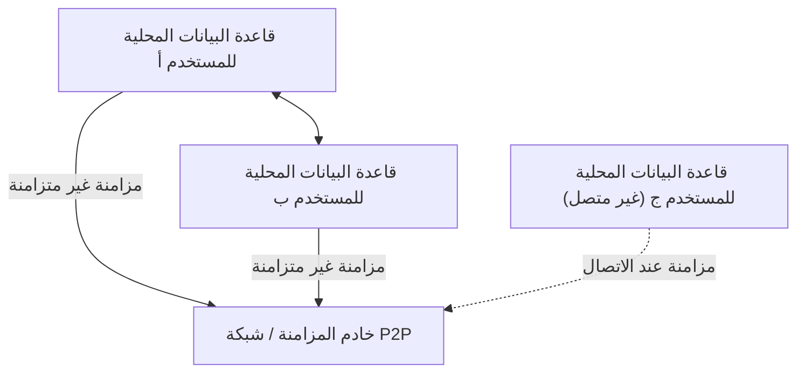
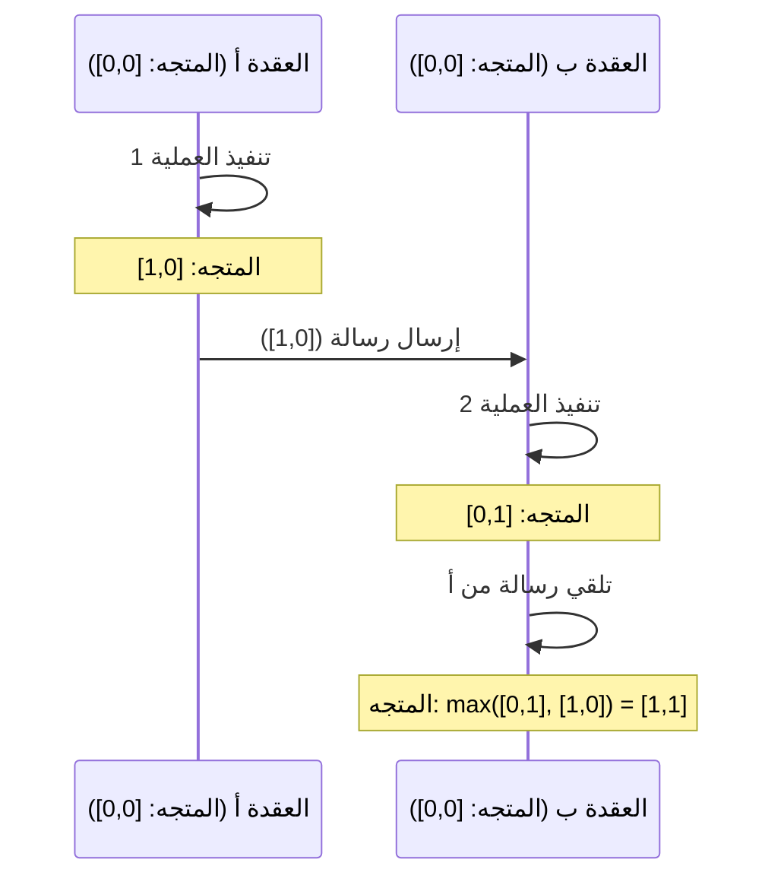

# CRDT والبرمجيات المحلية أولاً: كيف يعمل التحرير التعاوني حتى في وضع عدم الاتصال

في تطوير البرمجيات الحديثة، يحظى نموذج "المحلي أولاً" (Local-First) باهتمام كبير. التطبيقات التقليدية التي تعتمد على "السحابة أولاً" (Cloud-First) تفترض وجود اتصال دائم بالإنترنت، وكانت تعاني من مشكلة التدهور الشديد في تجربة المستخدم في حالة عدم الاتصال بالإنترنت أو في بيئات الشبكة غير المستقرة. النهج المتبع لحل هذه المشكلة هو البرمجيات المحلية أولاً، والأساس التقني الذي يدعم ذلك هو **CRDT (نوع البيانات المنسوخة خالية من التعارض: Conflict-free Replicated Data Type)**.

في هذا المقال، سنتعمق في الشرح بدءًا من الخلفية النظرية لـ CRDT، ومقارنته مع OT (التحويل التشغيلي: Operational Transformation)، والإثبات الرياضي، ودور الساعة المنطقية في الأنظمة الموزعة، وصولاً إلى أمثلة تنفيذية محددة باستخدام JavaScript (مثل Yjs و Automerge).

## 1. عصر البرمجيات المحلية أولاً

البرمجيات المحلية أولاً (Local-First Software) هي بنية معمارية تحتفظ بالبيانات الرئيسية ومنطق التطبيق على جهاز المستخدم، وتقوم بالمزامنة بسلاسة في الخلفية عند توفر اتصال بالشبكة. يتمتع هذا النهج بالمزايا التالية:

*   **العمل الكامل دون اتصال بالإنترنت**: يمكنك مواصلة العمل في أي وقت وفي أي مكان دون الاعتماد على اتصال الشبكة.
*   **زمن انتقال منخفض (Low Latency)**: نظراً لأن قراءة البيانات وكتابتها تكتمل محلياً، لا يوجد تأخير ناتج عن الاتصال بالسحابة.
*   **الخصوصية والأمان**: نظراً لأن البيانات يتم حفظها محلياً، يتمتع المستخدمون بالتحكم الكامل في بياناتهم.
*   **التحرير التعاوني السلس**: يتم دمج التغييرات التي تم إجراؤها دون اتصال بالإنترنت تلقائياً دون تعارض مع تغييرات المستخدمين الآخرين عند الاتصال بالإنترنت.



ما يحقق هذا "الدمج التلقائي بدون تعارض" هو CRDT. في الأساليب التقليدية، كان حل تعارض التحرير المتزامن صعبًا للغاية، ولكن CRDT يحل هذه المشكلة بأناقة بناءً على أسس رياضية.

## 2. الاختلافات عن OT (التحويل التشغيلي) والقيود

قبل ظهور CRDT، كان المعيار الفعلي للتحرير التعاوني (التعاون في الوقت الفعلي) هو **OT (التحويل التشغيلي: Operational Transformation)**. تعتمد أنظمة التحرير التعاوني المبكرة مثل Google Docs و Etherpad على OT.

### كيف يعمل OT
OT هي تقنية يرسل فيها كل مستخدم "العمليات" (Operations) التي قام بها إلى الخادم، ويقوم الخادم بتحويل (Transform) هذه العمليات للحفاظ على حالة متسقة عبر جميع العملاء.
على سبيل المثال، إذا قام المستخدم أ بإدراج "X" في الفهرس 1، وفي نفس الوقت قام المستخدم ب بإدراج "Y" في الفهرس 1، فإن تطبيقها كما هي سيؤدي إلى حالة غير متسقة. يحدد الخادم ترتيب هذه العمليات ويمنع عدم الاتساق عن طريق إزاحة (تحويل) فهرس العمليات التي يتم تطبيقها لاحقاً.

### قيود OT
على الرغم من أن OT تقنية قوية، إلا أن لديها نقطة ضعف قاتلة تتمثل في أن تعقيدها كنظام موزع عالٍ للغاية.
*   **حتمية الخادم المركزي**: لا غنى عن خادم مركزي (نقطة الحقيقة الوحيدة: Single Point of Truth) لترتيب العمليات وتحويلها. إنه غير مناسب للاتصالات التامة من نظير إلى نظير (P2P) أو حالات الاستخدام المحلية أولاً حيث يتم دمج التغييرات من الأجهزة التي كانت غير متصلة بالإنترنت لعدة أيام لاحقاً.
*   **انفجار الحالة وتعقيد الخوارزمية**: مع زيادة أنواع العمليات (الإدراج، الحذف، تغيير التنسيق، وما إلى ذلك)، يزداد عدد مجموعات العمليات (مصفوفة التحويل) بشكل هائل. من الصعب للغاية تنفيذ وإثبات دوال التحويل بشكل صحيح لجميع المجموعات.

في المقابل، لا يتطلب CRDT خادماً مركزياً ويتميز بخاصية التلاقي إلى نفس الحالة في النهاية (الاتساق النهائي القوي: Strong Eventual Consistency) حتى لو تم تطبيق العمليات بأي ترتيب.

## 3. النظرية الأساسية لـ CRDT: الإثبات الرياضي والمجموعات المرتبة جزئياً

CRDT ليس "هيكل بيانات لا تحدث فيه تعارضات". بل هو "هيكل بيانات يمكنه حل التعارضات تلقائياً وبشكل حتمي دون اتفاق مسبق حتى في حالة حدوثها". لتحقيق ذلك، يستخدم CRDT الخصائص الرياضية.

يمكن تقسيم CRDT بشكل عام إلى نوعين: **CvRDT (نوع البيانات المنسوخة المتقاربة: القائم على الحالة)** و **CmRDT (نوع البيانات المنسوخة التبادلية: القائم على العمليات)**.

### CvRDT (CRDT القائم على الحالة)

يرسل CvRDT ويستقبل "الحالة نفسها" لهيكل البيانات عبر الشبكة، ويدمج الحالة المحلية مع الحالة المستلمة باستخدام دالة الدمج (Merge Function).
لكي تعمل دالة الدمج هذه بشكل صحيح، يجب أن تشكل مجموعة حالات هيكل البيانات **مجموعة مرتبة جزئياً (Partially Ordered Set / Join Semilattice)**، ويجب أن تستوفي دالة الدمج الخصائص الرياضية الثلاث التالية.

1.  **قانون التبادل (Commutativity)**: `merge(A, B) = merge(B, A)`
    *   بغض النظر عن الترتيب الذي يتم به دمج الحالة أ والحالة ب، ستكون النتيجة هي نفسها.
2.  **قانون التجميع (Associativity)**: `merge(merge(A, B), C) = merge(A, merge(B, C))`
    *   عند دمج ثلاث حالات أو أكثر، بغض النظر عن المجموعة التي يتم دمجها أولاً، ستكون النتيجة هي نفسها.
3.  **تساوي القوى (Idempotence)**: `merge(A, A) = A`
    *   بغض النظر عن عدد مرات دمج نفس الحالة، لا تتغير النتيجة (تتحمل تكرار الإرسال في الشبكة).

**مثال: العداد المتزايد فقط (Grow-Only Counter / G-Counter)**
أحد أبسط أنواع CvRDT هو العداد الذي يمكن زيادته فقط. تحتفظ كل عقدة بزوج (متجه) من المعرف الخاص بها وقيمة العد.
الحالة أ: `[عقدة 1: 2، عقدة 2: 1]`
الحالة ب: `[عقدة 1: 2، عقدة 2: 3، عقدة 3: 1]`
تعتمد دالة الدمج القيمة القصوى لكل معرف عقدة (تستوفي الدالة `max()` قانون التبادل والتجميع وتساوي القوى).
النتيجة: `[عقدة 1: 2، عقدة 2: 3، عقدة 3: 1]`

### CmRDT (CRDT القائم على العمليات)

يبث CmRDT "العمليات" (Operations) إلى الشبكة بدلاً من الحالة. يتم إجراء المزامنة عن طريق تطبيق العمليات المستلمة على الحالة المحلية.
لكي يكون CmRDT صالحاً، يجب أن تستوفي طبقة الشبكة الشروط التالية، أو يجب ضمانها في جانب هيكل البيانات.

1.  **قابلية تبديل العمليات (Commutativity)**: بالنسبة لأي عمليتين متزامنتين `op1` و `op2`، يجب أن تكون نتيجة التطبيق هي نفسها بغض النظر عن الترتيب.
2.  **ضمان الإرسال مرة واحدة بالضبط (Exactly-Once)**: يجب تسليم جميع العمليات مرة واحدة بالضبط. ومع ذلك، من خلال جعل العمليات متساوية القوى (Idempotent)، يمكن تشغيلها حتى مع التوصيل مرة واحدة على الأقل (At-Least-Once) (مع التكرار).
3.  **ضمان الترتيب السببي (Causal Ordering)**: إذا كانت العملية أ هي سبب العملية ب، فيجب تطبيق أ قبل ب في جميع النسخ.

يتميز CmRDT بميزة انخفاض حجم حركة مرور الشبكة (لأنه يرسل فروق العمليات فقط)، ولكنه يعتمد على بنية أساسية للمراسلة (مثل Vector Clock الموضح أدناه) لضمان الترتيب السببي.

## 4. ساعات الأنظمة الموزعة: أهمية الساعة المنطقية

في CRDT، وخاصة في ترتيب النصوص في التحرير التعاوني وضمان الترتيب السببي في CmRDT، من المهم للغاية معرفة "متى وأي عملية تم إجراؤها" بدقة.
ومع ذلك، في الأنظمة الموزعة، من المستحيل مزامنة الساعات المادية (Wall-clock time) لكل جهاز بشكل كامل (حتى مع استخدام NTP، قد يكون هناك انحراف بضعة أجزاء من الألف من الثانية إلى بضع ثوانٍ).

لحل هذه المشكلة، يتم استخدام **الساعة المنطقية (Logical Clock)**، التي لا تسجل الوقت المادي ولكن "تسلسل الأحداث (السببية)".

### ساعة لامبورت (Lamport Clock)
إنها الساعة المنطقية الأساسية التي ابتكرها ليسلي لامبورت.
تحتفظ كل عقدة بقيمة عدد صحيح مفردة (عداد) وتقوم بتحديثها وفقاً للقواعد التالية.
1.  في كل مرة يقع فيها حدث محلياً، قم بزيادة العداد بمقدار 1.
2.  عند إرسال رسالة، قم بتضمين قيمة العداد الحالية في الرسالة.
3.  عند تلقي رسالة، قم بتحديث العداد الخاص بها إلى `max(العداد الخاص بها، العداد المستلم) + 1`.

يضمن هذا العلاقة السببية: "إذا كان الحدث أ هو سبب الحدث ب، فإن قيمة ساعة أ < قيمة ساعة ب". ومع ذلك، لا يمكن حساب العلاقة السببية بشكل عكسي من قيمة الساعة (حجم قيم الساعة للأحداث المتزامنة لا معنى له).

### ساعة المتجه (Vector Clock)
ساعة المتجه تعوض نقاط ضعف ساعة لامبورت وتسمح بتحديد العلاقة السببية الكاملة (أو العلاقة المتزامنة) بين الأحداث.
بدلاً من عداد واحد، فإنها تحتفظ بمصفوفة (متجه) من العدادات لجميع العقد في النظام.

عيبها هو أن حجم البيانات يتضخم مع زيادة عدد العقد، لكنها تستخدم على نطاق واسع في أنظمة التحكم في الإصدار (مثل اكتشاف التعارضات في DynamoDB). في خوارزميات CRDT الحديثة، يتم تحديد الترتيب بكفاءة عن طريق استخدام متغيرات من Vector Clock أو عن طريق تضمين العلاقات السببية في هيكل البيانات نفسه (مثل المؤشرات بين عقد CRDT).



## 5. التطبيق العملي في JavaScript: Yjs و Automerge

بالإضافة إلى النظرية، أصبح التطوير الفعلي باستخدام CRDT سهلاً للغاية في السنوات الأخيرة. في نظام JavaScript البيئي، تعد المكتبتان **Yjs** و **Automerge** المعيار الفعلي لـ CRDT.

### Yjs: مزامنة سريعة للنصوص والنصوص المنسقة

يتمتع Yjs بأداء استثنائي ويوفر روابط رسمية للعديد من المحررات مثل ProseMirror و Quill و Monaco Editor. إذا كنت تقوم بإنشاء تحرير تعاوني للنصوص (مثل استنساخ Google Docs)، فإن Yjs هو خيارك الأول.

داخلياً في Yjs، يتم تمثيل البيانات كقائمة مرتبطة ثنائية الاتجاه مسطحة، وكل عنصر له معرف فريد (زوج من معرف العميل والساعة المنطقية). هذا يسمح بإدراج العناصر وحذفها بسرعة فائقة.

**مثال تطبيقي بسيط باستخدام Yjs (Node.js/المتصفح)**

```javascript
import * as Y from 'yjs'

// تهيئة المستند
const doc1 = new Y.Doc()
const doc2 = new Y.Doc()

// إنشاء نوع النص للمشاركة
const text1 = doc1.getText('myText')
const text2 = doc2.getText('myText')

// إدراج النص من قبل المستخدم 1
text1.insert(0, 'Hello ')
console.log('User 1 text:', text1.toString()) // "Hello "

// مزامنة الحالة (تتم عادة عبر WebRTC أو WebSocket)
// الحصول على تغييرات doc1 (Update)
const updateFromDoc1 = Y.encodeStateAsUpdate(doc1)

// تطبيق التغييرات على مستند المستخدم 2 (دمج)
Y.applyUpdate(doc2, updateFromDoc1)
console.log('User 2 text:', text2.toString()) // "Hello "

// حدوث تعارضات وحلها التلقائي بسبب التحرير المتزامن
// يقوم المستخدم 1 والمستخدم 2 بالتحرير في نفس الوقت أثناء عدم الاتصال بالإنترنت
text1.insert(6, 'World')
text2.insert(6, 'CRDT')

// تنفيذ المزامنة
const update1 = Y.encodeStateAsUpdate(doc1)
const update2 = Y.encodeStateAsUpdate(doc2)
Y.applyUpdate(doc2, update1)
Y.applyUpdate(doc1, update2)

// ستتقارب كلتا العقدتين في النهاية إلى نفس الحالة النهائية بالضبط (Strong Eventual Consistency)
console.log('Merged User 1 text:', text1.toString()) // "Hello WorldCRDT" أو "Hello CRDTWorld"
console.log('Merged User 2 text:', text2.toString()) // "Hello WorldCRDT" أو "Hello CRDTWorld" (تطابق تام مع User 1)
```

النقطة القوية في Yjs هي أنه مضمون رياضياً أن تتطابق الحالة النهائية دائماً حتى إذا استمرت هذه التغييرات (Update) (تم حفظها في IndexedDB وما إلى ذلك) أو تم إرسالها إلى عميل آخر بأي ترتيب وفي أي وقت عبر شبكة P2P.

### Automerge: مزامنة الحالة العامة المستندة إلى JSON

Automerge هي مكتبة CRDT متخصصة في مزامنة هياكل الكائنات الشبيهة بـ JSON (الكائنات المتداخلة، المصفوفات، النصوص). يتوافق جيداً مع أطر عمل الواجهة الأمامية مثل React، وهو مناسب لتحويل حالة التطبيق (State) بأكملها إلى نمط "محلي أولاً".

يوفر Automerge إدارة حالة غير قابلة للتغيير (Immutable) ويحتفظ بجميع محفوظات الحالة مثل Redux، لذلك من الممكن أيضاً تنفيذ ميزات متقدمة مثل "السفر عبر الزمن لسجل التغيير" و"تفرع ودمج الفروع" الشبيهة بـ Git.

**مثال على مزامنة كائنات JSON باستخدام Automerge**

```javascript
import * as Automerge from '@automerge/automerge'

// تهيئة المستند
let doc1 = Automerge.init()

// إجراء تغييرات على المستند (يتم إرجاع مستند جديد بشكل غير قابل للتغيير)
doc1 = Automerge.change(doc1, 'Initialize todo list', doc => {
  doc.todos = []
  doc.todos.push({ title: 'Buy milk', done: false })
})

// استنساخ المستند (بافتراض أنه تم نسخه إلى جهاز آخر)
let doc2 = Automerge.clone(doc1)

// التحرير المتزامن أثناء عدم الاتصال
doc1 = Automerge.change(doc1, 'Mark as done', doc => {
  doc.todos[0].done = true
})

doc2 = Automerge.change(doc2, 'Add another task', doc => {
  doc.todos.push({ title: 'Read a book', done: false })
})

// الدمج عند العودة إلى الاتصال
let finalDoc = Automerge.merge(doc1, doc2)

console.log(JSON.stringify(finalDoc.todos, null, 2))
/* النتيجة (يتم دمج كلا التغييرين دون تعارض):
[
  {
    "title": "Buy milk",
    "done": true
  },
  {
    "title": "Read a book",
    "done": false
  }
]
*/
```

## 6. الخلاصة والتوقعات المستقبلية

CRDT هي تقنية سحرية لتحقيق البرمجيات المحلية أولاً. إنها تحررنا من حل التعارضات المعقد (OT) بواسطة خوادم مركزية، وتوفر بنية متوافقة للغاية مع P2P وحوسبة الحافة (Edge Computing).

من ناحية أخرى، لدى CRDT أيضاً تحديات.
*   **تضخم الذاكرة والتخزين**: نظراً لضرورة الاحتفاظ بسجل التغيير والعناصر المحذوفة (Tombstone)، يتضخم حجم المستند بمرور الوقت (تتقدم الأبحاث في تقنية جمع القمامة - Garbage Collection).
*   **نتائج دمج غير مقصودة**: مثل تداخل السلاسل، هناك حالات يتم فيها إنشاء سلاسل غير مفهومة للبشر حتى لو تقاربت بشكل صحيح من الناحية الرياضية.

ومع ذلك، مع نضوج مكتبات مثل Yjs و Automerge، يتم وضع حلول عملية لهذه التحديات. لقد اعتمدت التطبيقات الحديثة التي تسعى إلى أقصى حد من تجربة المستخدم، مثل Figma و Linear و Notion، بالفعل مفهوم البنية المعمارية المحلية أولاً و CRDT.

مع ترسيخ "المحلي أولاً" كبنية قياسية لتطبيقات الويب في المستقبل، سيصبح CRDT نموذجاً أساسياً يجب على جميع المطورين تعلمه.
